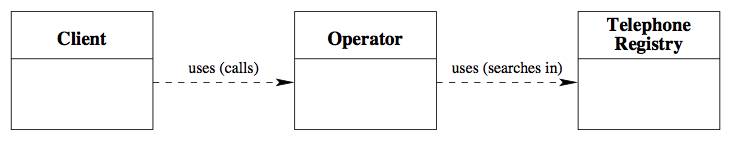

# 클래스 다이어그램

클래스와 클래스 간의 관계를 명시적으로 만들기 위해 **클래스 다이어그램(class diagram)**을 사용할 수 있습니다.

- 각 *class* 는 클래스 이름을 포함하는 직사각형으로 표시된다.
- 클래스간의 *relations* 는 화살표로 표시된다. 이런 화살표는 일반적인 사용 관계와 같이 단순화된 형태로 클래스 간의 관계를 나타낸다.
- 클래스의 속성(properties)는 표시하지 않는다.

_예시:_ Call Center 어플리케이션의 클래스 다이어그램

클래스 다이어그램은 소프트웨어 설계에 일반적으로 사용됩니다. 예를 들어 소프트웨어 설계의 사실상 표준 형식인 UML (Unified Modeling Language)을 사용하면 매우 정교한 클래스 다이어그램을 개발할 수 있습니다.

