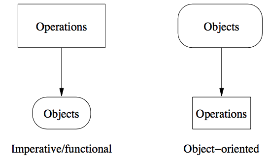

# 프로그래밍 패러다임

객체(objects)와 작업(operations)이란 두 가지 기본 측면을 강조하는 방식이 다른 여러 프로그래밍 패러다임이 있다.

주요 프로그래밍 패러다임은 다음과 같다.
1. **필수(imperative)** : 계산 상태를 변경하는 actions/commands/instructions 으로 의도된 작업에 중점을 둡니다. 객체는 계산에 기능적이다.
2. **기능적(functional)** : 결과를 계산하는 함수로 의도된 작업에 중점을 둔다. 객체는 계산에 기능적이다.
3. **객체 지향(object oriented)** : 전체적으로 관심 영역을 나타내는 객체에 중점을 둔다. 작업은 표현에 기능적이다.

일반적으로 프로그램에서는 다양한 프로그래밍 패러다임이 사용된다. 따라서 프로그래밍 언어는 다양한 패러다임에 대한 지원을 제공한다. 