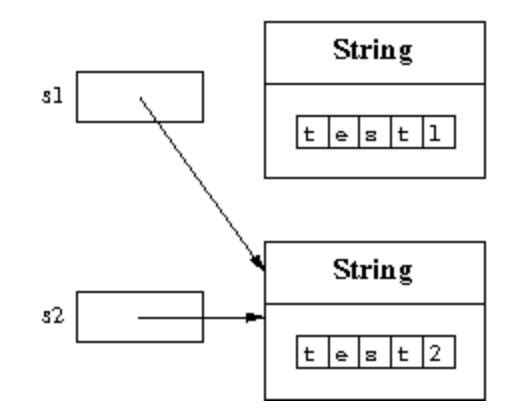

# 객체의 접근성

다음 예시를 고려.
```java
String s1 = new String("test1");
String s2 = new String("test2");
s1 = s2;
```

`s1`, `s2`에 대한 참조는 처음에는 새로 생성된 두 객체에 대한 참조이다. `s1 = s2` 대입문에서 `s1` 참조를 `s2` 참조와 동일하게 설정하고 `"test1"`에 대한 참조는 손실된다.



프로그램에 의해 **"손실(lost)"** 된 객체가 사용하는 메모리를 복구하는 작업을 **가비지 컬렉션(garbage collection)** 이라고 한다. Java에서는 이러한 작업을 Runtime System(JVM)에서 자동으로 수행된다.