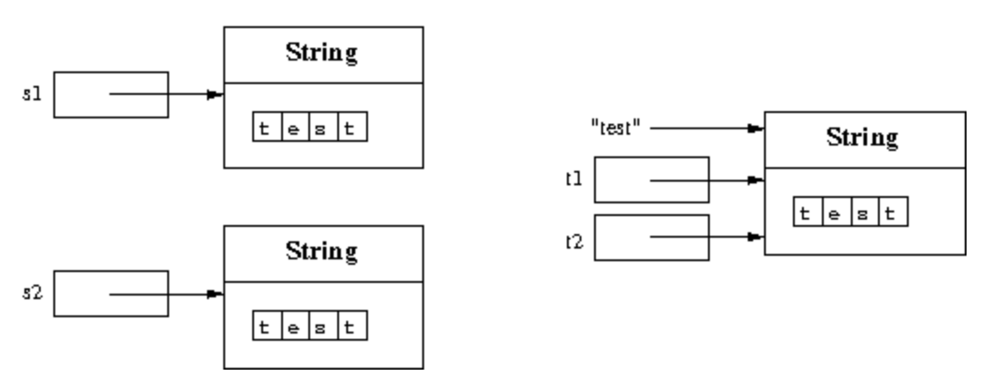

# 객체에 대한 참조

`new` 연산자는 객체의 새로운 인스턴스를 생성한다.

```java
String s1 = new String("test1");
String s2 = new String("test2");
String t1 = "test";
String t2 = "test";
```

s1, s2는 서로 다른 객체에 대한 참조이고 t1, t2는 동일한 객체에 대한 참조이다.

