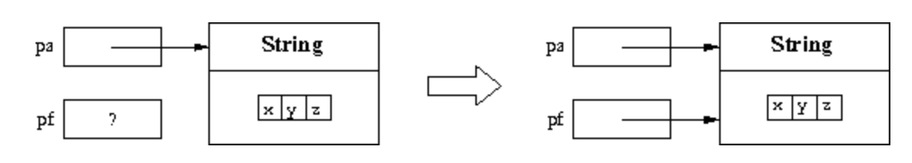

# 파라미터 전달

말했듯이 메서드 정의에는 헤더에 형식 **매개변수 목록(formal parameters)** 이 포함되어 있다. 이러한 매개변수는 메서드 본문 내부의 변수와 동일한 방식으로 사용된다.

메서드 호출에는 메서드 인수로 사용해야 하는 매개 변수가 포함된다. 이러한 매개 변수를 메서드 정의의 헤더에 나타나는 형식 매개변수와 구별하기 위해 **실제 매개변수(actual parameters)** 라고 한다.

메서드를 호출하고 **활성화(activate)** 할 때 실제 매개 변수를 형식 매개 변수에 바인딩해야 한다. 일반적으로 이러한 바인딩 설정하는 방법에는 여러 가지가 있다. Java에서 call by value 한 가지 방법을 사용한다.

`pa`를 메서드 호출의 실제 매개 변수로 두고 `pf`를 메서드 정의 헤더의 형식 매개 변수로 둔다. 값으로 `pa`를 `pf`에 바인딩한다는 것은 메서드가 활성화될 때 다음을 수행한다.
1. 실제 매개 변수 `pa`가 평가된다.
2. 메모리 위치는 형식 매개 변수 `pf`와 연관되어 있다.
3. `pf` 값은 `pa`에 대해 계산된 값으로 초기화된다.

즉, 형식 매개 변수 `pf`는 메서드가 호출되는 순간 생성된 지역 변수와 동일하게 작동하고 해당 실제 매개 변수 `pa`의 값으로 초기화된다. 

메서드 본문 실행이 끝나면 형식 매개 변수에 예약된 메모리 위치가 해재되고 저장된 값이 손실된다. 

> 참고: 표현식 `pa`에 나타나는 변수 값은 메서드 실행으로 변경되지 않는다. 그러나 그러한 값이 객체에 대한 참조인 경우 메서드는 실제로 참조로 표시된 객체를 변경할 수 있다.

