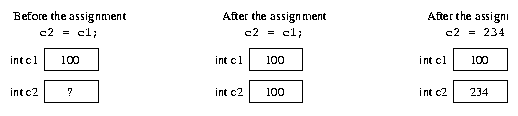

# 기본 유형의 변수 및 객체에 대한 유형 참조 변수

객체에 대한 type reference와 기본 유형 변수 사이에는 상당한 차이가 있다.

- 객체에 대한 type reference의 변수 값은 객체 자체에 대해가 아닌 **객체에 대한 참조**이다. 
- 기본 유형의 변수 값은 기본 유형 자체 값이다.


객체 참조
```java
public class Account {
    public int bal;
    public Account(int x) {
        bal = x;
    }
}

public class Main {
    public static void main(String[] args) {
        Account r1, r2;
        r1 = new Account(100);
        r2 = r1;
        r2.bal = 234;

        System.out.println(rs.bal);
    }
}
```

객체에 대한 참조가 포함된다. 


기본 유형 변수 사용
```java
int c1, c2;
c1 = 100;
c2 = c1;
c2 = 234;
System.out.println(c1);
```


