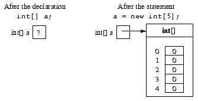

# 배열 객체 생성

배열을 사용하려면 먼저 배열에 포함되어야 하는 요소 수를 지정하여 배열을 만들어야 한다.


**Syntax**

```
new type[dimension]
```

- `type`은 구성하려는 배열 객체의 요소 유형이다.
- `dimension`은 양수(또는 0)값으로 평가되고 배열의 차원을 지정하는 `int` 유형의 표현식이다.

**Semantics**

`type` 유형의 `dimension` 요소를 사용하여 배열 객체를 생성하고 생성된 객체에 대한 참조를 반환한다. 배열의 요소는 0부터 `dimension - 1`까지 인덱싱 되며 각 요소는  `type`의 기본값으로 초기화된다.


```java
int[] a;
a = new int[5];
```



배열 변수와 연관된 배열 객체를 생성한 후에는 배열에 포함된 컬렉션의 단일 요소에 엑세스할 수 있다. 이러한 요소는 해당 유형의 기본값으로 초기화된다.(정수의 경우 0)
