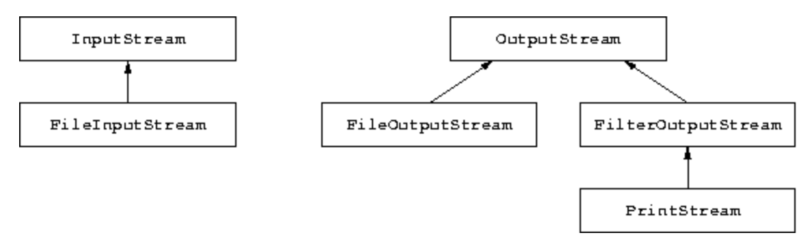

# 입력/출력 스트림

Java는 모든 입력/출력 장치, 즉 데이터 시퀀스의 생상자 소비자로서 처리하는 일반적인 방법을 정의한다. 스트림의 개념은 입력장치에서 생성되거나 출력 장치에서 소비되는 일련의 데이터를 나타낸다.

**입력 스트림 예시**
- 키보드
- 파일
- 인터넷 자원

**출력 스트림 예시**
- 동영상
- 파일

다양한 스트림을 정의하는 데 사용되는 모든 클래스는 다음 다이어그램에 따라 `InputStream` 및 `OutputStream` 클래스에서 파생된다.

모든 입력/출력 장치에 대한 이러한 공통 처리를 통해 우리는 독립적으로 입력 채널에 대한 판독기와 출력 채널에 대한 기록기를 정의할 수 있다. 