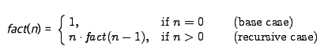

# 귀납적으로 정의된 도메인과 재귀

귀납적으로 정의된 영역의 요소는 재귀를 통해 쉽게 조작될 수 있다.

메서드 자체의 활성화가 포함된 경우 메서드가 재귀적(recursive)이라고 한다.

귀납적으로 정의된 자연수에 대한 수학적 함수의 몇 가지 예를 살펴보고, 이러한 함수가 귀납적으로 정의된 영역의 요소에서 작동한다는 사실을 활용해 본다.

함수의 재귀적 정의는 함수가 작동하는 영역의 귀납적 정의 구조를 반영한다. 
- 함수의 결과가 직접 결정될 수 있는 하나 이상의 기본 사례
- 하나 이상의 재귀 사례. 결과 계산이 도메인의 더 작고 간단한 값에 대해 동일한 함수의 계산으로 축소

함수가 작동하는 영역의 귀납적으로 정의된다는 사실은 재귀 사례를 반복적으로 적용함으로써 유한한 수의 단계를 거쳐 기본 사례 중 하나에 도달할 것임을 보장한다.

함수의 재귀적 정의부터 시작하여 일반적으로 재귀적 방법을 통해 비교적 쉽게 구현을 제공할 수 있다.