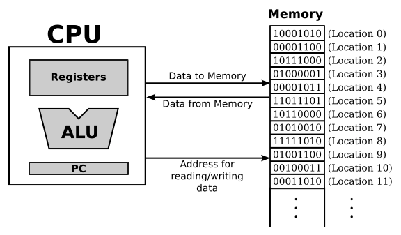

# Section 1: 프로그램 실행 주기: 기계어

컴퓨터는 다양한 구성 요소로 구성된 복잡한 시스템입니다. 그러나 컴퓨터의 심장(두뇌)에서 실제 컴퓨팅을 수행하는
단일 구성 요소가 있습니다. 이것이 **중앙처리장치**, 즉 **CPU**입니다. 최신 데스크탑 컴퓨터에서 CPU는 크기가 1제곱인치 정도 되는 단일칩입니다.
CPU의 역할은 프로그램을 실행하는 것입니다.

프로그램은 단순히 컴퓨터가 기계적으로 따라야하는 명확한 명령들의 목록입니다. 컴퓨터는 기계어라고 불리는 매우 간단한 유형의 언어로 작성된 명령을 수행하도록 만들어졌습니다.
각 종류의 컴퓨터에는 고유한 기계어가 있으며, 프로그램이 해당 언어로 표현되어야만 컴퓨터가 프로그램을 직접 실행할 수 있습니다. (다른 언어로 작성된 프로그램을 기계너로 먼저 번역하면 실행할 수 있습니다.)

CPU가 프로그램을 실행할 때 해당 프로그램은 컴퓨터의 **주 메모리 (RAM)** 에 저장됩니다. 
메모리에는 프로그램 외에도 프로그램에서 사용하거나 처리하는 데이터를 저장합니다. 주 메모리는 일련의 **위치** 로 구성됩니다.
이러한 위치에는 번호가 매겨져 있으며,  위치의 일련 번호를 **주소 (address)** 라고 합니다. 
주소는 메모리에 저장된 수백만 개의 정보 중에서 특정 정보 하나를 선택하는 방법을 제공합니다. CPU가 특정 위치의 프로그램 명령이나 데이터에 액세스해야 할 때
해당 정보의 주소를 메모리에 보냅니다. 메모리는 지정된 위치에 포함된 값을 다시 전송하여 응답합니다. CPU는 저장할 정보와 저장할 위치의 주소를 지정하여 정보를 메모리에 저장할 수도 있습니다.

기계어 수준에서 CPU의 작동은 아주 간단합니다. (세부적으로는 복잡할지라도) CPU는 주 메모리에 일련의 기계어 명령어로 저장된 프로그램을 실행합니다.
이는 메모리에서 명령어를 반복적으로 읽거나 가져온 다음 해당 명령어를 실행함으로써 수행됩니다.
명령어를 가져오고, 실행하고, 가져오고 실행하는 등의 프로세스를 거치는 것을 **프로그램 실행 주기 (Fetch Execute Cycle)** 라고 합니다.
*한가지 예외(비동기)* 를 제외하고, 이는 CPU가 하는 모든 일입니다. 이것은 현대 컴퓨터에서는 더 복잡합니다.
요즘 일반적인 칩에는 여러 개의 CPU 코어가 포함되어 있어 여러 명령을 동시에 실행할 수 있습니다.
그리고 주 메모리에 대한 액세스는 메모리 캐시에 의해 빨라집니다. 주 메모리보다 더 빠르게 접근이 가능하며 CPU에 필요할 데이터와 명령을 보관하기 위한 것입니다.
그러나 이런 과정이 추가된다고 해서 기본 작업이 변경되는 것은 아닙니다. 

CPU에는 덧셈과 뺄셈 같은 연산을 수행하는 프로세서의 일부인 **산술 논리 장치 (ALU)** 가 포함되어 있습니다.
또한 단일 숫자를 저장할 수 있는 작은 메모리 장치인 몇개의 **레지스터**도 가지고 있습니다. 일반적인 CPU에는 처리를 위해 즉시 접근할 수 있는 데이터 값을 갖고 있는 **범용 레지터스**가 16개 or 32개 있을 수 있으며
많은 기계어 명령어가 이러한 레지스터를 참조합니다. 예를 들어, 두 개의 어떤 레지스터에서 두 개의 숫자를 가져와 ALU를 사용하여 해당 숫자를 더하고, 결과를 다시 레지스터에 저장하는 명령어가 있을 수 있습니다.
그리고 데이터 값을 주 메모리에서 레지스터로 복사하거나 레지터에서 주 메모리로 복사하기 위한 명령이 있을 수 있습니다.

CPU에는 특수 목적 레지스터도 포함되어 있습니다. 이 중 가장 중요한 것은 **Program Counter (PC)** 입니다.
CPU는 PC를 사용하여 실행 중인 프로그램의 위치를 추적합니다.
PC는 단순히 CPU가 실행해야 하는 다음 명령어의 메모리 주소를 저장합니다.
각 프로그램 실행 주기가 시작될 때, CPU는 PC를 확인하여 어떤 명령어를 가져와야 하는지 확인합니다.
프로그램 실행 주기가 진행되는 동안 PC는 다음 주기에서 실행될 명령어를 나타내기 위해 업데이트됩니다.
항상 그런 것은 아니지만 일반적으로 이는 프로그램의 현재 명령어를 순차적으로 따르기 위함입니다.
일부 기계어 명령어는 PC에 저장된 값을 수정합니다. 이는 컴퓨터가 프로그램의 한 지점에서 다른 지점으로 점프하는 것을 가능하게 합니다.

컴퓨터는 기계어를 이해하거나 생각하는 게 아니라, 기계적으로 실행합니다. 단지 물리적으로 결합된 방식으로 작동합니다.
이것은 쉬운 개념이 아닙니다. 컴퓨터는 **트랜지스터**라고 불리는 수백만 개의 작은 스위치로 구성된 기계입니다.
트랜지스터는 한 스위치의 출력이 다른 스위치를 켜거나 끌 수 있는 방식으로 서로 연결될 수 있는 특성을 가지고 있습니다.
컴퓨터가 계산할 때, 이러한 스위치는 서로 연결된 방식과 패턴에 따라 서로를 켜거나 끕니다.

기계어 명령어는 이진수로 표현됩니다. 이진수는 0과 1이라는 두 개의 가능한 숫자로만 구성됩니다. 각각의 0, 1을 **bit**라고 합니다.
따라서 기계어 명령어는 0과 1의 연속으로 나타내어 집니다. 각각의 특정 시퀀스는 특정 명령어를 인코딩합니다. 컴퓨터가 조작하는 데이터도 이진수로 인코딩됩니다.
최신 컴퓨터에서는 각 메모리 위치에 **byte**가 저장됩니다. 이는 8비트 시퀀스입니다. 기계어 명령어나 데이터 조각들은 일반적으로 여러 바이트로 구성되며 연속적인 메모리 위치에 저장됩니다.
예를 들어, CPU가 메모리에서 명령어를 읽을 때 실제로는 4 또는 8의 메모리 위치에서 4 또는 8byte를 읽을 수 있습니다.
명령어의 메모리 주소는 해당 바이트 중 첫 번째 주소입니다.

스위치가 이러한 숫자를 쉽게 나타낼 수 있기 떄문에 컴퓨터는 이진수를 직접 사용할 수 있습니다.
스위치를 켜면 1, 스위치를 끄면 0입니다. 기계어 명령어는 스위치를 켜거나 끄는 방식으로 메모리에 저장됩니다.
기계어 명령어가 CPU에 로드되면 해당 명령어를 인코딩하는 패턴에 따라 특정 스위치가 켜지고, 꺼지는 일이 일어납니다. CPU는 인코딩된 명령을 실행하여 이 패턴에 반응하도록 제작되어있습니다.
이는 CPU의 다른 모든 스위치가 함께 연결되는 방식 떄문입니다.

따라서 컴퓨터가 작동하는 방식에 대해 아래처럼 이해해야 합니다. 주 메모리에는 기계어 프로그램과 데이터가 저장됩니다.
이는 이진수로 인코딩됩니다. CPU는 메모리에서 기계어 명령어를 하나씩 가져와서 실행합니다. 각 명령어는 CPU가 두 개의 숫자를 추가하거나 메모리에서 데이터를 이동하는 등 매우 작은 작업을 수행하도록 합니다.
CPU는 이 모든 작업을 생각하거나 이해하지 않고, 기계적으로 수행합니다. 따라서 CPU가 실행하는 프로그램은 완벽하고, 세부사항이 완전해야 하며 명확해야 합니다. 왜냐하면 CPU는 작성된 대로 실행할 뿐이기 떄문입니다.
다음은 컴퓨터에 대한 첫 번째 이해 단계의 개략도입니다.

