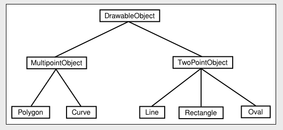

# Section 5: 객체와 객체지향 프로그래밍

프로그램은 설계되어야 합니다. 컴퓨터 앞에 앉아서 복잡한 프로그램을 작성할 수는 없습니다. 소프트웨어 엔지니어링 이라는 학문은 정확하 작동하며 잘 작성된 프로그램을 구축하는 것과 관련이 있습니다. 소프트웨어 엔지니어는 해결해야 할 문제를 분석하고 해당 문제를 해결하기 위한 프로그램을 설계하기 위해 인정되고 입증된 방법을 사용하려고 합니다.

1970년대부터 80년대까지 주요 소프트웨어 엔지니어링 방법론은 **구조화된 프로그래밍**이었습니다. 구조화된 프로그램 설계는 다음의 조언을 따릅니다. 큰 문제를 해결하려면 문제를 여러 조각으로 나누고 각 조각을 별도로 작업해야합니다. 각 부분을 해결하려면 이를 더 작은 문제로 나눌 수 있는 새로운 문제로 생각해보세요. 결국에는 더 이상 분해하지 않고도 직접 해결할 수 있는 문제가 도출됩니다. 이러한 접근 방식을 **하향식 프로그래밍**이라고 합니다.

하향식 프로그래밍은 문제가 없습니다. 이는 문제를 해결하는데 도움이 되며, 자주 사용되는 접근 방식입니다. 그러나 불완전합니다.
우선, 문제를 해결하는데 필요한 명령을 만드는 작업을 거의 다룹니다. 그러나 시간이 지남에 따라 사람들은 프로그램의 **데이터 구조 설계**가 적어도 서브 루틴 및 제어 구조 설계만큼 중요하다는 것으르 깨달았습니다. 하향식 프로그래밍은 프로그램이 조작하는 데이터를 적절하게 고려하지는 않습니다.

엄격한 하향식 프로그래밍의 또 다른 문제는 다른 프로젝트에서 수행된 작업을 재사용하기 어렵다는 것입니다. 특정 문제에서 시작하여 이를 간단한 조각으로 세분화함으로써 하향식 프로그래밍은 해당 문제에 고유한 설계를 만드는 경향이 있습니다. 다른 프로그램에서 많은 양을 가져와 사용하려면 광범위한 수정이 이루어져야만 할 것입니다. 품질 높은 프로그램을 제작하는 것은 어렵고 비용이 많이 들기 때문에, 프로그래머들은 항상 과거의 작업을 재사용하려고 노력합니다.

따라서 하향식 설계는 **상향식 설계**와 결합되는 경우가 많습니다. 상향식 설계의 접근 방식은 이미 해결 방법을 알고 있는 문제(재사용 가능한 구성 요소를 이미 만들어낸 것도 포함)를 가지고 맨 아래에서 시작하는 것입니다. 거기에서 전반적인 문제에 대한 해결책을 따라 상향식으로 작업할 수 있습니다.

재사용 가능한 구성요소는 가능한 한 **모듈식**이어야 합니다. 모듈은 간단하게 잘 정의되고, 간단한 방식으로 시스템의 나머지 부분과 상호 작용하는 대규모 시스템의 구성 요소입니다. 모듈은 시스템에 플러그인할 수 있습니다. 모듈이 역할을 올바르게 수행하고 있다는 가정 하에, 모듈 내부에서 진행되는 세부 사항은 시스템 전체에서 중요하지 않습니다. 이를 **정보 은닉**이라고 하며 소프트웨어 공학의 가장 중요한 원칙 중 하나입니다.

소프트웨어 모듈의 일반적인 형식 중 하나는 데이터를 조작하기 위한 일부 서브루틴과 함께 일부 데이터를 포함하는 것입니다. 예를 들어, 메일 리스트 모듈에는 새 이름을 추가하기 위한 서브루틴, 우편물 라벨 인쇄를 위한 서브루팅 등과 함께 이름, 주소 목록이 포함될 수 있습니다.
이러한 모듈에서는 데이터 자체가 모듈 내부에 숨겨져 있는 경우가 많습니다. 그러면 모듈을 사용하는 프로그램은 모듈에서 제공하는 서브루틴을 호출하여 간접적으로만 데이터를 조작할 수 있습니다. 이는 알려지고 잘 정의된 방식으로만 조작할 수 있으므로 데이터를 보호합니다.
그리고 데이터 표현 방식에 대한 세부 사항에 대해 걱정할 필요가 없기 때문에 프로그램이 모듈을 더 쉽게 사용할 수 있습니다. 데이터 표현에 대한 정보는 숨겨져 있습니다.

이러한 종류의 정보 숨김을 지원할 수 있는 모듈은 1980년대 초반 프로그래밍 언어에서 일반화되었습니다. 그 후로 이보다 발전된 형태로 확장되었는데, 이 접근 방식을 **객체 지향 프로그래밍(OOP)** 라고 합니다. 

객체지향 프로그래밍의 중심 개념은 데이터와 서브루틴을 포함하는 일종의 모듈인 **객체**입니다. OOP의 관점은 객체가 데이터를 갖고 서브루틴 호출에 응답할 수 있는 일종의 자급자족 엔티티라는 것입니다. 예를 들어 메일 목록 개체에는 이름과 주소 목록으로 구성된 데이터가 있습니다. 이름을 추가하라는 요청을 보내면 변경 사항을 반영하도록 상태를 수정하여 응답합니다. 인쇄하라는 메시지를 보내면 이름과 주소 목록을 인쇄하여 응답합니다.

소프트웨어 엔지니어링에 대한 OOP 접근 방식은 문제와 관련된 개체와 그 개체가 응답해야하는 메시지를 식별하는 것부터 시작합니다.
결과로 나오는 프로그램은 각각 고유한 데이터와 고유한 책임을 지닌 객체의 모음입니다. 개체는 서로에게 요청을 보내 상호 작용합니다. 이러한 프로그램의 대규모 설계에는 하향식이 많지 않으며 예전 프로그램에 익숙한 사람들은 OOP에 익숙해지는 데 어려움을 겪을 수도 있습니다.
그러나 OOP를 사용하는 사람들은 객체 지향 프로그램이 세상 자체가 작동하는 방식에 대해 더 나은 모델이므로 작성과 이해가 쉽고 더 정확할 수 있다고 주장합니다.

객체는 특정 메시지에 응답하는 방법을 아는 것이 중요합니다. 서로 다른 개체는 동일한 메시지에 서로 다른 방식으로 응답할 수 있습니다. 예를 들어, print 라는 메시지는 메시지가 전송되는 개체에 따라 매우 다른 결과를 생성합니다. 서로 다른 개체가 동일한 메시지에 서로 다른 방식으로 응답할 수 있는 개체의 이러한 속성을 **다형성**이라고 합니다.

물체가 서로 일종의 "가족 유사성(family resemblance)"을 갖는 것은 흔한 일입니다. 동일한 유형의 데이터를 포함하고 동일한 메시지에 동일한 방식으로 응답하는 개체는 동일한 클래스에 속합니다.(실제 프로그래밍에서는 클래스가 기본입니다. 즉, 클래스가 생성된 다음 해당 클래스를 템플릿으로 사용하여 하나 이상의 객체가 생성됩니다.) 그러나 객체는 동일한 클래스에 속하지 않고도 유사할 수 있습니다.

예를 들어, 사용자가 화면에 선, 직사각형, 타원, 다각형 및 곡선을 그릴 수 있는 그리기 프로그램을 생각해 보자. 프로그램에서 화면에 보이는 각 객체는 프로그램의 소프트웨어 객체로 표시될 수 있습니다. 프로그램에는 그릴 수 있는 객체의 각 유형에 대해 총 5개의 객체 클래스가 있습니다. 모든 선은 한 클래스에 속하고 모든 직사각형은 다른 클래스에 속한다. 이 클래스들은 분명히 서로 관련되어 있습니다. 그들 모두 "그리기 가능한" 객체를 나타냅니다. 예를 들어, 그들 모두 "자신을 그려보세요" 메시지에 응답할 수 있을 것입니다. 각 객체 유형을 나타내는 데 필요한 데이터를 기반으로 하는 또 다른 그룹화 수준은 덜 명확하지만 프로그램에서 매우 유용합니다. 다각형과 곡선을 "다중점 객체"로 함께 그룹화할 수 있다. 직사각형은 타원과 "2점 객체"입니다. (선은 두 끝점으로 결정되고, 직사각형은 두 모서리로 결정되며, 타원은 선을 포함하는 직사각형의 두 모서리로 결정됩니다. 여기서 말하는 직사각형은 수직과 수평의 변을 갖고 있습니다. 두 점만으로도 지정할 수 있습니다. 이는 그리기 프로그램에서 "사각형"의 일반적인 의미입니다.) 이러한 관계를 다음과 같이 도표화할 수 있습니다.

DrawableObject, MultipointObject 및 TwoPointObject는 프로그램의 클래스입니다. MultipointObject와 TwoPointObject는 DrawableObject의 하위 클래스 입니다 . Line 클래스는 TwoPointObject의 하위 클래스이자 DrawableObject의 하위 클래스입니다. 클래스의 하위 클래스는 해당 클래스의 속성을 상속한다고 합니다. 하위 클래스는 상속에 추가할 수 있으며 심지어 해당 상속의 일부를 "재정의"할 수도 있습니다(일부 메시지에 대해 다른 응답을 정의하는 등). 그럼에도 불구하고 선, 직사각형 등은 그릴 수 있는 객체이며 DrawableObject 클래스가 이 관계를 표현합니다.

상속은 프로그램을 구성하는 강력한 방법입니다. 이는 소프트웨어 구성 요소를 재사용하는 문제와도 관련이 있습니다. 클래스는 재사용 가능한 구성 요소입니다. 작성하려는 프로그램에 재사용할 수 있을 뿐만 아니라, 하위 클래스를 정의하고 요구 사항에 맞도록 작은 변경만을 수행하여 재사용할 수 있습니다.

따라서 OOP는 좋은 프로그램 개발 도구이자 소프트웨어 재사용 문제에 대한 부분적인 해결책을 의미합니다. 개체, 클래스 및 개체 지향 프로그래밍은 이 책의 나머지 부분에서 중요한 주제가 될 것입니다. 다음 장에서는 Java 언어에 내장된 개체를 사용해보고, 5장 에서는 커스텀 클래스와 개체를 만들기 시작합니다.

