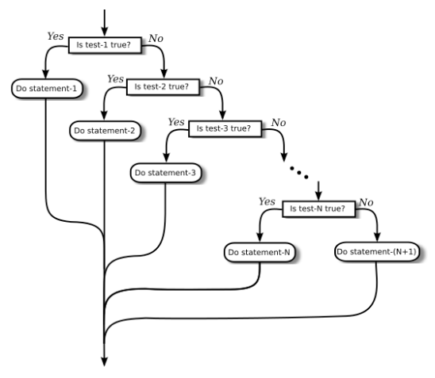

# Section 5: if문

자바에 있는 두 가지 분기문 중 첫 번째 는 `if` 문인데, 이미 제3장 제1절에서 본 적이 있다. 이는 다음 형식을 취한다:

```java
if (boolean-expression)
    statement-1
else
    statement-2
```

항상 그렇듯이, `if` 문 안의 문장은 블록도 가능하다. `if` 문은 두 갈래(two-way) 분기를 나타낸다. `if` 문의 `else` 부분 — "else"라는 단어와 그 뒤를 따르는 문장으로 구성된 — 은 생략할 수 있다.

<hr>

## 1, 매달려 있는 else 문제
자, `if` 문은 특히나, 문장이다. 즉, 위의 `if` 문에서 {statement-1} 또는 {statement-2} 중 하나의 문장 자체가 `if` 문이 될 수 있음을 의미한다. 그러나 {statement-1}이 `else` 부분이 없는 `if` 문이면 문제가 발생한다. 이 특별한 경우는 자바의 구문에 의해 사실상 금지된다. 예를 들어, 다음과 같이 입력하는 경우를 가정하자:

```java
if (x > 0)
    if (y > 0)
        System.out.println("First case");
else
    System.out.println("Second case");
```

자, 이런 식으로 들여쓰는 방법은 컴퓨터에겐 전혀 의미가 없다는 점을 기억하라. `else` 부분이 "`if (x > 0)`" 문장의 후반부라고 생각할 수 있지만, 컴퓨터가 따르는 규칙은 `else` 부분을 이와 더 가깝게 있는 "`if (y > 0)`"에 붙이는 것이다. 즉, 컴퓨터는 당신의 문장을 마치 다음과 같이 정렬하여 읽는다:

```java
if (x > 0)
    if (y > 0)
        System.out.println("First case");
    else
        System.out.println("Second case");
```

블록 안에 중첩된 if 부분을 둘러싸는 식으로 다른 해석을 하도록 강제할 수 있다:

```java
if (x > 0) {
    if (y > 0)
        System.out.println("First case");
}
else
    System.out.println("Second case");
```

이 두 가지 `if` 문은 서로 다른 의미를 갖는다: `x <= 0`일 때 첫 번째 문장은 아무 것도 인쇄하지 않지만, 두 번째 문장은 "Second case"를 인쇄한다.

<hr>

## 2. 다방향 분기화
이런 전문 내용보다 훨씬 더 흥미로운 것은, `if` 문의 `else` 부분인 {statement-2} 자체가 `if` 문인 경우다. 그 문장은 다음과 같이 보일 것이다(아마도 최종적인 else 부분은 제외하고):

```java
if (boolean-expression-1)
    statement-1
else
    if (boolean-expression-2)
        statement-2
    else
        statement-3
```

그러나 컴퓨터는 페이지에 프로그램이 어떻게 배치되는지 상관하지 않기 때문에, 이는 언제나 거의 다음과 같은 형식으로 작성된다:

```java
if (boolean-expression-1)
    statement-1
else if (boolean-expression-2)
    statement-2
else
    statement-3
```

이는 세 갈래(three-way) 분기를 나타내는 하나의 문장이라 생각해야 한다. 컴퓨터가 이를 실행할 때, 세 개의 문장 중 유일하게 하나만 — {statement-1}, {statement-2}, 또는 {statement-3} — 이 실행될 것이다. 컴퓨터는 {boolean-expression-1}을 평가하는 것으로 시작한다. 이것이 `true`라면, 컴퓨터는 {statement-1}을 실행한 다음, 다른 두 {statement}를 건너뛰면서 `if` 문 바깥쪽 끝으로 완전히 이동한다. {boolean-expression-1}이 `false`라면, 컴퓨터는 {statement-1}을 건너뛰고 중첩된 두 번째 `if`문을 실행한다. 이를 위해 {boolean-expression-2}의 값을 테스트하고 해당 값을 {statement-2}와 {statement-3} 사이에서 결정하는 데 사용한다.

`temperature`라는 이름의 변수 값에 따라 세 가지 메시지 중 하나를 출력하는 예제는 다음과 같다:

```java
if (temperature < 50)
    System.out.println("추운데.");
else if (temperature < 80)
    System.out.println("좋은걸.");
else
    System.out.println("덥네.");
```

`temperature`가 42라면, 첫 번째 테스트는 `true`이다. 컴퓨터는 "추운데"라는 메시지를 출력하고, 나머지는 건너뛴다 — 심지어 두 번째 조건을 평가하는 일도 없이 말이다. 75의 온도는, 1차 테스트가 `false`이기 때문에 컴퓨터의 2차 테스트로 이어진다. 이 테스트는 `true`이기에 컴퓨터는 "좋은걸"이라고 인쇄하고 나머지는 건너뛴다. 온도가 173이면 두 테스트 모두 `false`로 평가하기 때문에, 컴퓨터는 "덥네"라고 할 것이다(회로가 열에 의해 튀겨지지 않는 한 말이다).

어떤 경우의 수든지 다방향 분기들로 만들기 위해 계속하여 "else-if"로 함께 묶을 수 있다:

```java
if (test-1)
    statement-1
else if (test-2)
    statement-2
else if (test-3)
    statement-3
.
. // (더 많은 경우들)
.
else if (test-N)
    statement-N
else
    statement-(N+1)
```

컴퓨터는 부울 표현식인 테스트를 차례로 평가하는데, 어느 하나가 `true`일 때까지 줄줄이 평가한다. 이는 해당 문장을 실행하고 나머지는 건너뛴다. 어느 부울 표현식도 `true`로 평가되지 않으면 `else` 부분의 문장이 실행된다. 이 문장은 하나의, 그리고 문장 중 오로지 하나의 문장만이 실행될 것이기 때문에 다방향 분기(multiway branch)라고 불린다. 마지막 `else` 부분은 생략할 수 있다. 이 경우, 모든 부울 표현식이 거짓이면 어떤 문장도 실행되지 않는다. 물론 각각의 문장은, { 및 } 사이에서 감싸진 다수의 문장으로 구성된 블록이 될 수도 있다. 인정하건대, 여기에는 많은 구문이 있다; 당신이 공부하고 연습하면 할수록, 이에 익숙해질 것이다. 위에서 보여진 일반적인 "if..else if"에 대한 흐름 제어 도표를 살펴보는 것이 유용할 수도 있을 것이다:



## 3. if 문 예제
`if` 문을 사용하는 예제로서, `x`, `y`, 그리고 `z`는 int 자료형의 변수로서, 각 변수에는 이미 값이 할당되었다고 가정하자. 세 변수의 값을 오름차순으로 출력하는 문제를 생각해보자. 예를 들어, 값이 42, 17, 20이면 출력은 17, 20, 42의 순서로 되어야 한다.

이에 접근하는 한 가지 방법은 해당 목록에서 `x`가 어디에 속하는지 물어보는 것이다. `y`와 `z` 모두보다 작으면 먼저 올 것이다. `y`와 `z` 모두보다 크면 마지막이 된다. 그렇지 않으면 중간에 온다. 이를 3방향 `if` 문으로 표현할 수 있지만, `y`와 `z`가 인쇄되어야 하는 순서에 대해서 여전히 걱정해야 한다. 유사코드로는,

```java
if (x < y && x < z) {
    x 출력, y와 z를 맞는 순서로 뒤에 붙임
}
else if (x > y && x > z) {
    y와 z를 맞는 순서로 출력, x를 뒤에 붙임
}
else {
    y와 z의 맞는 순서 사이에 x를 두고 출력
}
```

y와 z의 상대적인 순서를 결정하려면 다른 `if` 문이 필요하므로, 이는 다음과 같을 것이다:

```java
if (x < y && x < z) {        // x가 먼저 등장
    if (y < z)
        System.out.println( x + " " + y + " " + z );
    else
        System.out.println( x + " " + z + " " + y );
}
else if (x > y && x > z) {   // x가 끝에 등장
    if (y < z)
        System.out.println( y + " " + z + " " + x );
    else
        System.out.println( z + " " + y + " " + x );
}
else {                       // x가 중간에 등장
    if (y < z)
        System.out.println( y + " " + x + " " + z);
    else
        System.out.println( z + " " + x + " " + y);
}
```

일부 값이 동일하더라도 이 코드가 제대로 작동하는지 확인할 수 있다. 두 변수의 값이 같으면 어느 순서로 인쇄해도 상관이 없다.

참고로, 영어로 "if x is less than y and z(x가 y와 z보다 작으면)"라고 할 수 있음에도 불구하고, 자바에서는 "`if (x < y && z)`"라고 할 수 없다. `&&` 연산자는 부울 값 사이에만 사용할 수 있으므로, `x < y`와 `x < z`를 각각 따로 테스트한 다음 두 테스트를 `&&`와 결합해야 한다.

이 문제에 대한 대안적인 접근법이 있는데, 이는 "`x`와 `y`는 어느 순서로 인쇄해야 하는가?"라고 묻는 것으로 시작된다. 일단 이를 알면, `z`에서 어디에 붙을지를 결정하기만 하면 된다. 이러한 사고방식은 다른 자바 코드로 이어진다:

```java
if ( x < y ) {  // x는 y 앞에 옴
    if ( z < x )   // z가 처음
        System.out.println( z + " " + x + " " + y);
    else if ( z > y )   // z가 마지막
        System.out.println( x + " " + y + " " + z);
    else   // z가 중간
        System.out.println( x + " " + z + " " + y);
}
else {          // y는 x 앞에 옴
    if ( z < y )   // z가 처음
        System.out.println( z + " " + y + " " + x);
    else if ( z > x )  // z가 마지막
        System.out.println( y + " " + x + " " + z);
    else  // z가 중간
        System.out.println( y + " " + z + " " + x);
}
```

다시 반복하지만, 같은 문제가 어떻게 여러 다른 방법으로 해결될 수 있는지를 알게 된다. 이 문제에 대한 두 가지 접근법이 모든 가능성을 다 써버린 것은 아니다. 예를 들어, `x`가 `y`보다 큰지 여부를 테스트하여 시작할 수 있다. 만약 그렇다면 그들의 값을 교환(swap)할 수 있다. 일단 그렇게 하면, `x`가 `y`보다 먼저 인쇄되어야 함을 알게 된다.

마지막으로 `if` 문구를 흥미로운 방식으로 사용하는 완전한 프로그램을 작성해보자. 필자는 마일(miles)을 야드(yards)로 또는 인치(inches)를 피트(feet)로 바꾸는 것처럼 길이의 측정 단위를 다른 단위로 변환하는 프로그램을 원한다. 지금까지 이 문제는 극히 불충분하게(under-specified) 다루어졌다. 이 프로그램은 인치, 피트, 야드, 마일 측정만을 다룬다고 하자. 나중에 다른 단위를 다루도록 쉽게 확장할 수 있을 것이다. 사용자는 "17피트" 또는 "2.73마일"과 같이 이런 단위들 중 하나로 측정값을 입력한다. 출력은 네 가지 측정 단위로 된 **각각의** 길이가 표시된다. (이는 사용자에게 출력에 사용할 단위를 묻는 것보다 쉽다.) 그 과정의 초안은 다음과 같다:

```java
사용자의 입력 측정값과 측정 단위를 읽는다
인치, 피트, 야드, 마일로 측정값을 표현한다
4가지 결과를 표시한다
```

프로그램은 수치 측정값을 읽기 위해 `TextIO.getDouble()`을 사용하고 측정 단위를 읽기 위해 `TextIO.getlnWord()`를 사용하여 동일한 행에서 사용자의 입력 내용을 모두 읽을 수 있다. 다른 측정 단위로의 변환은 먼저 사용자의 입력을 인치로 변환함으로써 단순화할 수 있다. 거기서부터 인치는 피트, 야드, 마일로 쉽게 변환할 수 있다. 인치로 변환하기 전에 사용자가 지정한 측정 단위를 결정하기 위해 입력을 테스트해야 한다:

```java
설정 측정값(measurement) = TextIO.getDouble()
설정 단위(units) = TextIO.getlnWord()
if 단위가 인치(inches)라면
    설정 inches = measurement
else if 단위가 피트(feet)라면
    설정 inches = measurement * 12         // 1피트당 12인치
else if 단위가 야드(yards)라면
    설정 inches = measurement * 36         // 1야드당 36인치
else if 단위가 마일(miles)이라면
    설정 inches = measurement * 12 * 5280  // 1마일당 5280피트
else
    인정되지 않는 단위!
    오류 메시지를 출력하고 처리를 종료
설정 feet = inches / 12.0
설정 yards = inches / 36.0
설정 miles = inches / (12.0 * 5280.0)
결과를 표시한다
```

단위(`units`)는 String 이기 때문에 `units.equals("inches")`를 사용하여 지정된 측정값 단위가 "인치(inches)"인지 확인할 수 있다. 단, 단위를 "inch"로 지정하거나 "in"으로 축약할 수 있도록 하는 것이 좋을 것이다. 이 세 가지 가능성을 허용하기 위해, `if (units.equals("inches") || units.equals("inch") || units.equals("in"))`를 검사할 수 있다. 대문자로 된 문자들, "Inches"나 "IN"과 같은 경우도 허용하는 것이 좋을 것이다. 테스트 이전에 `units`를 소문자로 변환하거나 `units.equals`를 `units.equalsIgnoreCase` 함수로 대체(substitue)함으로써 이것이 가능해진다.

필자의 마지막 프로그램에서는, 사용자가 측정값을 입력하는 과정을 반복할 수 있도록 하고 각각의 측정값에 대한 변환 결과를 볼 수 있도록 하여 좀 더 흥미롭게 만들기로 결정했다. 사용자가 0을 입력해야만 프로그램이 종료된다. 이렇게 프로그래밍하기 위해서, 필자는 위의 알고리즘을 `while` 루프 안에 감싸고, 사용자가 0을 입력했을 때 루프가 끝나도록 하였다. 전체 프로그램은 다음과 같다:

```java
import textio.TextIO;

/**
* This program will convert measurements expressed in inches,
* feet, yards, or miles into each of the possible units of
* measure.  The measurement is input by the user, followed by
* the unit of measure.  For example:  "17 feet", "1 inch", or
* "2.73 mi".  Abbreviations in, ft, yd, and mi are accepted.
* The program will continue to read and convert measurements
* until the user enters an input of 0.
*/
public class LengthConverter {

public static void main(String[] args) {

      double measurement;  // 사용자가 입력한 측정값.
      String units;        // 입력에 관한 측정 단위로
                           // 이 또한 사용자가 지정.

      double inches, feet, yards, miles;  // 각각의 가능한 측정 단위로 표현되는 측정값

      System.out.println("inches, feet, yards, 또는 miles로 측정값을 입력하세요.");
      System.out.println("예시:  1 inch    17 feet    2.73 miles");
      System.out.println("약어도 사용 가능:   in   ft  yd   mi");
      System.out.println("입력값을 다른 측정 단위로 변환할 것입니다.");
      System.out.println();

      while (true) {

         /* 사용자의 입력을 얻고, 단위를 소문자로 변환. */

         System.out.print("측정값을 입력, 또는 0을 입력하여 종료:  ");
         measurement = TextIO.getDouble();
         if (measurement == 0)
            break;  // while 루프 중단.
         units = TextIO.getlnWord();            
         units = units.toLowerCase();  // 단위를 소문자로 변환.

         /* 입력된 측정값을 인치로 변환. */

         if (units.equals("inch") || units.equals("inches") 
                                         || units.equals("in")) {
             inches = measurement;
         }
         else if (units.equals("foot") || units.equals("feet") 
                                         || units.equals("ft")) {
             inches = measurement * 12;
         }
         else if (units.equals("yard") || units.equals("yards") 
                                          || units.equals("yd")) {
             inches = measurement * 36;
         }
         else if (units.equals("mile") || units.equals("miles") 
                                            || units.equals("mi")) {
             inches = measurement * 12 * 5280;
         }
         else {
             System.out.println("죄송합니다, 하지만 \"" 
                                                  + units + "\" 단위를 이해할 수 없군요.");
             continue;  // while 루프의 처음으로 돌아감.
         }

         /* 인치로 된 측정값을 피트, 야드, 마일로 변환. */

         feet = inches / 12;
         yards = inches / 36;
         miles = inches / (12*5280);

         /* 각각의 측정 단위로 측정값을 출력. */

           System.out.println();
           System.out.println("이는 다음과 같습니다:");
           System.out.printf("%14.5g inches%n", inches);
           System.out.printf("%14.5g feet%n", feet);
           System.out.printf("%14.5g yards%n", yards);
           System.out.printf("%14.5g miles%n", miles);
           System.out.println();

      } // while 종료

      System.out.println();
      System.out.println("OK!  Bye for now.");

} // main() 종료

} // class LengthConverter 종료
```

(이 프로그램은 "g" 형식 지정자로 형식화된 출력을 사용한다는 점에 유의하라. 해당 프로그램에서 숫자가 얼마나 클지 또는 얼마나 작을지를 통제할 수 없다. 사용자가 매우 크거나 매우 작은 측정값을 입력하는 것은 아주 타당한 일일 것이다. "g" 형식은 실수가 매우 크거나 매우 작으면 지수 형식(exponential form)으로, 그렇지 않으면 일반적인 소수 형식(decimal form)으로 인쇄된다. `%14.5g`라는 형식 지정에서 5는 인쇄되어야 할 총 유효 자릿수이므로, 숫자 크기에 상관없이 항상 출력에서 동일한 수의 유효 자릿수를 얻을 수 있다는 점을 기억하라. `%14.5f`와 같은 "f" 형식 지정자를 사용했다면, 출력은 소수점 이후 5자리인 소수 형식일 것이다. 이는 전혀 **유효한**(significant) 자릿수 없이, 숫자 0.000000000745482를 `0.00000`으로 인쇄할 것이다! "g" 형식 지정자를 사용하면 출력은 `7.4549e-10`이 될 것이다.)

<hr>

## 4. 빈 문장
이 절의 마지막 참고사항으로, 자바에서 문장의 한 유형을 더 언급할 것이다: **빈 문장**(empty statement). 이는 단순히 세미콜론(semicolon)으로 구성되어 있으며 컴퓨터에게 아무것도 하지 않음을 말하는 문장이다. 통상적으로는 } 뒤에 세미콜론을 볼 수 없음에도 불구하고, 빈 문장의 존재는 다음과 같은 경우를 허용되게 한다:

```java
if (x < 0) {
    x = -x;
};
```

} 이후의 세미콜론은 허용되지만, 컴퓨터는 이를 `if` 문의 일부가 아닌 빈 문장으로 간주한다. 가끔, 그 의도가 실제로 "아무것도 하지 않음"일 때 빈 문장을 사용하는 자신을 발견할 수도 있을 것이다. 예를 들어, 다소 인위적인 `if` 문은

```java
if ( done )
    ;  // 빈 문장
else
    System.out.println( "아직 안 됨.");
```

부울 변수 `done`이 참일 때에는 아무 것도 하지 않고, 거짓일 때에는 "아직 안 됨"을 출력한다. 자바 구문상 `if`와 `else` 사이에는 실제로 문장이 필요하므로 이 예에서 세미콜론만을 뺄 수는 없다. 그렇지만, 그러한 경우에 대하여 { 및 } 사이에 아무것도 없는 빈 블록을 사용하는 것을 필자는 선호한다.

때때로, 길을 잃은 빈 문장이 프로그램에서 짜증나고 찾기 어려운 오류를 일으킬 수 있다. 예를 들어, 다음의 프로그램 조각은 "Hello"를 열 번이 아니라 **한 번만** 출력한다:

```java
for (i = 0; i < 10; i++);
`System.out.println("Hello");
```

왜일까? 첫 행의 끝에 있는 ";"는 문장이고, 열 번 실행되는 것은 바로 이 빈 문장이기 때문이다. `System.out.println` 문장은 실제로는 `for` 문 안에 있지 않으므로, `for` 루프가 완료된 후 단 한 번만 실행된다. 열 번에 거쳐, `for` 루프는 아무 것도 하지 않은 것이다!

