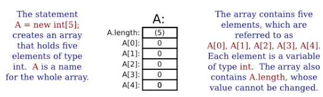
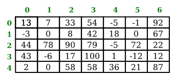

# Section 8: 배열

이 장의 이전 절에서는 이미 자바의 모든 제어 구조에 대해 다루었다. 그러나 다음 장으로 넘어가기 전에, 최소한 제어 구조와 어느 정도 관련이 있는 두 가지 추가적인 주제를 예비적으로 살펴볼 것이다.

이 절은 배열에 대한 소개다. 배열은 기본적이고 매우 일반적으로 사용되는 데이터 구조로, 배열 처리는 종종 제어 구조를 사용하는 연습이 된다. 다음 절에서는 컴퓨터 그래픽을 소개하고 제어 구조에 대해 알고 있는 내용을 다른 맥락에서 적용할 수 있게 될 것이다.

<hr>

## 1. 배열의 생성 및 사용
**데이터 구조(data structure)** 는 하나의 단위로 취급될 수 있도록 여러 개의 데이터 항목을 뭉쳐서(chunked) 구성된다. **배열(array)** 은 각각의 개별 항목을 위치 번호로 참조할 수 있도록 항목을 번호순으로 배열하는 데이터 구조다. 자바에서는 — 그러나 다른 몇몇 프로그래밍 언어에서는 아니지만 — 모든 항목이 동일한 자료형이어야 하며, 번호 매기기는 항상 0에서 시작한다. 배열에 대해 설명하려면 몇 가지 새로운 용어를 익혀야 한다: 배열에서 항목들의 수를 배열의 **길이(length)** 라고 한다. 배열의 개별 항목 자료형을 배열의 **기본 자료형(base type)** 이라고 한다. 그리고 배열에서 항목의 위치 번호를 해당 항목의 **인덱스(index)** 라고 한다.

예를 들어, 흠, 천 명의 이름을 처리하는 프로그램을 작성하길 바란다 가정하자. 그 모든 데이터를 처리할 방법이 필요할 것이다. 배열을 알기 전이라면 프로그램에는 천 개의 이름을 담을 수 있는 천 개의 변수가 필요하다 생각했을 것이고, 이름을 모두 출력하려면 천 개의 출력문이 필요했을 것이다. 확실히, 그건 끔찍한 일이다! 실제로는 모든 이름을 배열에 넣을 수 있다. 배열은 단일 변수로 표현되지만 이름들의 전체 목록을 포함하고 있다. 배열의 길이는 1000이 될 것인데, 왜냐하면 1000개의 개별 이름이 있기 때문이다. 배열의 항목이 문자열이므로 배열의 기본 자료형은 String 일 것이다. 첫 번째 이름은 배열의 인덱스 0에, 두 번째 이름은 인덱스 1에, 등등으로 천 번째 이름은 인덱스 999에 있을 것이다.

배열의 기본 자료형은 어떤 자바 자료형이든 될 수 있지만, 현재로서는 기본 자료형이 String 이거나 8개의 원시 자료형 중 하나인 배열을 고수할 것이다. 배열의 기본 자료형이 int인 경우, "int의 배열"이라고 한다. 기본 자료형이 String 인 배열을 "String 의 배열"이라고 한다. 그러나, 배열은 제대로 말하면, 정수나 문자열 또는 다른 **값들**의 목록이 아니다. 이는 int 자료형 **변수들**의 목록이나, String 자료형 변수들의 목록이나, 혹은 다른 자료형 변수들의 목록으로 생각하는 것이 좋다. 항상 그렇듯이, 변수의 두 가지 사용 사이에는 약간의 혼동이 생길 가능성이 있다: 메모리 위치에 대한 이름과 해당 메모리 위치에 저장된 값에 대한 이름. 배열의 각 위치는 마치 변수처럼 작동한다. 변수가 값을 보유할 수 있는 것처럼, 각 위치는 지정된 자료형(배열의 기본 자료형)의 값을 보유할 수 있다. 변수의 값을 변경할 수 있는 것처럼 언제든지 해당 값을 변경할 수 있다. 배열의 항목들 — 정말로는, 배열을 구성하는 개별 변수들 — 은 배열의 **요소들(elements)** 로 더욱 자주 언급된다.

위에서 언급했듯이 프로그램에서 배열을 사용할 때 변수를 사용하여 배열을 전체적으로 참조할 수 있다. 그러나 배열의 개별 요소를 참조할 필요가 있는 경우가 많다. 배열 요소의 이름은 배열의 이름과 요소의 인덱스 번호를 기반으로 한다. 예를 들어, 요소를 참조하는 구문은 다음과 같이 보인다: `namelist[7]`. 여기서 `namelist`는 배열을 전체로 명명하는 변수이며, `namelist[7]`는 해당 배열의 인덱스 7에 있는 요소를 가리킨다. 즉, 배열의 요소를 참조하기 위해 배열 이름을 사용하고 그 다음에 요소 인덱스를 대괄호로 묶는다. 이 형식의 요소 이름은 다른 변수처럼 사용할 수 있다: 값을 할당하고, 인쇄하고, 표현식으로 사용하는 등의 일을 할 수 있다.

배열은 그 길이를 나타내는 변수의 종류도 포함한다. 예를 들어 배열 `namelist`의 길이를 `namelist.length`라고 참조할 수 있다. 그러나 배열의 길이는 변경할 수 없으므로 `namelist.length`에 값을 할당할 수 없다.

배열을 참조하는 변수를 사용하려면 그 전에 먼저 해당 변수가 선언되고, 이는 자료형을 가져야 한다. 예를 들어 String 배열의 경우, 배열 변수의 자료형은 String[]이고 int 배열의 경우 int[]가 된다. 일반적으로 배열 자료형은 배열의 기본 자료형과 빈 대괄호 쌍으로 구성된다. 배열 자료형을 사용하여 변수를 선언할 수 있다; 예를 들어,

```java
String[] namelist;
int[] A;
double[] prices;
```

그리고 이러한 방식으로 선언된 변수는 배열을 참조할 수 있다. 그러나 변수를 선언한다고 해서 실제 배열을 만든 것은 아니다. 모든 변수와 마찬가지로 배열 변수에도 값을 할당해야 사용할 수 있다. 이 경우 해당 값은 배열이다. 배열은 특수한 구문을 사용하여 생성해야 한다. (구문은 자바에 있는 배열이 실제로 객체라는 사실과 관련이 있지만, 여기서 그런 것을 걱정할 필요는 없다.) 배열은 new라는 연산자로 생성된다. 여기 몇 가지 예가 있다:

```java
namelist = new String[1000];
A = new int[5];
prices = new double[100];
```

일반적인 구문은

```java
{array-variable} = {new base-type}[{array-length}];
```

배열의 길이는 정수 또는 정수 값 표현식으로 지정할 수 있다. 예를 들어, 할당문 "`A = new int[5]`;" 이후 A는 5개의 정수 요소인 `A[0], A[1], A[2], A[3], A[4]`를 포함하는 배열이다. 또한 `A.length`의 값은 5이다. 그림을 생각하는 것이 유용하다:



int 배열을 생성하면 배열의 각 요소가 자동으로 0으로 초기화된다. 어떤 숫자들의 배열도 생성되면 0으로 채워진다. boolean 배열은 false 값으로 채워진다. 그리고 char 배열은 유니코드 코드 번호 0을 가진 문자로 채워진다. (String 배열의 경우, 초기 값은 `null`인데, 이는 객체에 사용되는 특수한 값으로 제5장 제1절 전까지는 공식적으로 접하지 않을 것이다.)

<hr>

## 2. 배열과 for 루프
배열의 상당한 진정한 힘은 요소의 인덱스가 정수 변수나 심지어 정수 값 표현식으로 주어질 수 있다는 점에서 나온다. 예를 들어 `list`가 배열이고 `i`가 int 자료형의 변수인 경우, `list[i]`를 사용하고, 더욱이 `list[2*i+1]`를 변수 이름으로 사용할 수 있다. `list[i]`의 의미는 `i`의 값에 따라 다르다. 이는 특히 배열의 모든 요소들을 처리하고 싶을 때 유용하게 된다. 왜냐하면 이는 `for` 루프로 이루어질 수 있기 때문이다. 예를 들어 배열의 모든 항목을 인쇄하려면 이렇게 작성하면 된다:

```java
int i;  // 배열의 인덱스
for (i = 0; i < list.length; i++) {
    System.out.println( list[i] );
}
``` 

루프를 처음 통과할 때 i는 0이고 `list[i]`는 `list[0]`을 가리킨다. 따라서, 이는 출력될 변수 `list[0]`에 저장된 값이다. 두 번째 루프를 통해 i는 1이고 `list[1]`에 저장된 값이 출력된다. 목록의 길이가 5인 경우, `i`가 5와 같으며 연속 조건 "`i < list.length`"가 더 이상 참이 아닐 때, `list[4]`의 값을 출력한 후 루프가 종료된다. 이는 루프를 사용하여 배열을 처리하는 전형적인 예이다.

몇 가지 예제를 더 살펴보자. `A`가 double 배열이라고 가정하고, 배열의 모든 요소의 평균을 찾기를 원한다. `for` 루프를 사용하여 숫자를 추가한 다음 배열의 길이로 나누어서 평균을 얻을 수 있다:

```java
double total;    // 배열에서 숫자들의 합.
double average;  // 숫자들의 평균.
int i;  // 배열 인덱스.
total = 0;
for ( i = 0; i < A.length; i++ ) {
    total = total + A[i];  // 번호 i인 요소를 total에 더함.
}
average = total / A.length;  // A.length는 항목들의 수
```

또 다른 전형적인 문제는 `A` 배열에서 가장 큰 숫자를 찾는 것이다. 전략은 배열을 거치면서, 지금까지 발견된 가장 큰 숫자를 추적하는 것이다. 지금까지 발견된 가장 큰 숫자를 `max`라는 변수에 저장하겠다. 배열을 통하면서 볼 때 현재의 `max` 값보다 큰 숫자를 발견할 때마다 `max`의 값을 그 큰 값으로 변경한다. 전체 배열이 처리된 후, `max`는 전체 배열에서 가장 큰 항목이 된다. 유일한 의문은, `max`의 최초의 값은 얼마가 되어야 하는가? 이다. 한 가지 가능성은 `max`를 `A[0]`과 동일하게 시작하고, 더 큰 항목을 찾기 위해 `A[1]`부터 시작하여 배열의 나머지를 살펴보는 것이다:

```java
double max;  // 지금까지 발견된 가장 큰 숫자.
max = A[0];   // 처음에, 발견된 가장 큰 숫자는 A[0].
int i;
for ( i = 1; i < A.length; i++ ) {
    if (A[i] > max) {
        max = A[i];
    }
}
// 이 시점에서, max는 A의 가장 큰 항목임.
```

때로는 배열의 일부 요소만 처리하려고 할 수 있다. 이 경우 `for` 루프 내부의 `if` 문을 사용하여 주어진 요소를 처리할 것인지 여부를 결정할 수 있다. 배열의 요소를 평균화하는 문제를 살펴보자. 하지만 이번에는 0이 아닌 요소만 평균화한다고 가정한다. 이 경우 합산되는 항목들의 수가 배열의 길이보다 작을 수 있으므로, 다음과 같이 총합에 추가된 항목들 수를 계속 기록해야 할 것이다:

```java
double total;    // 배열 안의 0이 아닌 숫자들의 총합.
int count;       // 0이 아닌 숫자들의 수.
double average;  // 0이 아닌 숫자들의 평균.
int i;
total = 0;
count = 0;
for ( i = 0; i < A.length; i++ ) {
    if ( A[i] != 0 ) {
        total = total + A[i];  // 요소를 total에 더하고
        count = count + 1;     // 그 수를 셈.
    }
}
if (count == 0) {
    System.out.println("0이 아닌 요소가 없습니다.");
}
else {
    average = total / count;  // 항목들 수로 나눔
    System.out.printf("%d 개의 요소들 평균은 %1.5g%n", count, average);
}
```

<hr>

## 3. 무작위 액세스
지금까지 배열 처리에 대한 필자의 예제들은 **순차적 액세스(sequential access)** 를 사용해 왔다. 즉, 배열의 요소는 배열에서 나타나는 순서대로 차례로 처리되었다. 그러나 배열의 큰 장점 중 하나는 **무작위 액세스(random access)** 를 허용한다는 것이다. 즉, 배열의 모든 요소는 언제든지 동일하게 접근이 가능하다.

예를 들어, 생일 문제(birthday problem)라 불리는 잘 알려진 문제를 살펴보자: 한 방에 N명이 있다고 가정한다. 그 방에 생일이 같은 두 사람이 있을 가능성은 얼마나 될까? (즉, 그들은 같은 달의 같은 날에 태어났지만 반드시 같은 해에 태어난 것은 아니다.) 대부분의 사람들은 그 확률을 심각하게 과소평가한다. 실제로 다른 버전의 질문을 살필 것이다: 무작위로 사람을 고르고 그들의 생일을 확인한다고 가정한다. 이미 확인한 사람과 생일이 같은 사람을 찾기 전까지 얼마나 많은 사람을 확인할 것인가? 물론 특정 사례에 대한 해답은 무작위 요인에 따라 다르지만, 컴퓨터 프로그램으로 실험을 시뮬레이션하고 프로그램을 여러 번 실행하여 평균적으로 얼마나 많은 사람을 확인해야 하는지를 알 수 있다.

실험을 시뮬레이션하려면 찾은 각각의 생일을 추적해야 한다. 365개의 가능한 생일들이 있다. (윤년은 무시할 것이다.) 가능한 생일마다, 우리는 해당 생일을 가진 사람을 이미 찾았는지 여부를 추적할 필요가 있다. 이 질문에 대한 답은 참이든 거짓이든 부울 값이다. 365개의 가능한 생일 데이터를 보관하려면 365개의 부울 값 배열을 사용할 수 있다:

```java
boolean[] used;
used = new boolean[365];
```

이 문제의 경우, 그 해의 일수는 0에서 364일까지로 번호가 매겨진다. 생일이 일수 번호 `i`인 누군가가 선택되었다면 `used[i]`의 값은 참이다. 최초에는, 배열의 모든 값은 `false`이다. (배열이 생성될 때 이 작업이 자동적으로 이루어짐을 기억하라.) 생일이 일수 번호 `i`인 사람을 선택할 때, 먼저 `used[i]`가 `true`인지 여부를 확인한다. 만약 이것이 `true`라면, 이는 해당 생일을 가진 두 번째 사람이 된다. 이로써 끝이다. 한편, 만약 `used[i]`가 `false`이라면, 우리는 그 생일을 가진 누군가를 만났다는 사실을 기록하기 위해 `used[i]`를 `true`로 설정하고, 다음 사람으로 이동한다. 다음은 모의 실험을 수행하는 프로그램이다(물론 프로그램에는 모의 실험된 사람이 없고 모의 실험된 생일만 있다):

```java
/**
* Simulate choosing people at random and checking the day of the year they
* were born on.  If the birthday is the same as one that was seen previously,
* stop, and output the number of people who were checked.
*/
public class BirthdayProblem {

    public static void main(String[] args) {

        boolean[] used;  // 지금까지 발견된 가능한
                       // 생일들을 기록하기 위함.
                       // used[i]의 true 값은
                       // 발견된 해의 i번째 일수가
                       // 생일인 사람을 뜻함.

        int count;       // 확인된 사람들의 수.

        used = new boolean[365];  // 최초로, 모든 항목은 false.

        count = 0;

        while (true) {
            // 0에서 364까지 무작위로 생일을 선택.
            // 생일이 이미 사용되면 종료.
            // 그렇지 않다면 사용된 생일을 기록.

         int birthday;  // 선택된 생일.
         birthday = (int)(Math.random()*365);
         count++;

         System.out.printf("%d 번 사람이 가진 생일 숫자는 %d%n", count, birthday);

         if ( used[birthday] ) {  
               // 이전에 발견된 일수인 경우; 이는 중복임. 이로써 끝.
            break;
         }

         used[birthday] = true;

      } // while 종료

      System.out.println();
      System.out.println("중복된 생일이 다음 "
               + count + " 시도 이후 발견됨.");
}

} // class BirthdayProblem 종료
```

프로그램이 어떻게 작동하는지, 그리고 어떻게 배열을 사용하는지 이해하기 위해 이를 공부해야 한다. 또한, 이를 사용해보라! 아마도 중복된 생일이 예상보다 빨리 나타나는 경향이 있다는 것을 알게 될 것이다.

<hr>

## 4. 부분적으로 채워진 배열
프로그램이 실행될 때 배열로 저장할 항목들의 수가 변경되는 응용프로그램을 생각해보자. 배열의 크기는 변경할 수 없으므로, 배열에서 얼마나 많은 공간이 사용 중인지 추적하기 위해 별도의 카운터(counter) 변수를 사용하여야 한다. (물론 배열의 모든 공간에는 무언가가 포함되어야 한다; 문제는, 얼마나 많은 공간이 유용하거나 유효한 항목을 포함하고 있는가 하는 것이다.)

예를 들어 사용자가 입력한 양의 정수를 읽고 나중에 처리하기 위해 저장하는 프로그램을 생각해보자. 사용자가 0보다 작거나 같은 숫자를 입력하면 프로그램이 읽기를 멈춘다. 입력 번호는 int[] 자료형의 배열, `numbers`에 보관될 수 있다. 100개 이하의 숫자들이 입력된다고 하자. 그러면 배열의 크기는 100으로 고정할 수 있다. 그러나 프로그램은 배열에서 실제로 읽고 저장한 숫자들의 수를 추적해야 한다. 이를 위해 정수 변수를 사용할 수 있다. 숫자가 배열로 저장될 때마다 해당 숫자를 세어야 한다; 즉, 카운터 변수의 값은 1씩 증가되어야 한다. 한 가지 의문은, 우리가 새로운 항목을 배열에 추가할 때, 그것을 어디에 두어야 할까? 흠, 항목들의 수가 `count`인 경우, 해당 배열의 위치 번호 0, 1, ..., (`count`-1)에 이들이 저장될 것이다. 다음의 열린 지점은 위치 번호 `count`일 것이므로, 여기에 새로운 항목을 넣어야 한다.

다소 우스꽝스러운 예로서, 사용자가 입력한 숫자를 읽은 다음 입력된 순서의 역순으로 인쇄하는 프로그램을 작성해보자. 0과 같은 입력 값이 데이터의 끝을 표시한다고 가정한다. (이것은 적어도, 숫자를 배열로 저장해야 하는 처리 작업이다. 숫자의 합이나 평균 또는 최대값을 찾는 것과 같은 많은 유형의 처리가, 개별 숫자들을 저장하지 않고도 수행될 수 있다는 점에 유의하라.)

```java
import textio.TextIO;

public class ReverseInputNumbers {

public static void main(String[] args) {

     int[] numbers;  // 입력된 값을 저장할 배열.
     int count;      // 배열에 저장된 숫자들의 수.
     int num;        // 사용자가 입력한 숫자들 중 하나.
     int i;          // for 루프의 변수.

     numbers = new int[100];   // 100개의 int 값을 위한 공간.
     count = 0;                // 아직 아무런 숫자들도 저장되지 않음.

     System.out.println("100개 까지의 양의 정수를 입력하세요; 끝내려면 0을 입력.");

     while (true) {   // 숫자들을 얻어서 배열에 넣음.
        System.out.print("? ");
        num = TextIO.getlnInt();
        if (num <= 0) {
              // 0은 입력의 끝을 표시함; 모든 숫자들을 확보한 것임.
           break;
        }
        numbers[count] = num;  // num을 위치 count에 넣음.
        count++;  // 해당 수를 셈
     }

     System.out.println("\n숫자들의 역순은:\n");

     for ( i = count - 1; i >= 0; i-- ) {
         System.out.println( numbers[i] );
     }

} // main() 종료

}  // class ReverseInputNumbers 종료
```

변수 `count`가 어떻게 이중적인 역할을 하는지 주목하는 것이 특히 중요하다. 이는 배열에 입력된 항목들의 갯수다. 그러나 이는 또한 배열의 사용 가능한 다음 지점의 인덱스도 된다.

배열의 숫자들을 출력할 때가 되면 배열에서 마지막으로 차지된 지점은 위치 `count - 1`이므로, for 루프는 위치 `count - 1`에서 시작하여 0까지로 감소하는 값을 출력한다. 이는 또한 배열의 요소를 역순으로 처리하는 좋은 예제이다.

사용자가 100개 이상의 숫자를 입력하려고 하면 이 프로그램에서 어떤 일이 일어날지 궁금할 것이다. 그 결과는 프로그램을 충돌시키는 오류가 될 것이다. 사용자가 101번째 숫자를 입력하면 프로그램은 해당 숫자를 배열 요소 `number[100]`에 저장하려고 한다. 그러나 이러한 배열 요소는 존재하지 않는다. 배열에는 100개의 항목들만 있고, 마지막 항목의 인덱스는 99이다. `number[100]`를 사용하려고 하면 ArrayIndexOutOfBoundsException 자료형의 예외가 생성된다. 이러한 자료형의 예외는 배열을 사용하는 프로그램에서 런타임 오류의 흔한 소스이다.

<hr>

## 5. 2차원 배열
지금까지 검토했던 배열은 "1차원(one-dimensional)"이다. 이것은 배열이 행을 따라 배열되었다 생각할 수 있는 일련의 요소들로 이루어져 있음을 의미한다. 또한 요소를 직사각형 격자(grid)에 배치할 수 있는 **2차원 배열(two-dimensional array)** 도 가능하다. 여기선 이들을 간단하게 생각할 것이지만, 제7장 제5절의 주제로 다시 다룰 것이다.

2차원, 혹은 "2D" 배열에서는 요소를 행(row)과 열(column)로 배열할 수 있다. 예를 들어, 여기에 5개의 행과 7개의 열을 가진 2차원 int 배열이 있다:



이 5 X 7 격자에는 총 35개의 요소가 포함되어 있다. 2차원 배열의 행은 0, 1, 2, ..., 행의 갯수에서 1을 뺀 것까지 번호가 매겨진다. 마찬가지로, 열은 0부터 열의 갯수에서 1을 뺀 수까지 번호가 매겨진다. 배열의 각 개별 요소는 행 번호와 열 번호를 지정하여 선택할 수 있다. (여기 표시된 그림은 컴퓨터 메모리에서 배열의 실제 모습은 아니지만, 배열의 논리적 구조를 보여준다.)

자바에서 2차원 배열의 구문은, 행 번호와 열 번호가 원소를 고름에 있어 모두 요구되기에 추가적인 인덱스가 관련된다는 점을 제외하고는 1차원 배열의 구문과 유사하다. 예를 들어, `A`가 int의 2차원 배열인 경우, `A[3][2]`는 3행 2열에 있는 요소가 된다. 이는 위에서 보이는 배열에서 숫자 17을 고를 것이다. A의 자료형은 int[][]로써, 두 쌍의 빈 괄호로 묶여서 주어질 것이다. 배열 변수를 선언하고 배열을 생성하려면 다음과 같이 할 수 있다:

```java
int[][]  A;
A = new int[5][7];
```

두 번째 행은 5개의 행과 7개의 열을 가진 2차원 배열을 만든다. 2차원 배열은 중첩된 `for` 루프를 사용하여 처리되는 경우가 많다. 예를 들어 다음과 같은 코드 조각은 `A`의 요소를 깔끔한 열로 출력한다:

```java
int row, col;  // A의 행과 열에 접근하기 위한 루프 제어 변수
for ( row = 0; row < 5; row++ ) {
    for ( col = 0; col < 7; col++ ) {
        System.out.printf( "%7d",  A[row][col] );
    }
    System.out.println();
}
```

2차원 배열의 기본 자료형은 무엇이든 될 수 있으므로, double[][], String[][] 등의 자료형 배열을 사용할 수 있다.

2차원 배열에는 몇몇 자연스러운 용도가 있다. 예를 들어, 2차원 배열을 사용하여 체스(chess)나 체커(checker)와 같은 게임의 보드 내용을 저장할 수 있다. 그리고 제4장 제7절 제3관의 예제는 2차원 배열을 사용하여 색칠된 사각형의 색상들 격자를 보관한다. 그러나 때때로 2차원 배열은 시각적으로 격자가 그렇게 뚜렷하지 않은 문제들에 사용된다. 25개의 점포를 소유한 회사를 생각해보자. 회사가 2018년 각 점포에서 매월 벌어들인 이익에 대한 데이터를 가지고 있다고 가정한다. 매장의 번호가 0부터 24까지이고, 2018년 1월부터 2018년 12월까지의 12개월에 0부터 11까지의 번호가 부여되면, 이익 데이터는 다음과 같이 생성된 배열 `profit`으로 저장될 수 있다:

```java
double[][] profit;
profit = new double[25][12];
```

`profit[3][2]`은 3번 매장이 3월에 벌어들인 이익 금액이며, 보다 일반적으로는, `profit[storeNum][monthNum]`는 `storeNum` 매장 번호가 `monthNum` 월 번호(번호 부여가 0부터 시작됨을 기억하라)에서 벌어들인 이익 금액이다.

`profit` 배열이 이미 데이터로 채워졌다고 가정해자. 이 데이터는 많은 흥미로운 방법으로 처리될 수 있다. 예를 들어, 회사의 총 이익 — 해당되는 모든 점포에서 한 해 전체로 얻은 — 은 배열의 모든 항목을 합산하여 계산할 수 있다:

```java
double totalProfit;  // 2018년 회사의 총 이익.
int store, month;  // 점포와 월을 반복하기 위한 변수들
totalProfit = 0;
    for ( store = 0; store < 25; store++ ) {
        for ( month = 0; month < 12; month++ )
            totalProfit += profit[store][month];
}
```

때로는 전체 배열이 아닌, 배열의 단일 행 또는 단일 열을 처리해야 한다. 예를 들어, 회사가 12월, 즉 월 번호 11에 벌어들인 총 이익을 계산하기 위해 다음 루프를 사용할 수 있다:

```java
double decemberProfit;
int storeNum;
decemberProfit = 0.0;
for ( storeNum = 0; storeNum < 25; storeNum++ ) {
    decemberProfit += profit[storeNum][11];
}
```

2차원 배열은 때때로 유용하지만, 1차원 배열보다 훨씬 덜 흔하다. 자바는 정말로 훨씬 더 높은 차원의 배열을 지원하지만, 실제로는 거의 마주칠 일이 없다.