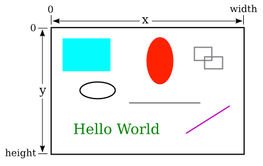
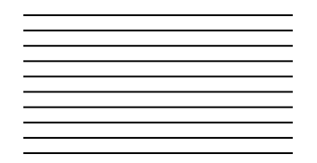
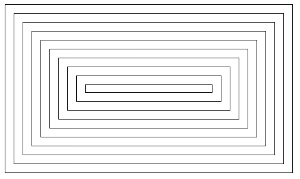

# Section 9: GUI 프로그래밍 소개

지난 두 장에 걸쳐 하나의 서브루틴 안에서 행해지는 일종의 프로그래밍, 즉 "소규모의 프로그래밍"을 배워왔다. 이 교재의 나머지 부분에서는, 더 큰 규모의 프로그램 구조에 더욱 신경을 쓰겠지만, 이미 배운 자료는 다가올 모든 것에 중요한 토대가 될 것이다. 이 절에서는 지금까지 배운 기술을 그래픽 사용자 인터페이스 프로그래밍의 맥락에서 어떻게 적용할 수 있는지 살펴본다. 여기에서, 그리고 이 교재의 나머지 부분에서, GUI 프로그램을 작성하기 위한 "툴킷(toolkit)"을 형성하는 클래스 모음인 JavaFX를 사용하여 GUI 프로그램을 작성한다. 이 절에서 언급한 모든 클래스는 JavaFX의 일부분으로, 해당 클래스를 사용하는 모든 프로그램에서 이를 불러와야 한다. JavaFX를 사용하는 프로그램을 컴파일하고 실행하는 방법은 제2장 제6절을 참조하라.

GUI 프로그램을 실행하면 컴퓨터 화면에 하나 또는 그 이상의 창이 열린다. 프로그래머로서, 창에 나타나는 것과 사용자가 이와 상호작용할 수 있는 방법을 완전히 통제할 수 있다. 첫 번째 만남으로, 간단한 예를 하나 볼 것이다: 사용자와의 상호작용 없이, 창에 직사각형이나 선과 같은 간단한 모양을 표시하는 프로그램의 기능. 일단 텍스트 기반의 명령줄 형식의 프로그램 외에 다른 맥락에서 소규모 프로그래밍이 어떻게 활용될 수 있는지 살펴보는 것이 골자다. 소규모 프로그래밍에 대한 지식이 단순히 `main()`이 아닌 서브루틴의 내부를 작성하는 데 적용된다는 것을 알게 될 것이다.

<hr>

## 1. 도형 그리기
컴퓨터 그래픽을 이해하려면 픽셀과 좌표계를 조금 알아야 한다. 컴퓨터 화면은 **픽셀(pixel)** 이라고 불리는 작은 사각형들로 이루어져 있으며, 이들은 행과 열로 배열되어 있는데, 보통 인치당 약 100픽셀 정도 된다. (현대의 많은 화면은 인치당 훨씬 더 많은 물리적 픽셀을 가지고 있다. 이러한 "고해상도(high-resolution)" 화면에서 JavaFX "픽셀"은 물리적 픽셀을 가리킬 수도 있지만, 1/100인치에 다소 가까운 측정 단위인 "논리적 픽셀"을 가리킬 가능성이 더 높다.)

컴퓨터는 픽셀의 색상을 조절하며, 그리기(drawing)는 개별 픽셀의 색상을 변경하여 이루어진다. 각 픽셀에는 픽셀의 수평 및 수직 위치를 지정하는, 종종 x 및 y 로 불리는 정수 좌표 쌍이 있다. 화면의 직사각형 영역에 그릴 때 직사각형의 왼쪽 상단 모서리에 있는 픽셀의 좌표는 (0,0)이다. x 좌표는 왼쪽에서 오른쪽으로 증가하고 y 좌표는 위에서 아래로 증가한다. 도형은 픽셀을 사용하여 명시된다. 예를 들어 직사각형은 왼쪽 위 모서리의 x 및 y 좌표와 픽셀 단위로 측정한 폭(width)과 높이(height)로 지정된다. 여기 x 좌표와 y 좌표의 범위를 보여주는 직사각형 그리기 영역의 그림이 있다. 이 그림의 "폭"과 "높이"는 그리기 영역의 크기를 픽셀 단위로 표시한다:



그리기 영역이 800 X 500픽셀이라고 가정하면, 그림의 왼쪽 위 사각형은 대략 폭 200, 높이 150를 가지며, 좌표 (50,50)에 왼쪽 위 모서리가 위치한다.

<hr>

자바에서 그리기는 **그래픽 컨텍스트(graphics context)** 를 사용하여 이루어진다. 그래픽 컨텍스트는 객체다. 객체로서 이는 서브루틴과 데이터를 포함할 수 있다. 그래픽 컨텍스트의 서브루틴 중에는 선(line), 직사각형(rectangle), 타원(oval) 및 텍스트(text)와 같은 기본 도형을 그리는 루틴이 있다. (텍스트가 화면에 나타나면, 컴퓨터가 다른 도형을 그리는 것처럼 해당 문자들이 컴퓨터에 의해 그 곳에 그려지는 것이다.) 그래픽 컨텍스트의 데이터 중에는 현재 그리기 위해 선택된 색상과 글꼴이 있다. (글꼴은 문자의 스타일과 크기를 결정한다.) 그래픽 컨텍스트의 다른 데이터 조각은 그리기가 완료된 "그리기 표면(drawing surface)"이다. 다른 그래픽 컨텍스트 객체를 다른 그리기 표면에 그릴 수 있다. 우리에게 그리기 표면은 테두리나 제목 표시줄을 포함하지 않고 창의 내용 영역이 될 것이다.

JavaFX에서 도형을 그리는 방법에는 두 가지가 있다: 도형을 **채울(fill)** 수 있는데, 이는 도형 안에 있는 픽셀의 색상을 각각 설정할 수 있다는 뜻이다. 또는 도형을 **스트로크(stroke)** 할 수 있는데, 이는 도형의 테두리를 따라 놓여 있는 픽셀의 색을 설정한다는 의미이다. 선과 같은 몇몇 도형은 스트로크만 할 수 있다. 그래픽 컨텍스트는 실제로 도형 채우기에 사용되는 색상과 도형 스트로크에 사용되는 색상, 두 가지의 개별적인 색상을 추적한다. 도형을 스트로크하는 것은 도형의 테두리를 따라 펜을 끄는 것(dragging)과 같다. 해당 펜의 속성(크기 및 실선 또는 점선을 생성하는지 여부와 같은)은 그래픽 컨텍스트의 속성이다.

그래픽 컨텍스트는 변수로 표현된다. 변수의 자료형은 GraphicsContext (문자열 변수의 자료형이 String 인 것처럼)이다. 변수의 이름은 종종 g 라고 명명되지만, 물론 이는 프로그래머에게 달려 있다. 다음은 그래픽 컨텍스트 g 에서 사용할 수 있는 몇 가지 서브루틴이다. 모든 숫자 매개변수 값은 double 자료형일 수 있다는 점에 유의하라.

- **g.setFill(c)** 은 도형을 채우는 데 사용될 색상을 설정하기 위해 호출된다. 매개변수 c 는 Color 라는 클래스에 속하는 객체다. 이 서브루틴에는 매개변수로 사용할 수 있는 표준 색상을 나타내는 상수가 많이 존재한다. 표준 색상은 `Color.BLACK`, `Color.WHITE`, `Color.RED`, `Color.GREEN`, `Color.BLUE`, 그리고 `Color.YELLOW`와 같은 일반적인 색부터, `Color.CORNFLOWERBLUE`와 같은 좀 더 이국적인 색 이름들까지에 걸쳐 있다. (나중에, 새로운 색을 생성할 수 있다는 것도 알게 될 것이다.) 예를 들어, 도형을 빨간색으로 채우려면 "`g.setFill(Color.RED);`"라고 하면 된다. `g.setFill()`이 다음에 호출되기 전까지, 지정된 색이 이후의 모든 채우기 작업에 사용된다. 이전에 그려진 도형은 영향을 받지 않는다는 점에 유의하라!
- **g.setStroke(c)** 는 도형을 스트로크하는 데 사용되는 색을 설정하기 위해 호출된다. 이는 `g.setFill`과 유사하게 작동한다.
- **g.setLineWidth(w)** 는 후속 스트로크 연산에 사용할 펜의 크기를 설정하며, 여기서 `w`는 픽셀 단위로 측정된다.
- **g.strokeLine(x1,y1,x2,y2)** 은 좌표 (x1,y1)가 있는 점부터 좌표 (x2,y2)가 있는 점까지 선을 그린다. 선의 너비는, `g.setLineWidth()`를 호출하여 다른 선 너비를 설정하지 않는 한 1이고, 색상은 `g.setStroke()`를 호출하여 다른 색상을 설정하지 않는 한 검은색이다.
- **g.strokeRect(x,y,w,h)** 는 직사각형의 윤곽을 수직과 수평으로 그린다. 이 서브루틴은 사각형의 윤곽을 그리는데, 그 상단 왼쪽 측면이 그리기 영역의 왼쪽 가장자리에서 `x` 픽셀만큼, 상단에서 `y` 픽셀만큼 떨어져 있다. 직사각형의 가로 폭은 `w` 픽셀이고, 세로 높이는 `h` 픽셀이다. 색상과 선의 폭은 `g.setStroke()` 및 `g.setLineWidth()`를 호출하여 설정한다.
- **g.fillRect(x,y,w,h)** 는 윤곽선을 그리는 대신 사각형의 내부를 채운다는 점을 제외하면 `g.strokeRect()`와 유사하며, `g.setFill()`에 의해 설정된 색상을 사용한다.
- **g.strokeOval(x,y,w,h)** 은 타원의 윤곽을 그린다. 타원은 `g.strokeRect(x,y,w,h)`로 그려질 직사각형 안에 딱 들어맞는다. 원을 가져오려면 `w`와 `h`에 대해 동일한 값을 사용하라.

- **g.fillOval(x,y,w,h)** 은 윤곽선을 그리는 대신 타원의 내부를 채운다는 점을 제외하면 `g.strokeOval()`과 비슷하다.

이는 자바 그래픽을 사용하여 몇몇 그림을 그리기에 충분한 정보이다. 간단한 것부터 시작하자면, 다음과 같은 10개의 평행선을 그리고 싶다 가정하자:



선들의 길이가 200픽셀이고 각 선에서 다음 선까지의 거리가 10픽셀이며, 좌표 (100,50)에 있는 픽셀에 첫 번째 선의 시작점을 넣는다고 하자. 선 하나를 그리려면 `g.strokeLine(x1,y1,x2,y2)`을 매개변수에 대한 적절한 값과 함께 호출하기만 하면 된다. 자, 모든 선은 x 좌표 100에서 시작되므로 상수 100을 `x1`의 값으로 사용할 수 있다. 선 길이가 200픽셀이므로 상수 300을 `x2` 값으로 사용할 수 있다. 선의 y 좌표는 다르지만, 선의 양쪽 끝점이 모두 **동일한** y 좌표를 가지므로 단일 변수를 `y1`과 `y2`의 값으로 사용할 수 있음을 알 수 있다. `y`를 해당 변수의 이름으로 사용하면, 선들 중 하나를 그리는 명령은 `g.strokeLine(100,y,300,y)`이 된다. `y`의 값은 최상단 선에서는 50이고 한 선에서 다음 선으로 이동할 때마다 10씩 증가한다. 그저 `y`가 정확한 값들의 순서를 취하는지를 확인하기만 하면 된다. 1부터 10까지를 세는 `for` 루프를 사용할 수 있다:

```java
int y;   // 선의 y 좌표
int i;   // 루프 제어 변수
y = 50;  // 첫 번째 선에 대한 y는 50부터 시작
for ( i = 1; i <= 10; i++ ) {
    g.strokeLine( 100, y, 300, y );
    y = y + 10;  // 다음 선을 그리기 전에 y를 10씩 증가시킴.
}
```

또는 마지막 선에 대한 `y`의 값이 140이라는 점에 주목하여, `y` 자체를 루프 제어 변수로 사용할 수도 있을 것이다:

```java
int y;
for ( y = 50; y <= 140; y = y + 10 )
    g.strokeLine( 100, y, 300, y );
```

선들이 파란색이 되길 바란다면, `g.setStroke(Color.BLUE)`를 이들을 그리기 **이전에** 호출할 수 있다. 색상을 정하지 않고 선만을 그리면, 이들은 검은색이 될 것이다. 선들의 너비가 3픽셀이 되길 원한다면 이들을 그리기 **이전에** `g.setLineWidth(3)`을 호출할 수 있을 것이다.

좀 더 복잡한 것을 위해서, 무작위로 색칠되고, 배치되고, 채워지는 원들을 많이 그려보자. 몇몇 색상밖에 모르기에 필자는 무작위로 빨강, 초록, 파랑, 또는 노랑으로 색을 고를 것이다. 이 작업은 제3장 제6절 제4관의 것과 유사한 간단한 switch 문으로 수행될 수 있다:

```java
switch ( (int)(4*Math.random()) ) {
    case 0:
        g.setFill( Color.RED );
        break;
    case 1:
        g.setFill( Color.GREEN );
        break;
    case 2:
        g.setFill( Color.BLUE );
        break;
    case 3:
        g.setFill( Color.YELLOW );
        break;
}
```

필자는 무작위로 원의 중심점을 선택할 것이다. 그리기 영역의 폭은 변수 `width`에 의해 주어진다고 하자. 그런 다음 중심의 수평 위치에 관한 0부터 `width`-1까지의 범위 사이의 무작위 값을 원한다. 이와 유사하게, 중심의 수직 위치는 0부터 `height`-1까지의 범위에서 무작위의 값이 될 것이다. 이는 원의 크기를 결정하게 한다; 필자는 각 원의 반지름을 50픽셀과 같게 만들 것이다. `g.fillOval(x,y,w,h)` 형식의 문장으로 원을 그릴 수 있다. 그러나 이 명령에서 `x`와 `y`는 원의 중심 좌표가 아니다; 이들은 원을 중심으로 그려진 직사각형의 왼쪽 상단 모서리가 된다. `x`와 `y`의 값을 구하려면 원의 중심에서 원의 반지름과 같은 50픽셀씩 뒤로 이동해야 한다. `w`와 `h` 매개변수는 직사각형의 폭과 높이를 제공하며, 이 경우 반지름의 두 배, 즉 100픽셀이어야 한다. 이 모든 것을 고려하여, 무작위의 원을 그리기 위한 코드 조각은 다음과 같다:

```java
centerX = (int)(width*Math.random());
centerY = (int)(height*Math.random());
g.fillOval( centerX - 50, centerY - 50, 100, 100 );
```

이 코드는 위에 주어진 색상 설정 코드 다음에 등장한다. 마지막에, 필자는 채워진 각 원의 주변을 검은 윤곽선으로 다시 그리면 그림이 더 잘 보인다는 것을 알게 되었고, 따라서 그 끝에 이 코드를 추가하였다:

```java
g.setStroke( Color.BLACK );
g.strokeOval( centerX - 50, centerY - 50, 100, 100 );
```

최종적으로, 많은 수의 원을 얻기 위해, 필자는 위의 모든 코드를 500회 실행하는 `for` 루프에 넣었다. 다음은 프로그램의 전형적인 그리기로, 축소된 크기로 표시된 것이다:


<hr>

## 2. 프로그램에서 그리기
자, 알다시피 자립하고 있는 자바 코드 뭉치를 그냥 얻을 수는 없다. 코드는 클래스 정의 안에 있는 서브루틴의 정의 안에 있어야 한다. 사실, 필자의 원 그리기 프로그램의 경우, 그림을 그리는 완전한 서브루틴은 다음과 같이 보인다:

```java
public void drawPicture(GraphicsContext g, int width, int height) {

    g.setFill(Color.WHITE);
    g.fillRect(0, 0, width, height); // 우선, 배경색을 채움.

    // 예제로써, 상당한 수의 색칠된 원형(disk)을 그린다.
    // 다른 그림을 얻으려면 이 코드를 지우고 당신 고유의 것으로 대체하라. 

    int centerX;     // 원형의 중심에 관한 x 좌표.
    int centerY;     // 원형의 중심에 관한 y 좌표.
    int colorChoice; // 무작위 색상을 선택하는데 사용됨.
    int count;       // 원형을 세기 위한 루프 제어 변수

    for (count = 0; count < 500; count++) {

        centerX = (int)(width*Math.random());
        centerY = (int)(height*Math.random());

        colorChoice = (int)(4*Math.random());
        switch (colorChoice) {
        case 0:
            g.setFill(Color.RED);
            break;
        case 1:
            g.setFill(Color.GREEN);
            break;
        case 2:
            g.setFill(Color.BLUE);
            break;
        case 3:
            g.setFill(Color.YELLOW);
            break;
        }

        g.fillOval( centerX - 50, centerY - 50, 100, 100 );
        g.setStroke(Color.BLACK);
        g.strokeOval( centerX - 50, centerY - 50, 100, 100 );
    }

} // drawPicture() 종료
```

이는 `main()` 이외의 서브루틴 정의로써 처음 보았을 것이나, 서브루틴 정의에 대해서는 다음 장에서 전부를 배우게 될 것이다. 정의의 첫 번째 행은 서브루틴에서 사용되는 특정 값, 즉 그래픽 컨텍스트 `g`와 그리기 영역의 `width`와 `height` 값을 사용할 수 있게 한다. 이 값들은 서브루틴 밖에서 나오지만 서브루틴은 이들을 사용할 수 있다. 여기서 요점은, 무엇을 그리려면 `main()`의 안쪽을 채워 프로그램을 작성하는 것처럼 서브루틴의 안쪽만 채우면 된다는 것이다.

서브루틴 정의는 여전히 프로그램을 정의하는 클래스 안에 들어가야 한다. 이 경우 클래스의 이름은 SimpleGraphicsStarter, 전체 프로그램은 샘플 소스 코드 파일 SimpleGraphicsStarter.java에서 이용할 수 있다. 해당 프로그램을 실행하면 그리기를 볼 수 있다. 이 샘플 프로그램을 당신 자신의 그림을 그리는 출발점으로 사용할 수 있다.

해당 프로그램에는 이해하지 못할 많은 것들이 있을 터이다. 직접 그리기 위해서는 소스코드에서 `drawPicture()` 루틴의 내부를 지우고 자신의 그리기 코드로 대체하기만 하면 된다. 나머지를 이해할 필요는 없다.

(그런데, `main()` 서브루틴은 그 정의에서 `static`이라는 단어를 사용하지만, `drawPicture()`는 그렇지 않다는 것을 알았을지도 모르겠다. 이는 `drawPicture`가 클래스가 아닌 객체의 서브루틴이라는 사실과 관계가 있다. 정적(static) 서브루틴과 비정적(non-static) 서브루틴의 차이는 중요하지만 당분간 걱정해야 할 것은 아니다. 이는 제5장에서 중요한 일이 될 것이다.)

<hr>

## 3. 애니메이션
그림을 그리는 아이디어를 **애니메이션(animation)** 제작으로 확대할 수 있다. 컴퓨터 애니메이션은 단순히 개별 그림들의 나열일 뿐이며, 이들이 차례대로 빠르게 표시된다. 각 그림에서 다음 그림으로의 변화가 작을 경우 사용자는 이미지의 나열을 연속적인 애니메이션으로 인식하게 된다. 애니메이션에 나오는 각각의 그림을 **프레임(frame)** 이라고 부른다. 샘플 프로그램 SimpleAnimationStarter.java는 애니메이션을 작성하기 위한 출발점으로 사용할 수 있다. 이에는 애니메이션에서 하나의 프레임을 그리는 `drawFrame()`이라는 서브루틴이 들어 있다. 이 서브루틴의 정의를 채워 애니메이션을 만들 수 있다. 그래픽 컨텍스트 및 그리기 영역의 폭과 높이 외에도, 코드에서 다른 두 변수들의 값을 사용할 수 있다: `frameNumber` 및 `elapsedSeconds`. `drawFrame` 서브루틴은 초당 약 60회 호출된다. 변수 `frameNumber`는 서브루틴의 연속된 호출에서 0, 1, 2, 3, ...의 값을 취하며, `elapsedSeconds`의 값은 애니메이션이 실행된 초단위 시간이다. 코드에서 이러한 변수들 중 하나를 사용하면 `drawFrame()` 그리기를 호출할 때마다 다른 그림을 그릴 수 있으며, 사용자는 일련의 그림을 애니메이션으로 볼 수 있다.

애니메이션의 예로서, 중첩된 직사각형 집합 그리기를 볼 것이다. 직사각형은 그림의 중앙을 향해 축소되어 무한한 움직임의 환영을 일으킬 것이다. 애니메이션의 한 프레임은 다음과 같다:



이런 그림을 어떻게 그리는지 생각해보자. 해당 직사각형들은 바깥쪽에서 시작하여 안으로 들어가는 직사각형을 그리는 `while` 루프를 이용하여 그릴 수 있다. 어떤 변수가 필요할지, 그리고 `while` 루프의 한 반복에서 다음으로 넘어갈 때 이들이 어떻게 변화하는지 생각해보라. 매번 루프를 통해 그려지는 직사각형은 이전 직사각형보다 작아지고, 아래와 위로 조금씩 이동하게 된다. 두 직사각형의 차이는 그 크기와 왼쪽 상단 모서리의 좌표에 있다. 직사각형의 폭과 높이를 나타내는 변수가 필요하며, 필자는 이를 `rectWidth`과 `rectHeight`로 부를 것이다. 왼쪽 상단 모서리의 x 좌표와 y 좌표는 동일하며, 동일한 변수로 나타낼 수 있다. 필자는 이 변수를 `inset`이라고 부를 것인데, 왜냐하면 이는 직사각형의 모서리들이 그리기 영역의 가장자리에 삽입(inset)되는 양이기 때문이다. 폭과 높이는 한 직사각형에서 다음 직사각형으로 가면서 감소하는 반면, `inset`은 증가한다. `while` 루프는 폭이나 높이가 0보다 작거나 같을 때 끝이 난다. 일반적으로 하나의 프레임을 그리는 알고리즘은 다음과 같다:

```java
그리기 영역을 흰색으로 채운다
첫 번째 직사각형의 인셋 양을 설정한다
첫 번째 직사각형의 폭과 높이를 설정한다
스트로크 색상을 검은색으로 설정한다
폭과 높이가 모두 0보다 큰 동안에:
직사각형을 그린다(g.strokeRect 서브루틴 사용)
인셋을 증가시킨다(다음 직사각형으로 이동하기 위해)
폭과 높이를 감소시킨다(다음 직사각형이 작아지도록 하기 위해)
```

필자의 프로그램에서 각 직사각형은 이를 둘러싸고 있는 직사각형으로부터 15픽셀만큼 떨어져 있기 때문에, `while` 루프를 통할 때마다 `inset`이 15픽셀씩 증가한다. 직사각형은 왼쪽으로 15픽셀씩, 그리고 오른쪽으로 15픽셀씩 줄어들기 때문에, 다음 직사각형을 그리기 전에 직사각형의 폭이 30픽셀씩 줄어든다. 높이도 루프를 통하면서 매번 30픽셀씩 줄어든다.

첫 번째 사각형에 관한 인셋, 폭, 높이에 어떤 초기 값을 사용할지 알아야 한다는 점을 제외하면, 해당 유사코드는 자바로 쉽게 번역된다. 이를 알아내기 위해서는 그림이 애니메이션이 되며, 그려지는 것이 어떤 식으로든 프레임 번호에 의존한다는 점을 생각해야 한다. 한 프레임에서 애니메이션의 다음 프레임으로, 바깥쪽 직사각형의 왼쪽 상단 모서리가 아래와 위로 움직인다; 즉, 바깥쪽 직사각형에 대한 `inset`이 한 프레임에서 다음 프레임으로 가면서 증가한다. 프레임 번호 0에서 0으로, 프레임 번호 1에서 1로, 등의 각각에 대한 인셋을 설정하여 이런 일이 생기도록 할 수 있다. 하지만 이는 영원히 계속될 수 없으며, 결국 모든 직사각형이 사라질 것이다. 사실, 애니메이션이 프레임 15에 도달하면 새로운 직사각형이 그리기 영역의 바깥쪽에 나타나야 하지만 — 이는 실제로는 "새로운 직사각형"이 아니라, 바깥쪽 직사각형의 `inset`이 0으로 되돌아가는 것뿐이다. 그래서 애니메이션이 진행되면서 인셋은 0, 1, 2, ..., 14 값들의 순서를 반복해서 거쳐야 한다. 다음을 설정하여 이를 매우 쉽게 이룰 수 있다:

```java
inset = frameNumber % 15;
```

마지막으로, 첫 번째 직사각형은 해당 직사각형 바깥쪽 주변의 `inset` 크기의 테두리를 제외하고 그리기 영역을 채운다는 점에 유의하라. 즉, 직사각형의 폭은 그리기 영역의 폭에서 인셋의 2배를 뺀 값이며, 높이도 이와 마찬가지다. 이동하는 직사각형 예제를 위한 `drawFrame()` 서브루틴이 여기에 있다:

```java
public void drawFrame(GraphicsContext g, int frameNumber,
double elapsedSeconds, int width, int height) {

    g.setFill(Color.WHITE);
    g.fillRect(0,0,width,height);  // Fill drawing area with white.

    double inset; // Gap between edges of drawing area and outer rectangle.

    double rectWidth, rectHeight;   // The size of one of the rectangles.

    g.setStroke(Color.BLACK);  // Draw the rectangle outlines in black.

    inset = frameNumber % 15 + 0.5;  // (The 0.5 is a technicality that gives
                                     //  a sharper picture.)

    rectWidth = width - 2*inset;
    rectHeight = height - 2*inset;

    while (rectWidth >= 0 && rectHeight >= 0) {
        g.strokeRect(inset, inset, rectWidth, rectHeight);
        inset += 15;       // rectangles are 15 pixels apart
        rectWidth -= 30;
        rectHeight -= 30;
    }

}
```

프로그램의 전체 소스 코드는 샘플 프로그램 MovingRects.java에서 찾을 수 있다. 한 번 보라! 훌륭한 효과일 것이다. 애니메이션의 다른 예제는 샘플 프로그램 RandomCircles.java를 참고하라. 해당 프로그램은 각 프레임의 그림에 무작위로 색칠된 원형 하나를 추가한다; 이는 다음 프레임이 그려지기 전에 한 프레임의 이미지가 자동으로 지워지지는 않는다는 사실을 보여준다.
