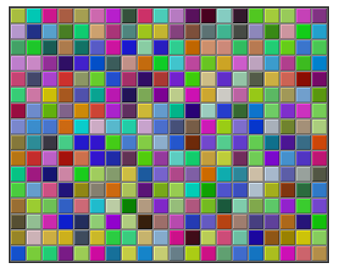

# Section 7: 프로그램 설계

프로그램이 어떻게 작동하는지 이해하는 것 은 하나의 일이다. 어떤 특정한 작업을 수행하기 위해 프로그램을 설계하는 것은 완전히 별개의 일이다. 제3장 제2절에서, 알고리즘을 체계적으로 개발하기 위해 어떻게 유사코드와 단계적 개량(stepwise refinement)을 사용할 수 있는지에 대해 논의하였다. 이제 서브루틴이 그 과정에 어떻게 어울리는지를 알 수 있다.

단계적 개량은 본질적으로 하향식 프로세스지만, 해당 프로세스에는 "바닥(bottom)", 즉 유사코드 알고리즘의 개량을 중단하고 자신이 가지고 있는 것을 적절한 프로그램 코드로 직접 번역하는 지점이 있다. 서브루틴이 없는 경우, 할당문과 매우 원시적인 입/출력 작업의 수준으로 내려갈 때까지 프로세스는 바닥을 드러내지 않을 것이다. 그러나 만약 어떤 유용한 작업을 수행하기 위해 놓여있는 서브루틴을 가지게 된다면, 이러한 작업들에 관해서 자신의 알고리즘을 그럭저럭 표현하자마자 개량을 멈출 수 있다.

이는 단계적 개량의 하향식 접근법에 상향식 요소를 추가할 수 있도록 한다. 문제가 주어지면, 해당 문제의 영역(domain)과 관련된 작업을 수행하는 몇몇 서브루틴을 작성하는 것으로 시작할 수 있을 것이다. 해당 서브루틴은 개발하면서 알고리즘과 통합할 수 있는 기성적인(ready-made) 도구의 도구상자(toolbox)가 된다. (그렇지 않으면, 프로젝트에서 블랙박스로 사용할 수 있는 서브루틴을 포함하고 있는, 다른 사람이 작성한 소프트웨어 도구상자를 구입하거나 찾을 수도 있을 것이다.)

서브루틴은 엄격한 하향식 접근법에서도 도움이 될 수 있다. 알고리즘을 정교하게 다듬을 때, 임의의 지점에서 알고리즘의 하위 작업을 잡은 뒤 이를 서브루틴으로 만드는 것을 자유롭게 할 수 있다. 해당 서브루틴을 개발하는 것은 별개의 문제가 될 것이고, 이를 별도로 작업할 수 있다는 말이다. 주요 알고리즘은 그저 서브루틴을 호출할 뿐이다. 물론 이는 문제를 별개의, 더 작은 문제들로 분해하는 하나의 방법일 뿐이다. 문제의 하향식 분석은 어떤 서브루틴을 써야 하는지 알려주기에 이는 여전히 하향식 접근법이다. 상향식 접근법에서는 문제 영역과 관련된 서브루틴을 작성하거나 얻는 것으로 시작하며, 서브루틴의 기반 위에 해당 문제에 대한 해법을 구축한다.

<hr>

## 1. 전제조건과 사후조건
서브루틴을 구성요소로 사용할 때 서브루틴이 프로그램의 나머지 부분과 어떻게 상호작용하는지를 명확히 하는 것이 중요하다. 이러한 상호작용은 제4장 제1절에서 논의된 바와 같이 서브루틴의 **계약(contract)** 에 의해 명시된다. 서브루틴의 계약을 표현하기 위한 편리한 방법은 **전제조건(precondition)** 과 **사후조건(postcondition)** 의 측면에서 검토된다.

서브루틴의 전제조건은 서브루틴이 호출될 때 서브루틴이 올바르게 작동하려면 반드시 참이어야 하는 것이다. 예를 들어 내장 함수 `Math.sqrt(x)`의 경우, 매개변수 x가 음수의 제곱근을 취할 수 없기 때문에 0보다 크거나 같을 것이 전제조건이다. 계약이란 측면에서 전제조건은 서브루틴 호출자 (caller)의 책무(obligation)를 나타낸다. 전제조건을 충족시키지 못한 채 서브루틴을 호출하면, 이것이 제대로 작동하리라고 기대할 까닭이 없는 것이다. 해당 프로그램은 충돌하거나 잘못된 결과를 줄 수도 있지만, 탓할 수 있는 대상은 당신뿐이며 서브루틴은 아니다. 거래에서 당신 쪽이 책임을 다하지 못하였기 때문이다.

서브루틴의 사후조건은 계약의 다른 면을 나타낸다. 이는 서브루틴의 책무를 나타낸다. 이는 서브루틴이 실행된 후에 (그 전제조건이 충족되었고 — 서브루틴에 버그가 없다고 가정한다면) 참이 되어야 하는 무언가이다. `Math.sqrt()` 함수의 사후조건은 이 함수에 의해 반환되는 값의 제곱이 서브루틴을 호출할 때 제공되는 매개변수와 같다는 것이다. 물론 이는 전제조건 — 매개변수가 0보다 크거나 같다 — 이 충족되는 경우에만 비로소 참일 것이다. 내장 서브루틴 `System.out.print(x)`의 사후조건은 매개변수의 값이 화면에 표시되었다는 것이다.

전제조건은 대부분 `Math.sqrt(x)`의 예와 같이 허용 가능한 매개변수 값에 제한을 준다. 그러나, 이들은 또한 서브루틴에서 사용되는 전역변수를 참조할 수도 있다. 혹은, 만약 특정 시간에 서브루틴을 호출하는 것이 타당하다면, 해당 전제조건은 서브루틴을 호출할 때 프로그램이 반드시 있어야 하는 상태를 가리킬 수도 있다.

반면 서브루틴의 사후조건은 서브루틴이 수행하는 작업을 명시한다. 함수의 경우, 사후조건은 함수가 반환하는 값을 명시해야 한다.

서브루틴은 때때로 해당 전제조건과 사후조건을 명시적으로 지정한 주석으로 묘사되기도 한다. 미리 작성된 서브루틴이 주어졌을 때, 그 전제조건과 사후조건에 대한 설명은 이를 어떻게 사용하는지 그리고 무엇을 하는지를 알려준다. 서브루틴을 작성하도록 할당되었을 때, 전제조건과 사후조건은 서브루틴이 무엇을 할 것으로 예상되는지에 대한 정확한 명세(specification)를 제공한다. 필자는 이 절의 나머지 부분을 구성하는 예에서 이러한 접근법을 사용할 것이다. 해당 주석은 자바독 주석의 형태로 주어지지만, 필자는 그 전제조건과 사후조건에 명시적으로 레이블(label)을 붙일 것이다. (많은 컴퓨터 과학자들은 전제조건과 사후조건의 명시적인 레이블링(labeling)을 위해 새로운 문서 태그 `@precondition`과 `@postcondition`을 자바독 시스템에 추가해야 한다고 생각하지만, 이는 아직 이루어지지 않았다.)

<hr>

## 2. 설계 예제
서브루틴을 이용한 프로그램 설계의 예를 살펴보자. 이 예제에서는 미리 작성된 서브루틴을 구성요소로 사용하고 프로젝트를 완료하는 데 필요한 서브루틴도 새로 설계할 것이다. 여기서 사용할 API는 필자가 작성한 두 클래스에 정의된 Mosaic.java로, 이는 차례로 MosaicCanvas.java에 의존한다. API를 사용하는 프로그램을 컴파일하고 실행하기 위해서는 Mosaic 및 MosaicCanvas 클래스를 반드시 이용할 수 있어야 한다. 즉 `Mosaic.java` 및 `MosaicCanvas.java` 파일, 또는 이에 대응하는 컴파일된 클래스 파일이 반드시 프로그램을 정의하는 클래스와 동일한 폴더에 있어야 한다.

그래서, 필자가 `Mosaic`라고 불리는, 이미 작성된 클래스에 접근하였다고 가정해보자. 이 클래스는 프로그램이 행과 열로 정렬된 작은 색상의 직사각형을 표시하는 윈도우를 다룰 수 있도록 한다. 윈도우는 `Mosaic` 클래스에 정의된 정적 멤버 서브루틴으로 열거나 닫거나 조작할 수 있다. 실제로 해당 클래스는 이러한 윈도우를 다루는 데 사용할 수 있는 도구박스나 API를 정의한다. 다음은 API에서 자바독 스타일의 주석이 달린, 사용 가능한 몇 가지 루틴이다. (자바독 주석이 주석이 달린 것보다 먼저 나온다는 것을 기억하라.)

```java
/**
* 화면에 "모자이크(Mosaic)" 윈도우를 연다. 이 서브루틴은 반드시
* 어떤 다른 모자이크 서브루틴이 사용되기 전에 호출되어야 한다.
* 이 프로그램은 사용자가 윈도우를 닫으면 종료될 것이다.
*
* 전제조건: 매개변수 rows, cols, h, 그리고 w는 양의 정수이다.
* 사후조건: 색칠된 직사각형의 행과 열을
*                   표시할 수 있는 윈도우가 화면에 열린다. 각각의
*                   직사각형은 w 픽셀의 폭과 h 픽셀의 높이를 가진다.
*                   행의 갯수는 첫 번째 매개변수로 주어지며 열의 갯수는
*                   두 번째로 주어진다. 초기에, 모든 직사각형은 검은색이다.
*
* 주의: 행(rows)은 0부터 rows - 1까지 번호가 부여되며, 열(columns)은
* 0부터 cols - 1까지 번호가 부여된다.
*/
public static void open(int rows, int cols, int h, int w)


/**
* 윈도우에서 사각형 중 하나의 색상을 설정한다.
*
* 전제조건: 행과 열은 그 숫자의 유효한 범위 내에 있으며,
*                   r, g, 그리고 b는 0부터 255 사이의 범위에 있다.
* 사후조건: 행 번호 row 및 열 번호 col에 있는 사각형의 색은
*                   r, g, 그리고 b에 의해 명시된 색으로 설정된다.
*                   0은 빨간색이 없음을 표시하고 255는 가능한 
*                   최대의 빨간색 농도를 표시하는 색상에서
*                   r은 빨간색의 농도를 가한다. r의 값이 커질수록,
*                   색상에서 빨간색이 더 강해진다. g 및 b도
*                   녹색 및 파란색 요소에 대하여 마찬가지로 작동한다..
*/
public static void setColor(int row, int col, int r, int g, int b)


/**
* 사각형 중 하나의 색상에서 빨간색 요소를 얻는다.
*
* 전제조건: row 및 col이 행과 열 번호의 유효한 범위 내에 있다.
* 사후조건: 명시된 사각형에 대한 색상의 빨간색 요소는
*                   0과 255 사이에 범위에 있는 정수로 반환된다.
*/
public static int getRed(int row, int col)


/**
* getRed와 같지만, 색상의 녹색 요소를 반환한다.
*/
public static int getGreen(int row, int col)


/**
* getRed와 같지만, 색상의 파란색 요소를 반환한다.
*/
public static int getBlue(int row, int col)


/**
* 프로그램에 지연시간(delay)을 삽입한다(예컨대 색상이 변경되는
* 속도를 조절하기 위해).
*
* 전제조건: 밀리세컨드(milliseconds)는 양의 정수이다.
* 사후조건: 프로그램은 적어도 명시된 밀리세컨드
*                   숫자에서 멈추며, 여기서 1초는
*                   1000밀리세컨드와 동일하다.
*/
public static void delay(int milliseconds)
```

이러한 서브루틴들은 `Mosaic` 클래스의 멤버이므로, `Mosaic`의 외부에서 이들을 호출할 때에는 반드시 해당 클래스의 이름을 루틴 이름의 일부로 포함시켜야 한다는 점을 기억하라. 예를 들어, 단순히 `isOpen()`이 아니라 `Mosaic.isOpen()`이라는 이름을 사용해야 할 것이다.

서브루틴에 대한 주석은 전제조건이 충족되지 **않았을** 때 어떤 일이 일어나는지를 명시하지 않는다는 점을 깨달았을 것이다. 서브루틴은 계약상 그러한 경우에 특별한 어떤 일을 해야 할 책무가 정말로 있는 것은 아니지만, 어떠한 일이 일어나는지 아는 것이 좋을 것이다. 예를 들어, `setColor()` 또는 `getRed()` 루틴에서 "row 및 col이 행과 열 번호의 유효한 범위 내에 있다."는 전제조건이 위반된 경우, llegalArgumentException 이 던져질 것이다. 이러한 사실을 알면 해당 예외를 포착(catch)하고 처리하는 프로그램을 작성할 수도 있을 것이고, 자바독 주석에 `@throw` 문서 태그로 이를 문서화하는 것도 좋은 생각이다. 서브루틴의 동작에 대한 다른 의문점들이 남아있다. 예를 들어, `Mosaic.open()`을 호출하는데 이미 화면에 모자이크 윈도우가 열려 있다면 어떻게 되는가? (실제로는, 두 번째 호출은 간단히 무시될 것이다.) 소프트웨어 일부분의 동작을 완전히 문서화하기는 어려우며 — 때로는 전체 소스 코드를 실험하거나 살펴보기만 하면 된다.

<hr>

프로그램에 대한 필자의 아이디어는 `Mosaic` 클래스를 깔끔한 애니메이션을 위한 기초로 사용하는 것이다. 무작위로 색칠된 정사각형들로 윈도우를 채운 다음, 윈도우가 열려 있는 한 계속 이어지는 루프 속에서 색상을 무작위로 바꾸고 싶다. "색상을 무작위로 바꾼다"는 말에는 여러 의미가 있겠지만, 잠시 생각한 끝에, 필자는 윈도우 주변을 무작위로 돌아다니면서 마주치는 각각의 정사각형 색상을 변경하는 "교란(disturbance)"이 흥미로울 것이라 판단하였다. 윈도우의 내용이 한 순간에 어떻게 보일 수 있는지를 표시하는 사진이 여기에 있다:



윈도우를 기반으로써 조작하는 기본적인 루틴의 존재로, 필자는 당면한 구체적인 문제에 눈을 돌릴 수 있게 된다. 프로그램의 기본적인 개요는 다음과 같다:

```java
모자이크 윈도우를 연다
윈도우를 무작위 색상으로 채운다
주위를 돌아다니면서, 무작위로 정사각형을 바꾼다
```

무작위 색으로 윈도우를 채우는 것은 필자가 별도로 작업할 수 있는, 일관성 있는 훌륭한 작업인 것으로 보이기에, 이를 하기 위한 개별적인 서브루틴을 따로 작성하기로 하자. 세 번째 단계는 다음과 같이 조금 더 확장될 수 있다: 윈도우 가운데에서 시작한 다음, 계속해서 새로운 사각형으로 이동하여 해당 사각형의 색을 변경한다. 이는 모자이크 윈도우가 여전히 열려 있는 한 계속되어야 한다. 따라서 알고리즘을 다음과 같이 개량할 수 있다:

```java
모자이크 윈도우를 연다
윈도우를 무작위 색상으로 채운다
윈도우의 가운데 사각형을 현재의 위치로 설정한다
모자이크 윈도우가 열려 있는 한:
현재 위치에 있는 정사각형의 색상을 무작위로 변경한다
현재 위치에서 상, 하, 좌, 또는 우로 무작위하게 이동한다
```

어떤 식으로든 현재의 위치를 표시할 필요가 있다. 이 작업은 `currentRow`와 `currentColumn`이라는 두 개의 int 변수를 사용하여 할 수 있다. 이들은 현재 교란이 위치한 정사각형의 행 번호와 열 번호를 가지고 있다. 필자는 모자이크에서 16행과 20열의 정사각형들을 사용할 것이므로, 현재 위치를 가운데로 설정한다는 것은 `currentRow`를 8로, `currentColumn`을 10으로 설정함을 의미한다. 필자는 이미 윈도우를 열기 위한 서브루틴 `Mosaic.open()`을 가지고 있다. 메인 루틴을 단순하게 유지하기 위해, while 루프 안에서 두 작업을 수행할 서브루틴 두 개를 더 작성하기로 결정하였다. 해당 알고리즘은 자바로 다음과 같이 작성할 수 있다:

```java
Mosaic.open(16,20,25,25)
fillWithRandomColors();
currentRow = 8;       // 행의 중간, 윈도우 아래의 중간 지점.
currentColumn = 10;   // 열의 중간.
while ( true ) { // 사용자가 윈도우를 닫으면 프로그램이 종료됨.
    changeToRandomColor(currentRow, currentColumn);
    randomMove();      
}
```

이는 적절한 감싸기(wrapper)를 가진, 본질적으로 필자 프로그램의 `main()` 루틴에 해당한다. 완성된 프로그램을 실행한 후 작은 수정 작업을 한 번 하기로 필자가 결정했던 사실도 드러난다: 애니메이션이 너무 빨리 실행되는 것을 막기 위해, `while` 루프에 "`Mosaic.delay(10);`" 행을 추가하였다.

`main()` 루틴은 수습되었지만, 프로그램을 완료하려면 `fillWithRandomColors()`, `changeToRandomColor(int,int)`, 그리고 `randomMove()` 서브루틴을 작성해야 한다. 이러한 서브루틴을 각각 작성하는 것은 별개의, 작은 작업이다. `fillWithRandomColors()` 루틴은 "모자이크에 있는 각각의 직사각형이 무작위 색상으로 변경된다"는 사후조건에 의해 정의된다. 이 작업을 수행하기 위한 알고리즘에 대한 유사코드는 다음과 같이 주어질 수 있다:

```java
각 행에 대하여:
    각 열에 대하여:
        해당 행과 열에 있는 정사각형의 색을 무작위로 설정한다
```

"각 행에 대하여(for each row)" 및 "각 열에 대하여(for each column)"는 for 루프로 구현될 수 있다. 이미 색상을 설정하는 데 사용될 수 있는 서브루틴 `changeToRandomColor`를 작성할 계획이 세워졌다. (여러 곳에서 서브루틴이 재사용될 가능성은 서브루틴을 사용할 때의 큰 보상 중 하나이다!) 따라서, `fillWithRandomColors()`는 다음과 같이 적절하게 자바로 작성할 수 있다:

```java
static void fillWithRandomColors() {
    int row, column;
    for ( row = 0; row < 16; row++ )
    for ( column = 0; column < 20; column++ )
    changeToRandomColor(row,column);
}
```

`changeToRandomColor` 서브루틴으로 돌아가면, 정사각형의 색상을 변경하는데 사용할 수 있는, `Mosaic` 클래스에 있는 메서드, `Mosaic.setColor()`를 이미 가지고 있다. 무작위 색상을 원한다면 `r`, `g`, 그리고 `b`에 대한 무작위 값을 선택하기만 하면 된다. `Mosaic.setColor()` 서브루틴의 전제조건에 따르면, 이러한 무작위 값은 반드시 0부터 255 사이의 범위에 있는 정수여야 한다. 이러한 정수를 무작위로 선택하는 공식은 "`(int)(256*Math.random())`"이다. 따라서 무작위 색상을 설정하는 서브루틴은 다음과 같게 된다:

```java
static void changeToRandomColor(int rowNum, int colNum) {
    int red = (int)(256*Math.random());
    int green = (int)(256*Math.random());  
    int blue = (int)(256*Math.random());
    Mosaic.setColor(rowNum,colNum,red,green,blue);  
}
```

마지막으로, 교란을 상, 하, 좌, 또는 우로 무작위로 이동시키는 `randomMove` 서브루틴을 생각해보자. 네 방향 중에서 무작위 선택이 되게 하려면, 0에서 3 사이의 범위에서 무작위 정수를 선택할 수 있다. 정수가 0이면 한 방향으로 이동한다; 1이면 다른 방향으로 이동한다; 기타 등등. 교란의 위치는 `currentRow` 및 `currentColumn` 변수에 의해 주어진다. "위로 이동한다"는 것은 `currentRow`에서 1을 빼는 것을 의미한다. 이는 `currentRow`가 -1이 되면 어떻게 해야 하는지에 대한 문제를 야기하는데, 이에 의해 교란이 윈도우 위에 위치하게 될 것이다(이는 Mosaic 서브루틴의 몇 가지 전제조건을 위반하는 것이다.) 이런 일이 발생하게 내버려두기보다는, `currentRow`를 15로 설정하여 격자의 반대쪽 가장자리로 교란을 이동시키기로 결정한다. (16개의 행은 0부터 15까지의 번호가 매겨진다는 것을 기억하라.) 반대쪽 가장자리로 이동하는 것의 다른 방안은 이 경우 아무 것도 하지 않는 것이다. 교란을 하, 좌, 우로 옮기는 일도 이와 마찬가지로 처리된다. `switch` 문을 사용하여 이동할 방향을 결정하는 경우 `randomMove` 코드는 다음과 같이 될 것이다:

```java
int directionNum;
directionNum = (int)(4*Math.random());
switch (directionNum) {
    case 0:  // 위로 이동
        currentRow--;
        if (currentRow < 0)   // CurrentRow가 모자이크 밖으로 나가면;
            currentRow = 15;   // 반대쪽 가장자리로 이를 이동.
            break;
    case 1:  // 오른쪽으로 이동
        currentColumn++;
        if (currentColumn >= 20)
            currentColumn = 0;
            break;
    case 2:  // 아래로 이동
        currentRow++;
        if (currentRow >= 16)
            currentRow = 0;
        break;
    case 3:  // 왼쪽으로 이동
        currentColumn--;
        if (currentColumn < 0)
            currentColumn = 19;
        break;
}
```

<hr>

## 3. 프로그램
이 모든 것을 종합하면 다음과 같은 완전한 프로그램을 얻게 된다. 필자가 클래스 자체와 각각의 서브루틴에 대하여 자바독 스타일의 주석을 덧붙였다는 점에 유의하라. `currentRow` 및 `currentColumn` 변수는 각각 여럿의 다른 서브루틴에서 사용되기 때문에 지역 변수가 아닌 클래스의 정적 멤버로 정의된다. 소스 코드의 사본은 RandomMosaicWalk.java에서 찾을 수 있다. 이 프로그램은 실제로 두 개의 다른 파일인 Mosaic.java와 MosaicCanvas.java에 의존하고 있음을 기억하라.

```java
/**
* 이 프로그램은 무작위로 채색된 정사각형으로 가득 찬 윈도우를 연다. "교란(disturbance)"은
* 윈도우 주변을 무작위하게 움직이면서 이와 마주친 각각의 정사각형 색상을 무작위로 변경한다.
* 해당 프로그램은 사용자가 윈도우를 종료하기 전까지 실행된다.
*/
public class RandomMosaicWalk {

static int currentRow;    // 교란을 포함하고 있는 현재 행.
static int currentColumn; // 교란을 포함하고 있는 현재 열.

/**
    * 메인 프로그램은 윈도우를 생성하고 이를 무작위한 색상들로 채우며,
    * 윈도우가 열려 있는 한 교란이 해당 윈도우 주변을 무작위로 돌아다니게 한다.
      */
      public static void main(String[] args) {
      Mosaic.open(16,20,25,25);
      fillWithRandomColors();
      currentRow = 8;   // 윈도우의 중심에서 시작
      currentColumn = 10;
      while (true) {
      changeToRandomColor(currentRow, currentColumn);
      randomMove();
      Mosaic.delay(10);  // 속도를 올리려면 이 행을 지울 것!
      }
      }  // main 종료

/**
    * 윈도우를 무작위 색상의 정사각형들로 채운다.
    * 전제조건: 모자이크 윈도우가 열려 있다.
    * 사후조건: 각각의 정사각형에 무작위 색상이 설정된다.
      */
      static void fillWithRandomColors() {
      int row, column;
      for ( row=0; row < 16; row++ ) {
      for ( column=0; column < 20; column++ ) {
      changeToRandomColor(row, column);  
      }
      }
      }  // fillWithRandomColors 종료

/**
    * 하나의 정사각형을 새롭게 무작위로 선택된 색상으로 변경한다.
    * 전제조건: 지정된 rowNum 및 colNum이 행과 열 번호들의 유효한 범위 안에 있다.
    * 사후조건: 지정된 행과 열의 정사각형은 무작위 색상으로 설정된다.
    * @param rowNum 정사각형의 행 번호로, 최상단에서 0으로
    *      시작하여 내려오면서 증가한다
    * @param colNum 정사각형의 열 번호로, 왼쪽에서 0으로
    *      시작하여 오른쪽으로 가면서 증가한다
*/
static void changeToRandomColor(int rowNum, int colNum) {
int red = (int)(256*Math.random());    // 빨간색, 녹색, 초록색의 요소에
int green = (int)(256*Math.random());  //     관한 0에서 255 사이의 범위
int blue = (int)(256*Math.random());   //     안에서 무작위 수준을 선택.
Mosaic.setColor(rowNum,colNum,red,green,blue);  
}  // changeToRandomColor 종료

/**
    * 교란을 이동시킨다.
    * 전제조건: 전역 변수 currentRow 및 currentColumn은 행과 열 번호의
    *                 허용되는 범위 내에 있어야 한다.
    * 사후조건: currentRow 또는 currentColumn은 격자 안에서 이웃하는
    *                 위치들 중 하나로 변경된다 -- 현재 위치에서
    *                 상, 하, 좌, 또는 우. 만약 격자의 바깥 위치로
    *                 이동하면, 격자의 반대쪽 가장자리로 옮겨질
    *                 것이다.
*/
    static void randomMove() {
    int directionNum; // 방향을 선택하기 위해 무작위로 0, 1, 2, 또는 3이 설정된다.
    directionNum = (int)(4*Math.random());
    switch (directionNum) {
        case 0:  // 위로 이동
            currentRow--;
            if (currentRow < 0)
                currentRow = 15;
            break;
        case 1:  // 오른쪽으로 이동
            currentColumn++;
            if (currentColumn >= 20)
                currentColumn = 0;
            break;
        case 2:  // 아래로 이동
            currentRow ++;
            if (currentRow >= 16)
                currentRow = 0;
            break;
        case 3:  // 왼쪽으로 이동
            currentColumn--;
            if (currentColumn < 0)
                currentColumn = 19;
            break;
        }
    }  // randomMove 종료

} // 클래스 RandomMosaicWalk 종료
```
