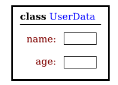
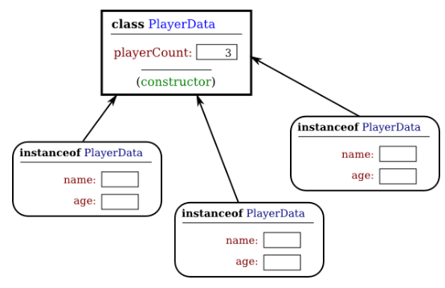
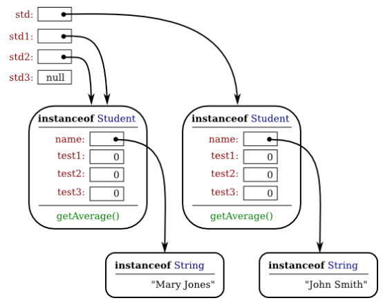

# Section 1: 객체, 인스턴스 메서드, 그리고 인스턴스 변수

객체 지향 프로그래밍(object-oriented programming, OOP)은 사람들이 세상을 생각하고 다루는 방식으로 프로그램을 보다 밀접하게 모형화하려는 시도를 나타낸다. 구식 프로그래밍 스타일에서는, 어떤 문제에 직면한 프로그래머는 문제를 해결하기 위해 수행해야 할 계산 작업을 반드시 식별해야 한다. 따라서 프로그래밍은 해당 작업을 수행할 일련의 명령어들을 찾는 일로 구성된다. 그러나 객체 지향 프로그래밍의 핵심에서는, 작업 대신으로 객체(object)를 발견하게 된다 — 이는 행위를 가지고, 정보를 담고 있으며, 서로 상호작용을 할 수 있는 개체(entity)이다. 프로그래밍은 어떤 식으로든 당면한 문제를 모형화하는 일련의 객체들을 설계하는 것으로 구성된다. 프로그램의 소프트웨어 객체는 문제 영역에서 실제의 또는 추상적인 개체를 나타낼 수 있다. 이는 프로그램의 설계를 보다 자연스럽게 하며, 따라서 프로그램이 정확해지고 이해하기 쉽도록 만든다.

어느 정도까지로 보면, OOP는 단지 관점의 변화일 뿐이다. 우리는 표준 프로그래밍 용어로 객체를 변수들의 집합과 해당 변수들을 조작하기 위한 몇몇 서브루틴에 지나지 않는다고 생각할 수 있다. 사실 어떤 프로그래밍 언어에서도 객체 지향적 기법을 사용할 수 있다. 그러나 OOP를 가능하게 하는 언어와 이를 적극적으로 지원하는 언어 사이에는 큰 차이가 있다. 자바와 같은 객체 지향 프로그래밍 언어에는 표준 언어와 상당히 다른 차이점을 가지게 하는 많은 특징이 포함되어 있다. 이러한 특징을 효과적으로 활용하기 위해서는, 생각을 올바른 쪽으로 "향하도록(orient)" 해야 한다.

앞에서 언급했듯이 객체 지향 프로그래밍의 맥락에서 서브루틴은 종종 메서드(method)라고 언급된다. 이제 객체를 사용하기 시작하였으므로, 필자는 "서브루틴"보다 "메서드"라는 용어를 더 자주 사용할 것이다.

<hr>

## 1. 객체, 클래스, 그리고 인스턴스
객체는 클래스와 밀접한 관련이 있다. 이미 여러 장에서 클래스를 다루어왔고, 하나의 클래스에는 변수와 메서드 (즉, 서브루틴)가 포함될 수 있다는 점을 알게 되었다. 객체가 변수와 메서드의 모음이기도 한 경우, 클래스와는 어떻게 다른가? 그리고 이들을 효과적으로 이해하고 이용하기 위한 다른 종류의 사고가 왜 요구되는가? 클래스보다는 객체로 작업하였던 한 절, 제3장 제9절에서는 큰 차이가 없어 보였다: 그저 "`static`"이라는 단어를 서브루틴 정의에서 뺐을 뿐이다!

필자는 클래스가 객체를 "묘사(describe)"한다거나, 더 정확하게는 클래스의 비정적(non-static) 부분이 객체를 묘사한다고 하였다. 하지만 이것이 무엇을 의미하는지는 아마도 분명하지 않을 것이다. 더 일반적인 용례는 객체가 클래스에 **속한다(belongs to)** 말하는 것이지만, 이조차 그다지 명확하지 않을 수도 있다. (관련된 모든 개념을 적절히 구별하기 위한 영어 단어가 실제로 부족하다. 멤버 변수가 클래스에 "속하는" 것과 같은 방식으로 분명하게 객체가 클래스에 "속하는" 것은 아니다.) 프로그래밍의 관점에서는, 객체를 생성하는 데 클래스가 사용된다고 하는 것이 더 정확하다. 클래스는 객체를 구축하기 위한 일종의 공장 — 또는 청사진(blueprint) — 이다. 클래스의 비정적 부분은 객체가 포함할 변수와 메서드를 명시하거나 묘사한다. 이것이 객체가 클래스와 어떻게 다른지에 대한 설명의 일부이다: 객체는 프로그램이 실행되면서 생성되고 파괴되며, 동일한 클래스를 사용하여 생성된 경우 구조가 동일한 객체가 많을 수 있다.

몇몇 정적 멤버 변수를 그룹화하는 작업을 수행하는 간단한 클래스를 생각해보자. 예를 들어, 다음 클래스를 사용하여 프로그램을 이용하는 사람에 대한 정보를 저장할 수 있다:

```java
class UserData {
    static String name;
    static int age;
}
```

해당 클래스를 사용하는 프로그램에는 `UserData.name` 및 `UserData.age` 변수들 각각의 복사본이 하나만 존재한다. 클래스가 컴퓨터에 로드되면 클래스에 할당된 메모리 영역(section)이 있으며, 해당 메모리 영역에는 변수 `name`과 `age`의 값을 입력할 수 있는 공간이 포함된다. 메모리 속에 있는 클래스는 다음과 같이 보이는 것이라 상상할 수 있다:



중요한 점은 정적 멤버 변수가 메모리에 있는 클래스의 표상(representation) 중 일부라는 것이다. 전체 이름인 `UserData.name`과 `UserData.age`는 클래스의 일부분이므로 클래스 이름을 사용한다. 프로그램 사용자를 나타내기 위해 클래스 UserData 를 사용할 때, 하나의 사용자에 대한 데이터를 저장할 메모리 공간만이 있기 때문에 **한 명**의 사용자만 존재할 수 있다. 해당 클래스 `UserData`와 이에 포함되는 변수들은 프로그램이 실행되는 동안이라면 존재한다는 점에 유의하라. (바로 이것이 "정적(static)"이란 의미의 본질이다.) 이제 비정적 변수를 포함하는 유사한 클래스를 생각해보자:

```java
class PlayerData {
    static int playerCount;
    String name;
    int age;
}
```

필자는 PlayerData 클래스에 정적 변수 또한 포함시켰다. 여기에서 정적 변수 `playerCount`는 메모리에 있는 클래스 표상의 일부로 저장된다. 그 전체 이름은 `PlayerData.playerCount`이고, 이는 오직 하나만 있으며, 프로그램이 실행되는 한 존재한다. 하지만, 클래스 정의의 다른 두 변수는 비정적이다. 비정적 변수는 클래스 자체의 일부분이 되지 않기 때문에, `PlayerData.name`이나 `PlayerData.age`와 같은 변수는 없다. 그러나 PlayerData 클래스는 객체를 만드는 데 사용될 수 있다. 해당 클래스를 이용해 많은 객체가 생성될 수 있으며, 각각은 `name`과 `age`라는 **고유한** 변수를 갖게 될 것이다. 이것이 바로 클래스의 비정적 부분이 객체를 위한 템플릿이 된다는 것의 의미이다: 모든 객체는 클래스의 비정적 부분에 대한 고유의 복사본을 가진다. 여러 개의 객체가 만들어진 후 컴퓨터의 메모리 속의 상황을 다음과 같이 시각화할 수 있다:



정적 변수 `playerCount`는 클래스의 일부분이며, 오직 하나의 복사본만 있다는 점에 유의하라. 반면에 모든 객체는 `name`과 `age`를 가진다. 클래스에서 생성되는 객체를 해당 클래스의 **인스턴스(instance)** 라고 하며, 그림에서 알 수 있듯이 모든 객체는 이를 생성하기 위해 사용된 클래스를 "알고 있다"고 한다. 클래스 PlayerData 는 "생성자(constructor)"라고 불리는 것을 포함하고 있음을 보여주고 있다; 생성자는 객체를 만드는 서브루틴이다.

이제 수많은 "플레이어(player)"가 있을 수 있게 되는데, 필요한 새로운 플레이어를 나타내는 새로운 객체를 만들 수 있기 때문이다. 프로그램은 게임 내 여러 플레이어에 대한 정보를 저장하기 위해 PlayerData 클래스를 사용할 수 있다. 각 플레이어마다 이름과 나이가 있다. 플레이어가 게임에 참여하면 해당 플레이어를 나타내는 새로운 `PlayerData` 객체가 생성될 수 있다. 플레이어가 게임을 종료하면 해당 플레이어를 나타내는 `PlayerData` 객체는 파괴될 수 있다. 게임에서 일어나고 있는 일을 **역동적으로(dynamically)** 모델화하기 위해 프로그램 내의 객체 시스템이 사용되고 있다. 정적 변수로는 이렇게 할 수 없다! "동적(dynamic)"은 "정적(static)"의 반대다.

<hr>

클래스를 사용하여 생성된 객체는 해당 클래스의 **인스턴스(instance)** 라고 한다. 종종 객체는 클래스에 **속한다(belongs to)** 고 언급된다. 객체가 포함하는 변수를 **인스턴스 변수(instance variable)** 라고 한다. 객체가 포함하는 메서드(즉, 서브루틴)를 **인스턴스 메서드(instance method)** 라고 한다. 예를 들어, 위에서 정의한 바와 같이 `PlayerData` 클래스가 객체를 만드는 데 사용되는 경우, 해당 객체는 `PlayerData` 클래스의 인스턴스이며, `name`과 `age`는 객체의 인스턴스 변수이다.

여기서 필자의 예제는 어떤 메서드도 포함하지 않지만, 메서드는 변수와 비슷하게 작동한다. 정적 메서드(static method)는 클래스의 일부분이다; 비정적, 또는 인스턴스 메서드(instance method)는 클래스에서 생성된 객체의 일부가 된다. 각각의 객체가 인스턴스 메서드에 관하여 실제로 컴파일된 코드의 고유 복사본을 포함하고 있다는 것은 말 그대로 사실이 아니다. 그러나 논리적으로 인스턴스 메서드는 객체의 일부분이며, 필자는 해당 객체가 인스턴스 메서드를 "포함한다"고 계속 언급할 것이다.

클래스의 **소스 코드**와 (메모리 내의) **클래스 자체**를 구별해야 한다는 점에 유의하라. 소스 코드는 클래스와 해당 클래스에서 생성된 객체를 모두 결정한다. 소스 코드에서 "정적" 정의는 (컴퓨터 메모리 안의) 클래스 자체의 일부인 것을 명시하는 반면, 소스 코드의 비정적 정의는 해당 클래스에서 생성되는 모든 인스턴스 객체의 일부가 될 것을 명시한다. 그런데, 클래스 안의 정적 멤버 변수와 정적 멤버 서브루틴은 해당 클래스의 인스턴스보다는 클래스 자체에 속하기 때문에 **클래스 변수(class variable)** 와 **클래스 메서드(class method)** 라고 언급되기도 한다.

보다시피, 클래스의 정적인 부분과 비정적인 부분은 매우 다른 것이고, 매우 다른 목적에 유용하다. 많은 클래스는 오로지 정적 멤버만 포함하거나, 비정적 멤버만 포함하며, 이 둘이 혼합된 클래스의 예는 손가락에 꼽을 정도임을 알게 될 것이다.

<hr>

## 2. 객체의 기초
지금까지 필자는 대부분 일반론으로 언급해왔고, 객체를 다루길 바란다면 프로그램에 무엇을 넣어야 하는지에 관한 별다른 아이디어를 제시하진 않았다. 어떻게 작동하는지 구체적인 예를 살펴보자. 수강하는 학생에 대한 정보를 저장하는 데 사용할 수 있는 `Student` 클래스의 매우 단순화된 버전을 생각해보자.

```java
public class Student {

public String name;  // 학생의 이름.
public double test1, test2, test3;   // 세 가지 시험에 대한 성적.

public double getAverage() {  // 시험 성적 평균을 계산
return (test1 + test2 + test3) / 3;
}

}  // 클래스 Student 종료
```

이 클래스의 멤버 중 어느 것도 `static`으로 선언되지 않았기에, 클래스는 객체를 만드는 목적으로만 존재한다. Student 클래스의 인스턴스인 모든 객체는 `name`, `test1`, `test2` 및 `test3`라는 인스턴스 변수를 포함하며, `getAverage()`라는 인스턴스 메서드를 포함할 것이라고 이 클래스 정의는 말한다. 서로 다른 객체의 이름(name)과 시험 성적(test grade)은 일반적으로 다른 값들을 갖는다. 특정한 학생을 위하여 `getAverage()` 메서드가 호출되면 해당 메서드는 **바로 그 학생**의 시험 성적을 사용하여 평균을 계산한다. 학생마다 평균은 다를 수 있다. (반복하지만, 인스턴스 메서드가 클래스가 아닌 개별 객체에 속한다는 것이 바로 이런 의미이다.)

자바에서, 클래스는 int 및 boolean과 같은 내장 자료형과 유사한 **자료형(type)** 이다. 따라서 클래스 이름을 사용하여 선언문에 있는 변수의 자료형, 형식적 매개변수의 자료형 또는 함수의 반환 자료형을 지정할 수 있다. 예를 들어, 프로그램은 다음 문장으로 `Student` 자료형인 `std`라는 변수를 정의할 수 있다:

```java
Student std;
```

그러나 변수를 선언한다고 객체가 생성되는 것은 **아니다!** 이는 중요한 점으로, 다음의 매우 중요한 사실(Very Important Fact)과도 관련이 있다:

```html
자바에서, 어떠한 변수도 객체를 가질 수는 없다. 
변수는 오로지 객체에 대한 참조만을 보유할 수 있다. 
(In Java, no variable can ever hold an object. 
A variable can only hold a reference to an object.)
```

컴퓨터의 메모리 속에서 객체는 독립적으로 떠다니는 것으로 생각해야 한다. 사실, 객체가 사는 곳인 **힙(heap)** 이라고 불리는 메모리의 특별한 부분이 있다. 변수는 객체 자체를 보유하는 대신, 메모리에서 객체를 찾는 데 필요한 정보를 보유한다. 이러한 정보를 객체에 대한 **참조(reference)** 또는 **포인터(pointer)** 라고 한다. 실제로 객체에 대한 참조는 해당 객체가 저장되어 있는 메모리 위치의 주소다. 객체 자료형의 변수를 사용하면, 컴퓨터는 실제 객체를 찾기 위해 변수에 있는 참조를 사용한다.

프로그램에서 객체는 `new`라는 연산자를 사용하여 생성되는데, 이 연산자는 객체를 생성하고 해당 객체에 대한 참조를 반환한다. (사실, `new` 연산자는 클래스에서 "생성자(constructor)"라고 불리는 특별한 서브루틴을 호출한다.) 예를 들어, `std`가 위에서 선언된 것과 같이 `Student` 자료형의 변수라고 가정하면, 다음 할당문

```java
std = new Student();
```

은 클래스 `Student`의 인스턴스인 새로운 객체를 만들고, 해당 객체에 대한 참조를 변수 `std`에 저장한다. 변수의 값은 객체에 대한 참조, 또는 포인터이다. 해당 객체 자체는 힙 안의 어딘가에 있다. 그렇다면, 해당 객체가 "변수 `std`의 값"이라고 하는 말은 그다지 사실이 아니다(비록 종종 이러한 용어법(terminology)를 사용하는 일을 피하기 어려움에도 말이다). 해당 객체가 "변수 `std`에 저장되어 있다"고 말하는 것은 확실히 **전혀 사실이 아니다.** 적절한 용어법은 "변수 `std`가 객체를 **참조하거나 가리킨다(refers to or points to)**"는 것이며, 필자는 가능한 한 이러한 용어법을 고수하도록 노력할 것이다. 필자가 "std는 객체이다(std is an object)"와 같은 말을 하더라도, "std는 객체를 가리키는 변수이다"라는 뜻으로 읽어야 한다.

자, `std` 변수가 `Student` 클래스의 인스턴스인 객체를 가리킨다고 가정하자. 해당 객체에는 인스턴스 변수 `name`, `test1`, `test2` 및 `test3`이 포함되어 있다. 이러한 인스턴스 변수는 `std.name`, `std.test1`, `std.test2` 및 `std.test3`으로 참조할 수 있다. 이는 `B`가 `A`의 일부일 때, `B`의 전체 이름은 `A.B`라는 일반적인 명명 규칙을 따른다. 예를 들어, 프로그램은 다음 행을 포함할 수도 있다:

```java
System.out.println("안녕, "  +  std.name  +  ".  당신의 시험 성적은:");
System.out.println(std.test1);
System.out.println(std.test2);
System.out.println(std.test3);
```

이는 `std`가 참조하는 객체로부터 이름과 시험 성적을 출력할 것이다. 마찬가지로 `std`는 `std.getAverage()`라고 하여 객체의 `getAverage()` 인스턴스 호출에 사용할 수 있다. 학생의 평균을 출력하기 위해 다음과 같이 할 수 있다는 말이다:

```java
System.out.println( "평균은 "  +  std.getAverage() );
```

보다 일반적으로는, String 자료형 변수가 허용되는 모든 장소에서 `std.name`을 사용할 수 있다. 표현식 안에서 이를 쓸 수도 있다. 이에 값을 할당할 수도 있다. 심지어 String 클래스에서 서브루틴을 호출할 때에도 이를 사용할 수 있다. 예를 들어, `std.name.length()`는 학생 이름의 문자들 갯수다.

클래스에 의해 자료형이 부여되는 `std`와 같은 변수는 아예 객체를 참조하지 않을 수도 있다. 이러한 경우에 `std`가 **널 포인터(null2 pointer)** 또는 **널 참조(null reference)** 를 보유한다고 말한다. 널 포인터는 자바에서 "`null`"로 작성된다. 다음과 같이 하여 변수 `std`에 널 참조를 저장할 수 있다:

```java
std = null;
```

`null`은 변수에 저장된 실제의 값이며, 다른 무언가에 대한 포인터가 아니다. 해당 변수가 "널을 가리킨다(points to null)"라고 말하는 것은 적절하지 **않다**; 실제로, 변수는 널이다(is null). 예를 들어 `std` 값이 널인지 여부를 다음과 같이 검사할 수 있다:

```java
if (std == null) . . .
```

변수의 값이 `null`이라면, 물론, 해당 변수를 통해 인스턴스 변수나 인스턴스 메서드를 참조하는 것은 허용되지 않는다 — 객체는 존재하지 **않고**, 따라서 참조할 인스턴스 변수가 없기 때문이다! 예를 들어, 변수 `std` 값이 `null`이면 `std.test1`을 참조하는 것은 허용되지 않는다. 프로그램이 이러한 방식으로 널 포인터를 무단으로 사용하려고 하면 **널 포인터 예외(null pointer exception)** 라는 오류가 발생한다. 프로그램이 실행되는 동안 이 문제가 발생할 경우 NullPointerException 자료형의 예외가 던져진다.

객체와 함께 작동하는 일련의 문장들을 살펴보자:

```java
Student std, std1,       // Student 자료형인 네 개의
std2, std3;    //   변수를 선언.

std = new Student();     // 클래스 Student에 속하는 새로운
//   객체를 생성하고, 변수 std에
//   해당 객체에 대한 참조를 저장함.

std1 = new Student();    // 두 번째 Student 객체를 생성하고
//   이에 대한 참조를 변수 std1에
//   저장함.

std2 = std1;             // std1의 참조 값을
//   변수 std2에 복사함.

std3 = null;             // 변수 std3에 널 참조를 저장함.

std.name = "John Smith";  // 몇몇 인스턴수 변수들의 값을 설정.
std1.name = "Mary Jones";

     // (다른 인스턴스 변수들은
     //    기본 초기 값인 0을 가짐.)
```

컴퓨터가 이러한 문장들을 실행한 후, 컴퓨터 메모리 안의 상황은 다음과 같이 보일 것이다:



이 그림에서, 변수가 객체에 대한 참조를 포함할 때, 해당 변수의 값은 객체를 가리키는 화살표로 표시된다. 그런데, String 은 객체란 점에 주의하라! 값이 `null`인 변수 `std3`은 어떠한 곳도 가리키지 않는다. `std1`과 `std2`의 화살표는 모두 같은 객체를 가리킨다. 이는 매우 중요한 점을 보여준다:

```html
하나의 객체 변수가 다른 것에 할당될 때, 오로지 참조만이 복사된다. 
참조된 객체가 복사되는 것이 아니다.
(When one object variable is assigned to another, 
only a reference is copied. 
The object referred to is not copied.)
```

할당문 "`std2 = std1;`"이 실행되었을 때 새로운 객체가 생성되지는 않았다. 그 대신, `std2`는 `std1`이 가리키는 바로 그 객체를 가리키도록 설정되었다. 이는 할당문이 `std1`에 저장된 값을 `std2`에 복사하기만 하면 되고, 해당 값은 객체가 아닌 포인터이기 때문에 예상되었을 것이다. 그러나 이는 놀랄만한 결과를 가져온다. 예를 들어, `std1.name`과 `std2.name`은 동일한 변수에 대한 서로 다른 두 가지 이름, 즉 `std1`과 `std2` 모두가 참조하는 객체의 인스턴스 변수다. "`Mary Jones`"라는 문자열이 변수 `std1.name`에 할당된 후에는, `std2.name`의 값 또한 "`Mary Jones`"인 것도 사실이다. 여기에서 많은 혼란이 일어날 가능성이 있지만, 계속하여 스스로에게 "객체는 변수 안에 있지 않다. 변수는 당지 해당 객체에 대한 포인터를 쥐고 있을 뿐이다."라고 말하여 이로부터 자신을 보호할 수 있을 것이다.

연산자 `==`와 `!=`를 사용하여 객체의 동일성(equality)과 비동일성에 관한 테스트할 수 있지만, 여기서도 반복되듯 의미론(semantics)은 익숙함과는 다르다. "`if (std1 == std2)`"을 테스트한다는 것은 `std1`과 `std2`에 저장된 값들이 동일한지를 검사하는 것이다. 그러나 비교하려는 값들은 객체에 대한 참조이다; 객체가 아니다. 따라서 `std1`과 `std2`가 동일한 객체, 즉 메모리에서 동일한 위치를 가리키는지 여부를 검사하는 일이 된다. 이것이 그렇게 하길 바란 일이라면 괜찮을 터이다. 그러나 때때로, 객체의 인스턴스 변수들이 동일한 값을 가지는지 여부를 확인하길 바라는 경우도 있을 것이다. 그러기 위해서는 "`std1.test1 == std2.test1 && std1.test2 == std2.test2 && std1.test3 == std2.test3 && std1.name.equals(std2.name)`"를 물어봐야 한다.

필자는 이전에 String 이 객체라고 언급한 적이 있으며, 위의 그림에서 "`Mary Jones`"와 "`John Smith`"라는 문자열을 객체로써 표시하였다. (문자열은 특수한 객체로, 자바에 의해 특별한 방식으로 취급되며, 필자는 String 객체의 실제 내부 구조를 보여주려 하지는 않았다.) 문자열은 객체이므로 String 자료형 변수는 문자열 자체가 아니라, 문자열에 대한 참조를 보유할 뿐이다. 이는 `==` 연산자를 사용하여 문자열의 동일성을 테스트하는 것이 왜 좋은 생각이 아닌지를 드러낸다. `greeting`이 String 자료형 변수이며 "`Hello`" 문자열을 가리킨다고 가정해보자. 그러면 `greeting == "Hello"` 테스트는 참이 될까? 글쎄, 그럴 수도, 어쩌면 아닐 수도 있다. 변수 `greeting`과 String 리터럴 "`Hello`"는 각각 H-e-l-l-o 문자를 포함하는 문자열을 가리킨다. 그러나 문자열은 그저 우연히 동일한 문자들을 포함하고 있는 다른 객체일 가능성이 여전히 존재한다; 이런 경우에는 `greeting == "Hello"`은 거짓이 될 것이다. 함수 `greeting.equals("Hello")`는 `greeting`과 "`Hello`"가 같은 문자들을 포함하고 있는지를 테스트하는데, 이것이 거의 틀림이 없이 의도된 질문일 것이다. 표현식 `greeting == "Hello"`는 `greeting`과 "`Hello`"가 **동일한 메모리 위치에 저장된** 동일한 문자들을 포함하고 있는지 테스트한다. (물론, `greeting`과 같은 String 변수 또한 특수 값 `null`을 포함할 수 있으며, 이 때에는 "`greeting == null`" 여부를 테스트하기 위해 `==` 연산자를 사용하는 것이 **타당할** 것이다.)

<hr>

변수가 객체 자체가 아니라 객체에 대한 참조를 가지고 있다는 사실은, 당신이 알아야 하는 몇 가지 다른 결과들로 이어지게 된다. 객체가 변수에 저장되지 않는다는 기본적인 사실만 염두에 둔다면, 논리적으로 이들을 따르게 된다. 객체는 어딘가 다른 곳에 있다; 변수는 이를 가리킨다.

객체를 가리키는 변수가 `final`로 선언된다 가정해보자. 이는 변수가 초기화된 후에는 해당 변수에 저장된 값을 절대로 변경할 수 없다는 것을 의미한다. 변수에 저장된 값은 객체에 대한 참조이다. 따라서 변수는 해당 변수가 존재하는 한 계속해서 동일한 객체를 가리킬 것이다. 하지만, 이는 **객체 안의** 데이터가 바뀌는 것을 막지는 못한다. `final`인 것은 변수이지, 객체가 아니다. 다음과 같이 하는 것은 완벽하게 허용된다:

```java
final Student stu = new Student();

stu.name = "John Doe";  // 객체 안의 데이터를 변경;
                        // stu에 저장된 값은 변경되지 않는다!
                        // 이는 여전히 동일한 객체를 참조하고 있다.
```

다음으로, `obj`가 객체를 가리키는 변수라고 가정한다. `obj`가 실질적 매개변수로써 서브루틴에 전달될 때 어떤 일이 일어나는지 생각해보자. `obj` 값은 서브루틴의 형식적 매개변수에 할당되고 해당 서브루틴이 실행된다. 서브루틴은 변수 `obj`에 저장된 값을 변경할 힘은 없다. 이는 해당 값의 복사본만을 가질 뿐이다. 그러나 이 값은 객체에 대한 참조이다. 서브루틴이 객체에 대한 참조를 가지기에, 이는 객체 **안에** 저장된 데이터를 변경할 수 있다. 서브루틴이 끝난 뒤에도 obj는 여전히 같은 객체를 가리키지만, **객체 안에** 저장된 데이터는 변경되었을 것이다. `x`가 int 자료형 변수이고 `stu`가 `Student` 자료형 변수라고 가정하자. 비교해보라:

```java
void dontChange(int z) {                void change(Student s) {
z = 42;                                  s.name = "Fred";
}                                       }

다음 행:                                다음 행:

x = 17;                                 stu.name = "Jane";
dontChange(x);                          change(stu);
System.out.println(x);                  System.out.println(stu.name);

은 값 17을 출력한다.                     은 값 "Fred"를 출력한다.

x의 값은 서브루틴에 의해                  stu의 값은 변경되지 않지만,
변경되지 않으며, 이는                     stu.name은 변경된다.
다음과 동일하다                          이는 다음과 동일하다

z = x;                                  s = stu;
z = 42;                                 s.name = "Fred";
```

<hr>

## 3. 게터 및 세터
새로운 클래스를 작성할 때, 접근 제어 문제에 주의를 기울이는 것이 좋다. 클래스 멤버를 `public`으로 한다는 것은 다른 클래스를 포함하여 어디서든지 이에 접근할 수 있다는 사실을 떠올려라. 반면에 `private` 멤버는 그것이 정의된 클래스 안에서만 사용될 수 있다.

많은 프로그래머들의 견해는 거의 모든 멤버 변수가 `private`로 선언되어야 한다는 것이다. 이렇게 하면 변수를 사용하여 수행할 수 있는 작업을 완벽하게 제어할 수 있다. 변수 자체는 비공개(private)라 하더라도 변수의 값을 반환하는 `public` **접근자 메서드**(accessor method)를 제공하여 다른 클래스가 그것의 값이 무엇인지를 알 수 있도록 할 수 있다. 예를 들어 클래스 안에 String 자료형인 `private` 멤버 변수 `title`이 포함된 경우, 다음과 같은

```java
public String getTitle() {
    return title;
}
```

`title`의 값을 반환하는 메서드를 제공할 수 있다. 관례적으로, 변수에 대한 접근자 메서드의 명칭은 변수 이름을 대문자로 시작하고 해당 이름 앞에 "get"을 덧붙여 얻는다. 따라서 변수 `title`에 대해서는 "get" + "Title", 혹은 `getTitle()`이라는 접근자 메서드를 얻게 된다. 이러한 명명 관례 때문에 접근자 메서드는 **게터 메서드(getter method)** 라고 더 자주 언급된다. 게터 메서드는 변수에 대한 "읽기 접근(read access)"를 제공하는 것이다. (때떄로 boolean 변수의 경우, "get" 대신 "is"가 사용되기도 한다. 예를 들어 `done`이라는 boolean 멤버 변수의 게터는 `isDone()`이라고 할 수 있다.

`private` 변수에 대한 "쓰기 접근(write access)" 또한 허용하고 싶은 경우가 있다. 즉, 다른 클래스가 해당 변수에 새 값을 지정할 수 있도록 하길 바랄 수 있다. 이는 **세터 메서드(setter method)** 로 이루어진다. (단순한 고대 영단어를 좋아하지 않는다면, 더 고등한 용어인 **뮤테이터 메서드(mutator method)** 를 사용할 수 있다.) 세터 메서드의 이름은 "set"에 뒤따르는, 대문자로 시작하는 변수 이름 사본으로 구성되어야 하며, 해당 변수와 같은 자료형의 매개변수를 가져야 한다. 변수 `title`에 대한 세터 메서드는 다음과 같이 쓸 수 있다:

```java
public void setTitle( String newTitle ) {
    title = newTitle;
}
```

비공개 멤버 변수에 게터 메서드와 세터 메서드를 모두 제공하는 것은 실제로 매우 흔한 일이다. 이렇게 하면 다른 클래스에서도 해당 변수의 값을 보고 바꿀 수 있기 때문에, 그냥 변수를 `public`으로 하지 않는지 그 까닭이 궁금할 것이다. 이는 게터와 세터가 단순히 변수의 값을 읽고 쓰는 것에 국한되지 않기 때문이다. 사실, 이들은 어떠한 행동도 전적으로 취할 수 있다. 예를 들어, 게터 메서드는 해당 변수가 접근된 횟수를 추적할 수도 있다:

```java
public String getTitle() {
    titleAccessCount++;  // 멤버 변수 titleAccessCount를 증가시킴.
    return title;
}
```

그리고 세터 메서드는 해당 변수에 할당되려는 값이 허용되는지를 검사할 수 있다:

```java
public void setTitle( String newTitle ) {
    if ( newTitle == null )   // 널 문자열을 제목으로 허용해선 안 된다!
        title = "(Untitled)";  // 적절한 기본 값을 대신 사용.
    else
        title = newTitle;
}
```

게터나 세터 메서드로 해야 할 여분의 잡일을 생각할 수 없더라도, 앞으로 클래스를 재설계하고 개선할 때 생각이 달라질 수 있다. 처음부터 게터, 세터를 사용했다면 당신의 클래스를 사용하는 해당 클래스에 영향을 주지 않고 당신의 클래스를 수정할 수 있다. `private` 멤버 변수는 클래스의 공개된 인터페이스에 속하지 않는다; `public` 게터 및 세터 메서드만이 이에 해당되며, 클래스의 공개된 인터페이스를 변경하지 않고도 자유롭게 이들의 구현을 변경할 수 있다. 처음부터 get과 set를 **사용하지 않았다면**, 당신의 클래스를 사용하는 모든 사람에게 연락하여 "미안해요 여러분, 이 변수가 사용되었던 모든 부분을 추적해서 나의 새로운 get과 set 메서드를 대신 사용하도록 코드를 변경해야 할 겁니다."라고 알려야 할 것이다.

두 가지 최종적인 참고 사항: 자바의 일부 선진적인 측면은 게터 및 세터 메서드의 명명 관례에 의존하므로, 해당 관례를 엄격하게 따르는 것이 좋다. 그리고 변수에 게터, 세터 메서드를 사용하는 것에 대해 이야기했지만, 변수가 존재하지 않더라도 get과 set 메서드를 정의할 수 있다. 게터 및/또는 세터 메서드는 클래스의 **속성(property)** 을 정의하는데, 이는 변수와 대응되거나 그러지 않을 수도 있다. 예를 들어, 어떤 클래스에 `setValue(double)` 시그니처(signature)를 지닌 `public void` 인스턴스 메서드가 포함되어 있다면, 해당 클래스는 double 자료형인 `value`라는 "속성"을 가지며 value란 멤버 변수가 해당 클래스에 있는지 여부와 관계없이 이러한 속성을 가진다.

<hr>

## 4. 배열 및 객체
제3장 제8절 제1관에서 필자가 언급한 바와 같이, 배열(array)은 객체다. String 과 마찬가지로 이들은 고유의 독특한 구문을 가진 특별한 객체다. `int[]` 또는 `String[]`과 같은 배열 자료형은 실제로는 클래스이며, 배열은 `new` 연산자의 특수한 버전을 사용하여 생성된다. 다른 객체 변수의 경우와 마찬가지로, 배열 변수는 결코 실제 배열을 보유할 수 없다 — 배열 객체에 대한 참조를 가질 뿐이다. 배열 객체 자체는 힙(heap)에 존재한다. 배열 변수가 `null` 값을 보유할 수는 있는데, 이는 실제 배열이 없음을 의미한다.

예를 들어, `list`가 `int[]` 자료형의 변수라고 가정하자. `list` 값이 `null`인 경우 `list.length` 또는 배열 요소 `list[i]`로 접근을 시도하면 오류가 발생하며 NullPointerException 자료형인 예외를 유발할 것이다. `newlist`가 `int[]` 자료형의 또 다른 변수인 경우, 다음 할당문

```java
newlist = list;
```

은 `list`의 참조 값만을 `newlist`로 복사한다. `list`가 `null`이면 `newlist` 또한 `null`이라는 결과가 된다. `list`가 배열을 가리킬 경우, 할당문은 배열의 복사본을 만들지 **않는다**. 단지 `list`와 동일한 배열을 참조하도록 `newlist`을 설정할 뿐이다. 예를 들어, 다음의 코드 조각

```java
list = new int[3];
list[1] = 17;
newlist = list; // newlist는 list와 동일한 배열을 가리킨다!
newlist[1] = 42;
System.out.println( list[1] );
```

은 17이 아닌 42를 출력하는데, `list[1]`과 `newlist[1]`은 배열의 동일한 요소에 대한 서로 다른 이름일 뿐이기 때문이다. 배열이 객체이고 배열 변수가 배열에 대한 포인터를 가진다는 점을 이해하면 이 모든 것이 매우 자연스러울 것이다.

이러한 사실은 배열이 서브루틴에 매개변수로써 전달될 때에도 작용한다. 서브루틴에 복사되는 값은 해당 배열의 포인터다. 배열이 복사되는 것이 아니다. 서브루틴은 원본 배열에 대한 참조를 가지고 있기 때문에, 이것이 배열의 요소에 끼치는 모든 변경사항은 원본에 적용되고 서브루틴이 반환된 후에도 지속될 것이다.

<hr>

배열은 객체다. 이들은 또한 객체를 보유할 수 있다. 배열의 기본 자료형은 클래스도 가능하다. `String[]` 자료형의 배열을 사용할 때 이미 이 점을 보았지만, 어떤 클래스든 기본 자료형으로 사용할 수 있다. 예를 들어 Student 가 이 관에서 앞서 정의된 클래스라고 가정하자. 그러면 `Student[]` 자료형의 배열을 가질 수 있다. `Student[]` 자료형의 배열에 있어서, 배열의 각 요소는 Student 자료형의 변수다. 30명의 학생들에 대한 정보를 저장하려면 다음의 배열을 사용할 수 있을 것이다:

```java
Student[] classlist;  // 자료형 Student[]의 변수를 선언.
classlist = new Student[30];  // 이제 변수는 배열을 가리킴.
```

해당 배열에는 30개의 요소, `classlist[0]`, `classlist[1]`, `...`, `classlist[29]`가 있다. 배열이 생성되면 기본 초기 값으로 채워지며, 객체 자료형에 관한 해당 값은 `null`이다. 따라서, 비록 Student 자료형인 배열 요소 30개가 있지만, 실제의 Student 객체를 아직 가지고 있지는 않다! 존재하는 것은 전부 30개의 널이다. 학생 객체를 원한다면 이를 생성해야 한다:

```java
Student[] classlist;
classlist = new Student[30];
for ( int i = 0; i < 30; i++ ) {
    classlist[i] = new Student();
}
```

이를 마치면 각각의 `classlist[i]`는 Student 자료형인 객체를 가리키게 된다. 3번 학생의 이름에 대해 말하고 싶다면, `classlist[3].name`을 사용할 수 있다. `classlist[i].getAverage()`를 호출하여 학생 번호인 `i`의 평균을 계산할 수도 있을 것이다. 다른 어떤 Student 자료형 변수로 할 수 있는 것은 무엇이든 `classlist[i]`로도 할 수 있다는 말이다.

