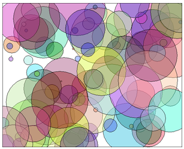

# Section 3: 객체와 프로그래밍

프로그램을 설계하고 작성하는 과정에서 객체 지향 개념을 적용할 수 있는 몇 가지 방법 이 있다. 이 중 가장 광범위한 것은 **객체 지향 분석 및 설계(object-oriented analysis and design)** 로, 프로그램의 전체적인 설계가 생성되는 프로그램 개발의 초기 단계에 객체 지향 방법론을 적용한다. 여기에서 아이디어는 객체로 모델화 할 수 있는 문제 영역 안의 사물을 식별하는 것이다. 또 다른 차원에서 객체 지향 프로그래밍은, 프로그래머가 다양한 프로그래밍 프로젝트에서 사용할 수 있는 **일반화된 소프트웨어 구성요소(generalized software components)** 를 생산하도록 장려한다.

물론 대부분의 경우 자바와 함께 제공되는 표준 클래스를 사용하여 "일반화된 소프트웨어 구성요소"를 경험할 것이다. 이 절에서는 객체를 만드는 데 사용되는 몇 가지 내장(built-in) 클래스를 살펴봄으로써 시작하고자 한다. 이 절이 끝나면 일반론으로 돌아갈 것이다.

<hr>

## 1. 몇몇 내장 클래스
객체 지향 프로그래밍의 초점은 일반적으로 새로운 클래스의 설계와 구현에 있지만, 자바의 설계자들이 이미 많은 수의 재사용 가능한 클래스를 제공해왔다는 점을 잊지 않는 것이 중요하다. 이러한 클래스 중 일부는 새 클래스를 만들기 위해 확장이 기대되는 반면, 다른 클래스는 유용한 객체를 만들기 위해 직접 사용될 수 있다. 자바에 대한 진정한 숙달(mastery)을 위해서는 개발에 있어 수많은 시간과 경험을 필요로 하는 엄청난 수의 내장 클래스에 관한 익숙함(familiarity)이 요구된다. 유용하다고 생각되는 몇몇 내장 클래스를 잠시 살펴보고자 한다.

문자열은 더 작은 조각들에 `+` 연산자를 사용하여 형성될 수 있지만, 이것이 항상 효율적인 것은 아니다. `str`이 String 이고 `ch`가 문자인 경우 "`str = str + ch;`" 명령을 실행하면, `str`의 복사본 및 그 끝에 ch 값이 덧붙여진 완전히 새로운 문자열이 생성된다. 문자열을 복사하는 일은 시간이 좀 걸린다. 긴 문자열을 한 글자, 한 글자씩 형성하는 데에는 놀라울 정도의 처리가 요구될 것이다. StringBuilder 클래스를 사용하면 다수의 작은 조각으로 긴 문자열을 효율적으로 만들 수 있다. 이렇게 하려면 StringBuilder 클래스에 속하는 객체를 반드시 생성해야 한다. 예를 들면:

```java
StringBuilder builder = new StringBuilder();
```

(이 문장은 변수 `builder`를 선언하고 새로이 생성된 StringBuilder 객체를 참조하도록 이를 초기화한다. 선언과 초기화를 결합하는 일은 제4장 제8절 제1관에서 다루었으며 원시 자료형에서와 마찬가지로 객체에도 적용된다.)

String 과 마찬가지로 StringBuilder 또한 일련의 문자들을 포함한다. 하지만, 이미 포함된 데이터의 복사본을 계속하여 만들 필요 없이 `StringBuilder`의 끝에 새로운 문자를 추가하는 일도 가능하다. `x`가 임의의 자료형 값이고 `builder`가 위에서 정의된 변수라면, `builder.append(x)` 명령은 이미 `builder` 안에 있었던 데이터의 끝에 `x`를, 문자열 표상(representation)으로 변환한 다음에 추가할 것이다. 이는 무언가가 추가될 때마다 데이터를 복사하는 것보다 더 효율적으로 이루어질 수 있다. StringBuilder 에서 일련의 `append()` 명령들을 사용하여 긴 문자열을 형성할 수 있다. 문자열이 완성되면 함수 `builder.toString()`은 String 자료형인 일반 값으로써 `builder`에 있는 문자열의 복사본을 반환할 것이다. StringBuilder 클래스는 표준 패키지 `java.lang` 안에 있으므로, 가져오기(import) 없이도 그 간결한 이름을 사용할 수 있다.

다수의 유용한 클래스가 `java.util` 패키지에 모여 있다. 예를 들면 해당 패키지에는 객체들의 모음(collection)과 함께 할 클래스가 포함되어 있다. 제10절에서 그러한 컬렉션 클래스(collection class)를 폭넓게 공부할 것이다. 또한 이미 제2장 제4절 제6관에서 `java.util.Scanner`와 대면한 적이 있다. 이 패키지의 또 다른 클래스인 `java.util.Date`는 시간을 나타내는 데 사용된다. `Date` 객체가 매개변수 없이 생성된 경우 그 결과는 현재의 날짜 및 시간을 나타내므로, 이러한 정보를 쉽게 표시할 수 있는 방법은 다음과 같다:

```java
System.out.println( new Date() );
```

물론 이는 `java.util` 패키지 안에 있으므로, 프로그램에서 `Date` 클래스를 사용하려면 프로그램 시작 부분에 "`import java.util.Date;`" 또는 "`import java.util.*;`"라는 문장으로 이를 가져와 사용 가능하도록 만들어야 한다. (패키지 및 `import`에 대한 설명은 제4장 제6절 제3관 참조.)

필자는 또한 `java.util.Random` 클래스도 언급하고자 한다. 이 클래스에 속하는 객체는 무작위 번호(혹은 더 정확하게는 유사 무작위 번호)의 소스(source)이다. 표준 함수 `Math.random()`은 무작위 번호를 생성하기 위해 물밑에서 이러한 객체 중 하나를 사용한다. `Random` 자료형 객체는 무작위 실수뿐만 아니라 무작위 정수 또한 생성할 수 있다. 다음 명령을 사용하여 `randGen`이 생성된다면:

```java
Random randGen = new Random();
```

그리고 `N`이 양의 정수라면, `randGen.nextInt(N)`는 0부터 N-1까지의 범위에서 무작위 정수를 생성한다. 예를 들어, 이렇게 하면 주사위 한 쌍을 굴리는 것이 좀 더 쉬워진다. "`die1 = (int)(6*Math.random())+1;`"이라고 하는 대신에, "`die1 = randGen.nextInt(6)+1;`"라고 할 수 있다. (클래스 `java.util.Random`을 가져와야 하고 `Random` 객체를 생성해야 하기에, 실제로 더 쉽다는 말에 동의하지 않을 수도 있겠지만 말이다.) `Random` 자료형 객체는 또한 이른바 가우스 분포 무작위 실수(Gaussian distributed random real numbers)를 생성하는 데 사용될 수 있다.

자바의 많은 표준 클래스는 GUI 프로그래밍에서 사용된다. 제6장에서 그 중 대부분과 조우할 것이다. 여기서는 다음 예제에서 사용할 수 있도록 `javafx.scene.paint` 패키지의 클래스 Color 만을 언급하고자 한다. Color 객체는 그리기에 사용할 수 있는 색상을 나타낸다. 제3장 제9절에서 `Color.RED`와 같은 색상 상수를 대면한 적이 있다. 이러한 상수는 Color 클래스의 최종적 정적(final static) 멤버 변수이며 해당 값은 Color 자료형의 객체다. 또한 새로운 색상 객체를 만들 수도 있다. 클래스 Color 는 여러 생성자를 가진다. 그 중 하나인 `new Color(r,g,b)`라고 불리는 것은 색상의 빨간색, 녹색, 파란색 요소를 명시하기 위해 세 가지 double 매개변수를 취한다. 매개변수는 0.0부터 1.0 까지의 범위에 반드시 있어야 한다. 예를 들어 r 의 값이 0.0이면 색상이 빨간색을 포함하지 않음을 의미하는 반면, 1.0이면 색상이 가능한 최대량의 빨간색을 포함함을 의미합니다. 또 다른 생성자인 `new Color(r,g,b,t)`는 0.0에서 1.0 사이의 범위에 반드시 있어야 하는 네 번째 double 매개변수를 추가한다. 네 번째 매개변수는 색상이 얼마나 투명하거나 불투명한지 결정한다. 부분적으로 투명한 색으로 그림을 그릴 때 배경은 어느 정도까지는 해당 색을 통과해 표시된다. 매개변수 t의 값이 클수록 투명도가 낮고 불투명도가 높은 색상이 부여된다.

Color 객체에는 사용할 수 있는 몇 안되는 인스턴스 메서드만을 가진다. 주로 개별적인 색상 요소를 가져오는 `getRed()`와 같은 함수가 존재한다. 색상 요소를 변경하는 "세터(setter)" 메서드는 없다. 사실 Color 는 불변(immutable) 객체로, 이것의 모든 인스턴스 변수는 `final`이며 객체가 생성된 후에는 변경될 수 없음을 의미한다. String 은 불변 객체의 또 다른 예이며, 이 절의 뒷부분에서 자신만의 것을 만들어 볼 것이다.

이 모든 것의 요점은, 반복하거니와, 이미 많은 문제들이 해결되어왔고, 그 해결책이 자바의 표준 클래스에 구비되어 있다는 것이다. 상당히 흔해 보이는 작업에 맞닥뜨린다면, 자바 레퍼런스 검토를 통해 다른 누군가가 이미 사용할 수 있는 클래스를 작성했는지를 살필 가치가 있다.

<hr>

## 2. "Object" 클래스
객체 지향 프로그래밍의 주요 특징 중 하나는 클래스의 하위 클래스(subclass)를 생성하는 능력이라는 것을 이미 살펴 보았다. 하위 클래스는 클래스의 모든 속성(property) 또는 행위(behavior)을 상속하지만, 상속되는 항목을 수정하고 추가할 수 있다. 제5장 제5절에서 하위 클래스를 만드는 방법을 배울 것이다. 아직 당신이 모르는 사실은 자바의 모든 클래스(단 한 가지 예외를 제외하면)는 몇몇 다른 클래스의 하위 클래스라는 것이다. 클래스를 만들면서 명시적으로 이를 다른 클래스의 하위 클래스로 하지 않으면, 해당 클래스는 자동으로 Object 라는, `java.lang` 패키지에 있는 특수 클래스의 하위 클래스가 된다. (Object 는 다른 클래스의 하위 클래스가 아닌 하나의 클래스임).

클래스 Object 는 다른 모든 클래스에서 상속되는 여러 인스턴스 메서드를 정의한다. 이 메서드는 어떠한 객체와도 함께 사용될 수 있다. 여기서는 그 중 하나만을 언급하고자 한다. 교재의 후반부에서 이들을 더 많이 만나게 될 것이다.

클래스 Object 안에 있는 인스턴스 메서드 `toString()`은 객체의 문자열 표상(representation)으로 간주되는 String 자료형의 값을 반환한다. 객체를 인쇄하거나 객체를 문자열에 연결할 때마다 이미 이 메서드를 묵시적으로 사용했을 터이다. 문자열이 요구되는 문맥에서 객체를 사용할 경우, `toString()` 메서드를 호출함으로써 해당 객체는 자동으로 String 자료형으로 변환된다.

Object 안에서 정의된 `toString`의 버전은 객체의 **해시 코드(hash code)** 라고 불리는 코드 번호로 연결된, 해당 객체가 속한 클래스의 이름만을 반환한다; 이는 매우 유용하지 않다. 클래스를 생성할 때 이에 대한 새로운 `toString()` 메서드를 작성할 수 있으며, 이는 상속된 버전을 대체할 것이다. 예를 들어, 이전 절의 PairOfDice 클래스에 다음과 같은 메서드를 추가할 수 있을 것이다:

```java
/**
* 주사위 한 쌍의 문자열 표상을 반환한다. 여기서 die1과
* die2는 두 주사위가 표시하는 숫자를 포함하고 있는
* 인스턴스 변수들이다.
*/
public String toString() {
    if (die1 == die2)
        return "두 번의 " + die1;
    else
        return die1 + " 및 " + die2;
}
```

`dice`가 PairOfDice 객체를 참조하는 경우, `dice.toString()`은 주사위에 표시된 숫자에 따라 "3 및 6", "5 및 1", "두 번의 2"와 같은 문자열을 반환할 것이다. 이 메서드는 다음과 같은 문장에서 `dice`를 String 자료형으로 변환하는 데 자동적으로 사용될 것이다:

```java
System.out.println( "주사위는 " + dice + "(으)로 나왔습니다." );
```

따라서 이 문장은 "주사위는 5 및 1(으)로 나왔습니다" 또는 "주사위는 두 번의 2로 나왔습니다"를 출력할 수 있다. 다음 절에서 `toString()` 메서드의 다른 예를 보게 될 것이다.

## 3. 클래스 작성 및 사용하기
새로운 클래스를 설계하고 사용하는 예로서, 제3장 제9절 제3관에서 사용된 것과 동일한 애니메이션 프레임워크를 바탕으로 하는 애니메이션 프로그램을 작성해보자. 애니메이션은 애니메이션이 진행됨에 따라 크기가 커지는 여러 개의 반투명 원반(disk)을 표시한다. 원반은 무작위 색상과 위치를 가진다. 원반이 너무 커지거나, 혹은 때때로 임의의 순간에 원반은 사라지고 무작위 위치에서 새로운 원반으로 교체된다. 다음은 프로그램의 축소된 크기의 스크린샷이다:



이 프로그램의 원반은 객체로 나타낼 수 있다. 원반은 객체의 인스턴스 변수일 수 있는 속성들 — 색상, 위치 및 크기 — 을 가진다. 인스턴스 메서드에 관하여는, 원반으로 무엇을 하고 싶은 것인지를 생각해 볼 필요가 있다. 분명한 후보군은 이를 그릴 수 있어야 한다는 것이므로, 인스턴스 메서드 `draw(g)`을 여기에 포함시킬 수 있으며 여기서 `g`는 그림을 그릴 때 사용될 그래픽 컨텍스트(graphics context)이다. 클래스는 하나 또는 그 이상의 생성자를 포함할 수 있다. 생성자는 객체를 초기화한다. 생성자에 어떤 데이터가 매개변수로써 제공되어야 하는지는 항상 명확하지는 않다. 이러한 경우, 예를 들어 생성자의 매개변수는 원의 위치와 크기를 명시하지만 생성자는 빨간색, 녹색 및 파란색 요소에 대한 무작위 값을 사용하여 색상을 구성한다. 여기에 완전한 클래스가 있다:

```java
import javafx.scene.paint.Color;
import javafx.scene.canvas.GraphicsContext;

/**
* 색칠된 원반의 크기, 색상, 그리고 위치를 보유하는 간단한 클래스로,
* 그래픽 컨텍스트에서 원을 그리는 메서드를 포함한다. 원은 색이
* 채워진 타원형으로 그려지며, 검은색 테두리를 지닌다.
*/
public class CircleInfo {

public int radius;    // 원의 반지름.
public int x,y;       // 원의 중심 위치.
public Color color;   // 원의 색상.

/**
    * 주어진 위치와 반지름 및 무작위로 선택된 반투명
    * 색상을 가지고 CircleInfo를 생성한다.
    * @param centerX   중심의 x 좌표.
    * @param centerY   중심의 y 좌표.
    * @param rad       원의 반지름.
      */
      public CircleInfo( int centerX, int centerY, int rad ) {
          x = centerX;
          y = centerY;
          radius = rad;
          double red = Math.random();
          double green = Math.random();
          double blue = Math.random();
          color = new Color( red,green,blue, 0.4 );
      }

/**
    * 그래픽 컨텍스트 g에서 검은색 테두리를 가진 원반을 그린다.
      */
      public void draw( GraphicsContext g ) {
          g.setFill( color );
          g.fillOval( x - radius, y - radius, 2*radius, 2*radius );
          g.setStroke( Color.BLACK );
          g.strokeOval( x - radius, y - radius, 2*radius, 2*radius );
      }
}
```

인스턴스 변수에 대해 게터와 세터를 작성하는 것이 아마도 더 좋은 스타일일 것이나, 단순하게 하기 위해 이를 공개(public)로 하였다.

필자의 애니메이션 메인 프로그램은 클래스 GrowingCircleAnimation 이다. 이 프로그램은 100개의 원반을 사용하며, 각각의 원반은 CircleInfo 자료형의 객체로 표시된다. 이를 관리하기 위해 프로그램은 객체 배열을 사용한다. 배열 변수는 클래스의 인스턴스 변수이다:

```java
private CircleInfo[] circleData; // 모든 100개 원들의 데이터를 보유함
```

이는 `static`이 아니라는 점에 유의하라. GUI 프로그래밍은 일반적으로 정적 변수와 메서드보다는 객체를 사용한다. 기본적으로 이는, 고유한 원반 배열을 가지는 각각의 여러 GrowingCircleAnimation 들이 동시에 실행되는 것을 상상할 수 있기 때문이다. 각각의 애니메이션은 객체로 표시되며, 각 객체는 고유한 `circleData` 인스턴스 변수를 가져야 한다. `circleData`가 정적이라면 오로지 하나의 배열만 존재하고 모든 애니메이션은 정확히 동일한 것을 보여줄 것이다.

해당 배열을 만들고 데이터로 채워야 한다. 배열은 `new CircleInfo[100]`를 사용하여 생성되고, 배열을 채우기 위해 CircleInfo 자료형인 객체 100개가 생성된다. 새로운 객체는 무작위 위치와 크기로 생성된다. 프로그램에서 이는 애니메이션의 첫 프레임을 그리기 전에 이루어진다. 코드는 다음과 같으며, 여기서 `width`와 `height`는 그리기 영역의 크기다:

```java
circleData = new CircleInfo[100];  // 배열 생성

for (int i = 0; i < circleData.length; i++) { // 객체 생성
    circleData[i] = new CircleInfo(
            (int)(width*Math.random()),
            (int)(height*Math.random()),
            (int)(100*Math.random()) );
}
```

각 프레임에서는 다음 코드를 사용하여 원반의 반지름은 증가하고 원반이 그려진다:

```java
circleData[i].radius++;
circleData[i].draw(g);
```

이 문장은 복잡해 보이니, 이를 풀어보고자 한다. `circleData[i]`는 배열 `circleData`의 한 요소다. 즉, CircleInfo 자료형인 변수다. 이 변수는 CircleInfo 자료형인 객체를 참조하며, 해당 객체는 `radius`라는 공개 인스턴스 변수를 포함한다. 즉, `circleData[i].radius`는 해당 변수의 전체 이름을 의미한다. 이는 int 자료형 변수이기 때문에, `연산자를 사용하여 값을 증가시킬 수 있다. 따라서 circleData[i].radius`의 효과는 원의 반지름을 1씩 증가시키는 것이다. 코드의 두 번째 행도 비슷하지만, 해당 문장에서 `circleData[i].draw`는 CircleInfo 객체의 인스턴스 메서드다. 문장 `circleData[i].draw(g)`는 그리기에 사용되는 GraphicsContext 를 나타내는 매개변수 `g`로 인스턴스 메서드를 호출한다.

관심이 있다면 소스 코드 예제 GrowingCircleAnimation.java에 프로그램에 대한 전체 소스 코드가 포함되어 있다. 프로그램이 클래스 CircleInfo 를 사용하기 때문에 프로그램을 컴파일하고 실행하려면 CircleInfo.java의 복사본 또한 필요할 것이다.

<hr>

## 4. 객체 지향 분석 및 설계
모든 프로그래머는 새로운 프로그램에서 재사용 가능한 코드 조각(snippet)으로 표현되는 기법과 전문지식을 축적하면서 자르고 붙이기(cut-and-paste)의 신뢰성 있는 방법을 사용한다: 이전 코드는 새 프로그램에 물리적으로 복사된 다음 필요에 따라 사용자 정의에 맞게 편집된다. 문제는 편집시 오류가 발생하기 쉽고(error-prone) 시간이 많이 소요되며(time-consuming), 전체 기획이 프로그래머의 능력, 즉 작년의 프로젝트에서 적합하게 만들어진 것 같은 특정한 코드 조각을 추출해 내는 능력에 의존하게 된다는 점이다. (새로운 프로젝트마다 바퀴(wheel)를 다시 만들지 않음으로써 비용을 절감하고자 하는 기업의 입장에서는, 그저 이전의 모든 바퀴를 추적하는 것이 주요한 과제가 된다.)

잘 설계된 클래스는 편집 없이도 재사용할 수 있는 소프트웨어 구성요소이다. 잘 설계된 클래스는 특정 프로그램에서 특정 작업을 수행하기 위해 세심하게 제작된 것은 아니다. 대신에, 이는 특정 유형의 객체나 단일의 일관된 개념을 모델화하기 위해 제작된다. 객체와 개념은 많은 문제에서 반복될 수 있기 때문에, 잘 설계된 클래스는 다양한 프로젝트에서 수정 없이 재사용될 수 있습니다.

게다가, 객체 지향 프로그래밍 언어에서는 기존 클래스의 **하위 클래스(subclass)** 를 만들 수 있다. 이것은 클래스의 재사용성을 훨씬 더 높아지게 한다. 클래스를 사용자 지정할 필요가 있는 경우 하위 클래스를 만들 수 있으며, 원본 클래스를 변경하지 않고도 하위 클래스 안에서 추가 또는 수정이 이루어질 수 있다. 심지어 프로그래머가 클래스의 소스 코드에 접근할 수 없고 내부의 숨겨진 구현에 대한 세부 정보를 알지 못하는 경우에도, 이렇게 할 수 있다는 말이다.

<hr>

분명 개선의 여지가 있긴 하지만, 이전 절의 PairOfDice 클래스는 일반화된 소프트웨어 구성요소의 한 예이다. 해당 클래스는 단일의 일관된 개념인 "주사위 한 쌍"을 나타낸다. 인스턴스 변수는 주사위 상태와 관련된 데이터, 즉 각 주사위에 표시되는 숫자를 보유한다. 인스턴스 메서드는 주사위 한 쌍의 동작, 즉 굴리기 능력을 나타낸다. 이 클래스는 많은 다른 프로그래밍 프로젝트에서 재사용이 가능하다.

반면에, 이전 절의 Student 클래스는 재사용성이 거의 없다. 이는 세 가지 시험을 바탕으로 성적이 나오는 특정 과목의 학생들을 나타내기 위해 제작된 것으로 보인다. 더 많은 시험이나 퀴즈, 논문이 있는 경우에는 이는 소용이 없다. 반에서 이름이 같은 사람이 두 명 있어도 문제가 발생한다(이는 번호로 된 학생 ID가 자주 사용되는 이유 중 하나이기도 하다). 인정컨데 범용(general-purpose)인 한 쌍의 주사위 클래스보다 범용 학생 클래스를 개발하는 것이 훨씬 더 어렵다. 그러나 이 특정한 Student 클래스는 오로지 프로그래밍 교재의 예로써만 유효하다.

<hr>

대형 프로그래밍 프로젝트는 해결해야 할 문제의 **명세(specification)** 부터 시작하여 문제 **분석(analysis)** 과 이를 해결하기 위한 프로그램 **설계(design)** 까지 여러 단계를 거친다. 그런 다음 **코딩(coding)** 이 등장하는데, 이는 프로그램의 설계가 실제 프로그래밍 언어로 표현되는 것이다. 그 다음으로는 프로그램의 **테스팅(testing)** 와 **디버깅(debugging)** 이 이어진다. 그 후 장기간의 **유지보수(maintenance)** 가 이루어지는데, 이는 프로그램에서 발견되는 모든 새로운 문제를 고치고 변화하는 요구사항에 맞게 수정함을 의미한다. 종합하면, 이러한 단계들은 **소프트웨어 생명 주기(software life cycle)** 라고 불리는 것을 형성한다. (실제 세계에서 연속적인 단계라는 개념이 달성되는 경우는 거의 없다. 분석 단계에서 명세가 불완전하거나 일치하지 않을 수 있다. 테스팅 도중 발견된 문제는 적어도 코딩 단계로 잠시 복귀할 필요가 있다. 문제가 충분히 심각하다면, 심지어 새로운 설계가 필요할 수도 있다. 유지보수는 보통 이전 단계의 일부 작업을 다시 수행하는 것과 관련된다. ...)

거대하고 복잡한 프로그래밍 프로젝트는 소프트웨어 생명 주기의 모든 단계에서 신중하고 체계적인 접근법이 채택될 경우에만 성공할 가능성이 높다. 우수한 설계의 수용 원칙을 사용하는 프로그래밍에 대한 체계적인 접근 방식을 **소프트웨어 엔지니어링(software engineering)** 이라고 한다. 소프트웨어 엔지니어는 검증 가능한 방식으로 그 명세에 부합하고 필요한 경우 쉽게 수정할 수 있는 프로그램을 효율적으로 구성하려 한다. 프로그램의 체계적인 설계를 돕기 위해 적용할 수 있는 "방법론(methodologies)"은 매우 다양하다. (이 방법론의 대부분은 프로그램 구성요소를 나타내는 작은 박스 그리기와 관련된 것으로 보이며, 박스 사이의 관계를 나타내는 레이블이 붙은 화살표를 가진다.)

프로그램 개발의 코딩 단계와 관련된, 프로그래밍 언어에서의 객체 지향을 논의해왔다. 그러나 분석과 설계를 위한 객체 지향 방법론도 있다. 소프트웨어 생명 주기의 해당 단계에서 나오는 질문은, 어떻게 프로그램의 전체적인 구조를 발견하거나 발명할 수 있는가? 이다. 분석 및 설계에 대한 다소 단순한 객체 지향 접근 방식의 예로써, 이 조언을 고려해보라: 문제에 대한 설명을 써내려가라. 해당 설명에 있는 모든 명사(noun)에 밑줄을 그어라. 명사들은 프로그램 설계에서 클래스 또는 객체가 되기 위한 후보군으로 고려되어야 한다. 마찬가지로, 모든 동사(verb)에 밑줄을 그어라. 이들은 메서드의 후보군이다. 이것이 출발점이다. 추가적인 분석을 통해 더 많은 클래스 및 메서드의 필요성을 발견할 수 있으며, 클래스 간의 유사성을 이용하기 위해 하위 클래스화가 사용될 수 있다는 사실이 드러날 수도 있다.

아마도 약간은 단순하지만, 아이디어는 분명하고 일반적인 접근법이 효과적일 수 있다: 문제를 분석하여 관련된 개념을 발견하고, 그러한 개념을 나타내는 클래스를 생성하라. 설계는 문제 자체로부터 발생해야 하며, 문제의 구조를 자연스럽게 반영하는 프로그램으로 끝나야 한다.