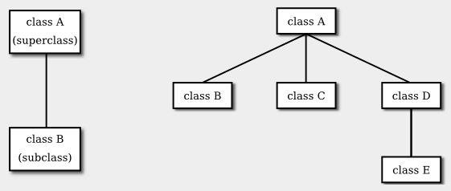

# Section 5: 상속, 다형성, 추상 클래스

클래스는 동일한 구조와 행위(behavior)를 공유하는 객체들의 집합을 나타낸다. 클래스는 해당 클래스의 각 인스턴스에 포함된 변수들을 지정하여 객체들의 구조를 결정하고, 객체들의 행위를 표현하는 인스턴스 메서드를 제공하여 해당 행위를 결정한다. 이는 강력한 아이디어이다. 그러나 이와 같은 일은 대부분의 프로그래밍 언어에서도 이루어 질 수 있는 것이다. 객체 지향 프로그래밍의 중심적인 새로운 아이디어 — 전통적인 프로그래밍과는 실제로 구별되는 아이디어 — 는, 구조와 행위 전부는 아니지만, 그 **일부**를 공유하는 객체들 사이의 유사성을 클래스가 표현하도록 하는 것이다. 이러한 유사성(similarities)은 **상속(inheritance)** 과 **다형성(polymorphism)** 을 사용하여 표현될 수 있다.

## 1. 기존 클래스 확장하기
프로그래머라면 누구나 하위 클래스, 상속, 다형성이 무엇을 의미하는지 알아야 한다. 그러나, 이미 존재하는 클래스를 확장하는 일을 제외한다면 상속을 사용하여 실제로 일을 하기까지는 아마 시간이 좀 걸릴 것이다. 이 절의 첫 부분에서는 이 작업이 어떻게 이루어지는지 살펴보고자 한다.

일상의 프로그래밍, 특히 이제 막 객체를 다루기 시작하는 프로그래머의 경우, 하위 클래스화(subclassing)는 주로 한 가지 상황에서 사용된다: 몇몇 변경사항이나 추가사항에 조정될 수 있는 기존 클래스의 존재. 이는 밑바닥부터 클래스 및 하위 클래스의 그룹을 설계하는 것보다 훨씬 더 일반적이다. 하위 클래스를 만들기 위해 기존 클래스는 **확장될(extended)** 수 있다. 이에 대한 구문은 다음과 같다:

```java
public class {subclass-name} extends {exisiting-class-name} {
    .
    .   // 변경 및 추가사항.
    .
}
```

예를 들어, 블랙잭(Blackjack)이라는 카드 게임을 하는 프로그램을 작성하고 싶다고 가정하자. 제5장 제4절에서 개발된 Card, Hand, 그리고 Deck 클래스를 사용할 수 있다. 그러나 블랙잭 게임의 손패(hand)는 일반적인 카드 게임의 손패와는 조금 다르다. 게임의 규칙에 따라 블랙잭 손패의 "값"을 계산하는 것이 반드시 가능해야 하기 때문이다. 해당 규칙은 다음과 같다: 손패의 값은 손에 있는 카드들의 값을 합산하여 얻는다. 3이나 10과 같은 숫자 카드의 값은 그 숫자 값이 된다. 잭, 퀸, 킹의 값은 10이다. 에이스의 값은 1이거나 11일 수 있다. 에이스는 계산시 손패의 합산 값이 21을 넘지 않는 한 11로 계산해야 한다. 이는 손에 있는 두 번째, 세 번째 또는 네 번째 에이스가 항상 1로 계산된다는 것을 의미한다.

이를 처리하는 한 가지 방법은 손패의 블랙잭 값을 계산하는 메서드를 추가하여 기존 Hand 클래스를 확장하는 것이다. 이러한 클래스의 정의는 다음과 같다:

public class BlackjackHand extends Hand {

```java
    /**
     * 블랙잭 게임에서 해당 손패의 값을 계산하여 반환한다.
     */
    public int getBlackjackValue() {

        int val;      // 계산된 손패의 값.
        boolean ace;  // 손패에 에이스가 포함된 경우
                      //   이는 true로 설정될 것이다.
        int cards;    // 손패의 카드 갯수.

        val = 0;
        ace = false;
        cards = getCardCount();  // (Hand 클래스에 정의된 메서드.)

        for ( int i = 0;  i < cards;  i++ ) {
                // 손패의 i번째 카드의 값을 추가한다.
            Card card;    // i번째 카드; 
            int cardVal;  // i번째 카드의 블랙잭 값.
            card = getCard(i);
            cardVal = card.getValue();  // 일반적인 값으로, 1부터 13 사이.
            if (cardVal > 10) {
                cardVal = 10;   // 잭, 퀸, 킹의 경우.
            }
            if (cardVal == 1) {
                ace = true;     // 적어도 하나의 에이스가 존재.
            }
            val = val + cardVal;
         }

         // 현재, val은 손패의 값이며, 어떤 에이스든 1로 계산한다.
         // 에이스가 하나 존재하고 그 값이 1에서 11로 변경하여
         // 점수가 21보다 작거나 같다는 결과로 된다면,
         // val에 10을 추가적으로 더하여 그렇게 맞춘다. 

         if ( ace == true  &&  val + 10 <= 21 )
             val = val + 10;

         return val;

    }  // getBlackjackValue() 종료

} // 클래스 BlackjackHand 종료
```

BlackjackHand 는 Hand 의 하위 클래스이기 때문에, BlackjackHand 자료형의 객체는 Hand 에 정의된 모든 인스턴스 변수와 인스턴스 메서드를 포함하며, `getBlackjackValue()`라는 이름의 새로운 인스턴스 메서드가 추가된다. 예를 들어, `bjh`가 `BlackjackHand` 자료형의 변수인 경우, 다음의 것들은 모두 허용된다: `bjh.getCardCount()`, `bjh.removeCard(0)`, 그리고 `bjh.getBlackjackValue()`. 처음 두 메서드는 Hand 에 정의되어 있지만, BlackjackHand 에 의해 상속된 것이다.

Hand 클래스의 변수와 메서드는 BlackjackHand 에 의해 상속되며, 이들은 마치 해당 클래스에 실제로 정의된 것처럼 BlackjackHand 의 정의에서 사용될 수 있다 — `private`라고 선언된 것들로써 하위 클래스에 의해서도 접근이 금지된 경우를 제외한다면 말이다. 위의 `getBlackjackValue()` 정의에서 "`cards = getCardCount();`"라는 문장은 인스턴스 메서드 `getCardCount()`를 호출하는데, 이는 Hand 에 정의되어 있었던 것이다.

기존 클래스를 확장하는 것은 이전 작업을 기반으로 구축하기 쉬운 방법이다. 많은 표준 클래스가 하위 클래스를 만드는 기반으로써 사용되기 위해 명시적으로 작성되었음을 알게 될 것이다.

<hr>

`public` 및 `private`와 같은 접근 제한자(access modifier)는 클래스 멤버에 대한 접근을 제어하는 데 사용된다. 하위 클래스를 고려할 때, 주목을 받는 접근 제한자가 하나 더 존재한다: **보호됨(protected)**. `protected`가 클래스의 메서드 또는 멤버 변수에 대한 접근 제한자로써 적용되는 경우, 해당 멤버는 그것이 정의된 클래스의 하위 클래스 — 직접적이든 또는 간접적이든 — 에서 사용될 수 있지만, 하위 클래스가 아닌 곳에서는 사용될 수 없다. (예외가 존재하긴 한다: `protected` 멤버는 또한 해당되는 보호된 멤버를 포함하는 해당 클래스와 동일한 패키지 안에 있는 모든 클래스에서 접근할 수도 있다. 접근 제한자를 사용하지 않으면 동일한 패키지의 클래스에서 멤버에 접근할 수 있으며, 다른 곳에서는 할 수 없다는 점을 떠올려라. `protected` 제한자를 사용하는 것은 제한자가 전혀 사용되지 않는 것보다 훨씬 절대적으로 자유롭다: 이는 동일한 패키지에 있는 클래스로부터의 접근을 허용하고 동일한 패키지에 없는 **하위 클래스**로부터의 접근 또한 허용한다.)

메서드 또는 멤버 변수를 `protected`로 선언하는 경우, 이들이 클래스의 공개 인터페이스 일부라기보다는 클래스 구현의 일부라고 말하는 것이다. 하지만, 하위 클래스가 구현의 해당 부분을 사용하고 수정하는 일을 허용하고 있다.

예를 들어, 두 주사위에 나타나는 숫자를 나타내기 위해 인스턴스 변수 `die1`과 `die2`를 가지는 PairOfDice 클래스를 생각해보자. 이러한 변수를 `private`로 만들어 클래스 외부에서 값을 변경하는 것을 불가능하게 만들 수 있는 한편, 게터(getter) 메서드를 통하여 읽기 접근을 여전히 허용할 수도 있다. 그러나 하위 클래스를 만드는 데 PairOfDice 가 사용될 가능성이 있다고 생각되면, 하위 클래스가 주사위의 숫자를 변경할 수 있도록 하고 싶을 터이다. 예를 들어, 주사위를 그리는 GraphicalDice 하위 클래스는 주사위를 굴릴 때를 제외한 다른 시간에 숫자를 변경하기를 바랄 수 있다. 이 경우, `die1` 및 `die2`를 `protected`로 할 수 있으며, 이를 통해 하위 클래스는 외부에 공개하지 않고도 이들의 값을 변경할 수 있게 된다. (더 좋은 아이디어는 변수에 대한 `protected` 세터(setter) 메서드를 정의하는 것일 터이다. 예를 들어, 세터 메서드는 변수에 할당되는 해당 값이 허용되는 범위인 1에서 6 사이인지를 확인할 수 있다.)

<hr>

## 2. 상속과 클래스 계층 구조
**상속(inheritance)** 이라는 용어는 한 클래스가 다른 클래스로부터 해당 구조와 동작의 일부 또는 전체를 상속받을 수 있다는 사실을 나타낸다. 상속 받게 되는 클래스를 자신이 상속받는 클래스의 **하위 클래스(subclass)** 라고 한다. 클래스 B가 클래스 A의 하위 클래스인 경우 클래스 A는 클래스 B의 **슈퍼 클래스(superclass)** 라고도 합니다. (때때로 **파생 클래스(derived class)** 와 **기본 클래스(base class)** 라는 용어가 사용되기도 한다. 하위 클래스와 상위 클래스 대신 사용된다. C++에서 주로 사용되는 용어이다.) 하위 클래스는 상속하는 구조와 동작을 추가할 수 있다. 또한 상속된 동작을 대체하거나 수정할 수도 있다. 하위 클래스와 상위 클래스 사이의 관계는 하위 클래스가 아래에 표시되고, 아래 왼쪽에 표시된 것처럼 상위 클래스에 연결되는 다이어그램으로 표시된다.



Java에서 "A"라는 클래스의 하위 클래스로 "B"라는 클래스를 생성하려면 다음과 같이 작성한다.
```java
class B extends A {
    .
    .  // 추가 및 수정,
    .  // 클래스 A에서 상속된 항목들
    .
}
```

여러 클래스를 동일한 슈퍼클래스의 하위 클래스로 선언할 수 있다. "형제 클래스(sibling class)"라고 할 수 있는 하위 클래스는 일부 구조와 동작, 즉 공통 슈퍼클래스에서 상속받은 동작을 공유한다. 슈퍼클래스는 이러한 공유 구조와 동작을 표현한다. 위 오른쪽에 표시된 다이어그램에서 클래스 B, C, D는 형제 클래스입니다. 상속은 클래스의 여러 세대에 걸쳐 확장될 수도 있습니다. 이는 다이어그램에서 클래스 E가 클래스 A의 하위 클래스인 클래스 D의 하위 클래스로 표시된 것을 보면 됩니다. 이 경우 클래스 E는 직접적인 하위 클래스는 아니지만 클래스 A의 하위 클래스로 간주됩니다. 이 클래스 집합은 작은 **클래스 계층 구조(class hierarchy)** 를 형성합니다.

<hr>

## 3. 예시: Vehicles


