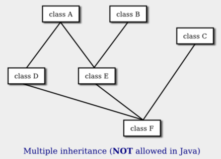

# Section 7: 인터페이스

C++와 같은 일부 객체 지향 프로그래밍 언어에서는 클래스가 두 개 이상의 슈퍼클래스를 확장할 수 있다. 이를 **다중 상속**이라고 한다. 예를 들어 아래 그림에서 클래스 E는 클래스 A와 클래스 B를 모두 직접 슈퍼클래스로 갖고 있는 반면, 클래스 F에는 세 개의 직접 슈퍼클래스가 있는 것으로 표시된다.



이러한 다중 상속은 Java에서 **허용되지 않는다**. Java 설계자는 언어를 합리적으로 단순하게 유지하기를 원했으며 다중 상속의 이점은 복잡성 증가에 따른 비용만큼 가치가 없다고 느꼈다. 그러나 Java에는 다중 상속과 비슷하게 사용할 수 있는 기능인 인터페이스가 있다. 우리는 이미 섹션 4.5 에서 람다 표현식과 관련된 **기능적 인터페이스**를 접했다. 기능적 인터페이스는 단일 메서드를 지정한다. 그러나 인터페이스는 그보다 훨씬 더 복잡할 수 있으며 다른 용도로도 많이 사용된다.

상당히 복잡한 프로그램을 작성하기 전까지는 자신만의 인터페이스를 작성할 필요가 없을 것이다. 그러나 Java의 표준 패키지에는 중요한 방식으로 사용되는 여러 인터페이스가 있으며 이를 사용하는 방법을 배워야 한다.

<hr>

## 1. 인터페이스 정의 및 구현

우리는 일반적인 블랙박스 및 특히 서브루틴과 관련된 다른 맥락에서 **인터페이스**라는 용어를 접했다. 서브루틴의 인터페이스는 서브루틴 이름, 반환 유형, 매개변수 수 및 유형으로 구성된다. 서브루틴을 호출하고자 할 때 알아야 할 정보이다. 서브루틴에는 구현도 있다. 서브루틴을 정의하고 서브루틴이 호출될 때 실행되는 코드 블록이다.

Java에서 인터페이스는 추가적인 기술적 의미를 갖는 예약어이다. 이러한 의미에서 **인터페이스**는 연관된 구현 없이 인스턴스 메소드 인터페이스 세트로 구성된다. (실제로 Java 인터페이스에는 다른 것도 포함될 수 있다. 추후 살펴볼 예정임.) 클래스는 인터페이스에 지정된 각 메서드에 대한 구현을 제공하여 인터페이스를 구현할 수 있다. 다음은 매우 간단한 Java 인터페이스의 예이다.

```java
public interface Strokeable { 
    public void stroke(GraphicsContext g);
}
```

이는 `stroke()` 메서드의 구현이 생략된다는 점을 제외하면 클래스 정의와 매우 비슷해 보인다. `Strokeable` 인터페이스를 구현하는 클래스는 `stroke()`에 대한 구현을 제공해야 한다. 물론 클래스에는 다른 메서드와 변수도 포함될 수 있다. 예를 들어,
```java
public class Line implements Strokeable {
    public void stroke(GraphicsContext g) {
        . . . // do something—presumably, draw a line
    }
    . . . // other methods, variables, and constructors
}
```

인터페이스를 구현하려면 클래스는 단순히 인터페이스의 각 메서드에 대한 구현을 제공하는 것 이상을 수행해야 한다. 또한 이 예제에서처럼 `implements` 예약어를 사용하여 인터페이스를 구현한다고 명시해야 한다. `public class Line Implements Strokeable` 와 같이 사용한다. `Strokeable` 인터페이스를 구현하는 모든 구체적인 클래스는 `stroke()` 인스턴스 메서드를 정의해야 한다. 이러한 클래스에서 생성된 모든 객체에는 `stroke()` 메서드가 포함된다. 객체가 인터페이스를 구현하는 클래스에 속하면 객체가 인터페이스를 구현한다고 말한다. 예를 들어 Line 유형의 모든 객체는 `Strokeable` 인터페이스를 구현한다.

클래스는 다른 클래스 하나만 **확장** 할 수 있지만 인터페이스는 원하는 수만큼 구현할 수 있다. 실제로 클래스는 다른 클래스 하나를 확장하고 하나 이상의 인터페이스를 구현할 수 있다. 그래서 우리는 다음과 같은 것을 수행할 수 있다.

```java
class FilledCircle extends Circle 
                        implements Strokeable, Fillable {
   . . .
}
```

요점은 인터페이스가 클래스는 아니지만 매우 유사하다는 것이다. 인터페이스는 추상 클래스, 즉 객체를 생성하는 데에는 절대 사용할 수 없지만 하위 클래스를 만드는 기초로 사용할 수 있는 클래스와 매우 유사하다. 인터페이스의 서브루틴은 인터페이스를 구현하는 구체적인 클래스에서 구현되어야 하는 추상 메서드이다. `Strokeable` 인터페이스를 추상 클래스와 비교할 수 있다.

```java
public abstract class AbstractStrokeable { 
    public abstract void stroke(GraphicsContext g);
}
```

주요 차이점은 `AbstractStrokeable`을 확장하는 클래스는 다른 클래스를 확장할 수 없지만 `Strokeable`을 구현하는 클래스는 일부 클래스를 확장하고 다른 인터페이스를 구현할 수도 있다는 것이다. 물론 추상 클래스에는 추상 메서드뿐만 아니라 비추상 메서드도 포함될 수 있다. 인터페이스는 추상 메서드만 포함하는 **순수한** 추상 클래스와 같다.

인터페이스에 선언된 메서드는 `public` 및 `abstract`여야 한다. 이것이 유일한 옵션이므로 선언에서 이러한 수정자 중 하나를 지정할 필요가 없다.

인터페이스에는 메서드 선언 외에도 변수 선언도 포함될 수 있다. 변수는 `public static final`이어야 하며 인터페이스를 구현하는 모든 클래스에서 사실상 public static final 변수가 되어야 한다. 실제로 변수는 공개적이고 정적이며 최종적이어야만 하므로 수정자를 지정하는 것은 선택 사항이다. 예를 들어,

```java
public interface ConversionFactors {
    int INCHES_PER_FOOT = 12;
    int FEET_PER_YARD = 3;
    int YARDS_PER_MILE = 1760;
}
```

이는 여러 클래스에서 사용할 수 있는 명명된 상수를 정의하는 편리한 방법이다. `ConversionFactors`를 구현하는 클래스는 인터페이스에 정의된 상수를 마치 클래스에 정의된 것처럼 사용할 수 있다.

특히 인터페이스에 정의된 모든 변수는 상수라는 점에 유의해라. 실제로는 전혀 변수가 아니다. 인터페이스는 인터페이스를 구현하는 클래스에 인스턴스 변수를 추가 할 수 없다.

인터페이스는 하나 이상의 다른 인터페이스를 확장할 수 있다. 예를 들어, `Strokeable`이 위에 제공된 인터페이스이고 `Fillable`이 `fill(g)` 메서드를 정의하는 인터페이스인 경우 다음을 정의할 수 있다.

```java
public interface Drawable extends Strokeable, Fillable {
    // (more methods/constants could be defined here)
}
```

`Drawable`을 구현하는 구체적인 클래스는 `Strokeable` 의 `stroke()` 메서드 와 `Fillable` 의 `fill()` 메서드 는 물론 `Drawable` 인터페이스에 직접 지정된 모든 추상 메서드에 대한 구현을 제공해야 한다.

인터페이스는 일반적으로 이름이 인터페이스 이름과 일치해야 하는 자체 .java 파일에 정의된다. 예를 들어 `Strokeabl`e은 Strokeable.java 라는 파일에 정의된다. 클래스와 마찬가지로 인터페이스도 패키지에 있을 수 있으며 다른 패키지에서 항목을 가져올 수 있다.

이번 논의는 인터페이스의 구문 규칙에 관한 것이었다. 물론 인터페이스에는 의미 구성 요소도 있다. 즉, 인터페이스를 생성하는 사람은 인터페이스가 정의하는 메서드가 특정한 의미를 갖도록 의도한다. 인터페이스 정의에는 해당 의미를 표현하는 주석이 포함되어야 하며, 인터페이스를 구현하는 클래스는 해당 의미를 고려해야 한다. 그러나 Java 컴파일러는 구문만 확인할 수 있다. 의미를 강제할 수는 없다. 예를 들어 `Strokeable`을 구현하는 객체의 `stroke()` 메서드는 객체를 스트로크하여 객체의 그래픽 표현을 그리는 것으로 추정되지만 컴파일러는 객체에 `stroke()` 메서드가 있는지만 확인할 수 있다.

<hr>

## 2. Default 메서드

Java 8부터 인터페이스에는 **`default` 메소드**가 포함될 수 있다. 인터페이스의 일반적인 추상 메서드와 달리 default 메서드에는 구현이 있다. 클래스가 인터페이스를 구현할 때 default 메서드에 대한 구현을 제공할 필요는 없다. 하지만 다른 구현을 제공하려는 경우에는 그렇게 할 수 있다. 기본적으로 default 메서드는 일반 메서드가 클래스에서 상속되는 것과 거의 동일한 방식으로 인터페이스에서 상속된다. 이는 Java를 다중 상속 지원 방향으로 부분적으로 이동시킨다. 그러나 인터페이스는 여전히 인스턴스 변수를 정의할 수 없기 때문에 다중 상속이 아니다. default 메서드는 동일한 인터페이스에 정의된 추상 메서드를 호출할 수 있지만 인스턴스 변수를 참조할 수는 없다.

기능적 인터페이스에는 그것이 지정하는 단일 추상 메서드 외에 default 메서드도 포함될 수 있다.

인터페이스의 default 메소드는 `default` 수정자로 표시되어야 한다. 선택적으로 `public` 으로 표시할 수 있지만 인터페이스의 다른 모든 것과 마찬가지로 default 메서드는 자동으로 `public`이 되며 `public` 한정자는 생략할 수 있다. 예는 다음과 같다.

```java
public interface Readable { // represents a source of input

    public char readChar();  // read the next character from the input

    default public String readLine() { // read up to the next line feed
        StringBuilder line = new StringBuilder();
        char ch = readChar();
        while (ch != '\n') {
            line.append(ch);
            ch = readChar();
        }
        return line.toString();
    }

}
```

이 인터페이스를 구현하는 구체적인 클래스는 `readChar()`에 대한 구현을 제공해야 한다. 인터페이스에서 `readLine()`에 대한 정의를 상속하지만 필요한 경우 새 정의를 제공할 수 있다. 클래스에 default 메서드 에 대한 구현이 포함되어 있으면 클래스에 제공된 구현이 인터페이스의 default 메서드를 재정의 한다.

기본 `readLine()`은 추상 메소드 `readChar()`를 호출하는데, 이 정의는 구현 클래스에서만 제공된다. 정의에서 `readChar()`에 대한 참조는 다형성이다. `readLine()`의 기본 구현은 `Readable`을 구현하는 거의 모든 클래스에서 의미가 있는 구현이다. 다음은 클래스를 테스트하는 `main()` 루틴을 포함하여 `Readable`을 구현하는 클래스의 다소 어리석은 예이다. 그것이 무엇을 하는지 알아낼 수 있을까?

```java
public class Stars implements Readable {

    public char readChar() {
        if (Math.random() > 0.02)
           return '*';
        else
           return '\n';
    }
    
    public static void main(String[] args) {
        Stars stars = new Stars();
        for (int i = 0 ; i < 10; i++ ) {
            String line = stars.readLine();  // Calls the default method!
            System.out.println( line );
        }
    }
      
}
```

default 메소드는 다른 프로그래밍 언어의 "mixin"과 유사한 기능, 즉 다른 소스의 기능을 클래스에 혼합하는 기능을 Java에 제공한다. 클래스는 여러 인터페이스를 구현할 수 있으므로 여러 소스의 기능을 혼합하는 것이 가능하다.

<hr>

## 3. 타입으로써의 인터페이스

추상 클래스와 마찬가지로 인터페이스에서 객체를 생성할 수 없더라도 인터페이스에서 제공하는 유형의 변수를 선언할 수 있다. 예를 들어, `Strokeable`이 위에 제공된 인터페이스이고 `Line` 및 `Circle`이 위와 같이 `Strokeable`을 구현하는 클래스인 경우 다음과 같이 말할 수 있다.

```java
Strokeable figure;  // Declare a variable of type Strokeable.  It
                    //    can refer to any object that implements the
                    //    Strokeable interface.
                  
figure = new Line();  // figure now refers to an object of class Line
figure.stroke(g);   // calls stroke() method from class Line

figure = new Circle();   // Now, figure refers to an object
                               //   of class Circle.
figure.stroke(g);   // calls stroke() method from class Circle
```

`Strokeable` 유형의 변수는 `Strokeable` 인터페이스 를 구현하는 모든 클래스의 모든 객체를 참조할 수 있다. 그림이 `Strokeable` 유형 이고 모든 `Strokeable` 객체에 `stroke()` 메서드가 있으므로 위의 `Figure.Stroke(g)` 와 같은 문은 유효하다. 따라서 객체 `Figure`가 무엇을 참조하든 해당 객체에는 `stroke()` 메서드가 있어야 한다.

유형은 변수를 선언하는 데 사용할 수 있는 것이다. 유형을 사용하여 서브루틴의 매개변수 유형이나 함수의 반환 유형을 지정할 수도 있다. Java에서 유형은 클래스, 인터페이스 또는 8개의 내장 기본 유형(built-in primitive type) 중 하나일 수 있다 (특별한 종류의 클래스로 간주되는 enum과 같은 몇 가지 특별한 경우가 있다). 그러나 이 중 클래스만 새 개체를 생성하는 데 사용할 수 있다.

인터페이스는 배열의 기본 타입이 될 수도 있다. 예를 들어 배열 유형 `Strokeable[]`을 사용하여 변수를 선언하고 배열을 만들 수 있다. 배열의 요소는 `Strokeable` 인터페이스를 구현하는 모든 객체를 참조할 수 있다.

```java
Strokeable[] listOfFigures;
listOfFigures = new Strokeable[10];
listOfFigures[0] = new Line();
listOfFigures[1] = new Circle();
listOfFigures[2] = new Line();
  .
  .
  .
```

그러면 배열의 모든 요소에 `stroke()` 메서드가 있으므로 `listOfFigures[i].stroke(g)` 와 같은 것을 말할 수 있다.


