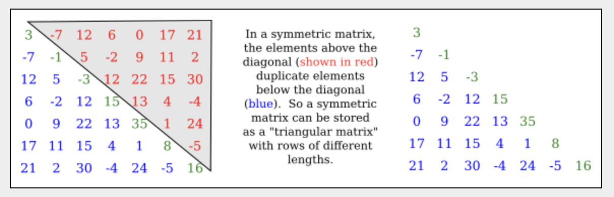
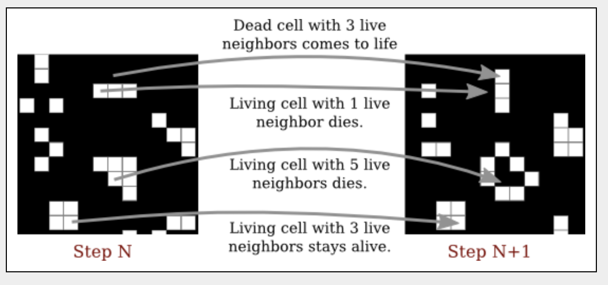
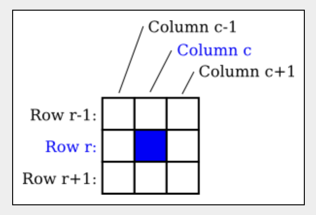
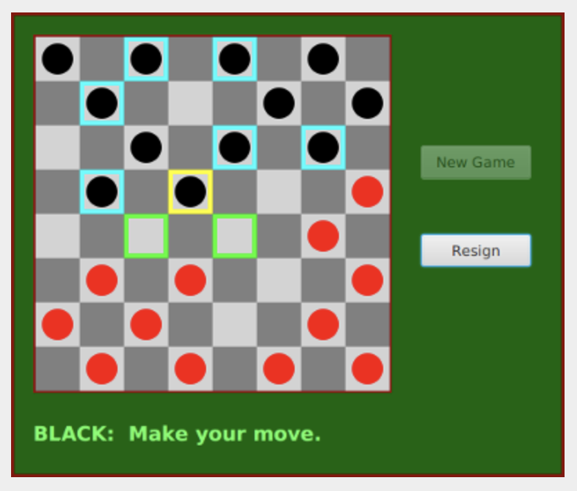
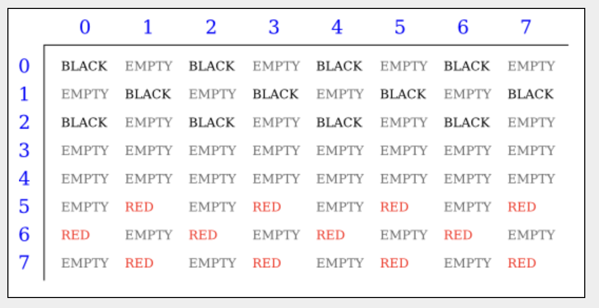

# Section 6: 2차원 배열

2개의 2차원 배열이 섹션 3.8.5에서 소개되었지만 그 이후로 많은 작업을 수행하지 않았다. 2D 배열에는 두 쌍의 대괄호가 포함된 `int[][]` 또는 `String[][]`과 같은 유형이 있다. 2D 배열의 요소는 행과 열로 정렬되며 2D 배열의 `new` 연산자는 행 수와 열 수 모두 지정한다.

```java
int[][] A;
A = new int[3][4];
```

그러면 3행과 4열로 배열된 12개의 요소가 있는 int의 2D 배열이 생성된다. 언급하지는 않았지만 2D 배열을 위한 초기화 프로그램이 있다. 

```java
int[][]  A  =  {  
        {  1,  0, 12, -1 },
        {  7, -3,  2,  5 },
        { -5, -2,  2, -9 }
};
```

2D 배열의 이니셜라이즈에는 쉼표로 구분되고 중괄호로 묶인 A의 행이 포함된다. 각 행은 쉼표로 구분되고 중괄호로 묶인 값 목록이다. 선언뿐만 아니라 어디에서나 사용할 수 있는 유사한 구문을 가진 배열 리터럴도 있다.

```java
A  =  new int[][] {  
        {  1,  0, 12, -1 },
        {  7, -3,  2,  5 },
        { -5, -2,  2, -9 }
};
```

이 모든 것은 자연스럽게 3차원, 4차원, 더 높은 차원의 배열로 확장되지만 실제로는 자주 사용되지 않는다.

## 1. 2D 배열에 대한 진실

하지만 더 나아가기 전에 약간의 놀라움이 있다. Java에는 실제로 2차원 배열이 없다. 실제 2D 배열에서는 배열의 모든 요소가 연속적인 메모리 블록을 차지하지만 Java에서는 그렇지 않는다. 배열 유형의 구문은 단서이다. 모든 유형의 BaseType에 대해 "BaseType의 배열"을 의미하는 `BaseType[]` 유형을 구성할 수 있어야 한다. `int[]`를 기본 유형으로 사용하면 `int[]` 배열 또는 `int[][]` 유형이 된다. 실제로 그런 일이 발생한다. 요소 `int[][]` 유형의 2D 배열에는 `int[]` 유형의 변수가 있다. 그리고 `int[]` 유형의 변수는 int 배열에 대한 포인터만 보유할 수 있다는 점을 기억하세요. 따라서 2D 배열은 실제로 포인터의 배열이며, 각 포인터는 1차원 배열을 참조할 수 있다. 이러한 1차원 배열은 2D 배열의 행이다. 다음 그림을 참고


대부분의 경우 현실을 무시하고 그리드 그림을 염두에 둘 수 있다. 그러나 때로는 그리드의 각 행이 그 자체로 배열이라는 점을 기억해야 할 때도 있다. 이러한 배열은 `A[0]`, `A[1]` 라고 할 수 있다. 각 행은 실제로 `int[]` 유형의 값이다. 예를 들어 `int[]` 유형의 매개 변수를 요청하는 서브 루틴에 전달될 수 있다.

이 구조의 결과 중 일부는 약간 미묘하다. 예를 들어, 2D 배열 A를 배열의 배열로 생각하면 `A.length`가 의미있고 A의 행 수와 동일하다는 것을 알 수 있다. A가 2D 배열의 일반적인 모양을 갖는 경우 A의 열수는 첫 행의 요소수, 즉 `A[0].length`와 동일하다. 그러나 A의 모든 행의 길이가 같아야 한다는 규칙은 없다. 2D 배열의 각 행은 별도의 1차원 배열이며 각 배열의 길이는 다를 수 있다. 실제로 행이 `null`일 수도 있다.

```java
A = new int[3][];
```

두 번째 대괄호 세트에 숫자가 없으면 모든 요소가 `null`인 3개 요소의 배열을 만든다. 세 개의 행을 위한 장소가 있지만 실제 행이 생성되지 않는다. 그런 다음 `A[0]`, `A[1]`, `A[2]` 행을 개별적으로 만들 수 있다.

예를 들어 **대칭 행렬(symmetric matrix)** 을 생각해 보자. 대칭 행렬 `M`은 행 개수가 열 개수와 동일하고 모든 `i`, `j`에 대해 `M[i][j]`를 만족하는 `M[j][i]`와 동일한 2차원 배열이다. 이러한 동일성 때문에 `i >= j`에 대해 `M[i][j]`만 저장하면 된다. 데이터를 "삼각 행렬"에 저장할 수 있다.





각 행을 별도로 생성하면 삼각형 배열을 만드는 것이 충분히 쉽다. `double`의 7 X 7 삼각형 배열을 생성하려면 코드 세그먼트를 사용할 수 있다.

```java
double[][] matrix = new double[7][];

for (int i = 0; i < 7; i++) {
    matrix[i] = new double[i + 1];    
}
```

`(i, j)`에서 행렬의 값을 알고 싶다면 `i < j`인 경우 실제로 삼각 행렬에서 `matrix[j][i]`의 값을 얻어야 한다는 점만 기억하면 된다. 값 설정도 마찬가지이다. 대칭 행렬을 나타내는 클래스를 작성하는 것은 쉽다.

```java
/**
 * 실수로 구성된 대칭 nxn 행렬을 나타냅니다.
 */
public class SymmetricMatrix {
    
    private double[][] matrix;  // A triangular matrix to hold the data.

    /**
     * 모든 항목이 0인 nxn 대칭 행렬을 만듭니다.
     */
    public SymmetricMatrix(int n) {
        matrix = new double[n][];
        for (int i = 0; i < n; i++)
            matrix[i] = new double[i+1];
    }

    /**
     * (row,col) 위치에 있는 행렬 항목을 반환합니다. (행 <열인 경우,
     * 실제로 값은 (열, 행) 위치에 저장됩니다.)
     */
    public double get( int row, int col ) {
        if (row >= col)
            return matrix[row][col];
        else
            return matrix[col][row];
    }

    /**
     * (row,col)에서 행렬 항목의 값을 설정합니다. (행 <열인 경우,
     * 실제로 값은 (열, 행) 위치에 저장됩니다.)
     */
    public void set( int row, int col, double value ) {
        if (row >= col)
            matrix[row][col] = value;
        else
            matrix[col][row] = value;
    }

    /**
     * 행렬의 행과 열 수를 반환합니다.
     */
    public int size() {
        return matrix.length;
    }

}
```

표준 함수 `Arrays.copyOf()`는 한 단계로 2D 배열의 전체 복사본을 만들 수 없다. 그렇게 하려면 각 행을 별도로 복사해야 한다. 

```java
int[][] B = new int[A.length][];
for (int i = 0; i < A.length; i++) {
    B[i] = Arrays.copyOf(A[i], A[i].length);    
}
```

## 2. Conway의 인생 게임

보다 일반적인 2D 배열 처리의 예로 매우 잘 알려진 예를 살펴본다. Conway's Game of Life는 수학자 John Horton Conway가 1970년에 발명했다. 이 Life of Game은 실제로는 게임이 아니다. "2차원 세포 자동 장치"이다. 이는 단지 명확하고 결정적인 규칙에 따라 시간이 지남에 따라 내용이 변경되는 셀 그리드임을 의미한다. 생명에서 세포는 오직 두 가지 가능한 내용만을 가질 수 있다. 그것은 "살아있음" 또는 "죽음"일 수 있다. 2D 배열을 사용하여 그리드를 표현하며, 배열의 각 요소는 그리드에 있는 한 셀의 내용을 나타낸다. 게임에서는 각 셀이 살아 있거나 죽은 것으로 표시되는 초기 그리드가 설정된다. 이후 게임은 "그 자체로 진행 된다." 그리드는 일련의 시간 단계를 통해 발전한다. 각 시간 단계의 그리드 내용은 간단한 규칙에 따라 이전 시간 단계의 내용에 의해 완전히 결정된다. 그리드의 각 셀은 8개의 이웃(수평, 수직 및 대각선)을 보고 그 셀의 개수를 계산한다. 이웃을 살아있다. 그런 다음, 다음 단계의 셀 상태는 규칙에 따라 결정된다.

- 현재 시간 단계에서 살아있는 셀의 경우 : 셀에 2~3개의 살아있는 이웃이 있으면 다음 시간 단계에서도 해당 셀은 계속 살아 있다. 그렇지 않으면 죽는다.
- 현재 시간 단계에서 죽은 셀의 경우 : 셀에 3개의 살아있는 이웃이 있으면 다음 시간 단계에서 셀이 살아난다. 그렇지 않으면 죽은 채로 남아 있다.


다음은 규칙이 적용되기 전과 후의 동일한 보드를 보여주는 라이프 보드의 일부 사진이다. 규칙은 그리드의 모든 셀에 적용된다. 



인생 게임은 흥미롭고 놀라운 패턴을 많이 낳기 때문에 흥미롭다. 여기서는 게임을 시뮬레이션하는 프로그램을 작성하는 데 관심이 있다. 전체 프로그램은 [Life.java 파일](https://math.hws.edu/javanotes/source/chapter7/Life.java)에서 찾을 수 있다. 프로그램에서 생활 격자는 사각형의 격자로 표시되며, 데드 사각형은 검은색이고 살아있는 사각형은 흰색이다. 프로그램에서 죽은 세포와 살아있는 세포로 생명판을 무작위로 채울 수도 있고, 마우스를 사용하여 게임판을 설정할 수도 있다. 게임의 한 시간 단계를 계산하는 "단계" 버튼과 시간 단계를 애니메이션으로 실행하는 "시작"버튼이 있다.


이 프로그램의 Game of Life 구현과 관련된 배열 처리 중 일부를 살펴본다. 세포는 살아있거나 죽을 수만 있이 때문에 모든 세포의 상태를 표현하기 위해 `boolean[][]` 2차원 배열을 사용하는 것이 당연하다. 배열의 이름은 `Alive`이며 행 `r`, 열 `c`의 셀이 살아있으면 `Alive[r][c]`는 `true`다. 행수와 열수는 동일하며 `GRID_SIZE` 상수로 지정된다.

```java
for (int r = 0; r < GRID_SIZE; r++) {
    for (int c = 0; c < GRID_SIZE; c++) {
        alive[r][c] = (Math.random() < 0.25);
    }
}
```

표현식 `(Math.random() < 0.25)`은 boolean 배열 요소에 할당할 수 있는 true/false 값이다. 배열은 화면의 셀 색상을 설정하는 데에도 사용된다. 셀의 그리드는 화면에 모자이크캔버스로 표시되므로 색상 설정은 모자이크 캔버스 API를 사용하여 수행된다. 실제 그리기는 `mosaicCanvas` 클래스에서 수행된다. Life 프로그램은 mosaicCanvas API를 사용하여 모자이크의 색상을 설정하기만 하면 된다. 이는 보드가 변경될 때마다 호출되는 `showBoard()`라는 메서드를 통해 프로그램에서 수행된다. 

```java
for (int r = 0; r < GRID_SIZE; r++) {
    for (int c = 0; c < GRID_SIZE; c++) {
        if (alive[r][c])
            display.setColor(r,c,Color.WHITE);
        else
            display.setColor(r,c,null);
    }
}
```

물론, 프로그램에서 가장 흥미로운 부분은 현재 상태에 규칙을 적용하여 보드의 새로운 상태를 계산하는 것이다. 규칙은 각 개별 셀에 적용되므로 다시 중첩된 for 루프를 사용하여 보드의 모든 셀을 통해 작업할 수 있지만 이번에는 처리가 더 복잡하다. 먼저 배열을 작업하는 동안 배열의 값을 변경할 수 없다는 점에 유의하세요. 왜냐하면 이웃 셀을 처리할 때 셀의 이전 상태를 알아야 하기 때문이다. 실제로 프로그램은 새 보드가 생성되는 동안 이를 유지하기 위해 두 번째 배열을 사용한다. 새 보드가 완성되면 기존 보드로 대체할 수 있다. 알고리즘 의사코드에서 다음과 같이 진행된다.

```
let newboard be a new boolean[][] array
for each row r:
    for each column c:
        Let N be the number of neighbors of cell (r,c) in the alive array
        if ((N is 3) or (N is 2 and alive[r][c]))
            newboard[r][c] = true;
        else
            newboard[r][c] = false;
alive = newboard
```

프로세스가 끝나면 `Alive`가 새 배열을 가리키게 된다. 배열의 내용이 게임의 새로운 상태를 나타내는 한 이는 중요하지 않다. 이전 배열은 가비지 수집된다. `newboard[r][c]`가 true인지 false인지에 대한 테스트가 명확하지 않을 수 있지만 규칙을 올바르게 구현한다. 우리는 여전히 이웃 구를 세는 작엉ㅂ을 해야 한다. 행 `r`과 열 `c`의 셀을 살펴보자. 보드 가장자리에 있지 않으면 이웃이 어더이에 있는지 분명하다.



행 번호 `r` 위의 행은 행 번호 `r-1`이고 아래 행은 `r+1`이다. 열도 마찬가지이다. 우리는 `Alive[r-1][c-1]`, `alive[r-1][c]`, `alive[r-1][c+1]`, `alive[r][c-1]`, `alive[r][c+1]`, `alive[r+1][c-1]`, `alive[r+1][c]`, `alive[r+1][c+1]` 의 값을 살펴보고 `true`인지 보면 된다. 


그러나 셀이 그리드의 가장자리 중 하나를 따라 있을 때 문제가 있다. 이 경우 목록의 일부 배열 요소가 존재하지 않으며 이를 사용하려고 하면 예외가 발생한다. 예외를 방지하려면 가장자리에 있는 셀을 특별히 고려해야 한다. 한 가지 아이디어는 배열 요소를 참조하기 전에 배열 요소가 실제로 존재하는지 확인하는 것이다. 이 경우 이웃 계산 코드는 다음과 같다.

```java
if (r-1 >= 0 && c-1 >= 0 && alive[r-1][c-1])
    N++; // (r-1,c-1) 위치의 셀이 존재하며 살아있습니다.
if (r-1 >= 0 && alive[r-1][c])
    N++; // (r-1,c) 위치에 셀이 존재하고 살아있습니다.
if (r-1 >= 0 && c+1 <= GRID_SIZE && alive[r-1][c+1])
    N++; // (r-1,c+1) 위치에 셀이 존재하며 살아있습니다.
```

가능한 모든 예외는 방지된다. 하지만 내 프로그렘에서는 실제로 2D 컴퓨터 게임에서 흔히 볼 수 있는 작업을 수행한다. 즉, 보드의 왼쪽 가장자리가 오른쪽 가장자리에 연결되고 위쪽 가장자리가 아래쪽 가장자리에 연결되는 것처럼 가정한다. 예를 들어, 행 0에 있는 셀의 경우 '위' 행이 실제로 맨 아래 행의 행 번호 `GRID_SIZE - 1`이라고 말한다. 주어진 셀의 위, 아래, 왼쪽, 오른쪽 위치를 나타내기 위해 변수를 사용한다. 코드는 위에 표시된 코드보다 간단하다. 새 보드를 계산하는 전체 방법은 다음과 같다.

```java
private void doFrame() { // Life 보드의 새로운 상태를 계산합니다.
    boolean[][] newboard = new boolean[GRID_SIZE][GRID_SIZE];
    for ( int r = 0; r < GRID_SIZE; r++ ) {
        int above, below; // 행 번호 r 위와 아래로 간주되는 행
        int left, right;  // 열 c의 왼쪽과 오른쪽으로 간주되는 열
        above = r > 0 ? r-1 : GRID_SIZE-1;  
        below = r < GRID_SIZE-1 ? r+1 : 0;
        for ( int c = 0; c < GRID_SIZE; c++ ) {
            left =  c > 0 ? c-1 : GRID_SIZE-1;
            right = c < GRID_SIZE-1 ? c+1 : 0;
            int n = 0; // 8개의 이웃 셀 중 살아있는 셀의 수
            if (alive[above][left])
                n++;
            if (alive[above][c])
                n++;
            if (alive[above][right])
                n++;
            if (alive[r][left])
                n++;
            if (alive[r][right])
                n++;
            if (alive[below][left])
                n++;
            if (alive[below][c])
                n++;
            if (alive[below][right])
                n++;
            if (n == 3 || (alive[r][c] && n == 2))
                newboard[r][c] = true;
            else
                newboard[r][c] = false;
        }
    }
    alive = newboard;
}
```

## 3. 체커(Checkers)

이 장의 마지막 예제로 2D 배열을 사용하는 것 보다 실질적인 예제를 살펴본다. 이것은 741줄의 코드로 지금까지 우리가 만난 프로그램 중 가장 긴 프로그램이다. 이 프로그램을 사용하면 두 명의 사용자가 서로 체커를 플레이할 수 있다. 체커 게임은 섹션 6.5.1의 예를 기반으로 한 8X8 보드에서 진행된다. 선수들은 체크 색깔을 따서 "빨간색", "검은색"이라고 불린다. 여기선 체커의 규칙을 설명하지 않고 프로그램을 사용해 보면 배울 수 있다.

프로그램에서 플레이어는 이동하려는 조각을 클릭한 다음 이동할 빈 사각형을 클릭하여 이동한다. 플레이어를 돕기 위해 현재 플레이어가 주어진 시간ㅇ에 합법적으로 클릭할 수 있는 사각형은 밝은 색상의 테두리로 강조 표시된다. 이동하도록 선택한 조각이 포함된 사각형은 노란색 테두리로 둘러싸여 있다. 합법적으로 이동할 수 있는 다른 부분은 청록색 테두리로 둘러사여 있다. 이동할 조각을 이미 선택한 경우 합법적으로 이동할 수 있는 각 빈 사각형은 녹색 테두리로 강조 표시된다. 게임에서는 현재 플레이어가 상대방의 말 중 하나를 점프할 수 있으면 플레이어도 점프해야 한다는 규칙을 시행한다. 플레이어의 말이 킹이 되면 보드 반대편 끝에 도달하여 커다란 흰색 "K"가 조각에 그려져 있다. 다음은 게임 초기 프로그램의 사진이다. 이제 검은색이 움직일 차례이다. 흑색은 이동할 노란색 윤곽선 사각형의 조각을 선택한다. 검은색은 녹색 윤곽선으로 표시된 사각형 중 하나를 클릭하여 이동을 완료하거나, 청록색으로 윤곽선으로 표시된 사각형 중 하나를 클릭하여 이동할 다른 조각을 선택할 수 있다.



전체 소스 코드는 [Checkers.java](https://math.hws.edu/javanotes/source/chapter7/Checkers.java)에서 볼 수 있다. 길고 복잡하지만 공부를 좀 하면 여기에 사용되는 모든 기술을 이해해야 한다. 

---

보드 위의 조각에 대한 데이터는 2차원 배열로 저장된다. 프로그램의 복잡성 때문에 여러 클래스로 나누고 싶었다. 메인 클래스 외에도 여러 개의 중첩 클래스이다. 이러한 클래스 중 하나는 보드의 데이터를 처리하는 `CheckersData`이다. 그래픽이나 이벤트 처리의 어떤 부분도 직접 담당하지는 않지만 그래픽과 이벤트를 처리하는 다른 클래스에서 호출할 수 있는 메서드를 제공한다. 


CheckersData 클래스에는 `int[][]` 유형의 `board`라는 인스턴스 변수가 있다. 8X8 정수 그리드인 `new int[8][8]`로 설정된다. 그리드의 저장된 값은 체커보드에서 사각형의 가능한 내용을 나타내는 상수로 정의된다.

```java
static final int
        EMPTY = 0,           // Value representing an empty square.
        RED = 1,             // A regular red piece.
        RED_KING = 2,        // A red king.
        BLACK = 3,           // A regular black piece.
        BLACK_KING = 4;      // A black king.
```

`RED`, `BLACK` 상수는 게임의 두 플레이어를 나타내기 위해 내 프로그램에서도 사용된다. 게임이 시작되면 배열의 값이 보드의 초기 상태를 나타내도록 설정된다. 값의 그리드느 다음과 같다.



일반 검은색 조각은 그리그 "아래"로만 이동할 수 있다. 즉, 이동하는 사각형의 행 번호는 원래 사각형의 행 번호보다 커야 한다. 일반 빨간색 조각은 그리으 위로만 이동할 수 있다. 두 색상은 왕의 양방향으로 이동할 수 있다.

CheckersData 클래스의 기능 중 하나는 사용자 중 한 명이 체커를 이동할 때 이루어져야 하는 데이터 구조의 변경 사항을 처리하는 것이다. 이를 수행하기 위해 `makeMove()`라는 인스턴스 메서드가 제공된다. 플레이어가 조각을 한 사각형에서 다른 사각형으로 이동하면 배열의 두 요소 값이 변경된다. 하지만 그게 전부가 아니다. 이동이 점프인 경우 점프한 조각은 보드에서 제거된다. (조각이 이동하는 사각형이 시작하는 사각형에서 두 행 떨어져 있는지 확인하여 이동이 점프인지 확인하는 방법이다.) 또한 행 0으로 이동하는 `RED` 조각 또는 7행으로 이동하는 `BLACK`조각이 왕이 된다. 이 모든 것을 서브루틴에 넣는 것은 좋은 프로그래밍이다. 프로그램의 나머지 부분은 이러한 세부 사항에 대해 걱정할 필요가 없다. 단지 이 `makeMove()` 메서드를 호출한다.

```java
/**
 * (fromRow,fromCol)에서 (toRow,toCol)로 이동합니다. 그것은
 * 이 움직임은 합법적이라고 가정합니다! 동작이 점프인 경우,
 * 점프한 조각은 보드에서 제거됩니다. 조각이 움직이면
 * 상대방 보드의 마지막 줄까지
 * 조각이 왕이 됩니다.
 */
void makeMove(int fromRow, int fromCol, int toRow, int toCol) {
    board[toRow][toCol] = board[fromRow][fromCol]; // 조각을 이동합니다.
    board[fromRow][fromCol] = EMPTY; // 이동한 사각형은 이제 비어 있습니다.
        
    if (fromRow - toRow == 2 || fromRow - toRow == -2) {
        // 이동은 점프입니다. 보드에서 점프된 조각을 제거합니다.
        int jumpRow = (fromRow + toRow) / 2;
        int jumpCol = (fromCol + toCol) / 2;
        board[jumpRow][jumpCol] = EMPTY;
    }
    if (toRow == 0 && board[toRow][toCol] == RED)
        board[toRow][toCol] = RED_KING;  // 빨간색 조각이 왕이 됩니다.
        
    if (toRow == 7 && board[toRow][toCol] == BLACK)
        board[toRow][toCol] = BLACK_KING;  // 검은 조각이 왕이 됩니다.
}
```

CheckersData 클래스의 더욱 중요한 기능은 보드에서 합법적인 움직임을 찾는 것이다. 내 프로그램에서 체커 게임의 움직임은 다음 클래스에 속하는 객체로 표현된다.

```java
/**
 * CheckersMove 개체는 다음 게임의 움직임을 나타냅니다.
 * 체커. 그것은 조각의 행과 열을 보유합니다.
 * 이동할 사각형의 행과 열
 *이동 예정입니다. (이 클래스는 다음을 보장하지 않습니다.
 *이사는 합법적입니다.)
 */
private static class CheckersMove {
    
    int fromRow, fromCol;  // 이동할 조각의 위치입니다.
    int toRow, toCol;      // 이동하고자 하는 사각형입니다.
    
    CheckersMove(int r1, int c1, int r2, int c2) {
        // 생성자. 인스턴스 변수의 값을 설정합니다.
        fromRow = r1;
        fromCol = c1;
        toRow = r2;
        toCol = c2;
    }
    
    boolean isJump() {
        // 이 동작이 점프인지 테스트합니다. 다음과 같이 가정됩니다.
        // 이동이 합법적입니다. 점프하면 조각이 두 번 움직입니다.
        // 행. (일반 이동에서는 한 행만 이동합니다.)
        return (fromRow - toRow == 2 || fromRow - toRow == -2);
    }
   
}  
```

CheckersData 클래스에는 지정된 플레이어에 대해 현재 사용할 수 있는 모든 합법적인 동작을 찾는 인스턴스 메서드가 있다. 이 메서드는 `CheckersMove[]` 유형의 배열을 반환하는 함수이다. 배열에는 `CheckersMove` 객체로 표시되는 모든 합법적인 움직임이 포함된다. 

```java
/**
 * 모든 합법적인 CheckersMove를 포함하는 배열을 반환합니다.
 * 현재 보드의 지정된 플레이어에 대한 것입니다. 플레이어의 경우
 * 적법한 움직임이 없으면 null이 반환됩니다. 플레이어의 가치
 *는 RED 또는 BLACK 상수 중 하나여야 합니다. 그렇지 않은 경우 null
 *가 반환됩니다. 반환된 값이 null이 아닌 경우 다음으로 구성됩니다.
 * 전체 점프 동작 또는 전체 일반 동작으로 구성됩니다.
 * 플레이어가 점프할 수 있는 경우 점프만 합법적인 동작입니다.
 */
CheckersMove[] getLegalMoves(int player)
```

이 메서드에 대한 간단한 의사코드 알고리즘은 다음과 같다.

```
빈 이동 목록으로 시작
합법적인 점프를 찾아 목록에 추가하세요.
점프가 없는 경우:
   다른 합법적인 움직임을 찾아 목록에 추가하세요.
목록이 비어 있는 경우:
   null을 반환
또 다른:
   목록을 반환
```

자, 이 "목록"은 무엇인가? 우리는 합법적인 움직임을 배열로 반환해야 한다. 그러나 배열의 크기는 고정되어 있으므로 이동 횟수를 알 때까지 배열을 만들 수 없으며 이미 목록을 만든 후 메서드가 거의 끝날 때까지 이를 알 수 없다.!! 깔끔한 해결책은 배열 대신 ArrayList를 사용하여 찾은 동작을 유지하는 것이다. 실제로 목록이 `CheckersMove` 유형의 객체를 보유하는 것으로 제한되도록 매개변수화된 유형 `ArrayList<CheckersMove>`에 의해 정의된 객체를 사용한다. 목록에 이동을 추가하면 필요한 만큼만 커진다. 메서드가 끝나면 실제로 원하는 배열을 만들고 여기에 데이터를 복사할 수 있다.

```
"이동"을 빈 ArrayList<CheckersMove>로 둡니다.
합법적인 점프를 찾아 동작에 추가하세요.
if move.size() is 0: // 합법적인 점프가 없습니다!
   다른 합법적인 움직임을 찾아 움직임에 추가하세요.
if move.size() is 0: // 합법적인 이동이 전혀 없습니다!
   null을 반환
else:
   moveArray를 move.size() 길이의 CheckersMove 배열로 설정합니다.
   이동 내용을 moveArray에 복사합니다.
   moveArray 반환
```

이제 합법적인 점프나 합법적인 움직임을 어떻게 찾을 수 있을까? 필요한 정보는 `board` 배열에 있지만 이를 추출하려면 약간의 작업이 필요하다. 우리는 배열의 모든 위치를 살펴보고 현재 플레이어에 속한 조각을 찾아야 한다. 각 조각에 대해 이동할 수 있는 각 사각형을 확인하고 그것이 합법적인 이동인지 확인해야 한다. 합법적인 점프를 찾고 있다면 조각에서 두 행과 두 열 떨어져 있는 사각형을 살펴보고 싶다. 고려해야할 사각형은 4개이다. 따라서 "적법한 점프를 찾아 동작에 추가"라는 알고리즘은 다음과 같다.

```
보드의 각 행에 대해 다음을 수행합니다.
   보드의 각 열에 대해 다음을 수행합니다.
      플레이어의 조각 중 하나가 이 위치에 있는 경우:
         행 + 2, 열 + 2로 점프하는 것이 합법적인 경우
             이 동작을 동작에 추가하세요
         행 - 2, 열 + 2로 점프하는 것이 합법적인 경우
             이 동작을 동작에 추가하세요
         행 + 2, 열 - 2로 점프하는 것이 합법적인 경우
             이 동작을 동작에 추가하세요
         행 - 2, 열 - 2로 점프하는 것이 합법적인 경우
             이 동작을 동작에 추가하세요
```

"다른 합법적인 움직임을 찾아서 움직임에 추가하세요"라는 줄은 조각에서 한 열과 한 행 떨어져 있는 네 개의 사각형을 봐야 한다는 점을 제외하면 비슷한 것으로 확장된다. 플레이어가 특정 사각형에서 다른 사각형으로 합법적으로 이동할 수 있는지 테스트하는 것은 그 자체로 중요하다. 플레이어가 이동하려는 사각형은 실제로 보드 위에 있어야 하며 비어 있어야 한다. 게다가 일반 빨간색과 검은색 조각은 한 방향으로만 이동할 수 있다. 플레이어가 특정 점프 이외로 이동할 수 있는지 확인하기 위해 다음 유틸리티 메서드를 작성했다. 

```java
/**
 * 이는 getLegalMoves() 메소드에 의해 호출되어
 * 플레이어가 (r1,c1)에서 (r2,c2)로 합법적으로 이동할 수 있는지 여부.
 * (r1,c1)에는 플레이어의
 * 조각이고 그 (r2,c2)는 인접한 정사각형입니다.
 */
private boolean canMove(int player, int r1, int c1, int r2, int c2) {
    
    if (r2 < 0 || r2 >= 8 || c2 < 0 || c2 >= 8)
        return false;  // (r2,c2)는 보드에서 벗어났습니다.
        
    if (board[r2][c2] != EMPTY)
        return false;  // (r2,c2)에는 이미 조각이 포함되어 있습니다.
        
    if (player == RED) {
        if (board[r1][c1] == RED && r2 > r1)
            return false;  // 일반 빨간색 조각은 아래로만 이동할 수 있습니다.
        return true;  // 이동이 적법합니다.
    }
    else {
        if (board[r1][c1] == BLACK && r2 < r1)
            return false;  // 일반 검은색 조각은 위로만 이동할 수 있습니다.
        return true;  // 이동이 적법합니다.
    }
}
```

이 메서드는 발견된 가능한 동작 중 하나가 실제로 합법적인지 확인하기 위해 내 `getLegalMoves()` 메서드에 의해 호출된다. 점프가 합법적인지 확인하기 위해 호출되는 유사한 메서드가 있다. 이 경우 플레이어의 말이 포함된 사각형, 플레이어가 이동할 수 있는 사각형, 플레이어가 뛰어넘을 두 사각형 사이의 사각형을 메서드에 전ㄴ달한다. 점프하려는 사각형에는 상대방의 말 중 하나가 포함되어 있어야 한다. 

```java
/**
 * 다른 메소드에서 호출되어 여부를 확인합니다.
 * 플레이어는 (r1,c1)에서 (r3,c3)로 합법적으로 점프할 수 있습니다.
 * 플레이어가 (r1,c1)에 조각을 가지고 있다고 가정합니다.
 * (r3,c3)은 2행 2열 떨어진 위치입니다.
 * (r1,c1)에서 (r2,c2)는 (r1,c1) 사이의 제곱입니다.
 * 및 (r3,c3).
 */
private boolean canJump(int player, int r1, int c1, 
                                   int r2, int c2, int r3, int c3) { . . .
```

이 모든 것을 고려하면 전체 `getLegalMoves()` 메서드를 이해할 수 있는 위치에 있어야 한다. 

```java
CheckersMove[] getLegalMoves(int player) {
    if (player != RED && player != BLACK)
        return null;  // (올바른 프로그램에서는 이런 일이 발생하지 않습니다.)
        
    int playerKing;  // 플레이어에 속한 왕의 상수입니다.
    if (player == RED)
        playerKing = RED_KING;
    else 
        playerKing = BLACK_KING;

    ArrayList<CheckersMove> moves = new ArrayList<CheckersMove>();
                // 이동이 이 목록에 저장됩니다.
   
  
    /* 먼저 가능한 점프가 있는지 확인합니다. 각 사각형을 보세요.
       보드. 해당 사각형에 플레이어의 조각 중 하나가 포함되어 있는 경우,
       그로부터 네 방향 각각으로 가능한 점프를 살펴보세요
       정사각형. 해당 방향으로 합법적인 점프가 있는 경우
       ArrayList가 이동합니다.
   */
    for (int row = 0; row < 8; row++) {
        for (int col = 0; col < 8; col++) {
            if (board[row][col] == player || board[row][col] == playerKing) {
                if (canJump(player, row, col, row+1, col+1, row+2, col+2))
                    moves.add(new CheckersMove(row, col, row+2, col+2));
                if (canJump(player, row, col, row-1, col+1, row-2, col+2))
                    moves.add(new CheckersMove(row, col, row-2, col+2));
                if (canJump(player, row, col, row+1, col-1, row+2, col-2))
                    moves.add(new CheckersMove(row, col, row+2, col-2));
                if (canJump(player, row, col, row-1, col-1, row-2, col-2))
                    moves.add(new CheckersMove(row, col, row-2, col-2));
            }
        }
    }
    
    /* 점프 동작이 발견되면 사용자는 점프해야 하므로
       일반적인 움직임을 추가하지 마십시오. 그러나 점프가 발견되지 않은 경우,
       합법적인 정규 이동이 있는지 확인하세요. 각 사각형을 보세요.
       보드. 해당 사각형에 플레이어의 조각 중 하나가 포함되어 있는 경우,
       네 방향 각각에서 가능한 움직임을 살펴보세요.
       그 광장. 해당 방향으로 법적 움직임이 있는 경우,
       이동 ArrayList에 넣으십시오.
   */
    if (moves.size() == 0) {
        for (int row = 0; row < 8; row++) {
            for (int col = 0; col < 8; col++) {
                if (board[row][col] == player || board[row][col] == playerKing) {
                    if (canMove(player,row,col,row+1,col+1))
                        moves.add(new CheckersMove(row,col,row+1,col+1));
                    if (canMove(player,row,col,row-1,col+1))
                        moves.add(new CheckersMove(row,col,row-1,col+1));
                    if (canMove(player,row,col,row+1,col-1))
                        moves.add(new CheckersMove(row,col,row+1,col-1));
                    if (canMove(player,row,col,row-1,col-1))
                        moves.add(new CheckersMove(row,col,row-1,col-1));
                }
            }
        }
    }

    /* 적법한 이동이 발견되지 않으면 null을 반환합니다. 그렇지 않으면 생성
      모든 합법적인 움직임을 담을 수 있을 만큼 큰 배열을 복사합니다.
      legal은 ArrayList에서 배열로 이동하고 배열을 반환합니다.
   */
    if (moves.size() == 0)
        return null;
    else {
        CheckersMove[] moveArray = new CheckersMove[moves.size()];
        for (int i = 0; i < moves.size(); i++)
            moveArray[i] = moves.get(i);
        return moveArray;
    }

}
```

체커 프로그램은 복잡하며 단지 함께 떨어지는 것이 아니라는 것을 확신할 수 있다. 어떤 클래스와 객체를 사용할지, 어떤 메서드를 작성해야 할지, 메서드에서 어떤 알고리즘을 사용해야 할지 결정하는 데는 상당한 설계 작업이 필요했다. 전체 소스 코드 [Checkers.java](https://math.hws.edu/javanotes/source/chapter7/Checkers.java)에 있다. 


