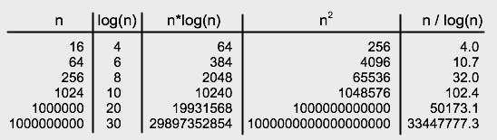

# 알고리즘 분석

이 장에서는 주로 프로그램의 정확성에 중점을 두었다. 실제로는 효율성(efficiency)라는 또 다른 문제도 중요하다. 프로그램을 효율성 측면에서 분석할 때 "프로그램을 실행하는 데 얼마나 걸리나?"와 같은 질문을 살펴보고 싶다. 그리고 "답을 더 빨리 얻을 수 있는 또 다른 접근 방식이 있나?" 효울성은 항상 정확성보다 덜 중요하다. 프로그램이 올바르게 작동하는지 여부에 관심이 없다면 실제로 매우 빠르게 실행되도록 할 수 있지만 누구도 그것이 큰 성과라고 생각하지 않을 것이다. 반면, 만년이 지나도 정답을 내는 프로그램도 그다지 유용하지 않기 때문에 효율성이 중요한 문제인 경우가 많다.

"효율성"이라는 용어는 시간, 컴퓨터 메모리, 디스크 공간 또는 네트워크 대역폭을 포함한 거의 모든 리소스를 효율적으로 사용하는 것을 의미할 수 있다. 그러나 이 섹션에서는 시간 효율성에 대해서만 다룰 것이며 프로그램에 관해 우리가 묻고 싶은 주요 질문은 해당 작업을 수행하는 데 시간이 얼마나 걸리는가이다.

개별 프로그램을 "효율적"이거나 "비효율적"으로 분류하는 것은 실제로 의미가 없다. 동일한 작업을 수행하는 두 개의 프로그램을 비교하고 둘 중 어느 것이 "더 효율적"인지, 즉 어느 것이 작업을 더 빨리 수행하는지 묻는 것이 더 합리적이다. 그러나 여기에도 어려움이 있다. 프로그램 실행 시간은 잘 정의되어 있지 않다. 런타임은 실행되는 컴퓨터의 프로세서 수와 속도에 따라 달라질 수 있으며 Java의 경우 프로그램을 해석하는 데 사용되는 JVM의 설계에 따라 달라질 수 있다. 프로그램을 고급 언어에서 기계어로 번역하는 데 사용되는 컴파일러는 세부 사항에 따라 달라질 수 있다. 뿐만 아니라 프로그램의 실행 시간은 프로그램이 해결해야 하는 문제의 크기에 따라 달라진다. 100개의 항목을 정렬하는 데 걸리는 것보다 10000개의 항목을 정렬하는 데 정렬 프로그램이 더 오래 걸린다. 두 프로그램의 실행 시간을 비교할 때 프로그램 A가 프로그램 B보다 작은 문제를 더 빨리 해결하는 반면 프로그램 B는 프로그램 A보다 큰 문제를 더 빨리 해결하는 경우가 종종 발생한다. 따라서 단순히 모든 경우에서 한 프로그램이 다른 프로그램보다 빠르다는 것은 아니다.

이러한 어려움에도 불구하고 프로그램 효율성을 분석하는 데 전념하는 컴퓨터 과학 분야가 있다. 이 분야는 알고리즘 분석으로 알려져 있다. 다른 언어로 작성되고, 다른 컴파일러로 컴파일되고, 다른 컴퓨터에서 실행되는 동일한 알고리즘의 여러 구현을 처리할 필요가 없도록 프로그램 자체보다는 알고리즘에 중점을 둔다. 알고리즘 분석은 이러한 천박한 세부 사항을 추상화하는 수학적 분야이다. 그럼에도 불구하고 이론적인 분야라도 모든 현업 프로그래머는 일부 기술과 결과를 알고 있어야 한다. 이 섹션에서는 이러한 기술과 결과 중 일부를 매우 간략하게 소개한다. 이 책은 수학책이 아니기에 다소 비공싱적으로 다룬ㄴ다.

알고리즘 분석의 주요 기술 중 하나는 **점근적 분석(Asymptotic Analysis)** 이다. 여기저 "점근적"이라는 용어는 기본적으로 "입력 크기가 증가함에 따라 장지적으로 나타내는 경향"을 의미한다. 알고리즘의 런타임에 대한 점근적 분석에서는 런타임이 문제의 크기에 따라 어떻게 달라지는지에 대한 질문을 살펴본다. 분석은 문제의 크기가 제한 없이 증가함에 따라 런타임에 어떤 일이 발생하는지만 고려하기 때문에 점근적이다. 작은 크기의 문제나 실제로 고정된 유한 크기의 문제에 대해 어떤 일이 발생하는지에는 관심이 없다. 문제의 규모가 한계 없이 증가함에 따라 장기적으로 일어나는 일만이 중요하다.

---

점근적 분석의 핵심은 **Big-Oh 표기법**이다. 예를 들어 이 표기법을 사용하면 알고리즘 수행 시간이 O(n^2), O(n), O(log(n))을 갖는다. 이런 표기법은 Big-Oh n 제곱으로 읽혀진다. 보다 일반적으로 O(f(n))("Big-Oh of f of n")을 참조할 수 있다. 여기서 f(n)은 모든 양의 정수 n에 양의 실수를 할당하는 함수이다. 이 표기법에서 "n"은 문제의 크기를 나타낸다. 점근적 분석을 시작하기 전에 문제 크기를 측정할 수 있는 방법이 필요하다. 일반적으로 이는 큰 문제가 아니다. 예를 들어 문제가 항목 목록을 정렬하는 것이라면 크기는 목록에 있는 항목 수로 간주될 수 있다. 주어진 양의 정수가 소수인지 확인하는 알고리즘의 경우처럼 알고리즘에 대한 입력이 정수인 경우, 문제의 크기를 측정하는 일반적인 방법은 정수 자체가 아닌 입력 정수의 비트 수이다. 보다 일반적으로 문제에 대한 입력의 비트 수는 문제의 크기를 나타내는 좋은 척도가 되는 경우가 많다.

알고리즘의 실행시간이 O(f(n))이라는 것은 문제 크기 n의 큰 값에 대해 알고리즘의 실행 시간이 일부 상수 곱하기 f(n)보다 크지 않다는 것을 의미한다. 상수는 속도와 같은 세부 사항을 고려한다. 알고리즘이 실행되는 컴퓨터, 느린 컴퓨터를 사용하는 경우 공식에서 더 큰 상수를 사용해야 할 수 도 있지만 상수를 변경해도 런타임이 O(f(n))라는 기본 사실은 변경되지 않는다. 또한 상수를 사용하면 시간을 초, 연, CPU 주기 또는 기타 측정 단위로 측정하는지 여부를 말할 필요가 없다. 한 측정 단위에서 다른 측정 단위로의 변경은 단지 상수를 곱하는 것이다.

간단한 예를 보려면 배열의 모든 숫자를 더하는 문제를 생각해 보자. 

```java
total = 0
for (int i = 0; i < n; i++) 
    total = total + A[i]
```

이 알고리즘은 동일한 연산 `total = total + A[i]`를 n번 수행한다. 이 작업에 소요된 시간은 a*n 이다. 여기서 a는 작업을 한 번 수행하는 데 걸리는 시간이다. 이제 이것이 알고리즘에서 수행되는 유일한 작업은 아니다. i의 값은 증가하고 루프를 통해 매번 n과 비교된다. 이는 일부 상수 b에 대해 런타임에 b*n의 추가 시간을 추가한다. 또한 i와 total 둘다 0으로 초기화되어야 한다. 이것은 실행 시간에 일정한 양의 c를 추가한다. 정확한 실행 시간은 (a+b)*n+c가 된다. 여기서 상수 a,b,c 는 코드 컴파일 방법 및 코드가 실행되는 컴퓨터와 같은 요소에 따라 달라진다. 임의의 양의 정수 n에 대해 c가 c*n보다 작거나 같다는 사실을 이용하면 런타임이 (a+b+c)*n 보다 작거나 같다고 말할 수 있다. 즉, 실행 시간은 상수 곱하기 n보다 작거나 같다. 정의에 따르면 이는 이 알고리즘의 실행 시간이 O(n)임을 의미한다. 

이 설명이 너무 수학적이라면 n의 큰 값에 대해 공식 (a+b)*n+c의 c가 다른 항인 (a+b)*n에 비해 중요하지 않다는 점만 참고하면 된다. 우리는 c가 "낮은 차수 항"이라고 말한다. 점근적 분석을 수행할 때 낮은 차수의 항은 폐기될 수 있다. 대략적이지만 정확한 알고리즘의 점근적 분석은 다음과 같다. for 루프의 각 반복에는 일정한 시간이 걸린다. 루프가 n번 반복되므로 총 실행 시간은 상수 곱하기 n에 더 낮은 차수항이다. 낮은 차수의 항을 무시하면 실행 시간이 O(n)임을 알 수 있다.

---

알고리즘의 런타임이 O(f(n))이라고 말하는 것은 해당 알고리즘의 런타임이 f(n)의 상수 배보다 크지 않다는 것을 의미한다. O(f(n))은 실행 시간에 **상한(upper limit)** 을 둔다. 그러나 실행 시간은 더 작을 수도 있고 훨씬 더 작을 수도 있다. 예를 들어 런타임이 O(n)인 경우 런타임이 O(n^2) 또는 O(n^10)이라고 말하는 것도 정확하다. 실행 시간이 n의 상수 배보다 작다면 확실히 동일한 상수 n^2, n^10 보다 작다.

물론 때로는 실행 시간에 대한 **하한(lower limit)** 을 두는 것이 유용할 때도 있다. 즉, 우리는 런타임이 어떤 상수 f(n)보다 크거나 같다고 말할 수 있기를 원한다. 이에 대한 표기법은 Ω(f(n))이다. "n의 오메가" 또는 "n의 빅 오메가"라고 읽는다. "오메가"는 그리스 알파벳 문자의 이름이고 Ω는 해당 문자의 대문자 버전이다. O(f(n))은 알고리즘이 완료될 때까지 기다려야 할 수 있는 최대 시간에 대해 알려준다. Ω(f(n))은 최소 시간에 대해 알려준다.

배열의 숫자를 합산하는 알고리즘의 런타임은 Ω(n)과 O(n)이다. 알고리즘의 실행 시간이 Ω(f(n))과 O(f(n))인 경우 실행 시간은 Θ(f(n))이라고 한다. "n의 세타"라고 읽는다. 

또다른 예를 살펴본다.

```java
/**
 * n개의 배열 요소 A[0], A[1], ..., A[n-1]을 오름차순으로 정렬합니다.
 */
public static void simpleBubbleSort( int[] A, int n ) {
    for (int i = 0; i < n; i++) {
         // Do n passes through the array...
        for (int j = 0; j < n-1; j++) {
            if ( A[j] > A[j+1] ) {
                int temp = A[j];
                A[j] = A[j+1];
                A[j+1] = temp;
            }
        }
    }
}
```

여기서 매개 변수 n은 문제의 크기를 나타낸다. 메서드 외부 for 루프가 n번 실행된다. 외부 for 루프가 실행될 때 마다 내부 for 루프가 n-1번 실행되므로 if문은 n*(n-1)번 실행된다. 이는 n^2-n인데, 점근적 분석에서는 저차항이 유의미하지 않기 때문에 if문이 n^2번 정도 실행되었다고 해도 과언이 아니다. 특히 A[j] > A[j+1] 테스트는 n^2번 정도 실행되는데, 이 사실 자체만으로도 알고리즘의 실행 시간이 Ω(n^2), 즉 실행 시간이 최소한 n^2의 상수배이다. 게다가 다른 연산을 살펴보면 그 중 어느 것도 n^2 이상 실행되지 않으므로 런타임도 O(n^2)이다. 

어떤 사람들은 O(f(n)) 표기법을 마치 Θ(f(n))을 의미하는 것처럼 사용한다는 점에 유의해야 한다. 즉 알고리즘의 실행시간이 O(f(n))이라고 말하는 것은 실행 시간이 f(n)의 상수 배와 거의 같다는 의미이다. 이를 위해서는 Θ(f(n))을 사용해야 한다. 적절하게 말하면 O(f(n))은 실행 시간이 상수 곱하기 f(n)보다 작거나 훨씬 작을 수도 있다를 의미한다.

---

지금까지 분석은 중요한 세부 사항을 무시했다. 문제 크기에 따라 실행시간이 어떻게 달라지는지 살펴보았지만 실제로 실행 시간은 문제의 크기뿐 아니라 처리해야 하는 특정 데이터에 따라 달라지는 경우가 많다. 예를 들어 정렬 알고리즘의 실행 시간은 항목 수뿐 아니라 정렬할 항목의 초기 순서에 따라 달라질 수 있다.

이러한 종속성을 설명하기 위해 알고리즘의 최악 사례 런타임 분석 또는 평균 사례 런타임 분석을 고려할 수 있다. 최악의 런타임 분석을 위해 크기 n의 가능한 모든 문제를 고려하고 이러한 모든 문제에 대해 가능한 가장 긴 런타임을 살펴본다. 평균적인 사례 분석을 위해 크기 n의 가능한 모든 문제를 고려하고 이러한 모든 문제에 대한 평균 실행 시간을 살펴본다. 일반적으로 평균 사례 분석에서는 크기 n의 모든 문제가 발생할 확률이 동일하고 가정하다. 하지만 이것이 항상 현실적인 것은 아니며 주어진 크기에 무한한 수의 다양한 문제가 있는 경우에도 가능하다.

대부분의 경우 평균 및 최악의 경우 실행 시간은 상수 배수 내에서 동일하다. 이는 점근적 분석에 관한 한 둘이 동일하다는 것을 의미하다. 즉, 평균 사례 실행 시간이 O(f(n)) 또는 Θ(f(n))이면 최악의 경우도 마찬가지이다. 그러나 이 책의 뒷부분에서는 평균 및 최악의 경우 점근 분서이 다른 몇가지 사례를 접하게 된다.

주어진 크기의 모든 입력에 대해 가능한 가장 짧은 런타임을 살펴보는 최상의 런타임 분석에 대해 이야기 하는 것도 가능하다. 그러나 최상의 사례 분석은 가끔씩만 유용하다.

---

그렇다면 이 책의 나머지 부분을 읽으려면 알고리즘 분석에 대해 실제로 무엇을 알아야 하는가? 우리는 엄격한 수학적 분석을 수행하지는 않지만 이 섹션에서 살펴본 예와 같은 간단한 사례에 대한 비공식 토론을 따를 수 있어야 한다. 그러나 가장 중요한 것은 일부 일반적인 함수 f(n)에 대해 알고리즘의 실행 시간이 O(f(n)) 또는 Θ(f(n))이라고 말하는 것이 정확히 무엇을 의미하는지 이해해야 한다는 것이다. 중요한 점은 이러한 표기법이 특정 사례에 대한 알고리즘 실행 시간의 실제 수치 값에 대해 아무 것도 알려주지 않는다는 것이다. n의 작은 값에 대한 실행 시간에 대해서는 전혀 알려주지 않았다. 그들이 말하는 것은 문제의 규모가 커짐에 따라 실행시간이 증가하는 속도에 관한 것이다.

동일한 문제를 해결하는 두 가지 알고리즘을 비교한다고 가정해 본다. 한 알고리즘의 실행시간은 Θ(n^2)이고, 두번째 알고리즘은 Θ(n^3)이다. 이것이 무엇을 말하는가? 100과 같은 특정 크기 문제에 대해 어떤 알고리즘이 더 빠른지 알고 싶다면 확실한 것은 없다. 점근적 분석을 통해 알 수 있는 한 두 알고리즘 중 하나는 특정 사례에 대해 더 빠를 수 있다. 하지만 확실히 말할 수 있는 것은 점점 더 큰 문제를 보면 Θ(n^2) 알고리즘이 Θ(n^3) 보다 빠른 지점에 이르게 된다는 것이다. 게다가 문제 크기가 계속 증가함에 따라 Θ(n^2) 알고리즘의 상대적 이점은 계속 증가할 것이다. Θ(n^2) 알고리즘이 1000배, 100만배, 10억배 등의 속도를 갖는 n값이 존재할 것이다. 이것은 임의의 양의 상수 a, b에 대하여 함수 a*n^3이 n이 커질수록 b*n^2 보다 빠르게 증가하기 때문이다.


이는 "큰" 문제의 경우 Θ(n^2) 알고리즘이 Θ(n^3) 알고리즘보다 확실히 더 빠르다는 것을 의미한다. 점근적 분석만으로 "큰"이 얼마나 커야 하는지 정확히 알 수 없다. 실제로눈 n값이 매우 작은 경우에도 Θ(n^2) 알고리즘이 더 빠를 가능성이 높으며, 다른 정보가 없으면 일반적으로 Θ(n^3)보다 Θ(n^2) 알고리즘을 선호한다.

따라서 점근 분석을 이해하고 적용하려면 일부 공통 기능의 증가율에 대한 아이디어를 갖는 것이 필수적이다. 거듭제곱의 경우 지수가 클수록 함수의 증가 속도가 빨라진다. 지수 함수 n이 지수인 경우, 어떤 검정 함수보다 빠른 성장률을 보인다. 실제로, 지수 함수는 너무 빨리 증가하므로 실행 시간이 기하급수적으로 증가하는 알고리즘은 실행 시간이 너무 길기 때문에 상대적으로 적당한 n값에 대해서도 거의 확실히 비실용적이다. 점근 분석에서 자주 나타나는 또 다른 함수는 로그 함수 log(n)이다. 실제로 다양한 로그 함수가 있지만 컴퓨터 과학에서 일반적으로 사용되는 함수의 소위 2진수에 대한 로그이다. 이는 임의의 숫자 x에 대해 `log(2^x) = x`라는 사실로 정의된다. 로그 함수는 매우 느리게 증가한다. log(n)의 증가율을 n의 증가율보다 훨씬 작다. n*log(n)의 성장률은 n의 성장률 보다 약간 크지만 n^2의 성장률보다는 훨씬 작다. 




log(n)이 자주 나타나는 이유는 2로 곱하고 나누는 것과 연관되어 있기 때문이다. 숫자 n으로 시작하여 2로 나눈 다음 다시 2로 나누는 식으로 계속해서 다음 결과를 얻을 때까지 계속한다고 가정한다. 1보다 작거나 같은 숫자. 그러면 나누기 횟수는 log(n)과 같다.

섹션 7.5.1의 이진 검색 알고리즘을 고려해보자. 이 알고리즘은 정렬된 배열에서 항목을 검색한다. 문제 크기 n은 배열의 길이로 간주된다. 이진 검색 알고리즘의 각 단계는 아직 고려 중인 항목 수를 2로 나누고, 고려 중인 항목 수가 1보다 작거나 같으면 알고리즘이 중지된다. 길이가 n인 배열인 단계 수는 최대 log(n)이다. 이는 이진 검색의 최악의 실행 시간이 Θ(log(n))임을 의미한다. 섹션 7.5.1에서 제시된 선형 검색 알고리즘은 실행 시간은 Θ(n)이다. Θ 표기법은 이진 검색이 선형 검색보다 "훨씬 빠르다."는 사실을 표현하고 이해하는 정량적 방법을 제공한다.

이진 검색에서 알고리즘의 각 단계는 문제 크기를 2로 나눈다. 알고리즘의 일부 작업(단일 단계일 필요는 없음)이 문제 크기를 2로 나누는 경우가 종종 있다. 그런 일이 발생할 때마다 로그 함수는 다음을 표시할 가능성이 높다. 알고리즘의 실행 시간을 점근적으로 분석한다.

알고리즘 분석은 크고 매혹적인 분야입니다. 우리는 이 분야의 가장 기본적인 아이디어 중 몇 가지만 사용할 것이다. 그러나 그것조차도 알고리즘 간의 차이점을 이해하는 데 매우 도움이 될 수 있다.

