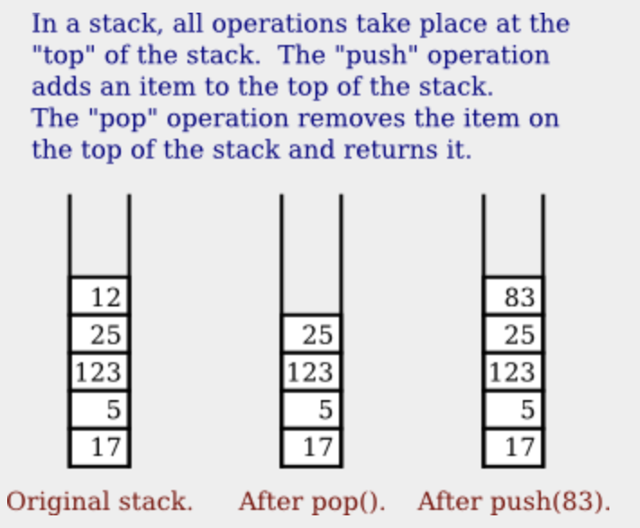
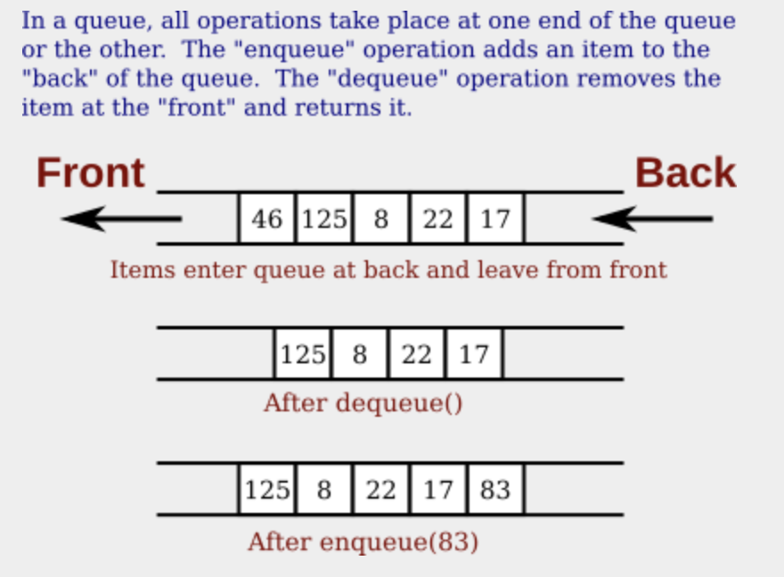
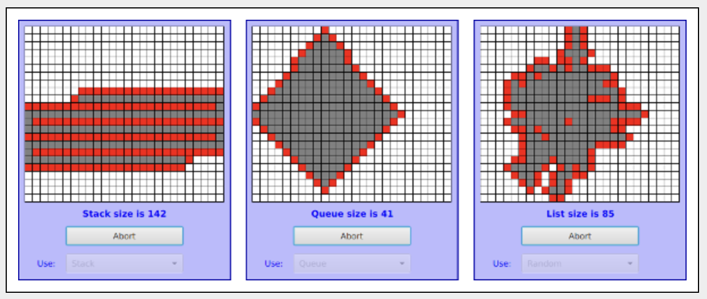

# 스택, 큐 및 ADT

연결된 목록은 포인터로 서로 연결된 객체로 구성된 특정 유형의 데이터 구조이다. 이전 섹션에서 연결된 목록을 사용하여 정렬된 문자열 목록을 저장하여 해당 목록에 대한 삽입, 삭제, 검색 작업을 구현했다. 그러나 연결 목록 대신 배열이나 ArrayList에 쉽게 저장할 수 있었다. 우리는 여전히 목록에 동일한 작업을 구현하라 수 있다. 이러한 작업의 구현은 다르지만 해당 인터페이스와 논리적 동작은 여전히 동일하다.

추상 데이터 유형(ADT, Abstract Data Type) 이라는 용어는 값을 표현하는 방법이나 작업을 구현하는 방법에 대한 지정 없이 가능한 값 집합과 해당 값에 대한 작업 집합을 나타낸다. "순서화된 문자열 목록"은 추상 데이터 유형으로 정의될 수 있다. 임의의 문자열 시퀀스 오름차순으로 정렬된 것은 이 데이터 유형의 가능한 값이다. 데이터 유형에 대한 작업에는 새 문자열 삽입, 문자열 삭제, 목록에서 문자열 검색이 포함된다. 동일한 추상 데이터 유형을 구현하는 방법에는 여러 가지가 있는 경우가 많다. 예를 들어 "순서가 지정된 문자열 목록" ADT는 연결된 목록이나 배열로 구현될 수 있다. ADT는 추상 정의에만 의존하는 프로그램은 두 구현을 서로 바꿔서 사용할 수 있다. 특히, ADT 구현은 프로그램 전체에 영향을 주지 않고 변경될 수 있다. 이렇게 하면 프로그램을 더 쉽게 디버그하고 유지 관리할 수 있으므로 ADT는 소프트웨어 엔지니어링에서 중요한 도구이다. 추상화는 컴퓨터 과학에서 중요한 일반 개념이다. 섹션 3.1.4 및 섹션 4.1에서 절차적 추상화를 다룬다. 여기서는 데이터 추상화를 다룬다.

## 1. 스택

스택은 일련의 항목으로 구성되며, 이는 상자나 카페테리아 트레이의 실제 스택과 같이 하나씩 쌓여 있는 것으로 간주되어야 한다. 언제든지 스택의 최상위 항목에만 엑세스 할 수 있다. `pop` 이라는 작업을 사용하여 스택에서 제거할 수 있다. 스택 아래에 있는 항목은 그 위에 있는 모든 항목이 스택에서 제거된 후에만 제거될 수 있다. `push` 라는 작업을 사용하여 스택 맨 위에 새 항목을 추가할 수 있다. 우리는 어떤 종류의 아이템이라도 쌓아둘 수 있다. 예를 들어 int 유형의 값인 경우 메서드로 구현할 수 있다.

- void push(int newItem)
- int pop()

빈 스택에서 항목을 꺼내려고 시도하는 것은 오류 이므로 스택이 비어 있는지 여부를 알 수 있는 것이 중요하다. 테스트를 수행하려면 인스턴스 메서드로 구현된 또 다른 스택 작업이 필요하다.

- boolean isEmpty()

이는 int 추상 데이터 유형으로 정의한다. 이 ADT는 여러 가지 방법으로 구현될 수 있지만 어떻게 구현되든 해당 동작은 스택의 추상적인 이미지와 일치해야 한다.



스택의 연결 목록 구현에서 스택의 맨 위는 실제로 목록의 머리에 있는 노드이다. 연결된 목록의 앞에 노드를 추가하고 제거하는 것은 쉽다. 목록 중간에 노드를 삽입하고 삭제하는 것보다 훨씬 쉽다. 다음은 "int 스택"을 구현하는 클래스이다.

```java
public class StackOfInts {

    /**
     * Node 유형의 객체는 연결리스트의 항목 중 하나를 보유합니다.
     *는 스택을 나타냅니다.
     */
    private static class Node { 
        int item;
        Node next;
    }
    
    private Node top;  // 맨 위에 있는 노드에 대한 포인터
                        // 스택의. top == null이면
                        // 스택이 비어 있습니다.
    
    /**
     * 스택의 맨 위에 N을 추가합니다.
     */
    public void push( int N ) {
        Node newTop;        
        newTop = new Node();
        newTop.item = N;     
        newTop.next = top;   
        top = newTop;        
    }
    
    /**
     * 스택에서 맨 위 항목을 제거하고 반환합니다.
     * 스택이 비어 있는 경우 IllegalStateException이 발생합니다.
     * 이 메소드가 호출됩니다.
     */
    public int pop() {
        if ( top == null ) 
            throw new IllegalStateException("Can't pop from an empty stack.");
        int topItem = top.item;
        top = top.next;
        return topItem;
    }

    /**
     * 스택이 비어 있으면 true를 반환합니다. 거짓을 반환합니다.
     * 스택에 하나 이상의 항목이 있는 경우.
     */
    public boolean isEmpty() {
        return (top == null);
    }

} 
```

연결 목록에서 `push`, `pop` 작업이 어떻게 작동하는지 이해해야 한다. 그림을 그리는 것이 도움이 될 수 있다. 연결된 목록은 StackOfInts 클래스의 `private` 구현의 일부이다. 이 클래스를 사용하는 프로그램은 연결 목록이 사용되고 있다는 사실조차 알 필요가 없다.

이제는 연결된 목록 대신 배열로 스택을 구현하는 것이 매우 쉽다. 스택의 항목 수는 시간에 따라 달라지므로 배열에서 실제로 사용 중인 공간 수를 추적하려면 카운터가 필요하다. 이 카운터를 `top`이라고 하면 스택의 항목은 배열의 0, 1, ..., top-1 위치에 저장된다. 항목을 스택에 푸는 것은 쉽다. 항목을 `top`에 놓고 `top` 값에 1을 더한다. 스택이 보유할 수 있는 항목수에 제한을 두지 않으려면 섹션 7.2.4의 동적 배열 기술을 사용할 수 있다. 일반적인 어레이 그림에서는 스택의 맨 아래가 어레이의 맨 위에 있는 스택이 "거꾸로" 표시된다. 이것은 중요하지 않다. 배열은 스택의 추상적인 아이디어를 구현한 것일 뿐이며 스택 작업이 예상대로 작동하는 한 괜찮다.

```java
import java.util.Arrays; 

public class StackOfInts {

    private int[] items = new int[10];
    
    private int top = 0;

    /**
     * 스택의 맨 위에 N을 추가합니다.
     */
    public void push( int N ) {
        if (top == items.length) {
           // 배열이 꽉 찼으므로 새롭고 더 큰 배열을 만들고
           // 현재 스택 항목을 여기에 복사합니다. 
            items = Arrays.copyOf( items, 2*items.length );
        }
        items[top] = N;  
        top++;         
    }

    /**
     * 스택에서 맨 위 항목을 제거하고 반환합니다.
     * 스택이 비어 있는 경우 IllegalStateException이 발생합니다.
     * 이 메소드가 호출됩니다.
     */
    public int pop() {
        if ( top == 0 ) 
            throw new IllegalStateException("Can't pop from an empty stack.");
        int topItem = items[top - 1];
        top--;
        return topItem;
    }

    /**
     * 스택이 비어 있으면 true를 반환합니다. 거짓을 반환합니다.
     * 스택에 하나 이상의 항목이 있는 경우.
     */
    public boolean isEmpty() {
        return (top == 0);
    }
}
```

다시 한 번 말하지만, 스택의 구현은 클래스 전용이다. StackOfInts 클래스 두 가지 버전은 공용 인터페이스가 동일하므로 서로 바꿔서 사용할 수 있다. 빈 스택에서 팝을 시도하면 `IllegalStateException`이 발생한다는 사실도 포함된다.

스택 작업의 런타임 분석을 살펴보는 것은 흥미롭다. 스택에 있는 항목 수로 문제의 크기를 측정할 수 있다. 스택의 연결된 목록 구현의 경우 `push`, `pop` 작업 모두에 대한 최악의 런타임은 Θ(1)이다. 이는 스택의 항목 수와 관계없이 런타임이 일부 상수보다 짧다는 것을 의미한다. 이는 코드를 보면 쉽게 알 수 있다. 작업은 몇 가지 간단한 할당문으로 구현되며 스택의 항목 수는 영향을 미치지 않는다.

반면에 배열 구현의 경우 배열이 가득 찼을 때 `push` 작업에서 특별한 경우가 발생한다. 이 경우 새로운 배열이 생성되고 모든 스택 항목이 새 배열에 복사된다. 스택에 있는 항목 수에 비례하는 시간이 걸린다. 따라서 `push` 실행 시간은 일반적으로 Θ(1)이지만 최악의 경우 Θ(n)이다. 

## 큐

큐는 일련의 항목으로 구성되며 목록에 항목을 추가하고 제거하는 방법에 대한 제한이 있다는 점에서 스택과 유사하다. 그러나 큐에는 큐의 앞 쪽과 뒤쪽이라는 두 개의 끝이 있다. 항목은 항상 뒤쪽의 큐에 추가되고 앞쪽의 큐에서 제거된다. 항목을 추가하고 제거하는 작업을 `enqueue`, `dequeue`라고 한다. 큐 뒤에 추가되는 항목은 앞에 있는 모든 항목이 제거될 때까지 큐에 남아 있다. 이것은 친숙하게 들릴 것이다. 큐는 서비스를 기다리는 고객의 "줄", 또는 "큐"와 같다. 고객이 대기열에 도착한 순서대로 서비스를 받는다.



큐에는 모든 유형의 항목이 포함될 수 있다. int 큐의 경우 큐에 넣기 및 빼기 작업은 인스턴스 메서드로 구현될 수 있다.

- void enqueue(int n)
- int dequeue()
- boolean isEmpty()

큐는 연결리스트나 배열로 구현될 수 있다. 효율적인 배열 구현은 스택의 배열 구현보다 까다롭기 때문에 여기서는 설명하지 않는다. 연결된 목록 구현에서 목록의 첫 항목은 큐앞에 있다. 큐 앞 쪽에서 항목을 빼는 것은 스택에서 항목을 꺼내는 것과 같다. 큐의 뒷면은 목록의 끝에 있다. 항목을 큐에 추가하려면 항목이 포함된 새 노드를 가리키도록 현재 목록의 마지막 노드에 포인터를 설정해야 한다. 이를 위해선 `tail.next = newNode;`와 같은 명령이 필요하다. 여기서 `tail`은 목록의 마지막 노드에 대한 포인터이다. `head`면 목록의 첫 노드에 대한 포인터이다. 다음과 같이 하면 목록의 마지막 노드에 대한 포인터를 얻는 것이 항상 가능하다.

```
Node tail;    
tail = head;  
while (tail.next != null) {
    tail = tail.next;  
}
```

그러나 항목이 큐에 포함될 때마다 이 작업을 반복적으로 수행하는 것은 매우 비효율적이다. 효율성을 위해 다른 인스턴스 변수를 사용하여 마지막 노드에 대한 포인터를 저장한다. 이로 인해 클래스가 다소 복잡해진다. 목록 끝에 새 노드가 추가될 때마다 이 변수의 값을 업데이트하도록 주의애햐 한다.

```java
public class QueueOfInts {

    /**
     * Node 유형의 객체는 항목 중 하나를 보유합니다.
     * 큐를 나타내는 연결리스트에 있습니다.
     */
    private static class Node { 
        int item;
        Node next;
    }
    
    private Node head = null;  
    private Node tail = null;

    /**
     * 큐 뒤에 N을 추가합니다.
     */
    public void enqueue( int N ) {
        Node newTail = new Node();
        newTail.item = N;
        if (head == null) {
          // 큐이 비어 있었습니다. 새로운 노드는
          // 목록의 유일한 노드입니다. 둘 다니까
          // 첫 번째와 마지막 노드(머리와 꼬리 모두)
          // 그것을 가리킨다.
            head = newTail;
            tail = newTail;
        } 
        else {
            // 새 노드는 목록의 새 꼬리가 됩니다.
            // (목록의 선두는 영향을 받지 않습니다.)
            tail.next = newTail;
            tail = newTail;
        }
    }

    /**
     * 큐의 맨 앞 항목을 제거하고 반환합니다.
     * 큐이 비어 있으면 IllegalStateException이 발생합니다.
     */
    public int dequeue() {
        if ( head == null) 
            throw new IllegalStateException("Can't dequeue from an empty queue.");
        int firstItem = head.item;
        head = head.next;  // 이전 두 번째 항목이 이제 첫 번째 항목이 됩니다.
                            // 마지막 항목을 방금 제거한 경우
                            // 그러면 머리는 null입니다.
        if (head == null) {
            // 큐가 비어있습니다. 그 노드는
            // 꼬리와 머리가 삭제되었습니다.
            // 목록이므로 이제 꼬리가 없습니다. (실제로는
            // 이 단계가 없어도 수업은 잘 작동할 것입니다.)
            tail = null;
        }
        return firstItem;
    }

    /**
     * 큐가 비어 있으면 true를 반환합니다.
     */
    boolean isEmpty() {
        return (head == null);
    }
}
```

`tail` 포인터를 사용하여 여기에서 수행되는 작업을 따라가는 데 도움이 되도록 클래스를 불변 측면에서 생각하는 것이 도움이 될 수 있다. "큐가 비어있지 않으면 `tail`은 큐의 마지막 노드를 가리킨다." 이 불변성은 각 메서드 호출의 시작과 끝에서 `true`여야 한다. 예를 들어, 이것을 `enqueue()` 메서드에 적용하면, 비어 있지 않은 목록의 경우 불변성을 단순히 `tail.next = newNode`라고 말함으로써 목록의 뒤에 새 노드를 추가할 수 있음을 알려준다. 또한 메서드에서 반환되기 전에 `tail` 값을 어떻게 설정해야 하는지 알려준다. 즉, 방금 큐에 추가된 노드를 가리키도록 설정해야 한다.

큐는 일반적으로 한 번에 하나의 항목만 처리할 수 있지만 여러 항목이 처리를 기다리로 있을 때 컴퓨터에서 사용된다.

- 여러 스레드가 있는 Java 프로그램에서 CPU에서 처리 시간을 원하는 스레드가 큐에 보관된다. 새 스레드가 시작되면 큐 뒤쪽에 추가된다. 스레드가 큐의 앞쪽에서 제거되고 약간의 처리 시간이 주어진 다음 종료가 되지 않은 경우 큐의 뒤쪽으로 보내져 다음 차례를 기다린다.
- 키 입력 및 마우스 클릭과 같은 이벤트는 "이벤트 큐"라는 큐에 저장된다. 프로그램은 이벤트 큐에서 이벤트를 제거하고 처리한다. 하나의 이벤트가 처리되는 동안 여러 이벤트가 더 발생할 수 있지만 이벤트는 큐에 저장되므로 항상 발생한 순서대로 처리된다.
- 웹 서버는 웹 브라우저로부터 "페이지"에 대한 요청을 받는 프로그램이디. 웹 서버가 이전 요청을 처리하는 동안 새 요청이 도착하기 쉽다. 웹 서버가 바쁜 동안 도착하는 요청은 처리를 기다리기 위해 큐에 배치된다. 큐를 사용하면 요청이 수신된 순서대로 처리된다.

큐는 FIFO(선입선출)을 구현한다고 한다. 또는 더 일반적으로 표현되는 것 처럼 선착순이다. 반면 스택은 LIFO(후입선출) 정책을 구현한다. 스택에서 나오는 항목은 마지막으로 들어간 항목이다. 큐와 마찬가지로 스택은 처리를 기다리는 항목을 보관하는 데 사용될 수 있다.

---

스택과 큐 간의 차이점을 더 잘 처리하려면 다음 [DepthBreadth.java](https://math.hws.edu/javanotes/source/chapter9/DepthBreadth.java)를 고려하자. 이 프로그램은 사각형 격자를 보여준다. 처음에는 모든 사각형이 흰색이다. 흰색 사각형을 클릭하면 해당 사각형이 빨간색으로 바뀌면서 "표시"된다. 프로그램은 이미 표시된 사각형에 수평 또는 수직으로 연결된 사각형을 표시하기 시작한다. 이 프로세스는 결국 그리드의 모든 사각형을 처리하게 된다. 프로그램이 어떻게 작동하는지 이해하려면 프로그램의 입장에서 자신을 생각해 보자. 사용자가 사각형을 클릭하면 색인 카드가 전달된다. 사각형의 위치(행과 열)가 카드에 적혀 있다. 카드를 더미에 넣으면 그 카드 한 장만 포함된다. 그런 다음 다음을 반복한다. 더미가 비어 있으면 작업이 완료된 것 이다. 그렇지 않으면 더미에서 색인 카드를 제거한다. 색인 카드는 정사각형을 지정한다. 해당 사각형의 각 수평 및 수직 이웃을 살펴보자. 아직 이웃을 만나지 않았다면 새 색인 카드에 그 위치를 적고 카드 더미에 놓는다. 더미에 처리 대기 중인 색인 카드가 더 이상 없으면 작업이 완료된 것이다.

프로그램에서 사각형이 처리를 기다리는 동안 더미에 있으면 빨간색으로 표시된다. 즉, 빨간색 사각형이 발생했지만 아직 처리되지 않았다. 더미에서 사각형을 가져와 처리하면 색상이 회색으로 변경된다. 사각형이 회색으로 표시되면 프로그램은 해당 사각형을 다시 고려하지 않는다. 왜냐하면 모든 이웃이 이미 계산되었기 때문이다. 결국 모든 사각형이 처리되어 모든 사각형이 회색으로 변하고 절차가 종료된다. 인덱스 카드 비유에서는 카드 더미가 비워졌다.

프로그램은 스택, 큐, 무작위의 세 가지 방법 중 하나를 선택할 수 있다. 각각의 경우에는 동일한 일반 절차가 사용된다. 유일한 차이점은 "인덱스 카드 더미"를 관리하는 방법이다. 스택의 경우 카드 더미의 맨 위에서 카드가 추가되고 제거된다. 큐의 경우 카드 더미의 맨 아래에 카드가 추가되고 맨 위에서 제거된다. 무작위의 경우, 처리할 카드는 더미에 있는 모든 카드 중에서 무작위로 선택된다. 이 세 가지 경우의 처리 순서는 매우 다르다. 다음은 세 가지 다른 처리 방법을 사용하는 프로그램의 세 가지 그림이다. 각각의 경우 그리드 중앙 근처의 사각형을 선택하여 프로세스가 시작되었다. 왼쪽 그림에는 스택이 사용되고, 가운데 그림에는 큐, 오른쪽 그림에는 무작위 선택이 사용됩니다. 



생산되는 패턴은 매우 다르다. 스택을 사용할 때 프로그램은 이전에 발견된 사각형을 보기 위해 역추적을 시작하기 전에 가능한 멀리 탐색핟나. 대기열을 사용하면 사각형은 대략 시작점으로부터 거리 순서대로 처리된다. 무작위 선택을 사용하면 결과는 불규칙한 얼룩이지만 이전에 만난 정사각형 옆에 있는 경우에만 정사각형을 만날 수 있으므로 연결된 얼룩이다.

---

큐는 실생활에서 자주 발생하기 때문에 매우 자연스러워 보이지만, 스택잊 적절하고 필수적인 경우도 있다. 예를 들어, 루틴이 서브루틴을 호출 할 때 어떤 일이 발생하는지 생각해 보자. 첫 번째 루틴은 서브 루틴이 실행되는 동안 일시 중지되고 서브루틴이 반환될 때만 계속된다. 이제 서브 루틴이 두 번째 서브루틴을 호출하고 두 번째 서브루틴이 세 번째 서브루틴을 호출하는 식으로 계속된다고 가정해 본다. 각 서브 루틴은 후속 서브루틴이 실행되는 동안 일시중단된다. 컴퓨터는 일시 중단된 모든 서브 루틴을 추적해야 한다. 이 작업은 스택을 통해 수행된다.

서브 루틴이 호출되면 해당 서브루틴에 대한 활성화 레코드(activation record)가 생성된다. 활서오하 레코드에는 지역 변수, 매개변수, 복귀 주소 등 서브 루틴실행과 관련된 정보가 포함되어 있다. 서브 루틴의 활성화 레코드는 스택에 배치된다. 서브 루틴이 반환되면 스택에서 제거되고 소멸된다. 서브 루틴이 다른 서브 루틴을 호출하면 두 번째 서브루틴의 활성화 레코드가 첫 번째 서브 루틴의 활성화 레코드 위에 스택으로 푸쉬된다. 더 많은 서브 루틴이 호출되면 스택이 계속 커질 수 있으며 해당 서브 루틴이 반환되면 스택은 줄어든다. 

자신을 호출하는 재귀 서브 루틴의 경우 동일한 서브 루틴에 대한 스택에 여러 활성화 레코드가 있을 수 있다. 이는 컴퓨터가 동시에 많은 재귀 호출을 추적하는 방법이다.


## 3. 후위 표현식(Postfix Expressions)

또 다른 예로, 스택을 사용하여 후위 표현식을 평가할 수 있다. 2+(15-12)*17 과 같은 일반적인 수학 표현식을 중위 표현식 이라고 한다. 중위 표현식에서는 "2 + 2 "처럼 연산자가 두 피연산자 사이에 들어온다. 후위 표현식에서 연산자는 "2 2 + "와 같이 두 피연산자 뒤에 온다. 중위 표현 "2+(15-12)*17 "은 후위 형식으로 "2 15 12 - 17 * +" 로 작성된다. 이 표현식의 " - " 연산자는 앞에 있는 두 피연산자, 즉 "15" 및 "12"에 적용된다." 연산자는 앞에 오는 두 피연산자, 즉 "15 12 -" 및 "17"에 적용된다. 그리고 "+" 연산자는 "2" 및 " 15 12 - 17 * "에 적용된다. 이는 동일한 계산이 수행된다.

이제 " 2 15 12 - 17 * + "라는 표현을 왼쪽에서 오른쪽으로 처리하여 해당 값을 찾고 싶다고 가정해 본다. 우리가 만나는 첫 항목은 2이다. 그런데 그걸로 무엇을 할 수 있나?? 이 시점에서 우리는 어떤 연산자가 2에 적용될지 또는 다른 피연산자가 무엇인지 알 수 없다. 나중에 처리하려면 2를 기억해야 한다. 우리는 이를 스택에 밀어넣어 실행한다. 다음 항목으로 이동하면 15가 표시되는데, 이도 스택에 푸쉬된다. 그런 다음 12가 스택에 추가된다. 이제 연산자 "-"가 왔다. 이 연산은 표현식에서 앞에 있는 두 피연산자에 적용된다. 우리는 이 두 피연산자를 스택에 저장했다. 따라서 "-" 연산자를 처리하기 위해 스택에서 두 숫자 12와 15를 팝하고 계산해야 한다. 15-12를 수행하고 3을 얻는다. 이 3은 나중에 처리하는 데 사용되도록 기억해야 하므로 다시 스택에 푸시한다. 표현식의 다음 항목은 17이다. 스택에 푸쉬하여 처리한다. 다음 항목 "*"를 처리하기 위해 스택에서 두 개의 숫자를 팝한다. 숫자는 17과 3이고 곱한 결과인 51이 스택에 푸쉬된다. 다음 항목은 "+"연산자로 스택에서 51과 2를 팝하여 더하고 결과 53을 스택에 푸쉬하여 처리된다. 드디어 표현이 끝이 낫고 스택의 숫자는 전체 표현식의 값이므로 답을 꺼내면된다. 그러면 작업이 완료된다.

중위 표현을 사용하는 것이 더 쉽지만 후위 표현에는 몇 가지 장점이 있다. 우선 후위 표현식에는 괄호나 우선 순위 규칙이 필요하지 않다. 연산자가 적용되는 순서는 전적으로 표현식에서 나타나는 순서에 따라 결정된다. 알고리즘으로 표현하면 간단하다. 
 
```
Start with an empty stack
for each item in the expression:
    if the item is a number:
       Push the number onto the stack
    else if the item is an operator:
       Pop the operands from the stack  /
       Apply the operator to the operands
       Push the result onto the stack
    else
       There is an error in the expression
Pop a number from the stack  // Can generate an error
if the stack is not empty:
   There is an error in the expression
else:
   The last number that was popped is the value of the expression
```

```
빈 스택으로 시작
표현식의 각 항목에 대해 다음을 수행합니다.
    항목이 숫자인 경우:
       숫자를 스택에 푸시
    그렇지 않으면 항목이 연산자인 경우:
       스택에서 피연산자를 팝합니다. // 오류가 발생할 수 있습니다.
       연산자를 피연산자에 적용
       결과를 스택에 푸시
    또 다른
       표현에 오류가 있습니다
스택에서 숫자를 팝합니다. // 오류가 발생할 수 있습니다.
스택이 비어 있지 않은 경우:
   표현에 오류가 있습니다
또 다른:
   마지막으로 팝된 숫자가 표현식의 값입니다.
```

표현식의 오류를 쉽게 감지할 수 있다. 예를 들어 " 2 3 + * " 표현식에는 " * " 연산에 대해 피연산자가 충분하지 않는다. 이는 스택이 비어 있기 때문에 피연산자를 팝하려고 히도할 대 알고리즘에서 감지된다. 

이 알고리즘의 샘플 프로그램은 [PostfixEval.java](https://math.hws.edu/javanotes/source/chapter9/PostfixEval.java)에 설명되어 있다. 

후위 평가 알고리즘을 구현하는 방법이다.

```java
/**
 * 입력 한 줄을 읽고 후위 표현식으로 처리합니다.
 * 입력이 합법적인 후위 표현이 아닌 경우 오류가 발생합니다.
 * 메시지가 표시됩니다. 그렇지 않으면 표현식의 값
 *가 표시됩니다. 첫 번째 문자로 가정됩니다.
 * 입력 라인은 비어 있지 않습니다.
 */
private static void readAndEvaluate() {
    
    StackOfDouble stack;  
    stack = new StackOfDouble();
    System.out.println();
    
    while (TextIO.peek() != '\n') {
        
        if ( Character.isDigit(TextIO.peek()) ) {
            // 입력의 다음 항목은 숫자입니다. 그것을 읽고
            //스택에 저장합니다..
            double num = TextIO.getDouble();
            stack.push(num);
            System.out.println("   Pushed constant " + num);
        }
        else {
            // 다음 항목은 숫자가 아니기 때문에 유일한 것은
            // 법적으로 연산자일 수 있습니다. 연산자 구하세요
            // 그리고 작업을 수행합니다.
            char op;  
            double x,y;    
            double answer; 
            op = TextIO.getChar();
            if (op != '+' && op != '-' && op != '*' && op != '/' && op != '^') {
                System.out.println("\nIllegal operator found in input: " + op);
                return;
            }
            if (stack.isEmpty()) {
                System.out.println("   Stack is empty while trying to evaluate " + op);
                System.out.println("\nNot enough numbers in expression!");
                return;
            }
            y = stack.pop();
            if (stack.isEmpty()) {
                System.out.println("   Stack is empty while trying to evaluate " + op);
                System.out.println("\nNot enough numbers in expression!");
                return;
            }
            x = stack.pop();
            switch (op) {
                case '+' -> answer = x + y; 
	            case '-' -> answer = x - y;
	            case '*' -> answer = x * y;  
	            case '/' -> answer = x / y;  
	            default  -> answer = Math.pow(x,y);
            }
            stack.push(answer);
            System.out.println("   Evaluated " + op + " and pushed " + answer);
        }
        
        TextIO.skipBlanks();
    
    }


    // 이 지점에 도달하면 입력을 성공적으로 읽은 것입니다.
    // 표현식이 적법하다면 표현식의 값은 다음과 같습니다.
    // 스택에 있고 스택에 있는 유일한 것입니다
    if (stack.isEmpty()) {
        System.out.println("No expression provided.");
        return;
    }
    
    double value = stack.pop();  
    System.out.println("   Popped " + value + " at end of expression.");
    
    if (stack.isEmpty() == false) {
        System.out.println("   Stack is not empty.");
        System.out.println("\nNot enough operators for all the numbers!");
        return;
    }
    
    System.out.println("\nValue = " + value);
}
```

후위 표현은 종종 컴퓨터 내부적으로 사용된다. 실제로 Java 가상 머신은 우리가 논의한 표현식 평가에 스택 기반 접근 방식을 사용하는 "스택 머신"이다. 알고리즘은 상수뿐만 아니라 변수를 처리하도록 쉽게 확장될 수 있다. 표현식에서 변수가 발견되면 변수 값이 스택에 푸시된다. 또한 피연산자가 2개보다 많거나 적은 연산자에도 작동한다. 필요한 만큼의 피연산자가 스택에서 팝되고 결과가 스택으로 다시 푸시된다. 예를 들어 " -x " 표현식에 사용되는 단항 빼기 연산자 에는 피연산자가 하나만 있다. 다음 두 섹션에서 표현식과 표현식 평가를 계속해서 살펴본다.

