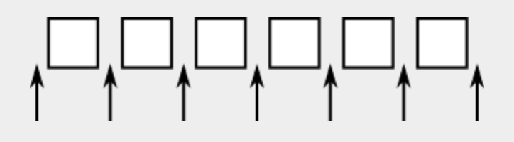

# 리스트(Lists)와 집합(Sets)

이전 섹션에서는 Java의 컬렉션 클래스의 일반적인 속성을 살펴보았다. 이 섹션에서는 몇 가지 컬렉션 클래스와 이를 사용하는 방법을 살펴본다. 이러한 클래스는 목록과 집합이라는 두 가지 주요 범주로 나눌 수 있다. 목록은 선형 순서로 배열된 일련의 항목으로 구성된다. 목록에는 명확한 순서가 있지만 반드시 정렬되지는 않다. 집합은 중복된 항목이 없는 컬렉션이다. 집합의 요소는 일정한 순서로 배열될 수도 있고 배열되지 않을 수도 있다. 또한 "우선 순위 큐"로 알려진 컬렉션의 세 번째 범주에 대해서도 간략하게 설명한다.

## 1. ArrayList와 LinkedList

목록을 표현하는 두 가지 확실한 방법은 동적 배열과 연결 목록이다. 우리는 이미 섹션 7.3과 섹션 9.2에서 이러한 내용을 접했다. 이러한 옵션은 모두 `java.util.ArrayList` 및 `java.util.LinkedList` 컬렉션 클래스와 같은 일반 형식으로 사용 가능하다. 이러한 클래스는 Java 컬렉션 프레임워크의 일부이다. 각각은 List<T> 인터페이스를 구현하므로 Collection<T> 인터페이스도 구현된다. ArrayList<T> 유형의 객체는 T 유형 객체의 정렬된 시퀀스를 나타내며, 새 항목이 추가될 때 필요할 때마다 크기가 커지는 배열에 저장된다. LinkedList<T> 유형의 객체 또한 T 유형 객체의 순서가 지정된 시퀀스를 나타내지 만 객체는 포인터와 함께 연결된 노드에 저장된다.

두 목록 클래스 모두 List<T> 인터페이스에 정의된 기본 목록 작업을 지원하며 추상 데이터 유형은 표현이 아닌 작업에 의해 정의된다. 그렇다면 왜 두 개의 클래스가 있나? 단일 표현을 가진 단일 List 클래스가 아닌 이유는 무엇인가? 문제는 모든 목록 작업이 효율적인 단일 목록 표현이 없다는 것이다. 일부 작업의 경우 연결 목록이 배열보다 더 효율적이다. 다른 경우에는 배열이 더 효울적이다. 목록의 특정 응용 프로그램에서는 몇 가지 작업만 자주 사용되는 경우가 많다. 자주 사용도는 작업이 최대한 효율적인 표현을 선택하려고 한다.

대체로 말하면 LinkedList 클래스는 목록의 시작 부분이나 목록 중간에 항목이 자주 추가되거나 제거되는 응용 프로그램에서 더 효율적이다. 배열에서 이러한 작업을 수행하려면 새 항목을 위한 공간을 만들거나 항목 제거로 인해 남겨진 구멍을 채우기 위해 많은 수의 항목을 배열의 한 위치 위나 아래로 이동해야 한다. 섹션 8.5의 점근적 분석의 관점에서 배열의 시작이나 중간에 요소를 추가하면 실행 시간이 Θ(n)이 된다. 여기서 n은 배열의 항목 수이다. 연결된 목록에서는 몇 가지 포인터 값을 변경하여 어떤 위치에서든 노드를 추가하거나 제거할 수 있다. 이 작업에는 런타임 Θ(1)이 포함된다. 즉, 목록에 있는 항목 수에 관계없이 작업에 일정한 시간만 소요된다.

반면에 항목에 대한 무작위 엑세스가 필요한 경우 ArrayList 클래스가 더 효율적이다. 무작위 엑세스는 임의의 정수 k에 대한 목록의 k번째 항목에 엑세스하는 것을 의미한다. 목록의 특정 위치에 저장된 값을 가져오거나 변경할 때 랜덤 엑세스가 사용된다. 런타임이 Θ(1)인 배열에서는 이는 사소한 일이다. 그러나 연결된 목록의 경우 이는 목록의 시작 부분에서 시작하여 k단계 동안 목록을 따라 노드에서 노드로 이동하는 것을 의미하며, 이 작업의 실행 시간은 Θ(k)이다.

두 가지 유형의 목록 모두에 대해 효율적으로 수행할 수 있는 작업에는 목록 끝에 항목을 정렬하고 추가하는 작업이 포함된다.

섹션 10.1.4에서 논의된 Collection<T> 인터페이스의 메서드를 구현한다. 이러한 메서드에는 `size()`, `isEmpty()`, `add(T)`, `remove(Object)` 및 `clear()`가 포함된다. `add(T)` 메서드는 목록의 끝에 객체를 추가한다. `remove(Object)` 메서드는 선형 검색을 사용하는 객체를 먼저 찾는 작업을 포함하여 객체를 찾을 때까지 목록의 항목을 처음부터 끝까지 검색해야 하기 때문에 모든 목록에 대해 그리 효율적이지 않다. 인터페이스 List<T> 목록의 숫자 위치에 따라 목록 항목에 엑세스하기 위한 몇 가지 메서드를 추가한다. `list`가 List<T> 유형의 객체라고 가정한다. 

- `list.get(index)` : 목록에서 `index` 위치에 있는 T 유형의 객체를 반환한다.
- `list.set(index, obj)` : `index`에 객체 `obj`를 저장하여 이전에 있던 객체를 대체한다.
- `list.add(index, obj)` : `index`에 객체 `obj`를 삽입한다. 여기서 `obj`는 T 유형이어야 한다.
- `list.remove(index)` : `index`에서 객체를 제거하고 해당 객체를 메서드의 반환 값으로 반환한다.
- `list.indexOf(obj)` : 목록에서 `obj`의 위치를 제공하는 int를 반환한다.

이러한 메서드는 Arrayist<T> 클래스와 LinkedList<T> 클래스 모두에 정의되어 있지만 `get`, `set`과 같은 일부 메서드는 ArrayList에만 효율적이다. 

- `linkedlist.getFirst()` : 목록의 첫 번째 항목인 T 유횽의 객체를 반환한다.
- `linkedlist.getLast()` : 목록의 마지막 항목인 T 유형의 객체를 반환한다.
- `linkedlist.removeFirst()` : 목록에서 첫 항목을 제거하고 T 유형의 해당 객체를 반환 값으로 반환한다.
- `linkedlist.remove()`, `linkedlist.pop()` : `removeFirst()`와 동일한 의미이다.
- `linkedlist.addFirts(obj)` : T 유형이어야 하는 `obj`를 목록의 시작 부분에 추가한다. `linkedlist.push(obj)` 같은 의미를 갖는다.
- `linkedlist.addLast(obj)` : T 유형이어야 하는 객체 `obj`를 목록 끝에 추가한다. `linkedlist.add(obj)`와 동일하지만 이름 지정을 일관되게 유지하도록 정의힌다.

여기에는 LinkedList를 마치 스택이나 대기열인 것처럼 쉽게 사용할 수 있도록 하는 약간의 중복성이 있다. 예를 들어 `push()`, `pop()`이라는 메서드를 사용하여 LinkedList를 스택으로 사용하거나, 대기열에 넣기 및 대기열에서 빼기 작업을 구현하기 위해 `add()` 및 `remove()`를 사용하여 대기열로 사용할 수 있다.

목록이 List<T> 유형인 객체인 경우 Collection<T> 인터페이스에 정의된 `list.iterator()` 메서드는 목록의 첨부터 끝까지 순회하는 데 사용할 수 있는 Iterator 반환한다. 그러나 Lists의 경우 추가 기능을 제공하는 ListIterator라는 특별한 유형의 Iterator가 있다. Iterator 인터페이스를 확장한 클래스이다. `list.listIterator()` 메서드는 ListIterator<T> 유형의 객체를 반환한다.

ListIterator에는 일반적인 Iterator 메서드인 `hasNext()`, `next()` 및 `remove()`가 있지ㅏㄴ 이동을 가능하게 하는 `hasPrevious()`, `previous()`, `add(obj)`, `set(obj)` 메서드도 있다. 목록에서 뒤로, 반복자의 현재 위치에 항목을 추가하는 목록의 항목 중 하나를 대체한다. 이러한 작동 방식을 이해하려면 반복자를 사이의 위치를 가리키는 것으로 생각하는 것이 가장 좋다. 두 개의 목록 요소 또는 목록의 시작이나 끝 부분에 있다. 이 다이어 그램에서 목록의 항목은 사각형으로 표시되고 화살표는 반복자의 가능한 위치를 나타낸다.



`iter`가 ListIterator<T> 유형인 경우 `iter.next()`는 반복기를 목록을 따라 한 칸 오른쪽으로 이동하고 반복기가 이동할 때 전달하는 항목을 반환한다. `iter.previous()` 메서드는 반복자를 목록을 따라 왼쪽으로 한 칸 이동하고 전달된 항목을 반환한다. `iter.remove()` 메서드는 목록에서 항목을 제거한다. 제거되는 항목은 반복자가 `iter.next()` 또는 `iter.previous()` 호출에는 가장 최근에 전달한 항목이다. `iter.set(obj)` 메서드도 비슷하게 작동한다. `iter.remove()`에 의해 제거될 항목을 대체한다. `iter.add(obj)` 방법도 있다. 반복자의 현재 위치에 있는 목록에 지정된 객체를 추가한다. 이는 두 개의 기존 항목 사이에 있을 수도 있고 목록의 시작 부분이나 목록의 끝에 있을 수 도 있다.

(그런데 LinkedList<T> 클래스에서 사용되는 목록은 이중 연결 목록이다(doubly linked lists). 즉, 목록의 각 노드에는 두 개의 포인터가 포함되어 있다. 하나는 목록의 다음 노드에 대한 포인터이고 다른 하나는 이전 노드에 대한 포인터이다. ListIterator의 `next()` 및 `previous()` 메서드를 모두 효율적으로 구현할 수 있다. 또한 LinkedList의 `addLast()` 및 `getLast()` 메서드를 효율적으로 만들기 위해 LinkedList<T> 클래스에는 "꼬리 포인터"가 포함되어 있다. 목록의 마지막 노드를 가리킨다.)

ListIterator를 사용하는 예로, 항상 오름차순으로 정렬되는 항목 목록을 유지한다고 가정해 본다. 목록에 항목을 추가할 때 ListIterator를 사용하여 목록에서 항목을 추가해야 하는 위치를 찾을 수 있다. 위치를 찾으면 동일한 목록 반복자를 사용하여 해당 위치에 항목을 배치한다. 아이디어는 목록의 시작 부분에서 시작하여 삽입되는 항목보다 작은 모든 항목을 지나서 반복기를 앞으로 이동하는 것이다. 이 시점에서 반복자의 `add()` 메서드를 사용하여 항목을 삽입할 수 있다. 더 명확하게 하기 위해 `stringList`가 List<String> 유형의 변수라고 가정한다. 이미 목록에 있는 문자열이 오름차순으로 저장되어 있고 `newItem`이 목록에 삽입하려는 문자열이라고 가정하낟. 다음 코드는 목록의 `newItem`을 올바른 위치에 배치하여 수정된 목록이 여전히 오름차순으로 유지되도록 한다.

```java
ListIterator<String> iter = stringList.listIterator();

// 반복자가 다음 위치를 가리키도록 반복자를 이동합니다.
// newItem이 목록에 삽입되어야 합니다. newItem이 다음과 같은 경우
// 목록의 모든 항목보다 큰 경우 while 루프
// iter.hasNext()가 false가 되면 종료됩니다.
// 반복자가 목록의 끝에 도달했습니다.

while (iter.hasNext()) {
    String item = iter.next();
    if (newItem.compareTo(item) <= 0) {
        // newItem은 목록의 항목 앞에 와야 합니다.
        // 반복자를 한 칸 뒤로 이동하여
        // 올바른 삽입 지점을 가리킵니다.
        // 그리고 루프를 종료합니다.
        iter.previous();
        break;
    }
}

iter.add(newItem);
```

여기서 `stringList`는 ArrayList<String> 유형이거나 LinkedList<String> 유형일 수 있다. `newItem`을 목록에 삽입하는 데 사용되는 알고리즘 두 유형의 목록 모두에 대해 거의 동일하게 효율적이며 List<String> 인터페이스를 구현하는 다른 클래스에서도 작동한다. `get(index)` 및 `add(index, obj)` 메서드를 사용하여 배열과 유사한 인덱싱을 사용하는 삽입 알고지름을 설계하는 것이 더 쉽다는 것을 알게 될 것이다. 그러나 해당 알고리즘은 LinkedLists에는 매우 비효율적이다. 연결된 목록의 경우 무작위 엑세스가 매우 비효율적이기 때문이다.

## 2. 정렬

목록 정렬은 매우 일반적인 작업이며 실제로 List 인터페이스에는 정렬 방법이 있어야 한다. 아마도 특정 유형의 객체 목록을 정렬하는 것이 의미가 있기 때문에 그렇지 않다. 그러나 목록 정렬 메서드는 `java.util.Collections` 클래스의 `static` 메서드로 사용 가능하다. 이 클래스에는 컬렉션 작업을 위한 다양한 정적 유틸리티 메서드가 포함되어 있다. 메서드는 제네릭이다. 즉, 다양한 유형의 객체 컬렉션에 대해 작동한다. 이 목록이 List<T> 유형이라고 가정하낟.

```java
Collections.sort(list);
```

목록은 오름차순으로 정렬하는 데 사용할 수 있다. 목록의 항목은 Comparable<T> 인터페이스를 구현해야 한다. 예를 들어 `Collections.sort()` 메서드는 String 목록과 Integer 및 Double과 같은 래퍼 클래스 목록에 대해 작동한다. Comparator를 두 번째 인수로 사용하는 정렬 방법도 있다.

```java
Collections.sort(list, comparator);
```

이 방법에서는 `comparator`를 사용하여 목록의 항목을 비교한다. 이전 섹션에서 언급했듯이 Comparator는 두 객체를 비교하는 데 사용할 수 있는 `compare()` 메서드를 정의하는 객체이다. 섹션 10.4에서 예시를 살펴보았다. 

`Collections.sort()`에서 사용되는 정렬 방법은 소위 "병합 정렬" 알고리즘으로, 목록에 대해 최악의 경우와 평균 겨우의 실행 시간이 모두 Θ(n*log(n))이다. 병합 정렬의 평균 실행 시간은 퀵정렬보다 약간 느리지만 최악의 경우 성능은 퀵정렬보다 훨씬 좋다. 병합 정렬은 10.4.3 끝에서 만날 "안전성"이라는 속성이 있다.

Collections 클래스에는 목록을 수정하는 데 유용한 두 가지 이상의 다른 메서드가 있다. `Collections.shuffle(list)`은 목록의 요소를 무작위 순서로 재정렬한다. `Collections.reverse(list)`는 요소의 순서를 반대로 바꾸어 마지막 요소가 목록의 시작 부분으로 이동하고 마지막에서 다음 요소가 두 번째 위치로 이동하는 식으로 진행된다.

Lists에는 효율적인 정렬 방법이 제공되므로 직접 작성할 필요가 없다.

## 3. TreeSet과 HashSet

집합은 객체가 두 번 이상 나타나지 않은 객체의 모음이다. 집합은 Collection<T> 인터페이스의 모든 메서드를 구현하지만 집합은 요소가 두 번 발생하지 않도록 보장하는 방식으로 구현한다. 예를 들어 `set`이 Set<T> 유형의 객체인 경우, `obj`가 이미 집합의 요소라면 `set.add(obj)`는 집합에 아무런 영향을 미치지 않는다. Java에는 Set<T> 인터페이스를 구현하는 두 개의 클래스 TreeSet, HashSet이 있다.

Set이 되는 것 외에도 TreeSet에는 집합의 요소가 오름차순으로 정렬되는 속성이 있다. 즉, TreeSet의 Iterator는 항상 오름차순으로 집합의 요소를 방문한다.ㄷ

TreeSet에는 포함된 객체의 정렬 순서를 결정하는 방법이 있어야 하므로 임의의 객체를 보유할 수 없다. 일반적으로 이는 TreeSet<T> 유형 집합의 객체가 Comparable<T> 인터페이스를 구현해야 하며 `obj1.compareTo(obj2)`가 집합의 두 객체 `obj1`, `obj2`에 대해 합리적인 방식으로 정의되어야 함을 의미한다. 또는 TreeSet이 생성될 때 Comparable<T> 유형의 객체를 생성자에 대한 매개 변수로 제공할 수 있다. 이 경우 Comparator의 `compare()` 메서드는 다음과 같다. 집합에 추가된 객체를 비교하는 데 사용된다.

TreeSet은 두 객체가 동일한지 테스트하기 위해 `equals()` 메서드를 사용하지 않는다. 대신, `compareTo()` 또는 `compare()` 메서드를 사용한다. 이것은 문제가 될 수 있다. Comparator의 `compare()` 메서드는 객체가 동일하지 않더라고 비교 목적으로 두 객체를 동일한 것으로 간주할 수 있다는 10.1.6을 기억하자. (이것은 가능성이 적지만 적절하게 정의된 `compareTo()` 메서드의 경우 여전히 가능하다.) Comparator를 사용하는 TreeSet의 경우 이는 해당 객체 중 하나만 집합에 포함될 수 있음을 의미한다. 예를 들어, TreeSet에는 우편 주소가 포함되어 있으며 주소에 대한 `compare()` 메서드가 우편 번호만 비교하는 경우 집합에는 각 우편 번호에 하나의 주소만 포함될 수 있다. 분명히 이것은 옳지 않다. 하지만 이는 TreeSets의 의미를 알아야 하고, TreeSet에 넣는 객체에 대해 `compare()` 또는 `compareTo()`가 합리적인 방식으로 정의되어 있는지 확인해야 함을 의미할 뿐이다. 그런데 이는 Strings, Integers, 및 기타 여러 내장 유형의 경우에도 해당된다. 이러한 유형에 대한 `compareTo()` 메서드는 두 객체가 실제로 동일한 경우에만 돌일한 것으로 간주하기 때문이다.

TreeSet 구현에서 요소는 이진 정렬 트리와 유사한 곳에 저장된다. 그러나 사용되는 데이터 구조는 트리에 있는 모든 노드의 왼쪽 및 오른쪽 하위 트리가 거의 동일한 크기라는 점에서 균형을 이룬다. 이렇게 하면 삽입, 삭제 및 검색과 같은 모든 기본 작업이 최악의 런타임 시간 Θ(log(n))에서 효율적으로 수행된다. 여기서 n은 집합의 항목 수이다.

TreeSet이 해당 요소를 정렬하고 중복 항목을 제거한다는 사실을 일부 응용 프로그램에서 매우 융요하다. 연습문제 7.6에서 파일을 읽고 파일에서 발생하는 모든 단어의 알파벳 목록을 중복된 단어가 제거된 상태로 출력하는 프로그램을 작성하도록 요청했다. 단어는 ArrayList에 저장되므로 목록이 정렬되어 있고 중복한 항목이 없는지 확인하는 것은 사용자의 몫이다. 목록 대신 TreeSet을 사용하면 동일한 작업을 훨씬 더 쉽게 프로그래밍 할 수 있다. TreeSet은 중복 항목을 자동으로 제거하고 해당 세트의 반복자는 자동으로 정렬된 순서로 집합의 항목을 방문한다. 

```
TreeSet<String> words = new TreeSet<String>();

while there is more data in the input file:
   Let word = the next word from the file
   Convert word to lower case
   words.add(word)   // Adds the word only if not already present.

for ( String w : words ) // for each String w in words
   Output w  // words are output in sorted order
```

완벽하게 작동하는 프로그램을 보려면 [WordListWithTreeSet.java](https://math.hws.edu/javanotes/source/chapter10/WordListWithTreeSet.java)에서 찾을 수 있다. 

또 다른 예로, `coll`이 문자열 컬렉션이라고 가정해 본다. TreeSet을 사용하여 다음과 같이 간단히 하면 `coll` 항목을 정렬하고 중복 항목을 제거할 수 있다.

```java
TreeSet<String> set = new TreeSet<String>();
set.addAll(coll);
```

두 번째 문은 컬렉션의 모든 요소를 집합에 추가한다. Set이므로 중복은 무시된다. TreeSet이므로 세트의 요소가 정렬된다. 다른 유형의 데이터 구조로 데이터를 갖고 싶다면 세트에서 쉽게 복사할 수 있다.

```java
TreeSet<String> set = new TreeSet<String>();
set.addAll(col);
ArrayList<String> list = new ArrayList<String>();
list.addAll(set);
```

실제로 Java의 모든 컬렉션 클래스에는 컬렉션을 인수로 사용하는 생성자가 있다. 해당 컬렉션의 모든 항목은 새 컬렉션이 생성될 때 추가된다. 따라서 `coll`이 Collection<String> 유형인 경우 `new TreeSet<String>(coll);`은 `coll`과 동일한 요소를 포함 하지만 중복 항목이 제거되고 정렬된 순서로 TreeSet을 생성한다. 이는 위 예의 네줄을 단일 명령으로 축약할 수 있음을 의미한다.

```java
ArrayList<String> list = new ArrayList<>(new TreeSet<>(coll));
```

이것은 중복되지 않은 `coll` 요소의 정렬된 목록을 만든다. 이것이 제네릭 프로그래밍의 힘을 보여준 좋은 예이다.

---

HashSet은 다음 섹션에서 설명할 데이터 구조 유형인 해시 테이블에 해당 요소를 저장한다. 요소 찾기, 추가, 및 제거 작업은 해시 테이블에서 매우 효율적으로 구현되며 TreeSeet 보다 훨씬 더 효울적이다. HashSet은 요소는 특정 순서로 저장되지 않으므로 Comparable 인터페이스를 구현할 필요는 없다.

`equals()` 메서드는 HashSet의 두 객체가 동일한 것으로 간주되는지 여부를 결정하는 데 사용된다. HashSet의 Iterator는 완전히 임의적인 순서로 해당 요소를 방문하여 새 요소가 추가될 때 순서가 변경되는 것도 가능하다. 포함된 요소가 비교할 수 없거나 순서가 중요하지 않거나 효율성의 작은 이점이 중요한 경우 TreeSet 대신 HashSet을 사용한다.

---

**집합 수학에 대한 참고 사항**

수학적 집합 이론에서는 집합의 항목을 해당 집합의 **구성원(members)** 또는 **요소(elements)** 라고 한다. 중요한 작업에는 집합에 요소 추가, 집합에서 요소 제거, 지정된 엔티티가 집합의 요소인지 테스트 등이 포함된다. 두 세트에 대한 수행할 수 있는 연산에는 합집합, 교집합, 차집합이 있다. 이러한 모든 작업은 Set 유형의 객체에 대해 Java로 정의되지만 이름은 다르다. A와 B가 Set이라고 가정하낟.

- `A.add(x)` : 요소 x를 집합 A에 추가한다.
- `A.remove(x)` : 집합 A에서 요소 x를 제거한다.
- `A.contains(x)` : x가 집합 A의 요소인지 여부를 테스트한다.
- `A.addAll(B)` : A와 B의 합집합을 계산한다.
- `A.retainAll(B)` : A와 B의 교집합을 계산한다.
- `A.removeAll(B)` : 집합 차이 A - B를 계산한다. 

물론 수학적 집합과 Java의 집합 사이에는 차이점이 있다. 아마도 가장 중요한 것은 Java의 집합은 유한해야 하는 반면, 수학에서 집합 이론의 대부분의 재미는 무한대로 다루는 것에서 비롯된다. 수학세어 세트는 임의의 요소를 포함할 수 있는 반면, Java에서는 Set<T> 유형의 집합 T유형의 요소만 포함할 수 있다. `A.addAll(B)` 작업은 A값을 수정하여 작동하는 반면, 수학에서 A 교집합 B는 A 또는 B값을 변경하지 않고 새 집합을 계산한다. 

## 4. 우선순위 큐

우선 순위 큐는 항목 모음을 나타내는 추상 데이터 유형으로, 각 항목에는 두 항목을 비교할 수 있는 할당된 "우선순위"가 있다. 우선순위 큐에 대한 작업에는 컬렉션에 항목을 추가하는 `add`와 현재 컬렉션에 있는 항목 중 최소 우선순위를 가진 항목을 컬렉션에서 제거하고 반환하는 `remove`가 포함된다.

우선 순위 큐의 간단한 구현은 연결된 목록을 사용하여 우선순위가 높아지는 순서대로 큐에 항목을 저장함으로써 달성될 수 있다. 이 경우 `remove`는 단순히 첫 번째 항목을 제거하고 반환한다. 그러나 `add`는 새 항목을 목록의 올바른 위치에 삽입해야 한다. 이는 평균 실행 시간이 Θ(n)인 작업이다. 여기서 n은 목록의 항목 수이다. 실제로, `add` 및 `remove` 모두 런타임 시간 Θ(log(n))을 갖도록 우선순위 큐를 구현할 수 있으며 이는 훨씬 더 효율적이다. (효울적인 구현에서는 "힙" 이라는 것을 사용하는데, 이는 객체가 생성되는 힙과 혼동하지 않는다. 여기선 구현에 대해 논의하지 않는다.)

매개변수화된 클래스 PriorityQueue<T>는 T 유형 객체의 우선순위 큐를 구현한다. 이 클래스는 Collection<T> 인터페이스를 구현한다. 따라서 `pq`는 PriorityQueue이면 해당 인터페이스에 정의된 모든 메서드가 있다. 그러나 필수적인 우선순위 큐 작업은 다음과 같다.

- `pq.add(obj)` : `obj`를 우선순위 큐에 추가한다.
- `pq.remove()` : 최소 우선순위 항목을 제거하고 반환한다.
- `pq.isEmpty()` : 우선순위 큐가 비어 있는지 테스트한다.

우선순위 대기열에 있는 항목의 우선순위가 어떻게 결정되는지 아직 언급하지 않는다는 것을 눈치챘을 것이다. 상황은 정렬과 매우 유사하다. 대기열에 있는 두 항목을 비교할 수 있어야 한다. 정렬과 마찬가지로 두 가지 솔루션이 있다. 항목이 Comparable 인터페이스를 구현하는 경우 해당 인터페이스의 `compareTo()` 메서드를 사용하여 항목을 비교할 수 있다. 또는 Comparator 객체를 PriorityQueue 생성자에 대한 매개 변수로 제공할 수 있다. 이 경우 Comparator의 `compare()` 메서드를 사용하여 항목을 비교한다.

Comparable을 구현하는 String, Integer, Date 등의 클래스를 우선순위 큐에서 사용할 수 있다. 예를 들어 PriorityQueue<String>을 사용하면 문자열을 사전순으로 정렬할 수 있다. 모든 문자열을 우선순위 대기열에 추가한 다음 하나씩 제거하면 된다. 항목은 우선순위에 따라 대기열에서 제거 되므로 사전순으로 제거된다. 이전에는 TreeSet을 사용하여 컬렉션에서 중복 항목을 정렬하고 제거하는 방법을 보여준다. PriorityQueue는 중복 항목을 제거하지 않고 컬렉션을 정렬하는 비슷한 방식으로 사용될 수 있다. 예를 들어 Collection<String> 유형의 경우 다음 코드 세그먼트는 중복 항목을 포함하여 `coll`의 모든 항목을 순서대로 인쇄한다.

```java
PriorityQueue<String> pq = new PriorityQueue<>();
pq.addAll( coll );
while ( ! pq.isEmpty() ) {
    System.out.println( pq.remove() );
}
```

그런데 이 예제에서는 iterator나 for-each 루프를 사용하여 인쇄할 수 없다는 점에 유의하자. iterator와 for-each 루프는 우선순위 큐를 오름차순으로 순회하지 않기 때문이다.

우선순위 큐는 정렬에 사용될 수 있지만 다른 자연스러운 용도도 있다. 예를 들어 "작업"이 컴퓨터에서 실행되도록 예약하는 문제를 생각해 보자. 각 작업에는 우선 순위가 할당되고 우선 순위가 낮은 작업은 항상 우선 순위가 높은 작업보다 먼저 실행되어야 한다. 작업이 생성되면 우선순위 대기열에 배치될 수 있다. 컴퓨터가 실행을 위해 대기열에서 작업을 제거하면 우선 순위가 높아지는 순서대로 제거된다.


