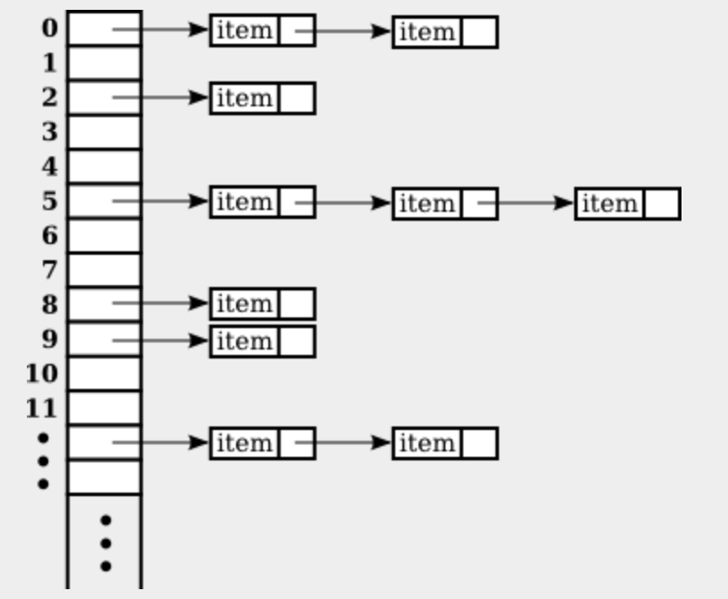

# Map

N 요소로 구성된 N 배열을 일부 항목을 각 정수, 0, 1, ..., N-1과 연관시키는 방법으로 생각할 수 있다. i가 이러한 정수 중 하나 이면 i와 연관된 항목을 가져오는 것이 가능하고 i번째 위치에 새 항목을 넣을 수 있다. 이러한 `get`, `put` 작업은 배열이라는 것이 무엇을 의미하는지 정의힌다. 

맵은 일종의 일반화된 배열이다. 배열과 마찬가지로 맵은 `get` 및 `put` 작업으로 정의된다. 그러나 맵에서 이러한 작업은 정수 0, 1, ..., N-1이 아니라 특정 유형 T의 임의 객체에 대해 정의된다. T 유형의 이러한 객체에는 S 유형이 다를 수 있는 객체가 연관되어 있다. 

실제로 일부 프로그래밍 언어에서는 "맵" 대신 연관 배열이라는 용어를 사용하고 연관 배열과 동일한 표기법을 사용한다. 예를 들어 이러한 언어에서는 연관 배열 A의 `"fred"` 문자열에 연결된 항목을 나타내는 데 `A["fred"]` 표기법이 사용되는 것을 볼 수 있다. 불행히도 Java는 맵에 배열 표기법을 사용하지 않지만 아이디어는 동일하다. 맵은 배열과 비슷하지만 맵의 인덱스는 정수가 아닌 객체이다. 맵에서 "인덱스" 역할을 하는 객체를 키라고 한다. 키와 연관된 객체를 값이라고 한다. 키에는 최대 하나의 관련 값이 있을 수 있지만 동일한 값이 여러 다른 키에 연결될 수 있다. 맵은 각 연결이 키/값 쌍인 "연결" 집합으로 간주될 수 있다.

## 1. Map 인터페이스

Java에서 맵은 `java.util.Map` 인터페이스에 의해 정의된다. 여기에는 `put` 및 `get` 메서드와 맵 작업을 위한 기타 일반 메서드가 포함된다. 맵 인터페이스는 Map<K, V>는 두 가지 유형으로 매개 변수화된다. 첫 번째 유형 매개 변수 K는 맵에서 키가 될 수 있는 객체의 유형을 지정한다. 두 번째 유형 매개 변수는 V는 맵에서 가능한 값이 될 수 있는 객체의 유형을 지정한다. 예를 들어 Map<Date, Color> 유형의 맵은 Color 유형의 값을 Date 유형의 키에 연결한다. 

`map`이 일부 특정 유형 K및 V에 대한 Map<K, V> 유형의 변수라고 가정한다. 다음은 정의된 메서드이다.

- `map.get(key)` : map에 의해 key에 연결된 V 유형의 객체를 반환한다.
- `map.put(key, value)` : 지정된 `value`를 지정된 `key`에 연결한다.
- `map.putAll(mape2)` : `map2`가 Map<K, V> 유형의 또 다른 맵인 경우 `map2`의 모든 연관을 복사한다.
- `map.remove(key)` : 지정된 `key`에 값을 연결하면 해당 연결이 맵에서 제거된다.
- `map.containsKey(keey)` : 특정 값을 지정된 `key`에 연결하는 경우 true 반환
- `map.containsValue(value)` : 지정된 값을 키에 연결하는 경우 true 반환
- `map.size()` : 크기 반환
- `map.isEmpty()` : 비어있는지 반환
- `map.clear()` : 모든 연관을 제거

`put` 및 `get` 메서드는 Map 인터페이스의 메서드 중 가장 일반적으로 사용되는 메서드이다. 많은 어플리케이션에서 이는 필요한 유일한 방법이며, 이러한 경우 맵은 표준 배열보다 사용하기 어렵지 않다.

Java에는 Map<K, V> 인터페이스를 구현하는 두 개의 클래스인 TreeMap<K, V> 및 HashMap<K, V>가 포함되어 있다. TreeMap에서 키/값 연관은 정렬된 트리에 저장되며 여기서는 키에 따라 정렬된다. 이것이 작동하려면 키를 서로 비교할 수 있어야 한다. 이는 키가 Comparable<K> 인터페이스를 구현해야 하거나 키 비교를 위해 Comparator를 제공해야 함을 의미한다. TreeMap에서도 TreeSet과 마찬가지로 `compareTo()` 메서드는 두 키가 동일한 것으로 간주되는지 여부를 결정하는 데 사용된다. 비교 방법이 일반적인 동등 개념과 일치하지 않으면 이는 바람직하지 않은 결과를 초래할 수 있으므로 TreeMap을 사용할 때 이 점을 명시해야 한다.

HashMap은 특정 순서로 연관을 저장하지 않으므로 HashMap에서 사용할 수 있는 키를 비교할 필요가 없다. 그러나 키 클래스에는 이 섹션의 뒷부분에서 설명하는 `equals()` 메서드와 `hashCode()` 메서드에 대한 합리적인 정의가 있어햐 한다. 대부분의 Java 표준 클래스는 이러한 메서드를 올바르게 정의한다. 대부분의 작업은 TreeMaps 보다 HashMaps 에서 약간 더 빠르다. 일반적으로 TreeMap의 순서 속성이 특별히 필요한 경우가 아니면 HashMap을 사용해야 한다. 특히, `put`과 `get`만 사용하는 경우 작업을 수행하려면 HashMap을 안전하게 사용할 수 있다.

맵이 유용할 수 있는 예를 생각해본다. 섹션 7.5.2에서는 전화번호를 이름과 연결하는 간단한 PhoneDirectory 클래스를 제시했다. 해당 클래스는 `addEntry(name, number)` 및 `getNumber(name)` 작업을 정의했으며, 여기서 `name`과 `number`는 모두 String으로 제공된다. 실제로 전화번호는 `put` 작업 역할을 하는 `addEntry` 메서드와 `get` 역할을 하는 `getNumber`를 사용하여 맵처럼 작동한다. 실제 프로그래밍 어플리케이션에서는 새 클래스를 정의할 필요가 없다. 간단한 유형의 맵을 사용할 수 있다.

```java
Map<String, String> directory = new TreeMap<>();
```

## 2. Views, SubSets, SubMaps

Map은 Collection이 아니며 맵은 컬렉션에 정의된 모든 작업을 구현하지 않는다. 특히 맵에는 iterator가 없다. 하지만 맵의 모든 연결을 반복하는 것이 유용한 경우도 있다. Java는 우회적이지만 영리한 방법으로 이를 가능하게 한다. Map<K, V> 유형의 변수인 경우 메서드는 다음과 같다.

```java
map.keySet()
```

맵에서 연관된 대한 키로 발생하는 모든 객체 세트를 반환한다. 이 메서드가 반환하는 값은 Set<K> 인터페이스를 구현하는 객체이다. 이 세트의 요소는 맵의 키이다. `keySet()` 메서드를 구현하는 확실한 방법은 새로운 세트 객체를 생성하고 맵에서 모든 키를 추가하고 해당 세트를 반환하는 것이다. 그러나 그것은 그렇게 되지 ㅇ낳는다. `map.keySet()`이 반환한 값은 독립 객체가 아니다. 맵에 저장되어 있는 실제 사물의 **모습(view)** 을 보는것이다. 맵의 "뷰"는 Set<K>를 구현한다. 하지만 인터페이스에 정의된 메서드가 맵의 키를 직접 참조하는 방식으로 이를 수행한다. 예를 들어, 뷰에서 키를 제거하면 해당 키와 관련 값이 실제로 맵에서 제거된다. 키에 연결되어야 하는 값을 지정하지 않고 맵에 키를 추가하는 것은 의미가 없기 때문에 뷰에 객체를 추가하는 것은 합법적이지 않다. `map.keySet()`은 새 세트를 생헝하지 않으므로 새 세트를 생성하지 않으므로 매우 큰 맵의 경우에도 매우 효율적이다.

Set으로 할 수 있는일 중 하나는 Iterator를 얻고 iterator를 사용하여 Set의 각 요소를 차례로 방분하는 것이다. 맵을 탐색하기 위해 맵의 키 세트에 대한 iterator를 사용할 수 있다. 예를 들어 다음과 같다.

```java
Set<String> keys = map.keySet();     
Iterator<String> keyIter = keys.iterator();
System.out.println("The map contains the following associations:");
while (keyIter.hasNext()) {
    String key = keyIter.next();
    Double value = map.get(key);
    System.out.println( "   (" + key + "," + value + ")" );
}
```

또는 for-each 루프를 사용하여 iterator을 명시적으로 사용하지 않고 동일한 작업을 더 쉽게 수행할 수 있다.
```java
System.out.println("The map contains the following associations:");
for ( String key : map.keySet() ) {
    Double value = map.get(key);
    System.out.println( "   (" + key + "," + value + ")" );
}
```

맵이 TreeMap이면 맵의 키 세트는 정렬된 세트이고 iterator는 오름차순으로 키를 방문한다. HashMap인 경우 키는 예측할 수 없는 임의의 순서로 방문한다.

Map 인터페이스는 두 가지 다른 뷰를 정의한다. 

```java
map.values()
```

맵에 저장된 연관의 모든 값을 포함하는 Collection<V> 유형의 객체를 반환한다. 반환 값은 중복 요소를 포함할 수 있기 때문에 Set이 아닌 Colletion이다.

```java
map.entrySet()
```

맵에 모든 연관을 포함하는 세트를 반환한다. 세트의 요호는 Map.Entry<K, V> 유형의 객체이다. Map.Entry<K, V>는 Map<K, V> 인터페이스 내부의 정적 중첩 인터페이스로 정의되므로 전체 이름에 마침표가 포함된다. 그러나 이름은 다른 유형 이름 동일한 방식으로 사용될 수 있다. (`map.entrySet()` 메서드의 반환 유형은 Set<Map.Entry<K, V>>로 작성된다. 이 경우 유형 매개변수 자체는 매개변수화된 유형이다. 혼란스러워 보일 수 있지만 이는 Java의 방식일 뿐이다. 집합의 요소는 Map.Entry<K, V> 유형이다.) `map.entrySet()`에 의해 반환된 집합의 정보는 실제로 맵 자체의 정보와 다르지 않지만 세트는 다양한 작업을 통해 이 정보에 대한 다른 보기를 제공한다. 각 `Map.Entry` 객체에는 하나의 키/값 쌍이 포함되어 있으며 키와 값을 검색하기 위한 `getKey()` 및 `getValue()`메서드를 정의한다. 값을 설정하는 `setValue(value)` 메서드도 있다. `Map.Entry` 객체에 대해 이 메서드를 호출하면 맵을 `put`한 것처럼 맵 자체가 수정된다. 메서드가 호출되었다. 예를 들어, 맵의 항목 세트를 사용하여 맵의 모든 키/값 쌍을 인쇄할 수 있다. 이는 위의 예에서 했던 것처럼 동일한 정보를 인쇄하기 위해 키 세트를 사용하는 것보다 더 효율적이다. 왜냐하면 각 키와 관련된 값을 조회하기 위해 `get()` 메서드를 사용할 필요가 없기 때문이다.

```java
Set<Map.Entry<String,Double>> entries = map.entrySet();
Iterator<Map.Entry<String,Double>> entryIter = entries.iterator();
System.out.println("The map contains the following associations:");
while (entryIter.hasNext()) {
    Map.Entry<String,Double> entry = entryIter.next();
    String key = entry.getKey();  // Get the key from the entry.
    Double value = entry.getValue();  // Get the value.
    System.out.println( "   (" + key + "," + value + ")" );
}
```

또는 for-each 루프를 사용한다.

```java
System.out.println("The map contains the following associations:");
for ( Map.Entry<String,Double> entry : map.entrySet() ) {
    System.out.println( "   (" + entry.getKey() + "," + entry.getValue() + ")" );
}
```

이것은 확실히 `var`를 사용하여 변수를 선언하는 것이 편리한 곳이다. 

```java
var entries = map.entrySet();
var entryIter = entries.iterator();
System.out.println("The map contains the following associations:");
while (entryIter.hasNext()) { . . . }
```

---

맵은 Java 제네릭 프로그래밍 프레임 워크에서 뷰가 사용되는 유일한 장소가 아니다. 예를 들어 List<T> 인터페이스는 하위 목록을 목록 일부의 뷰로 정의한다. 

```java
list.subList(fromIndex, toIndex)
```

여기서 `fromIndex` 및 `toIndex`는 정수이며, 사이의 위치에 있는 목록 요소로 구성된 목록 부분의 뷰를 반환한다. 이 보기를 사용하면 목록에 대한 정의된 작업을 사용하여 하위 목록에 대한 작업할 수 있지만 하위 목록은 독립적인 목록이 아니다. 하위 목록에 대한 변경 사항은 실제로 원본 목록에 적용된다. 

마찬가지로 정렬된 집합의 특정 하위 집합을 나타내는 뷰를 얻는 것도 가능하다. set가 TreeSet<T> 유형인 경우 `set.subSet(fromElement, toElement)` 사이에 있는 `set` 모든 요소를 포함하는 Set<T>를 반환한다. 매개 변수들은 T 유형의 객체여야 한다. 예를 들어 `words`가 TreeSet<String> 유형의 집합인 경우 모든 요소가 소문자 문자열인 경우 `words.subSet("m", "n")`은 문자 "m"으로 시작하는 `words`의 모든 요소를 포함한다. 이 하위 집합은 원본 집합의 일부에 대한 뷰이다. 즉, 하위 세트 생성에는 요소 복사가 포함되지 않는다. 그리고 요소를 추가하거나 제거하는 등 하위 집합에 대한 변경 사항은 실제로 원본 집합에 적용된다. `set.headSet(toElment)` 뷰는 `toElement` 보다 엄격하게 작은 세트의 모든 요소로 구성되며 `set.tailSet(fromElement)`는 `fromElement` 보다 크거나 같은 세트의 모든 요소를 포함하는 뷰이다.

TreeMap<K, V> 클래스는 세 개의 서브맵 뷰를 정의한다. 서브맵은 서브 세트와 유사핟. 서브맵은 관련 값과 함께 원본 Map의 키 하위 집합을 포함하는 Map이다. `map`이 TreeMap<K, V> 유형의 변수이고 `fromKey` 및 `toKey`가 K 유형인 경우 `map.subMap(fromKey, toKey)`는 키가 `fromKey`, `toKey` 사이에 있는 `map`의 모든 키/값 쌍을 포함하는 뷰를 만든다. `map.headMap(toKey)`와 `map.tailMap(fromKey)`은 `headSet`과 `tailSet`과 유사한 뷰도 있다.

예시

```java
Map<String,String> ems = phoneBook.subMap("M","N");
        // 이 서브맵에는 키가 더 큰 항목이 포함되어 있습니다.
        // "M"보다 크거나 같고 "N"보다 작습니다.
     
if (ems.isEmpty()) {
    System.out.println("No entries beginning with M.");
}
else {
    System.out.println("Entries beginning with M:");
    for ( var entry : ems.entrySet() ) {
        // 참고: 항목 유형은 Map.Entry<String,String>입니다.
        // 하지만 var를 사용하여 변수를 선언하는 것이 더 쉽습니다!
        System.out.println( "   " + entry.getKey() + ": " + entry.getValue() );
   }
}
```

하위 집합과 하위 맵은 단순히 단일 값을 찾는 것이 아니라 값 범위의 모든 항목을 찾을 수 있게 해주는 일반화된 검색 작업으로 생각하는 것이 가장 좋다. 예를 들어, 예약된 이벤트의 데이터베이스가 키가 이벤트 날짜와 시간을 제공하는 TreeMap<DateTime, Event> 유형의 맵에 저장되어 있고 예약된 모든 이벤트 목록을 원한다고 가정한다. 범위에 있는 모든 키를 포함하는 서브맵을 만들고 해당 서브맵의 모든 항목을 출력하면 된다. 하위 범위 쿼리(subrange query)라고 하는 이러한 유형의 검색은 매우 일반적이다.

## 3. 해시 테이블과 해시 코드

HastSet과 HashMap은 해시 테이블이라는 데이터 구조를 사용하여 구현된다. HashSet 또는 HashMap을 사용하기 위해 해시 테이블을 이해할 필요는 없지만 모든 컴퓨터 프로그래머는 해시 테이블과 작동 방식에 익숙해야 한다.

해시 테이블은 검색 문제에 대한 우아한 솔루션이다. HashMap과 같은 해시 테이블은 키/값 쌍을 젖아한다. 키가 주어지면 테이블에서 해당 키/값 쌍을 검색해야 한다. 해시 테이블을 사용하여 집합을 구현하는 경우 값이 없으며 유일한 질문은 집합에서 키가 발생하는지 여부이다. 키가 있는지 없는지 확인하려면 여전히 키를 검색해야 한다.

대부분의 검색 알고리즘에서는 관심 있는 항목을 찾으려면 관심 없는 다른 항목을 많이 살펴봐야 한다. 정렬되지 않은 목록에서 항목을 찾으려면 원하는 항목을 찾을 때까지 항목을 하나씩 살펴보아야 한다. 이진 정렬 트리에서는 루트에서 시작하여 원하는 항목을 찾을 때까지 트리 아래로 이동해야 한다. 해시 테이블에서 키/값 쌍을 검색하면 원하는 항목이 포함된 위치로 바로 이동할 수 있다. 다른 항목을 살펴볼 필요는 없다. (완전히 사실은 아니지만 해시 테이블이 제대로 작동하면 가깝다.) 키/값 쌍의 위치는 키에서 계산된다. 키만 보면 키가 있는 위치로 바로 이동한다. 

이것이 어떻게 작동할 수 있나?? 키가 0~99 범위의 정수라면 키/값 쌍을 100개 요소의 배열 A 에 저장할 수 있다. 키 K 가 있는 키/값 쌍은 A[K] 에 저장된다 . 키는 키/값 쌍의 위치로 직접 이동한다. 문제는 일반적으로 가능한 키마다 하나의 위치가 있는 배열을 사용하기에는 가능한 키가 너무 많다는 것이다. 예를 들어 키가 int 유형의 값일 수 있는 경우, 그러면 40억 개가 넘는 위치를 포함하는 배열이 필요하다. 예를 들어 몇 천 개의 항목만 저장하려는 경우 공간이 상당히 낭비된다! 키가 임의의 길이의 문자열일 수 있는 경우 가능한 키 수는 무한하며 가능한 각 키에 대해 하나의 위치가 있는 배열을 사용하는 것은 불가능하다.

그럼에도 불구하고 해시 테이블은 데이터를 배열에 저장하며, 키가 저장되는 배열 인덱스는 키를 기반으로 한다. 인덱스는 키와 동일하지 않지만 키에서 계산된다. 키의 배열 인덱스를 해당 키의 **해시 코드(hash code)** 라고 한다. 키가 주어지면 해시 코드를 계산하는 함수를 **해시 함수(hash function)** 라고 한다. 해시 테이블에서 키를 찾으려면 키의 해시 코드를 계산하고 해당 해시 코드가 제공하는 배열 위치로 직접 이동하면 된다. 해시 코드가 17이면 배열 위치 번호 17을 찾는다.

이제 가능한 키보다 배열 위치가 적기 때문에 동일한 배열 위치에 두 개 이상의 키를 저장하려고 할 수도 있다. 이것을 **충돌(collision)** 이라고 한다. 충돌은 오류가 아니다. 단지 다른 키에 동일한 해시 코드가 있다는 이유만으로 키를 거부할 수는 없다. 해시 테이블은 합리적인 방식으로 충돌을 처리할 수 있어야 한다. Java에서 사용되는 해시 테이블 유형에서 각 배열 위치는 실제로 키/값 쌍의 연결된 목록(빈 목록일 수 있음)을 보유한다. 두 항목이 동일한 해시 코드를 가지면 동일한 연결 목록에 있다. 해시 테이블의 구조는 다음과 같다.




이 다이어그램에는 해시 코드가 0인 항목이 두 개 있고, 해시 코드가 1인 항목이 없고, 해시 코드가 2인 항목이 한 개 있다. 적절하게 설계된 해시 테이블에서는 대부분의 연결 목록 길이가 0 또는 1이고 목록의 평균 길이는 1보다 작다. 키의 해시 코드가 반드시 해당 키로 직접 연결되는 것은 아니지만 원하는 키를 찾기 전에 살펴봐야 할 다른 항목은 한두 개 정도일 것이다. 이것이 제대로 작동하려면 해시 테이블의 항목 수가 배열의 위치 수보다 약간 적어야 한다. Java 구현에서는 항목 수가 배열 크기의 75%를 초과할 때마다 배열이 더 큰 배열로 대체되고 이전 배열의 모든 항목이 새 배열에 삽입된다.

해시 코드가 어디서 오는지에 대한 질문은 여전히 있다. Java의 모든 객체에는 해시 코드가 있다. Object 클래스는 int 유형의 값을 반환하는 `hashCode()` 메서드를 정의한다. 객체 `obj` 가 N 위치 를 갖는 해시 테이블에 저장되는 경우 0 에서 N-1 범위의 해시 코드가 필요하다. 이 해시 코드는 `Math.abs(obj.hashCode()) % N`, `obj.hashCode()` 의 절대값을 N 으로 나눈 나머지로 계산된다. (` obj.hashCode()` 때문에 `Math.abs`가 필요하다. 음의 정수일 수 있으며 배열 인덱스로 사용하려면 음수가 아닌 숫자가 필요하다.)

해싱이 제대로 작동하려면 `equals()` 메서드 에 따라 동일한 두 객체가 동일한 해시 코드를 가져야 한다. Object 클래스 에서는 `equals()`와 `hashCode()`가 모두 객체가 저장된 메모리 위치의 주소를 기반으로 하기 때문에 이 조건이 충족된다. 그러나 섹션 10.1.6 에 언급된 것처럼 많은 클래스가 `equals()` 메서드를 재정의한다. 클래스가 `equals()` 메서드를 재정의하고 해당 클래스의 객체가 해시 테이블의 키로 사용되는 경우 클래스는 `hashCode()` 메서드도 재정의해야 한다. 예를 들어, String 클래스 에서 `equals()` String 유형의 두 객체가 동일한 문자 시퀀스를 포함하는 경우 동일한 것으로 간주되도록 메서드가 재정의 되었다. `hashCode()` 메서드도 String 클래스 에서 재정의되어 문자열의 해시 코드가 메모리의 위치가 아닌 해당 문자열의 문자에서 계산된다. Java 표준 클래스의 경우 `equals()` 및 `hashCode()`가 올바르게 정의될 것으로 예상할 수 있다. 그러나 직접 작성하는 클래스에서 이러한 메서드를 정의해야 할 수도 있다.

좋은 해시 함수를 작성하는 것은 일종의 예술이다. 제대로 작동하려면 해시 함수가 가능한 키를 해시 테이블 전체에 균등하게 분산시켜야 한다. 그렇지 않으면 테이블의 항목이 사용 가능한 위치의 하위 집합에 집중될 수 있으며 해당 위치의 연결된 목록이 큰 크기로 커질 수 있다. 이는 애초에 해시 테이블이 존재하는 주요 이유인 효율성을 파괴할 것이다. 하지만 이 책에서는 좋은 해시 함수를 생성하는 기술을 다루지 않는다.
