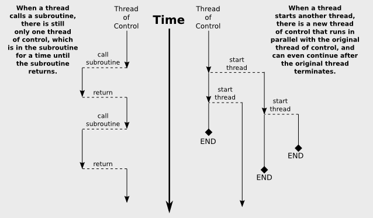

# 스레드 소개

사람과 마찬가지로 컴퓨터도 멀티태스킹이 가능하다. 즉, 동시에 여러 가지 다른 작업을 수행할 수 있다. 중앙 처리 장치가 하나만 있는 컴퓨터는 말 그대로 사람이 할 수 있는 것만큼 동시에 두 가지 작업을 수행할 수는 없지만 여러 작업 사이에서 주의를 전환할 수는 있다. 게다가 대부분의 컴퓨터, 심지어 모바일 장치에도 이제 하나 이상의 처리 장치가 있으며 이러한 컴퓨터는 말 그대로 여러 작업을 동시에 수행할 수 있다. 이제부터 컴퓨팅 파워 증가의 대부분은 개별 프로세서의 속도를 높이는 것보다 컴퓨터에 프로세서를 추가하는 데서 나올 가능성이 높다. 이러한 다중 처리 컴퓨터의 모든 기능을 사용하려면 프로그래머는 병렬 프로그래밍을 수행해야 한다. 이는 동시에 실행될 수 있는 여러 작업의 집합으로 프로그램을 작성하는 것을 의미한다. 단일 프로세서 컴퓨터에서도 병렬 프로그래밍 기술이 유용할 수 있다. 일부 문제는 문제 해결을 위해 협력하는 일련의 동시 작업으로 솔루션을 분할함으로써 가장 자연스럽게 해결될 수 있기 때문이다.

Java에서는 단일 작업을 스레드라고 한다. "스레드"라는 용어는 "제어 스레드(thread of control)" 또는 "실행 스레드(thread of execution)"를 의미하며, 이는 차례로 실행되는 일련의 명령을 의미한다. 스레드는 시간이 지남에 따라 확장되어 각 명령을 다음 명령에 연결한다. 다중 스레드 프로그램에는 많은 제어 스레드가 있을 수 있으며, 시간을 병렬로 엮어 프로그램의 전체 구조를 형성한다. 모든 Java 프로그램에는 최소한 하나의 스레드가 있다. JVM이 프로그램을 실행할 때 프로그램의 루틴 `main` 작업 실행을 담당하는 스레드를 생성한다. 이 메인 스레드는 메인 스레드가 종료된 후에도 계속될 수 있는 다른 스레드를 생성할 수 있다. GUI 프로그램에는 이벤트 처리 및 화면 구성 요소 그리기를 담당하는 추가 스레드가 하나 이상 있다. 

불행하게도 병렬 프로그래밍은 일반적인 단일 스레드 프로그래밍보다 훨씬 어렵다. 여러 스레드가 문제에 대해 함께 작업할 때 완전히 새로운 범주의 오류가 발생할 수 있다. 이는 정확하고 강력한 프로그램을 작성하는 기술이 일반 프로그래밍보다 병렬 프로그래밍에 훨씬 더 중요하다는 것을 의미한다. 반면에 다행스럽게도 Java에는 스레드의 기본 사용을 합리적으로 쉽게 만들어주는 멋진 스레드 API가 있다. 또한 좀 더 까다로운 부분을 돕거나 완전히 숨길 수 있는 다양한 표준 클래스도 있다. 섹션 12.3의 중간까지는 그렇지 않다. 병렬 프로그래밍의 가장 까다로운 부분을 처리하는 데 필요한 하위 수준 기술에 대해 배우게 된다. 실제로 프로그래머는 하위 수준의 내용을 배우지 않고도 스레드를 사용하여 많은 작업을 수행할 수 있다.

## 1. 스레스 생성 및 실행

Java에서 스레드는 `java.lang.Thread` (혹은 이 클래스의 하위 클래스)에 속하는 객체로 표현된다. Thread 객체의 목적은 단일 메서드를 실행하고 이를 한 번만 실행하는 것이다. 이 메서드는 스레드가 수행할 작업을 나타낸다. 이 메서드는 다른 스레드와 병렬로 실행될 수 있는 자체 제어 스레드에서 실행된다. 메서드가 정상적으로 종료되거나 포착되지 않은 예외로 인해 스레드의 메서드 실행이 완료되면 스레드 실행이 중지된다. 이런 일이 발생하면 스레드를 다시 시작하거나 동일한 Thread 객체를 사용하여 다른 스레드를 시작할 수 있는 방법이 없다. 

스레드를 프로그래밍하는 방법에는 두 가지가 있다. 하나는 Thread의 하위 클래스를 만들고 하위 클래스에 `public void run()` 메서드를 정의하는 것이다. 이 `run()` 메서드는 스레드가 수행할 작업을 정의한다. 즉, 스레드가 시작될 때 스레드에서 실행되는 것은 `run()` 메서드이다. 예를 들어, 다음은 표준 출력에 메시지를 인쇄하는 것 외에는 아무 작업도 수행하지 않는 스레드를 정의하는 간단하고 다소 쓸모 없는 클래스이다.

```java
public class NamedThread extends Thread {
    private String name;
    public NamedThread(String name) {
        this.name = name;
    }
    
    public void run() {
        System.out.println("Greetings from thread '" + name + "'!");
    }
}
```

NamedThread를 사용하려면 물론 이 클래스에 속하는 객체를 만들어야 한다.

```java
NamedThread greetings = new NamedThread("Fred");
```

그러나 객체를 생성한다고 해서 스레드 실행이 자동으로 시작되거나 해당 `run()` 메서드가 실행되는 것은 아니다. 그렇게 하려면 스레드 객체에서 `start()` 메서드를 호출해야 한다.

```java
greetings.start();
```

`start()` 메서드의 목적은 Thread 객체의 `run()` 메서드를 실행할 새로운 제어 스레드를 생성하는 것이다. 새 스레드는 이미 존재하는 다른 스레드와 함께 `start()` 메서드가 호출된 스레드와 병렬로 실행된다. `start()` 메서드는 스레드가 종료될 때까지 기다리지 않고 새 제어 스레드를 시작한 직후에 반환된다. 이는 스레드의 `run()` 메서드에 있는 코드가 `start()` 메서드 호출 다음에 나오는 명령문과 동시에 실행된다는 것을 의미한다. 

```java
NamedThread greetings = new NamedThread("Fred");
greetings.start();
System.out.println("Thread has been started");
```

`greetings.start()`가 실행된 후에는 두 개의 스레드가 있다. 그 중 하나는 "Thread has been started"를 인쇄하고 다른 하나는 "Greetings from thread 'Fred'!"를 인쇄한다. 이러한 메시지는 어느 순서로든 인쇄될 수 있다는 점에 유의하는 것이 중요하다. 두 스레드는 동시에 실행되며 메시지를 인쇄할 수 있도록 표준 출력에 엑세스하기 위해 경쟁한다. 가장 먼저 엑세스한 스레드가 해당 메시지를 가장 먼저 인쇄하게 된다. 일반적인 단일 스레드 프로그램에서는 처음부터 끝까지 명확하고 예측 가능한 순서로 일이 발생한다. 다중 스레드 프로그램에는 근본적인 불확정성이 있다. 어떤 순서로 일이 일어날지 확인할 수 없다. 이러한 불확실성이 병렬 프로그래밍을 어렵게 만드는 것이다.

`greetings.start()` 호출은 `greetings.run()` 호출과 매우 다르다. `run()`을 호출하면 새 스레드를 생성하는 대신 동일한 스레드에서 `run()` 메서드가 실행된다. 이는 컴퓨터가 `run()` 호출 이후의 명령문으로 이동하기 전에 `run()` 메서드의 모든 작업이 완료된다는 의미이다. 병렬성와 불확정성이 없다.



이 논의에서는 프로그램이 실행되는 컴퓨터에 두 개 이상의 처리 장치가 있으므로 원래 스레드와 새로 생성된 스레드가 문자 그대로 동시에 실행될 수 있다고 가정했다. 그러나 프로세서가 하나만 있는 컴퓨터에서도 여러 스레드를 생성하는 것이 가능하다. 이 경우 두 스레드는 프로세서에서 시간을 두고 경쟁하게 된다. 그러나 프로세서가 예측할 수 없는 시간에 한 스레드에서 다른 스레드로 전환할 수 있기 때문에 여전히 불확정성이 있다. 실제로 프로그래머 입장에서는 단일 프로세서 컴퓨터를 위한 프로그래밍과 다중 프로세서 컴퓨터를 위한 프로그래밍에는 차이가 없으며, 이제부터 대부분 그 차이를 무시하기로 한다.

---

스레드를 프로그래밍하는 방법에는 두 가지가 있다고 언급했다. 첫 번째 방법은 Thread의 하위 클래스를 정의하는 것이다. 두 번째는 `java.lang.Runnable` 인터페이스를 구현하는 클래스를 정의하는 것이다. Runnable 인터페이스는 `public void run()` 이라는 단일 메서드를 정의한다. Runnable가 주어지면 Runnable의 `run()` 메서드를 실행하는 작업을 수행하는 Thread를 생성하는 것이 가능하다.

Thread 클래스에는 Runnable을 매개 변수로 사용하는 생성자가 있다. Runnable 인터페이스를 구현하는 객체가 해당 생성자에 전달되면 스레드의 `run()` 메서드는 단순히 Runnable에서 `run()` 메서드를 호출하고 스레드의 `start()` 메서드를 호출하면 새 제어 스레드가 생성된다. 


```java
public class NamedRunnable implements Runnable {
    private String name;
    
    public NamedRunnable (String name) {
        this.name = name;
    }
    
    public void run() {
        System.out.println("Greetings from runnable '" + name +"'!");
    }
}
```

이 버전의 클래스를 사용하려면 객체를 만들고 객체를 사용하여 Thread 객체를 만든다.

```java
NamedRunnable greetings = new NamedRunnable("Fred");
Thread greetingsThread = new Thread(greetings);
greetingsThread.start();
```

이런 방식으로 작업을 수행하면 모든 객체가 Runnable 인터페이스를 구현할 수 있고 `run()` 메서드를 포함할 수 있어 별도의 스레드에서 실행될 수 있다는 장점이 있다. 해당 `run()` 메서드는 `private` 변수 및 메서드를 포함하여 클래스의 모든 항목에 엑세스할 수 있다. 단점은 이러한 작업 방식이 객체 지향적이지 않다는 것이다. 이는 각 객체가 명확하게 정의된 단일 책임을 가져야 한다는 원칙을 위반한다. 스레드를 만드는 데 사용할 수 있도록 임의의 객체를 Runnable로 만드는 대신 Thread 클래스의 하위 클래스인 중첩 클래스를 사용하여 스레드를 정의하는 것을 고려할 수 있다. 

마지막으로 Runnable은 함수형 인터페이스이므로 Runnable 객체를 람다 식으로 제공할 수 있다. 

```java
Thread greetingsFromFred = new Thread( 
    () -> System.out.println("Greetings from Fred!")
);
greetingsFromFred.start();
```

---

여러 스레드가 병렬로 실행되는 방법을 이해하는데 도움이 되는 샘플 프로그램 [ThreadTest1.java](https://math.hws.edu/javanotes/source/chapter12/ThreadTest1.java)를 고려하자. 이 프로그램은 여러 스레드를 생성한다. 각 스레드는 정확히 동일한 작업을 수행한다. 10,000,000보다 작은 소수인 정수의 개수를 세는 것이 과제이다. (수행된 특정 작업은 적지 않은 시간이 소요되는 한 여기서 우리의 목적에 중요하지 않다. 이것은 데모 프로그램이다. 실제 프로그램에서 여러 스레드를 갖는 것은 어리석은 일이다. 동일한 작업을 수행하며 소수를 계산하는 데 사용되는 방법은 매우 비효율적이다.) 이 계산은 최신 컴퓨터에서 몇 초 이내에 완료된다. 이 작업을 수행하는 스레드는 다음과 같은 정적 중첩 클래스에 의해 정의된다.

```java
/**
 * 이 클래스에 속하는 스레드가 실행되면
 * 2에서 MAX 사이의 소수 수. 결과가 인쇄됩니다
 * ID 번호 및 경과된 시간과 함께 표준 출력으로
 * 계산 시작과 끝 사이의 시간입니다.
 */
private static class CountPrimesThread extends Thread {
    int id; 
    public CountPrimesThread(int id) {
        this.id = id;
    }
    public void run() {
        long startTime = System.currentTimeMillis();
        int count = countPrimes(2,MAX); 
        long elapsedTime = System.currentTimeMillis() - startTime;
        System.out.println("Thread " + id + " counted " +
                count + " primes in " + (elapsedTime/1000.0) + " seconds.");
    }
}
```

메인 프로그램은 사용자에게 실행할 스레드 수를 묻고 지정된 수의 스레드를 생성하고 시작한다.

```java
public static void main(String[] args) {
    int numberOfThreads = 0;
    while (numberOfThreads < 1 || numberOfThreads > 30) {
        System.out.print("How many threads do you want to use  (1 to 30) ?  ");
        numberOfThreads = TextIO.getlnInt();
        if (numberOfThreads < 1 || numberOfThreads > 30)
            System.out.println("Please enter a number between 1 and 30 !");
    }
    System.out.println("\nCreating " + numberOfThreads
            + " prime-counting threads...");
    CountPrimesThread[] worker = new CountPrimesThread[numberOfThreads];
    for (int i = 0; i < numberOfThreads; i++)
        worker[i] = new CountPrimesThread( i );
    for (int i = 0; i < numberOfThreads; i++)
        worker[i].start();
    System.out.println("Threads have been created and started.");
}
```

프로그램을 컴파일하고 실행해 보는 것이 좋다.

6개의 프로세서가 있다. 해당 컴퓨터에서 하나의 스레드를 사용하여 프로그램을 실행했을 때 약 3.36초가 걸렸다. 12개 스레드를 사용했을 때 출력은 다음과 같다. 

```java
Creating 12 prime-counting threads...
Threads have been created and started.
Thread 1 counted 664579 primes in 6.424 seconds.
Thread 11 counted 664579 primes in 6.694 seconds.
Thread 0 counted 664579 primes in 6.727 seconds.
Thread 3 counted 664579 primes in 6.74 seconds.
Thread 10 counted 664579 primes in 6.759 seconds.
Thread 7 counted 664579 primes in 6.77 seconds.
Thread 2 counted 664579 primes in 6.798 seconds.
Thread 9 counted 664579 primes in 6.792 seconds.
Thread 5 counted 664579 primes in 6.824 seconds.
Thread 4 counted 664579 primes in 6.836 seconds.
Thread 8 counted 664579 primes in 6.841 seconds.
Thread 6 counted 664579 primes in 6.877 seconds.
```

두 번째 줄은 첫 번째 줄 바로 뒤에 인쇄되었다. 이 시점에서 기본 프로그램은 종료되었지만 12개의 스레드는 계속 실행되었다. 약 6.5초 동안 일시 중지된 후 8개의 스레드가 모두 거의 동시에 완료되었다. 스레드가 완료되는 순서는 스레드가 시작된 순서와 동일하지 않으며 순서는 불확실하다. 즉, 프로그램이 다시 실행되면 스레드가 완료되는 순서가 달라질 수 있다.

이 컴퓨터에서는 12개의 스레드와 1개의 스레드보다 약 2배의 시간이 걸렸다. 이는 컴퓨터에 6개의 프로세서가 있기 때문이다. 6개의 프로세서에서 실행되는 12개의 스레드로 인해 각 스레드는 약 절반의 시간 동안만 활발하게 실행되었으므로 작업을 완료하는 데 두 배의 시간이 걸렸다. 단일 프로세서 컴퓨터에서는 12개의 스레드가 1개의 스레드보다 약 12배 더 오래 걸린다. 6개 이상의 프로세서가 있는 컴퓨터에서 6개의 스레드가 단일 스레드보다 더 많은 시간이 걸리지 않을 수 있다. 오버헤드 및 기타 이유로 인해 실제 속도 향상은 이 분석이 나타내는 것보다 약간 작을 수 있지만 다중 프로세서 시스템에서는 확실한 속도 향상을 볼 수 있다. 자신의 컴퓨터에서 프로그램을 실행하면 어떻게 되나? 프로세서가 몇 개 있나?

실행할 프로세서 수보다 실행할 스레드가 더 많을 때마다 컴퓨터는 한 스레드에서 다른 스레드로 빠르게 전환하여 실행 가능한 모든 스레드에 주의를 분산시킨다. 즉, 각 프로세서는 한동안 하나의 스레드를 실행한 다음 다른 스레드로 전환하여 잠시 동안 그 스레드를 실행하는 식이다. 일반적으로 이러한 "컨텍스트 전환(context switches)"는 초당 약 100회 이상 발생한다. 그 결과 컴퓨터는 모든 작업을 진행하고 사용자에게는 마치 모든 작업이 동시에 실행되는 것처럼 보인다. 이것이 바로 각 스레드가 동일한 양의 작업을 수행하는 샘플 프로그램에서 모든 스레드가 거의 동시에 완료되는 이유이다. 모든 스레드에서 1초보다 긴 시간 동안 컴퓨터의 시간은 거의 균등하게 나뉜다.

## 2. 스레드에 대한 작업

Java의 스레드 API 중 대부분은 Thread 클래스에서 찾을 수 있다. 그러나 Java 프로그램이 실행 중인 환경에 대한 정보를 얻을 수 있도록 하는 클래스인 Runtime의 스레드 관련 메서드부터 시작한다. 작업을 여러 프로세서에 분산시키기 위해 병렬 프로그래밍을 수행하는 경우 사용 가능한 프로세서 수를 고려할 수 있다. 예를 들어, 각 프로세서에 대해 하나의 스레드를 생성할 수 있다. Java에서는 함수를 호출하여 프로세서 수를 확인할 수 있다.

```java
Runtime.getRuntime().availableProcessors()
```

JVM에 사용할 수 있는 프로세서 수를 제공하는 int를 반환한다. 어떤 경우에는 컴퓨터의 실제 프로세서 수보다 적을 수도 있다. Thread 객체에는 스레드 작업을 위한 몇 가지 유용한 메서드가 포함되어 있다. 가장 중요한 것은 위에서 설명한 `start()` 메서드이다.

스레드가 시작되면 어떤 이유로 `run()` 메서드가 종료될 때까지 계속 실행된다. 때로는 한 스레드가 다른 스레드가 종료되었는지 여부를 알 수 있는 것이 유용하다. `thrd`가 Thread 유형의 객체인 경우, boolean 값 함수 `thrd.isAlive()`를 사용하여 `thrd`가 종료되었는지 여부를 테스트할 수 있다. 스레드는 시작된 시간과 종료되는 시간 사이에 "활성(alive)"상태 이다. 스레드가 종료된 후에는 "죽었다(dead)"고 한다. 종료된 스레드는 다시 시작할 수 없다는 점을 기억하자.

정적 메서드 `Thread.sleep(milliseconds)`는 이 메서드를 실행하는 스레드가 지정된 밀리초 동안 "휴먼(sleep)" 상태가 되도록 한다. 잠자는 스레드는 아직 살아있지만 실행되고 있지 않다. 스레드가 절전 모드인 동안 컴퓨터는 실행 가능한 다른 스레드에서 작업할 수 있다. `Thread.sleep()`를 사용하면 스레드 실행에 일시 중지를 삽입할 수 있다. `sleep()` 메서드는 필수 예외 처리가 필요한 checked exception 예외인 IOException 유형의 예외를 발생시킬 수 있다. 실제로 이는 `sleep()` 메서드가 일반적인 잠재적인 InterruptedException를 포착하는 `try..catch` 문 내에서 호출된다는 것을 의미한다.

```java
try {
    Thread.sleep(lengthOfPause);
}
    catch (InterruptedException e) {
}
```

하나의 스레드는 다른 스레드가 잠자기 상태이거나 다른 이유로 일시 중지되었을 때 다른 스레드를 깨우도록 **중단(interrupt)** 할 수 있다. Thread `thrd`는 `thrd.interrupt()` 메서드를 호출하여 중단될 수 있다. 이렇게 하면 한 스레드에서 다른 스레드로 신호를 보내는 편리한 방법이 될 수 있다. 스레드는 InterruptedException를 포착하면 중단되었음을 알 수 있다. 예외에 대한 `catch` 핸들러 외부에서 드레드는 정적 메서드 `Thread.interrupted()`를 호출하여 중단되었는지 여부를 확인할 수 있다. 이 메서드는 현재 스레드(메서드가 실행하는 스레드)가 중단되었는지 여부를 알려준다. 또한 스레드의 중단된 상태를 지우는 특이한 속성도 있으므로 중단을 확인할 수 있는 기회는 단 한 번만 제공된다. 프로그램에서 스레드를 중단하지 않는 한 스레드가 중단되지 않는다. 따라서 대부분의 경우 InterruptedException에 대한 응답으로 어떤 작업도 수행할 필요가 없다.

때로는 한 스레드가 다른 스레드가 죽을 때까지 기다려야 하는 경우도 있다. 이는 Thread 클래스의 `join()` 메서드를 사용하여 수행된다. `thrd.join()`을 호출하면 해당 스레드는 `thrd`가 종료될 때까지 절전 모드로 전환된다. `thrd.join()`이 호출될 때 `thrd`가 이미 종료된 경우 아무런 효과가 없다. `join()` 메서드는 평소와 같이 처리해야 하는 InterruptedException를 발생시킬 수 있다. 예를 들어, 다음 코드는 여러 스레드를 시작하고 스레드가 모두 종료될 때까지 기다린 후 경과 시간을 출력한다.

```java
CountPrimesThread[] worker = new CountPrimesThread[numberOfThreads];
long startTime = System.currentTimeMillis();
for (int i = 0; i < numberOfThreads; i++) {
    worker[i] = new CountPrimesThread();
    worker[i].start();
}
for (int i = 0; i < numberOfThreads; i++) {
    try {
        worker[i].join();  // 아직 완료되지 않은 경우 작업자[i]가 완료될 때까지 기다립니다. already.
    }
    catch (InterruptedException e) {
    }
}
// 이 시점에서 모든 작업자 스레드가 종료되었습니다.
long elapsedTime = System.currentTimeMillis() - startTime;
System.out.println("Total elapsed time: " + (elapsedTime/1000.0) + " seconds");
```

이 코드에서 InterruptedException이 발생하지 않았다. InterruptedException이 가능한 환경에서 스레드 `worker[i]`가 종료되었는지 확인하려면 다음과 같이 해야 한다.

```java
while (worker[i].isAlive()) {
    try {
        worker[i].join();
    }
    catch (InterruptedException e) {
    }
}
```

`join()` 메서드의 또 다른 버전은 대기할 최대 밀리초 수를 지정하는 정수 매개 변수를 사용한다. `thrd.join(m)`에 대한 호출은 `thrd`가 종료되거나 m 밀리초가 경과할 때까지 기다린다. 이는 스레드가 기다리는 동안 일부 작업을 수행하기 위해 가끔 깨어나도록 하는 데 사용할 수 있다. 예를 들어 다음은 스레드 `thrd`를 시작한 다음 2초마다 마침표를 출력하는 코드이다.

```java
System.out.print("Running the thread ");
thrd.start();
while (thrd.isAlive()) {
    try {
        thrd.join(2000);
        System.out.print(".");
    }
    catch (InterruptedException e) {
    }
}
System.out.println(" Done!");
```

---

스레드에는 데몬 상태와 우선순위라는 두 가지 유용한 속성이 있다. `thrd.setDaemon(true)`를 호출하여 스레드 `thrd`를 데몬 스레드로 지정할 수 있다. 이 작업은 스레드가 시작되기 전에 수행되어야 하며 호출 스레드가 `thrd`의 속성을 수정하는 것이 허용되지 않으면 SecurityException 유형의 예외가 발생할 수 있다. 이는 단 하나의 효과만 가진다. JVM은 **비데몬(non-daemon)** 이 없으면 즉시 종료된다. 아직 살아있는 스레드, 즉 데몬 스레드가 아직 살아 있다는 사실만으로는 JVM을 계속 실행하는 데 충분하지 않다. 예를 들어, 데몬이 아닌 다른 스레드에 일부 서비스를 제공하기 위해서만 데몬 스레드가 존재할 수 있다. 데몬이 아닌 스레드가 더 이상 없으면 데몬 스레드의 서비스에 대한 호출이 더 이상 없으므로 프로그램이 종료될 수 있다. 

스레드의 우선순위는 더 중요한 속성이다. 모든 스레드에는 정수로 지정된 **우선 순위(priority)** 가 있다. 우선 순위 값이 더 높은 스레드는 우선 순위가 더 낮은 스레드보다 우선적으로 실행된다. 예를 들어 더 이상 중요한 스레드가 수행할 작업이 없을 때 백그라운드에서 수행할 수 있는 계산은 낮은 우선순위로 실행될 수 있다. 다음 섹션에서는 이것이 GUI 프로그램에서 어떻게 유용할 수 있는지 살펴 본다. `thrd.getPriority()`는 `thrd`의 우선순위를 지정하는 정수를 반환 하고 `thrd.setPriority(p)`를 사용하여 우선 순위를 주어진 정수 p로 설정할 수 있다.

우선순위는 임의의 정수일 수 없으며 지정된 우선순위가 스레드의 합법적인 범위에 없으면 `thrd.setPriority()`는 IllegalArgumentException을 발생시킨다. 법적 우선순위 값의 범위는 컴퓨터마다 다를 수 있다. 유효한 값의 범위는 `Thread.MIN_PRIORITY` 및 `Thread.MAX_PRIORITY` 상수로 지정되지만 지정된 스레드는 `Thread.MAX_PRIORITY` 보다 작은 값으로 추가로 제한될 수 있다. 기본 우선 순위는 `Thread.NORM_PRIORITY`에 의해 지정된다. `thrd`가 일반 우선순위 바로 아래의 우선순위 값으로 실행되도록 설정하려면 다음을 호출할 수 있다.

```java
thrd.setPriority( Thread.NORM_PRIORITY - 1 );
```

메서드를 호출하는 스레드 `thrd`의 우선순위를 지정된 값으로 설정하는 것이 허용되지 않는 경우 `thrd.setPriority()`는 SecurityException 유형의 예외를 발생시킬 수도 있다.

마지막으로 정적 메서드 `Thread.currentThread()`는 현재 스레드를 반환한다는 점에 유의한다. 즉, 이 메서드의 반환 값은 해당 메서드를 실행한 슬데ㅡ이다. 이를 통해 스레드는 자신에 대한 참조를 얻을 수 있으므로 자신의 속성을 수정할 수 있다. `Thread.currentThread().getPriority()`를 호출하여 현재 실행 중인 스레드의 우선순위를 결정할 수 있다.

## 3. "synchronized"를 통한 상호 배제(Mutual Exclusion)

완전히 독립적인 작업을 수행하기 위해 여러 스레드를 프로그래밍하는 것은 매우 쉽다. 스레드가 어떤 방식으로든 상호 작용해야 할 때 실제 어려움이 발생한다. 스레드가 상호 작용하는 한 가지 방법은 리소스를 공유하는 것이다. 두 스레드가 화면의 변수나 창과 같은 동일한 리소스에 엑세스해야 하는 경우 동일한 리소스를 동시에 사용하지 않도록 주의해야 한다. 그렇지 않으면 상황은 다음과 같을 수 있다. 여러 명의 요리사가 단 하나의 계량 컵을 공유한다고 가정한다. 요리사 A가 계량 컵에 우유를 채우고 요리사 A가 비울 기회가 있기 전에 요리사 B가 컵을 집는 상황이다. 요리사 A가 컵에 우유 넣기와 그릇에 컵 넣기라는 두 가지 작업을 수행하는 동안 컵에 대한 독점권을 주장하려면 어떤 방법이 있어야 한다.

스레드에서도 비슷한 일이 발생한다. 심지어 카운터에 스레드를 추가하는 것 만큼 간단한 경우에도 마찬가지이다.

```java
count = count + 1;
```

실제로는 세 가지 작업의 시퀀스이다.

```
1단계. count 값 가져오기
2단계. 값에 1 더하기
3단계. 새 값을 count에 저장
```

여러 스레드 각각이 세 단계를 수행한다고 가정한다. 두 개의 스레드가 동시에 실행될 수 있으며 프로세서가 하나만 있는 경우에도 해당 프로세서가 언제든지 한 스레드에서 다른 스레드로 전환할 수 있다는 점을 기억하자. 한 스레드가 2단계와 3단계 사이에 있는 동안 다른 스레드가 동일한 단계 시퀀스를 실행하기 시작한다고 가정한다. 첫 번째 스레드는 아직 `count`에 새 값을 저장하지 않았으므로 두 번째 스레드는 `count`의 이전 값을 읽고 해당 이전 값에 1을 추가한다. 두 스레드 모두 `count`에 대해 동일한 새 값을 계산했으며, 두 스레드 모두 3단계를 실행하여 해당 값을 다시 `count`에 저장한다. 두 스레드가 모두 작업을 수행한 후에는 `count`가 2가 아닌 1만 증가했다. 이러한 유형의 문제를 **경쟁 조건(race condition)** 이라고 한다. 이는 한 스레드가 다단계 작업을 진행 중이고 다른 스레드가 첫 번째 스레드가 의존하는 일부 값이나 조건을 변경할 수 있을 때 발생한다. 

경쟁 조건의 또 다른 예는 if문에서 발생할 수 있다. 0으로 나누기 오류를 방지한 다음 코드를 고려하자.

```java
if (A != 0) {
    B = C / A;
}
```

이 명령문이 일부 스레드에 의해 실행된다고 가정한다. 변수 A가 하나 이상의 다른 스레드에 의해 공유되고 경쟁 조건을 방지하기 위한 아무 조치되 취하지 않는 경우 다른 스레드 중 하나가 첫 번째 스레드가 공유되는 시간 사이에 A의 값을 0으로 변경할 가능성이 있다. 조건 `A != 0`과 나누기를 수행한 시간을 확인한다. 이는 스레드가 A가 0이 아니라는 것을 방금 확인했음에도 불구하고 결국 0으로 나눌 수 있음을 의미한다. 

경쟁 조건 문제를 해결하려면 스레드가 공유 리소스에 **독점적으로 엑세스(exclusive access)** 할 수 있는 방법이 있어야 한다. 이는 구현하기가 쉽지 않지만 Java는 배타적 엑세스에 대한 높은 수준의 상대적으로 사용하기 쉬운 접근 방식을 제공한다. 이는 **동기화된 메서드(synchronized methods)** 와 **동기화된 문(synchronized statement)** 를 사용하여 수행된다. 이는 한 번에 하나의 스레드만 리소스에 엑세스하도록 하여 공유 리소스를 보호하는 데 사용된다. Java의 동기화는 실제로 **상호 배제(mutual exclusion)** 만을 제공한다. 즉, 리소스에 대한 독점 엑세스는 모든 경우에만 보장된다. 해당 리소스에 엑세스해야 하는 스레드는 동기화를 사용한다. 동기화는 요리사가 "계량컵을 사용하고 있다"라고 메모를 남기는 것과 같다. 이렇게 하면 요리사가 컵에 독점적으로 접근할 수 있다. 하지만 모든 요리사가 컵을 잡으려고 하기 전에 메모를 확인하는 데 동의한 경우에만 가능하다.

어려운 주제이기 때문에 간단한 예부터 시작한다. 여러 스레드가 모두 카운터에 1을 추가하려고 할 때 발생하는 경쟁 조건을 피하고 싶다고 가정한다. 카운터를 나타내는 클래스를 정의하고 해당 클래스에서 동기화된 메서드를 사용하면 이를 수행할 수 있다. 메서드 정의에 수식어로 `synchronized` 예약어를 추가하여 메서드가 동기화되도록 선언한다.

```java
public class ThreadSafeCounter {
    
    private int count = 0;  // The value of the counter.
    
    synchronized public void increment() {
        count = count + 1;
    }
    
    synchronized public int getValue() {
        return count;
    }
   
}
```

`tsc`가 ThreadSafeCounter 유형인 경우 모든 스레드는 `tsc.increment()`를 호출하여 완전히 안전한 방식으로 카운터에 1을 추가할 수 있다. `tsc.increment()`가 `synchronized` 된다는 사실은 한 번에 하나의 스레드만 이 메서드에 있을 수 있음을 의미한다. 스레드가 이 메서드를 실행을 시작하면 다른 스레드가 `count`에 엑세스하기 전에 실행이 완료된다는 것이 보장된다. 경쟁 조건이 발생할 가능성은 없다. 보장은 `count`가 `private` 변수라는 사실에 따라 달라진다. 이렇게 하면 `tsc.conut`에 대한 모든 엑세스가 `synchronized`된 환경에서 발생하게 된다. 예를들어 `count`가 `public`인 경우 스레드는 `tsc.count++`라고 말하여 동기화를 우회할 수 있다. 이는 다른 스레드가 `tsc.increment()` 중악ㄴ에 있는 동안 `count` 값을 변경할 수 있다. 동기화만으로는 독점 엑세스가 보장되지 않는다. 이는 동기화되는 모든 스레드 간의 **상호 배제(mutual exclustion)** 만 보장한다.

그러나 ThreadSafeCounter 클래스는 카운터를 사용할 때 발생할 수 있는 모든 경쟁 조건을 방지하지는 않는다. 

```java
if (tsc.getValue() == 10) {
    doSomething();
}
```

여기서 `doSomething()`은 값이 10이 되도록 요구하는 메서드이다. 여기에는 여전히 경쟁 조건이 있다. 이는 첫 번째 스레드가 `tsc.getValue() == 10`와 `doSomething()`를 테스트하는 시간 사이에 두 번째 스레드가 카운터를 증가시키는 경우 발생한다. 첫 번째 스레드는 전체 if문이 실행되는 동안 카운터에 단독으로 엑세스해야 한다. if문에  `synchronized`를 넣어 해결 할 수 있다.

```java
synchronized(tsc) {
    if ( tsc.getValue() == 10 )
        doSomething();
}
```

`synchronized`문은 객체를 일종의 매개 변수로 사용한다.

```java
synchronized(object) {
    statements
}
```

Java에서 상호 배제는 항상 객체와 연관되어 있다. 우리는 동기화가 해당 객체이 "있다"라고 말한다. 예를 들어 위의 if문은 "synchronized on `tsc`" 이다. ThreadSafeCounter 클래스와 같은 동기화된 인스턴스 메서드는 인스턴스 메서드가 포함된 객체에서 동기화된다. 실제로 인스턴스 메서드에 `synchronized`를 추가하는 것은 `synchronized(this) {...}` 형식의 문을 본문에 넣는 것과 거의 동일하다. 또한 동기화된 정적 메서드를 갖는 것도 가능하다. 동기화된 정적 메서드는 정적 메서드를 포함하는 클래스를 나타내는 특수 클래스 객체에서 동기화된다.

Java에서 동기화의 실제 규칙은 다음과 같다. **두 스레드는 동일한 객체에서 동시에 동기화될 수 없다.** 즉, 해당 객체에서 동기화되는 코드 세그먼트를 동시에 실행할 수 없다. 하나의 스레드가 객체에 대해 동기화되고 두 번째 스레드가 동일한 객체에 대해 동기화를 시도하는 경우 두 번째 스레드는 첫 번째 스레드가 객체 작업을 완료할 때까지 기다려야 한다. 죽, 두 스레드가 동시에 동일한 동기화 메서드를 실행할 수 없다는 것이 사실일 뿐만 아니라, 두 메서드가 동일한 객체에 대한 동기화되는 경우 실제로 두 스레드가 두 개의 서로 다른 메서드를 동시에 실행할 수 없다는 것을 의미한다. 이는 **동기화 잠금(synchronization lock)** 이라는 것을 사용하여 구현된다. 모든 객체에는 동기화 잠금이 있으며 해당 잠금은 한 번에 하나의 스레드에서만 "보유(held)" 될 수 있다. 동기화된 명령문이나 동기화된 메서드를 입력하려면 스레드가 연관된 객체의 잠금을 획득히야 한다. 잠금을 사용할 수 있으면 스레드는 잠금을 획득하고 즉시 동기화된 코드 실행을 시작한다. 동기화된 코드 실행이 완료된 후 잠금을 해제한다. 스레드 A가 스레드 B가 이미 보유하고 있는 잠금을 얻으려고 시도하는 경우 스레드 A는 스레드 B가 잠금을 해제할 때까지 기다려야 한다. 실제로 스레드 A는 잠자기 상태가 되며 잠금을 사용할 수 있을 떄까지 깨어나지 않는다.

섹션 8.2.3의 불변성에 대한 논의에서 스레드가 포함될 떄 불변성에 대한 추론이 훨씬 더 복잡해진다고 언급했다. 문제는 경쟁 조건이다. 우리는 ThreadSafeCounter 클래스에 `count`값은 "`increment()`가 호출된 횟수"라는 클래스 불변성을 갖고 싶다. 단일 스레드 프로그램에서는 동기화 없이도 마찬가지이다. 그러나 다중 스레드 프로그램에서는 클래스 불변이 실제로 불변인지 확인하기 위해 동기화가 필요하다.

---

공유 자원의 간단한 예로 소수 계산 문제로 돌아간다. 이 경우 모든 스레드가 정확히 동일한 작업을 수행하도록 하는 대신 실제 병렬 처리를 수행한다. 프로그램은 주어진 정수 범위에서 소수의 수를 계산하며 작업을 여러 스레드로 나누어 계산한다. 각 스레드에는 전체 정수 범위의 일부가 할당되고 할당된 부분에서 소수의 개수가 계산된다. 계산이 끝나면 스레드는 전체 범위의 전체 소수 합계에 자신의 개수를 더해야 한다. 각 스레드는 총계에 숫자를 추가해야 하므로 총계를 나타내는 변수는 모든 스레드에서 공유된다. 각 스레드가 다음과 같이 말하면

```java
total = total + count;
```

그러면 두 개의 스레드가 동시에 이 작업을 시도하여 최종 합계가 잘못될 가능성이 있다. 이러한 경합 상태를 방지하려면 `total`에 대한 엑세스를 동기화해야 한다. 내 프로그램은 동기화된 방법을 사용하여 총에 개수를 추가한다. 이 메서든느 각 스레드에서 한 번 호춛되어 `total`이 변경되는 유일한 메서드이다.

```java
synchronized private static void addToTotal(int x) {
    total = total + x;
    System.out.println(total + " primes found so far.");
}
```

프로그램의 소스 코드는 [ThreadTest2.java](https://math.hws.edu/javanotes/source/chapter12/ThreadTest2.java)에서 찾을 수 있다. 이 프로그램은 6,000,001에서 12,000,000 사이의 소수를 계산한다. 이 프로그램의 `main()`은 1~6개의 스레드를 생성하고 작업의 일부를 각 스레드에 할당한다. 위에서 설명한 대로 `join()` 메서드를 사용하여 모든 스레드가 완료될 때까지 기다린다. 그런 다음 발견된 총 소수 수와 경과 시간을 보고한다. 모든 스레드가 완료될 때까지 소수의 수를 보고하는 것은 의미가 없으므로 여기서는 `join()`이 필요하다. 다중 프로세서 컴퓨터에서 프로그램을 실행하는 경우 둘 이상의 스레드를 사용할 때 프로그램을 실행하려는 데 걸리는 시간이 줄어든다.

---

동기화는 경쟁 조건을 방지하는 데 도움이 될 수 있지만 다른 유형의 오류인 교착 상태가 발생할 가능성이 있다. 스레드가 결코 얻지 못할 리소스를 영원히 기다릴 때 교착 상태가 발생한다. 주방에서는 매우 단순한 요리사 두 명이 동시에 우유 한 컵의 양을 측정하려고 하면 교착 상태가 발생할 수 있다. 첫 번째 요리사는 계량컵을 잡고, 두 번째 요리사는 우유를 잡는다. 첫 번째 요리사에게는 우유가 필요하지만 두 번째 요리사가 우유를 가지고 있기 때문에 찾을 수 없다. 두 번째 요리사는 계량컵이 필요하지만 첫 번째 요리사가 가지고 있기 때문에 찾을 수 없다. 두 요리 모두 계속할 수 없으며 더 이상 수행할 작업도 없다. 이것은 교착 상태이다. 프로그램에서 똑같은 일이 일어날 수 있다. 예를 들어 두 개의 스레드(예: 두 명의 요리사)가 있고 둘 다 진행하기 전에 동일한 두 개체(예: 우유 및 계량 컵)에 대한 잠금을 얻어야 하는 경우다. 교착상태는 피하기 위해 세심한 주의를 기울이지 않는 한 쉽게 발생할 수 있다.

## 4, 휘발성 변수(Volatile Variables)

동기화는 스레드 간의 통신을 제어하는 한 가지 방법일 뿐이다. 이 장의 뒷부분에서 몇 가지 다른 기술을 다룰 것이다. 지금은 휘발성 변수와 원자 변수라는 두 가지 기술로 이 섹션을 마무리한다.

일반적으로 스레드는 변수를 공유하고 동기화된 메서드나 동기화된 문에서 해당 변수에 엑세스하여 통신한다. 그러나 동기화는 계산 비용이 상당히 많이 들기 때문에 과도한 사용은 피해야 한다. 따라서 어떤 경우에는 스레드가 해당 변수에 대한 엑세스를 동기화하지 않고 공유 변수를 참조하는 것이 합리적일 수 있다.

그러나 공유 변수의 값이 한 스레드에서 설정되고 다른 스레드에서 사용될 때 미묘한 문제가 발생한다. 스레드가 Java에서 구현되는 방식으로 인해 두 번째 스레드는 변수의 변경된 값을 즉시 확인하지 못할 수 있다. 즉, 다른 스레드에 의해 변수 값이 변경된 후에도 한 동안 스레드가 공유 변수의 이전 값을 계속 볼 수 있다. 이는 스레드가 공유 데이터를 **캐시(cache)** 하도록 허용되기 때문이다. 즉, 각 스레드는 공유 데이터의 자체 로컬 복사본을 유지할 수 있다. 하나의 스레드가 공유 변수의 값을 변경할 때 다른 스레드의 캐시에 있는 로컬 복사본은 즉시 변경되지 않으므로 다른 스레드는 최소한 잠시라도 계속 이전 값을 볼 수 있다.

모든 경우에 동일한 동기화 객체를 사용하여 해당 변수에 대한 모든 엑세스가 동기화되는 한 동기화된 메서드나 명령문에서 공유 변수를 사용하는 것이 안전하다. 보다 정확하게는 동기화된 코드의 변수에 엑세스하는 모든 스레드는 동일한 객체에서 동기화된 코드에 변경 사항이 적용되는 한 다른 스레드에서 변경한 내용을 볼 수 있도록 보장된다.

동기화된 코드 외부에서 공유 변수를 안전하게 사용할 수 있지만, 이 경우 변수를 **휘발성(volatile)** 으로 선언해야 한다. 휘발성 키워드는 다음과 같이 전역 변수 선언에 추가할 수 있는 수정자 이다.

```java
private volatile int count;
```

변수가 `volatile`으로 선언되면 어떤 스레드도 해당 변수의 로컬 복사본을 캐시에 보관하지 않는다. 대신 스레드는 항상 변수의 공식적인 기본 복사본을 사용한다. 이는 변수에 대한 모든 변경 사항이 즉시 모든 스레드에 표시된다는 것을 의미한다. 이는 스레드가 동기화된 코드 외부에서도 `volatile` 공유 변수를 참조하는 것을 안전하게 만든다. 휘발성 변수에 대한 엑세스는 비휘발성 변수에 대한 엑세스 보다 덜 효율적이지만 동기화를 사용하는 것보다 더 효율적이다. (그러나 휘발성 변수를 사용해도 변수 값이 증가할 때 발생하는 경쟁 조건이 해결되지 않는다는 점을 기억하자. 증가 작업은 여전히 다른 스레드에 의해 중단될 수 있다.)

`volatile` 수정자를 객체 변수에 적용하면 변수가 가리키는 객체의 내용이 아닌 변수 자체만 휘발성으로 선언된다. 이러한 이유로 `volatile`는 primitive 유형이나 String과 같은 불변 유형에 주로 사용된다.

휘발성 변수를 사용하는 일반적인 예는 두 번째 스레드가 종료되도록 알리는 신호를 한 스레드에서 다른 스레드로 보내는 것이다. 두 스레드는 변수를 공유한다.

```java
volatile boolean terminate = false;
```

두 번째 스레드의 `run()` 메서드는 `terminate` 값을 자주 확인하고 `terminate` 값이 true 시 종료된다.

```java
public void run() {
    while ( terminate == false ) {
        .
        .  // Do some work.
        .
    }
}
```

이 스레드는 다른 스레드가 `terminate` 값을 true로 설정할 때까지 실행된다. 이와 같은 것은 실제로 한 스레드가 다른 스레드를 죽게 만드는 유일한 깨끗한 방법다.

(그런데 애초에 스레드가 로컬 데이터 캐시를 사용해야 하는 이유가 무엇인지 궁금할 수도 있다. 일이 불필요하게 복잡해지기 때문이다. 캐싱은 다중 처리 컴퓨터의 구조 때문에 허용된다. 많은 다중 처리 컴퓨터에서 각 프로세서는 일부 로컬 데이터 캐시를 가지고 있다. 프로세서에 직접 연결된 메모리 스레드의 캐시는 스레드가 실행 중인 프로세서의 로컬 메모리에 저장될 수 있다. 이 로컬 메모리에 대한 액세스는 모든 프로세서가 공유하는 주 메모리에 액세스하는 것보다 훨씬 빠르다. 따라서 스레드가 주 메모리에 저장된 일부 "마스터 복사본"보다 공유 변수의 로컬 복사본을 사용하는 것이 더 효율적이다.)

## 5. 원자 변수(Atomic Variables)

병렬 프로그래밍에서 `count = count + 1`과 같은 명령문의 문제점은 명령문을 실행하는 데 여러 단계가 필요하다는 것이다. 해당 단계가 중단 없이 완료되는 경우에만 명령문이 올바르게 실행된다.

원자 작업은 중단할 수 없는 작업이다. 그것은 전부 아니면 전무한 일이다. 부분적으로 완료할 수 없다. 대부분의 컴퓨터에는 기계 언어 수준에서 원자적인 작업이 있다. 예를 들어, 메모리 위치의 값을 원자적으로 증가시킬 수 있는 기계어 명령이 있을 수 있다. 이러한 명령은 경쟁 조건을 두려워하지 않고 사용할 수 있다.

프로그램에서 작업은 기계어 수준에서 문자 그대로 원자적이지 않더라도 원자적일 수 있다. 어떤 스레드에서도 부분적으로 완료된 것으로 볼 수 없는 작업은 원자성 작업으로 간주될 수 있다 . 예를 들어 위에서 정의한 ThreadSafeCounter 클래스에는 원자성 증가 작업이 있다고 말할 수 있다. 동기화는 작업이 적어도 효과적으로 원자성을 갖도록 보장하는 방법으로 볼 수 있다.

그럼에도 불구하고 동기화가 필요하지 않은 원자적 작업이 있으면 좋을 것이다. 특히 이러한 작업은 하드웨어 수준에서 매우 효율적으로 구현될 수 있기 때문이다.

Java에는 몇 가지 단순한 변수 유형에 대해 원자적 연산을 구현하는 클래스를 정의하는 `java.util.concurrent.atomic` 패키지가 있다. 원자 추가, 증가 및 감소를 포함하여 정수 값에 대한 일부 원자 연산을 제공하는 AtomicInteger 클래스를 살펴본다. 예를 들어, 다양한 스레드에서 생성되는 정수 값을 추가한다고 가정해 본다. 

```java
private static AtomicInteger total = new AtomicInteger();
```

합계는 초기값 0으로 생성된다. 스레드가 합께에 값을 추가하려는 경우 합계에 `x`를 추가 하고 `x`가 추가된 후 새 합계 값을 반환하는 `total.addAndGet(x)` 메서드를 사용할 수 있다. 이는 중단할 수 없는 원자적 작업이므로 결국에는 `total` 값이 정확할 것이라고 확신할 수 있다. 샘플 프로그램 [ThreadTest3.java](https://math.hws.edu/javanotes/source/chapter12/ThreadTest3.java)은 동기화 대신 AtomicInteger를 사용하여 여러 스레드의 값을 안전하게 합산하는 변형이다.

AtomicInteger에는 총계에 1을 더하고 1을 빼는 비슷한 메서드인 `total.incrementAndGet()`, `total.decrementAndGet()`가 있다. `total.getAndSet(x)` 메서드는 합계 값을 `x`로 설정하고 `x`가 대체하는 이전 값을 반환한다. 이러한 작업은 모두 원자적으로 수행된다. (원자적 기계어 명령어를 사용하거나 내부적으로 동기화를 사용하기 때문에)

> **경고** : 원자 변수를 사용해도 해당 변수와 관련된 모든 경쟁 조건이 자동으로 해결되지는 않다. 
```java
int currentTotal = total.addAndGet(x);
System.out.println("Current total is " + currentTotal);
```
출력 문이 실행될 때 다른 스레드에 의해 총계가 변경되어 currentTotal 이 더 이상 총계의 현재 값이 아s닐 수도 있다!


