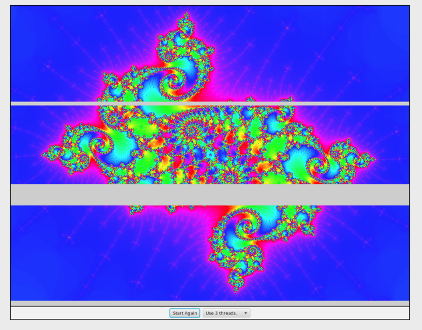

# 스레드를 사용한 프로그래밍

스레드는 프로그래밍에 새로운 복잡성을 도입 하지만 중요한 도구이며 앞으로 더욱 중요해질 것이다. 따라서 모든 프로그래머는 스레드와 함께 사용되는 기본 디자인 패턴 중 일부를 알아야 한다. 이 섹션에서는 몇 가지 기본
기술을 살펴보고 해당 장이 진행됨에 따라 더 많은 기술이 제공될 것이다.

## 1. 스레드 vs 타이머

스레드의 가장 기본적인 용도 중 하나는 설정된 간격으로 정기적인 작업을 수행하는 것이다. 실제로 이것은 매우 기본적이어서 이 작업을 수행하기 위한 특수 클래스가 있으며 이미 섹션 6.3.5에서
소개된 `javax.animation` 패키지의 AnimationTimer 클래스를 사용하여 작업해 보았다. AnimationTimer는 주기적으로 `handler()` 메서드를 호출하여 하위 클래스에서 해당
메서들르 재정의하여 애니메이션을 프로그래밍할 수 있다. 타이머가 도입되기 전에는 비슷한 기능을 구현하기 위해 스레드를 사용해야 했다.

스레드를 사용하여 비슷한 작업을 수행하고 싶다고 가정해 본다. 즉, 우리는 30밀리초 마다 주기적인 간격으로 일부 서브 루틴을 호출하고 싶다. 스레드의 `run()` 메서드는 스레드가 30밀리초 동안 휴면 상태에
있다가 깨어나서 서브 루틴을 호출하는 루프를 실행해야 한다. 섹션 12.1.2에서 논의된 `Thread.sleep()` 메서드를 사용하여 다음과 같이 중첩 클래스에 구현될 수 있다.

```java
private class MyAnimator extends Thread {
    public void run() {
        while (true) {
            try {
                Thread.sleep(30);
            } catch (InterruptedException e) {
            }
            callSubroutine();
        }
    }
}
```

이 클래스를 사용하려면 해당 클래스에 속하는 객체를 만들고 해당 객체의 `start()` 메서드를 호출한다. 현재로서는 스레드가 시작되면 중지할 수 있는 방법이 없다. 이를 가능하게 하는 한 가지 방법은 섹션 12.1.4에서 설명한대로 `volatile` boolean 변수인 `terminate`가 `true`가 될 때 루프를 종료하는 것이다. 스레드 객체는 한 번만 실행될 수 있으므로 이러한 방식으로 애니메이션이 중지된 후 다시 시작하려면 새 스레드를 생성해야 한다. 다음 섹션에서는 스레드를 제어하는 좀 더 다양한 기술을 살펴본다.

스레드를 사용하는 것과 애니메이션에 타이머를 사용하는 것에는 미묘한 차이가 있다. JavaFX AnimationTimer에서 사용되는 스레드는 `handle()` 루틴을 반복적으로 호출하는 것 외에는 아무 작업도 수행하지 않는다. 해당 메서드는 실제로 JavaFX 어플리케이션 스레드에서 실행되며, 이는 구성 요소 다시 그리기 및 사용자 작업에 대한 응답도 처리한다. JavaFX는 스레드로 부터 **안전하지 않기(not thread-safe)** 때문에 이는 중요하다. 즉, GUI 구성 요소와 해당 상태 변수에 엑세스하려는 스레드 간의 경쟁 조건을 피하기 위해 동기화를 사용하지 않는다. 어플리케이션 스레드에서 모든 작업이 완료되면 문제가 없다. 다른 스레드가 GUI 스레드에서도 사용되는 구성 요소나 변수를 조작하려고 하면 문제가 발생할 수 있다. 어떤 경우에는 동기화를 사용하는 것이 해결책이 될 수 있다. 가장 좋은 해결책은 가능하다면 AnimationTimer를 사용하는 것이다. 그러나 정말로 별도의 스레드를 사용해야 하는 경우 `Platform.runLater()`를 사용할 수 있다.

`Platform.runLater()`는 `javafx.application` 패키지의 Platform 클래스에 있는 정적 메서드이다. 매개 변수는 스레드를 생성할 때 사용되는 것과 동일한 인터페이스인 Runnable 유형의 객체이다. `Platform.runLater(r)`은 모든 스레드에서 호출할 수 있다. 그 목적은 JavaFX 어플리케이션 스레드에서 실행되도록 `r`을 제출하는 것이다. `Platform.runLater(r)`은 `r`이 실행될 때 까지 기다리지 않고 즉시 반환한다. `r.run()`은 나중에 어플리케이션 스레드에 의해 호출된다. (즉, 컴퓨터가 지나치게 사용량이 많지 않은 한 1초도 안되는 시간 내에, 아맏도 거의 즉시 호출될 것이다.) Runnables은 제출된 순서대로 실행됩니다. Runnable은 어플리케이션 스레드에서 호출 되므로 동기화 없이 GUI에서 안전하게 작동할 수 있다. Runnable 유형의 람다식으로 `Platform.runLater()`에 대한 매개 변수를 지정하는 것이 편리한 경우가 많다. 이 장과 다음 장의 여러 예제에서 `Platform.runLater()`를 사용할 것이다.

예를 들어 샘플 프로그램 [RandomArtWithThreads.java](https://math.hws.edu/javanotes/source/chapter12/RandomArtWithThreads.java)는 스레드를 사용하여 매우 간단한 애니메이션을 구동한다. 이 예제에서 스레드는 2초마다 `redraw()` 메서드를 호출하는 것 외에는 아무 작업도 수행하지 않는다. 이 메서드는 캔버스의 내용을 다시 그린다. `Platform.runLater()`는 어플리케이션 스레드에서 `redraw()`를 실행하는 데 사용된다. 사용자는 버튼을 클릭하여 애니메이션을 시작하고 중지할 수 있다. 애니메이션이 시작될 때마다 새 스레드가 생성된다. `volatile` boolean 변수인 `running`은 섹션 12.1.4에 설명된 대로 사용자가 애니메이션을 중지할 때 스레드에 대한 중지 신호로 `false`로 설정된다. 스레드는 다음 클래스로 정의된다.

```java
private class Runner extends Thread {
    public void run() {
        while (running) {
            Platform.runLater( () -> redraw() );
            try {
                Thread.sleep(2000);  // Wait two seconds between redraws.
            } catch (InterruptedException e) {
            }
        }
    }
}
```

## 2. 스레드의 재귀

애니메이션을 구동하기 위해 별도의 스레드를 사용하는 한 가지 이유는 스레드가 재귀 알고리즘을 실행하고 재귀 과정에서 디스플레이를 여러 번 다시 그리려는 경우이다. 재귀 알고리즘은 타이머의 일련의 메서드 호출로 나누는 것은 어렵다. 단일 재귀 메서드 호출을 사용하여 재귀를 수행하는 것이 훨씬 더 자연스럽고 스레드에서 수행하는 것도 쉽다.

예를 들어 [QuicksortThreadDemo.java](https://math.hws.edu/javanotes/source/chapter12/QuicksortThreadDemo.java) 프로그램은 애니메이션을 사용하여 배열 정렬을 위한 재귀 QuickSort 알고리즘을 보여준다. 이 경우 배열에는 색상이 포함되어 있으며 목표는 색상을 빨간색에서 보라색까지 표준 스펙트럼으로 정렬하는 것이다. 프로그램에서 사용자는 "시작" 버튼을 클릭하여 프로세스를 시작한다. 색상의 순서는 무작위로 지정되며 QuickSort가 호출되어 색상을 정렬하며 프로세스를 슬로우 모션으로 보여준다. 정렬 중에 "시작" 버튼을 정렬이 자체적으로 완료되기 전에 중단하는 데 사용할 수 있는 "마침" 버튼으로 변경된다.

이 프로그램에서는 알고리즘이 배열을 변경할 때마다 Canvas의 그림이 변경되어야 한다. 배열은 애니메이션 스레드에서 변경되지만 캔버스에 대한 해당 변경은 위에서 설명한 대로 `Platform.runLater()`를 사용하여 JavaFX 어플리케이션 스레드에서 이루어져야 한다. `Platform.runLater()`를 호출할 떄마다 애니메이션 스레드는 어플리케이션 스레드가 `Runnable`을 실행 하고 사용자가 변경 사항을 볼 수 있도록 100밀리초 동안 대기한다. 또한 배열이 무작위로 지정된 직후 정렬이 시작되기까지 1초라는 긴 지연 시간이 있다. 이러한 지연은 코드의 여러 지접에서 발생하므로 `QuicksortThreadDemo`는 `delay()`를 정의한다. 자신을 호출한 스레드를 지정된 기간 동안 휴면 상태로 만드는 메서드이다.

흥미로운 질문은 정렬을 중단하고 스레드를 종료하는 "마침" 버튼을 구현하는 방법이다. 이 버튼을 누르면 `volatile` boolean 변수인 `running`의 값이 스레드에 종료하라는 신호인 `false`로 설정된다. 문제는 알고리즘이 재귀에서 여러 수준 아래에 있는 경우에도 언제든지 이 버튼을 클릭할 수 있다는 것이다. 스레드가 종료되기 전에 모든 재귀 메서드 호출이 반환되어야 한다. 이를 발생시키는 좋은 방법은 예외를 발생시키는 것이다. `QuickSortThreadDemo`는 이러한 목적으로 새로운 예외 클래스인 ThreadTerminationException을 정의한다. `delay()` 메서드를 실행하여 신호 변수의 값 `running`을 확인한다. `running`이 `false`인 경우, `delay()` 메서드는 재귀 알고리즘과 결국 애니메이션 스레드 자체를 종료시키는 예외를 발생시킨다.

```java
private void delay(int millis) {
    if (! running)
        throw new ThreadTerminationException();
    try {
        Thread.sleep(millis);
    } catch (InterruptedException e) {
    }
    if (! running) // Check again, in case it changed during the sleep period.
        throw new ThreadTerminationException();
}
```

ThreadTerminationException은 스레드의 `run()`에서 발생한다.

```java
/**
 * 이 클래스는 재귀적 스레드를 실행하는 스레드를 정의합니다.
 * QuickSort 알고리즘. 스레드는 무작위로 시작됩니다.
 * 색조 배열. 그런 다음 QuickSort()를 호출하여 전체 배열을 정렬합니다.
 * QuickSort()가 ThreadTerminationException에 의해 중단된 경우,
 * 사용자가 마침 버튼을 클릭하면 발생합니다.
 * 그런 다음 스레드는 이전에 정렬된 순서로 배열을 복원합니다.
 * 종료하여 QuickSort가 중단되는지 여부,
 * 배열이 정렬되었습니다. 어쨌든, 결국은,
 * 버튼의 텍스트를 "시작"으로 재설정합니다.
 */
private class Runner extends Thread {
    public void run() {
        for (int i = 0; i < hue.length; i++) {
            // 색상 배열을 인덱스로 순서대로 채웁니다.
            hue[i] = i;
        }
        for (int i = hue.length-1; i > 0; i--) {
            // 색상의 순서를 무작위로 지정합니다.
            int r = (int)((i+1)*Math.random());
            int temp = hue[r];
            hue[r] = hue[i];
            // 이 작업에서 수행해야 할 마지막 할당
            // 루프는 색상[i] = temp입니다. 색상[i]의 값은
            // 이후에는 변경되지 않으므로 할당이 완료됩니다.
            // 변경될 setHue(i,temp) 메소드를 호출하여
            // 배열의 값과 Platform.runLater()도 사용
            // 캔버스에서 i번째 색상 막대의 색상을 변경합니다.
            setHue(i,temp);
        }
        try {
            delay(1000);  // 정렬을 시작하기 전에 1초 정도 기다립니다.
            quickSort(0,hue.length-1);  // 전체 배열 정렬.
        }
        catch (ThreadTerminationException e) {
            // 색상을 다시 정렬된 순서로 되돌립니다. drawSorted()
            // 메소드는 모든 색상 막대를 정렬된 순서로 그립니다.
            Platform.runLater( () -> drawSorted() );
        }
        finally {
            running = false;  // 실행 중이 거짓인지 확인합니다. 이것은 단지
                                // 스레드가 종료된 경우 실제로 필요합니다.
                                // 보통
            Platform.runLater( () -> startButton.setText("Start") );
        }
    }
}
```

프로그램은 Runner 유형의 변수 `runner`를 사용하여 정렬을 수행하는 스레드를 나타낸다. 사용자가 "시작" 버튼을 클릭하면 다음 코드가 실행되어 스레드를 생성하고 시작한다.

```java
startButton.setText("Finish");
runner = new Runner();
running = true;
runner.start();
```

신호 변수 `running`의 값은 스레드를 시작하기 전에 `true`로 설정된다. 스레드가 시작될 때 `running`이 `false`인 경우 스레드는 시작하자마자 해당 값을 확인하고 이를 작업을 수행하기 전에 중지하라는 신호로 해석할 수 있다. `runner.start()`가 호출 되면 `runner`는 이를 호출한 스레드와 병렬로 실행을 시작한다는 점을 기억하자.

사용자가 "마침" 버튼을 클릭하면 스레드에 대한 종료 신호로 `running` 값이 `false`로 설정된다. 그러나 "마침" 버튼을 눌렀을 때 스레드가 휴면 상태일 수 있으며, 이 경우 스레드는 신호에 대해 조치를 취하기 전에 깨어나야 한다. 스레드의 반응성을 좀 더 높이기 위해 프로그램은 `runner.interrupt()`를 호출하여 스레드가 휴면 상태일 때 이를 깨운다. 이는 이 프로그램에서 실질적인 효과가 별로 없지만 스레드가 잠자기 상태인 동안 사용자가 "시작"을 누른 후 즉시 "마침"을 누르면 프로그램은 눈에 띄게 더 빠르게 응답하고록 만든다.

## 3. 백그라운드 계산을 위한 스레드

GUI 프로그램이 응답성을 가지려면, 즉 이벤트가 생성된 후 즉시 응답하려면 프로그램의 이벤트 처리 방법이 작업을 매우 빠르게 완료하는 것이 중요하다. 이벤트가 생성되면 대기열에 들어가고 컴퓨터는 이전 이벤트에 대한 이벤트 처리기 메서드가 작업을 완료할 때까지 이벤트에 응답할 수 없다는 점을 기억하세요. 이는 하나의 이벤트 핸들러가 실행되는 동안 다른 이벤트가 기다려야 함을 의미한다. 이벤트 핸들러를 실행하는 데 시간이 걸리면 해당 시간 동안 사용자 인터페이스가 사실상 정지된다. 지연이 1초 이상이면 매우 짜증스러울 수 있다. 다행스럽게도 현대 컴퓨터는 1초도 안 되는 시간에 엄창난 양의 계산을 수행할 수 있다. 

그러나 일부 계산은 너무 커서 이벤트 핸들러 (또는, `Platform.runLater()`에 전달된 Runnable)에서 수행할 수 없다. 이 경우 해결책은 이벤트 처리 스레드와 병렬로 실행되는 다른 스레드에서 계산을 수행하는 것이다. 이를 통해 계산이 진행되는 동안에도 컴퓨터가 사용자 이벤트에 응답할 수 있다. 우리는 계산이 "백그라운드에서" 수행된다고 말한다.

이 스레드 적용은 이전 예제와 매우 다르다. 스레드를 사용하여 간단한 애니메이션을 구동하는 경우 실제로는 거의 작업을 수행하지 않는다. 스레드는 초당 여러 번 깨어나고 몇 가지 계산을 수행하여 애니메이션의 다음 프레임에 대한 상태 변수를 업데이트한 다음 해당 프레임이 그려지도록 준비하면 된다. 이로 인해 JavaFX 어플리케이션 스레드가 필요한 GUI가 다시 그리기를 수행하고 다른 이벤트를 처리하기 위해 애니메이션 스레드가 프레임 사이에서 대기하는 동안 충분한 시간이 남는다.

그러나 스레드가 백그라운드 계산에 사용될 때 우리는 컴퓨터가 계산 작업을 가능한 한 바쁘게 유지하려고 한다. 스레드는 이벤트 처리 스레드와 프로세서 시간을 놓고 경쟁한다. 주의하지 않으면 이벤트 처리 (특히 다시 그리기)가 여전히 지연될 수 있다. 다행히도 스레드 우선순위를 사용하여 문제를 피할 수 있다. 이벤트 처리 스레드보다 낮은 우선 순위로 실행되도록 계산 스레드를 설정하면 이벤트가 최대한 빨리 처리되는 동시에 계산 스레드가 모든 추가 처리 시간을 확보하게 된다. 이벤트 처리는 일반적으로 매우 적은 시간을 사용하므로 이는 대부분의 처리 시간이 백그라운드 계산에 사용되지만 인터페이스의 반응성은 여전히 매우 높다는 것을 의미한다. (스레드의 우선순위는 섹션 12.1.1에 나왔다.)

샘플 프로그램 [BackgroundComputationDemo.java](https://math.hws.edu/javanotes/source/chapter12/BackgroundComputationDemo.java)는 백그라운드 처리의 예이다. 이 프로그램은 이미지의 각 픽셀 색상을 계산하는 데 약간의 계산이 필요하기 때문에 계산하는 데 시간이 걸리는 이미지를 생성한다. 이미지 자체는 만델브로 집합(Mandelbrot set)으로 알려진 수학적 객체의 일부이다. 이 장에서는 여러 예제에서 동일한 이미지를 사용할 것이다.

개요적으로 `BackgroundComputationDemo`는 위에서 설명한 `QuicksortThreadDemo`와 유사하다. 계싼은 중첩 클래스 Runner에 의해 정의된 스레드에서 수행된다. `volatile` boolean 변수인 `running`은 스레드를 제어하는 데 사용된다. `running` 값이 `false`로 설정 되면 스레드가 종료되어야 한다. 샘플 프로그램에는 사용자가 계산을 시작하고 중단하기 위해 클릭하는 버튼이 있다. 차이점은 이 경우 스레드는 절전 모드 없이 계속 실행된다는 점이다. 사용자가 계산이 진행되고 있음을 볼 수 있도록 하려면 스레드가 픽셀 행을 계산할 때마다 다음을 사용한다. `Platform.runLater()`는 해당 픽셀을 화면에 표시되는 이미지에 복사한다. 사용자는 이미지가 할 줄씩 구성되는 것을 볼 수 있다.

"시작" 버튼에 대한 응답으로 계산 스레드가 생성되면 JavaFX 어플리케이션 스레드 보다 낮은 우선 순위로 실행되도록 설정해야 한다. 스레드를 생성하는 코드 자체는 이벤트 처리 스레드에서 실행되므로 코드를 실행하는 스레드의 우선 순위보다 하나 낮은 우선순위를 사용할 수 있다. 우선순위는 `try..catch`문 내부에서 설정된다. 스레드 우선순위를 결정하는 동안 오류가 발생하면 프로그램은 계속 작동하지 않지만 우선순위가 올바르게 설정된 경우만큼 매끄럽지 않을 수 있다. 스레드가 생성되고 시작되는 방법은 다음과 같다.

```java
runner = new Runner();
try {
    runner.setPriority( Thread.currentThread().getPriority() - 1 );
} catch (Exception e) {
    System.out.println("Error: Can't set thread priority: " + e);
}
running = true;  
runner.start();
```

`BackgroundComputationDemo`는 정상적으로 작동 하지만 한 가지 문제가 있다. 목표는 사용 가능한 모든 처리 시간을 사용하여 최대한 빨리 계산을 완료하는 것이다. 이 프로그램은 프로세서가 하나만 있는 컴퓨터에서 해당 목표를 달성한다. 그러나 여러 프로세서가 있는 컴퓨터에서는 여전히 계산에 해당 프로세서 중 하나만 사용한다. (실제로 이 경우 스레드 우선순위에 대한 비즈니스는 그다지 관련성이 없다. 왜냐하면 애니메이션 스레드와 어필리케이션 스레드가 서로 다른 프로세서에서 동시에 실행될 수 있기 때문이다.) 모든 프록세서가 작동하도록 하는 것이 좋을 것이다. 이를 위해서는 여러 계산 스레드를 사용하는 실제 병렬 처리가 필요하다. 


## 4. 다중 처리를 위한 스레드

다음 예제인 [MultiprocessingDemo1.java](https://math.hws.edu/javanotes/source/chapter12/MultiprocessingDemo1.java)는 `BackgroundComputationDemo`의 변형이다. 단일 스레드에서 계산을 수행하는 대신 `MultiprocessingDemo1`은 문제를 여러 스레드로 나눌 수 있다. 사용자는 사용할 스레드 수를 선택할 수 있다. 각 스레드에는 계산할 이미지의 한 섹션이 할당된다. 스레드는 작업을 병렬로 수행한다. 예를 들어, 두 개의 스레드가 있는 경우 첫 번째 스레드는 이미지의 위쪽 절반을 계산하고 두 번째 스레드는 아래쪽 절반을 계산한다. 다음은 세 개의 스레드를 사용한 계산이 거의 끝나가는 프로그램의 그림이다. 회색 영역은 아직 계산되지 않은 이미지 부분을 나타낸다.



프로그램을 사용해 봐야 한다. 다중 프로세서 컴퓨터에서는 스레드 하나만 사용할 때 보다 여러 스레드를 사용할 때 계산이 더 빨리 완료된다. 하나의 스레드를 사용할 때 이 프로그램은 이전 예제 프로그램과 동일한 동작을 수행한다.

스레드 간의 문제를 분할하기 위해 이 예에서 사용된 접근 방식은 최적이 아니다. 다음 섹션에서 어떻게 개선할 수 있는지 살펴본다.

사용자가 "시작" 버튼을 클릭하면 프로그램은 지정된 수의 스레드를 생성하고 시작해야 하며 각 스레드에 이미지 세그먼트를 할당해야 한다.

```java
workers = new Runner[threadCount];      // 계산 스레드를 보유합니다.
int rowsPerThread;                      // 각 스레드는 몇 행의 픽셀을 계산해야 합니까?
rowsPerThread  = height / threadCount;  // (높이 = 이미지의 세로 크기)
running = true;                          // 스레드를 시작하기 전에 신호를 설정하십시오!
threadsCompleted = 0;                   // 종료된 스레드 수를 기록합니다.
for (int i = 0; i < threadCount; i++) {
    int startRow;                       // 스레드 번호 i로 계산된 첫 번째 행
    int endRow;                         // 스레드 번호 i로 계산된 마지막 행
        
    // 스레드를 생성하고 시작하여 이미지 행을 계산합니다.
    // startRow에서 endRow까지. 우리는 다음을 확인해야 합니다.
    // 마지막 스레드의 endRow는 이미지의 맨 아래 행입니다.
        
    startRow = rowsPerThread*i;
    if (i == threadCount-1)
        endRow = height-1;
    else
        endRow = rowsPerThread*(i+1) - 1;
    workers[i] = new Runner(startRow, endRow);
    try {
        workers[i].setPriority( Thread.currentThread().getPriority() - 1 );
    } catch (Exception e) {
    }
    workers[i].start();
}
```

둘 이상의 스레드를 생성하는 것 외에 다중 처리의 이점을 얻기 위해 필요한 변경 사항은 거의 없다. 이전 예제와 마찬가지로 스레드는 픽셀 행의 색상을 계산할 때 마다 `Platform.runLater()`를 사용하여 해당 행을 이미지에 복사한다.

그러나 한 가지 새로운 사실이 있다. 모든 스레드 실행이 완료되면 프로그램의 버튼 이름이 "Abort"에서 "Start Again"으로 변경되고, 스레드 실행 중에 비활성화되었언 팝업 메뉴가 다시 활성화된다. 문제는 모든 스레드가 언제 종료되었는지 어떻게 알 수 있느냐는 것이다. 이 예에서는 인스턴스 변수 `threadRunning`을 사용하여 아직 실행 중인 계산 스레드 수를 추적한다. 각 스레드가 완료되면 이 변수의 값에서 1을 빼는 메서드를 호출한다. 스레드가 끝날 때 호출되는지 절대적으로 확인하기 위해 `try`문의 `finally`절을 사용한다. 실행 중인 스레드 수가 0으로 떨어지면 메서드는 프로그램의 상태를 적절하게 업데이트 한다. 종료 직전에 각 스레드가 호출하는 메서드는 다음과 같다.

```java
synchronized private void threadFinished() {
    threadsRunning--;
    if (threadsRunning == 0) { // 모든 스레드가 완료되었습니다.
        Platform.runLater( () -> {
            // 스레드가 종료될 때 GUI 상태가 올바른지 확인합니다.
            startButton.setText("Start Again");
            startButton.setDisable(false);
            threadCountSelect.setDisable(false);
        });
        running = false; // 스레드가 끝난 후 실행이 false인지 확인합니다.
        workers = null;  // 스레드를 보유하는 배열을 삭제합니다.
    }
}
```

이 메서드는 `synchronized`이다. 이는 `threadsRunning`이 감소 할 때 경쟁 조건을 피하기 위한 것이다. 동기화하지 않으면 두 스레드가 동시에 메서드를 호출할 수 있다. 타이밍이 적절하다면 두 스레드 모두 `threadRunning`에 대해 동일한 값을 읽고 이를 감소시킬 때 동일한 응답을 얻을 수 있다. 최종 결과는 `threadRunning`이 2가 아닌 1만큼 감소한다는 것이다. 하나의 스레드가 제대로 계산되지 않고 `threadRunning`이 결코 0이 되지 않는다. 프로그램이 일종의 **교착 상태(deadlock)** 에 빠지게 된다. 문제는 정확한 타이밍에 따라 달라지므로 매우 드물게 발생한다. 그러나 대규모 프로그램에서는 이런 종류의 문제가 매우 심각하고 디버그하기가 매우 어려울 수 있다. 적절한 동기화로 인해 오류가 발생하지 않는다.


