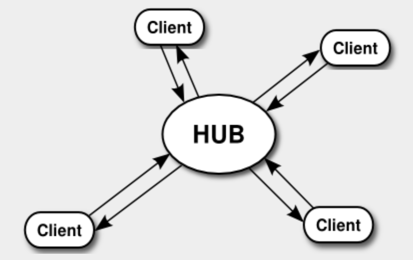
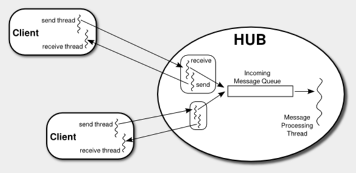

# 네트워크 프로그래밍 예제: 네트워크 게임 프레임워크

이 섹션 에서는 네트워킹과 스레드를 사용하는 여러 프로그램을 소개한다. 각 응용 프로그램의 일반적인 문제는 서로 다른 컴퓨터에서 실행되는 여러 프로그램 간의 네트워크 통신을 지원하는 것이다. 이러한 응용 프로그램의 일반적인 예는 두 명 이상의 플레이어가 참여하는 네트워크 게임이지만 덜 사소한 응용 프로그램에서도 동일한 문제가 발생할 수 있다. 이 섹션의 첫 번째 부분에서는 다양한 애플리케이션에 사용할 수 있는 프레임워크를 설명하고, 섹션의 나머지 부분에서는 해당 프레임워크를 사용하는 세 가지 특정 애플리케이션에 대해 설명할 것이다. 이것은 상당히 복잡한 예이며 아마도 이 책에서 가장 복잡한 예일 것이다. 네트워킹에 대한 기본적인 이해를 위해 이를 이해하는 것이 필수적인 것은 아니다.

이 섹션은 수업의 마지막 프로젝트로 네트워크 포커 게임을 작성하기를 원했던 두 학생, Alexander Kittelberger와 Kieran Koehnlein에게서 영감을 받았다. 플레이어 간의 의사소통을 지원하는 기본 프레임워크를 작성하여 프로젝트의 네트워크 부분에서 그들을 도왔다. 이 애플리케이션은 다양한 중요한 아이디어를 보여주기 때문에 이 책에는 해당 프레임워크의 좀 더 발전되고 일반적인 버전을 포함하기로 결정했다. 이 섹션의 마지막 예는 네트워크 포커 게임이다.

<hr>

## 1. 넷게임 프레임워크

네트워크를 통해 다양한 게임을 플레이하는 것을 상상할 수 있을 것이다. 네트워크에 관한 한 모든 게임에는 최소한 한 가지 공통점이 있다. 즉, 한 플레이어가 취한 조치가 네트워크를 통해 다른 플레이어에게 전달될 수 있는 방법이 있어야 한다는 것이다. 다양한 게임에서 사용할 수 있는 재사용 가능한 공통 코어에서 해당 기능을 사용할 수 있도록 하는 것이 프로그래밍에 적합하다. 이는 `netgame.common` 패키지의 여러 클래스에 의해 정의된다.

내장 클래스를 사용하는 것 외에는 이 책에서 패키지에 대해 많은 작업을 수행하지 않았다. 패키지는 하위 섹션 2.6.6 에서 소개되었지만 프로그래밍 예제에서는 "기본 패키지"를 고수했다. 그러나 실제로 패키지는 가장 간단한 프로그래밍 프로젝트를 제외한 모든 프로젝트에서 코드를 관련 클래스 그룹으로 나누는 데 사용된다. 다양한 프로젝트에 하나의 단위로 포함될 수 있는 패키지에 재사용 가능한 프레임워크를 정의하는 것이 특히 좋다.

Eclipse와 같은 통합 개발 환경을 사용하면 패키지 사용이 매우 쉽다. IDE의 프로젝트에서 netgame 패키지를 사용하려면 전체 netgame 디렉터리를 프로젝트에 복사하여 붙여넣기만 하면 된다. 물론, 넷게임은 JavaFX를 사용하기 때문에 섹션 2.6 에서 설명한 대로 JavaFX를 지원하도록 구성된 Eclipse 프로젝트를 사용해야 한다.

명령줄에서 작업하는 경우 netgame 디렉터리를 하위 디렉터리로 포함하는 작업 디렉터리에 있어야 한다. javac 및 java 명령 에 JavaFX 옵션을 추가해야 한다. 하위 섹션 2.6.7 에서 설명한 대로 JavaFX 옵션이 포함된 javac 및 java 와 동일한 jfxc 및 jfx 명령을 정의했다고 가정해 보자. 그런 다음 netgame.common 패키지의 모든 Java 파일을 컴파일하려면 예를 들어 MacOS 또는 Linux에서 다음 명령을 사용할 수 있다.

`jfxc netgame/common/*.java`

Windows의 경우 슬래시 대신 백슬래시를 사용해야 한다.

`jfxc netgame\common\*.java`

netgame의 다른 하위 패키지에 정의되어 있는 이 섹션의 예제에 대한 소스 코드를 컴파일하려면 유사한 명령이 필요하다.

패키지에 정의된 기본 프로그램을 실행하려면 해당 패키지가 하위 디렉터리로 포함된 디렉터리에 있어야 하며, 실행하려는 클래스의 전체 이름을 사용해야 한다. 예를 들어 이 섹션의 뒷부분에서 설명할 `ChatRoomWindow` 클래스는 netgame.chat 패키지에 정의되어 있으므로 다음 명령을 사용하여 실행한다.

`jfx netgame.chat.ChatRoomWindow`

이 섹션에서 설명하는 응용 프로그램은 네트워크를 통해 통신하는 여러 컴퓨터를 포함하므로 분산 컴퓨팅의 예이다. 하위 섹션 12.4.5 의 예와 마찬가지로 다수의 "클라이언트"가 연결될 중앙 "서버" 또는 "마스터"를 사용한다. 모든 통신은 서버를 통해 이루어진다. 클라이언트는 다른 클라이언트에게 직접적으로 메시지를 보낼 수 없다. 이 섹션에서는 "통신 허브"라는 의미에서 서버를 **허브**라고 하겠다.



이해해야 할 주요 사항은 다음과 같다. 클라이언트가 시작되기 전에 허브가 실행 중이어야 한다. 클라이언트는 허브에 연결하고 허브에 메시지를 보낼 수 있다. 허브는 클라이언트의 모든 메시지를 수신된 순서대로 순차적으로 처리한다. 처리로 인해 허브가 하나 이상의 클라이언트에 메시지를 보낼 수 있다. 각 클라이언트는 고유한 ID 번호로 식별된다. 이는 다양한 애플리케이션에서 사용할 수 있는 프레임워크이며, 메시지와 처리는 특정 애플리케이션에 의해 정의된다. 자세한 내용은 다음과 같다.

하위 섹션 12.4.5 에서는 메시지가 명확하고 미리 결정된 순서에 따라 서버와 클라이언트 사이에서 앞뒤로 전송되었다. 서버와 클라이언트 간의 통신은 실제로는 서버에서 실행되는 한 스레드와 클라이언트에서 실행되는 다른 스레드 간의 통신이었다. 그러나 넷게임 프레임워크의 경우 메시지가 예측 가능한 순서로 도착할 때까지 기다릴 수 없는 비동기 통신을 허용하고 싶다. 이를 가능하게 하기 위해 넷게임 클라이언트는 통신을 위해 두 개의 스레드를 사용한다. 하나는 허브에 메시지를 보내기 위한 것이고 다른 하나는 허브로부터 메시지를 받기 위한 것이다. 마찬가지로, 넷게임 허브는 각 클라이언트와 통신하기 위해 두 개의 스레드를 사용한다.

허브는 일반적으로 많은 클라이언트에 연결되어 있으며 언제든지 해당 클라이언트로부터 메시지를 받을 수 있다. 허브는 어떤 방식으로든 각 메시지를 처리해야 한다. 이 처리를 구성하기 위해 허브는 단일 스레드를 사용하여 들어오는 모든 메시지를 처리한다. 통신 스레드가 클라이언트로부터 메시지를 받으면 해당 메시지를 수신 메시지 대기열에 넣기만 하면 된다. 모든 클라이언트의 메시지에 사용되는 대기열은 하나만 있다. 메시지 처리 스레드는 큐에서 메시지를 제거하고, 처리하고, 큐에서 다른 메시지를 제거하고, 처리하는 등의 루프에서 실행된다. 큐 자체는 `LinkedBlockingQueue` 유형의 객체로 구현된다 ( 하위 섹션 12.3.3 참조 ).



허브에는 그림에 표시되지 않은 스레드가 하나 더 있다. 이 마지막 스레드는 `ServerSocket` 을 생성하고 이를 사용하여 클라이언트의 연결 요청을 수신한다. 연결 요청을 수락할 때마다 해당 클라이언트와의 통신을 처리할 중첩 클래스 `ConnectionToClient`에 의해 정의된 다른 개체에 클라이언트 소켓을 전달한다. 연결된 각 클라이언트는 ID 번호로 식별된다. ID 번호 1, 2, 3, ...은 클라이언트가 연결될 때 할당된다. 클라이언트도 연결을 끊을 수 있으므로 언제든지 연결된 클라이언트에는 연속된 ID가 없을 수 있다. `TreeMap<Integer,ConnectionToClient>` 유형의 변수는 연결된 클라이언트의 ID 번호를 해당 연결을 처리하는 개체와 연결합니다.

보내고 받는 메시지는 객체다. 객체를 읽고 쓰는 데 사용되는 I/O 스트림은 `ObjectInputStream` 및 `ObjectOutputStream` 유형이다. ( 하위 섹션 11.1.6 참조 .) 소켓의 출력 스트림은 해당 소켓을 통해 객체를 전송할 수 있도록 `ObjectOutputStream`에 래핑된다. 소켓의 입력 스트림은 객체 수신을 가능하게 하기 위해 `ObjectInputStream` 으로 래핑된다. 이러한 스트림과 함께 사용되는 객체는 `java.io.Serialized` 인터페이스를 구현해야 한다!

netgame Hub 클래스는 `netgame.common` 패키지의 `Hub.java` 파일에 정의되어 있다. 서버 소켓이 수신할 포트는 허브 생성자에 대한 매개변수로 지정되어야 한다. `Hub` 클래스는 메소드를 정의한다.

`rotected void messageReceived(int playerID, Object message)`

일부 클라이언트의 메시지가 메시지 대기열 맨 앞에 도착하면 메시지 처리 스레드가 해당 메시지를 대기열에서 제거하고 이 메서드를 호출한다. 이는 클라이언트의 메시지가 실제로 처리되는 지점이다.

첫 번째 매개변수인 `playerID`는 메시지를 받은 클라이언트의 ID 번호이고, 두 번째 매개변수는 메시지 자체이다. `Hub` 클래스 에서 이 메서드는 연결된 모든 클라이언트에 메시지 복사본을 전달한다. 이는 허브로 들어오는 메시지에 대한 기본 처리를 정의한다. 메시지를 전달하기 위해 플레이어 ID 와 메시지를 `ForwardedMessage` 유형의 객체 ( netgame.common 패키지의 ForwardedMessage.java 파일에 정의됨 )로 래핑한다. 다음 하위 섹션 에서 설명하는 채팅방과 같은 간단한 애플리케이션에서는 이 기본 처리가 애플리케이션에 정확히 필요한 것일 수 있다. 그러나 대부분의 애플리케이션에서는 더 복잡한 메시지 처리를 수행하기 위해 `Hub` 의 하위 클래스를 정의하고 `messageReceived()` 메서드를 재정의 해야 한다. `Hub` 클래스에는 하위 클래스에서 재정의할 수 있는 여러 가지 다른 메서드가 있다.

```java
protected void playerConnected(int playerID) — 이 메서드는 플레이어가 허브에 연결할 때마다 호출된다. 
playerID 매개변수는 새로 연결된 플레이어의 ID 번호이다. Hub 클래스 에서 이 메서드는 아무 작업도 수행하지 않는다.
(허브는 이미 새 플레이어에 대해 알리기 위해 모든 클라이언트에 StatusMessage를 보냈다. 
playerConnected() 는 허브 의 하위 클래스가 수행할 수 있는 추가 작업을 위한 것이다.) 
현재 연결된 플레이어의 전체 ID 번호 목록은 getPlayerList() 를 호출하여 얻을 수 있다.

protected void playerDisconnected(int playerID) — 플레이어가 허브에서 연결을 끊을 때마다 (허브가 클라이언트에 StatusMessage를 보낸 후) 호출된다. 
매개변수는 어떤 플레이어가 방금 연결을 끊었는지 알려준다. Hub 클래스 에서 이 메서드는 아무 작업도 수행하지 않는다.
```

`Hub` 클래스는 또한 여러 가지 유용한 public 메소드를 정의한다.
```java
sendToAll(message) — 현재 허브에 연결된 모든 클라이언트에 지정된 메시지를 보낸다.
        메시지는 직렬화 가능 인터페이스 를 구현하는 null이 아닌 객체여야 한다.
        
sendToOne(recipientID,message) — 지정된 메시지를 한 명의 사용자에게만 보낸다. 
        첫 번째 매개변수인 receiveID 는 메시지를 받을 클라이언트의 ID 번호이다.
        이 메서드는 부울 값을 반환하며, 지정된 receiveID 에 연결된 클라이언트가 없으면 false이다.
        
shutdownServerSocket() — 추가 클라이언트가 연결할 수 없도록 허브의 서버 소켓을 종료한다. 
        예를 들어 두 번째 클라이언트가 연결된 후 2인 게임에서 사용할 수 있다.
        
setAutoreset(autoreset) — autoreset 속성 의 부울 값을 설정한다. 
        이 속성이 true 이면 클라이언트에 메시지를 전송하는 데 사용되는 ObjectOutputStreams는 각 메시지가 전송되기 전에 자동으로 재설정된다.
        기본값은 false이다. ( ObjectOutputStream 재설정은 객체가 스트림에 기록되고 수정된 후 다시 스트림에 기록되는 경우 수행해야 하는 작업이다. 
        수정된 객체를 기록하기 전에 스트림이 재설정되지 않으면 수정되지 않은 이전 값이 전송된다. 
        새로운 값 대신 스트림에 적용된다. 이 기술에 대한 논의는 하위 섹션 11.1.6을 참조하라. 
        선호되는 솔루션은 통신에 불변 객체만 사용하는 것이다. 이 경우 재설정이 필요하지 않다.)
```

자세한 내용과 이 모든 것이 어떻게 구현되는지 보려면 소스 코드 파일 `Hub.java`를 읽어야 한다. 약간의 노력과 연구를 통해 해당 파일의 모든 내용을 이해할 수 있을 것이다. (그러나 이를 기반으로 애플리케이션을 작성하려면 `Hub` 와 넷게임 프레임워크의 다른 클래스의 public 및 protected 인터페이스만 이해하면 된다.)

<hr>

클라이언트 측으로 돌아가면 기본 netgame 클라이언트 클래스는 `netgame.common` 패키지의 `Client.java` 파일에 정의되어 있다. `Client` 클래스에는 클라이언트가 연결할 허브의 호스트 이름(또는 IP 주소)과 포트 번호를 지정하는 생성자가 있다. 이 생성자는 연결이 설정될 때까지 차단된다.

클라이언트는 `abstract` 클래스이다. 모든 넷게임 애플리케이션은 `Client`의 하위 클래스를 정의하고 추상 메서드에 대한 정의를 제공 해야 한다.

`abstract protected void messageReceived(Object message);`

이 메소드는 넷게임 허브로부터 메시지가 수신될 때마다 호출된다. 클라이언트의 하위 클래스는 protected 메서드인 `playerConnected`, `playerDisconnected`, `serverShutdown` 및 `ConnectionClosedByError`를 재정의할 수도 있다. 자세한 내용은 소스 코드를 참조하라. 또한 `Client`에는 현재 허브에 연결된 모든 클라이언트의 ID 번호를 포함하는 배열 인 int[] 유형의 보호된 인스턴스 변수 `linkedPlayerIDs`가 포함되어 있다는 점에 유의해야 한다. `Client` 클래스 에서 제공하는 가장 중요한 public 메소드는 다음과 같다.

```java
send(message) — 허브에 메시지를 전송한다. 
메시지 는 직렬화 가능 인터페이스 를 구현하는 null이 아닌 객체일 수 있다.
        
getID() — 허브가 이 클라이언트에 할당한 ID 번호를 가져온다.
        
disconnect() — 허브에 대한 클라이언트 연결을 닫는다. 
연결을 끊은 후에는 메시지를 보낼 수 없다. 
send() 메소드는 그렇게 하려고 시도하는 경우 IllegalStateException을 발생시킨다.
```

`Hub` 및 `Client` 클래스는 다양한 네트워크 게임 및 기타 분산 프로그램의 기반으로 사용할 수 있는 일반 프레임워크를 정의하기 위한 것이다. 네트워크 통신 및 멀티스레딩에 대한 낮은 수준의 세부 정보는 이러한 클래스의 비공개 섹션에 숨겨져 있다. 이러한 클래스를 기반으로 구축된 애플리케이션은 플레이어 및 메시지와 같은 더 높은 수준의 개념 측면에서 작동할 수 있다. 이러한 클래스의 디자인은 여러 실제 애플리케이션 경험을 바탕으로 여러 번의 반복을 통해 개발되었다. 허브와 클라이언트가 스레드, 소켓 및 I/O 스트림을 사용하는 방법을 보려면 소스 코드를 살펴보시기 바란다. 이 섹션의 나머지 부분에서는 넷게임 프레임워크를 기반으로 구축된 세 가지 애플리케이션에 대해 설명할 예정이다. 이러한 응용 프로그램에 대해서는 자세히 설명하지 않는다. netgame 패키지 에서 세 가지 모두에 대한 전체 소스 코드를 찾을 수 있다.

<hr>

## 2. 간단한 채팅방

첫 번째 예는 사용자가 서버에 연결한 다음 해당 방의 모든 현재 사용자가 볼 수 있는 메시지를 게시할 수 있는 네트워크 애플리케이션인 "chatting room"이다. 이는 원하는 수의 사용자가 채팅에 참여할 수 있다는 점을 제외하면 하위 섹션 12.4.2 의 GUIChat 프로그램과 유사하다. 이 애플리케이션은 게임은 아니지만 넷게임 프레임워크의 기본 기능을 보여준다.

채팅방 애플리케이션은 두 가지 프로그램으로 구성됩니다. 첫 번째 `ChatRoomServer.java`는 넷게임 클라이언트의 연결 요청을 수신하기 위해 넷게임 허브를 생성하는 완전히 간단한 프로그램이다.

```java
public static void main(String[] args) {
    try {
        new Hub(PORT);
    }
    catch (IOException e) {
        System.out.println("Can't create listening socket.  Shutting down.");
    }
}
```

포트 번호 `PORT` 는 프로그램에서 상수로 정의되며 서버와 클라이언트가 모두 동일한 포트를 사용하는 한 임의적이다. ChatRoom은 하위 클래스가 아닌 `Hub` 클래스 자체를 사용한다.

채팅방 애플리케이션의 두 번째 부분은 `ChatRoomWindow.java` 프로그램으로, 채팅방에 참여하려는 사용자가 실행하도록 되어 있다. 잠재적인 사용자는 허브가 실행 중인 컴퓨터의 이름(또는 IP 주소)을 알아야 한다. (테스트를 위해 허브가 실행되는 컴퓨터 이름으로 localhost를 사용하여 허브와 동일한 컴퓨터에서 클라이언트 프로그램을 실행할 수 있다.) `ChatRoomWindow`가 실행되면 대화 상자를 사용하여 사용자에게 요청한다. 이 정보. 그런 다음 채팅방에 대한 사용자 인터페이스 역할을 하는 창이 열린다. 창에는 사용자가 채팅방에 게시한 메시지를 표시하는 큰 대화 내용 영역이 있다. 또한 사용자가 메시지를 입력할 수 있는 텍스트 입력 상자도 있다. 사용자가 메시지를 입력하면 해당 메시지가 허브에 연결된 모든 사용자의 기록에 게시되므로 모든 사용자는 모든 사용자가 보낸 모든 메시지를 볼 수 있다. 프로그래밍의 일부를 살펴보자.

모든 넷게임 애플리케이션은 추상 클라이언트 클래스의 하위 클래스를 정의해야 한다. 채팅방 애플리케이션의 경우 클라이언트는 `ChatRoomWindow` 내부의 중첩 클래스 `ChatClient`에 의해 정의된다. 프로그램에는 허브에 대한 프로그램의 연결을 나타내는 `ChatClient` 유형의 인스턴스 변수인 `Connection`이 있다. 사용자가 메시지를 입력하면 해당 메시지는 `connection.send(message);` 호출을 통해 허브로 전송된다.

허브가 메시지를 받으면 메시지를 보낸 클라이언트의 ID 번호와 함께 `ForwardedMessage` 유형의 개체로 패키징한다. 허브는 메시지를 보낸 클라이언트를 포함하여 연결된 모든 클라이언트에 해당 `ForwardedMessage`의 복사본을 보낸다. 각 클라이언트의 클라이언트 측에서는 허브로부터 메시지가 수신되면 해당 클라이언트에 있는 `ChatClient` 개체의 `messageReceived()` 메서드가 호출된다. `ChatClient`는 이 메서드를 재정의하여 `ChatClientWindow`의 기록에 메시지를 추가하도록 프로그래밍한다. 요약하자면, 사용자가 입력한 모든 메시지는 허브로 전송되며, 허브는 수신한 각 메시지의 복사본을 모든 클라이언트에게 보낸다. 각 클라이언트는 허브에서 정확히 동일한 메시지 스트림을 보게 된다.

플레이어가 허브에 연결하거나 연결을 끊을 때, 그리고 허브와의 연결이 끊어졌을 때도 클라이언트에 알림이 전송된다. `ChatClient`는 이러한 이벤트가 발생할 때 호출되는 메서드를 재정의하여 적절한 메시지를 기록에 게시한다. 채팅방 애플리케이션에 대한 클라이언트 클래스의 전체 정의는 다음과 같다.

```java
/**
 * A ChatClient connects to the Hub and is used to send messages to
 * the Hub and receive messages from the Hub.  Messages received from
 * the Hub will be of type ForwardedMessage and will contain the
 * ID number of the sender and the string that was sent by
 * that user.
 */
private class ChatClient extends Client {

    /**
     * Opens a connection to the chat room server on a specified computer.
     */
    ChatClient(String host) throws IOException {
        super(host, PORT);
    }

    /**
     * Responds when a message is received from the server.  It should be
     * a ForwardedMessage representing something that one of the participants
     * in the chat room is saying.  The message is simply added to the
     * transcript, along with the ID number of the sender.
     */
    protected void messageReceived(Object message) {
        if (message instanceof ForwardedMessage) {  
                  // (no other message types are expected)
            ForwardedMessage bm = (ForwardedMessage)message;
            addToTranscript("#" + bm.senderID + " SAYS:  " + bm.message);
        }
    }

    /**
     * Called when the connection to the client is shut down because of some
     * error message.  (This will happen if the server program is terminated.)
     */
    protected void connectionClosedByError(String message) {
        addToTranscript(
           "Sorry, communication has shut down due to an error:\n     " 
                                     + message );
        Platform.runLater( () -> {
            sendButton.setDisable(true);
            messageInput.setEditable(false);
            messageInput.setDisable(true);
            messageInput.setText("");
        });
        connected = false;
        connection = null;
    }

    /**
     * Posts a message to the transcript when someone joins the chat room.
     */
    protected void playerConnected(int newPlayerID) {
        addToTranscript(
                "Someone new has joined the chat room, with ID number " 
                + newPlayerID );
    }

    /**
     * Posts a message to the transcript when someone leaves the chat room.
     */
    protected void playerDisconnected(int departingPlayerID) {
        addToTranscript( "The person with ID number " 
                            + departingPlayerID + " has left the chat room");
    }

} // end nested class ChatClient
```

생성자를 제외하고 `ChatClient` 클래스의 어떤 메서드도 `ChatRoomWindow` 프로그램에서 호출되지 않는다. 이는 `Client.java` 에 프로그래밍된 클라이언트 객체의 연결 처리 스레드에서 호출된다. 채팅방 애플리케이션의 전체 소스 코드는 netgame.chat 패키지에 있는 소스 코드 파일을 참조하라.

참고: 내 채팅방 애플리케이션의 사용자는 클라이언트가 연결할 때 허브에서 할당한 ID 번호로만 식별된다. 기본적으로 사용자는 익명이므로 그다지 만족스럽지 않다. 이 문제를 해결하는 방법은 이 장 끝에 있는 연습 12.7을 참조하라.

<hr>

## 3. 네트워크 TicTacToe 게임

두 번째 예는 매우 간단한 게임이다. 친숙한 어린이 게임인 TicTacToe다. TicTacToe에서는 두 명의 플레이어가 3x3 보드에 표시를 번갈아 표시힌다. 한 플레이어는 X를 플레이한다. 다른 하나는 O를 표시한다. 목표는 3개의 X 또는 3개의 O를 연속으로 얻는 것이다.

주어진 시간에 TicTacToe 게임의 상태는 보드의 현재 내용, 누구의 차례인지, 게임이 끝나면 누가 이겼는지, 졌는지 등 다양한 정보로 구성된다. 네트워크로 연결되지 않은 일반적인 게임 버전에서는 이 상태가 인스턴스 변수로 표시된다. 프로그램은 해당 인스턴스 변수를 참조하여 보드를 그리는 방법과 마우스 클릭과 같은 사용자 작업에 응답하는 방법을 결정한다. 그러나 네트워크로 연결된 넷게임 버전에는 세 가지 개체가 관련되어 있다. 게임의 두 플레이어에게 인터페이스를 제공하는 클라이언트 클래스에 속하는 두 개의 개체와 클라이언트에 대한 연결을 관리하는 허브 개체이다. 이러한 개체는 동일한 컴퓨터에 있지도 않으므로 동일한 상태 변수를 사용할 수 없다. 그럼에도 불구하고 게임은 언제든지 잘 정의된 단일 상태를 가져야 하며 두 플레이어 모두 해당 상태를 인식해야 한다.

TicTacToe에 대한 나의 솔루션은 "공식" 게임 상태를 허브에 저장하고 상태가 변경될 때마다 해당 상태의 복사본을 각 플레이어에게 보내는 것이다. 플레이어는 상태를 직접 변경할 수 없다. 플레이어가 보드에 조각을 놓는 등의 작업을 수행하면 해당 작업이 메시지로 허브에 전송된다. 허브는 작업 결과를 반영하기 위해 상태를 변경하고 두 플레이어 모두에게 새 상태를 보낸다. 그러면 각 플레이어가 사용하는 창이 새 상태를 반영하도록 업데이트다. 이러한 방식으로 우리는 게임이 두 플레이어 모두에게 항상 동일하게 보이도록 할 수 있습니. (상태가 변경될 때마다 상태의 전체 복사본을 보내는 대신 변경 사항만 보냈을 수도 있다. 하지만 그러려면 변경 사항을 네트워크를 통해 보낼 수 있는 메시지로 인코딩하는 방법이 필요하다. 상태가 너무 간단하기 때문에, 이 경우에는 전체 상태를 메시지로 보내는 것이 더 쉬울 것 같다.)

네트워크 TicTacToe는 netgame.tictactoe 패키지의 여러 클래스에 정의되어 있다. `TicTacToeGameState` 클래스는 게임 상태를 나타낸다.
`public void applyMessage(int senderID, Object message)` 해당 메서드는 게임 플레이어 중 한 명으로부터 받은 메시지의 효과를 반영하기 위해 게임 상태를 수정하는 것이다. 메시지는 보드 클릭과 같이 플레이어가 취한 일부 작업을 나타낸다.

기본 `Hub` 클래스는 TicTacToe에 대해 아무것도 모른다. TicTacToe 게임의 허브는 게임 상태를 추적해야하므로 `Hub`의 하위 클래스로 정의해야 한다. `TicTacToeGameHub` 클래스 는 매우 간단하다. `messageReceived()` 메서드를 재정의하여 해당 메시지를 게임 상태에 적용하고 새 상태의 복사본을 두 플레이어 모두에게 전송하여 플레이어의 메시지에 응답한다. 또한 정확히 두 명의 플레이어가 연결된 경우에만 게임을 플레이할 수 있으므로 적절한 조치를 취하기 위해 `playerConnected()` 및 `playerDisconnected()` 메서드를 재정의한다. 전체 소스 코드는 다음과 같다.

```java
package netgame.tictactoe;

import java.io.IOException;

import netgame.common.Hub;

/**
 * A "Hub" for the network TicTacToe game.  There is only one Hub
 * for a game, and both network players connect to the same Hub.
 * Official information about the state of the game is maintained
 * on the Hub.  When the state changes, the Hub sends the new 
 * state to both players, ensuring that both players see the
 * same state.
 */
public class TicTacToeGameHub extends Hub {
    
    private TicTacToeGameState state;  // Records the state of the game.

    /**
     * Create a hub, listening on the specified port.  Note that this
     * method calls setAutoreset(true), which will cause the output stream
     * to each client to be reset before sending each message.  This is
     * essential since the same state object will be transmitted over and
     * over, with changes between each transmission.
     * @param port the port number on which the hub will listen.
     * @throws IOException if a listener cannot be opened on the specified port.
     */
    public TicTacToeGameHub(int port) throws IOException {
        super(port);
        state = new TicTacToeGameState();
        setAutoreset(true);
    }

    /**
     * Responds when a message is received from a client.  In this case,
     * the message is applied to the game state, by calling state.applyMessage().
     * Then the possibly changed state is transmitted to all connected players.
     */
    protected void messageReceived(int playerID, Object message) {
        state.applyMessage(playerID, message);
        sendToAll(state);
    }

    /**
     * This method is called when a player connects.  If that player
     * is the second player, then the server's listening socket is
     * shut down (because only two players are allowed), the 
     * first game is started, and the new state -- with the game
     * now in progress -- is transmitted to both players.
     */
    protected void playerConnected(int playerID) {
        if (getPlayerList().length == 2) {
            shutdownServerSocket();
            state.startFirstGame();
            sendToAll(state);
        }
    }

    /**
     * This method is called when a player disconnects.  This will
     * end the game and cause the other player to shut down as
     * well.  This is accomplished by setting state.playerDisconnected
     * to true and sending the new state to the remaining player, if 
     * there is one, to notify that player that the game is over.
     */
    protected void playerDisconnected(int playerID) {
        state.playerDisconnected = true;
        sendToAll(state);
    }
}
```

게임에 대한 플레이어의 인터페이스는 `TicTacToeWindow` 클래스로 표현된다. 채팅방 애플리케이션에서와 마찬가지로 이 클래스는 허브에 대한 클라이언트 연결을 나타내기 위해 `Client`의 중첩된 하위 클래스를 정의한다. 게임 상태가 변경되면 각 클라이언트에 메시지가 전송되고, 해당 메시지를 처리하기 위해 클라이언트의 `messageReceived()` 메서드가 호출된다. 그러면 해당 메서드는 `TicTacToeWindow` 클래스의 `newState()` 메서드를 호출하여 창을 업데이트한다. 해당 메소드는 `Platform.runLater()` 를 사용하여 JavaFX 애플리케이션 스레드에서 호출된다.

```java
protected void messageReceived(Object message) {
    if (message instanceof TicTacToeGameState) {
        Platform.runLater( () -> newState( (TicTacToeGameState)message ) );
    }
}
```

TicTacToe 넷게임을 실행하려면 두 플레이어가 각각 netgame.tictactoe 패키지에 있는 `Main.java` 프로그램을 실행해야 한다. 이 프로그램은 사용자가 새 게임을 시작하거나 기존 게임에 참가하도록 선택할 수 있는 창을 제공한다. 사용자가 새 게임을 시작하면 게임을 관리하기 위해 `TicTacToeHub`가 생성되고 `TicTacToeWindow` 유형의 두 번째 창이 열리고 즉시 허브에 연결된다. 두 번째 플레이어가 허브에 연결되자마자 게임이 시작된다. 반면에 `Main`을 실행하는 사용자가 기존 게임에 연결하기로 선택하면 허브가 생성되지 않는다. `TicTacToeWindow`가 생성 되고 해당 창은 첫 번째 플레이어가 생성한 허브에 연결된다. 두 번째 플레이어는 첫 번째 플레이어의 프로그램이 실행되고 있는 컴퓨터의 이름을 알아야 한다. 평소와 같이 테스트를 위해 한 컴퓨터에서 모든 것을 실행하고 "localhost"를 컴퓨터 이름으로 사용할 수 있다.

(이것은 두 개의 서로 다른 창을 사용하는 첫 번째 프로그램이다. `TicTacToeWindow`는 창을 나타내는 JavaFX 클래스인 `Stage`의 하위 클래스로 정의된다. JavaFX 프로그램은 시스템에서 생성된 "기본 단계"로 시작한다. `start()` 메소드에 매개변수로 전달된다. 그러나 응용프로그램은 확실히 추가 창을 생성할 수 있다.)

## 네트워크 포커 게임

마지막으로 넷게임 프레임워크에 영감을 준 애플리케이션인 포커(Poker)를 간략하게 살펴보겠다. 특히, 저는 해당 게임의 전통적인 "5장 카드 뽑기" 버전의 2인용 버전을 구현했다. 이것은 다소 복잡한 응용 프로그램이므로 여기서는 일반적인 디자인을 설명하는 것 외에는 이에 대해 많이 언급하지 않을 예정이다. 전체 소스 코드는 netgame.fivecarddraw 패키지에서 찾을 수 있다. 이를 완전히 이해하려면 파이브 카드 드로우 포커 게임에 익숙해져야 한다.

일반적인 개요에서 포커 게임은 TicTacToe 게임과 유사하다. 두 플레이어가 모두 운영하는 메인 클래스가 있다. 첫 번째 플레이어가 새 게임을 시작한다. 두 번째는 기존 게임에 참여해야 한다. 게임 상태를 나타내는 `PokerGameState` 클래스가 있다. 그리고 게임을 관리하는 `Hub`의 하위 클래스인 `PokerHub`가 있다.

그러나 포커는 TicTacToe보다 훨씬 더 복잡한 게임이고 그에 따라 게임 상태도 더 복잡하다. 상태에 약간의 변화가 있을 때마다 완전한 게임 상태의 새로운 복사본을 플레이어에게 방송하려는지는 확실하지 않다. 더욱이 두 플레이어가 전체 게임 상태를 아는 것은 실제로 의미가 없다. 여기에는 상대방의 손과 카드가 처리되는 덱에 대한 완전한 지식이 포함된다. (물론 우리 클라이언트 프로그램은 플레이어에게 전체 상태를 표시할 필요는 없지만 플레이어가 자신의 클라이언트 프로그램을 대체하여 부정 행위를 가능하게 하는 것은 충분히 쉬울 것이다.) 따라서 포커 애플리케이션에서는 전체 게임 상태 `PokerHub` 에만 알려져 있다. `PokerGameState` 개체 는 한 플레이어의 관점에서만 게임을 표현한다. 게임 상태가 변경되면 `PokerHub`는 각 플레이어의 관점에서 게임 상태를 나타내는 두 개의 서로 다른 `PokerGameState` 객체를 생성하고 적절한 게임 상태 객체를 각 플레이어에게 보낸다. 자세한 내용은 소스 코드를 보면 된다. 

(포커에서 어려운 부분 중 하나는 두 손을 비교하여 어느 쪽이 더 높은지 확인하는 방법을 구현하는 것이다. 내 게임에서는 이 클래스가 `PokerRank` 클래스에 의해 처리된다. 이 클래스는 다른 포커 게임에서 유용할 수 있다.)


