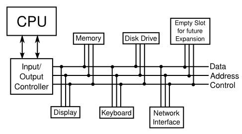

# Section 2: 비동기 이벤트: Polling Loops 및 Interrupts

CPU는 메모리에서 명령을 가져오고 실행하는 데 거의 모든 시간을 소비합니다. 그러나 CPU와 메인 메모리는 실제 컴퓨터 시스템의 여러 구성 요소 중 하나일 뿐입니다.
전체 시스템에는 다음과 같은 기타 장치가 포함됩니다.
- 프로그램과 데이터 파일을 저장하기 위한 **하드 디스크(hard disk), SSD(solid state drive)**
  - 주 메모리는 상대적으로 적은 양의 정보만 저장하며, 전원이 켜져 있는 동안만 유지됩니다.
  - 대용량 정보를 영구 저장하려면 하드 디스크나 SSD가 사용되고, 프로그램은 실행되기 전 메인 메모리로 로드됩니다.
  - 하드 디스크는 회전 자기 디스크에 데이터를 저장하지만 SSD는 움직이는 부품이 없는 순수 전자 장치입니다.
- 사용자의 입력을 위한 **키보드와 마우스**
- 컴퓨터의 출력을 위한 **모니터와 프린터**
- 소리 재생을 위한 **오디오 출력 장치**
- 컴퓨터가 네트워크에 연결된 다른 컴퓨터와 통신할 수 있도록 하는 **네트워크 인터페이스**
- 이미지를 컴퓨터에 저장하고 조작할 수 있도록 이진수로 변환하는 **스캐너**

장치 목록은 완전히 개방적이며, 컴퓨터 시스템은 새로운 장치를 추가하여 쉽게 확장할 수 있도록 구축되었습니다.
어떻게든 CPU 이러한 장치와 통신하고 제어해야 합니다. CPU는 기계어 명령을 실행해야만 이 작업을 수행할 수 있습니다. (이것이 CPU가 할 수 있는 전부입니다.)
이것이 작동하는 방식은 시스템의 각 장치에 대해 CPU가 실행할 수 있는 소프트웨어인 **장치 드라이버**를 이용합니다.
시스템에 새 장치를 설치하는 과정은 일반적으로 장치를 컴퓨터에 물리적으로 연결하고, 장치 드라이버 소프트웨어를 설치하는 두 단계로 구성됩니다.
장치 드라이버가 없으면 CPU와 장치가 통신할 수 없기 때문에 물리적 장치는 쓸모가 없게 됩니다.

많은 장치로 구성된 컴퓨터 시스템은 일반적으로 해당 장치를 하나 이상의 **Bus**에 연결하여 구성됩니다.
버스는 해당 와이어에 연결된 장치 간에 다양한 종류의 정보를 전달하는 와이어 세트입니다. 와이어는 데이터, 주소 및 제어 신호를 전달합니다. 주소는 데이터를 특정 장치 및 해당 장치 내의 특정 레지스터나 위치로 보내기 위함입니다.
예를 들어 제어 신호는 데이터 버스에서 데이터를 사용할 수 있다는 것을 다른 장치에 알리기 위해 사용될 수 있습니다.
매우 간단한 컴퓨터 시스템은 다음과 같이 구성될 수 있습니다.

이제 키보드, 마우스, 네트워크 인터페이스와 같은 장치는 CPU에서 처리해야 하는 입력을 생성할 수 있습니다.
CPU는 데이터가 있는지 어떻게 알 수 있을까요? 간단한 아이디어 중 하나는 CPU가 들어오는 데이터를 계속해서 확인하는 것입니다.
데이터를 찾을 때마다 처리하는 것입니다. CPU가 보고할 입력 데이터가 있는지 확인하기 위해 입력 장치를 주기적으로 검사하므로 이 방법을 **폴링 (polling)** 이라고 합니다.
폴링은 매우 간단하지만 매우 비효율적입니다. CPU는 입력을 기다리는 것만으로도 엄청난 시간을 낭비할 수 있습니다.

이러한 비효율성을 피하기 위해서 일반적으로 폴링 대신 **인터럽트 (Interrupt)** 가 사용됩니다. 인터럽트는 다른 장치가 CPU로 보내는 신호입니다.
CPU는 인터럽트에 응답하기 위해 수행중인 모든 작업을 제쳐두고 인터럽트 신호에 응답합니다. 인터럽트를 처리한 후에는 인터럽트가 발생하기 전에 수행하던 작업으로 돌아갑니다.
예를 들어, 컴퓨터 키보드의 키를 누르면 키보드 인터럽트가 CPU로 전송됩니다. CPU는 수행 중인 작업을 중단하고, 사용자가 누른 키를 읽고 처리한 다음, 키를 누르기 전에 수행 중이던 작업으로 돌아갑니다.

이는 순전히 기계적인 프로세스라는 점을 이해해야 합니다. 장치는 단순히 와이어를 켜는 것만으로 인터럽트 신호를 보냅니다.
CPU는 해당 와이어가 켜지면 CPU가 현재 수행 중인 작업에 대한 정보를 저장해놓고, 나중에 동일한 상태로 돌아갈 수 있도록 만들어졌습니다.
이 정보는 프로그램 카운터(PC)와 같은 중요한 내부 레지스터에 저장됩니다. 그런 다음 CPU는 미리 결정된 메모리 위치로 점프하고 거기에 저장된 명령을 실행하기 시작합니다.
이러한 명령어는 **인터럽트 핸들러 (Interrupt Handler)** 를 구성합니다. 이는 인터럽트에 응답하는 데 필요한 처리를 수행합니다.
이 인터럽트 핸들러는 인터럽트 신호를 보낸 장치에 대한 장치 드라이버 소프트웨어의 일부입니다. 인터럽트 핸들러의 끝에는 CPU에게 수행 중이던 작업으로 다시 점프하라고 지시하는 명령이 있습니다.
이전에 저장된 상태를 다시 가져와 이를 수행합니다.

**인터럽트를 사용하면 CPU가 비동기 이벤트를 처리**할 수 있습니다. 일반적인 프로그램 실행 주기에서는 작업이 미리 결정된 순서로 발생합니다.
일어나는 모든 일은 다른 모든 것과 동기화됩니다. 인터럽트를 사용하면 CPU가 비동기적으로, 즉 예측할 수 없는 시간에 발생하는 이벤트를 효율적으로 처리할 수 있습니다.

인터럽트가 사용되는 방법의 또 다른 예로, CPU가 하드 디스크에 저장된 데이터에 접근해야 할 때 어떤 일이 발생하는지 생각해 보세요.
CPU는 메인 메모리에 있는 데이터에만 직접 접근할 수 있습니다. 디스크의 데이터에 액세스하려면 먼저 메모리에 복사해야 합니다.
CPU가 작동하는 속도로 볼 때 디스크 드라이브는 매우 느립니다. CPU는 디스크의 데이터가 필요할 때, 디스크 드라이브에 신호를 보내 데이터를 찾아 준비하라는 신호를 보냅니다.
이 신호는 일반 프로그램의 제어 하에 동기적으로 전송됩니다. 그런 다음 디스크 드라이브가 이 작업을 수행하는 데 걸리는 예측 불가능한 시간을 기다리는 대신, CPU는 다른 작업을 계속합니다.
디스크 드라이브에 데이터가 준비되면 CPU에 인터럽트 신호를 보냅니다. 그러면 인터럽트 핸들러는 요청된 데이터를 읽을 수 있습니다.

이것들은 CPU가 실제로 수행해야 할 작업이 여러개 있는 경우에만 의미가 있습니다. 더 이상 할 일이 없으면 폴링하거나 디스크 드라이브 작업이 완료될 때까지 기다리는 게 좋습니다. 
모든 최신 컴퓨터는 멀티태스킹을 사용하여 여러 작업을 동시에 수행합니다.
일부 컴퓨터는 여러 사람이 동시에 사용할 수도 있습니다.
CPU는 매우 빠르기 떄문에 한 사용자에서 다른 사용자로 신속하게 전환할 수 있습니다.
이러한 멀티태스킹 적용을 **시분할**이라고 합니다. 그러나 사용자가 한 명뿐인 최신 PC도 멀티태스킹을 사용합니다.
예를 들어, 시계가 계속 시간을 표시하고 네트워크를 통해 파일이 다운되는 동안, 사용자는 문서를 작성할 수 있습니다.

CPU가 수행하는 각각의 개별 작업을 **스레드**라고 합니다. (스레드와 프로세스 사이에는 기술적 차이가 있지만 Java에서 사용되는 스레드를 설명할 것이기 떄문에 여기서는 중요하지 않습니다.)
많은 CPU는 문자 그대로 둘 이상의 스레드를 동시에 실행할 수 있습니다. 이러한 CPU에는 여러 코어가 있고, 각각의 코어는 동시에 실행될 수 있는 스레드 수에 제한이 있습니다.
동시에 실행될 수 있는 것보다 더 많은 스레드가 있는 경우가 많기 때문에, 컴퓨터는 한 스레드에서 다른 스레드로 전환할 수 있어야 합니다.
일반적으로 실행 중인 스레드는 다음 중 하나가 발생할 떄까지 계속 실행됩니다.
- 스레드는 다른 스레드에게 자발적으로 **제어권을 양보**할 수 있습니다.
- 스레드는 일부 비동기 이벤트가 발생할 떄까지 기다려야 할 수도 있습니다. 예를 들어 스레드는 디스크 드라이브에서 일부 데이터를 요청하거나, 사용자가 키를 누를 떄까지 기다립니다. 기다리는 동안 **스레드는 차단**되었다고 하며, 다른 스레드가 있는 경우 실행할 수 있습니다. 이벤트가 발생하면, 인터럽트가 스레드를 꺠우고 계속 실행합니다.
- 스레드는 할당된 시간을 모두 사용하고 다른 스레드가 실행될 수 있도록 일시중단될 수 있습니다. 대부분의 컴퓨터는 이런 방식으로 스레드를 강제 일시 중단합니다. 이런 컴퓨터는 선점형 멀티태스킹을 사용한다고 합니다. 이를 수행하려면 초당 100회와 같이 일정한 간격으로 인터럽트를 생성하는 특수 타이머 장치가 필요합니다. 타이머 인터럽트가 발생하면 CPU는 현재 실행 중인 스레드 여부에 관계 없이 한 스레드에서 다른 스레드로 전환할 수 있는 기회를 갖습니다. 모든 최신 PC 및 핸드폰은 선점형 멀티태스킹을 사용합니다.

일반 사용자와 프로그래머는 인터럽트와 인터럽트 핸들러를 다룰 필요가 없습니다. 컴퓨터가 이러한 작업을 수행하는 방법에 대한 세부 사항은 이들에게 중요하진 않습니다. 
실제로 대부분의 사람들은 스레드와 멀티태스킹을 모두 무시할 수 있습니다. 그러나 컴퓨터의 멀티태스킹 및 멀티 프로세싱을 더 많이 활용하기 시작하면서 스레드는 점점 더 중요해졌습니다.
실제로 스레드 작업 능력은 프로그래머에게 필수적인 기술로 빠르게 자리잡고 있습니다. 다음 12장에서 스레드에 대해 다루게 됩니다.

현대 프로그래밍에서 중요한 것은 비동기 이벤트의 기본 개념입니다. 프래그래머는 실제로 인터럽트를 직접 처리하지는 않지만 인터럽트 핸들러와 마찬가지로 특정 이벤트가 발생할 때 비동기적으로 호출되는 이벤트 핸들러를 작성하게 됩니다.
이러한 "이벤트 중심 프로그래밍"은 기존 동기 프로그래밍과는 느낌이 다릅니다. 6장에서 이를 자세히 다룰 것입니다.

모든 인터럽트 처리를 수행하고, 사용자 및 하드웨어 장치와의 통신을 처리하고, 스레드를 제어하는 소프트웨어를 운영 체제라고 합니다.
운영 체제는 컴퓨터의 기본적이고 필수적인 소프트웨어입니다. 프로그램은 운영 체제에 따라 다릅니다. 데스크롭에는 Linux, Window, MacOS, 스마트폰에는 Android iOS가 있습니다.

