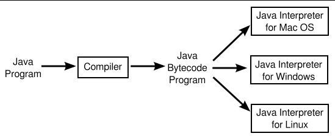

# Section 3: 자바 가상 머신 (JVM)

**기계어**는 컴퓨터의 CPU에서 실행할 수 있는 매우 간단한 명령으로 구성됩니다. 그러나 거의 모든 프로그램은 고급 프로그래밍 언어로 작성됩니다. 고급 언어로 작성된 프로그램은 컴퓨터에서 직접 실행할 수 없습니다.
첫째, 기계어로 번역해야합니다. 이는 **컴파일러**라는 프로그램을 통해 수행됩니다. 컴파일러는 고급 언어를 가져와 실행 가능한 기계 언어로 변환합니다. 일단 번역이 완료되면 기계어 프로그램은 여러 번 실행될 수 있지만, 각 유형 컴퓨터에는 고유한 개별 기계어가 있으므로 각 유형의 컴퓨터에서만 실행될 수 있습니다.
(Java는 컴퓨터 하드웨어 접근과 같은 특정 작업을 수행하기 위해 운영 체제와 함께 작동해야하기 때문에 실행 중인 운영체제에 따라 다릅니다. 여기서는 설명하지 않습니다.) 다른 유형의 컴퓨터에서 실행하려면 다른 컴파일러를 사용하여 적절한 기계어로 재번역해야 합니다.

고급 언어 프로그램을 컴파일하는 것의 대안이 있습니다. 프로그램을 한꺼번에 번역하는 컴파일러를 사용하는 대신, 필요에 따라 명령어별로 번역하는 **인터프리터**를 사용할 수 있습니다.
인터프리터는 일종의 프로그램 실행 주기(Fetch Execute Cycle)를 통해 CPU와 매우 유사하게 작동하는 프로그램입니다.
프로그램을 실행하기 위해 인터프리터는 프로그램에서 하나의 명령을 반복적으로 읽고, 해당 명령을 수행하는 데 필요한 것이 무엇인지 결정한 다음 적절한 기계 언어 명령을 수행하는 루프로 작동합니다.

(컴파일러는 책 전체를 번역하여 새 책을 만드는 인간 번역가와 같습니다.
 인터프리터는 연설이 진행되는 동시에 한 줄씩 번역하는 통역사와 비슷합니다.)

인터프리터의 용도 중 하나는 고급 언어 프로그램을 실행하는 것입니다. 예를 들어 언어 Lisp는 일반적으로 컴파일러가 아닌 인터프리터에 의해 실행됩니다.
그러나 인터프리터에는 또 다른 목적이 있습니다. 즉, 완전히 다른 유형의 컴퓨터에서 다른 유형의 컴퓨터용 기계어 프로그램을 사용할 수 있도록 하는 것입니다. 예를 들어 C64 컴퓨터 시스템을 다른 유형의 컴퓨터나 웹 브라우저에서 실행할 수 있습니다.

Java 설계자는 컴파일러와 인터프리터를 조합하기로 결정했습니다. Java로 작성된 프로그램을 기계어로 컴파일되지만 실제로 존재하지 않는 컴퓨터를 위한 기계어입니다. 소위 "가상 컴퓨터"는 Java Virtual Machine (JVM)으로 알려져 있습니다. JVM의 기계 언어를 **Java 바이트코드**라고 합니다. Java 바이트 코드를 가상 컴퓨터가 아닌 실제 컴퓨터의 기계어로 사용하지 못할 이유는 없습니다.
그러나 실제로 가상 머신을 사용하게 되면 Java의 특정 장점이 생겨납니다. 실제로 **모든 환경에서 사용할 수 있다는 점**입니다.
컴퓨터에 필요한 것은 Java 바이트코드용 인터프리터뿐입니다. JVM이라는 용어는 시뮬레이션을 수행하는 Java 바이트코드 인터프리터 프로그램에도 사용되므로 Java 프로그램을 실행하려면 컴퓨터에 JVM이 필요하다고 말합니다.
인터프리터가 JVM을 구현한다고 말하는 것이 더 정확할 것입니다.

물론 컴퓨터 유형마다 다른 Java 바이트코드 인터프리터가 필요하지만 컴퓨터에 Java 바이트코드 인터프리터가 있으면 모든 Java 바이트코드 프로그램을 실행할 수 있으며, 이러한 인터프리터가 있는 모든 컴퓨터에서 동일한 프로그램을 실행할 수 있습니다.
이는 Java의 필수 기능 중 하나입니다. 동일한 컴파일된 프로그램이 다양한 유형의 컴퓨터에서 실행될 수 있습니다.

.Java -> 컴파일러에 의해 Java 바이트코드로 변환 -> Java 바이트코드 프로그램이 Java 인터프리터 (운영체제마다 다름) 를 통해 바이트코드를 기계어로 변환

왜 중간 Java 바이트코드를 사용하는지 궁금할 것입니다. 원래 Java 프로그램을 배포하고 각 사람이 이를 실행하려는 컴퓨터의 기계어로 컴파일하도록 하면 어떨까요? 
이에는 몇가지 이유가 있습니다. 우선, 컴파일러는 복잡한 고급 언어인 Java를 이해해야 합니다. 컴파일러는 그 자체로 복잡한 프로그램입니다.
반면에 Java 바이트코드 인터프리터는 상대적으로 작고 간단한 프로그램입니다. 이를 통해 새로운 유형의 컴퓨터에 대한 바이트코드 해석기를 쉽게 작성할 수 있습니다.
일단 완료되면 해당 컴퓨터는 컴파일된 Java 프로그램을 실행할 수 있습니다. 동일한 컴퓨터에 대해 Java 컴파일러를 작성하는 것은 훨씬 더 어려울 것입니다.

또한 Java는 일부 프로그램이 네트워크를 통해 다운로드된다는 아이디어로 만들어졌습니다.
이는 보안 문제로 이어질 수 있습니다. 즉, 컴퓨터나 파일을 손상시키는 프로그램을 다운로드하고 실행하고 싶지 않을 것입니다. 바이트코드 인터프리터는 사용자와 다운로드한 프로그램 사이의 버퍼 역할을 합니다.
다운로드한 프로그램을 간접적으로 실행하는 인터프리터를 실제로 실행하고 있는 것입니다. 그래서 인터프리터가 해당 프로그램의 잠재적 위험에서 사용자를 보호할 수 있습니다.

Java가 처음 나왔을 때는 느리다는 비판을 받았습니다. Java 바이트코드는 인터프리터에 의해 실행되었기 때문에 Java 바이트코드 프로그램은 기계어로 컴파일된 프로그램만큼 빠르게 실행할 수 없는 것처럼 보였습니다.
그러나 이 문제는 JIT(Just In Time) 컴파일러를 사용하여 대부분 해결하였습니다. JIT는 Java 바이트코드를 실행하기 위한 것입니다. JIT 컴파일러는 Java 바이트코드를 기본 기계언어로 변환합니다. 프로그램을 실행하는 동안 이 작업을 수행합니다.
일반 인터프리터와 마찬가지로 JIT 컴파일러에 대한 입력은 Java 바이트코드 프래그램이며 해당 작업은 해당 프로그램을 실행하는 것입니다.
그러나 프로그램을 실행하면서 일부를 모국어 기계어로 번역하기도 합니다. 그러면 프로그램이 훨씬 더 빠르게 실행됩니다.
프로그램의 특정 부분은 프로그램이 실행될 때 여러 번 실행되는 경우가 많기 때문에 JIT 컴파일러는 전체 실행 시간을 크게 단축시킬 수 있습니다.

Java와 Java 바이트코드 사이에는 무언가 필요하지 않습니다. Java로 작성된 프로그램은 컴퓨터의 기계어로 컴파일될 수 있습니다.
그리고 다른 언어로 작성된 프로그램은 Java 바이트코드로 컴파일될 수 있습니다.
그러나 Java와 Java 바이트코드의 조합은 플랫폼에 독립적이고 안전하며 네트워크 호환이 가능하고, 고급 언어로 프로그래밍을 가능하게 해줍니다.

Java 바이트코드로 컴파일되는 다른 프로그래밍 언어도 있습니다. 컴파일된 바이트코드 프로그램은 표준 JVM에 의해 실행될 수 있습니다.
JVM 프로그래밍을 위해 특별히 개발된 언어로는 Scala, Groovy 등이 있습니다. Jython과 JRuby는 JVM을 대상으로 하는 Python과 Ruby의 버전입니다.
이러한 언어를 사용하면 Java를 쓰지 않고도 JVM의 많은 장점을 누릴 수 있습니다.
JVM에서 다른 언어가 사용되므로 더 나은 기능을 추가하기 위해 몇 가지 새로운 기능이 JVM에 추가되었습니다.
그리고 JVM에 대한 개선으로 인해 Java에서도 몇 가지 새로운 기능이 가능해졌습니다.
