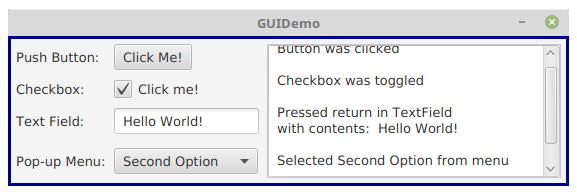
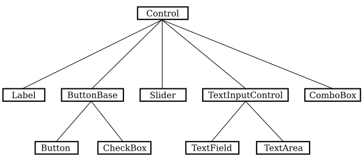

# Section 6: 현대의 유저 인터페이스

컴퓨터가 처음 소개되었을 때 대부분의 프로그래머를 포함한 일반 사람들은 컴퓨터를 사용하기 어려웠습니다. 그들은 자신의 프로그램과 데이터를 가져와 컴퓨터에 제공하고 컴퓨터의 응답을 반환하는 직원과 함께 하며 컴퓨터를 사용하였습니다. 1960년대에 컴퓨터가 작업을 어떤 사람에게서 다른 사람으로 빠르게 전환하는 시분할이 가능해지면서 여러 사람이 동시에 컴퓨터와 직접 상호 작용하는 것이 가능해졌습니다. 시분할 시스템에서 사용자는 컴퓨터에 명령을 입력하는 "터미널"에 앉아 컴퓨터가 그에 대한 응답을 입력합니다. 초기 개인용 컴퓨터도 한 번에 한 사람만 사용한다는 점을 제외하고는 입력된 명령과 응답을 사용했습니다. 사용자와 컴퓨터 사이의 상호작용은 커맨드 라인 인터페이스라고 불리는 유형입니다.

물론 지금 대부분의 사람들은 완전히 다른 방식으로 컴퓨터와 상호 작용합니다. 그들은 그래픽 사용자 인터페이스 (GUI)를 사용합니다. 컴퓨터는 화면에 인터페이스 구성 요소를 그립니다. 구성요소에는 창, 스크롤 막대, 메뉴, 버튼, 아이콘 등이 포함됩니다. 일반적으로 마우스는 이러한 구성 요소를 조작하는 데 사용되며 "터치스크린"에서는 손가락으로 조작합니다. 당신은 이미 그래픽 사용자 인터페이스의 기본에 대해 잘 알고 있을 것입니다!

많은 GUI 인터페이스 구성 요소가 거의 표준이 되었습니다. 즉, MacOS, Windows 및 Linux를 포함한 다양한 컴퓨터 플랫폼에서 유사한 모양과 동작을 갖습니다. 프로그램 수정 없이두 다양한 플랫폼에서 실행되는 Java 프로그램은 모든 표준 GUI 구성 요소를 사용할 수 있습니다. 플랫폼마다 모양이 조금씩 다를 수 있지만 해당 기능은 모든 컴퓨터에서 동일해야 합니다.

아래에는 몇 가지 표준 GUI 인터페이스 구성 요소를 보여주는 매우 간단한 Java 프로그램의 이미지가 나와 있습니다. 프로그램이 실행되면 여기에 표시된 그림과 유사한 창이 컴퓨터 화면에 열립니다. 창에는 사용자가 상호 작용할 수 있는 네 가지 구성 요소(버튼, 확인란, 텍스트 필드, 팝업 메뉴)가 있습니다. 이러한 구성 요소에는 레이블이 지정되어 있습니다. 창에는 몇 가지 다른 구성 요소가 있습니다. 레이블 자체는 상호작용을 할 수 없더라도 하나의 구성 요소입니다. 창의 오른쪽 절반은 여러 줄의 텍스트를 표시할 수 있는 텍스트 영역 구성 요소입니다. 텍스트 줄 수가 텍스트 영역에 맞는 것보다 커지면 텍스트 영역 옆에 스크롤 막대 구성 요소가 나타납니다. 그리고 실제로 전체 창 자체도"구성 요소"로 간주될 수 있습니다.

실제로 Java와 함께 사용할 수 있는 세 가지 완전한 GUI 구성 요소 세트가 있습니다. 이들 중 하나인 AWT 또는 Abstract Windowing Toolkit은 원래 Java 버전의 일부였습니다. 두 번째는 Swing 으로 알려져 있으며 AWT를 기반으로 합니다. 이는 Java 버전 1.2에 도입되었으며 수년 동안 표준 GUI 툴킷이었습니다. 세 번째 GUI 툴킷인 JavaFX는 버전 8에서 잠시 Java의 표준 부분이 되었지만 현재는 별도로 배포됩니다. JavaFX는 GUI 애플리케이션을 작성하는 보다 현대적인 방법을 의미하지만 별도로 다운로드하여 설치해야 한다는 점 때문에 사용이 복잡합니다. 이 교과서에서는 JavaFX만 다루고 있지만 대신 Swing을 다루는 대체 버전의 교과서를 사용할 수 있습니다. 어느 버전의 교과서든 합리적인 선택이 될 수 있습니다.

사용자가 GUI 구성 요소와 상호 작용하면 "이벤트"가 생성됩니다. 예를 들어 푸시 버튼을 클릭하면 이벤트가 생성되고, 키보드의 키를 누르면 이벤트가 생성됩니다. 이벤트가 생성될 때마다 이벤트가 발생했음을 알리는 메시지가 프로그램에 전송되고 프로그램은 해당 프로그램에 따라 응답합니다. 실제로 일반적인 GUI 프로그램은 주로 다양한 유형의 이벤트에 응답하는 방법을 프로그램에 알려주는 "이벤트 핸들러"로 구성됩니다. 위의 예에서 프로그램은 텍스트 영역에 메시지를 표시하여 각 이벤트에 응답하도록 프로그래밍되었습니다. 실제 다른 프로그램에서는 이벤트 핸들러가 더 많은 작업을 수행합니다.

여기서 "메시지"라는 용어를 사용한 것은 의도적인 것입니다. 이전 섹션에서 본 것처럼 메시지는 객체로 전송됩니다. 실제로 Java GUI 구성요소는 객체로 구현됩니다. Java에는 다양한 유형의 GUI 구성 요소를 나타내는 사전에 정의된 클래스가 많이 포함되어 있습니다. 이러한 클래스 중 일부는 다른 클래스의 하위 클래스입니다. 다음은 JavaFX GUI 클래스와 그 관계 중 일부를 보여주는 다이어그램입니다.

지금은 세부 사항에 대해 걱정하지 마세요. 대신 객체 지향 프로그래밍과 상속이 어떻게 사용되는지에 대한 느낌을 익히세요. 여기에 표시된 모든 GUI 클래스 는 많은 JavaFX 구성 요소에서 공유하는 일반 속성을 나타내는 Control 이라는 클래스의 직접 또는 간접적인 하위 클래스입니다 . 다이어그램에서 Control 의 직접 하위 클래스 중 두 개에는 하위 클래스가 있습니다. 특정 동작을 공통적으로 갖는 TextField 및 TextArea 클래스는 TextInputControl 의 하위 클래스로 함께 묶입니다 . 마찬가지로 Button 과 CheckBox는 ButtonBase 의 하위 클래스입니다. 버튼과 체크박스 모두에 공통적인 속성을 나타냅니다. (ComboBox 는 팝업 메뉴를 나타내는 클래스입니다.)

이 간단한 토론만으로도 GUI 프로그래밍이 어떻게 객체 지향 설계를 효과적으로 사용할 수 있는지 알 수 있을 것입니다. 실제로 "보이는 개체"를 갖춘 GUI는 아마도 OOP의 인기에 기여하는 주요 요인일 것입니다.

GUI 구성요소와 이벤트를 사용한 프로그래밍은 Java의 가장 흥미로운 측면 중 하나입니다. 그러나 이는 6장에서 다룰 것이며, 그 전에 기본 사항에 대해 먼저 살펴볼 것입니다.