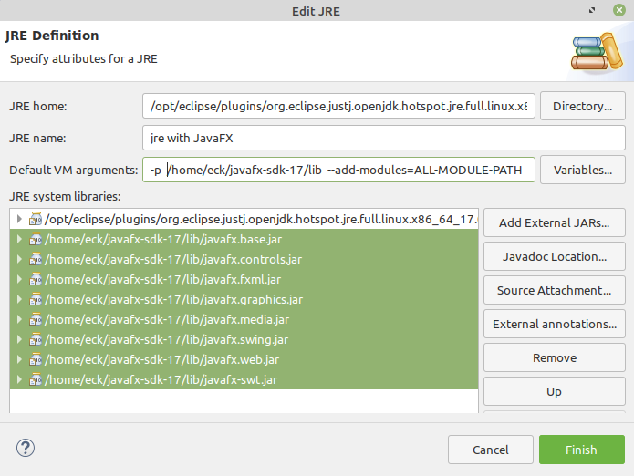

# Section 6: 프로그래밍 환경

자바 언어는 고도의 표준화가 이루어지지만, 자바 프로그램의 생성, 컴파일, 수정 절차는 프로그래밍 환경마다 매우 다양하다. 두 가지 기본적인 접근법이 있다: 사용자가 명령을 입력하고 컴퓨터가 응답하는 **명령줄 환경(command line environment)** 과, 사용자가 키보드와 마우스를 사용하여 그래픽 사용자 인터페이스와 상호 작용하는 **통합 개발 환경(integrated development environment, IDE)** . 자바 프로그래밍을 위한 명령줄 환경은 본질적으로 한 가지뿐이지만, 이클립스(Eclipse), NetBeans, IntelliJ IDEA, 그리고 BlueJ를 포함한 몇 가지 일반적인 IDE가 있다. 이 절에서 자바 프로그래밍 환경에 관한 완전하거나 확정적인 정보를 줄 수는 없지만, 본 교재의 예제를 명령줄, 이클립스 또는 BlueJ를 이용하여 컴파일하고 실행할 수 있도록 충분한 정보를 제공하도록 노력하겠다. (독자들은 이 예제들을 읽고, 컴파일하고, 실행할 것을 강력히 권장한다. 샘플 프로그램에 대한 소스 코드 및 각 장의 연습문제에 대한 해답은 이 책의 웹 페이지에서 다운로드할 수 있다.

한 가지 명심해야 할 것은 자바 프로그래밍을 하기 위해 돈을 지불할 필요가 없다는 것이다. 당신이 필요한 모든 것은 인터넷에서 무료로 다운로드 받을 수 있다.

이 교재는 자바 8 및 그 이상에서 사용할 수 있다. 2020년 12월 교재 버전 8.1.2를 발매한 현재, 자바의 버전은 자바 15이다. 자바 언어와 오라클 법인의 자바 관련 정책 모두 자바 8 출시 이후 상당한 변화가 있었다. 불행히도, 이러한 변화들은 자바를 설치하고 가동시키는 것을 다소 어렵게 만들었다. 이 절에서는 자바를 설치하고 이 교재와 함께 사용할 수 있도록 충분한 정보를 줄 수 있도록 노력할 것이다.

자바에 대한 변경 사항 중 하나는 출시 일정이었다. 자바의 새로운 버전은 현재 과거보다 훨씬 더 자주 출시되어, 대략 일년에 두 번 정도이지만, 일부 버전만이 확대된 기간 동안 버그 수정과 보안 업데이트를 계속해서 지원받을 "장기 지원" (LTS) 배포판이다. 자바 8과 자바 11은 장기 지원 배포판이지만 자바 8 이후의 다른 버전들은 그렇지 않다. 실제로 현재 자바 8, 11, 15개만 공식적으로 지원되고 있다(본 교재의 목적상 더 이상 지원을 받지 못하는 다른 버전을 사용하는 것이 문제가 되지는 않겠지만 말이다). 2020년 12월 현재, 당신은 자바 11이나 자바 15를 사용할 가능성이 가장 높다.

<hr>

## 1. JDK 및 JavaFX 가져오기
자바 프로그래밍을 위한 기본 개발 시스템을 보통 **JDK(Java Development Kit)** 라고 부른다. 이 교재는 자바 8 또는 그 이상을 위한 JDK가 필요하다. 자바는 두 가지 버전으로 제공된다는 점에 유의하라: 개발 키트 버전(JDK) 및 런타임 환경 버전(JRE). 런타임 환경(Runtime Environment)는 자바 프로그램을 실행하는 데 사용될 수는 있지만, 당신 자신의 자바 프로그램을 컴파일하는 것을 허용하지는 않는다. 개발 키트는 런타임 환경을 포함하지만 프로그램을 컴파일할 수도 있다. (자바 11의 출시 이후 별도의 JRE 다운로드를 찾기가 어려워졌지만, 해당 용어가 여전히 사용됨을 알게 될 것이다 — 때때로, 이는 사실상 JDK를 언급하는 것이다). JDK에는 명령줄에서 자바를 다루는 데 필요한 명령줄 환경이 포함된다. IDE를 사용하려면 먼저 JDK를 다운로드해야 할 것이다; 그러나, 이클립스 IDE에 JDK가 포함되어 있다는 점에 주의하라.

자바는 오라클 법인이 인수한 선 마이크로시스템즈에 의해 개발되었다. 오라클 웹 사이트에서 직접 JDK를 다운로드할 수 있지만, 자바 11부터 Oracle JDK는 대부분 상업용이다. 개인용과 교육용으로, 오라클에서 사용할 수 있는 버전과 동일한 기능을 가지고 있고 완전 무료 오픈 소스 라이센스로 배포되는 OpenJDK를 사용하는 것이 더 바람직할 것이다. 오라클에서 소유하고 있는 https://jdk.java.net/ 에서 OpenJDK를 다운로드할 수 있지만, AdaptOpenJDK의 이 주소에서 다운로드 할 것을 필자는 추천한다:

https://adoptopenjdk.net/

이 사이트에는 보다 광범위한 플랫폼용 OpenJDK가 있으며, 이러한 플랫폼에서 자바를 쉽게 설정할 수 있도록 Mac OS 및 윈도우즈용 설치 프로그램을 제공하고 있다. (Mac OS용 설치 프로그램은 .pkg 파일, 윈도우즈용 설치 프로그램은 .msi 파일이다.) 2020년 12월 현재 자바 버전은 자바 15이다. 현재 버전이나 자바 11과 같은 장기 지원 배포판을 사용하는 것이 바람직하다. 그러나 이 교재의 샘플 프로그램과 연습문제들은 자바 8처럼 오래된 JDK 버전에서도 작동할 것이다.

AdoptOpenJDK에서 윈도우즈 또는 Mac OS용 JDK 설치 관리자를 다운로드하는 경우, 자동으로 시작되지 않는 경우 설치 관리자 파일을 두 번 클릭하여 설치를 시작하라. 기본 설치를 사용하는 경우 명령줄에서 `javac` 및 `java` 명령어를 사용할 수 있도록 설치 관리자가 컴퓨터를 설정할 것이다.

이 책의 GUI 프로그램은 OpenJDK와 별도로 다운로드해야 하는 JavaFX라는 프로그래밍 라이브러리를 사용한다(상업 Oracle JDK의 경우 JavaFX는 자바 11 이전 버전에 포함된다). JavaFX 라이브러리는 다음 주소에서 다운받을 수 있다:

https://gluonhq.com/products/javafx/

운영 체제(리눅스, Mac OS 또는 윈도우즈)에 맞추어 JavaFX "SDK"를 — "jmods"가 아니다 — 받아야 한다. 다운로드한 OpenJDK의 버전 번호와 일치하는 버전 번호를 받아야 한다. (하지만 큰 버전 번호가 일치하는 한 문제는 없을 것이다; 예를 들면, JavaFX 11.0.2는 JDK 11.0.9와 함께 작동한다.)

JavaFX SDK를 다운로드하면 압축된 아카이브 파일 형태가 된다. 당신은 아카이브의 내용을 해제해야 할 것이다. 보통은 아카이브 파일의 아이콘을 두 번 클릭하기만 하면 내용을 해제하거나 내용을 해제하는 데 사용할 수 있는 프로그램을 열 수 있다. 당신은 Javafx-sdk-11.0.2 같은 이름의 디렉터리를 얻을 것이다. 디렉터리를 컴퓨터의 아무 곳에나 넣을 수 있지만, 디렉터리가 어디에 있는지는 알아야 한다.

(OpenJDK 또한 압축된 아카이브로도 다운로드할 수 있으며, 압축을 풀고 컴퓨터의 아무 곳에나 배치할 수 있다. 그러나 javac 및 java 명령을 사용하려면 OpenJDK 디렉터리의 bin 디렉터리를 PATH 환경 변수에 추가하거나, javac 및 java 명령어에 전체 경로 이름을 사용해야 한다.)

리눅스를 사용하는 경우 최신 OpenJDK 및 JavaFX를 리눅스 버전의 소프트웨어 저장소에서 사용 가능하며, 리눅스 소프트웨어 설치 관리자 도구를 사용하여 설치하기만 하면 된다. (정확한 이 의미는 사용 중인 리눅스 버전에 따라 다르다. "openjdk" 및 "openjfx"가 포함된 이름의 패키지를 검색하라.) JavaFX SDK 디렉터리가 어디에 있는지 알아야 한다; 필자의 리눅스 컴퓨터에서는 /usr/share/openjfx에 위치하고 있다. 또한 AdaptOpenJDK 및 JavaFX 웹 사이트에서 리눅스 버전을 다운로드할 수도 있다.

## 2. 명령줄 환경
현대의 많은 컴퓨터 사용자들은 명령줄 환경(command line environment)이 상당히 이질적이고 비직관적이라고 생각한다. 대부분의 사람들이 익숙한 그래픽 사용자 인터페이스와는 확실히 매우 다르다. 그러나 명령줄 환경의 기본을 익히고 이를 이용하여 생산적인 활동을 하는 데에는 약간의 연습만이 필요할 뿐이다. 명령줄을 사용하는 방법을 아는 것은 유용하며, 특히 컴퓨터 공학 학생들에게는 중요하지만, IDE에서 모든 프로그래밍을 수행할 계획이라면 이 관과 다음 관을 건너뛸 수도 있다.

명령줄 프로그래밍 환경을 사용하려면 명령을 입력할 수 있는 창을 열어야 한다. 윈도우즈에서는 **cmd**라는 프로그램을 실행하여 이러한 명령 창을 열 수 있다. Mac OS에서는 응용 프로그램 폴더 내의 유틸리티 폴더에 있는 **터미널** 프로그램을 실행할 필요가 있다. 리눅스에서는 **xterm**이라는 매우 오래된 프로그램을 포함하여 여러 가지 가능성이 있다; 하지만 응용 프로그램 메뉴에서 "터미널"을 찾아 보라.

어떤 종류의 컴퓨터를 사용하든 명령 창을 열면 어떤 종류의 프롬프트(prompt)가 표시된다. 프롬프트에 명령을 입력하고 리턴(return)을 눌러라. 컴퓨터는 명령을 수행하고 명령 창에 출력을 표시한 다음 다른 명령을 입력할 수 있도록 프롬프트를 다시 표시한다. 명령줄 환경의 중심 개념 중 하나는 **현재 디렉터리(current directory)** 또는 **작업 디렉터리(working directory)** 인데, 이 디렉터리에는 사용자가 입력하는 명령에서 사용할 수 있는 파일이 포함되어 있다. (디렉터리(directory)와 폴더(folder)라는 말은 같은 뜻이다.) 종종 현재 디렉터리의 이름이 명령 프롬프트의 일부인 경우가 있다. 명령어 dir(윈도우즈) 또는 ls(리눅스 및 Mac OS)를 입력하면 현재 디렉터리의 파일 목록을 얻을 수 있다. 창이 처음 열리면 현재 디렉터리는 당신 개인의 파일이 저장되는 **홈 디렉터리(home directory)** 다. **cd** 명령어를 사용하기 바라는 디렉터리 이름과 함께 사용하여 현재 디렉터리를 변경할 수 있다. 예를 들어, 현재 디렉터리가 홈 디렉터리인 경우 `cd Desktop` 명령어를 입력한 다음 (리턴 키를 눌러서) 데스크탑 디렉터리로 변경할 수 있다.

자바 작업을 보관할 디렉터리(즉, 폴더)를 작성할 수도 있다. 예를 들어, 홈 디렉터리에 `javawork`라는 디렉터리를 작성할 수 있다. 컴퓨터의 GUI를 사용하여 이 작업을 수행할 수도 있다; 다른 방법은 명령줄을 사용하는 것이다: 명령 창을 열어라. 작업 디렉터리를 홈 디렉터리에서 다른 폴더에 넣고 싶다면, 넣기를 원하는 디렉터리로 cd 하라. 그런 다음 `mkdir javawork` 명령을 입력하여 디렉터리를 만들어라. 프로그래밍 작업을 수행하려면 명령 창을 열고 cd 명령을 사용하여 자바 작업 디렉터리로 변경하라. 물론, 자바 작업을 위해 하나 이상의 작업 디렉터리를 가질 수 있다; 원하는 방식으로 파일을 구성할 수 있는 것이다.

<hr>

명령줄에서 자바를 사용하기 위한 가장 기본적인 명령어는 **javac**와 **java**이다. `javac` 명령어는 자바 소스 코드를 컴파일하는 데 사용되며, `java`는 자바 프로그램을 실행하는 데 사용된다. 이러한 명령어들과 자바를 다루기 위한 다른 명령어들은 JDK 디렉터리 내의 bin 이라는 디렉터리에서 찾을 수 있다. 컴퓨터에서 올바르게 설정한 경우 명령줄에 이러한 명령을 입력할 때 해당 명령이 인식되어야 한다. `java -version` 및 `javac -version` 명령을 입력해 보라. 이러한 명령의 출력은 어떤 버전의 자바가 사용되고 있는지 알려준다. "명령어를 찾을 수 없음"과 같은 메시지를 얻는다면, 자바가 올바르게 구성되지 않은 것이다.

리눅스 소프트웨어 저장소에서 자바를 설치한 경우라면, 리눅스에서 자바를 이미 올바르게 구성하였을 것이다. Mac OS와 윈도우즈에서 AdoptOpenJDK의 설치 프로그램을 사용한 적이 있는 경우도 마찬가지다.

<hr>

`javac` 명령어를 테스트하려면, 작업 디렉터리에 HelloWorld.java의 복사본을 위치시켜라. (이 책의 웹 사이트를 다운로드한 경우, `source`란 이름의 디렉터리 안의 `chapter2` 디렉터리 안에서 이를 찾을 수 있다; 컴퓨터의 GUI를 사용하여 이 파일을 작업 디렉터리에 복사하여 붙여넣을 수 있다. 또는 교재의 웹 사이트에서 HelloWorld.java로 이동하여 웹 브라우저의 "다른 이름으로 저장(Save As)" 명령을 사용하여 파일의 복사본을 작업 디렉터리에 저장할 수 있다.) 다음 명령을 입력하라:

```java
javac HelloWorld.java
```

이것은 `HelloWorld.java`를 컴파일하고 같은 디렉터리에 `HelloWorld.class`라는 이름의 바이트코드 파일을 만들 것이다. 명령이 성공하면 컴퓨터로부터 아무런 응답도 얻지 못할 것이다; 이는 명령 프롬프트를 다시 표시하여 다른 명령을 받을 준비가 되었음을 알려준다. 그러면 `java` 명령을 사용하여 프로그램을 실행할 수 있을 것이다:

```java
java HelloWorld
```

컴퓨터는 "Hello World!"라는 메시지를 출력하여 응답해야 한다. 프로그램은 `HelloWorld.class`라는 파일에 저장되지만, `java` 명령은 파일 이름이 아닌 클래스 이름 HelloWorld 를 사용한다는 점에 유의하라.

이 교재의 많은 샘플 프로그램은 사용자의 입력을 읽기 위해 TextIO 를 사용한다(제2장 제4절 제3관 참조). TextIO 는 자바의 표준 부분이 아니기에, 이를 사용하는 모든 프로그램에서 구비할 수 있도록 해야 한다. 즉, 작업 디렉터리에 `textio`라는 폴더가 포함되어야 하며, 해당 폴더 안에는 TextIO.java라는 파일이 있어야 한다. 이 책의 소스 디렉터리에서 `TextIO.java`를 복사하거나 또는 웹 사이트에서 다운로드할 수 있지만, TextIO 를 사용하는 프로그램과 동일한 디렉터리에 있는 `textio`라는 이름의 폴더 안에 이를 위치시켜야 한다.

`TextIO.java`가 있다면 Interest2.java와 같은 샘플 프로그램을 실행하여 사용자 입력을 테스트할 수 있다. 먼저 다음 명령을 사용하여 프로그램을 컴파일하라:

```java
javac Interest2.java
```

성공하면 `Interest2.class`라는 컴파일된 파일이 생성된다. 그러나 `textio` 폴더 내에 `TextIO.class` 파일이 아직 없는 경우 해당 파일이 생성된다는 사실도 알게 될 것이다. 보다 일반적으로, `javac` 명령어는 사용자가 지정한 파일뿐만 아니라 필요한 추가 자바 파일도 컴파일한다. `Interest2.class`가 있으면 다음 명령을 사용하여 실행할 수 있다:

```java
java Interest2
```

몇 가지 정보를 입력하라는 메시지가 표시되며, 명령 창에 답을 입력하고 각 행의 끝에서 리턴을 눌러 이에 응답한다. 프로그램이 종료되면 명령 프롬프트가 표시되며 다른 명령을 입력할 수 있다. (주의할 점은, 그나저나, "`java TextIO`"는 말이 안 된다는 것이다. `TextIO`에는 `main()` 루틴이 없으므로 프로그램으로서 이를 실행할 수 없기 때문이다.)

JavaFX를 사용하지 않는 이 책의 모든 예제를 실행하기 위해 이와 유사한 과정을 따라할 수 있다. JavaFX 프로그램을 실행하려면 아래의 다음 관을 참조하라.

<hr>

자신만의 프로그램을 만들려면 **텍스트 편집기(text editor)** 가 필요하다. 텍스트 편집기는 평문(plain) 텍스트가 포함된 문서를 만들고 저장할 수 있는 컴퓨터 프로그램이다. 문서를 특별한 인코딩이나 서식 정보가 없는 평문 텍스트로 저장된다는 것이 중요하다. 워드프로세서 문서는 평문 텍스트로 저장할 수 있도록 하지 않는 한 적절하지 않다. 좋은 텍스트 편집기는 프로그래밍을 훨씬 더 즐겁게 만들 수 있다. 리눅스에는 여러 개의 텍스트 편집기가 함께 제공된다. 윈도우즈에서는 메모장을 비상시엔 사용할 수 있지만, 아마도 더 나은 것을 원할 것이다. Mac OS의 경우 무료로 사용할 수 있는 BBEdit 응용프로그램을 다운로드할 수 있다. 어떤 플랫폼에서든 통할 수 있는 한 가지 가능성은 자바로 쓰여져 있고 www.jedit.org에서 무료로 다운로드 받을 수 있는 프로그래머의 텍스트 편집기 **제딧(jedit)** 을 사용하는 것이다. 또 다른 인기 있는 교차 플랫폼 프로그래밍 편집기는 atom.io에서 이용할 수 있는 아톰(Atom)이다.

프로그램에서 작업하려면 명령줄 창을 열고 `cd`로 소스 코드 파일을 저장할 작업 디렉터리로 이동하라. 텍스트 편집기 프로그램을 시작하려면 아이콘을 두 번 클릭하거나 시작 메뉴에서 선택하라. 편집기 창에서 코드를 입력하거나 수정할 기존 소스 코드 파일을 열어라. 파일을 작업 디렉터리에 저장하라. 자바 소스 코드 파일의 이름은 ".java"로 끝나야 하며, 파일 이름의 나머지는 파일에 정의된 클래스의 이름과 일치해야 한다는 점을 기억하라. 파일이 작업 디렉터리에 저장되면 명령 창으로 이동하여 위에서 설명한 대로 `javac` 명령어를 사용하여 파일을 컴파일하라. 코드에 구문 오류가 있으면 명령 창에 나열될 것이다. 각 오류 메시지에는 컴퓨터가 오류를 발견한 파일의 행 번호가 들어 있다. 편집기로 돌아가서 하나 이상의 오류를 수정하고 **변경 내용을 저장한 다음** `javac` 명령을 다시 시도하라. (통상적으로 처음 몇 개의 오류에 대해서만 작업하는 것이 좋다; 때로는 이러한 오류를 수정하면 다른 오류가 사라진다.) `javac` 명령이 마침내 성공할 때, 어떤 메시지도 전혀 받지 못할 것이고, 또는 어쩌면 프로그램의 실행을 막지 않는 어떤 "경고"만 받을 수도 있다는 것을 기억하라. 그런 다음 위에 설명된 대로 `java` 명령어를 사용하여 프로그램을 실행할 수 있다. 프로그램을 컴파일한 후에는 다시 컴파일하지 않고 원하는 만큼 실행할 수 있다.

그게 전부다: 편집기와 명령줄 창을 모두 열린 상태로 두어라. 모든 구문 오류를 제거할 때까지 편집, 저장 및 컴파일을 하라. (파일을 컴파일하기 전에 파일을 저장해야 함을 항상 기억하라. — 컴파일러는 편집기 창의 버전이 아니라 저장된 파일만을 본다.). 프로그램을 실행하면 의미론적인 오류가 발생하여 프로그램이 부정확하게 실행된다는 것을 발견할 수도 있다. 이 경우 편집/저장/컴파일 루프로 돌아가 문제를 찾고 수정해야 한다.

<hr>

## 3. 명령줄 상의 JavaFX
JavaFX는 GUI 프로그램을 만드는 데 사용할 수 있는 자바 클래스의 모음이다. 이 교재에서는 이를 제3장 제9절에서 처음 사용되며 제6장과 제13장에서 광범위하게 다루고 있다. 또한 몇몇 다른 장들의 예제 프로그램에도 사용된다. JavaFX는 자바 8에 대한 Oracle JDK의 표준 부분이었다. 만약 해당 JDK를 사용하고 있다면, JavaFX로 작업하기 위해 특별한 것을 할 필요가 없다. 그러나 OpenJDK와 자바 11 및 그 이상에 대한 JDK를 사용할 경우 JavaFX는 다소 특별한 취급이 필요하다. 이 관에서는 자바 11 및 그 이상의 명령줄에서 JavaFX를 사용하는 방법을 설명한다. 위에서 설명한 대로 JavaFX SDK를 이미 다운로드한 것으로 가정한다. 자바 11부터 JavaFX는 "모듈(modules)"의 집합으로 배포된다. (제4장 제6절 제4관 참조) 모듈은 JavaFX SDK의 lib 하위 디렉터리에 있는 .jar 파일에 저장된다. JavaFX를 사용하는 프로그램에서 `javac` 및 `java` 명령어를 사용할 때는 JavaFX 모듈을 찾을 수 있는 위치를 명령어에 알려야 한다.

모듈은 `javac` 및 `java` 명령에 대해 `--module-path` 및 `--add-modules`의 두 가지 명령 옵션을 사용하여 지정된다. 첫 번째 옵션은 모듈 .jar 파일이 들어 있는 디렉터리를 지정하며, 두 번째 옵션은 실제로 사용하고자 하는 모듈을 말한다. 본 교재의 목적상, `--add-modules`의 값을 `ALL-MODULE-PATH`로 설정할 수 있으며, 이를 통해 모든 JavaFX를 프로그램에서 사용할 수 있다. `--module-path` 값은 JavaFx.jar 파일을 포함하는 lib 디렉터리에 대한 경로의 값이다. 예를 들어, JavaFX 디렉터리의 이름은 openjfx-sdk-11 이고 이것이 홈 디렉터리인 /home/eck 에 있다고 하자. 그러면 lib 디렉터리의 전체 경로는 /home/eck/openjfx-sdk-11/lib 이며, JavaFX 프로그램을 컴파일하기 위한 `javac` 명령어는 다음과 같다:

```java
javac --module-path=/home/eck/openjfx-sdk-11/lib --add-modules=ALL-MODULE-PATH
```

컴파일을 바라는 .java 파일이 이에 이어진다. JavaFX 프로그램을 실행하기 위해 정확히 동일한 옵션이 `java` 명령어에도 사용될 것이다. 또한 `--module-path` 옵션은 등호 없이 `-p`로 축약할 수 있다. 그래서 이 또한 쓸 수 있다:

```java
javac -p /home/eck/openjfx-sdk-11/lib --add-modules=ALL-MODULE-PATH
```

JavaFX SDK의 전체 경로를 모르는 경우 명령 창을 열고 cd 명령어를 사용하여 SDK의 lib 디렉터리로 이동하라. Mac 또는 리눅스에서는 pwd 명령을 입력하여 작업 디렉터리의 전체 경로를 출력하라. 윈도우즈에서는 디렉터리가 지정되지 않은 cd 명령어를 사용하여 경로를 인쇄하라. 해당 출력을 `--module-path`의 값으로 사용하라. 윈도우즈에서 JavaFX와 함께 사용하기 위한 전형적인 `java` 명령은 다음과 같이 보일 것이다:

```java
java -p C:\Users\eck\openjfx-sdk-11\lib --add-modules=ALL-MODULE-PATH
```

경로 이름에 공백이나 기타 특정한 특수 문자가 포함된 경우 인용 부호로 감싸야 한다.

물론 이것은 매우 장황하고, 항상 다시 입력하지 않아도 된다면 좋을 것이다. Mac OS나 리눅스에서는 긴 명령어들의 바로가기인 별칭(alias)을 쉽게 정의할 수 있다. 필자의 컴퓨터에서는 별칭을 사용하여 JavaFX 프로그램을 컴파일하기 위한 jfxc 명령을 정의했다. 별칭에서는 JavaFX lib 디렉터리의 전체 경로 이름뿐만 아니라 `javac` 명령의 전체 경로 이름을 사용했다. 이를 통해 컴퓨터에 정식 설치되지 않은 JDK를 사용할 수 있었다. 별칭은 **모두 한 줄에 입력해야 한다는 점**을 제외하고 다음과 같이 정의된다:

```java
alias jfxc='/home/eck/jdk-11.0.7/bin/javac
--module-path=/home/eck/javafx-sdk-11/lib
--add-modules=ALL-MODULE-PATH'
```

마찬가지로, 나는 JavaFX 프로그램 실행을 위한 별칭을 정의했다(반복하지만, **모두 한 줄이어야 한다**).

```java
alias jfx='/home/eck/jdk-11.0.7/bin/java
--module-path=/home/eck/javafx-sdk-11/lib
--add-modules=ALL-MODULE_PATH'
```
이러한 별칭 정의들을 내 리눅스 시스템에서 영구적으로 하기 위해 .bashrc 라는 파일에 이들을 추가했다. Mac OS에서는 Mac OS 10.15 이상에서는 .zshrc 라는 파일이나 이전 버전의 Mac OS에서는 .bash_profile 이라는 파일에 넣곤 하였다. 파일은 홈 디렉터리에 저장되어야 한다. 파일이 이미 존재하거나 존재하지 않을 수 있다; 존재하지 않는 경우 파일을 만들 수 있다. 터미널 창을 열 때마다 파일이 실행된다. (특히, 변경사항은 새로운 터미널을 열 때까지 효과가 없다.) 파일 이름은 마침표로 시작되므로 "숨겨진 파일"이 된다는 점에 유의하라. 즉, 일반적인 디렉터리 목록이나 파일 브라우저에서 나타나지 않는다는 것을 의미한다. (리눅스의 경우, 일반적으로 파일 브라우저 창을 설정하여 숨겨진 파일을 표시하는 것은 쉬운 일이다; "보기" 메뉴를 살펴보라. Mac에서는 이게 쉽지가 않다. 어쨌든 명령줄에서 ls -a 명령을 사용하여 — ls 뒤에 공백이 있다 — 숨겨진 파일이 포함된 디렉터리 목록을 얻을 수 있다. 숨겨진 파일을 작업하는 데 문제가 있는 경우 한 가지 선택지는 파일을 편집할 수 있는 숨겨지지 않은 파일로 이름을 변경한 다음, 다시 이름을 되돌려 변경하는 것이다. mv 명령어를 사용하여 파일 이름을 바꿀 수 있다. 예를 들면: mv .zshrc temp 및 mv temp .zshrc .)

유감스럽게도 윈도우즈에는 현재 cmd 명령 창에 대한 .bashrc 또는 .zshrc와 동등한 기능이 없다. 한 가지 선택지는 명령을 실행할 배치 스크립트 파일을 만드는 것이다. 컴파일을 위해 다음과 유사한 단 한 줄의 jfxc.bat 이라는 파일을 만들 수 있다:

```java
javac -p C:\Users\eck\openjfx-sdk-11\lib --add-modules=ALL-MODULES-PATH $*
```

물론, 자신의 컴퓨터에 적합한 JavaFX 위치를 사용하라. 끝에 있는 "$*"는 javac 명령에 대한 입력을 나타낸다. 파일은 현재 디렉터리 또는 JDK bin 디렉터리 같은 시스템 경로의 어딘가에 있을 수 있다. 그런 다음 `jfxc`를 JavaFX 프로그램을 컴파일하는 명령으로 사용할 수 있다.

```java
jfxc MyJavaFXProgram.java
```

이와 유사한 .bat 파일로 `java` 명령을 처리할 수 있다.

<hr>

## 4. Eclipse IDE
통합 개발 환경에서는 프로그램을 만들고, 컴파일하고, 실행하는 데 필요한 모든 것이 단일 패키지로 통합되며, 대부분의 컴퓨터 사용자에게 친숙할 그래픽 사용자 인터페이스를 갖추고 있다. JDK 주변을 두른 상당히 단순한 포장지(wrapper)부터 다양한 기능을 가진 고도로 복잡한 응용프로그램에 이르기까지, 자바 프로그램 개발을 위한 많은 다른 IDE들이 있다. 초창기 프로그래머에게는, 프로그램을 배우는 것의 어려움뿐만 아니라, IDE 사용법을 배우는 것의 어려움 때문에, IDE의 사용에는 위험이 있었다. 그러나 자신의 프로그래밍을 위해 필자는 일반적으로 **이클립스(Eclipse)** IDE를 사용하며, 학생들이 명령줄을 어느 정도 경험해 본 후에 이를 소개한다. 이클립스에 대해 좀 더 자세히 설명하고 훨씬 더 간단한 대안인 BlueJ에 대해 좀 더 간략하게 설명하고자 한다. 초보자는 그 향상된 기능의 대부분을 무시하길 바라겠지만 IDE는 초보 프로그래머에게도 매우 유용한 기능을 가지고 있다.

자바 8, 9 또는 10을 위한 Oracle의 JDK를 사용하지 않는 한, JavaFX 프로그램을 위한 이클립스를 사용하려면 몇몇 추가 구성이 필요하다. 다음 관에서는 이클립스에서 JavaFX 사용을 논한다. 이 관에서는 표준 자바 클래스만 사용하는 프로그램에서 이를 사용하는 방법을 알려준다.

이클립스 IDE는 eclipse.org에서 다운로드할 수 있다. 이클립스를 설치하면 다음 웹 페이지에서 "Eclipse IDE for Java Developers" 패키지를 받아라.

https://www.eclipse.org/downloads/packages/

윈도우즈와 리눅스의 경우 다운로드는 압축된 아카이브 파일이다. 아카이브 파일의 내용을 해제하여 결과 디렉터리를 컴퓨터에 원하는 위치에 배치하면 된다. 해당 디렉터리에서 이클립스 응용프로그램을 찾을 수 있으며, 응용 프로그램 아이콘을 두 번 눌러 이클립스를 시작할 수 있다. Mac OS의 경우, 다운로드는 이클립스 애플리케이션을 포함하는 .dmg 파일이다. 해당 .dmg 파일을 열고 원하는 위치(아마도 응용프로그램 폴더)로 응용프로그램을 끌 수 있다.

이클립스는 무료 프로그램이다. 그것은 그 자체가 자바로 쓰여 있다. 2020년 12월 현재 이클립스에는 OpenJDK 복사본(이를 JRE라고 언급함에도 불구하고)이 포함되어 있어 별도의 JDK를 다운로드하지 않고도 사용할 수 있다. 이클립스의 이전 버전의 경우 이클립스를 실행하려면 컴퓨터에 별도의 JDK 또는 JRE가 설치되어 있어야 한다.

이클립스를 처음 시작하면 작업이 저장될 디렉터리인 **작업영역(workspace)** 을 지정하라는 메시지가 나타난다. 기본 이름을 사용하거나 고유한 이름을 줄 수 있다. 여러 작업영역을 사용하고 시작할 때 사용할 작업영역을 선택할 수도 있다. 새 작업영역이 처음 열리면 이클립스 창이 광범위한 문서 및 자습서에 대한 링크를 포함하는 거대한 "환영" 화면으로 채워진다. 이 화면을 닫으려면 "환영" 옆에 있는 "X"를 클릭하라; "도움말" 메뉴에서 "환영"을 선택하여 나중에 다시 여기에 돌아올 수 있다.

이클립스 GUI는 여러 구획(section)으로 나뉜 하나의 큰 창으로 구성되어 있다. 각 구획에는 하나 이상의 **뷰(view)** 가 있다. 예를 들어, 뷰는 텍스트 편집기가 될 수도 있고, 프로그램이 I/O를 수행할 수 있는 장소가 될 수도 있고, 프로젝트들의 목록을 포함할 수도 있다. 창의 한 구획에 여러 개의 뷰가 있는 경우, 구획 상단에 해당 구획에 표시되는 뷰를 선택할 수 있는 탭(tab)이 있다. 각 뷰는 다른 유형의 정보를 표시한다. 전체적인 뷰의 집합을 **관점(perspective)** 이라고 한다. 이클립스는 다른 관점들, 즉 다른 유형의 정보에 대한 다른 뷰의 집합을 다른 작업에 사용한다. 프로그램을 컴파일하고 실행하기 위해 필요한 유일한 관점은 기본값인 "자바 관점(Java Perspective)"이다. 경험이 많아질수록 프로그램에서 의미론적 오류를 찾을 수 있도록 설계된 기능을 갖춘 "디버그 관점(Debug Perspective)"을 사용하고 싶을 지도 모른다. 이클립스 도구모음에는 관점을 전환하는 데 사용할 수 있는 작은 버튼이 있다.

자바 관점은 텍스트 편집기 뷰를 포함하는 창 중앙의 넓은 영역을 포함한다. 프로그램을 만들고 편집하는 곳이 바로 이곳이다. 왼쪽에는 자바 프로젝트 및 소스 코드 파일 목록이 포함된 패키지 탐색기 뷰가 있다. 오른쪽에는 별로 유용하지 않다고 생각되는 다른 뷰가 하나 이상 있다; 각 뷰의 이름 옆에 있는 작은 "X"를 클릭하여 뷰를 닫을 것을 제안한다. 유용한 다른 여러 뷰가 편집 영역 아래의 창 구획에 **나타날** 것이다. 패키지 탐색기와 같은 중요한 뷰 중 하나를 실수로 닫은 경우, "창" 메뉴의 "뷰 표시" 하위 메뉴에서 해당 뷰를 선택하여 다시 가져올 수 있다. 또한 "창" 메뉴에서 "관점 재설정"을 선택하여 전체 창을 기본 내용으로 재설정할 수도 있다.

<hr>

이클립스에서 어떤 일을 하기 위해서는 **프로젝트(project)** 가 필요하다. 자바 프로젝트를 시작하려면 "파일" 메뉴의 "새로 만들기" 하위 메뉴로 이동한 후 "자바 프로젝트" 명령을 선택한다. 창이 뜨면 프로젝트에 대한 "프로젝트 이름"을 입력하고 "완료" 버튼을 클릭하기만 하면 된다. (일부 상황에서는 "완료"를 클릭하기 전에 프로젝트에 사용할 JRE를 선택해야 할 수 있다; JavaFX 사용에 이를 적용하는 방법은 다음 관을 참조하라.) 프로젝트 이름은 당신이 좋아하는 어떤 것이든 될 수 있다. 이클립스는 "module-info.java"를 만들고 싶은지 물어볼 수 있고 — "생성하지 않음"를 **클릭해야** 한다; 이 교재의 프로그램은 모듈을 사용하지 않는다. (모듈에 대한 내용은 제4장 제6절 제4관을 참조한다. 우연히 module-info.java를 만들었다면 프로젝트에서 이를 간단히 삭제할 수 있다.) 이 프로젝트는 "패키지 탐색기" 뷰에 표시되어야 한다. 프로젝트의 내용을 보려면 프로젝트 이름 옆에 있는 작은 삼각형 또는 더하기 기호를 클릭하라. 기본 설정을 사용한다고 가정할 때 "src"라는 디렉터리가 있을 것이며, 여기에 자바 소스 코드 파일이 저장될 것이다. 이 프로젝트에는 또한 "JRE 시스템 라이브러리"도 포함되어 있다; 이것은 자바와 함께 제공되는 표준 내장 클래스의 모음이다.

이 교재에 있는 샘플 자바 프로그램을 실행하려면 소스 코드 파일을 이클립스 자바 프로젝트에 복사해야 한다. 소스 코드 파일을 컴퓨터에 다운로드했다고 가정하면 이클립스 창에 복사하여 붙여넣을 수 있다. (파일 아이콘을 오른쪽 클릭 (또는 Mac OS에서 컨트롤-클릭); 팝업 메뉴에서 "복사"를 선택; 다음으로 이클립스 창에서 프로젝트의 src 폴더를 오른쪽 클릭한 뒤 "붙여넣기"를 선택. 프로젝트 자체가 아니라 src 폴더에 이를 붙여넣어야 한다; src 폴더 외부의 파일은 자바 소스 코드 파일로 취급되지 않는다.) 또는 파일 브라우저 창에서 파일 아이콘을 이클립스 창의 src 폴더로 끌어 볼 수 있다.

본 교재의 TextIO 에 기반한 예제들을 사용하려면, 소스 코드 파일 TextIO.java를 프로젝트에 반드시 추가해야 한다. 이 파일은 `textio`라는 이름의 "패키지"에 있어야 한다. `TextIO.java`를 다운로드하여 위에 설명된 대로 "textio"라는 폴더에 이를 위치시켰다면, 단순히 `textio` 폴더를 프로젝트의 "src" 폴더에 복사하여 붙여넣을 수 있다. 혹은 "파일" 메뉴에서 "신규/패키지" 명령을 사용하여 `textio` 패키지를 만들 수도 있다. 이렇게 하면 프로젝트의 src 폴더 내부에 "textio"라는 이름의 폴더가 만들어지며, 그런 다음 `TextIO.java`를 복사하여 붙여넣을 수 있다. 어떤 경우든 패키지 textio는 `TextIO.java`가 그 안에 들어 있는 상태로 프로젝트의 "src" 아래에 나타나야 한다. (패키지 탐색기에서 파일을 실수로 잘못된 위치에 넣은 경우 한 위치에서 다른 위치로 파일을 끌 수 있다.)

자바 프로그램이 프로젝트에 들어가면 "패키지 탐색기" 뷰에서 파일 이름을 두 번 눌러 편집기에서 프로그램을 열 수 있다. 프로그램을 실행하려면 편집기 창에서 오른쪽 클릭하거나 패키지 탐색기 뷰에서 파일 이름을 오른쪽 클릭(또는 Mac OS에서 콘트롤-클릭)하라. 팝업 메뉴에서 "실행" 하위 메뉴로 이동한 후 "자바 응용프로그램"을 선택하라. 해당 프로그램이 실행될 것이다. 프로그램이 표준 출력에 기록하면 출력은 편집 영역 아래 이클립스 창의 영역에 있는 "콘솔" 뷰에 나타난다. 프로그램에서 입력을 위해 TextIO 또는 Scanner 를 사용하는 경우, 필요한 입력을 "콘솔" 뷰에 입력해야 할 것이다 — 입력하는 문자를 창의 올바른 부분으로 보내도록 **입력 전에 "콘솔" 뷰를 클릭**하라. (프로그램을 보다 쉽게 실행하려면 이클립스의 도구 모음에서 작은 "실행" 버튼을 찾아 클릭하라. 이렇게 하면 상황에 따라 편집기 창의 프로그램, 패키지 탐색기 뷰에서 선택한 프로그램 또는 가장 최근에 실행된 프로그램이 실행된다.) 이클립스에서 프로그램을 실행하면 자동으로 컴파일된다는 점에 유의하라. 별도의 컴파일 단계가 없는 것이다.

같은 이클립스 프로젝트에서 프로그램을 두 개 이상 가질 수도 있고, 작업을 더 잘 정리하기 위해 추가 프로젝트를 만들 수도 있다. `textio`라는 폴더 내에 TextIO.java의 복사본을 이를 필요로 하는 모든 프로젝트에서 위치시켜야 한다는 점을 기억하라.

<hr>

이클립스에서 새 자바 프로그램을 만들려면 새 자바 클래스를 만들어야 한다. 이렇게 하려면 "프로젝트 탐색기" 뷰에서 자바 프로젝트 이름을 오른쪽 클릭한다. 팝업 메뉴의 "신규" 하위 메뉴로 이동하여 "클래스"를 선택하라. (혹은 이클립스 창 상단에 있는 도구 모음에서 새 자바 클래스를 만들 때 클릭할 수 있는 작은 아이콘이 있다.) 창이 열리면 만들 클래스 이름을 입력한다. 클래스 이름은 허용되는 자바 식별자여야 한다. 소스 코드 파일의 이름이 아닌 클래스 이름을 원하므로 이름 끝에 ".java"를 추가하지 않는다는 점에 주의한다. 창에는 클래스를 포함할 패키지의 이름을 지정할 수 있는 "패키지"라는 레이블이 붙은 입력 상자도 포함되어 있다. 이 책의 대부분의 예제는 "기본 패키지"를 사용하지만, 어떤 패키지에든 자신만의 프로그램을 만들 수 있다. 기본 패키지를 사용하려면 "패키지" 입력 상자가 비어 있어야 한다. 마지막으로 "완료" 버튼을 눌러 클래스를 생성한다. 클래스는 "src" 폴더 안, 그 패키지에 대응하는 폴더 안에 나타나야 한다. 프로그램 입력을 시작할 수 있도록 편집 영역에서 새 파일이 자동으로 열려야 한다.

이클립스에는 코드를 입력할 때 도움이 되는 몇 가지 기능이 있다. 그것은 모든 구문 오류를 들쭉날쭉한 빨간색 선으로 밑줄을 긋고, 경우에 따라 오류 마커를 편집 창의 왼쪽 테두리에 배치한다. 마우스 커서를 오류 마커 또는 오류 그 자체의 위로 이동시키면 오류에 대한 설명이 나타난다. 입력하는 즉시 모든 오류를 제거할 필요는 없다는 점에 유의하라; 프로그램을 더 입력하면 일부 오류는 사라집니다. 에러 마커에 작은 "전구"가 표시되면 이클립스가 에러 수정을 제안하고 있는 것이다. 전구를 클릭 — 또는 실제 오류 위에 마우스를 올려 놓기 — 를 통해 가능한 수정 방법들의 목록을 볼 수 있으며, 적용하고 싶은 수정 사항을 클릭하라. 예를 들어, 만약 프로그램에서 선언되지 않은 변수를 사용한다면, 이클립스는 이를 선언하라 제안할 것이다. 실제로 이 오류 수정 기능을 사용하여 이클립스가 특정 유형의 코드를 작성하도록 할 수 있다! 안타깝지만, 자바 언어에 대해 더 배우기 전까지는 제안된 많은 수정 사항을 이해하지 못한다는 것과, 이해하지 못하는 수정사항을 적용하는 것은 좋은 생각이 **아니라는** 것을 깨닫게 될 것이다 — 종종 이런 일은 결국에는 상황을 악화시킬 것이다.

이클립스는 또한 주석에서 철자 오류를 찾고 들쭉날쭉한 빨간 선으로 밑줄을 그을 것이다. 오류 위에 마우스를 올려 놓으면 가능한 올바른 맞춤법 목록을 얻을 수 있다.

이클립스의 또 다른 필수 기능은 **내용 지원(content assist)** 이다. 컨트롤-스페이스를 입력하면 내용 지원을 호출할 수 있다. 이는 현재 타이핑하고 있는 어떤 것이든 가능한 완료 문구를 제공할 것이다. 예를 들어, 식별자의 일부를 입력하고 컨트롤-스페이스를 누르면 입력한 문자로 시작하는 식별자 목록이 표시된다; 위쪽 및 아래쪽 화살표 키를 사용하여 목록의 항목 중 하나를 선택하고, 리턴 또는 엔터 키를 누른다.(마우스로 항목을 클릭하여 이를 선택하거나, Esc를 눌러 목록을 해제할 수도 있다.) 컨트롤-스페이스를 눌렀을 때 가능한 완료 문구가 하나만 있으면 이것이 자동으로 삽입된다. 기본적으로, 기간 또는 특정 문자를 입력하면 잠시간의 지연 후 내용 지원도 자동으로 팝업된다. 예를 들어, "TextIO"를 입력하고 몇 분의 1초만 대기하면 TextIO 의 모든 서브루틴 목록이 표시된다. 개인적으로는 이 자동 활성화가 성가신 것이라 본다. 이클립스 기본 설정에서 이를 비활성화할 수 있다. (자바 / 편집기 / 내용지원 아래를 찾아 "자동 활성화 사용" 옵션을 해제하라.) 컨트롤-스페이스로 내용 지원을 수동으로 여전히 불러올 수 있다.

일단 오류 없는 프로그램이 있으면 위에서 설명한 대로 실행할 수 있다. 실행할 때 문제가 발견되면 편집기로 돌아가 변경을 하고 다시 실행하기가 매우 쉽다.

<hr>

## 5. 이클립스에서 JavaFX 사용
JavaFX가 포함되지 않은 JDK를 사용하는 경우, 이클립스 프로젝트를 구성하여 JavaFX를 사용할 수 있도록 해야 함을 뜻한다. 그렇게 하는 여러 방법이 있다. 여기서 필자의 목표는 그것을 하기 위한 가장 "정확한" 방법이나 일반적인 방법을 제시하는 것이 **아니다**; 단지 이 교재와 함께 제공되는 것과 같은 기본적인 JavaFX 프로그램들이 쉽게 작동할 수 있게 하고 싶을 뿐이다. 필자가 사용해 본 이클립스의 모든 버전에 대해 안정적으로 작동하는 것처럼 보이는 이클립스 작업공간의 일회적 구성에 대해 말할 것이다.

시작하려면 "기본 설정" 명령(이는 리눅스 및 윈도우즈의 "창" 메뉴와 Mac OS의 "이클립스" 메뉴에 있음)을 사용하여 이클립스 기본 설정을 열어라. 왼쪽 목록에서 "자바" 단어의 옆에 있는 작은 삼각형 또는 더하기 기호를 눌러 자바 구획을 확장하라. "설치된 JRE"를 클릭하라. 이클립스가 알고 있는 자바 환경 목록을 볼 수 있을 것이다. "추가" 버튼을 클릭하여 새 JRE를 추가하거나 기존 JRE 중 하나를 선택하고 "복제" 또는 "편집"을 클릭하라. 필요한 JavaFX 구성을 추가할 수 있는, 알려진 작업 구성으로 시작하려면 "복제"를 사용하는 것을 추천한다.

새 JRE를 추가하는 경우 "JRE 종류"을 지정하라는 대화 상자를 보게 될 것이다; "표준 VM"을 선택한 후 "다음"을 클릭하라. 다음과 유사한 대화 상자가 표시되어야 한다. 기존 JRE를 복제하거나 편집하였다면 "JRE 홈"과 "JRE 이름"이 이미 채워져 있고 "JRE 시스템 라이브러리" 아래에 항목이 있을 것이다.



새 JRE를 추가하는 경우, "JRE 홈"을 지정해야 한다. 사용할 JDK의 bin 디렉터리가 들어 있는 디렉터리가 된다. "디렉터리" 버튼을 눌러 파일 브라우저를 열고 해당 디렉터리로 이동하라. 이는 단순히 다운로드한 JDK일 수도 있고 컴퓨터에 공식적으로 설치되지 않은 JDK일 수도 있으며, 설치된 JDK일 수도 있다. 이 예제에서는 JDK가 리눅스에 공식적으로 설치되었다. (윈도우즈 또는 리눅스의 경우 기본 JDK 디렉터리를 원할 것이다. Mac OS의 경우 기본 JDK 디렉터리로 이동한 다음 "Content" 폴더로 이동한 후 마지막으로 "Home" 폴더로 들어가야 한다; JRE 홈은 /Content/Home 으로 종료된다.) 유효한 JDK 디렉터리를 입력하면 이클립스는 제안된 JRE 이름과 시스템 라이브러리를 채울 것이다.

JavaFX를 사용하려면 컴파일 타임(compile time)과 런타임(run time) 모두에 프로그램에서 JavaFX를 사용할 수 있도록 해야 한다는 점을 기억하라. 컴파일 시 사용할 수 있도록 시스템 라이브러리에 JavaFx .jar 파일을 추가할 수 있다. "외부 JAR 추가" 버튼을 누른 후 다운로드하거나 설치한 JavaFX SDK의 lib 디렉터리로 이동하라. 7개의 JavaFx .jar 파일이 보여야 한다. 이들을 모두 선택하고 "확인"을 클릭한다. 이들은 "JRE 시스템 라이브러리" 목록에 표시되어야 한다. 추가적인 선택 단계로, JavaFX 소스 파일을 구성할 수 있다: 모든 JavaFX jar 파일이 .jar 파일 목록에서 선택되었는지 확인하고 "소스 첨부" 버튼을 클릭하라. 소스 첨부 파일 구성" 대화 상자에서 "외부 위치"를 선택하고 "외부 파일"을 클릭한다. JavaFX lib 디렉터리에서 src.zip 파일을 선택하고 "확인"을 누른다. 이 선택 단계를 통해 이클립스는 JavaFX에 대한 기록을 찾을 수 있으며, 이는 프로그램을 작성할 때 매우 유용할 수 있다.

런타임에 프로그램에서 JavaFX를 사용할 수 있도록 하려면 "기본 VM 인수" 상자를 채울 필요가 있다. 해당 인수를 손으로 타이핑해야 한다. 이 상자에는 이 JDK를 사용하여 이클립스에서 프로그램을 실행할 때마다 `java` 명령어에 추가되는 옵션이 들어 있다. 위에서 설명한 대로 `java` 명령줄에서 사용할 옵션을 입력해야 한다. `-p`(또는 `--module-path`) 옵션의 값은 JavaFX lib 디렉터리의 위치이며, `--add-modules`의 값은 위 그림과 같이 `ALL-MODULE-PATH`일 수 있다.

JavaFX를 사용하는 프로젝트를 만들 때 필요한 "JRE 이름"을 기록해라. 그 이름을 "JRE with JavaFX"와 같은 것으로 바꾸고 싶을 것이다.

모든 항목이 설정되면 "완료"를 누른 후 "기본 설정" 대화상자에서 "적용 후 닫기"를 클릭하라. 작업영역에 새 자바 프로젝트를 생성할 때, 프로젝트 생성 대화 상자에서 JavaFX를 사용하도록 설정한 JRE가 선택되어 있는지 확인하라. 대화상자의 "JRE" 부분에서 "프로젝트별 JRE 사용"을 선택한 후 팝업 메뉴에서 적절한 JRE를 선택하라. 그러면 해당 프로젝트에서 JavaFX를 사용할 수 있을 것이다. 그렇지 않으면 JRE 구성을 확인하라.

그런데 JavaFX를 사용하지 않는 표준 프로그램에도 JavaFX를 위해 구성된 JRE를 사용하는 것은 무해하다. 특히 이 교재의 모든 프로그램에 대해 동일한 구성을 사용할 수 있다.

<hr>

(부가적으로 현재 이클립스에 포함된 JDK를 명령줄에서 사용할 수 있다. 해당 JDK는 이클립스 설치 안에 있는 디렉터리인데 이름이 길고 복잡하다. 이름을 찾는 가장 좋은 방법은 위에서 설명한 대로 이클립스 기본 설정의 "설치된 JRE" 항목을 열고 "설치된 JRE" 목록에서 내장 JRE를 선택한 후 "편집"을 클릭하는 것일 수 있다. JDK 디렉터리의 이름은 대화상자의 "JRE 홈" 구획에 있을 것이며, 거기서 복사하여 붙여넣을 수 있다. `javac`과 같은 JDK 명령줄 프로그램을 포함하는 디렉터리 이름을 가져오려면, 해당 디렉터리 이름에 /bin — 또는 윈도우즈에서 \bin — 을 추가할 필요가 있다. 해당 bin 디렉터리의 전체 이름을 PATH 환경변수에 추가하거나, javac 및 java 명령어에 대한 전체 경로 이름을 사용할 수 있다.)

## 6. BlueJ

마지막으로, 프로그램을 배우는 사람들을 위해 특별히 고안된 작은 IDE인 BlueJ를 언급하고자 한다. 이것은 이클립스보다 훨씬 덜 복잡하지만, 교육에 적합한 몇 가지 특징을 가지고 있다. BlueJ는 bluej.org에서 다운로드할 수 있다. 현재 버전에는 적어도 자바 11과 JavaFX 11이 필요하다. BlueJ를 실행하려면 두 가지 버전이 모두 있어야 한다. (Java 8과 함께 작동하는 이전 버전도 사용 가능) BlueJ를 처음 시작하면 JDK와 JavaFX의 위치를 입력하라는 메시지가 나타난다. 이는 한 번만 하면 될 것이고, 일단 되면 IDE에서 JavaFX 프로그램을 컴파일하고 실행하기 위해 특별한 조치를 취하지 않아도 될 것이다.

BlueJ에서는 "프로젝트" 메뉴의 "새 프로젝트" 명령으로 프로젝트를 시작할 수 있다. BlueJ 프로젝트는 단순히 폴더일 뿐이다. 프로젝트를 만들 때 아직 존재하지 않는 폴더 이름을 선택해야 한다. 폴더가 생성되고 폴더 내용을 표시하는 창이 열릴 것이다. 파일은 BlueJ 창에 아이콘으로 표시된다. .java 파일을 파일 시스템에서 해당 창으로 끌어서 프로젝트에 파일을 추가할 수 있다; 이들은 창에 표시된 것처럼 프로젝트 폴더로 복사될 것이다. 프로젝트 폴더로 직접 파일을 복사할 수도 있지만, 다음에 프로젝트를 열 때까지 BlueJ는 파일을 볼 수 없다. BlueJ를 재시작할 때는 작업 중이던 마지막 프로젝트가 표시되어야 하지만 "프로젝트" 메뉴의 명령으로 어떤 프로젝트든 열 수 있다.

프로젝트 창에 새 클래스를 만들기 위한 버튼이 있다. 클래스의 아이콘이 창에 추가되고 프로젝트 폴더에 .java 소스 코드 파일이 생성된다. 파일은 편집하기 위해 자동으로 열리지 않는다. 파일을 편집하려면 프로젝트 창에서 해당 아이콘을 두 번 클릭하라. 편집기는 별도의 창에서 열 수 있다. (새로 만든 클래스는 원치 않는 기본 코드를 포함할 것이다; 대신 이를 지우고 `main()` 루틴을 추가할 수 있다.) 입력하는 동안 BlueJ 편집기에 오류가 표시되지 않는다. 프로그램을 컴파일할 때 오류가 보고될 것이다. 또한 이는 오류에 대한 자동 수정 기능을 제공하지 않는다. 클래스나 오브젝트에서 사용 가능한 서브루틴 목록을 가져올 경우에만 작동하는, 이클립스의 내용 지원에 비하여 열화된 버전이 포함된다; 클래스나 오브젝트의 이름에 뒤따르는 마침표(period)를 타이핑한 뒤 콘트롤-스페이스를 눌러 목록을 호출하는 것이다.

편집기 창에는 해당 창의 프로그램을 컴파일하기 위한 버튼이 있다. 프로젝트 창에는 프로젝트의 모든 클래스를 컴파일하는 컴파일 버튼도 있다.

프로그램을 실행하려면 이미 컴파일되어 있어야 한다. 컴파일된 프로그램의 아이콘을 오른쪽 클릭하라. 팝업 메뉴에는 "`void main(String[] args)`"이 표시된다. 프로그램을 실행하려면 메뉴에서 해당 옵션을 선택하라. 나타나는 대화상자에서 "확인"을 클릭하라. 입/출력을 위한 별도의 창이 열릴 것이다.

BlueJ의 가장 깔끔한 특징 중 하나는 단순히 `main` 루틴이 아닌 어떤 서브루틴도 실행할 수 있다는 것이다. 클래스에 다른 서브루틴이 포함된 경우 해당 아이콘을 오른쪽 클릭하여 해당 서브루틴을 목록에 표시하라. 팝업 대화 상자를 통해 루틴에 필요한 매개변수를 입력할 수 있으며, 루틴이 함수인 경우 루틴이 실행된 후 다른 대화 상자가 표시되어 반환 값을 알려준다. 이를 통해 개별 서브루틴을 쉽게 테스트할 수 있다. 또한 BlueJ를 사용하여 클래스에서 새 객체를 만들 수도 있다. 프로젝트 창의 하단에 객체 아이콘이 추가되며, 해당 아이콘을 오른쪽 클릭하여 객체의 서브루틴 목록을 가져올 수 있다. 물론 이는 제5장에서 객체지향적 프로그래밍에 다다르기 전까지는 유용하지 않을 것이다.

<hr>

## 7. 패키지의 문제
자바의 모든 클래스는 **패키지(package)** 라고 불리는 것에 포함되어 있다. 패키지에 명시적으로 들어있지 않은 클래스는 "기본(default)" 패키지에 있다. 자바의 모든 표준 클래스는 명명된 패키지 안에 있다. 여기에는 java.lang 이라는 이름의 패키지에 있는 String 및 System 과 같은 클래스도 포함된다. java.lang 안의 클래스들은 자동적으로 어떤 자바 파일에도 불려오지만, 다른 패키지 안의 클래스는 `import` 명령을 사용하여 가져와야 한다. 필자의 TextIO 클래스는 textio 라는 이름의 패키지에 들어 있으며, 이를 사용하려는 프로그램에서 이를 가져와야 한다. 제4장 제6절에서 패키지에 대해 더 자세히 논의할 것이다. 지금으로서는 기본적인 사실만 알면 된다.

비록 필자의 대부분의 예시가 기본 패키지에 있지만, 사실, 공식적인 자바 스타일 지침에 따르면 기본 패키지의 사용은 금지된다. 그럼에도 불구하고, 초보 프로그래머들에겐 적어도 처음에는 가능한 한 패키지를 피하는 것이 쉬워 보이므로, 필자는 이를 사용하기로 선택했다. 이클립스가 클래스를 패키지에 넣으려고 하면 클래스 생성 대화상자에서 패키지 이름을 삭제하여 기본 패키지를 대신 사용하도록 할 수 있다. 그러나 패키지에 클래스를 만들면 소스 코드는 클래스가 속한 패키지를 지정하는 행으로 시작한다. 예를 들어 클래스가 `test.pkg`라는 이름의 패키지에 있는 경우 소스 코드의 첫 번째 행은 다음과 같이 될 것이다:

```java
package test.pkg;
```

예를 들어, TextIO 의 소스 코드는 "`package textio;`"로 시작한다. 필자는 TextIO 를 패키지에 넣었는데, 기본 패키지가 아닌 패키지에 있는 클래스는 기본 패키지의 클래스를 사용할 수 없기 때문이다. 즉, TextIO 가 기본 패키지에 포함되어 있었다면, 이는 기본 패키지 안에 또한 있는 **프로그램에서만** 사용될 수 있다는 것이다. (사실, 이 교재의 이전 버전에서는 TextIO 가 기본 패키지에 들어 있었다. 필자는 책의 버전 8에서 이를 패키지 textio 로 옮겼다.)

명령줄 환경에서 패키지를 사용할 경우 몇 가지 문제가 발생한다. 예를 들어 프로그램이 test.pkg 라는 이름의 패키지에 포함되어 있는 경우, 소스 코드 파일은 주된 자바 작업 디렉터리 안에서 차례로 있는 "test"라는 이름의 디렉터리 안에 "pkg"라는 하위 디렉터리 안에 있어야 한다. 그럼에도 불구하고 프로그램을 컴파일하거나 실행할 때는 하위 디렉터리가 아닌 메인 디렉터리에서 작업해야 한다. 소스 코드 파일을 컴파일할 때 해당 명령에 해당 디렉터리 이름을 포함해야 한다: 예를 들어 패키지 test.pkg 안의 프로그램을 위해 "`javac test/pkg/ClassName.java`"를 리눅스 또는 Mac OS에서 사용하거나, "`javac test\pkg\ClassName.java`"를 윈도우즈에서 사용하라. 프로그램 실행을 위한 명령은 "`java test.pkg.ClassName`"으로, 클래스 이름에서 패키지 이름을 구분하는 마침표를 사용한다.

<hr>

## 8. jshell 정보
자바와 함께 작동하는 명령줄 도구를 하나 더 언급하고자 한다: jshell. `jshell` 명령어는 자바 9 또는 그 이상에서 JDK의 표준 부분이다. 자바 9 또는 그 이상이 있고 명령줄에서 `javac` 및 `java` 명령어를 사용할 수 있으면, `jshell`도 사용할 수 있다. `jshell`의 목적은 .java 파일을 생성하고 메인 프로그램을 작성하는 번거로움 없이 자바 코드를 입력하여 실행할 수 있게 하는 것이다. `jshell`을 시작하려면 이 명령어를 직접 줄에 입력하라. 자바 문장 또는 자바 표현식을 입력할 수 있는 jshell 프롬프트가 표시될 것이다. 문장을 입력하면 실행된다. 표현식을 입력하면 그 값이 인쇄된다. 행 끝에 세미콜론(semicolon)을 둘 필요는 없다. 여기 jshell 세션(session)의 짧은 예제가 있다. 사용자가 입력한 텍스트는 굵게 표시된다.

```jshelllanguage
$ jshell
|  Welcome to JShell -- Version 11.0.7
|  For an introduction type: /help intro

jshell> System.out.println("Hello World")
Hello World

jshell> int x = 42
x ==> 42

jshell> x * x
$3 ==> 1764

jshell> /exit
|  Goodbye
```

`jshell`을 사용하는 것은 자바를 배우고 그 특징을 실험하는 좋은 방법이 될 수 있다. 이 교재에서는 이에 관한 자세한 정보를 더 이상 주지 않겠지만, 다음에서 더 많은 것을 배울 수 있다:

https://docs.oracle.com/en/java/javase/11/jshell/introduction-jshell.html

또는 자세한 내용을 알아보기 위해 jshell 내의 `/help` 명령어를 사용할 수 있다.