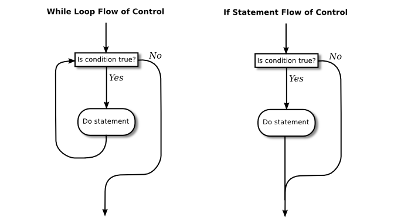

# Section 1: 블록, 루프 및 분기

복잡한 작업을 수행하는 컴퓨터의 능력은 단순한 명령어를 제어 구조로 결합하는 몇 가지 방식만으로 구축된다. 자바에서는, 프로그램 제어의 정상적인 흐름을 결정짓는 데 사용되는 그러한 구조가 단지 6개만 존재하고 — 사실, 어떤 작업을 수행하기 위해서는 3개만으로도 충분하다 여겨진다. 6개의 제어 구조는 다음과 같다: **block, while 루프, do..while 루프, for 루프, if 문**, 그리고 **switch 문**. 이러한 구조는 각각 하나의 "문장"이지만, 그 안에 하나 또는 그 이상의 다른 문장을 포함할 수 있는 **구조화된** 문장으로 간주된다.

<hr>

## 1. 블록
**블록(block)** 은 구조화된 문장의 가장 단순한 유형이다. 그것의 목적은 단순히 일련의 문장들을 하나의 문장으로 묶는 것이다. 블록의 형식은 다음과 같다:

```java
{
    statements
}
```

즉, 한 쌍의 중괄호인 "{"와 "}" 사이에 감싸진 일련의 문장으로 구성된다. 사실, 블록이 문장을 전혀 포함하지 않는 것도 가능하다; 그러한 블록을 **빈 블록(empty block)** 이라고 하며, 이는 실제로 유용할 때가 있다. 빈 블록은 비어있는 한 쌍의 중괄호로 이루어져 있다. 블록문(block statement)은 일반적으로 다른 문장의 내부에서 발생하는데, 여기서 블록문의 목적은 여러 문장을 하나의 단위로 묶는 것이다. 그러나 블록은 문장이 발생할 수 있는 모든 곳에서 허용될 수 있다. 블록이 요구되는 곳이 하나 존재한다: 프로그램의 `main` 서브루틴의 경우를 이미 인식한 바와 같이, 서브루틴의 정의는 블록인데 이는 한 쌍의 중괄호 안에 감싸진 일련의 문장이기 때문이다.

아마도 이 시점에서 자바를 자유형식(free-format) 언어라고 부르는 것에 다시 주목해야 할 것이다. 페이지에 언어를 배열하는 방법에 대한 구문 규칙은 없다. 예를 들어, 원한다면 한 행에 블록 전체를 쓸 수도 있다. 하지만 좋은 프로그래밍 스타일의 입장에선, 가능한 한 그 구조를 명확하게 할 수 있는 방법으로 해당 페이지에 프로그램을 배치해야 한다. 일반적으로 이것은 각 행마다 하나의 문장을 넣고 제어 구조의 내부에 문장들이 포함되어 있음을 나타내기 위해 들여쓰기(indentation)를 사용하는 것을 의미한다. 이것이 필자의 예제에서 사용할 형식이다.

블럭의 두 가지 예는 다음과 같다:

```java
{
System.out.print("The answer is ");
System.out.println(ans);
}


{  // This block exchanges the values of x and y
int temp;      // A temporary variable for use in this block.
temp = x;      // Save a copy of the value of x in temp.
x = y;         // Copy the value of y into x.
y = temp;      // Copy the value of temp into y.
}
```

두 번째 예에서는 변수인 `temp`가 블록 내부에 선언된다. 이것은 완벽하게 허용되고, 만약 그 변수가 다른 곳이 아닌 바로 해당 블록 안에서 사용되는 경우 블록 안에서 변수를 선언하는 것이 좋은 스타일이다. 블록 내부에 선언된 변수는 완전히 접근할 수 없고 블록 외부에서 보이지 않는다. 컴퓨터가 변수 선언문을 실행하면 변수 값(적어도 개념적으로는)을 보유하도록 메모리를 할당한다. 블록이 끝나면 해당 메모리는 폐기된다(즉, 재사용이 가능하도록 하였다). 이러한 변수는 블록에 대하여 **지역적(local)** 이라 한다. 식별자의 "범위(scope)"라고 불리는 일반적인 개념이 있다. 식별자의 **범위**는 식별자가 유효한 프로그램의 부분을 말한다. 블록 내부에서 정의되는 변수의 범위는 그 블록으로 제한되며, 더 구체적으로는 변수의 선언 후에 따라오는 블록 부분으로 제한된다.

<hr>

## 2. 기본 while 루프
블록 문장이 그 자체로는 실제로 프로그램의 흐름 제어에 영향을 미치지 않는다. 나머지 5개의 제어 구조가 영향을 미친다. 그들은 루프문(loop statement)과 분기문(branch statement) 두 종류로 나눌 수 있다. 완전히 범용 목적의 프로그래밍 언어를 습득하려면 각 범주에서 하나의 제어 구조만 있으면 된다. 그보다 더 많은 것은 단지 편리함에 지나지 않는다. 이 관에서는 `while` 루프와 `if` 문장에 대해 소개하겠다. 이 문장들과 나머지 세 가지 제어 구조에 대한 자세한 세부사항은 다음 관에서 설명하겠다.

주어진 문장을 반복하기 위해 **while 루프**를 사용한다. 물론, 이를 영원히 계속하여 반복하고 싶지는 않을 것이다. 그건 **무한 루프(infinite loop)** 일 텐데, 대체로 나쁜 것이다. (컴퓨터 선구자 그레이스 머레이 호퍼(Grace Murray Hopper)가 샴푸 병에 적힌 "빨고 헹구고 반복하라(lather, rinse, repeat)."는 지시문을 읽으면서 전하는 옛이야기가 있다. 이야기를 진행하자면, 그녀는 지시를 따르려 했지만 샴푸가 떨어졌다고 주장한다. (이해하지 못할까봐 첨언하면, 그녀는 컴퓨터가 아무 생각 없이 명령어들을 따르는 방식에 대해 농담을 하고 있었다.)

좀 더 구체적으로 말하면, `while` 루프는 문장을 계속하여 반복하지만 지정된 조건이 참인 경우에만 반복한다. `while` 루프에는 다음과 같은 형태가 있다:

```java
while (boolean-expression)
    statement
```

문장은 블록이 될 수 있고, 대개의 경우 블록이므로, 대부분의 `while` 루프는 다음과 같은 형태를 가진다:

```java
while (boolean-expression) {
    statement
}
```

몇몇 프로그래머들은 중괄호를 스타일에 관계없이 항상 포함시켜야 한다고 생각하며, 심지어 중괄호들 사이에 단 하나의 문장이 있을 때도 그러하다고 본다. 하지만 필자 스스로도 그 조언을 항상 따르는 것은 아니다.

`while` 문장의 의미론은 다음과 같다: 컴퓨터가 `while` 문장에 도달하면 `true` 또는 `false`를 값으로써 내놓는 {boolean-expression} 을 평가한다. 값이 `false`이면 컴퓨터는 나머지 `while` 루프를 건너뛰고 프로그램의 다음 명령어로 진행한다. 표현식의 값이 `true`이면 컴퓨터는 루프 내부의 {statement}나 문장 블록을 실행한다. 그리고 나서 `while` 루프의 시작으로 돌아가 과정을 반복한다. 즉, {boolean-expression}을 재평가하여 값이 `false`이면 루프를 종료하고, 값이 `true`이면 루프를 계속한다. 이것은 표현식의 값이 컴퓨터가 평가할 때 `false`가 될 때까지 계속될 것이다; 만약 그런 일이 절대로 일어나지 않는다면, 무한 루프가 되는 것이다.

여기 숫자 1, 2, 3, 4, 5를 간단하게 출력하는 `while` 루프의 예시가 있다:

```java
int number;   // The number to be printed.
number = 1;   // Start with 1.
while ( number < 6 ) {  // Keep going as long as number is < 6.
System.out.println(number);
number = number + 1;  // Go on to the next number.
}
System.out.println("Done!");
```

변수 `number`는 값 1로 초기화된다. 그래서 컴퓨터가 처음으로 "`number < 6`" 이라는 표현식을 평가할 때, 이는 1이 6보다 작은지 묻고 있는 것이며, 이는 `true`이다. 그러므로 컴퓨터는 루프 내부의 두 문장을 실행한다. 첫 번째 문장은 "1"을 출력한다. 두 번째 문장은 1을 `number`에 추가하고 해당 결과를 변수 `number`에 다시 저장한다; `number`의 값은 2로 변경된다. 컴퓨터는 루프의 끝에 도달했으므로, 처음부터 다시 돌아와 `number`가 6보다 작은지 되묻는다. 이는 또한 사실이므로 컴퓨터는 루프를 다시 실행하는데, 이번에는 `number`의 값으로 2를 출력한 다음 `number` 값을 3으로 변경한다. 결국 `number`가 6이 될 때까지 이런 식으로 계속된다. 그 시점에서 "`number < 6`"이라는 표현은 `false`로 평가된다. 그래서 컴퓨터는 루프의 끝을 지나 다음 문장으로 뛰어가서 "완료(Done)!"라는 메시지를 출력한다. 루프가 종료되면 `number`의 값은 6이지만 마지막으로 인쇄된 값은 5라는 점에 유의하라.

그건 그렇고, 진짜 프로그램에서는 절대로 자립해 있는 `while` 루프를 볼 수는 없다는 것을 기억해야 한다. 이는 항상 그 자체로 어떤 클래스 안에서 정의된 서브루틴 속에 있을 것이다. 완전한 프로그램 안에서 사용되는 `while` 루프의 예로서, 몇 년 동안의 투자에 대한 이자를 계산하는 작은 프로그램이 여기에 있다. 이는 1년간의 결과를 보고하였던 이전 장의 예제에 비해 개선된 것이다.

```java
import textio.TextIO;

/**
*  This class implements a simple program that will compute the amount of
*  interest that is earned on an investment over a period of 5 years.  The
*  initial amount of the investment and the interest rate are input by the
*  user.  The value of the investment at the end of each year is output.
*/
public class Interest3 {


public static void main(String[] args) {

      double principal;  // The value of the investment.
      double rate;       // The annual interest rate.

      /* Get the initial investment and interest rate from the user. */

      System.out.print("Enter the initial investment: ");
      principal = TextIO.getlnDouble();

      System.out.println();
      System.out.println("Enter the annual interest rate.");
      System.out.print("Enter a decimal, not a percentage: ");
      rate = TextIO.getlnDouble();
      System.out.println();

      /* Simulate the investment for 5 years. */

      int years;  // Counts the number of years that have passed.

      years = 0;
      while (years < 5) {
         double interest;  // Interest for this year.
         interest = principal * rate;
         principal = principal + interest;     // Add it to principal.
         years = years + 1;    // Count the current year.
         System.out.print("The value of the investment after ");
         System.out.print(years);
         System.out.print(" years is $");
         System.out.printf("%1.2f", principal);
         System.out.println();
      } // end of while loop

} // end of main()

} // end of class Interest3
```

당신은 이 프로그램을 공부해야 하며, 컴퓨터가 `while` 루프를 실행하면서 단계별로 무엇을 하는지를 이해해야 한다.

<hr>

## 3. 기본 if 문
**if 문(if statement)** 은 주어진 부울 값 표현식의 값이 참인지 거짓인지에 따라 컴퓨터에게 두 가지 선택 가능한 행동 과정 중 하나를 취하라고 지시한다. '분기화(branching)'나 '결정(decision)' 문장의 예인 것이다. `if` 문에는 다음과 같은 형식이 있다:

```java
if (boolean-expression)
    statement1
else
    statement2
```

컴퓨터가 `if` 문을 실행할 때 부울 표현식을 평가한다. 해당 값이 `true`이면 컴퓨터는 첫 번째 문장을 실행하고 "`else`" 뒤에 나오는 문장을 건너뛴다. 표현식의 값이 `false`이면 컴퓨터는 첫 번째 문장을 건너뛰고 두 번째 문장을 실행한다. 어떤 경우든 `if` 문 안에 있는 두 문장 중 오로지 하나만 실행된다는 점에 유의하라. 두 문장은 선택 가능한 행동 과정을 나타낸다; 컴퓨터는 부울 표현식의 값에 기초하여 이러한 행동 과정들 사이에서 결정을 내린다.

많은 경우에 있어, 컴퓨터가 무언가를 하는 것과 하지 않는 것 중 하나를 선택하기를 원한다. `else` 부분을 생략하는 `if` 문장으로 이 작업을 수행할 수 있다:

```java
if (boolean-expression)
    statement
```

이 문장을 실행하기 위해 컴퓨터는 표현식을 평가한다. 값이 `true`이면 컴퓨터는 `if` 문 안에 들어 있는 {statement}를 실행하고, 값이 `false`이면 컴퓨터는 해당 {statement}를 건너뛴다. 어느 경우이든, 컴퓨터는 프로그램의 `if` 문에 뒤따르는 것은 뭐든지 계속할 것이다.

가끔 초보 프로그래머들은 그 의미는 상당히 다르지만, 단순한 `if` 문(`else` 부분이 없는)과 `while` 문을 혼동한다. `if` 문 안의 {statement}는 기껏해야 한 번 실행되지만, `while` 문 안의 {statement}는 얼마든지 실행될 수 있다. `while` 및 단순한 `if` 문의 제어 흐름 도표를 살펴보는 것도 도움이 될 수 있을 것이다:



이 도표에서 화살표는 문장이 실행될 때 시간의 흐름을 나타낸다. 제어는 도표의 상단으로 들어가서 하단으로 빠진다. 마찬가지로, `if..else` 문에 대한 흐름 제어 도표는 두 개의 중첩된 문장 중 정확히 한 개가 실행된다는 것을 명확하게 보여준다:


<hr>

물론, `if` 문의 하나 또는 둘의 {statements}는 블록이 될 수 있으며, 다시금 많은 프로그래머들은 하나의 문장이라도 중괄호를 추가하는 것을 선호한다. 그래서 `if` 문은 종종 다음과 같이 보인다:

```java
if (boolean-expression) {
    statements
}
else {
    statements
}
```

또는:

```java
if (boolean-expression) {
    statements
}
```

예를 들어, `x`가 `y`보다 큰 경우에만 시작되는, `x`와 `y`라는 두 변수의 값을 교환하는 `if` 문이 여기에 있다. `if` 문이 실행된 이후 `x`의 값이 `y`의 값보다 확실히 작거나 같은지 확인할 수 있다:

```java
if ( x > y ) {
    int temp;      // 이 블록에서 사용할 임시 변수.
    temp = x;      // x의 값을 temp에 복사.
    x = y;         // y의 값을 x에 복사.
    y = temp;      // temp의 값을 y에 복사.
}
```

마지막으로, `else` 부분을 포함하는 `if` 문의 예제가 여기에 있다. 이것이 무엇을 하는지, 그리고 왜 사용되었는지 이해할 수 있을까:

```java
if ( years > 1 ) {  // handle case for 2 or more years
    System.out.print("The value of the investment after ");
    System.out.print(years);
    System.out.print(" years is $");
}
else {  // handle case for 1 year
    System.out.print("The value of the investment after 1 year is $");
}  // end of if statement
System.out.printf("%1.2f", principal);  // this is done in any case
```

이 장의 뒷부분에서 제어 구조에 대해 더 많은 이야기를 할 것이다. 하지만 이미 본질적인 것을 당신은 알고 있다. 만약 제어 구조에 대해 더 이상 아무것도 학습하지 못했다면, 이미 가능한 모든 컴퓨팅 작업을 수행할 수 있을 만큼 충분히 알고 있는 것이다. 간단한 루프와 분기만 있으면 된다!

<hr>

## 4. 확정적 할당
처음으로 접했을 때에는 완전히 이해하지 못할 수 있는 다소 기술적인 문제로 제어 구조에 대한 이러한 소개를 마치고자 한다. 완전히 동일한 것처럼 보이는 다음 두 가지의 코드 조각들(segments)을 생각해보자.

```java
int y;                          int y;
if (x < 0) {                    if (x < 0) {
y = 1;                           y = 1;
}                               }
else {                          if (x >= 0) {
y = 2;                           y = 2;
}                               }
System.out.println(y);          System.out.println(y);
```

왼쪽 버전에서 `y`는 `x < 0`이면 값 1이 할당되고, 그렇지 않으면, 즉 `x >= 0`이면 값 2가 할당된다. 오른쪽 버전에서도 이는 정확히 같다. 그러나 미묘한 차이가 존재한다. 실제로, 자바 컴파일러는 오른쪽의 코드의 `System.out.println` 문장에 대하여 오류를 보고하는 반면, 왼쪽의 코드는 완벽하게 괜찮다고 한다!

문제는 오른쪽의 코드에서 컴퓨터는 변수 `y`가 확실히 값을 할당받았음을 알 수 없다는 점이다. `if` 문장에 `else` 부분이 없는 경우, `if` 내부의 문장은 조건식의 값에 따라 실행될 수도 있고 실행되지 않을 수도 있다. 컴파일러는 프로그램이 실행 중일 때만 조건식이 평가되기 때문에 그 실행 여부를 알 수 없다. 위의 오른쪽 코드에 대해서는 컴파일러에 관한 한, `y = 1` 또는 `y = 2`의 **어느 쪽 문장**도 평가되지 **않을** 가능성이 있으므로, 출력문이 정의되지 않은 값을 인쇄하려고 시도할 가능성이 있다. 컴파일러는 이를 오류로 간주한다. 프로그램이 실행 중일 때, 변수의 값은 해당 시점에서 변수에 값이 할당되었는지를 컴파일러가 **확인**할(can verify) 수 있는 경우에만 사용할 수 있다. 이를 확정적 할당(definite assignment)이라고 한다. (이 예제에서 `y`에게 항상 값이 할당될 것이라 당신이 말할 수 있는 것은 문제가 되지 않는다. 문제는 컴파일러가 알 수 있느냐 하는 것이다.)

위의 왼쪽에 있는 코드에서, `y`에는 분명 값이 할당된다는 점에 유의하라. `if..else` 문에서, `if`의 조건식 값이 무엇이든 간에 두 가지 선택지 중 하나가 실행될 것이기 때문이다. `if..else` 문과 한 쌍의 단순한 `if` 문 사이의 차이점을 이해하는 것이 중요하다. 여기 같은 일을 하는 것처럼 보이지만, 그렇지 않는 또 다른 코드 조각들이 있다. 각 코드 조각들이 실행된 후 `x`의 값은 무엇일까?

```java
int x;                             int x;
x = -1;                            x = -1;
if (x < 0)                         if (x < 0)
x = 1;                             x = 1;
else                               if (x >= 0)
x = 2;                             x = 2;
```

왼쪽의 코드가 실행된 후에는 `x`가 1이 된다; 오른쪽의 코드가 실행된 후에는 `x`가 2가 된다. 믿기지 않는다면, 컴퓨터가 각각의 단계를 실행할 때 하는 일을 정확하게 수행하면서, 해당 코드를 단계별로 적용해보라.

