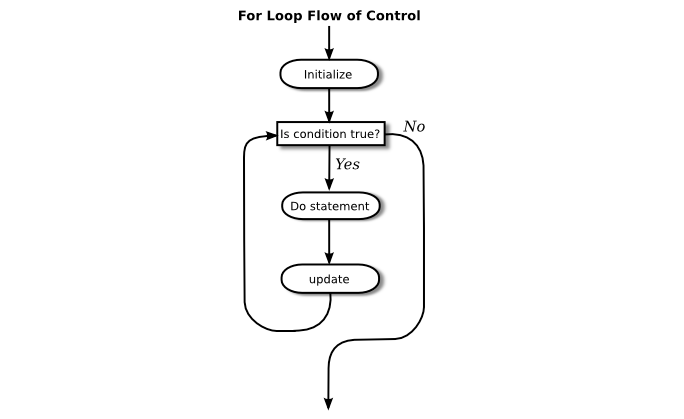

# Section 4: for문

다른 종류의 루프인 `for` 문에 관한 절로 진입한다. 어느 `for` 루프는 몇몇 `while` 루프와 같기 때문에, 언어는 `for` 문을 갖는 것으로 어떠한 추가적인 힘을 얻지는 못한다. 그러나 특정 유형의 문제의 경우, `for` 루프가 이에 대응되는 `while` 루프보다 구성하기 쉽고 읽기 쉽다. 실제 프로그램에서는, `for` 루프가 `while` 루프를 실제로 숫적으로 압도할 수 있다(그리고 필자는 오로지 `for` 루프만을 사용하는 적어도 한 명의 사람을 알고 있다).

## 1. for 루프
`for` 문은 일반적인 유형의 while 루프를 쓰기 쉽게 만든다. 많은 while 루프들이 다음의 일반적인 형태를 가진다:

```java
initialization
while (continuation-condition) {
    statements
    update
}
```

예를 들어, 제3장 제2절의 예제를 복사한 다음을 생각해보자:

```java
years = 0;  // 변수 years를 *초기화(initialize)*
while ( years < 5 ) {   // 루프를 계속하는 *조건(condition)*

    interest = principal * rate;    //
    principal += interest;          // 세 *문장들(statements)*을 실행
    System.out.println(principal);  //

    years++;   // 변수 years의 값을 *갱신(update)*
}
```

이 루프는 다음과 같은 `for` 문으로 작성될 수 있다:

```java
for ( years = 0;  years < 5;  years++ ) {
    interest = principal * rate;
    principal += interest;
    System.out.println(principal);
}
```

초기화(initialization), 연속 조건(continuation condition) 및 갱신(updating)은 모두 `for` 루프의 첫 번째 줄에 결합되어 있다. 이는 루프의 "제어"에 관련된 모든 것을 한 곳에 보관하여, 루프를 읽고 이해하기 쉽게 한다. `for` 루프는 원래 코드와 정확히 동일한 방식으로 실행된다: 초기화 부분은 루프가 시작되기 전에 한 번 실행된다. 연속 조건은 루프의 각 실행 전에 실행되며(첫 번째 실행을 포함한다), 이 조건이 `false`일 때 루프가 종료된다. 갱신 부분은 조건을 확인하기 위해 되돌아가기 바로 직전, 루프의 각 실행이 끝날 때 실행된다.

`for` 문의 공식적인 구문은 다음과 같다:

```java
for (initialization; continuation-condition; update)
    statement
```

또는 블록문 사용하는 경우:

```java
for (initialization; continuation-condition; update) {
    statement
}
```

{continuation-condition}은 부울 값 표현식이어야 한다. {initialization}는 보통 선언문이나 할당문이지만, 프로그램에서 문장으로서 허용되는 어떤 표현식도 가능하다. {update}는 어떤 간단한 문장도 가능하지만 일반적으로 증가, 감소 또는 할당문일 수 있다. 세 부분 중 어느 부분도 비워둘 수 있다. 연속 조건이 비어 있으면 `true`인 것처럼 취급되기 때문에, 루프는 `break` 문과 같은 어떤 다른 사유로 끝날 때까지 영원히 반복될 것이다. (몇몇 사람들은 "`while (true)`" 대신 "`for (;;)`"로 무한 루프를 시작하길 좋아한다.) 다음은 `for` 문에 대한 흐름 제어 도표이다:



일반적으로 `for` 문 초기화 부분은 일부 변수에 값을 할당하고, 갱신은 할당문이나 증가 또는 감소 연산을 사용하여 해당 변수의 값을 변경한다. 변수의 값은 연속 조건에서 테스트되며, 이 조건이 `false`로 평가될 때 루프가 종료된다. 이런 방식으로 사용되는 변수를 **루프 제어 변수(loop control variable)** 라고 한다. 위에 제시된 예제에서 루프 제어 변수는 `years`였다.

분명, `for` 루프에 대한 가장 일반적인 유형은 **계수 루프(counting loop)** 인데, 여기서 루프 제어 변수는 최소값과 최대값 사이의 모든 정수 값을 취한다. 계수 루프는 다음 형태를 지닌다:

```java
for (variable = min; variable <= max; variable++) {
    statements
}
```

여기서 {min} 및 {max}는 정수 값 표현식(일반적으로 상수)이다. {variable}은 {min}, {min}+1, {min}+2, ..., {max}를 취한다. 루프 제어 변수의 값은 종종 루프 본체에서 사용된다. 이 절의 시작 부분에 있는 for 루프는 루프 제어 변수인 `years`가 1, 2, 3, 4, 5의 값을 가지는 계수 루프다. 심지어 표준 출력에서 숫자 1, 2, ..., 10이 표시되는 더 간단한 예제가 여기에 있다:

```java
for ( N = 1 ;  N <= 10 ;  N++ )
    System.out.println( N );
```

여러 가지 이유로 자바 프로그래머들은 1이 아닌 0에서 수를 세는 것을 좋아하며, 해당 조건에서 "<="가 아닌 "<"를 사용하는 경향이 있다. 위의 루프의 다음과 같은 변형들은 10개의 숫자 0, 1, 2, ..., 9를 출력한다.

```java
for ( N = 0 ;  N < 10 ;  N++ )
    System.out.println( N );
```

테스트에서 < 대신 <=를 사용하는 것, 또는 그 반대는 프로그램에서 1이 차이나는 오류(off-by-one error)가 발생하는 공통적인 원인이다. 당신은 항상 가만히 생각해야만 한다. 최종 값을 처리하기를 원하는가, 아닌가?

수를 오름으로 세기보다 10에서 1까지 내림으로 세는 것이 쉽다. 10으로 시작하여, 루프 제어 변수를 증가시키는 대신 감소시키고, 변수가 1보다 크거나 같아질 때까지 계속한다.

```java
for ( N = 10 ;  N >= 1 ;  N-- )
    System.out.println( N );
```

현재, `for` 문의 공식 구문은 실제로 초기화 부분과 갱신 부분 모두 쉼표로 구분된 여러 표현식으로 구성되는 것을 허용한다. 그래서 우리는 심지어 1에서 10까지 셀 수 있고 동시에 10에서 1까지 셀 수도 있다!

```java
for ( i=1, j=10;  i <= 10;  i++, j-- ) {
    System.out.printf("%5d", i); // i를 문자 5개의 넓이로 출력.
    System.out.printf("%5d", j); // j를 문자 5개의 넓이로 출력.
    System.out.println();       // 행을 종료.
}
```

마지막 입문 예제로써, 2와 20 사이의 짝수 숫자만을 출력하는 `for` 루프를 사용하고 싶다고 하자. 즉: 2, 4, 6, 8, 10, 12, 14, 16, 18, 20. 이를 구현하는 여러 방법이 있다. 네 가지 다른 해결책이 여기에 있는데, 아주 간단한 문제라도 어떻게 여러 방법으로 해결할 수 있는지를 보여주기 위한 것이다(이 중 세 가지는 만점(full credit)을 받을 것이다):

```java
(1)   // 출력할 숫자 열 개가 있다.
    // 1, 2, ..., 10을 세기 위해 for 루프를      
    // 사용한다.  출력하고자 하는 숫자들은           
    // 2*1, 2*2, ... 2*10이다.

       for (N = 1; N <= 10; N++) {              
          System.out.println( 2*N );                
       }


(2)   // 루프를 통과하는 각 시점마다
    // N에 2를 더하여
    // 2, 4, ..., 20을 직접적으로
    // 세는 for 루프를 사용한다.

       for (N = 2; N <= 20; N = N + 2) {
          System.out.println( N );
       }


(3)   // 모든 숫자들 2, 3, 4, ...,   
    // 19, 20을 세지만 해당 숫자들              
    // 중 오로지 짝수인 경우에만              
    // 출력을 한다.

       for (N = 2; N <= 20; N++) {               
          if ( N % 2 == 0 ) // N이 짝수인가?           
             System.out.println( N );               
       } 


(4)   // 이 멍청한 과제를
    // 비웃으면서 문자 그대로
    // 따라가는 답안으로
    // 교수를 귀찮게 한다.

       for (N = 1; N <= 1; N++) {
          System.out.println("2 4 6 8 10 12 14 16 18 20");
       }
```

아마도 변수 선언을 제외한 모든 문장들과 마찬가지로, `for` 문은 결코 실제 프로그램에서 단독으로 나타나지는 않는다는 점을 다시 한 번 강조할 가치가 있을 것이다. 문장은 프로그램의 `main` 루틴 내부 또는 다른 서브루틴 내부에 있어야 한다. 그리고 해당 서브루틴은 클래스 안에서 정의되어야 한다. 또한 모든 변수는 사용되기 전에 선언되어야 하며, 이는 `for` 문 안에 있는 루프 제어 변수에도 해당되는 점을 지적하고자 한다. 이 절의 지금까지 살펴본 모든 예제에서 루프 제어 변수는 int 자료형으로 선언되어야 한다. 루프 제어 변수가 정수일 필요는 없다. 예를 들어, ++ 연산자를 숫자뿐만 아니라 문자에도 적용할 수 있다는 사실을 사용하여, char 자료형 변수 `ch`가 안에 있는 `for` 루프가 여기에 있다:

```java
// 출력으로 한 줄에 알파벳을 인쇄하기.
char ch;  // 루프 제어 변수;
        //       인쇄될 문자들 중 하나.
for ( ch = 'A';  ch <= 'Z';  ch++ )
    System.out.print(ch);
System.out.println();
```

## 2. 예제: 약수 세기
`for` 루프로 풀 수 있는 덜 사소한 문제를 살펴보자. N과 D가 양의 정수이고 N이 D로 나누어질 때의 나머지가 0이라면, D가 N의 약수(divisor)라고 한다. (같은 의미로, N은 D의 짝수 배수라고 말할 수 있다.) 자바 프로그래밍의 관점에서 N % D가 0이면 D는 N의 약수이다.

사용자로부터 양의 정수인 N을 입력받아, N이 몇 개의 다른 약수를 가지고 있는지 계산하는 프로그램을 작성해 보자. N의 약수가 될 수 있는 숫자는 1, 2, ..., N이다. N의 약수를 계산하려면, N의 가능한 약수를 각각 테스트하고 실제로 N을 균등하게 나누는 것들을 세면 된다. (이것은 옳은 답안이지만, 이 작업을 수행하는 가장 효율적인 방법은 분명 아니다.) 유사코드에서, 해당 알고리즘은 다음 형식을 취한다:

```java
사용자로부터 양의 정수 N을 얻는다
설정 divisorCount = 0
1부터 N 사이의 각각의 숫자인 testDivisor를 반복하여:
    testDivisor가 N의 약수라면:
        divisorCount에 1을 더해서 그 숫자를 센다
갯수를 출력한다
```

이 알고리즘은 나열된 항목 중, 전부는 아니지만, 일부 항목을 처리할 때 사용되는 공통 프로그래밍 패턴을 표시한다. 일반적인 패턴은

```java
나열된 각각의 항목을 반복하여:
    해당 항목이 테스트를 통과하면:
        이를 처리한다
```

약수를 세는 알고리즘의 `for` 루프는 다음과 같이 자바 코드로 번역될 수 있다:

```java
for (testDivisor = 1; testDivisor <= N; testDivisor++) {
    if ( N % testDivisor == 0 )
        divisorCount++;
}
```
현대 컴퓨터에서는 이 루프가 매우 빨리 실행될 수 있다. 심지어 가장 큰 허용되는 int 값인 2147483647에 대해서도 실행이 불가능한 것은 아니다. (더 큰 값에 대해해 실행하려면 int 보다 long 자료형의 변수를 사용할 수 있을 것이다.) 그러나, 매우 많은 수에 대해서 상당한 시간이 소요된다. 그래서 필자는 해당 알고리즘을 구현했을 때, 컴퓨터가 천만 개의 가능한 약수를 테스트할 때마다 점(dot)을 출력하기로 결정했다. 개선된 버전의 프로그램에서는 두 가지 유형의 계수(counting)가 진행되고 있다. 약수의 갯수를 세어야 하고 또한 테스트를 거친 가능한 약수의 갯수를 세어야 한다. 따라서 해당 프로그램은 두 개의 카운터(counter)가 필요하다. 두 번째 카운터가 10000000에 도달하면 프로그램은 '.'를 출력하고 카운터를 0으로 재설정하여 다음 그룹인 천만 개를 셀 수 있도록 한다. 유사코드로 되돌아가면, 알고리즘은 이제 다음과 같이 보일 것이다:

```java
사용자로부터 양의 정수 N을 얻는다
설정 divisorCount = 0  // 발견된 약수의 갯수
설정 numberTested = 0  // 테스트된 가능한 약수의 갯수
                    //  출력된 마지막 점 이래로.
1부터 N 사이의 각각의 숫자인 testDivisor를 반복하여:
    testDivisor가 N의 약수라면:
        divisorCount에 1을 더해서 그 숫자를 센다
    numberTested에 1을 더한다
    numberTested가 10000000이라면:
        '.'을 출력한다
        numberTested를 0으로 재설정한다
갯수를 출력한다
```

마지막으로 알고리즘을 완전한 자바 프로그램으로 변환할 수 있다.

```java
import textio.TextIO;

/**
 * This program reads a positive integer from the user.
 * It counts how many divisors that number has, and
 * then it prints the result.
 */
public class CountDivisors {

    public static void main(String[] args) {

        int N;  // A positive integer entered by the user.
                // Divisors of this number will be counted.

        int testDivisor;  // A number between 1 and N that is a
                        // possible divisor of N.

        int divisorCount;  // Number of divisors of N that have been found.

        int numberTested;  // Used to count how many possible divisors
                        // of N have been tested.  When the number
                        // reaches 10000000, a period is output and
                    // the value of numberTested is reset to zero.

    /* Get a positive integer from the user. */

        while (true) {
            System.out.print("Enter a positive integer: ");
            N = TextIO.getlnInt();
            if (N > 0)
                break;
            System.out.println("That number is not positive.  Please try again.");
        }

    /* Count the divisors, printing a "." after every 10000000 tests. */

        divisorCount = 0;
        numberTested = 0;

        for (testDivisor = 1; testDivisor <= N; testDivisor++) {
            if ( N % testDivisor == 0 )
                divisorCount++;
            numberTested++;
            if (numberTested == 10000000) {
                System.out.print('.');
                numberTested = 0;
            }
        }

    /* Display the result. */
      
        System.out.println();
        System.out.println("The number of divisors of " + N
            + " is " + divisorCount);

    } // end main()

} // end class CountDivisors

```

## 3. 루프 중첩
자바에 있는 제어 구조는 다른 간단한 문장이 포함된 문장이다. 특히 제어 구조는 제어 구조를 포함할 수 있다. 이미 루프 내부의 `if` 문에 관한 여러 예제와, 다른 `while` 안에 있는 `while` 루프의 한 예제를 보았을 것이나, 다른 내부에 있는 한 제어 구조의 어느 조합도 가능하다. 우리는 한 구조가 다른 구조에 중첩되어(nested) 있다고 말한다. 심지어 다른 `while` 루프 안에 있는 `if` 문의 안에 있는 `while` 루프와 같은 여러 단계의 중첩도 가능하다. 자바의 구문은 중첩 단계의 수에 제한을 두지 않는다. 그럼에도 실제적인 문제로서, 몇 단계 이상의 중첩을 가진 프로그램을 이해하는 것은 어렵다.

중첩된 `for` 루프는 많은 알고리즘에서 자연적으로 발생하며, 이들이 어떻게 작동하는지 이해하는 것이 중요하다. 몇 가지 예를 보겠다. 우선, 다음과 같은 곱셈표를 인쇄하는 문제를 생각해보자:

```html
1   2   3   4   5   6   7   8   9  10  11  12
2   4   6   8  10  12  14  16  18  20  22  24
3   6   9  12  15  18  21  24  27  30  33  36
4   8  12  16  20  24  28  32  36  40  44  48
5  10  15  20  25  30  35  40  45  50  55  60
6  12  18  24  30  36  42  48  54  60  66  72
7  14  21  28  35  42  49  56  63  70  77  84
8  16  24  32  40  48  56  64  72  80  88  96
9  18  27  36  45  54  63  72  81  90  99 108
10  20  30  40  50  60  70  80  90 100 110 120
11  22  33  44  55  66  77  88  99 110 121 132
12  24  36  48  60  72  84  96 108 120 132 144
```

표의 데이터는 12행(rows) 12열(columns)로 배열되어 있다. 이들을 출력하는 과정은 다음과 같이 유사코드 알고리즘으로 표현할 수 있다:

```java
각각의 rowNumber = 1, 2, 3, ..., 12를 반복하여:
    rowNumber의 첫 번째 배수들 12개를 한 줄에 출력한다
    캐리지 리턴을 출력한다
```

`for` 루프의 첫 번째 단계는 `for` 루프 자체로 표현될 수 있다. 다음과 같이 "`rowNumber`의 첫 번째 배수들 12개를 한 줄에 출력한다"를 확장할 수 있다:

```java
N = 1, 2, 3, ..., 12를 반복하여:
    N * rowNumber를 출력한다
```

따라서 표 인쇄를 위한 수정된 알고리즘은 다른 루프 안에 중첩된 `for` 루프를 지닌다:

```java
각각의 rowNumber = 1, 2, 3, ..., 12:
    N = 1, 2, 3, ..., 12를 반복하여:
        N * rowNumber를 출력한다
    캐리지 리턴을 출력한다
```

우리는 각 출력 번호가 4개의 공백을 차지하는 깔끔한 열로 출력을 인쇄하고 싶다. 이 작업은 형식 지정자(format specifier) `%4d`를 사용한 형식화된 출력으로 가능해진다. `rowNumber`와 `N`이 int 자료형의 변수로 선언되었다고 가정하면 알고리즘은 다음과 같이 자바로 표현할 수 있다:

```java
for ( rowNumber = 1;  rowNumber <= 12;  rowNumber++ ) {
    for ( N = 1;  N <= 12;  N++ ) {
        // 4자리 열로 출력
        System.out.printf( "%4d", N * rowNumber );  // 캐리지 리턴 없이!
    }
    System.out.println();  // 각 행의 끝에 캐리지 리턴 추가.
}
```

이 절은 숫자 처리의 많은 예제들로 짓눌렸다. 다음 예제에서는 텍스트 처리를 할 것이다. 주어진 문자열에서 26개의 알파벳 문자 중 어떤 문자가 나타나는지 알아내는 문제를 생각해보자. 예를 들어, "Hello World"에서 나타나는 글자는 D, E, H, L, O, R, 그리고 W이다. 보다 구체적으로는, 문자열에 포함된 모든 글자를 나열하고 다른 글자들의 숫자도 세는 프로그램을 작성하게 된다. 문자열은 사용자에 의해 입력된다. 프로그램에 관한 유사코드 알고리즘부터 시작하자:

```hava
문자열 입력을 사용자에게 요청한다
응답을 읽어 변수 str에 입력한다
설정 count = 0  (다른 문자들의 수를 세기 위해)
알파벳의 각 문자를 반복하는 동안:
  str에 해당 문자가 나타나면:
    해당 문자를 출력한다
    count에 1을 더한다
count를 출력한다
```

사용자가 입력한 텍스트의 전체 행을 처리하고자 하기에, 이를 읽기 위해 `TextIO.getln()`을 사용한다. "알파벳의 각 문자를 반복"이란 알고리즘 행은 "`for (letter='A'; letter<='Z'; letter++)`"으로 표현될 수 있다. 하지만 우리가 프로그램을 작성하기 전, `for` 루프 안에 있는 `if` 문은 더 많은 생각을 할 필요가 있다. 주어진 문자, `letter`가 `str`에서 나타나는지를 어떻게 확인할 것인가? 한 아이디어는 문자열의 각 문자를 차례대로 살펴, 해당 문자가 `letter`와 동일한지 확인하는 것이다. `str.charAt(i)` 함수 호출로 `str`의 `i`번째 문자를 얻을 수 있는데, 여기서 `i`의 범위는 0부터 `str.length() - 1`까지다.

한 가지 더 어려운 점: 'A'와 같은 문자는 대문자 또는 소문자, 'A' 또는 'a'로 `str`에서 나타날 수 있다. 이 두 가지를 모두 확인해야 한다. 그러나 처리 전에 `str`을 대문자로 변환함으로써 이러한 어려움을 피할 수 있다. 그리하여 대문자만 확인하면 되는 것이다. 이제 알고리즘을 완전히 구체화할 수 있다:

```java
문자열 입력을 사용자에게 요청한다
응답을 읽어 변수 str에 입력한다
str을 대문자로 변환한다
설정 count = 0
letter = 'A', 'B', ..., 'Z'를 반복하면서:
    i = 0, 1, ..., str.length() - 1을 반복하면서:
        letter == str.charAt(i)이라면:
        해당 문자를 출력한다
        count에 1을 더한다
        중단 // 문자의 중복 세기를 피하기 위해 루프를 뛰어나감
count를 출력한다
```

중첩된 `for` 루프에서 `break`의 사용에 주의하라. 주어진 문자를 둘 이상 인쇄하거나 세지 않을 것이 요구된다(문자열에서 둘 이상 나타나는 경우에). `break` 문은 안쪽 `for` 루프를 중단시키지만, 바깥쪽 `for` 루프는 그렇지 않다. 해당 `break`를 실행하면 컴퓨터는 다음의 `letter` 값으로 바깥쪽 루프를 계속한다. `break` 문이 생략된 경우 이 프로그램의 끝에서 `count`가 어떻게 될 것인지를 정확히 파악하도록 노력해야 한다. 완성된 프로그램은 여기에 있다:

```java
import textio.TextIO;

/**
* This program reads a line of text entered by the user.
* It prints a list of the letters that occur in the text,
* and it reports how many different letters were found.
*/
public class ListLetters {

    public static void main(String[] args) {

        String str;  // 사용자가 입력한 텍스트 행.
        int count;   // str에서 발견된 다른 문자들의 수.
        char letter; // 알파벳의 문자.

        System.out.println("한 행으로 된 텍스트를 입력하세요.");
        str = TextIO.getln();

        str = str.toUpperCase();

        count = 0;
        System.out.println("당신의 입력은 다음 문자들을 가지고 있습니다:");
        System.out.println();
        System.out.print("   ");
        for ( letter = 'A'; letter <= 'Z'; letter++ ) {
            int i;  // str에서 문자의 위치.
            for ( i = 0; i < str.length(); i++ ) {
                if ( letter == str.charAt(i) ) {
                    System.out.print(letter);
                    System.out.print(' ');
                    count++;
                    break;
                }
            }
        }

        System.out.println();
        System.out.println();
        System.out.println("다른 문자들이 " + count + " 개 있습니다.");

    } // main() 종료

} // class ListLetters 종료
```

사실, 주어진 문자가 문자열 `str`에서 나타나는지 여부를 판단하는 더 쉬운 방법이 있다. 문자열에 문자가 나타나지 **않으면** 내장 함수 `str.indexOf(letter)` 는 -1을 반환할 것이다. 문자가 나타나면 0보다 크거나 같은 숫자를 반환한다. 그래서 단순히 "`if (str.indexOf(letter) >= 0)`"을 검사하는 것으로 `letter`가 `str`에 나타나는지 확인할 수 있었다. 이런 수법을 위의 프로그램에 사용했다면 중첩 루프가 필요없었을 것이다. 이는 서브루틴을 사용하여 복잡성을 처리하는 법을 미리 보여준다.

