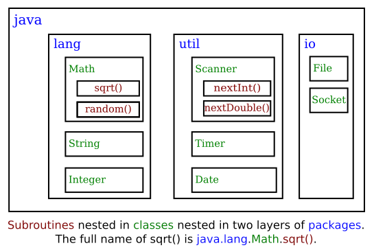

# Section 6: API, Package, module 및 Javadoc

컴퓨터와 이들의 사용자 인터페이스가 사용하기 쉬워짐에 따라, 프로그래머들도 이들을 다루기 더 복잡해졌다. 콘솔에 출력을 쓰고 사용자가 입력한 응답을 읽는 몇 개의 서브루틴을 사용하여 간단한 콘솔 스타일의 사용자 인터페이스를 위한 프로그램을 작성할 수 있다. 윈도우, 버튼, 스크롤 바, 메뉴, 텍스트 입력 상자 등을 갖춘 현대적인 그래픽 사용자 인터페이스는 사용자들을 더 쉽게 할 수 있지만, 이는 프로그래머가 엄청나게 확장된 가능성들의 집합체에 대처하도록 강요한다. 프로그래머는 이러한 증가된 복잡성이 다른 목적뿐만 아니라 사용자 인터페이스 관리를 위해 제공되는 엄청난 수의 서브루틴들의 형태로 본다.

<hr>

## 1. 도구상자
원래의 매킨토시 컴퓨터를 위한 프로그램을 원하는 — 그리고 사용자들이 기대한 대로 보이고 행동하는 프로그램을 제작하고자 하는 — 사람은, 천여 개가 훨씬 넘는 다른 서브루틴의 모음인 "매킨토시 도구상자(Macintosh Toolbox)"를 다루어야 했다. 윈도우를 열고 닫는 루틴, 기하학적 도형과 텍스트를 윈도우에 그리는 루틴, 윈도우에 버튼을 추가하는 루틴, 윈도우에서 마우스 클릭에 응답하는 루틴이 있었다. 메뉴를 만들고 메뉴에서 사용자 선택에 반응하는 다른 루틴이 있었다. 사용자 인터페이스 외에도, 파일을 열고 이로부터 데이터를 읽는 루틴, 네트워크를 통해 통신하는 루틴, 프린터로 출력을 전송하는 루틴, 프로그램 간의 통신 처리를 위한 루틴, 그리고 컴퓨터가 해야 하는 모든 표준적인 일을 하는 루틴들이 있었다. 마이크로소프트 윈도우즈(Microsoft Windows)는 프로그래머들이 사용할 자체 서브루틴 집합을 제공하며, 이들은 맥에서 사용되는 서브루틴과는 상당히 다르다. 리눅스는 프로그래머가 선택할 수 있는 몇 가지 다른 GUI 도구상자를 가지고 있다.

"도구상자(toolbox)"란 비유는 명심해야 할 대목이다. 모든 프로그래밍 프로젝트는 기존 도구의 혁신 및 재사용의 혼합과 관련된다. 프로그래머에게는 언어에 내장된 기본 도구들의 집합으로 시작하는, 다룰 수 있는 도구의 집합이 주어진다: 변수, 할당문, if 문, 루프와 같은 것들 말이다. 여기에, 프로그래머는 특정 업무를 수행하기 위해 이미 작성된, 루틴으로 가득 찬 기존 도구상자를 추가할 수 있다. 이러한 도구들은, 잘 설계된 경우라면, 진정한 블랙박스로 사용될 수 있다: 이러한 작업을 수행하기 위해 거쳐야 하는 특정 단계에 대해 걱정하지 않고 할당된 작업을 수행하도록 호출될 수 있다. 프로그래밍의 혁신적인 부분은 이러한 모든 도구를 가져다가 특정한 프로젝트나 문제(워드프로세싱, 은행 계좌 추적, 우주 탐사선의 이미지 데이터 처리, 웹 브라우징, 컴퓨터 게임, ...)에 적용하는 것이다. 이것을 **응용프로그램 프로그래밍(applications programming)** 이라고 한다.

소프트웨어 도구상자는 블랙박스의 일종으로 프로그래머에게 일정한 인터페이스를 제시한다. 이 인터페이스는 도구상자에 어떤 루틴이 있는지, 어떤 매개변수를 사용하는지, 어떤 작업을 수행하는지에 대한 명세(specification)이다. 이 정보는 도구상자와 관련된 **API** 또는 **응용프로그램 프로그래밍 인터페이스(Application Programming Interface)** 를 구성한다. Macintosh API는 매킨토시 도구상자에서 사용할 수 있는 모든 루틴의 명세이다. 일부 하드웨어 장치 — 말하자면 컴퓨터를 네트워크에 연결하는 카드 — 를 만드는 회사는 프로그래머가 해당 장치와 통신하고 이를 제어하기 위해 호출할 수 있는 루틴 목록으로 구성된 API를 발표할 것이다. 몇몇 복잡한 계산을 — 예컨대 "차등 방정식(differential equations)"을 해결하는 것처럼 — 위한 루틴의 집합을 작성하는 과학자들은 다른 사람들이 수행하는 계산의 세부사항을 이해하지 않고도 그러한 루틴을 사용할 수 있도록 하는 API를 제공할 것이다.

<hr>

자바 프로그래밍 언어는 거대한, 표준 API로 보완된다. 이 API의 일부를 `Math.sqrt()`와 같은 수학 서브루틴, String 데이터 자료형 및 관련 루틴, `System.out.print()` 루틴의 형태로 이미 보았을 것이다. 표준 자바 API에는 그래픽 사용자 인터페이스, 네트워크 통신, 파일 읽기 및 쓰기 등의 루틴이 포함되어 있다. 이러한 루틴을 자바 언어의 일부로 생각하는 것은 구미가 당기는 일이지만, 이들은 기술적으로 자바 프로그램에서 사용할 수 있도록 작성된 서브루틴이다.

자바는 플랫폼에 독립적(platform-independent)이다. 즉, 동일한 프로그램이 Mac OS, 윈도우즈, 리눅스 등 다양한 플랫폼에서 실행될 수 있다. 이 모든 플랫폼에서 동일한 자바 API가 작동해야 한다. 그러나 플랫폼에 독립적인 것은 바로 **인터페이스**라는 사실에 주목하라; API의 일부 부분에 대한 구현(implementation)은 플랫폼마다 다르다. 특정 컴퓨터의 자바 시스템은 모든 표준 API 루틴의 구현을 포함한다. 자바 프로그램은 이러한 루틴에 대한 **호출**만 포함한다. 자바 인터프리터(interpreter)가 프로그램을 실행하고 표준 루틴 중 하나에 대한 호출을 대면하면, 인터프리터는 멈춘 다음 이것이 실행되고 있는 특정 플랫폼에 적합한 해당 루틴의 구현을 실행할 것이다. 이는 매우 강력한 개념이다. 즉 다종다양한 플랫폼을 프로그래밍하기 위해 하나의 API만 배우면 된다는 뜻이다.

<hr>

## 2. 자바의 표준 패키지
자바의 모든 서브루틴과 마찬가지로, 표준 API의 루틴은 클래스로 그룹화된다. 더 큰 규모의 조직을 지원하기 위해 자바의 클래스는 제2장 제6절 제7관에서 간략하게 소개된 **패키지(package)** 로 그룹화할 수 있다. 패키지에는 다른 패키지도 포함될 수 있기 때문에, 그룹화 수준은 훨씬 더 높을 수 있다. 실제로, 전체적인 표준 자바 API는 여러 패키지로 구현된다. 이 중 "`java`"라는 이름이 붙여진 것에는 원래의 AWT 그래픽 사용자 인터페이스 클래스뿐만 아니라 여러 개의 GUI가 아닌 패키지가 포함되어 있다. 또 다른 패키지인 "`javax`"는 다른 많은 클래스뿐만 아니라 Swing 그래픽 사용자 인터페이스에서 사용되는 클래스를 포함하고 있다. 그리고 "`javafx`"는 이 교재에서 GUI 프로그래밍에 사용되는 JavaFX API를 포함하고 있다.

패키지는 클래스와 다른 패키지 둘 다를 포함할 수 있다. 다른 패키지에 포함된 패키지를 "하위 패키지(sub-package)"라고 부르기도 한다. `java` 패키지와 `javafx` 패키지 모두 하위 패키지를 포함하고 있다. 예를 들어, `java`의 하위 패키지 중 하나는 "`util`"이라는 이름이다. `util`은 `java` 안에 포함되어 있기 때문에, 그 전체 이름은 실제로 `java.util`이다. 이 패키지에는 제2장 제4절 제6관에서 논의된 Scanner 클래스를 포함하여 다양한 유틸리티(utility) 클래스가 포함되어 있다. `java` 패키지에는 입/출력 설비를 제공하는 `java.io`, 네트워크 통신을 취급하는 `java.net` 등 여러 개의 다른 하위 패키지가 포함되어 있다. 가장 기본적인 패키지는 `java.lang`이라 한다. 이 패키지는 String, Math, Integer, 그리고 Double 과 같은 핵심적인 클래스를 포함한다.

`java` 패키지의 중첩 수준, 그 하위 패키지, 그 하위 패키지의 클래스 및 해당 클래스의 서브루틴을 그래픽으로 보여주는 것이 도움이 될 수도 있을 것이다. 각 요소의 여러 항목 중 극히 일부만 표시되기에, 이는 완전한 그림은 아니다:



(그림 하단 부분: 패키지의 두 레이어 안에 중첩된 클래스 안에 중첩된 서브루틴.
sqrt()의 전체 이름은 java.lang.Math.sqrt())

마찬가지로, `javafx` 패키지에는 `javafx.scene` 패키지가 들어 있으며, 이 패키지에는 순서대로 `javafx.scene.control`이 포함되어 있다. 이 패키지에는 버튼, 입력 박스 등 GUI 구성요소를 나타내는 클래스가 포함되어 있다. 또 다른 하위 패키지인 `javafx.scene.paint`에는 도형을 채우고 스트로크(stroke)하는 방법을 정의하는 클래스 Color 및 기타 클래스가 포함되어 있다.

표준 자바 API에는 수백 개의 패키지에 수천 개의 클래스가 포함되어 있다. 대부분의 클래스는 다소 모호하거나 매우 특화되었지만, 사용 가능한 것을 알기 위해 설명서를 살펴볼 필요도 있을 것이다. 필자가 이 문서를 작성하는 현재, 자바 8의 완전한 기본 API 문서를 다음에서 찾을 수 있고:

https://docs.oracle.com/javase/8/docs/api/

JavaFX의 경우에는 다음에서 찾을 수 있다:

https://docs.oracle.com/javase/8/javafx/api/toc.htm

자바 9에서 이루어진 변경에 대한 논의와 자바 11에 대한 문서에 대한 링크는 아래의 "모듈"에 대한 관을 참조하라. 그러나, 이 교재의 목적상, 아마도 자바 8 문서를 사용하는 것이 더 쉽다는 점을 알게 될 것이다.

전문가 프로그래머도 자바 API 전체를 잘 알지는 못할 것이고, 심지어 그 대다수가 잘 알지 못할 것이다. 이 책에서 당신은 단지 수십의 클래스만을 접할 것이나, 이들은 다양한 프로그램을 작성하기에 충분한 능력이 있다.

<hr>

## 3. 패키지로부터 클래스 사용하기
작성하고 있는 프로그램에서 `javafx.scene.paint.Color` 클래스를 사용하고 싶다고 하자. 이는 `javafx.scene.paint` 패키지에 있는 클래스 Color 의 전체 이름이다. 여느 클래스처럼, `javafx.scene.paint.Color`은 자료형으로, 변수와 매개변수를 선언하고 함수의 반환 유형을 지정하는 데 이를 사용할 수 있음을 의미한다. 이를 하는 한 가지 방법은 클래스의 전체 이름을 자료형 이름으로써 사용하는 것이다. 예를 들어, Color 자료형의 `rectColor`라는 변수를 선언하려고 한다고 가정하자. 다음과 같이 할 수 있을 것이다:

```java
javafx.scene.paint.Color rectColor;
```

이것은 "{type-name variable-name;}" 형식의 일반적인 변수 선언일 뿐이다. 물론, 모든 클래스의 전체 이름을 사용하는 것은 지겨운 일이고, 프로그램에서 사용되는 이와 같은 전체 이름은 거의 볼 수 없을 것이다. 자바는 클래스 **가져오기(importing)** 를 통해 클래스 전체 이름의 사용을 피하도록 할 수 있다. 만약 다음 문장

```java
import javafx.scene.paint.Color;
```

을 자바 소스 코드 파일의 시작 부분에 넣으면, 파일의 나머지 부분에서는 전체 이름인 `javafx.scene.paint.Color`를, 클래스의 간결한 이름인 `Color`로 축약할 수 있다. `import` 행은 파일의 시작 부분에(`package`이 있다면 그 뒤에) 나타나며 클래스 안에 있지 않다는 점에 유의하라. 이는 때로는 문장이라 지칭되기도 하지만, 통상적인 의미로는 문장이 아니기 때문에 **가져오기 명령(import directive)** 라고 하는 것이 더 적절하다. `import` 명령인 "`import javafx.scene.paint.Color`"은 변수 선언을 위해

```java
Color rectColor;
```

라고 할 수 있도록 한다. `import` 명령의 유일한 효과는 전체 "package.class" 이름 대신 간결한 클래스 이름을 사용할 수 있게 한다는 점에 유의하라. 실제로 실질적인 무언가를 가져오는 것은 아니다; `import` 명령을 생략해도 여전히 클래스에 접근할 수 있으며 — 단지 전체 이름을 사용해야 한다는 말이다. 주어진 패키지에서 모든 클래스를 가져오는 지름길(shortcut)이 있다. 예를 들어, 다음과 같이 하여 `java.util`에서 모든 클래스를 가져올 수 있다:

```java
import java.util.*;
```

"*"는 패키지의 모든 클래스와 일치하는 **와일드카드(wildcard1)** 다. (단, 이는 하위 패키지와 일치하지는 않는다; 예를 들어, `import javafx.*`라고 말하여 `javafx` 패키지의 모든 하위 패키지들의 전체 내용을 **가져올 수 없다.**)

일부 프로그래머들은 `import` 문에 와일드카드를 사용하는 것은 나쁜 스타일이라고 생각한다. 왜냐하면 이는 사용하지 않을 많은 클래스 이름을 사용 가능한 상태로 두는 데다가 심지어 이러한 사실조차 알지 못할 수도 있기 때문이다. 그들은 사용하고자 하는 각각의 클래스를 명시적으로 가져오는 것이 더 낫다고 생각한다. 필자 자신의 프로그래밍에서는 가장 관련성이 높은 패키지에서 모든 클래스를 가져오기 위해 종종 와일드카드를 사용하며, 주어진 패키지에서 한 두 클래스만 사용할 때에는 개별로 가져오기를 사용하는 편이다.

네트워킹과 함께 작동하는 프로그램에는 "`import java.net.*;`"이라는 행이 포함될 수 있는 반면, 파일을 읽거나 쓰는 프로그램에는 "`import java.io.*;`"을 사용할 수도 있다. 그러나 이러한 방식으로 많은 패키지를 가져오기 시작할 때에는, 한 가지 주의할 점이 있다: 서로 다른 패키지에 있는 두 클래스의 이름이 같은 경우도 가능하다. 예를 들어, `java.awt` 패키지와 `java.util` 패키지는 모두 `List`라는 클래스를 포함하고 있다. `java.awt.*` 및 `java.util.*` 모두에서 가져오는 경우, 간결한 이름 `List`는 모호해질 것이다. `List` 자료형의 변수를 선언하려고 시도하면, 모호한 클래스 이름에 대한 컴파일러 오류 메시지가 표시된다. 프로그램에서 여전히 두 클래스 모두를 사용할 수 있다: 클래스의 전체 이름, `java.awt.List` 또는 `java.util.List`를 사용하라. 물론, 또 다른 해결책은 전체 패키지를 가져오는 대신, `import`를 사용하여 필요한 개별 클래스를 가져오는 것이다.

패키지 `java.lang`은 매우 핵심적이기 때문에 `java.lang`의 모든 클래스는 **자동적으로** 모든 프로그램에서 가져와진다. 마치 모든 프로그램이 "`import java.lang.*;`"이라는 문장으로 시작하는 것과 같다. 이것이 바로 `java.lang.String` 대신 String 이라는 클래스 이름을, 그리고 `java.lang.Math.sqrt()` 대신 `Math.sqrt()`를 사용할 수 있었던 까닭이다. 그러나, 더욱 긴 형태의 이름을 사용하는 것은 여전히 완벽하게 허용된다.

프로그래머들은 새로운 패키지를 만들 수 있다. 작성 중인 몇몇 클래스가 `utilities`라는 패키지에 포함되기를 원한다고 가정하자. 그러면 이러한 클래스를 정의하는 소스 코드 파일은 다음 행으로 반드시 시작해야 한다:

```java
package utilities;
```

이는 심지어 해당 파일의 어떠한 `import` 명령 이전에도 나타날 것이다. 게다가, 소스 코드 파일은 패키지와 동일한 이름인 폴더, 이 예에서는 "utilities" 폴더에 배치될 것이다. 그리고 하위 패키지에 있는 클래스는 반드시 하위 폴더에 있어야 한다. 예를 들어, `utilities.net` 패키지에 있는 클래스는 "utilities"라는 이름의 폴더 안에 있는 "net"이란 이름의 폴더에 있을 것이다. 패키지에 있는 클래스는 동일한 패키지 안의 다른 클래스에 자동적으로 접근할 수 있다; 즉, 클래스는 그것이 정의된 패키지의 클래스들을 가져올 필요가 없다.

다수의 클래스를 정의하는 프로젝트에서는 이러한 클래스를 패키지로 구성하는 것이 타당하다. 또한 프로그래머가 표준 자바 API에서 다루지 않는 영역을 다루기 위한 기능성과 API를 제공하는 도구상자로서 새로운 패키지를 만드는 것도 일리가 있다. (그리고 실제로 그러한 "도구제작(toolmaking)" 프로그래머들은 그들의 도구를 사용하는 응용프로그램 프로그래머들보다 더 명망이 높은 경우가 많다.)

하지만, `textio` 패키지 안의 클래스 TextIO 와 같은 몇 가지 예외를 제외하면, 이 교재에서 작성된 클래스는 패키지에 있지 않다. 이 교재의 목적상, TextIO 및 표준 패키지의 클래스를 가져올 수 있도록 주로 패키지에 대해 알아야 할 필요가 있다. 표준 패키지(standard package)는 작성하는 프로그램에서 언제나 사용 가능하다. 표준 클래스가 실제로 어디에 위치하는지 궁금할 것이다. 다시 말하지만, 이는 사용하고 있는 자바 버전에 따라 어느 정도 달라질 수 있다. 자바 8에서 이들은 Java Runtime Environment 설치 디렉토리 안의 lib 라는 하위 디렉토리에 있는 **jar 파일**에 저장된다. `.jar`(또는 "자바 아카이브") 파일은 많은 클래스를 포함할 수 있는 단일의 파일이다. 자바 8과 함께 사용되는 대부분의 클래스는 `rt.jar`라는 이름의 jar 파일에서 찾을 수 있다. 다음 관에서 논의한 바와 같이, 자바 9에서 상황은 크게 바뀌었다.

비록 명시적으로 패키지를 만들지는 않겠지만, **모든** 클래스는 실제로 패키지의 일부분이다. 클래스를 패키지에 명시적으로 위치시키지 않으면, **기본 패키지(default package)** 라 불리는, 이름이 없는 무언가에 이를 넣는다. 이 교재에서 보는 거의 모든 예들은 기본 패키지에 있는 셈이다.

<hr>

## 4. 모듈에 관하여
자바 9를 시작으로, **모듈(modules)** 의 도입과 함께 자바의 대규모 구조에 거대한 변화가 일어났다. 모듈은 패키지의 모음이므로 이는 여전히 다른 수준의 격납(containment)을 나타낸다: 모듈은 패키지를 포함하고 패키지는 클래스를 포함하며 클래스는 변수와 메서드를 포함한다. 패키지는 사용될 모듈 안에 있을 필요는 없지만, 자바와 JavaFX의 모든 표준 클래스는 모듈 집합으로 나뉘어왔다.

모듈들은 몇 가지 이유로 도입되었다. 주요한 이유는 더 나은 접근 제어를 제공하기 위함이다. 모듈 이전에는, `public`으로 선언된 클래스는 공개된(public) 변수와 메서드처럼 어디에서나, 어느 패키지에 있는 어느 클래스에서도 사용할 수 있다. 반면에, 모듈에 정의된 클래스에서는, "public"은 오로지 그것이 정의된 모듈 내에서만의 공개를 자동적으로 의미하게 된다. 그러나 모듈은 명시적으로 패키지를 **내보낼(export)** 수 있다. 모듈에서 패키지를 내보내면, 다른 모듈 및 모듈에 속하지 않는 클래스를 포함하여 어디에서든지 해당 패키지 안의 공개된 클래스로 접근이 가능해진다. (심지어 특정하게 지정된 모듈에만 패키지를 내보내는 것도 가능한데, 이는 좀 더 미세한 수준의 접근 제어를 제공한다.) 결론은 이제 기본적으로 비공개(private)인 전체 패키지를 가질 수 있다는 것이다: 이들은 동일한 모듈 안의 다른 패키지에 서비스를 제공하지만, 해당 모듈의 외부에서 이는 보이지 않는다. 따라서 모듈은 또 다른 종류의 블랙박스이며, 내보내기가 없는 패키지는 숨겨진 구현의 부분이 된다. 물론, 이러한 규모의 모듈 방식(modularity)은 매우 큰 규모의 어플리케이션에서만 정말로 중요하다.

모듈들의 또 다른 동기는 모든 표준 클래스를 포함하는 표준 JRE(Java Runtime Environment)의 순수한 크기 때문이다. 주어진 응용프로그램은 표준 런타임의 작은 부분만을 사용할 것이다. 모듈화는 응용프로그램에 필요한 모듈만을 포함하는, 더 작은 맞춤형 JRE를 구축할 수 있게 한다. JDK에는 응용프로그램을 실행하는 데 필요한 표준 모듈뿐만 아니라 응용프로그램을 정의하는 모듈을 포함할 수 있는, 사용자 정의 런타임을 만들기 위한 jlink 명령이 포함되어 있다. 해당 런타임은 컴퓨터에 JDK를 설치하지 않은 사람들도 실행할 수 있는 독립실행형(standalone) 응용프로그램으로 배포될 수 있다. 그러나 JDK 자체와 마찬가지로, 윈도우즈, Mac OS, 리눅스에 대한 각기 다른 버전의 사용자 정의 런타임이 필요할 것이다. 더욱이, JDK에 보안 업데이트가 이루어질 때, 이들은 사용자 정의 런타임에 자동적으로 적용되지 않기 때문에, 응용프로그램 개발자는 사용자 정의 런타임을 업데이트 할 책임을 진다. 다시 한 번 말하지만, 이는 실제로 상당히 큰 응용프로그램에 대해서만 유용하다.

자바 9 또는 그 이상의 JDK에서, 표준 모듈에서 컴파일된 클래스 파일들은 메인 JDK 디렉토리 안의 lib 라는 디렉토리 내부에 명명된 modules 란 파일에 함께 저장된다. 이는 이른바 "jimage 파일"이며, 이러한 파일을 가지고 작업하는 데 jimage 라는 명령줄 도구가 있다. jlink 도구를 사용하여 사용자 정의 런타임을 만들면, 이 도구의 일부분이 하는 일은 런타임에 필요한 모듈만을 포함하는 사용자 정의 modules 파일을 생성하는 것이다. 필자의 리눅스 컴퓨터의 JDK 12에서 modules 는 70개 모듈, 1000개 패키지, 30199개 클래스가 포함된 130메가바이트 파일이다. JDK 디렉토리에는 다른 형태의 모듈을 포함하는 jmods 라는 하위 디렉토리도 있다. 다만, 이는 프로그램을 컴파일 및 실행하는 데 필요한 것은 아니며, 필자가 아는 한 jlink 가 주로 사용하는 것으로 되어 있다.

JDK의 모듈에는, 예를 들면, java.base (이는 `java.lang` 및 `java.util`과 같은 기본 모듈을 포함한다)와 `java.desktop` (이는 Swing GUI 툴킷용 패키지를 포함한다)이 포함된다. JavaFX 패키지에는 javafx.base, javafx.control, javafx.graphics, 그리고 일반적으론 덜 유용한 몇몇이 있다. 자바의 모듈 버전에 대한 API 문서는 모듈, 패키지, 그리고 마지막으로 클래스로 나뉜다. 따라서 이전 버전의 자바보다 문서를 찾아보기가 더 어려워진다. 그러나 문서 웹 사이트는 효과적인 검색 기능을 가지고 있다. 필자가 이 문서를 작성하는 현재, 자바 11 및 JavaFX 11에 대한 문서를 다음에서 이용할 수 있다:

https://docs.oracle.com/en/java/javase/11/docs/api/index.html

https://openjfx.io/javadoc/11/

클래스는 어느 모듈이든 그 외부에서 정의될 수 있으며, 해당 클래스가 모듈로부터의 패키지들을 사용하는 것도 가능하다. 이런 패키지들이 정의된 모듈에 의해 해당 패키지가 내보내진다면 말이다. 특히, 프로그래머는 모듈에 대해 전혀 생각하거나 이들이 존재한다는 것을 알지 않더라도 JDK로부터의 클래스를 이용할 수 있다. 이는 이 교재의 모든 명령줄 프로그램에 적용되는 것이다. 그러나, 자바 11 또는 그 이상을 사용할 경우 JDK에서 제거되어 별도의 모듈 집합으로 배포된 JavaFX를 사용하는 GUI 프로그램의 경우는 사정이 다르다. 제2장 제6절에서 보았듯이, JavaFX 프로그램을 컴파일하거나 실행할 때, JavaFX 모듈이 포함된 모듈 경로를 지정해야 하며 `--add-modules` 옵션을 제공해야 한다. (제2장 제6절에서 `--add-modules`의 값은 프로그램이 해당 모듈 경로에 있는 모든 모듈에 액세스할 수 있도록 하는 `ALL-MODUL-PATH`로 제공되었다. 다른 방법은 프로그램이 실제로 사용하는 해당 모듈의 이름 목록만을 명시하는 것이다.)

JavaFX와 이 절의 기본적인 배경 정보와 관련된 모듈을 사용하는 것을 제외하면, 이 교재에서 모듈을 다루지는 않을 것이다.

<hr>

## 5. 자바독
API를 효과적으로 사용하려면, API에 대한 좋은 문서가 필요하다. 대부분의 자바 API에 대한 설명서는 **자바독(Javadoc)** 이라는 시스템을 사용하여 작성된다. 예를 들어, 이 시스템은 자바의 표준 패키지에 대한 문서를 준비하는 데 사용된다. 그리고 자바에서 도구상자를 만드는 거의 모든 사람들이 이를 위한 자바독 문서를 출판한다.

자바독 문서는 자바 소스 코드 파일에 배치된 특별한 주석부터 준비된다. 자바 주석의 한 유형은 /*로 시작하고 */로 끝난다는 점을 떠올려라. 자바독 주석은 같은 형태를 취하지만 단순히 /*가 아닌 /**로 시작한다. 이미 이 교재의 많은 예제에서 이러한 형식의 주석들을 본 적이 있을 것이다.

자바독 주석은 주석이 붙은 서브루틴 바로 **앞에** 배치되어야 한다는 점에 유의하라. 이 규칙은 항상 지켜진다. 서브루틴, 멤버 변수, 클래스에 대하여 자바독 주석을 달 수 있다. 자바독 주석은 항상 주석이 달려 있는 것의 **바로 앞에** 있다.

다른 주석과 마찬가지로 자바독 주석은 파일이 컴파일될 때 컴퓨터에 의해 무시된다. 단, `javadoc`이라는 도구가 있는데, 이는 자바의 소스 코드 파일을 읽고, 거기서 찾은 모든 자바독 주석을 추출하며, 해당 주석을 잘 정렬된, 상호연결된 형태로 포함하는 웹 페이지 집합을 만든다. 기본적으로 `javadoc`은 `public` 클래스, 서브루틴 및 멤버 변수에 대한 정보만 수집하지만, 공개되지 않은(non-public) 항목에 대한 문서 작성 옵션을 또한 허용한다. `javadoc`이 어떤 것에 대한 자바독 주석을 찾지 못하면, 하나의 주석을 구축할 것이나, 해당 주석에는 멤버 변수의 이름과 자료형 또는 이름, 반환 자료형, 서브루틴의 매개변수 목록 등 기본적인 정보만이 담길 것이다. 이것은 구문적(syntactic) 정보다. 의미론적이고 실용적인 정보를 더하기 위해서는 자바독 주석을 작성해야만 한다.

예를 들어, 다음 링크를 통하여 TextIO 에 관한 문서 웹 페이지를 살펴볼 수 있다: TextIO 자바독 문서. 해당 문서 페이지는 소스 코드 파일인 TextIO.java에 `javadoc` 도구를 적용하여 생성되었다. 이 교재의 온라인 버전을 다운로드한 경우, 해당 문서는 `TextIO_Javadoc` 디렉토리에서 찾을 수 있다.

자바독 주석에서 각 행의 시작에 있는 *는 선택적이다. javadoc 도구는 이들을 제거할 것이다. 주석은 일반 텍스트 외에도 특정한 특수 코드를 포함할 수 있다. 우선, 주석은 **HTML 마크업(HTML mark-up)** 명령을 포함할 수 있다. HTML은 웹 페이지를 만드는 데 사용되는 언어로, 자바독 주석은 웹 페이지에 표시되도록 되어 있다. `javadoc` 도구는 주석에 있는 HTML 명령어를 자신이 만든 웹 페이지에 복사할 것이다. 이 교재는 HTML을 가르치지는 않겠지만, 예를 들면 `<p>`를 추가하여 새로운 단락의 시작을 나타낼 수 있다. (일반적으로, HTML 명령어가 없는 경우에는 주석의 빈 줄과 여분의 공백은 무시된다. 게다가, 문자 `&` 및 `<`는 HTML에서 특별한 의미를 가지며, 그 의미를 제외하고는 자바독 주석에 이를 사용해서는 안 된다; 이는 `&amp;` 및 `&lt;`로 작성할 수 있다.)

HTML 명령 외에도, 자바독 주석에는 **문서 태그(doc tags)** 가 포함될 수 있는데, 이는 `javadoc` 도구에 의해 명령어로써 처리된다. 문서 태그에는 `@` 문자로 시작하는 이름이 있다. 필자는 오로지 네 개의 태그만 논의할 것이다: `@author`, `@param`, `@return`, 그리고 `@throws`. `@author` 태그는 클래스에만 사용할 수 있으며, 작성자(author)의 이름을 따라야 한다. 나머지 세 개의 태그는 서브루틴의 매개변수, 반환 값 및 서브루틴이 던질 수도 있는 예외에 대한 정보를 제공하기 위해 자바독 주석에 사용된다. 이러한 태그는 서브루틴 자체에 대한 설명 뒤, 주석의 끝에 반드시 배치되어야 한다. 이를 사용하는 구문은 다음과 같다:

```java
@param parameter-name description-of-parameter
@return description-of-return-value
@throws exception-class-name description-of-exception
```

해당 {descriptions}는 몇 행에 걸쳐 확장될 수 있다. 설명(description)은 다음의 문서 태그 또는 주석의 끝에서 종료된다. 서브루틴의 모든 매개변수에 관하여 `@param` 태그를 포함할 수 있으며, 문서화할 수 있는 만큼 많은 유형의 예외에 관하여 `@throw`를 포함할 수 있다. `void`가 아닌 서브루틴에 대해서만 `@return` 태그를 달아야 한다. 이 태그들은 특별한 순서가 주어질 필요는 없다.

흥미롭지는 않지만 세 가지 유형의 문서 태그를 모두 사용하는 예제가 여기에 있다:

```java
/**
* 이 서브루틴은 주어진 폭과 높이로 직사각형의 면적을 계산한다.
* 폭과 높이는 반드시 양수여야 한다.
* @param width 직사각형의 한쪽 면의 길이
* @param height 직사각형의 다른쪽 면의 길이
* @return 직사각형의 면적
* @throws IllegalArgumentException 폭 또는 높이가
*    음수인 경우.
     */
     public static double areaOfRectangle( double length, double width ) {
     if ( width < 0  ||  height < 0 )
        throw new IllegalArgumentException("면의 길이는 반드시 양수여야 합니다.");
     double area;
     area = width * height;
     return area;
}
```

필자는 많은 예제에서 자바독 주석을 사용한다. 이는 다른 자바 프로그래머들이 친숙하게 접할 수 있는 표준 형식이기 때문에, 작업에서 웹 페이지 문서를 작성하지 않을 계획이라 할지라도 자신의 코드에 이들을 사용할 것을 권한다.

웹 페이지 문서 생성을 정말로 원한다면 `javadoc` 도구를 실행해야 한다. 이 도구는 제2장 제6절에서 논의된 JDK(Java Development Kit)에서 명령어로 사용할 수 있다. 명령행 인터페이스에서 `javac` 및 `java` 명령어들이 사용되는 방식과 유사하게 `javadoc` 도구를 사용할 수 있다. 자바독은 제2장 제6절에서도 논의된 통합 개발 환경에도 적용될 수 있다. 여기에서 자세한 내용을 다루지는 않을 것이다; 프로그래밍 환경에 대한 문서를 찾아보라.

<hr>

## 6. 정적 가져오기
이 절을 종료하기 전에 `import` 명령의 확장(extension)을 언급하고자 한다. `import`는 `java.util.Scanner`와 같은 클래스를 그 간결한 이름인 Scanner 로 참조할 수 있도록 한다는 것을 보았다. 그러나 `System.out`과 같은 정적 멤버 변수나 `Math.sqrt`와 같은 정적 메서드를 참조하려면 여전히 복합 이름(compound name)을 사용해야만 한다.

일반적인 `import` 명령이 패키지에서 클래스를 가져오는 것과 같은 방식으로, 클래스의 `static` 멤버를 가져오는 데 사용할 수 있는 다른 형태의 `import` 명령이 있다. 그러한 형태의 명령은 **정적 가져오기(static import)** 라고 불리며, 클래스로부터 하나의 정적 멤버 이름을 가져오기 위해 다음의 구문을 취하거나:

```java
import static {package-name}.{class-name}.{static-member-name};
```

클래스에서 모든 공개된 정적 멤버를 가져오기 위해 다음 구문을 취한다:

```java
import static {package-name}.{class-name}.*;
```

예를 들어, 클래스 정의의 머리말(preface)을 다음과 같이 작성하였다면:

```java
import static java.lang.System.out;
```

그러면 `System.out`이라는 복합 이름 대신 간결한 이름인 `out`을 사용할 수 있다. 이는 `System.out.println` 대신에 `out.println`이라 할 수 있음을 의미한다. 만약 Math 클래스를 광범위하게 사용하려고 한다면, 클래스 정의의 머리말을 다음과 같이 작성할 수 있을 것이다:

```java
import static java.lang.Math.*;
```

이는 `Math.sqrt` 대신 `sqrt`를, `Math.log` 대신 `log`를, `Math.PI` 대신 `PI`를, 기타 등을 말할 수 있도록 할 것이다. 그리고 다음을 이용하여 TextIO 에서 getlnInt 함수를 가져올 수도 있을 것이다:

```java
import static textio.TextIO.getlnInt;
```

정적 가져오기 명령에는 표준 패키지인 `java.lang`의 클래스에 대해서도 {package-name}이 요구된다는 사실에 유의하라. 이것의 결과 중 하나는 기본 패키지 안의 클래스에서 정적 가져오기를 수행할 수 없다는 사실이다.