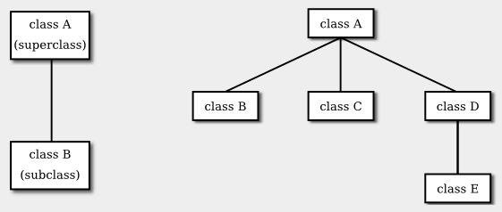
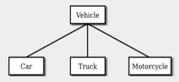
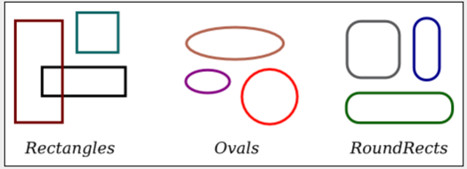
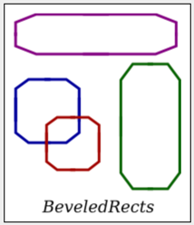
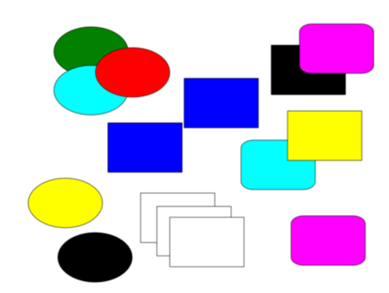

# Section 5: 상속, 다형성, 추상 클래스

클래스는 동일한 구조와 행위(behavior)를 공유하는 객체들의 집합을 나타낸다. 클래스는 해당 클래스의 각 인스턴스에 포함된 변수들을 지정하여 객체들의 구조를 결정하고, 객체들의 행위를 표현하는 인스턴스 메서드를 제공하여 해당 행위를 결정한다. 이는 강력한 아이디어이다. 그러나 이와 같은 일은 대부분의 프로그래밍 언어에서도 이루어 질 수 있는 것이다. 객체 지향 프로그래밍의 중심적인 새로운 아이디어 — 전통적인 프로그래밍과는 실제로 구별되는 아이디어 — 는, 구조와 행위 전부는 아니지만, 그 **일부**를 공유하는 객체들 사이의 유사성을 클래스가 표현하도록 하는 것이다. 이러한 유사성(similarities)은 **상속(inheritance)** 과 **다형성(polymorphism)** 을 사용하여 표현될 수 있다.

## 1. 기존 클래스 확장하기
프로그래머라면 누구나 하위 클래스, 상속, 다형성이 무엇을 의미하는지 알아야 한다. 그러나, 이미 존재하는 클래스를 확장하는 일을 제외한다면 상속을 사용하여 실제로 일을 하기까지는 아마 시간이 좀 걸릴 것이다. 이 절의 첫 부분에서는 이 작업이 어떻게 이루어지는지 살펴보고자 한다.

일상의 프로그래밍, 특히 이제 막 객체를 다루기 시작하는 프로그래머의 경우, 하위 클래스화(subclassing)는 주로 한 가지 상황에서 사용된다: 몇몇 변경사항이나 추가사항에 조정될 수 있는 기존 클래스의 존재. 이는 밑바닥부터 클래스 및 하위 클래스의 그룹을 설계하는 것보다 훨씬 더 일반적이다. 하위 클래스를 만들기 위해 기존 클래스는 **확장될(extended)** 수 있다. 이에 대한 구문은 다음과 같다:

```java
public class {subclass-name} extends {exisiting-class-name} {
    .
    .   // 변경 및 추가사항.
    .
}
```

예를 들어, 블랙잭(Blackjack)이라는 카드 게임을 하는 프로그램을 작성하고 싶다고 가정하자. 제5장 제4절에서 개발된 Card, Hand, 그리고 Deck 클래스를 사용할 수 있다. 그러나 블랙잭 게임의 손패(hand)는 일반적인 카드 게임의 손패와는 조금 다르다. 게임의 규칙에 따라 블랙잭 손패의 "값"을 계산하는 것이 반드시 가능해야 하기 때문이다. 해당 규칙은 다음과 같다: 손패의 값은 손에 있는 카드들의 값을 합산하여 얻는다. 3이나 10과 같은 숫자 카드의 값은 그 숫자 값이 된다. 잭, 퀸, 킹의 값은 10이다. 에이스의 값은 1이거나 11일 수 있다. 에이스는 계산시 손패의 합산 값이 21을 넘지 않는 한 11로 계산해야 한다. 이는 손에 있는 두 번째, 세 번째 또는 네 번째 에이스가 항상 1로 계산된다는 것을 의미한다.

이를 처리하는 한 가지 방법은 손패의 블랙잭 값을 계산하는 메서드를 추가하여 기존 Hand 클래스를 확장하는 것이다. 이러한 클래스의 정의는 다음과 같다:

public class BlackjackHand extends Hand {

```java
    /**
     * 블랙잭 게임에서 해당 손패의 값을 계산하여 반환한다.
     */
    public int getBlackjackValue() {

        int val;      // 계산된 손패의 값.
        boolean ace;  // 손패에 에이스가 포함된 경우
                      //   이는 true로 설정될 것이다.
        int cards;    // 손패의 카드 갯수.

        val = 0;
        ace = false;
        cards = getCardCount();  // (Hand 클래스에 정의된 메서드.)

        for ( int i = 0;  i < cards;  i++ ) {
                // 손패의 i번째 카드의 값을 추가한다.
            Card card;    // i번째 카드; 
            int cardVal;  // i번째 카드의 블랙잭 값.
            card = getCard(i);
            cardVal = card.getValue();  // 일반적인 값으로, 1부터 13 사이.
            if (cardVal > 10) {
                cardVal = 10;   // 잭, 퀸, 킹의 경우.
            }
            if (cardVal == 1) {
                ace = true;     // 적어도 하나의 에이스가 존재.
            }
            val = val + cardVal;
         }

         // 현재, val은 손패의 값이며, 어떤 에이스든 1로 계산한다.
         // 에이스가 하나 존재하고 그 값이 1에서 11로 변경하여
         // 점수가 21보다 작거나 같다는 결과로 된다면,
         // val에 10을 추가적으로 더하여 그렇게 맞춘다. 

         if ( ace == true  &&  val + 10 <= 21 )
             val = val + 10;

         return val;

    }  // getBlackjackValue() 종료

} // 클래스 BlackjackHand 종료
```

BlackjackHand 는 Hand 의 하위 클래스이기 때문에, BlackjackHand 자료형의 객체는 Hand 에 정의된 모든 인스턴스 변수와 인스턴스 메서드를 포함하며, `getBlackjackValue()`라는 이름의 새로운 인스턴스 메서드가 추가된다. 예를 들어, `bjh`가 `BlackjackHand` 자료형의 변수인 경우, 다음의 것들은 모두 허용된다: `bjh.getCardCount()`, `bjh.removeCard(0)`, 그리고 `bjh.getBlackjackValue()`. 처음 두 메서드는 Hand 에 정의되어 있지만, BlackjackHand 에 의해 상속된 것이다.

Hand 클래스의 변수와 메서드는 BlackjackHand 에 의해 상속되며, 이들은 마치 해당 클래스에 실제로 정의된 것처럼 BlackjackHand 의 정의에서 사용될 수 있다 — `private`라고 선언된 것들로써 하위 클래스에 의해서도 접근이 금지된 경우를 제외한다면 말이다. 위의 `getBlackjackValue()` 정의에서 "`cards = getCardCount();`"라는 문장은 인스턴스 메서드 `getCardCount()`를 호출하는데, 이는 Hand 에 정의되어 있었던 것이다.

기존 클래스를 확장하는 것은 이전 작업을 기반으로 구축하기 쉬운 방법이다. 많은 표준 클래스가 하위 클래스를 만드는 기반으로써 사용되기 위해 명시적으로 작성되었음을 알게 될 것이다.

<hr>

`public` 및 `private`와 같은 접근 제한자(access modifier)는 클래스 멤버에 대한 접근을 제어하는 데 사용된다. 하위 클래스를 고려할 때, 주목을 받는 접근 제한자가 하나 더 존재한다: **보호됨(protected)**. `protected`가 클래스의 메서드 또는 멤버 변수에 대한 접근 제한자로써 적용되는 경우, 해당 멤버는 그것이 정의된 클래스의 하위 클래스 — 직접적이든 또는 간접적이든 — 에서 사용될 수 있지만, 하위 클래스가 아닌 곳에서는 사용될 수 없다. (예외가 존재하긴 한다: `protected` 멤버는 또한 해당되는 보호된 멤버를 포함하는 해당 클래스와 동일한 패키지 안에 있는 모든 클래스에서 접근할 수도 있다. 접근 제한자를 사용하지 않으면 동일한 패키지의 클래스에서 멤버에 접근할 수 있으며, 다른 곳에서는 할 수 없다는 점을 떠올려라. `protected` 제한자를 사용하는 것은 제한자가 전혀 사용되지 않는 것보다 훨씬 절대적으로 자유롭다: 이는 동일한 패키지에 있는 클래스로부터의 접근을 허용하고 동일한 패키지에 없는 **하위 클래스**로부터의 접근 또한 허용한다.)

메서드 또는 멤버 변수를 `protected`로 선언하는 경우, 이들이 클래스의 공개 인터페이스 일부라기보다는 클래스 구현의 일부라고 말하는 것이다. 하지만, 하위 클래스가 구현의 해당 부분을 사용하고 수정하는 일을 허용하고 있다.

예를 들어, 두 주사위에 나타나는 숫자를 나타내기 위해 인스턴스 변수 `die1`과 `die2`를 가지는 PairOfDice 클래스를 생각해보자. 이러한 변수를 `private`로 만들어 클래스 외부에서 값을 변경하는 것을 불가능하게 만들 수 있는 한편, 게터(getter) 메서드를 통하여 읽기 접근을 여전히 허용할 수도 있다. 그러나 하위 클래스를 만드는 데 PairOfDice 가 사용될 가능성이 있다고 생각되면, 하위 클래스가 주사위의 숫자를 변경할 수 있도록 하고 싶을 터이다. 예를 들어, 주사위를 그리는 GraphicalDice 하위 클래스는 주사위를 굴릴 때를 제외한 다른 시간에 숫자를 변경하기를 바랄 수 있다. 이 경우, `die1` 및 `die2`를 `protected`로 할 수 있으며, 이를 통해 하위 클래스는 외부에 공개하지 않고도 이들의 값을 변경할 수 있게 된다. (더 좋은 아이디어는 변수에 대한 `protected` 세터(setter) 메서드를 정의하는 것일 터이다. 예를 들어, 세터 메서드는 변수에 할당되는 해당 값이 허용되는 범위인 1에서 6 사이인지를 확인할 수 있다.)

<hr>

## 2. 상속과 클래스 계층 구조
**상속(inheritance)** 이라는 용어는 한 클래스가 다른 클래스로부터 해당 구조와 동작의 일부 또는 전체를 상속받을 수 있다는 사실을 나타낸다. 상속 받게 되는 클래스를 자신이 상속받는 클래스의 **하위 클래스(subclass)** 라고 한다. 클래스 B가 클래스 A의 하위 클래스인 경우 클래스 A는 클래스 B의 **슈퍼 클래스(superclass)** 라고도 합니다. (때때로 **파생 클래스(derived class)** 와 **기본 클래스(base class)** 라는 용어가 사용되기도 한다. 하위 클래스와 상위 클래스 대신 사용된다. C++에서 주로 사용되는 용어이다.) 하위 클래스는 상속하는 구조와 동작을 추가할 수 있다. 또한 상속된 동작을 대체하거나 수정할 수도 있다. 하위 클래스와 상위 클래스 사이의 관계는 하위 클래스가 아래에 표시되고, 아래 왼쪽에 표시된 것처럼 상위 클래스에 연결되는 다이어그램으로 표시된다.



Java에서 "A"라는 클래스의 하위 클래스로 "B"라는 클래스를 생성하려면 다음과 같이 작성한다.
```java
class B extends A {
    .
    .  // 추가 및 수정,
    .  // 클래스 A에서 상속된 항목들
    .
}
```

여러 클래스를 동일한 슈퍼클래스의 하위 클래스로 선언할 수 있다. "형제 클래스(sibling class)"라고 할 수 있는 하위 클래스는 일부 구조와 동작, 즉 공통 슈퍼클래스에서 상속받은 동작을 공유한다. 슈퍼클래스는 이러한 공유 구조와 동작을 표현한다. 위 오른쪽에 표시된 다이어그램에서 클래스 B, C, D는 형제 클래스이다. 상속은 클래스의 여러 세대에 걸쳐 확장될 수도 있다. 이는 다이어그램에서 클래스 E가 클래스 A의 하위 클래스인 클래스 D의 하위 클래스로 표시된 것을 보면 된다. 이 경우 클래스 E는 직접적인 하위 클래스는 아니지만 클래스 A의 하위 클래스로 간주된다. 이 클래스 집합은 작은 **클래스 계층 구조(class hierarchy)** 를 형성한다.

<hr>

## 3. 예시: Vehicles

예를 들어, 프로그램이 자동차, 트럭, 오토바이를 포함한 자동차를 다루어야 한다고 가정해보자. 이 프로그램은 `Vehicle`이라는 클래스를 사용하여 모든 유형의 차량을 나타낼 수 있다. 자동차, 트럭 및 오토바이는 차량 유형이므로 다음 다이어그램처럼 표시될 수 있다.



`Vehicle`클래스에는 `RegistrationNumber`와 같은 인스턴스 변수와 `owner`, `trasferOwnership()`과 같은 인스턴스 메서드가 포함된다. 이는 모든 차량에 공통되는 변수 및 메서드이다. 그런 다음 `Vehicle`의 하위 클래스인 `Car`, `Truck`, `Motorcycle`을 사용하여 특정 타입의 차량에 특정 변수와 메서드를 선언/정의해줄 수 있다. `Car` 클래스는 인스턴스 변수 `NumberOfDoors`를 추가할 수 있고, `Truck` 클래스는 `NumberOfAxles`를 가질 수 있으며 `Motorcycle` 클래스는 `hasSidecar`라는 bool 변수를 가질 수 있다. Java에서 이러한 클래스 선언은 다음과 같다. (하위 코드에서는 아니지만 보통 `public` 클래스로 선언되고 각자의 파일로 관리됨)

```java
class Vehicle { 
    int registrationNumber;
   Person owner;  // (Assuming that a Person class has been defined!)
   void transferOwnership(Person newOwner) {
       . . .
   }
   . . .
}

class Car extends Vehicle {
   int numberOfDoors;
   . . .
}

class Truck extends Vehicle {
   int numberOfAxles;
   . . .
}

class Motorcycle extends Vehicle {
   boolean hasSidecar;
   . . .
}
```

`myCar`가 다음 문장으로 선언되고 초기화된 Car 유형의 변수라고 가정해보자.
```java
Car myCar = new Car();
```

위와 같이 선언되면 프로그램은 `myCar.numberOfDoors`를 참조할 수 있다. 왜냐하면 `numberOfDoors`는 `Car` 클래스의 인스턴스 변수이기 때문이다. 그러나 `Car` 클래스는 `Vehicle` 클래스를 확장(상속)하므로 자동차도 차량의 모든 구조와 동작을 갖는다. 이는 `myCar.registrationNumber`, `myCar.owner` 및 `myCar.transferOwnership()` 도 존재함을 의미한다. 실제로는 자동차, 트럭, 오토바이가 사실상 차량과 같다. 프로그램에서도 마찬가지이다. 즉, `Car`, `Truck` 또는 `Motorcycle` 유형의 객체는 자동으로 `Vehicle` 유형의 객체 이기도 하다. 이를 통해 다음과 같은 중요한 사실을 알 수 있다. 
> **클래스 A의 객체에 대한 참조를 가질 수 있는 변수는 A의 하위 클래스에 속하는 객체에 대한
참조도 가질 수 있다.**

위의 예에서는 `Car` 유형의 객체가 `Vehicle` 유형의 변수에 할당될 수 있다는 것이다.

```java
Vehicle myVehicle = myCar;

Vehicle myVehicle = new Car();
```

이러한 문장에서 `myVehicle` 변수는 하위 클래스인 `Car` 의 인스턴스인 `Vehicle` 객체 에 대한 참조를 가진다. 객체는 실제로 `Vehicle` 이 아니라 `Car` 임을 **기억**해야합니다.
객체의 실제 클래스에 대한 정보는 해당 객체의 일부로 저장된다. `instanceof` 연산자 를 사용하여 주어진 객체가 주어진 클래스에 속하는지 여부를 테스트하는 것도 가능하다.
하위 코드는 `myVehicle`이 실제로 `Car`인지 여부를 확인한다.

```java
if (myVehicle instanceof Car) ...
```

반면에, 하위 코드는 에러를 뱉는다.
```java
myCar = myVehicle;  // ERROR!
```

`myVehicle`은 잠재적으로 자동차가 아닌 다른 유형의 차량을 참조할 수 있으므로 불가능하다. 이는 이전에 하위 섹션 2.5.6 에서 본 문제와 유사하다. 모든 int가 short가 아니기 때문에 컴퓨터에서는 short 유형의 변수에 int 값을 할당하는 것을 허용하지 않는다. 마찬가지로, 모든 차량이 자동차는 아니기 때문에 `Vehicle` 유형 의 값을 `Car` 유형의 변수에 할당하는 것을 허용하지 않는다. `ints` 및 `shorts` 의 경우와 마찬가지로 여기서 해결책은 **유형 캐스팅**을 사용하는 것이다. 어떤 이유로든 `myVehicle`이 실제로 `Car` 를 참조하는 경우 `(Car)myVehicle` 유형 캐스팅을 사용하여 컴퓨터에 `myVehicl`e 이 실제로 `Car` 유형인 것처럼 처리하도록 지시할 수 있다. 그래서 아래와 같이 사용할 수 있다.

```java
myCar = (Car)myVehicle;;  // ERROR!
```

`((Car)myVehicle).numberOfDoors` 를 참조할 수도 있다. (우선순위 때문에 괄호가 필요하다. "."는 유형 변환보다 우선순위가 높으므로 `(Car)myVehicle.numberOfDoors`는 `(Car)(myVehicle.numberOfDoors)` 로 읽혀지며 `int` 를 유형 변환하려는 것이다. `myVehicle.numberOfDoors`를 `Vehicle` 로 변환하는 것은 불가능하다.)
이것이 어떻게 사용될 수 있는지에 대한 예로, `myVehicle` 에서 참조하는 `Vehicle` 관련 데이터를 print한다고 가정해 보자. `Car` 인 경우 자동차의 `numberOfDoors`를 인쇄하고 싶지만 `Vehicle` 클래스 에 `numberOfDoors`가 없으므로 `myVehicle.numberOfDoors` 라고 할 수 없다. 하지만 다음과 같이 사용할 수 있다.

```java
System.out.println("Vehicle Data:");
System.out.println("Registration number:  " 
                              + myVehicle.registrationNumber);
if (myVehicle instanceof Car) {
   System.out.println("Type of vehicle:  Car");
   Car myCar;
   myCar = (Car)myVehicle;  // Type-cast to get access to numberOfDoors!
   System.out.println("Number of doors:  " + myCar.numberOfDoors);
}
else if (myVehicle instanceof Truck) {
   System.out.println("Type of vehicle:  Truck");
   Truck myTruck;
   myTruck = (Truck)myVehicle;  // Type-cast to get access to numberOfAxles!
   System.out.println("Number of axles:  " + myTruck.numberOfAxles);
}
else if (myVehicle instanceof Motorcycle) {
   System.out.println("Type of vehicle:  Motorcycle");
   Motorcycle myCycle;
   myCycle = (Motorcycle)myVehicle;  // Type-cast to get access to hasSidecar!
   System.out.println("Has a sidecar:    " + myCycle.hasSidecar);
}
```

객체 타입의 경우 컴퓨터가 프로그램을 실행할 때 타입 캐스팅이 유효한지 확인gksek. 예를 들어 `myVehicle`이 `Truck` 유형의 객체를 참조하는 경우 `(Car)myVehicle` 타입 캐스팅은 오류가 발생한다. 이런 일이 발생하면 `ClassCastException` 유형의 예외가 발생한다. `myVehicle`이 참조하는 객체의 실제 유형은 프로그램이 컴파일될 때 알 수 없기 때문에 이 확인은 컴파일 타임이 아닌 런타임에 수행된다. 위의 코드는 타입 캐스팅을 수행하기 전에 변수 유형을 테스트하기 위해 `instanceof`를 사용하여 `ClassCastException`을 방지한다.

Java 17에서 인스턴스에 대한 **패턴 일치** 라고 알려진 모호한 새로운 기능 중 하나를 사용하여 작성할 수도 있다. 패턴 일치를 사용하면 테스트 인스턴스에 변수 선언 및 초기화를 포함할 수 있다. 예를 들어,

```java
if (myVehicle instanceof Car myCar) {
    System.out.println("Type of vehicle: Car");
    System.out.println(Number of doors: " + myCar.numberOfDoors);
}
```
테스트가 성공하면 `myCar` 변수가 생성되고 `(Car)myVehicle` 값이 자동으로 할당됩니다 . 변수의 범위는 if 문의 본문으로 제한됩니다.

<hr>

## 4. 다형성(Polymorphism)

또 다른 예로, 화면에 그려진 모양을 처리하는 프로그램을 생각해 보자. 도형에는 다양한 색상의 직사각형, 타원형, 둥근 직사각형이 포함되어 있다고 가정해 보자. ("둥근 사각형"은 모서리가 둥근 직사각형이다.)



세 가지 클래스인 `Rectangle`, `Oval` 및 `RoundRect` 를 사용하여 세 가지 유형의 모양을 나타낼 수 있다. 이 세 가지 클래스에는 세 가지 모양 모두가 공통적으로 갖는 기능을 나타내는 공통 슈퍼클래스인 `Shape`가 있다. `Shape` 클래스에는 모양의 색상, 위치 및 크기를 나타내는 인스턴스 변수가 포함될 수 있으며 해당 속성의 값을 변경하기 위한 인스턴스 메서드가 포함된다. 예를 들어, 색상을 변경하려면 인스턴스 변수의 값을 변경한 다음 새로운 색상으로 도형을 다시 그리는 작업이 포함될 수 있다.

```java
class Shape {

    Color color; // (must be imported from package javafx.scene.paint)
                   
    void setColor(Color newColor) {
          // Method to change the color of the shape.
       color = newColor; // change value of instance variable
       redraw(); // redraw shape, which will appear in new color
    }
    
    void redraw() {
          // method for drawing the shape
       ? ? ?  // what commands should go here?
    }

    . . .          // more instance variables and methods
 
} // end of class Shape
```

이제 여기서 `redraw()` 메서드에서 문제가 발생할 수 있다. 종류에 따라 도형이 다르게 그려진다는 점이다. `setColor()` 메소드는 모든 유형의 모양에 대해 호출될 수 있다. `setColor()` 메서드 에서 `redraw()` 명령을 실행할 때 컴퓨터는 어떤 모양을 그릴지 어떻게 알 수 있을까? 비공식적으로, 우리는 다음과 같은 질문에 대답할 수 있다: 컴퓨터는 shape가 스스로 다시 그리도록 요청하여 `redraw()`를 실행한다. 모든 `shape` 개체는 자신을 다시 그리기 위해 수행해야 하는 작업을 알고 있다.

이는 특정 shape 클래스 각각에 고유한 `redraw()` 메서드가 있음을 의미한다.
```java
class Rectangle extends Shape { 
    void redraw() {
      . . .  // commands for drawing a rectangle
    }
   . . . // possibly, more methods and variables
}

class Oval extends Shape {
   void redraw() {
      . . .  // commands for drawing an oval
   }
   . . . // possibly, more methods and variables
}

class RoundRect extends Shape {
   void redraw() {
      . . .  // commands for drawing a rounded rectangle
   }
   . . . // possibly, more methods and variables
}
```

`someShape`가 `Shape` 타입의 변수라고 가정해보자. 그러면 `Rectangle`, `Oval` 또는 `RoundRect` 유형의 객체를 참조할 수 있다. 프로그램이 실행되고 `someShape` 의 값이 변경되면 서로 다른 시간에 서로 다른 타입의 객체를 참조할 수도 있다!

```java
someShape.redraw();
```

위의 코드가 실행되면 실제로 호출되는 `redraw` 메소드는 `someShape`가 실제로 참조하는 객체의 유형에 맞는 메소드가 실행된다. 프로그램의 코드를 보면 이 명령문이 어떤 모양을 그릴지 알 수 있는 방법이 없다. 프로그램이 실행될 때 `someShape`가 갖게 되는 값에 따라 달라지기 때문이다. 명령문이 루프에 있고 여러 번 실행된다고 가정해보자. 루프가 실행될 때 `someShape` 의 값이 변경되면 동일한 문 `someShape.redraw();` 가 여러 번 실행됨에 따라 다른 메서드를 호출하고 다른 종류의 모양을 그릴 가능성이 있다. 우리는 `redraw()` 메소드가 다형성 이라고 말한다. 메소드에 의해 수행되는 작업이 **런타임에 메소드가 적용되는 객체의 실제 유형에 따라 달라지면** 메소드는 다형성이다. 다형성은 객체 지향 프로그래밍의 주요 특징 중 하나이다. 이것은 shape의 배열이 있을 때 가장 뚜렷하게 볼 수 있을 것이다. `Shapelist` 가 `Shape[]` 유형의 변수 이고 배열이 이미 생성되어 데이터로 채워져 있다고 가정해보자. 배열의 요소 중 일부는 `Rectangle` 일 수 있고 일부는 `Oval` 일 수 있으며 일부는 `RoundRect` 일 수 있다. 다음과 같이 배열의 모든 모양을 그릴 수 있다.

```java
for (int i = 0; i < shapelist.length; i++ ) {
    Shape shape = shapelist[i];
    shape.redraw();
}
```

컴퓨터가 이 루프를 거치면서 `shape.redraw()` 명령문은 `i`가 참조 하는 배열 요소 번호가 참조하는 개체 타입에 따라 직사각형, 타원형, 원형 직사각형을 그린다.

아마 용어를 약간 바꾸면 더 이해하기 쉬울 것이다. 객체 지향 프로그래밍에서 메소드 호출은 객체에 메시지를 보내는 것을 의미한다. 개체는 적절한 메서드를 실행하여 메시지에 응답한다. `someShape.redraw();` 문은 `someShape`가 참조하는 객체에 보내는 메시지이다. 해당 객체는 자신이 어떤 타입의 객체인지 알고 있으므로 메시지에 어떻게 응답해야 하는지도 알고 있다. 이러한 관점에서 볼 때 컴퓨터는 항상 `someShape.redraw();` 같은 방식으로 메시지를 보낸다다. 메시지에 대한 응답은 당연히 메시지를 받는 사람에 따라 달라진다. 이러한 관점에서 객체는 메시지를 보내고 받는 활성 엔터티이며 다형성은 자연스럽고 필요한 것이다. 다형성은 서로 다른 개체가 동일한 메시지에 서로 다른 방식으로 응답할 수 있음을 의미한다.

다형성의 가장 좋은 점 중 하나는 작성한 코드가 작성 당시에는 생각지도 못했던 작업을 수행할 수 있다는 것이다. 내 프로그램이 처리할 수 있는 shape 타입에 경사진 직사각형을 추가하기로 결정했다고 가정해 보자. (경사진 직사각형에는 각 모서리가 잘린 삼각형이 있다.)



경사진 직사각형을 구현하기 위해 `Shape` 클래스의 새로운 하위 클래스인 `BeveledRect`를 작성하고 자체 `redraw()`메서드를 만들 수 있다. 이전에 작성한 코드(예: `someShape.redraw ()`) 는 이제 자동으로 경사진 직사각형을 그릴 수 있다. 명령문을 작성할 당시 경사진 직사각형 클래스가 존재하지 않았더라도 말이다!

`someShape.redraw();` 문에서 `redraw` 메시지는 `someShape` 객체로 전송된다. 모양의 색상을 변경하려면 `Shape` 클래스의 메서드를 다시 보자.

```java
void setColor(Color newColor) {
    color = newColor; // change value of instance variable
    redraw(); // redraw shape, which will appear in new color
}
```

여기로 `redraw` 메시지가 전송되는데, 어떤 객체로 전송될까? `setColor` 메소드 자체는 일부 객체로 전송된 메시지이다. 결론은 `redraw` 메시지가 `setColor` 메시지를 수신한 동일한 객체로 전송된다는 것이다. 해당 객체가 직사각형인 경우 직사각형을 그리는 `redraw()` 메서드가 실행된다. 객체가 타원형이면 `Oval` 클래스의 `redraw()` 메서드가 실행된다. `setColor()` 메소드의 `redraw();` 문은 그렇지 않음을 의미한다. 반드시 `Shape` 클래스 의 `redraw()` 메소드를 호출해야한다! 실행되는 `redraw()` 메서드는 `Shape`의 모든 하위 클래스에 있을 수 있다. 이것은 다형성의 또 다른 경우이다.

<hr>

## 5. 추상 클래스 (Abstract Classes)

`Rectangle`, `Oval` 또는 `RoundRect` 객체가 그려야 할 때마다 실행되는 것은 해당 클래스의 `redraw()` 메서드이다. 그러면 `Shape` 클래스 의 `redraw()` 메서드는 무엇을 수행할까?

대답은 의외일 수 있는데, 바로 공백으로 남겨두어야 한다! 사실 `Shape` 클래스 는 모양에 대한 추상적인 아이디어를 나타내며 그러한 것을 그릴 수 있는 방법이 없다. 직사각형, 타원 등 특정한 구체적인 모양만 그릴 수 있다. 그렇다면 `Shape` 클래스에 `redraw()` 메서드가 있어야 하는 이유는 무엇일까? 그렇지 않으면 `Shape` 클래스의 `setColor()` 메서드 에서 호출하는 것이 불가능하고 `someShape.redraw();` 라고 쓰는 것도 불가능하다. 컴파일러는 `someShape`가 `Shape` 유형의 변수 이고 `Shape`에 `redraw()` 메서드가 없다고 알린다.

그럼에도 불구하고 `Shape` 클래스 자체의 `redraw()` 버전은 실제로 호출되지 않는다. 사실 생각해 보면 `Shape` 유형의 실제 객체를 생성할 이유가 전혀 없다! `Shape` 유형의 변수를 가질 수 있지만 이들이 참조하는 객체는 항상 `Shape`의 하위 클래스 중 하나에 속한다. 우리는 `Shape`가 추상 클래스라고 말한다. **추상 클래스**는 객체를 생성하는 데 사용되지 않고 하위 클래스를 만들기 위한 기초로만 사용되는 클래스이다. 추상 클래스는 모든 하위 클래스의 공통 속성을 표현하기 위해서만 존재한다. 추상적이지 않은 클래스를 **콘크리트**라고 한다. 구체적인 클래스에 속하는 객체를 생성할 수 있지만 추상 클래스에는 생성할 수 없다. 추상 클래스에 의해 유형이 제공되는 변수는 추상 클래스의 구체적인 하위 클래스에 속하는 객체만 참조할 수 있다.

마찬가지로 `Shape` 클래스의 `redraw()` 메서드는 호출할 의도가 전혀 없으므로 **추상 메서드**라고 말한다. 실제 수행할 작업은 없다. `redraw`는 `Shape` 하위 클래스의 `redraw()` 메서드에 의해 수행된다 . `Shape` 의 `redraw()` 메소드가 있어야 한다. 그러나 이는 모든 `Shape`가 redraw 메시지를 이해한다는 것을 컴퓨터에 알리기 위한 것이다. 추상 메서드로서 이는 서브클래스에서 `redraw()`의 모든 실제적이고 구체적인 버전의 공통 인터페이스를 지정하기 위해 존재한다. 추상 `redraw()`를 수행할 이유가 없다. 모든 코드를 포함하기 위해 `Shape` 클래스에 있는 것이다.

`Shape` 및 해당 `redraw()` 메서드는 의미상 추상적이다. 또한 정의에 **abstract**라는 수식어를 추가하여 구문적으로 컴퓨터에 추상적이라는 것을 알릴 수도 있다. 추상 메소드의 경우 일반 메소드 구현을 제공하는 코드 블록이 세미콜론으로 대체된다. 그런 다음 추상 클래스의 구체적인 하위 클래스에 있는 추상 메서드에 대한 구현을 제공해야 한다. `Shape` 클래스가 추상 클래스로 표시되는 모습은 다음과 같다.

```java
public abstract class Shape {
    
    Color color;   // color of shape. 
                              
    void setColor(Color newColor) {
          // method to change the color of the shape
       color = newColor; // change value of instance variable
       redraw(); // redraw shape, which will appear in new color
    }
    
    abstract void redraw();
          // abstract method—must be defined in 
          // concrete subclasses

    . . .  // more instance variables and methods

} // end of class Shape
```

클래스를 `abstract` 로 선언하면 `Shape` 유형의 실제 객체를 생성하는 것이 불가능하며 그렇게 하려고 하면 Syntax error가 발생한다.

그런데 위에서 논의한 `Vehicle` 클래스는 아마도 추상 클래스일 수도 있다는 점에 유의해야한다. 실제 차량은 자동차, 트럭, 오토바이 또는 기타 "구체적인" 유형의 차량이어야 한다.

<hr>

다른 클래스의 하위 클래스로 명시적으로 선언되지 않은 클래스는 자동으로 표준 클래스 `Object`의 하위 클래스가 된다. 즉, `extend` 부분이 없는 클래스 선언은 다음과 같다.

```java
// 아래의 두 코드는 동일하다.
public class myClass { . . .
    
public class myClass extends Object { . . .
```

이는 `Object` 클래스가 다른 모든 클래스를 포함하는 거대한 클래스 계층 구조의 최상위에 있음을 의미한다. (의미상 `Object`는 추상 클래스이며 실제로 가장 추상적인 클래스이다. 그러나 흥미롭게도 구문 상 `abstract`으로 선언되지 않았으므로 `Object` 유형의 객체를 생성할 수 있다. 그러나 실제로는 그럴 일이 많지는 않다.)

모든 클래스는 `Object`의 하위 클래스이므로 `Object` 유형의 변수는 모든 유형의 모든 객체를 참조할 수 있다. 마찬가지로 `Object[]` 유형의 배열은 모든 유형의 객체를 보유할 수 있다.

<hr>

샘플 소스 코드 파일 `ShapeDraw.java`는 추상 `Shape` 클래스와 `Shape[]` 유형의 배열을 사용하여 shape 목록을 갖는다. 지금은 모든 내용을 이해할 수 없더라도 이 파일을 살펴보는 것이 좋다. `Shape` 클래스의 정의조차도 이 섹션에서 설명한 것과 약간 다르다. (예를 들어, `draw()` 메소드에는 `GraphicsContext`> 유형의 매개변수가 있다. Java의 모든 그리기에는 그래픽 컨텍스트가 필요하기 때문에 이 매개변수가 필요하다.) GUI 프로그래밍에 대해 더 많이 알게 되면 이후 장에서 비슷한 예를 다시 설명할 예정이다. 그러나 Shape 의 정의를 살펴보는 것은 여전히 가치가 있다. 클래스와 소스 코드의 하위 클래스, 도형 목록을 저장하기 위해 배열이 어떻게 사용되는지 확인할 수도 있다. 다음은 프로그램의 요약된 스크린샷이다.



`ShapeDraw` 프로그램을 실행하면 하단에 있는 버튼 중 하나를 클릭하여 그림에 도형을 추가할 수 있다. 새 모양이 그리기 영역의 왼쪽 상단에 나타난다. 모양의 색상은 그리기 영역 아래 색상의 "팝업 메뉴"에 의해 지정된다. 도형이 화면에 나타나면 마우스로 드래그할 수 있다. 도형을 드래그하는 동안에도 화면의 다른 도형과 관련하여 동일한 앞에서 뒤로 순서가 유지된다. 그러나 Shift 키를 누른 채 클릭하면 다른 모든 모양 앞으로 해당 모양을 이동할 수 있다.

프로그램에서 도형의 실제 클래스가 사용되는 유일한 경우는 해당 도형이 화면에 추가될 때이다. 모양이 생성되면 완전히 추상 모양으로 조작된다. 예를 들어 드래그를 구현하는 루틴은 `Shape` 유형의 변수와 함께 작동하며 해당 하위 클래스를 참조하지 않는다. 도형을 드래그하는 동안 드래그 루틴은 도형을 그려야 할 때마다 도형의 그리기 메서드를 호출하기 때문에 도형을 그리는 방법이나 도형의 유형을 알 필요가 없다. 객체는 자신을 그리는 일을 담당한다. 프로그램에 새로운 유형의 모양을 추가하려면 Shape 의 새 하위 클래스를 정의힌디, 다른 버튼을 추가하고 화면에 올바른 유형의 모양을 추가하도록 버튼을 프로그래밍한다. 프로그래밍에 다른 변경은 필요하지 않다.

<hr>

## 6. final 메서드 및 클래스

우리는 `final` 수정자가 변수에 어떻게 적용되는지 살펴보았다. 이는 변수가 초기화된 후에 변수에 새 값을 할당하는 것을 불가능하게 만든다. (final 인스턴스 변수의 경우 변수가 포함된 클래스의 생성자에서 초기화가 발생할 수 있다.) 그러나 final 수정자는 클래스 및 메서드 정의에 적용될 수도 있다.

최종 클래스는 하위 클래스를 만드는 기초로 사용할 수 없다. 즉, 클래스가 `final class A... `로 정의된 경우 "class B extends A..."로 A를 확장하려고 시도하는 것은 Syntax error를 발생시킨다.

메서드가 클래스에서 `final`로 선언되면 하위 클래스에 동일한 시그니처를 가진 메서드가 포함될 수 없다. 즉, 메서드를 **재정의**할 수 없다. 이는 static 메서드와 인스턴스 메서드 모두에 해당된다. `final` 클래스 에서는 해당 클래스의 하위 클래스를 만드는 것조차 불가능하므로 모든 메서드는 암시적으로 `final`이다.

`final` 클래스나 메서드는 최종 형식이므로 하위 클래스로 수정하거나 대체할 수 없다는 개념이다. `final`을 사용하면 메소드의 동작을 보장할 수 있다. 예를 들어 `Rectangle` 클래스에 직사각형을 그리는 인스턴스 메서드 `draw()`가 있고 `ect`가 `Rectangle` 유형의 변수라고 가정해 보자. `draw()`가 `final` 메소드인 경우 `ect.draw()`를 호출하면 사각형이 그려지는 것이 보장된다. 그러나 `draw()` 가 `final`이 아니면 무엇이든 그릴 수도 있고 아무것도 그릴 수도 없다! 실제로 `Rectangle` 의 일부 하위 클래스에 속하는 객체를 참조할 수 있으며 해당 하위 클래스는 `Rectangle` 클래스의 `draw()` 메서드 를 재정의하는 자체 `draw()` 메서드를 정의할 수 있다. `final`을 사용하면 프로그램의 동작을 더 쉽게 추론할 수 있다.


