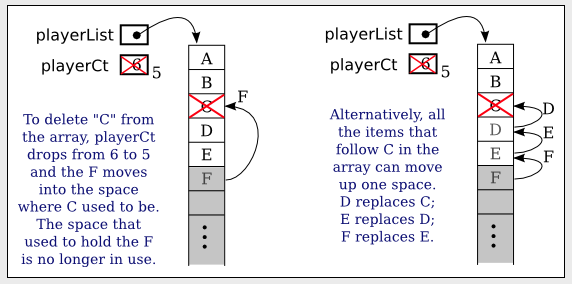

# Section 2: 배열 처리

우리가 살펴본 배열 처리의 대부분의 예는 실제로 매우 간단했다. 배열 요소를 처음 부터 끝까지 순서대로 처리하거나 배열의 임의 요소에 무작위로 엑세스 했다. 


## 1. 일부 처리 예

시작하려면, 합법적인 범위를 벗어나는 배열 인덱스를 피하는 것에 대해 주의해야 함을 상시 시키려는 예가 있다. 
```java
boolean dupp = false;
for ( int i = 0; i < list.length; i++ ) {
    if ( lines[i].equals(lines[i+1]) ) {  // AN ERROR
        dupp = true;  
        break;
    }
}
```

이 `for` 루프는 우리가 작성한 다른 많은 루프와 비슷해 보인다. 그런데 문제가 무엇인가? `i`가 `line.length-1`과 같을 때 `i`가 루프에서 최종 값을 취할 때 오류가 발생한다. 이 경우 `i+1`은 `line.length`와 같다. 그러나 배열의 마지막 요소에는 `line.length-1`가 있으므로 `line.length`는 유효한 인덱스가 아니다. 이는 `line[i+1]`에 대한 참조로 인해 `ArrayIndexOutOfBoundsException`이 발생함을 의미한다. 이는 수정하기 쉽다. `i+1` 범위를 벗어나기 전에 루프를 중지하면 된다.
```java
boolean dupp = false;  // Assume there are no duplicates
for ( int i = 0; i < list.length - 1 ; i++ ) {
    if ( lines[i].equals(lines[i+1]) ) {
        dupp = true;  
        break;
    }
}
```

이러한 유형의 오류는 일반적으로 배열의 일부만 사용하고 배열의 공간 수를 추적하는 데 카운터가 사용되는 부준적으로 가득 찬 배열로 작업할 때 훨씬 더 교활할 수 있다. 부분적으로 가득찬 배열의 경우 문제는 배열 끝 너머를 보는 것이 아니라 사용중인 배열 부분 너머를 보는 것이다. 프로그램이 배열의 끝 너머를 보려고 시도하면 적어도 문제가 있음을 알리기 위해 프로그램이 중단된다. 부분적으로 가득찬 배열을 사용하면 문제가 감지되지 않을 수 있다.

---

다음 예에서는 부분적으로 가득 찬 배열을 계속 사용한다. 부분적으로 가득 찬 배열에 항목을 추가하는 방법을 살펴봤지만 항목을 제거할 수도 있다고 가정해 본다. 게임 프로그램을 작성하고 플레이어가 게임이 진행되는 동안 게임에 참여하고 나갈 수 있다고 가정해 본다. 훌륭한 객체 지향 프로그래머라면 게임의 개별 플레이어를 나타내는 `Player` 클래스가 있을 것이다. 현재 게임에 있는 모든 플레이어 목록은 `Player[]` 유형의 `playerList` 배열에 저장 될 수 있다. 플레이어 수는 변경될 수 있으므로 부분적으로 전체 배열 패턴을 따르며 변수 `playerCt`가 필요하다. 현재 게임에 참여 중인 플레이어 수를 기록한다. 게임에 플레이어가 10명을 넘지 않는다고 가정하면 변수를 다음과 같이 선언할 수 있다.

```java
Player[] playerList = new Player[10];
int playerCt = 0;
```

일부 플레이어가 게임에 참가하면 `playerCt`는 0보다 커지고 플레이어를 나타내는 플레이어 객체는 `playerList[0], playerList[1], ...` 배열 요소에 저장된다. 배열 요소인 `playerList[playerCt]`는 사용되지 않는다. `playerCt`는 배열의 항목 수 일 뿐만 아니라 배열에서 다음 열린 지점의 인덱스이기도 한다. 새 플레이어를 추가하는 것은 간단하다.

```java
playerList[playerCt] = newPlayer;
playerCt++;
```

그러나 게임에서 플러이어를 삭제하는 것은 삭제된 플레이어가 있던 배열에 "구멍"을 남기고 싶지 않기 때문에 조금 더 어렵다. `playerList`의 인덱스 `k`에 있는 플레이어를 삭제한다고 가정한다. 플레이어 수가 하나씩 줄어드므로 배열에서 사용되는 공간이 하나 줄어든다. 플레이어를 특정 순서로 유지하는 것이 걱정되지 않는 경우 플러레리어 번호`k`를 삭제하는 한 가지 방법은 플레이어를 배열의 마지막 점유 위치에서 위치 `k`로 이동한 다음 `playerCt` 값을 줄이는 것이다.
```java
playerList[k] = playerList[playerCt - 1];
playerCt--;
```

이전 `k` 위치에 있던 플레이어가 교체되어 더 이상 배열에 없으므로 목록에서 해당 플레이어를 삭제했다. 이전에 `playerCt - 1` 위치에 있던 플레이어가 이제 배열이 두 번 포함된다. 그러나 `playerCt`가 1만큼 감소했기 때문에 배열에 점유되거나 유효한 부분에는 한 번만 있다. 배열의 모든 요소는 특정 값을 보유해야 하지만 위치 0부터 `playerCt - 1`까지의 값만 어떤 방식으로든 보거나 처리된다는 점을 기억해야 한다. `playerList[playerCt] = null`로 설정하면 가비지 컬렉션을 위해 삭제된 `Player` 객체를 확보할 수 있다. 그러나 플레이어 목록에서 플레이어가 올바르게 삭제하느데 반드시 필요한 것은 안디ㅏ. 

`k` 위치에 있는 플레이어를 삭제할 때 나머지 플레이어를 동일한 순서로 유지하고 싶다고 가정해 본다. 이를 위해서는 `k+1` 위치의 모든 플레이어가 배열에서 한 위치 위로 이동해ㅑ 한다. `k+1` 위치의 플레이어는 게임에서 벗어난 플레이어 `k`를 대체한다. `k+2` 플레이어는 `k+1` 플레이어가 이동할 때 열려 있는 자리를 채운다. 

```java
for (int i = k+1; i < playerCt; i++) {
    playerList[i-1] = playerList[i];    
}
playerCt--;
```



---

부분적으로 가득 찬 배열이 가듣 차면 어떻게 되는지에 대한 질문이 남아 있지만 여전히 항목을 더 추가하고 싶은가? 배열의 크기를 변경할 수는 없지만 새롭고 더 큰 배열을 만들고 이전 배열의 데이터를 새 배열로 복사할 수 있다. 그런데 배열을 복사한다는 것은 애초에 무엇을 의미할까?

A와 B가 기본 유형이 동일한 배열 변수이고 A가 이미 배열을 참조하고 있다고 가정한다. B가 A의 복사본을 참조하기를 원한다고 가정한다. 가장 먼저 주목해야 할 점은 할당문이다.
```java
B = A;
```

A의 복사본을 만들지 않는다. 배열은 객체이며 배열 변수는 배열에 대한 포인터만 보유할 수 있다. 대입문은 포인터를 A에서 B로 복사하고 결과적으로 A와 B는 이제 동일한 배열을 가르킨다. 예를 들어 A[0]과 B[0]은 정확히 도일한 배열 요소에 대한 다른 이름일 뿐이다. B가 A의 복사본을 참조 하도록 하려면 완전히 새로운 배열을 만들고 A의 모든 항목을 B로 복사해야 한다. 

```java
double[] B;
B = new double[A.length];
for ( int i = 0; i < A.length; i++ ) {
    B[i] = A[i];
}
```

부분적으로 가득 차서 가득 찬 배열을 추가하는 문제를 해결하려면 기존 배열 보다 더 큰 새 배열을 만들면 된다. 일반적인 선택은 이전 배열보다 두 배 큰 새 배열을 만드는 것이다. 우리는 한 가지 요구 사항을 더 충족해야 한다. 마지막으로 이전 배열을 참조했던 변수는 이제 새 배열을 가리켜야 한다. 이 변수는 우리에게 데이터에 대한 엑세스를 제공하며 결국 데이터는 새 배열에 있다. 다행스럽게도 간단한 대입문을 통해 변수가 올바른 배열을 가르킬 수 있다. 위의 예처럼 `playerList`와 `playerCt`를 사용하여 게임에 플레이어를 저장하고 게임에 `newPlayer`를 추가한다고 가정한다. 

```java
if ( playerCt == playerList.length ) {
    Player[] temp;   // A variable to point to the new array.
    temp = new Player[ 2*playerList.length ]; 
    for ( int i = 0; i < playerList.length; i++ ) {
        temp[i] = playerList[i]; 
    }
    playerList = temp;    
}

playerList[playerCt] = newPlayer;
playerCt++;
```

새 배열이 생성된 후에는 더 이상 이전 배열을 가리키는 변수가 없으므로 가비지로 수집된다.

## 2. 일부 표준 배열 방법

배열을 복사하는 것은 Java에 이를 수행하기 위해 이미 정의된 내장 메서드가 있을 것이라고 기대할 수 있는 일반적인 메서드처럼 보인다. 실제로 Java에는 여러 가지 표준 배열 처리 방법이 함께 제공된다. 메서드는 `java.util` 패키지에 있는 `Arrays` 클래스의 정적 메서드로 정의된다.

```java
Arrays.copyOf(list, lengthOfCopy)
```

`list`에서 복사된 항목을 포함하는 `lengthOfCopy`에 의해 길이가 제공되는 새 배열을 반환하는 함수이다. `lengthOfCopy`가 `list.length`보다 큰 경우 새 배열의 추가 공백은 기본값(숫자는 0, 객체는 null)을 갖는다. `lengthOfCopy`가 `list.length`보다 작거나 같으면 새 배열에 맞는 만큼의 항목만 복사된다.

```java
B = Arrays.copyOf(A, A.length);
```
```java
playerList = Arrays.copyOf(playerList, 2 * playerList.length);
```

단 한줄의 코드로 부분적으로 가득 찬 배열에서 사용 가능한 공간을 두 배로 늘리는데 사용할 수 있다. `Arrays.copyOf`를 사용하여 부분적으로 가듣 찬 배열의 크기를 줄일 수 있다. 우리는 사용하지 않는 공간이 너무 많아지는 것을 피하기 위해 그렇게 하고 싶을 수도 있다. 이 아이디어를 구현하기 위해 플레이어 목록에서 플레이어 번호 k를 삭제하는 코드는 다음과 같다.

```java
playerList[k] = playerList[playerCt-1];
playerCt--;
if ( playerCt < playerList.length/4 ) {
    playerList = Arrays.copyOf( playerList, playerList.length/2 );
}
```

`Arrays` 클래스에는 실제로 각 기본 유형에 대해 하나씩, 객체에 대해 하나씩, 여러 개의 `copyOf` 메서드가 포함되어 있다는 점을 언급해야 한다. 또한 객체 배열을 복사할 때 배열에 복사되는 객체에 대한 포인터만 있다는 점에 유의해야 한다. 객체의 내용은 복사되지 않는다. 이는 포인터 할당에 대한 일반적인 규칙이다. 

원하는 것이 원본과 크기가 동일한 배열의 간단한 복사본이라면 훨씬 더 쉬운 방법이 있다. 모든 배열에는 배열의 복사본을 만드는 `clone()`이라는 인스턴스 메서드가 있다. 

```java
int[] B = A.clone();
```

---

Arrays 클래스에는 다른 유용한 메서드가 포함되어 있다. 

- `Arrays.fill(array, value)`
  - 전체 배열을 지정된 값으로 채운다. 
  - value는 배열의 유형과 호환되어야 한다.
- `Arrays.fill(array, fromIndex, toIndex, values)`
  - 인덱스 번호 from 부터 to까지 채운다.
- `Arrays.toString(array)`
  - 쉼표로 구분되고 대괄호로 묶여서 출력한다.
- `Arrays.sort(array)`
  - 전체 배열을 정렬한다.
- `Arrays.sort(array, fromIndex, toIndex)`
  - from 부터 to까지 정렬한다.
- `Arrays.binarySearch(array, value)`
  - 이미 오름차순 정렬이 되어있어야 한다.
  - 배열에서 value를 검색한다.


## 3. RandomStrings 재검토

섹션 6.2.4의 예 중 하나는 임의의 위치, 색상 및 글꼴로 메시지의 여러 복사본을 표시하는 GUI 프로그램이다. 사용자가 버튼을 클릭하면 위치, 색상 및 글꼴이 새로운 임의 값으로 변경된다. 그러나 메시지 문자열을 이동하기를 원한다고 가정해 본다. 즉, 우리는 창에서 문자열이 표류하는 애니메이션을 실행하고 싶다. 이 경우 애니메이션의 각 프레임에서 문자열을 다시 그리는데 필요하므로 각 문자열 속성을 저장해야 한다. 

25개의 문자열이 있다. 각 문자열이 그려지는 (x, y) 좌표, 각 문자열의 색상, 각 문자열에 사용되는 글꼴을 저장해야 한다. 문자열을 움직이게 하기 위해 각 문자열의 속도 (dx, dy)라는 두 숫자로 표시되는 속도로 저장한다. 각 프레임에서 각 문자열의 dx에 이전 프레임 이후 경과 시간을 곱한 값이 문자열의 x좌표에 추가된다. dy와 유사하다. 이제 문자열의 데이터를 6개의 배열에 저장할 수 있다. 

```java
double[] x = new double[25];  
double[] y = new double[25];
double[] dx = new double[25];  
double[] dy = new double[25];
Color[] color = new Color[25];
Font[] font = new Font[25];
```

이러한 배열은 임의의 값으로 채워진다. 문자열을 그리는 방법에는 i번째 문자열이 (x[i], y[i]) 지점에 그려진다. 색상은 `color[i]`로 지정된다. 그리고 그것은 `font[i]`로 그려진다. 

```java
g.setFill(Color.WHITE); 
g.fillRect(0,0,canvas.getWidth(),canvas.getHeight());
for (int i = 0; i < 25; i++) {
    g.setFill( color[i] );
    g.setFont( font[i] );
    g.fillText( MESSAGE, x[i], y[i] );
    g.setStroke(Color.BLACK);
    g.strokeText( MESSAGE, x[i], y[i] );
}
```

이 접근 방식은 병렬 배열을 사용한다고 한다. 특정 메시지 사본에 대한 데이터는 여러 배열에 분산되어 있다. 배열이 병렬 열에 배치되어 있다고 생각하면 i번째 문자열에 대한 데이터는 다음과 같다. (첫 열에 배열 x, 두 번째 열에 y, 색상, 글꼴) 이 간단한 예에서는 병렬 배열을 사용하는 데 아무런 문제가 없지만 관련 데이터를 하나의 객체에 유지한다는 객체 지향 철학에 어긋난다. 이 규칙을 따르면 우리는 상상할 필요가 없다. 메시지 사본 하나에 대한 모든 데이터가 물리적으로 한 곳에 있기 때문이다. 그래서 프로그램을 작성할 때 메시지 사본 하나에 모든 데이터를 나타내는 간단한 클래스를 만들었다.

```java
private static class StringData {  // Info needed to draw one string.
    double x,y;       // location of the string;
    double dx,dy;     // velocity of the string;
    Color color;      // color of the string;
    Font font;        // the font that is used to draw the string
}
```

메시지의 여러 복사본에 대한 데이터를 저정하기 위해 `StringData[]` 유형의 배열을 사용한다. 

```java
StringData[] stringData;
```

물론 실제 배열이 생성되어 할당될 때 까지 `StringData`의 값은 `null`이다. 배열을 생성하고 데이터로 채워야 한다. 또한 배열의 각 요소를 사용하기 전에 생성되어야 하는 `StringData` 유형의 객체이다. 다음 서브루틴은 배열을 생성하고 이를 임의의 데이터로 채운다.

```java
private void createStringData() {
    stringData = new StringData[25];
    for (int i = 0; i < 25; i++) {
        stringData[i] = new StringData();
        stringData[i].x = canvas.getWidth() * Math.random();
        stringData[i].y = canvas.getHeight() * Math.random();
        stringData[i].dx = 1 + 3*Math.random();
        if (Math.random() < 0.5) 
            stringData[i].dy = 1 + 3*Math.random();
        if (Math.random() < 0.5)
            stringData[i].dy = -stringData[i].dy;
        stringData[i].color = Color.hsb( 360*Math.random(), 1.0, 1.0 );
        stringData[i].font = fonts[ (int)(5*Math.random()) ];
    }
}
```

이 메서드는 `start()` 메서드에서 호출된다. 사용자가 버튼을 클릭하면 새로운 무작위 데이터를 만들기 위해 호출되기도 한다. 이제 다음과 같은 for 루프를 사용하여 문자열을 그릴 수 있다. 

```java
for (int i = 0; i < 25; i++) {
    g.setFill( stringData[i].color );
    g.setFont( stringData[i].font );
    g.fillText( MESSAGE, stringData[i].x, stringData[i].y );
    g.setStroke(Color.BLACK);
    g.strokeText( MESSAGE, stringData[i].x, stringData[i].y );
}
```

그러나 실제로 내 프로그램에서 동등한 for-each 루프를 사용했는데, 더 이해하기 쉬울 수 있다.

```java
for ( StringData data : stringData ) {
    g.setFill( data.color );
    g.setFont( data.font);
    g.fillText( MESSAGE, data.x, data.y );
    g.setStroke( Color.BLACK );
    g.strokeText( MESSAGE, data.x, data.y );
}
```

이 루프에서 루프 제어 변수 `data`는 배열 값 중 하나의 복사본을 보유한다. 해당 값은 `color`, `Font`, `x`, `y` 인스턴스 변수가 있는 `StringData` 유형의 객체에 대한 참조이다.

---

`RandomStringsWithArray`는 또 다른 객체 배열을 사용한다. 특정 메시지 사본의 글꼴은 5가지 가능한 글꼴 세트에서 무작위로 선택된다. 무작위로 선택하려면 스위치문을 사용할 수 있다.

```java
Font randomFont;  
int rand;         

fontNum = (int)(Math.random() * 5);
switch (fontNum) {
    case 0 -> randomFont = font1;
    case 1 -> randomFont = font2;
    case 2 -> randomFont = font3;
    case 3 -> randomFont = font4;
    case 4 -> randomFont = font5;
}
```

새 버전의 프로그램에서는 5개의 글꼴이 `fonts` 배열에 저장된다.

```java
private static final fonts= new Font[] {
    Font.font("Times New Roman", FontWeight.BOLD, 20),
    Font.font("Arial", FontWeight.BOLD, FontPosture .ITALIC, 28),
    Font.font("Verdana", 32),
    Font.font(40),
    Font.font("Times New Roman", FontWeight.BOLD, FontPosture .ITALIC, 60)
};
```

이렇게 하면 글꼴 중 하나를 무작위로 선택하는 것이 훨씬 쉬워진다. 

```java
Font randomFont;  
int fontIndex;    
fontIndex = (int)(Math.random() * 5);
randomFont = fonts[ fontIndex ];
```

실제로 앞의 네 줄은 한 줄로 대체될 수 있다.
```java
Font randomFont = fonts[ (int)(Math.random() * 5) ];
```

스위치 문은 한 줄의 코드로 대체되었다. 이것은 배열의 매우 일반적인 적용이다. 이 예제에서는 무작위 엑세스 속성을 사용한다. 배열 인덱스를 무작위로 선택하고 해당 인덱스의 배열 요소를 직접 이동할 수 있다.

여기에 같은 종류의 또 다른 예가 있다.
```java
static String[] monthName = { "January", "February", "March",
                              "April",   "May",      "June",
                              "July",    "August",   "September",
                              "October", "November", "December" };
```

1부터 12까지의 정수 중 하나를 보유하는 변수인 경우 `monthName[mnth-1]`은 해당 월의 이름이다. 


## 4. 동적 배열

앞서 우리는 부분적으로 가득 찬 배열을 사용하여 게임의 플레이어 목록을 저장하고 게임이 진행되는 동안 리스트를 늘리거나 줄일 수 있는 방법에 논의했다. 리스트는 프로그램이 실행되는 동안 크기가 변경된다는 점에서 **"동적"** 이다. 동적 리스트는 매우 일반적이므로 개념을 표현하기 위해 클래스를 작성하는 것을 고려해 볼 수도 있다. 클래스를 작성하면 유사한 데이터 구조를 사용하랴고 할 떄마다 동일한 코드를 반복하지 않아도 된다. 우리는 크기가 변경될 수 있다는 점을 제외하면 배열과 유사한 것을 원한다. 동적 배열에서 수행할 수 있는 작업에 대해 생각해 보자. 일부 필수적이고 유용한 작업에는 다음이 포함된다.

- 배열 끝에 항목 추가
- 배열 지정된 위치에 있는 항목을 제거
- 배열의 요소 중 하나의 값을 가져오기
- 배열의 요소 중 하나의 값을 설정
- 현재 배열에 있는 항목 수를 가져오기

클래스를 디자인할 때 이러한 작업은 해당 클래스의 인스턴스 메서드가 된다. 동적 배열의 항목은 부분적으로 전체 배열 패턴을 사용하여 실제로 일반 배열에 저장된다. 우리가 알고 있는 것을 활용하면 클래스를 작성하는 것이 어렵지 않다. 존재하지 않는 배열 요소에 엑세스하려고 할 때 무엇을 해야 할지 결정해야 한다. 이 경우 범위를 벗어난 인덱스 예외를 발생시키는 것이 자연스럽다. 배열의 항목이 `int` 유형이라 가정한다.

```java
import java.util.Arrays;

public class DynamicArrayOfInt {

    private int[] items = new int[8];  
    private int itemCt;
    
    public int get(int index) {
        if (index < 0 || index >= itemCt)
            throw new ArrayIndexOutOfBoundsException("Illegal index, " + index);
        return items[index];
    }

    public void set(int index, int item) {
        if (index < 0 || index >= itemCt)
            throw new ArrayIndexOutOfBoundsException("Illegal index, " + index);
        items[index] = item;
    }
    
    public int size() {
        return itemCt;
    }
    
    public void add(int item) {
        if (itemCt == items.length)
            items = Arrays.copyOf(items, 2 * items.length);
        items[itemCt] = item;
        itemCt++;
    }
    
    public void remove(int index) {
        if (index < 0 || index >= itemCt)
            throw new ArrayIndexOutOfBoundsException("Illegal index, " + index);
        for (int j = index + 1; j < itemCt; j++)
            items[j - 1] = items[j];
        itemCt--;
    }
}
```

`items` 배열의 원래 크기가 8인 이유를 제외하면 여기에 있는 모든 것이 명확해야 한다. 실제로 숫자 8은 임의적이며 클래스의 기능에 영향을 주지 않는다. 모든 양의 정수는 작동하지만 배열이 매우 크게 시작하는 것은 의미가 없다. 항목 수가 많아지면 필요에 따라 배열이 늘어난다. 

예제에서는 부분적으로 전체 `int` 배열을 사용하여 입력 순서의 역순으로 숫자 리스트를 print했다. 해당 프로그램에서 길이가 100인 일반 배열을 사용하여 숫자를 저장했다. 특정 프로그램 실행에서 배열의 크기가 너무 크거나 너무 작아서 예외가 발생할 수 있다. 이제 프로그램은 합리적인 수의 입력에 맞춰 조정되는 `DynamicArrayOfInt`를 사용하여 작성할 수 있다. 동적 데이터 구조의 크기는 프로그램에 사용 가능한 메모리 양에 의해서만 제한되는 모든 양의 데이터에 적응할 수 있다.


이것은 좋은 예이지만 실제 문제가 있다. `String`의 동적 배열을 갖고 싶다고 가정해 본다. `DynamicArrayOfInt` 객체를 사용하여 문자열을 저장할 수 없으므로 완전히 새로운 클래스인 `DynamicArrayOfString`을 작성해야 하는 것 처럼 보인다. 게임에 플레이어를 저장하기 위해 동적 배열을 원한다면 `DynamicArrayOfPlayer` 클래스가 필요하다. 등등 가능한 모든 유형의 데이터에 대해 동적 배열 클래스를 작성해야 하는 것 같다. Java에는 해결책이 있다. 이 클래스는 `ArrayList`라고 하며 다음 섹션에서 살펴본다.


