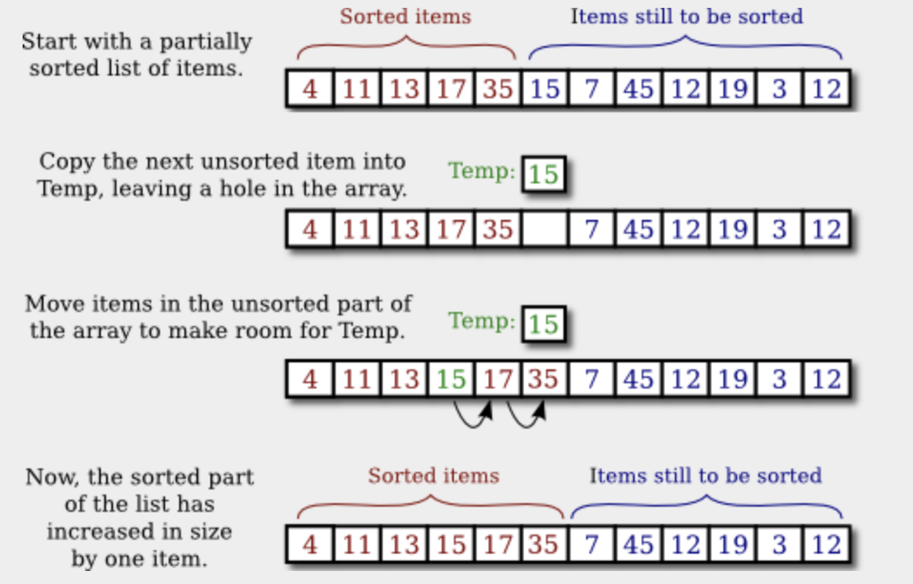

# Section 5: 검색 및 정렬

특히 일반적인 두 가지 배열 처리 기술은 **검색**과 **정렬**이다. 여기서 검색한다는 것은 지정된 기준을 충족하는 배열의 항목을 찾는 것을 의미한다. 정렬이란 배열의 모든 항목을 증가 또는 감소 순서로 재배열하는 것을 의미한다. 섹션 7.2.2에서 Java에 배열 검색 및 정렬을 위한 몇 가지 내장 메서드가 있음을 확인했다. 그러나 컴퓨터 과학을 전공하는 학생은 이러한 방법에 사용되는 알고리즘에 익숙해야 한다. 

정렬과 검색은 숫자 배열을 예로 들어 이론적인 방식으로 자주 논의 된다. 그러나 실제 상황에서는 일반적으로 더 흥미로운 유형의 데이터가 관련된다. 예를 들어, 배열은 메일링 리스트일 수 있고 배열의 각 요소는 이름과 주소를 포함하는 객체일 수 있다. 사람의 이름이 주어지면 그 사람의 주소를 찾아보고 싶을 수도 있다. 주어진 이름을 포함하는 배열에서 객체를 찾으려고 하기 때문에 이것은 검색의 예이다. 다양항 기준에 따라 배열을 정렬할 수 있으면 유용할 것이다. 정렬의 한 가지 예는 이름이 알파벳 순서로 정렬되도록 배열 요소를 정렬하는 것이다. 

이 예는 객체를 포함하는 배열이 있고 객체의 인스턴스 변수 중 하나의 값을 기반으로 배열을 검색하거나 정렬하려는 보다 추상적인 상황으로 일반화될 수 있다. 이 경우 이전 섹션에서 설명한 대로 데이터베이스 작업에서 유래된 "레코드", "필드"라는 용어를 사용할 수 있다. 메일링 리스트 예에서는 각 레코드에 이름, 성, 거리 주고, 주, 도시 및 우편번호가 필드로 포함된 레코드 배열이 있을 수 있다. 검색 또는 정렬을 위해 필드 중 하나가 키로 지정된다. 검색이란 키 필드에 지정된 값이 있는 배열의 레코드를 찾는 것을 의미한다. 정렬이란 레코드의 키 필드가 오름차순 혹은 내림차순이 되도록 배열 내에서 레코드를 이동하는 것을 의미한다.

이 섹션에서는 대부분의 예제가 숫자 배열을 사용하는 전통을 따른다.

## 1. 검색(Searching)

배열의 특정 항목을 검색하는 확실한 알고리즘이 있다. 배열의 각 항목을 차례로 살펴보고 해당 항목이 찾고 있는 항목인지 확인한다. 그렇다면 검색이 완료된 것이다. 원하는 항목을 찾지 못한 채 모든 항목을 살펴보면 해당 항목이 배열에 없음을 확인할 수 있다. 이 알고리즘을 구현하는 서브루틴을 작성하는 것은 쉽다. 검색하려는 배열이 `int`배열이라고 가정해 본다. 다음은 지정된 정수에 대한 배열을 검색하는 방법이다. 정수가 발견되면 메서드는 정수가 발견된 배열의 위치 인덱스를 반환한다. 정수가 배열에 없으면 메서드는 정수를 찾을 수 없다는 신호로 -1 값을 반환한다.

```java
static int find(int[] A, int N) {
    for (int index = 0; index < A.length; index++) {
        if ( A[index] == N )
            return index;  // N has been found at this index!
        }
        
    return -1;
}
```

각 항목을 차례로 살펴봄으로써 배열을 검색하는 방법을 **선형 검색(linear search)** 라고 한다. 배열의 항목 순서에 대해 알려진 것이 없다면 실제로 더 나은 대체 알고리즘은 없다. 그러나 배열의 요소가 증가 또는 감소 순서로 알려진 경우 훨씬 빠른 검색 알고리즘을 사용할 수 있다. 요소가 순서대로 정렬된 배열을 **정렬(sorted)** 되었다고 한다. 물론 배열을 정렬하려면 약간의 작업이 필요하지만 배열을 여러 번 검색해야 하는 경우 정렬 작업을 통해 수행된 작업이 실제로 성과를 낼 수 있다.


**이진 검색(binary search)** 은 정렬된 항목에서 특정 항목을 검색하는 방법이다. 구현이 간단하지는 않지만 기본 아이디어는 간단합니다. 정렬된 목록에서 항목을 검색하는 경우 단일 항목을 검사하여 리스트에 있는 항목의 절반을 제거할 수 있다. 예를 들어 1000개의 정수로 구성된 정렬된 배열에서 숫자 42를 찾고 있다고 가정한다. 배열이 오름차순으로 정렬되어 있다고 가정해 본다. 배열에서 항목 번호 500을 화인하고 항목이 93이라는 것을 발견했다고 가정한다. 42는 93보다 작고 배열의 요소는 오름차순이므로 배열에 42가 발생하면 다음과 같은 결론을 내릴 수 있다. 그러면 500위치 이전 어딘가에 발생해야 한다. 500이상의 번호에 지정된 모든 위치에는 93보다 크거나 같은 값이 포함되어 있다. 이러한 위치는 숫자 42의 가능한 위치로 제거될 수 있다.


42가 배열의 전반부에만 있을 수 있다는 것을 알게 되면 다음 단계는 위치 250을 확인하는 것이다. 해당 위치의 숫자가 예를 들어 -21인 경우 250 이전의 위치를 제거하고 추가 검색을 제한할 수 있다. 다음 테스트에서는 검색을 약 125개 위치로 제한하고 그 다음 테스트에서는 약 62개의 위치로 검색을 제한한다. 단 10단계만 지나면 위치는 하나만 남는다. 이는 배열의 모든 요소를 살펴보는 것보다 훨씬 낫다. 백만 개의 항목이 있는 경우에도 이진 검색을 통해 배열을 검색하는 데 여전히 20단계만 소요된다. (수학적으로 log2 N과 거의 같다.)


배열 A에서 항목 N을 검색하는 Java 서브 루틴으로 이진 검색을 수행하려면 N이 포함될 수 있는 위치 범위를 추적하면 된다. 각 단계에서 가능성을 제거하면서 이 범위의 크기를 줄인다. 기본적인 조작은 범위의 중간에 있는 항목을 보는 것이다. 이 항목이 N보다 크면 범위의 후반부가 제거될 수 있다. N보다 작으면 범위의 전반부를 제거할 수 있다. 가운데 숫자가 우연히 정확히 N이면 검색이 완료된 것이다. 범위의 크기가 0으로 감소하면 숫자 N 배열에서는 발생하지 않는다.

```java
/**
 * 배열 A에서 정수 N을 검색합니다.
 * 전제조건: A를 오름차순으로 정렬해야 합니다.
 * 사후 조건: N이 배열에 있으면 반환 값 i,
 * A[i] == N을 만족합니다. N이 배열에 없으면
 * 반환값은 -1입니다.
 */
static int BinarySearch(int[] A, int N) {
    int lowerPossibleLoc = 0;
    int maximumPossibleLoc = A.length - 1;
    
    while (highestPossibleLoc >= lowerPossibleLoc) {
       int middle = (최저PossibleLoc + 최고PossibleLoc) / 2;
       if (A[middle] == N) {
                 // 이 인덱스에서 N을 찾았습니다! 중간으로 돌아가기;
       }
       else if (A[middle] > N) {
                 // 위치 제거 >= 중간
          maximumPossibleLoc = middle - 1;
       }
       else {
                 // 위치 제거 <= 중간
          lowerPossibleLoc = middle + 1;   
       }
    }
    
    // 이때 maximumPossibleLoc < lowerPossibleLoc,
    // 이는 N이 배열에 없는 것으로 알려져 있음을 의미합니다. 반품
    // -1은 배열에서 N을 찾을 수 없음을 나타냅니다.
 
    return -1;
}
```

## 2. 연관 리스트(Association Lists)

검색의 특히 일반적인 응용 프로그램 중 하나는 **연관 리스트(association lists)** 를 사용하는 것이다. 연관 리스트의 표준 예시는 사전이다. 사전은 정의를 단어와 연관시킨다. 단어가 주어지면 사전을 사용하여 해당 단어의 정의를 찾아볼 수 있다. 사전을 `(w, d)` 형식의 쌍(paris) 리스트로 생각할 수 있다. 여기서 `w`는 단어이고 `d`는 단어의 정의이다. 일반 연관 리스트는 `(k, v)` 쌍의 리스트이다. 여기서 `k`는 "키" 값이고 `v`는 해당 키와 관련된 값이다. 일반적으로 우리는 목록의 두 쌍이 동일한 키를 가지고 있지 않다고 가정하고 싶다. 연관 리스트에는 두 가지 기본 작업이 있다. 키 `k`가 주어지면 `k`와 연관된 값 `v`를 찾는다. 그리고 키 `k`와 값 `v`가 주어지면 연관 리스트에 쌍 `(k, v)`를 추가한다.(동일한 키 값을 가진 쌍이 있는 경우 교체) 두 작업을 일반적으로 `get`, `put`이라고 한다.

연관 리스트는 컴퓨터 과학에서 매우 널리 사용된다. 예를 들어, 컴파일러는 각 변수와 관련된 메모리 내 위치를 추적해야 한다. 이는 각 키가 변수 이름이고 연관된 값이 메모리에 있는 해당 변수의 주소인 연관 리스트를 사용하여 이를 수행할 수 있다. 또 다른 예는 메일링 리스트이다. 주소를 리스트의 각 이름에 연결하는 것으로 생각하면 된다. 관련 예로, 전화번호를 각 이름에 연결하는 전화번호부를 생각한다. 

전화번호부의 연관 리스트에 있는 항목은 클래스에 속하는 객체일 수 있다.

```java
class PhoneEntry {
    String name;
    String phoneNum;
}
```

전화번호의 데이터는 `PhoneEntry[]` 유형의 배열과 실제로 디렉토리에 저장된 항목 수를 추적하는 정수 변수로 구성된다. 전화번호부가 보유할 수 있는 항목 수에 임의의 제한을 두는 것을 피하기 위해 섹션 7.2.4에서 배운 동적 배열 기술을 사용할 수 있다. `PhoneDirectory` 클래스에는 `get`, `put` 작업을 구현하는 인스턴스 메서드가 포함되어야 한다. 

```java
import java.util.Arrays;

/**
 * PhoneDirectory는 전화번호와 함께 이름 목록을 보유합니다.
 * 각 이름. 관련된 전화번호를 찾을 수 있습니다.
 * 주어진 이름, 그리고 주어진 이름에 대한 전화번호를 지정합니다.
 */
public class PhoneDirectory { 
    
    /**
     * PhoneEntry 유형의 객체는 하나의 이름/번호 쌍을 보유합니다.
     */
    private static class PhoneEntry {
       String name;     
       String number;   
    }
   
    private PhoneEntry[] data; 
    private int dataCount;

    /**
     * 생성자는 처음에는 빈 디렉터리를 만듭니다.
     */
    public PhoneDirectory() { 
        data = new PhoneEntry[1];
        dataCount = 0;
    }

    /**
     * 주어진 이름과 이름/번호 쌍을 찾습니다. 발견되면 인덱스
     * 데이터 배열의 쌍이 반환됩니다. 어떤 쌍에도 다음이 포함되어 있지 않으면
     * 이름이 지정된 경우 반환 값은 -1입니다. 이 비공개 메소드는
     * getNumber() 및 putNumber()에서 내부적으로 사용됩니다.
     */
    private int find( String name ) {
        for (int i = 0; i < dataCount; i++) {
            if (data[i].name.equals(name))
                return i;  
        }
        return -1;  
    }
    
    /**
     * 특정 이름에 대한 전화번호(있는 경우)를 찾습니다.
     * @return 이름과 관련된 전화번호입니다. 이름이 그렇다면
     */
    public String getNumber( String name ) {
        int position = find(name);
        if (position == -1) 
            return null;   
        else 
            return data[position].number;
    }

    /**
     * 주어진 이름을 주어진 전화번호와 연관시킵니다. 이름이
     * 전화번호부에 이미 존재하는 경우 새 번호가 대체됩니다.
     * 예전 것. 그렇지 않으면 새 이름/번호 쌍이 추가됩니다. 그만큼
     * 이름과 번호는 모두 null이 아니어야 합니다. IllegalArgumentException
     * 가 그렇지 않은 경우 발생합니다.
     */
    public void putNumber( String name, String number ) {
        if (name == null || number == null) 
            throw new IllegalArgumentException("name and number cannot be null");
        int i = find(name);
        if (i >= 0) {
            data[i].number = number;
        } 
        else {
            if (dataCount == data.length) {
                data = Arrays.copyOf( data, 2*data.length );
            }
            PhoneEntry newEntry = new PhoneEntry();  
            newEntry.name = name;
            newEntry.number = number;
            data[dataCount] = newEntry; 
            dataCount++;
      }
   }

} 
```

클래스는 선형 검색을 사용하여 이름/번호 쌍 배열에서 지정된 이름의 위치를 찾는 전용 인스턴스 메서드 `find()`를 정의한다. `find()` 메서드는 `getNumber()` 메서드와 `putNumber()` 메서드 모두에서 사용된다. 특히 `putNumber(name, number)`는 이름이 전화번호부에 있는지 확인해야 한다는 점에 유의해야 한다. 그렇다면 기본 항목의 숫자만 변경된다. 그렇지 않은 경우 새 전화 항목을 생성하여 배열에 추개해야 한다. 


이 클래스는 동적 배열 대신 ArrayList를 사용하여 작성할 수도 있다. 그리고 중첩된 `PhoneEntry` 클래스는 레코드 클래스가 될 자연스러운 후보이다. 

`find()` 메서드에서 단순 선형 검색 대신 이진 검색을 사용하면 이 전화번호부 구현을 개선할 수 있다. 그러나 `PhoneEntries` 리스트가 이름에 따라 알파벳 순서로 정렬된 경우에만 그렇게 할 수 있다. 실제로 다음 하위 섹션에서 볼 수 있듯이 항목 리스트를 정렬된 순서로 유지하는 것이 그렇게 어렵지 않다. 


연관 리스트는 "맵"이라고도 하며 Java에는 모든 유형의 키와 값에 대한 연관 리스트를 구한하는 `Map`이라는 표준 매개변수 유형이 있다는 점을 언급한다. 구현은 기본 배열로 수행할 수 있는 그 어떤 것보다 효율적이다.


## 3. 삽입 정렬(insertion sort)

우리는 배열을 정렬하는 데에는 타당한 이유가 있다는 것을 확인했다. 이를 위해 사용할 수 있는 알고리즘이 많이 있다. 가장 이해하기 쉬운 것 중 하나는 삽입 정렬 알고리즘이다. 이 기술은 목록에 새 항목을 추가할 때 목록을 정렬된 순서로 유지하는 문제에도 적용할 수 있다. 먼저 그 경우를 고려한다.


정렬된 목록이 있고 해당 목록에 항목을 추가한다고 가정해 본다. 수정된 목록이 여전히 정렬되어 있는지 확인하려면 항목을 올바른 위치에 삽입해야 한다. 이때 작은 항목은 모두 앞에 오고 큰 항목은 모두 뒤에 온다. 이는 새 항목을 위한 공간을 확보하기 위해 각각의 더 큰 항목을 한 칸 위로 이동하는 것을 의미한다.

```java
/*
 * 전제조건: itemsInArray는 항목 수입니다.
 * A에 저장됩니다. 이 항목은 오름차순이어야 합니다.
 * (A[0] <= A[1] <= ... <= A[itemsInArray-1]).
 * 배열 크기는 itemsInArray보다 적어도 하나 더 큽니다.
 * 사후조건 : 아이템 개수가 1개 증가되었으며,
 * newItem이 배열에 추가되었으며 모든 항목이
 * 배열의 순서는 여전히 증가하고 있습니다.
 * 참고: 항목을 삽입하는 과정을 완료하려면
 * 배열, 항목 수를 세는 변수
 * 배열에서 이것을 호출한 후에는 증가해야 합니다.
 * 서브루틴.
 */
static void insert(int[] A, int itemsInArray, int newItem) {
    
    int loc = itemsInArray - 1;  // Start at the end of the array.
        
    /* Move items bigger than newItem up one space;
      Stop when a smaller item is encountered or when the
      beginning of the array (loc == 0) is reached. 
      */
        
    while (loc >= 0 && A[loc] > newItem) {
        A[loc + 1] = A[loc];  // Bump item from A[loc] up to loc+1.
        loc = loc - 1;        // Go on to next location.
    }
    
    A[loc + 1] = newItem;  // Put newItem in last vacated space.
}
```

개념적으로 정렬되지 않은 배열에서 모든 항목을 가져온 다음 목록을 정렬된 순서로 유지하면서 항목을 하나씩 배열에 다시 삽입하려는 경우 정렬 방법으로 확장할 수 있다. 각 삽입은 위에 제공된 `insert` 루틴을 사용하여 수행할 수 있다. 실제 알고리즘에서는 실제로 배열의 모든 항목을 가져오지는 않는다. 단지 배열의 어느 부분이 정렬되었는지 기억하면 된다.

```java
static void insertionSort(int[] A) {
    int itemsSorted; 
    for (itemsSorted = 1; itemsSorted < A.length; itemsSorted++) {
        // 항목 A[0], A[1], ... A[itemsSorted-1]을 가정합니다.
        // 이미 정렬되었습니다. A[itemsSorted] 삽입
        // 목록의 정렬된 부분에 추가됩니다.
        
        int temp = A[itemsSorted];
        int loc = itemsSorted - 1;
        while (loc >= 0&&A[loc] > temp) {
            A[loc + 1] = A[loc];  // A[loc]에서 loc+1까지 항목을 범프합니다
            loc = loc - 1;       // 다음 위치로 이동합니다.
        }

        A[loc + 1] = temp; // 마지막으로 비워진 공간에 temp를 넣습니다.
    }
}
```

다음은 삽입 정렬의 한 단계를 보여준다.



##  4. 선택 정렬(Selection Sort)


또 다른 일반적인 정렬 방법은 목록에서 가장 큰 항목을 찾아 끝으로 이동하는 아이디어를 사용한다. 목록이 오름차순으로 정렬될 경우 해당 항목이 속한 위치이다. 가장 큰 항목이 올바른 위치에 있으면 나머지 항목에도 동일한 아이디어를 적용할 수 있다. 즉, 다음으로 큰 항목을 찾아 마지막에서 다음 공간으로 이동하는 등의 작업을 수행한다. 이 알고리즘을 선택 정렬이라고 한다.

```java
static void selectionSort(int[] A) {
    // 선택 정렬을 사용하여 A를 오름차순으로 정렬합니다.
      
    for (int lastPlace = A.length-1; lastPlace > 0; lastPlace--) {
        // A[0], A[1], ... 중에서 가장 큰 항목을 찾습니다.
        // A[lastPlace], lastPlace 위치로 이동
        // 현재 숫자로 바꿔서
        // lastPlace 위치에 있습니다.
        
        int maxLoc = 0;  // 지금까지 본 가장 큰 항목의 위치입니다.
        
        for (int j = 1; j <= lastPlace; j++) {
            if (A[j] > A[maxLoc]) {
                // A[j]는 우리가 본 최대값보다 크기 때문에
                // 지금까지 j는 최대값의 새로운 위치입니다.
                // 우리는 지금까지 보았습니다.
                maxLoc = j;
            }
        }
        int temp = A[maxLoc];  // 가장 큰 항목을 A[lastPlace]로 바꿉니다.
        A[maxLoc] = A[lastPlace];
        A[lastPlace] = temp;
   } 
   
}
```


섹션 5.4.1에 소개된 `Hard` 클래스에서는 선택 정렬의 변형이 사용된다. (드디어 해당 섹션의 Hard 클래스의 소스 코드를 완전히 이해할 수 있게 된다.)


`Hard` 클래스에서 카드패는 `ArrayList<Card>` 목록에 저장된 객체는 `Card` 유형이다. Card 객체에는 카드의 모양과 가치를 결정하는 데 사용할 수 있는 인스턴스 메서드 `getSuit()`, `getValue()`가 포함되어 있다. 정렬 방법에서는 실제로 새 목록을 만들고 이전 목록에서 새 목록으로 카드를 하나씩 이동한다. 카드는 이전 목록에서 오름차순으로 선택된다. 결국 새 목록은 손(hand)이 되고 이전 목록은 폐기된다. 이것은 가장 효율적인 절차는 아니지만 카드의 손이 너무 작아서 비효율성은 무시할 수 있다. 다음은 모양별로 카드를 정렬하는 코드이다.

```java
/**
 * 같은 모양의 카드가 되도록 손에 있는 카드를 정렬합니다.
 * 함께 그룹화되고 슈트 내에서 카드는 값별로 정렬됩니다.
 * 에이스는 가장 낮은 값인 1로 간주됩니다.
 */
public void sortBySuit() {
    ArrayList<Card> newHand = new ArrayList<Card>();
    while (hand.size() > 0) {
        int pos = 0;  // 최소 카드의 위치.
        Card c = hand.get(0);  // 최소 카드.
        for (int i = 1; i < hand.size(); i++) {
            Card c1 = hand.get(i);
            if ( c1.getSuit() < c.getSuit() || 
                (c1.getSuit() == c.getSuit() && c1.getValue() < c.getValue()) ) {
                pos = i;  // 최소 카드와 위치를 업데이트합니다.
                c = c1;
            }
        }
        hand.remove(pos);  // 원래 손에서 카드를 제거합니다.
        newHand.add(c);    // 새 핸드에 카드를 추가합니다.
    }
    hand = newHand;
}
```

이 예는 목록의 항목을 비교하는 것이 일반적으로 `"<"` 연산자를 사용하는 것만큼 간단하지 않다는 사실을 보여준다. 이 경우 첫 번째 카드의 무니가 두 번째 무늬의 무늬보다 작거나 무늬가 동일하고 두 번째 카드의 값이 다음 카드의 무니보다 작은 경우 한 카드가 다른 카드보다 작은 것으로 간주한다. 첫 번째, 이 테스트의 두 번째 부분에서든 동일한 모양의 카드가 값별로 정렬되는지 확인한다. 

문자열 목록을 정렬하면 비슷한 문제가 발생한다. `"<"` 연산자는 문자열에 대해 정의되지 않는다. 그러나 String 클래스틑 `CompareTo` 메서드를 정의한다. 

```java
str1.compareTo(str2)
```

`str1`이 `str2`와 같을 때 0이고, `str1`이 `str2` 보다 앞에 있으면 0보다 작고, `str1`이 `str2`뒤에 오면 0보다 큰 int를 반환한다. 예를 들어 테스트를 통해 `str1`이 `str2` 보다 앞에 있는지 또는 같은지 테스트할 수 있다.

```java
if (str1.compareTo(str2) <= 0)
```

문자열의 "앞"와 "뒤"에 정의에는 문자열에 있는 문자의 유니코드 값을 기반으로 하는 사전순 정렬 방식이 사용된다. 사전식 순서는 문자로만 구성된 문자열의 경우에도 알파벳 순서와 동일하지 않는다. (사전식 순서에서는 모든 대문자가 모든 소문자 앞에 오기 때문이다.) 그러나 영어 알파벳의 26개 소문자로만 구성된 단어의 경우 사전순과 알파벳 순서는 동일하다. (문자열이 모두 대문자로 구성된 경우에도 마찬가지이다.) `str1.compareToIgnoreCase(str2)` 메서드는 포함된 모든 문자를 소문자로 변환한 후 두 문자열을 비교한다.

---

삽입 정렬과 선택 정렬은 상당히 작은 배열을 정렬하는 데 적합한다. 이진 검색이 선형 검색보다 빠른 것과 마찬가지로 큰 배열의 삽입 정렬 및 선택 정렬보다 훨씬 빠른 더 복잡한 정렬 알고리즘이 있다. 표준 방법 `Arrays.sort`는 이러한 빠른 정렬 알고리즘을 사용한다.

## 5. Unsorting

훨씬 더 일반적이지만 좀 더 재미있는 관련 문제를 정렬하는 방법에 대해 이 섹션을 끝내지 않을 수 없다. 이는 배열의 요소를 임의의 순서로 배치하는 문제이다. 이는 배열의 요소를 임의의 순서로 배치하는 문제이다. 이 문제의 전형적인 경우는 카드 한 벌을 섞는 것이다. 셔플링에 대한 좋은 알고리즘은 가장 큰 항목을 목록 끝으로 이동하는 대신 항목을 무작위로 선택하여 목록 끝으로 이동한다는 점을 제외하면 선택 정렬과 유사하다.


```java
/**
 * Postcondition : A의 항목이 무작위 순서로 재배열되었습니다.
 */
static void shuffle(int[] A) {
    for (int lastPlace = A.length-1; lastPlace > 0; lastPlace--) {
        int randLoc = (int)(Math.random()*(lastPlace+1));
        int temp = A[randLoc];
        A[randLoc] = A[lastPlace];
        A[lastPlace] = temp;
    }
}
```


