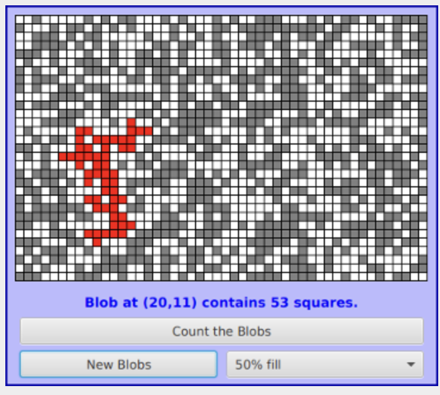

# Recursion

때때로 무언가를 그 자체로는 정의할 수 없다는 말을 들어봤을 것이다. 그럼에도 불구하고 그것이 올바르게 수행된다면, 그 자체의 관점에서 적어도 부분적으로 무언가를 정의하는 것은 매우 강력한 기술이 될 수 있다. 재귀적 정의는 정의의 일부로 정의되는 개념이나 사물을 사용하는 정의이다. 예로 "조상"은 부모 또는 부모의 조상이다. "문장"은 무엇보다도 "그리고"와 같은 접속사로 연결된 두 문장이다. 

재귀적 정의는 단지 몇 단어만으로 배우 복잡한 상황을 설명할 수 있다. 재귀를 사용하지 않고"조상"이라는 용어를 정의하면 "부모, 조부모, 증조부모"과 같이 될 수 있다. 그러나 "등등(and so on)"이라고 말하는 것은 그다지 엄격하지 않다. 정의에 재귀를 사용하지 않고 Java문이 어떤 모습일 수 있는지 설명하는 것은 어렵고 꽤 우스꽝스러울 것이다.

재귀는 프로그래밍 기술로 사용될 수 있다. 재귀 서브루틴은 직접 또는 간접적으로 자신을 호출하는 루틴이다. 서브루틴이 자신을 직접 호출한다는 것은 해당 정의에 저으이 중인 서브루틴을 호출하는 서브 루틴 호출문이 포함되어 있음을 의미한다. 서브 루틴이 자신을 간접적으로 호출한다는 것은 두 번째 서브 루틴을 호출하고 이 서브 루틴이 첫 번째 서브 루틴을 호출한다는 의미이다. 재귀 서브 루틴은 단 몇줄의 코드로 복잡한 작업을 정의할 수 있다. 

## 1. 재귀 이진 탐색(Recursive Binary Search)

섹션 7.5.1의 이진 검색 알고리즘부터 시작한다. 이진 검색은 정렬된 항목 목록에서 지정된 값을 찾는 데 사용된다. 아이디어는 목록 중 간에 있는 요소를 테스트하는 것이다. 해당 요소가 지정된 값과 같으면 작업이 완료된 것이다. 지정된 값이 목록의 중간 요소보다 작으면 목록의 전반부에서 값을 검색하면 된다. 그렇지 않으면 목록의 후반부에서 값을 검색해야 한다. 목록의 전반부 또는 후반부의 값을 검색하는 데 사용되는 방법이 이진 검색이다. 즉, 아직 고려 중인 목록의 절반에 있는 중간 요소를 보고 찾고 있는 값을 찾거나 나머지 요소 중 절반에 이진 검색을 적용해야 한다. 이는 재귀적인 설명이다.

하지만 그렇게 하기 전에 고려해야 할 두 가지 고려 사항이 있다. 이들 각각은 재귀 서브루틴에 대한 중요한 일반 사실을 보여준다. 우선, 이진 검색 알고리즘은 "목록 중간 요소"를 찾는 것 부터 시작된다. 하지만 목록이 비어 있으면 어떻게 되나?? 목록에 요소가 없으면 중간 요소를 볼 수 없다. 섹션 8.2.2에서 용어 "전제 조건(Precondition)"는 여기서 비어 있지 않은 목록을 갖는 것이다. 이는 이 전제 조건을 고려하도록 알고리즘을 수정해야 한다는 단서이다. 빈 목록에서 특정 값을 검색하고 있다면 어떻게 해야 하나?? 답은 간단하다. 목록이 비어 있으면 해당 값이 목록에 없다고 확신할 수 있으므로 추가 작업 없이 답을 제공할 수 있다. 빈 목록은 이진 검색 알고리즘의 **기본 사례(base case)** 이다. 재귀 알고리즘의 기본 사례는 알고리즘을 재귀적으로 적용하는 것이 아니라 직접 처리하는 경우이다. 이진 검색 알고리즘에는 실제로 다른 유형의 기본 사례가 있다. 목록 중간에서 찾고 있는 요소를 찾으면 작업이 완료된 것이다. 더 이상 재귀할 필요가 없다.

두 번째 고려 사항은 서브 루틴의 매개 변수와 관련이 있다. 문제는 목록에서 값을 검색하는 측면에서 표현된다. 원래의 재귀가 아닌 이진 검색 서브 루틴에서는 목록이 배열로 제공된다. 그러나 재귀적 접근 방식에서는 원래 목록의 일부에만 서브 루틴을 재귀적으로 적용할 수 있어야 한다. 원래 서브 루틴이 전체 배열을 검색하도록 설계된 경우 재귀 서브 루틴은 배열의 일부를 검색할 수 있어야 한다. 서브 루틴에 대한 매개 변수는 검색할 배열 부분을 알려주어야 한다. 이는 문제를 재귀적으로 해결하려면 문제를 약간 일반화해야 하는 경우가 많다는 일반적인 사실을 보여준다.


```java
/**
 * 배열 A에서 loIndex부터 hiIndex까지 번호가 매겨진 위치에서 검색합니다.
 * 지정된 값에 대해 포함됩니다. 값을 찾으면 반환
 * 그것이 발생하는 배열의 인덱스. 값을 찾을 수 없는 경우,
 * -1을 반환합니다. 전제조건: 배열은 증가하는 순서로 정렬되어야 합니다.
 * 주문하다.
 */
static int binarySearch(int[] A, int loIndex, int hiIndex, int value) {

    if (loIndex > hiIndex) {
        // 시작 위치는 최종 인덱스 뒤에 옵니다.
        // 따라서 지정된 항목에는 실제로 요소가 없습니다.
        // 범위. 이 빈 목록에는 값이 없습니다!
        return -1;
    }

    else {
        // 목록의 중간 위치를 살펴보세요. 만약
        // 해당 위치에서 값이 발생하면 해당 위치를 반환합니다.
        // 그렇지 않으면 첫 번째 항목에서 재귀적으로 검색합니다.
        // 목록의 절반 또는 두 번째 절반.
        int middle = (loIndex + hiIndex) / 2;
        if (value == A[middle])
            return middle;
        else if (value < A[middle])
            return binarySearch(A, loIndex, middle - 1, value);
        else   
            return binarySearch(A, middle + 1, hiIndex, value);
    }

}
```

이 루틴에서 `loIndex` 및 `hiIndex` 매개 변수는 검색할 배열 부분을 지정한다. 전체 배열을 검색하려면 `binarySearch`를 호출하기만 하면 된다. 두 가지 기본 사례에서 서브루틴은 재귀를 사용하지 않고 즉시 답을 반환할 수 있다. 다른 경우에는 재귀 호출을 사용하여 답을 계산하고 해당 답을 반환한다. 

대부분의 사람들은 처음에 재귀가 실제로 작동한다는 것을 스스로 확신하는 데 어려움을 겪는다. 핵심은 재귀가 제대로 작동하기 위해 참이어야 하는 두 가지 사항에 주목하는 것이다. 재귀를 사용하지 않고 처리할 수 있는 하나 이상의 기본 사례가 있어야 한다. 그리고 문제를 해결하는 동안 재귀를 적용하는 경우 어떤 의미에서는 원래 문제보다 더 작은, 즉 기본 사례(base case)에 더 가까운 문제에 적용해야 한다. 작은 문제를 해결할 수 있고 큰 문제를 작은 문제로 줄일 수 있다면 어떤 규모의 문제도 해결할 수 있다는 생각이다. 물론 긍정적으로 큰 문제는 여러 단계를 거쳐 가장 작은 문제로 축소되어야 한다. 그렇게 하려면 엄청난 양의 상세한 장부가 필요할 수 있다. 하지만 장부 관리는 컴퓨터가 한다. 프로그래머로서 큰 그림을 그려야 한다. 기본 사례와 큰 문제를 작은 문제로 줄이는 것이다. 컴퓨터는 큰 문제를 줄이는 데 필요한 세부 사항을 기본 사례에 이르기까지 여러 단계에서 처리한다. 이러한 감소를 자세히 생각하려고 하면 미치게 될 가능성이 높으며 아마두 재귀가 어렵다고 생각하게 될 것이다. 실제로 재귀는 복잡한 문제를 해결하는 가장 간단한 접근 방식인 우아하고 강력한 방법이다.

재귀 서브 루틴을 작성할 때 흔히 발생하는 오류는 두 가지 규칙 중 하나를 위반하는 것이다. 하나 이상의 기본 사례가 있어야 하며 서브 루틴의 재귀적으로 적용될 때 원래 문제보다 작은 문제에 적용되어야 한다. 이러한 규칙을 위반하면 결과는 무한 재귀가 될 수 있으며, 서브 루틴은 기본 사례에 도달하지 않고 계속해서 자신을 호출한다. 무한 재귀는 무한 루프와 유사하다. 그러나 서브 루틴에 대한 각 재귀 호출은 컴퓨터 메모리의 일부를 사용하기 때문에 무한 재귀에 갇힌 프로그램은 메모리가 부족하여 머지않아 충돌하게 된다. Java에서는 StackOverflowError 유형을 제외하고 프로그램이 충돌한다.

## 2. 하노이 타워

우리는 잠시 시간을 내어 쉽게 구현할 수 있는 알고리즘인 이진 검색을 연구해 왔다. 재귀 대 루프를 했다. 다음으로 재귀를 사용하면 해결하기 쉽지만 재귀 없이는 해결하기 어려운 문제를 살펴 본다. 이것은 "하노이의 탑"으로 알려진 표준적인 예이다. 문제는 다양한 크기의 디스크를 크기가 작은 순서대로 베이스에 쌓아 놓은 것과 관련이 있다. 목표는 두 가지 규칙에 따라 스택을 한 베이스에서 다른 베이스로 이동하는 것이다. 한 번에 하나의 디스크만 이동할 수 있으며 더 작은 디스크 위에 디스크를 놓을 수 없다. "예비"로 사용할 수 있는 세 번째 베이스가 있다. 10개의 디스크 스택의 시작 상황은 다음 그림의 위쪽 절반에 표시한다. 여러 번 이동한 후 상황은 다음 그림과 같다. 


문제는 위에 주어진 규칙에 따라 스택 0에서 스택 1로 10개의 디스크를 이동하는 것이다. 스택 2는 예비 위치로 사용할 수 있다. 이것을 동일한 유형의 더 작은 문제로 줄여서 문제를 조금 일반화하여 이를 가능하게 할 수 있나?? 문제의 크기를 이동해야 할 디스크 수로 간주하는 것이 당연해 보인다. 스택 0에 N개의 디스크가 있는 경우 결국 맨 아래 디스크를 스택 0에서 스택 1로 이동해야 한다는 것을 알고 있다. 하지만 그렇게 하기 전에 규칙에 따라 첫 번째 N-1 디스크가 스택에 있어야 한다. N번째 디스크를 스택 1로 이동한 후에는 다른 N-1개 디스크를 스택 2에서 스택 1로 이동하여 솔루션을 완료해야 한다. 하지만 N-1으로 이동하는 것과 동일한 유형의 문제이다. 문제의 작은 버전이라는 점을 제외하면 디스크이다. 이것이 바로 우리가 재귀를 수행하는 데 필요한 것이다. 더 작은 문제는 디스크를 스택 0에서 스택 1로 이동하는 대신 스택 0에서 스택 2로 또는 스택 2에서 스택 1로 이동하는 것과 관련되므로 문제를 약간 일반화해야 한다. 문제를 해결하는 재귀 서브 루틴에서 스택은 디스크의 소스와 대상 양학을 하는 디스크를 지정해야 한다. 다른 두 매개 변수를 통해 알아낼 수 있더라고 예비로 사용할 스택을 지정하는 것도 편리하다. 기본 사례는 이동할 디스크가 하나만 있는 경우이다. 이 경우 해결책은 간단하다. 한 단계로 디스크를 이동하면 된다. 

```java
/**
 * 지정된 디스크 수를 이동하는 문제 해결
 *에 의해 지정된 스택의 첫 번째 매개변수에 의해
 * 세 번째로 지정된 스택에 대한 두 번째 매개변수
 * 매개변수. 네 번째 매개변수로 지정된 스택
 * 예비용으로 사용 가능합니다. 스택은 다음과 같이 지정됩니다.
 * 숫자: 0, 1, 2.
 */
static void towersOfHanoi(int disks, int from, int to, int spare) {
    if (disks == 1) {
        // 이동할 디스크는 하나만 있습니다. 그냥 옮기세요.
        System.out.printf("Move disk 1 from stack %d to stack %d%n", from, to);
    } 
    else {
        // 하나의 디스크를 제외한 모든 디스크를 예비 스택으로 옮긴 다음
        // 아래쪽 디스크를 이동한 다음 다른 디스크를 모두 넣습니다.
        // 그 위에 디스크가 있습니다.
        towersOfHanoi(disks-1, from, spare, to);
        System.out.printf("Move disk %d from stack %d to stack %d%n",
                              disks, from, to);
        towersOfHanoi(disks-1, spare, to, from);
    }
}
```

이 서브루틴은 자연 재귀 솔루션을 표현한다. 각 재귀 호출에는 더 적은 수의 디스크가 포함되므로 재귀가 작동하면 디스크가 하나만 있는 기본 사례에서는 문제를 해결하기 쉽지 않다. N개의 디스크를 스택 0에서 스택 1로 이동하는 "최상위" 문제를 해결하려면 `towersOfHanoi(N, 0, 1, 2)`를 사용하여 호출한다. 

```java
// 출력
Move disk 1 from stack 0 to stack 2
Move disk 2 from stack 0 to stack 1
Move disk 1 from stack 2 to stack 1
Move disk 3 from stack 0 to stack 2
Move disk 1 from stack 1 to stack 0
Move disk 2 from stack 1 to stack 2
Move disk 1 from stack 0 to stack 2
Move disk 4 from stack 0 to stack 1
Move disk 1 from stack 2 to stack 1
Move disk 2 from stack 2 to stack 0
Move disk 1 from stack 1 to stack 0
Move disk 3 from stack 2 to stack 1
Move disk 1 from stack 0 to stack 2
Move disk 2 from stack 0 to stack 1
Move disk 1 from stack 2 to stack 1
```

이 프로그램의 출력은 실제로 생각하고 싶지 않은 많은 세부사항을 보여준다. 세부 사항을 따르는 어려움은 재귀 솔루션의 단순성와 우아함과 뚜렷하게 대조된다. 물론 세부 사항은 컴퓨터에 맡기고 싶을 수도 있다. (디스크 수가 양수라는 전제 조건을 위반하면 어떤 일이 발생할지 생각해 볼 수 있다. 결과는 무한 재귀다.)

그런데 이 문제의 이름을 설명하는 이야기가 있다. 이 이야기에 따르면, 하노이 근처의 고립된 탑에 있던 승려들에게 64개의 원반 더비가 주어졌고, 하노이 탑의 규칙에 따라 매일 한 개의 원반을 옮기는 임무가 주어졌다. 모든 디스크를 한 스택에서 다른 스택으로 옮기는 작업을 완료하는 날 우주는 종말을 맞게 된다. N개의 디스크에 대한 문제를 해결하는 데 필요한 단계 수는 2^N - 1이고 2^264 - 1는 50,000,000,000,000년이 넘는다. 

섹션 8.5에 용어에서 하노이 타워 알고리즘의 실행 시간은 Θ(2n)이다. 여기서 n은 이동해야 하는 디스크의 수이다. 지수 함수 2^n이 매우 빠르게 증가해서 하노이 문제는 실제로 소수의 디스크에 대해서만 풀수 있다.

---

그래픽 하노이 타워 프로그램 외에도 살펴보고 싶은 두 가지 데모 프로그램이 더 있다. 각 프로그램은 재귀 알고리즘의 시각적 데모를 제공한다. [Maze.java](https://math.hws.edu/javanotes/source/chapter9/Maze.java)에서는 재귀를 사용하여 미로를 해결한다. [LittlePentominos.java](https://math.hws.edu/javanotes/source/chapter9/LittlePentominos.java)에서는 잘 알려진 종류의 퍼즐을 푸는데 사용된다.

Maze 프로그램은 먼저 임의의 미로를 만든다. 그런 다음 왼쪽 위 모서리에서 오른쪽 아래 모서리까지 미로를 통과하는 경로를 찾아 미로를 해결하려고 시도한다. 이 문제는 실제로 이 섹션 뒤에서 "블롭 계산" 문제와 매우 유사하다. 재귀 미로 해결 루틴은 주어진 사각형에서 시작하여 인접한 각 사각형을 방문하고 거기에서 재귀적으로 자신을 호출한다. 루틴이 미로의 오른쪽 하단 모서리에 있으면 재귀가 종료된다. 사각형에서 해결책을 찾을 수 없으면 해당 사각형에서 "백업"하여 다른 곳에서 시도한다. 이 일반적인 기술을 **recursive backtracking** 이라고 한다.

LittlePentominos 프로그램은 고전적인 퍼즐을 구현한 것이다. 펜토미노는 크기가 같은 정사각형 5개를 연결한 도형이다. 기본 도형의 가능한 모든 회전과 반사를 계산하지 않고 이러한 방식으로 만들 수 있는 도형은 정확히 12개이다. 문제는 4개의 사각형이 이미 채워진 것으로 표시된 8X8 보드에 12개의 펜토미노를 배치하는 것이다. 재귀적 솔루션은 이미 펜토미노로 부분적으로 채워진 보드를 살펴본다. 서브 루틴은 나머지 조각을 차례로 살펴본다. 보드의 다음 사용 가능한 위치에 해당 조각을 배치하려고 한다. 조각이 맞으면 솔루션의 나머지 부분을 채우기 위해 자신을 재귀적으로 호출한다. 이것이 실패하면 서브 루틴은 다음 부분으로 진행된다. 이는 재귀적 역추적의 또 다른 예이다.

## 3. 재귀 정렬 알고리즘

아마도 더 실용적인 응용 프로그램으로 넘어가서 배열 정렬을 위한 재귀 알고리즘을 살펴본다. 섹션 7.5에서 다룬 선택 정렬과 삽입 정렬 알고리즘은 매우 간단하지만 큰 배열에 적용하면 속도가 다소 느리다. 더 빠른 정렬 알고리즘을 사용할 수 있다. 그 중 하나는 대부분의 상황에서 가장 빠른 정렬 알고리즘인 재귀 알고리즘 퀵 소트(Quick Sort)이다. 

퀵정렬 알고리즘은 간단하지만 영리한 아이디어를 기반으로 한다. 항목 목록이 주어지면 목록에서 항목을 선택한다. .이 항목을 **피벗(pivot)** 이라고 한다. (실제로는 목록의 첫 항목만 사용한다.) 피벗보다 작은 항목은 모두 목록의 시작 부분으로 이동한다. 이제 두 항목 그룹 사이에 피벗을 배치한다. 그러면 피벗이 완전히 정렬된 최종 배열에서 차지할 위치에 놓입니다. 다시 이동할 필요가 없습니다. 이 절차를 QuicksortStep이라고 합니다


QuicksortStep은 재귀적이지 않는다. 퀵 정렬에서 서브 루틴으로 사용된다. 퀵 정렬의 속도는 스텝의 빠른 구현에 달려있다. 

```java
/**
 * lo부터 hi까지의 항목 목록에 QuicksortStep을 적용합니다.
 * 배열 A에 있습니다. 이 루틴에서 반환된 값은 최종 값입니다.
 * 배열에서 피벗 항목의 위치입니다.
 */
static int quicksortStep(int[] A, int lo, int hi) {

    int pivot = A[lo];  // 피벗 값을 가져옵니다.

    // 숫자 hi와 lo는 범위의 끝점을 표시합니다.
    // 아직 테스트되지 않은 숫자입니다. 안녕하세요 감소
    // 동일해질 때까지 lo를 증가시켜 숫자를 이동합니다.
    // 피벗보다 커서 hi 위에 위치하여 이동합니다.
    // 피벗보다 작은 숫자가 lo 아래에 놓이도록 합니다.
    // 시작할 때 A[lo]는 사용 가능한 공간입니다.
    // 값이 지역 변수인 피벗으로 이동되었습니다.

    while (hi > lo) {

        // 루프 불변(하위 섹션 8.2.3 참조 ): A[i] <= 피봇
        // i < lo 및 A[i] >= 피벗 for i > hi.

        while (hi > lo && A[hi] >= pivot) {
            // hi를 피벗보다 큰 숫자를 지나 아래로 이동합니다.
            // 이 숫자는 이동할 필요가 없습니다.
            hi--;
        }

        if (hi == lo)
            break;

        // 숫자 A[hi]는 피벗보다 작습니다. 로 옮기세요
        // A[lo]의 사용 가능한 공간을 남겨두고
        // A[hi]에 공간이 있습니다.

        A[lo] = A[hi];
        lo++;

        while (hi > lo && A[lo] <= pivot) {
            // 피벗보다 작은 숫자를 지나 lo를 위로 이동합니다.
            // 이 숫자는 이동할 필요가 없습니다.
            lo++;
        }

        if (hi == lo)
            break;

        // 숫자 A[lo]는 피벗보다 큽니다. 로 옮기세요
        // A[hi]에 사용 가능한 공간을 남겨두고
        // A[lo]에 공간이 있습니다.

        A[hi] = A[lo];
        hi--;

    } 

    // 이 시점에서 lo는 hi와 같아졌고,
    // 해당 위치에서 사용 가능한 공간입니다. 이 입장은 거짓말
    // 피벗보다 작은 숫자와 피벗보다 큰 숫자 사이
    // 피벗. 이 공간에 피벗을 놓고 해당 위치를 반환합니다.

    A[lo] = pivot;
    return lo;

}
```

이 서브 루틴을 사용하면 Quicksort가 쉽다. 목록 정렬을 위한 퀵 정렬 알고리즘은 목록에 스텝을 적용한 다음 피벗의 새 위치 왼쪽에 있는 항목과 해당 위치의 오른쪽에 있는 항목에 재귀적으로 퀵 정렬을 적용하는 것으로 구성된다. 물론 기본 사례가 필요하다. 목록에 항목이 하나만 있거나 항목이 없는 경우 목록은 이미 가능한 한 정렬되어 있으므로 이러한 경우 퀵정렬은 아무 작업도 수행할 필요가 없다.

```java
/**
 * 배열 요소를 사이에 배치하려면 퀵 정렬을 적용하세요.
 * lo와 hi를 오름차순으로 배치합니다.
 */
static void quicksort(int[] A, int lo, int hi) {
    if (hi <= lo) {
        // 목록의 길이는 1 또는 0입니다. 아무것도 필요하지 않습니다
        // 완료되었으므로 서브루틴에서 복귀하면 됩니다.
        return;
    }
    else {
        // QuicksortStep을 적용하고 새 피벗 위치를 가져옵니다.
        // 그런 다음 빠른 정렬을 적용하여 항목을 정렬합니다.
        // 피벗과 그 뒤에 오는 항목 앞에 위치합니다.
        int pivotPosition = quicksortStep(A, lo, hi);
        quicksort(A, lo, pivotPosition - 1);
        quicksort(A, pivotPosition + 1, hi);
    }
}
```

평소처럼 우리는 문제를 일반화해야 했다. 원래 문제는 배열을 정렬하는 것이지만 재귀 알고리즘은 배열의 지정된 부분을 정렬하도록 설정했다. 전체 배열 A를 `qucikSort()` 서브 루틴을 사용하여 정렬하려면 `quickSort(A, 0, A.length - 1)` 호출한다.

퀵 정렬은 알고리즘 분석 관점에서 볼 때 흥미로운 예이다. 평균 사례 실행 시간이 최악 사례 실행 시간과 크게 다르기 때문이다. 다음은 평균 사례부터 시작하는 매우 비공식적인 분석이다. 스텝을 적용하면 문제를 두 개의 하위 문제로 나눈다. 평균적으로 하위 문제의 크기가 거의 같다. 크기 n의 문제는 대략 n/2인 두 가지 문제로 나뉜다. 그런 다음 대략 크기가 n/4인 네 가지 문제로 나뉜다. 등등. 문제 크기는 각 수준에서 2로 나누어 지므로 대략 log(n) 수준의 세분화가 있게 된다. 각 수준의 처리량은 n에 비례한다. (최상위 수준에서는 배열의 각 요소를 살펴 보고 이동할 수 있다. 두 번째 수준에는 두 가지 하위 문제가 있다. 배열에서 하나를 제외한 모든 요소는 두 하위 문제 중 하나의 일부이므로 살펴보고 이동해야 하므로 두 하위 문제가 결합된 총 약 n 단계가 있다. 마찬가지로 세 번째 수준에는 4개의 하위 문제가 있고 해당 수준의 4개의 하위 문제에는 약 n 단계가 있다...) 각 수준에는 총 n단계가 있고 평균 사례에는 약 log(n) 수준이 있다. 퀵 정렬의 평균 사례 실행 시간은 Θ(n*log(n))이다. 이 분석에서 스텝이 문제를 거의 동일한 두 부분으로 나눈다고 가정한다. 그러나 최악의 경우 n의 크기를 0과 n-1 문제로 나눈다. 이는 피벗 요소가 배열의 시작이나 끝에서 발생한다. 이는 Θ(n^2) 시간이 걸린다. 최악의 경우는 매우 드물다. 이는 배열의 항목이 매우 특별한 형식으로 배열되어 있는지에 따라 달라지므로 퀵 정렬의 평균 성능은 드물지만 특정 경우에는 그다지 좋지 않더라고 매우 좋을 수 있다. (이러한 "드문" 사례 중 하나는 원래 배열이 이미 정렬되어있거나 거의 정렬된 경우이다. 위에 제공괸 퀵 정렬 알고리즘을 큰 정렬 배열에 적용하는 데 시간이 오래 걸린다. 이를 방지할 한 가지 방법은 항상 첫 항목을 사용하는 대신 피벗을 무작위로 선택하는 것이다.)

평균 사례와 최악 사례 실행 시간이 모두 Θ(n*log(n))인 정렬 알고리즘이 있다. 상당히 이해하기 쉬운 예는 머지 소트이다.


## 4. Blob Counting

다음으로, 연결된 사각형 그룹의 사각형 수를 계산하는 방법을 살펴본다. 연결된 사각형 그룹을 "blob"이라고 부르며 우리가 고려할 프로그램은 [Blobs.java](https://math.hws.edu/javanotes/source/chapter9/Blobs.java)이다. 프로그램은 작은 흰색, 회색, 빨간색 사각형의 격자를 표시한다. 




회색 또는 빨간색 사각형은 "채워진" 것으로 간주되고 흰색 사각형은 "비어 있는" 것으로 간주된다. 이 예의 목적을 위해 우리는 채워진 사각형과 다른 채워진 사각형을 통해 위, 아래, 왼쪽 및 오른쪽으로 이동하여 도달할 수 있는 모든 채워진 사각형으로 구성된 "블롭"을 정의한다. 사용자가 프로그램에서 채워진 사각형을 클릭하면 컴퓨터는 클릭한 사각형이 포함된 얼룩의 사각형 수를 계산하고 해당 사각형의 색상을 빨간색으로 변경한다. 그림에서 얼룩 중 하나가 빨간색으로 표시된다. 이 프로그램에는 여러 가지 컨트롤이 있다. "새 Blob" 버튼이 있습니다. 이 버튼을 클릭하면 그리드에 새로운 무작위 패턴이 생성된다. 팝업 메뉴에서는 새 패턴으로 채워질 대략적인 사각형 비율을 지정한다. 정사각형이 많이 채워질수록 얼룩이 커진다.

이 프로그램에서는 재귀를 사용하여 얼룩의 사각형 수를 계산한다. 재귀가 없으면 구현하기가 매우 어려울 것이다. 재귀를 사용하면 비교적 쉽게 수행할 수 있지만 여전히 새로운 기술이 필요하며 이는 다른 여러 응용 프로그램에서도 유용하다.

정사각형 그리드의 데이터는 부울 값의 2차원 배열에 저장된다.

```java
boolean[][] filled;
```

`fill[r][c]` 의 값은 그리드의 `r` 행 과 `c` 열의 사각형이 채워지면 참이다. 그리드의 행 수는 행 이라는 인스턴스 변수에 저장되고 열 수는 columns 에 저장된다 . 프로그램은 `getBlobSize(r,c)` 라는 재귀 인스턴스 메서드를 사용하여 얼룩의 사각형 수를 계산한다. 매개변수 `r` 및 `c` 는 계산할 blob, 즉 행 `r` 과 열 `c` 에 사각형을 포함하는 blob을 알려준다 . `(r, c)` 위치에 채워진 사각형이 없으면 대답은 0 이다. 그렇지 않으면 `getBlobSize()(r, c)` 위치의 정사각형에서 도달할 수 있는 채워진 정사각형의 수를 모두 계산해야 한다. 아이디어는 `getBlobSize()` 를 재귀적으로 사용하여 각 인접 위치에서 도달할 수 있는 채워진 사각형의 수를 얻는 것이다: `(r+1,c)`, `(r-1,c)`, `(r,c+1)`, 그리고 `(r,c-1)`, 이 숫자를 더하고 `(r,c)` 자체의 사각형을 계산하기 위해 1을 더하면 `(r,c)` 에서 도달할 수 있는 채워진 사각형의 총 개수를 얻는다. 명시된 대로 이 알고리즘의 구현은 다음과 같다. 불행하게도 여기에는 심각한 결함이 있다. 바로 무한 재귀로 이어진다는 것이다!!

```java
int getBlobSize(int r, int c) {  // 버그가 있고 잘못된 버전입니다!! 
        // 이 잘못된 메소드는 채워진 모든 값을 계산하려고 시도합니다.
        // 그리드의 (r,c) 위치에서 도달할 수 있는 사각형입니다.
    if (r < 0 || r >= rows || c < 0 || c >= columns) {
        // 이 위치는 그리드에 없으므로
        // 이 위치에는 얼룩이 없습니다. 0의 블롭 크기를 반환합니다.
        return 0;
    }
    if (filled[r][c] == false) {
        // 이 사각형은 얼룩의 일부가 아니므로 0을 반환합니다.        
        return 0;
    }
    int size = 1;  // 이 위치에서 사각형의 수를 세고, 그 다음
                    // 이 사각형에 연결된 얼룩
                    // 가로 또는 세로.
    size += getBlobSize(r-1,c);
    size += getBlobSize(r+1,c);
    size += getBlobSize(r,c-1);
    size += getBlobSize(r,c+1);
    return size;    
}  
```

불행하게도 이 루틴은 동일한 사각형을 두 번 이상 계산한다. 실제로, 블롭에 사각형이 두 개 이상 있으면 각 사각형을 무한히 자주 계산하려고 시도한다! `(r,c)` 위치에 서서 다음 지침을 따르려고 노력하는 모습을 상상해 보자. 첫 번째 명령은 한 행 위로 이동하라고 지시한다. 그렇게 한 다음 동일한 절차를 적용한다. 해당 절차의 단계 중 하나로 한 행 아래로 이동하여 동일한 절차를 다시 적용해야 한다. 하지만 그러면 다시 `(r,c)` 위치로 돌아가게 된다!! 거기에서 한 줄 위로 이동하고, 거기에서 한 줄 아래로 이동한다.... 영원히 앞뒤로! 우리는 사각형이 한 번만 계산되고 처리되도록 해야 하므로 결국 원을 그리며 돌아다니지 않게 된다. 해결책은 탐색경로의 흔적(또는 컴퓨터에 부울 값의 흔적)을 남겨서 이미 방문한 사각형을 표시하는 것이다. 사각형이 방문한 것으로 표시되면 다시 처리되지 않는다. 방문하지 않은 나머지 사각형의 개수가 줄어들어 문제의 크기를 줄이는 데 확실한 진전이 있었다. 무한 재귀를 방지한다!

두 번째 부울 배열인 `visited[r][c]`는 이미 방문하고 처리된 사각형을 추적하는 데 사용된다. `getBlobSize()`가 호출되기 전에 이 배열의 모든 값이 `false`로 설정되었다고 가정한다 . `getBlobSize()` 는 방문하지 않은 사각형을 발견 하면 방문한 배열 의 해당 항목을 true 로 설정하여 사각형을 방문한 것으로 표시한다. `getBlobSize()`는 이미 방문한 사각형을 발견하면 이를 계산하거나 더 이상 처리하지 않는다. 항목이 발견될 때 "표시"하는 기술은 재귀 알고리즘 프로그래밍에서 계속해서 사용되는 기술이다. 다음은 `getBlobSize()` 의 수정된 버전이다. 

```java
/**
 * 블롭의 위치 (r,c)에 있는 사각형의 수를 계산합니다.
 * 그리드. 사각형은 채워져 있는 경우에만 계산됩니다.
 * 방문하지 않았습니다. 이 루틴이 다음 위치에 대해 호출되는 경우
 *를 방문한 경우 반환 값은 0이 됩니다.
 */
int getBlobSize(int r, int c) {
    if (r < 0 || r >= rows || c < 0 || c >= columns) {
        // 이 위치는 그리드에 없으므로
        // 이 위치에는 얼룩이 없습니다. 0의 블롭 크기를 반환합니다.
        return 0;
    }
    if (filled[r][c] == false || visited[r][c] == true) {
        // 이 사각형은 얼룩의 일부가 아닙니다. 그렇지 않으면 
        // 이미 계산되었으므로 0을 반환합니다.
        return 0;
    }
    visited[r][c] = true;   // 방문한 광장을 표시하여
                            // 해당 기간 동안에는 다시 계산하지 않습니다.
                            // 재귀 호출을 따릅니다.
    int size = 1;  // 이 위치에서 사각형의 수를 세고, 그 다음
                    // 이 사각형에 연결된 얼룩
                    // 가로 또는 세로.
    size += getBlobSize(r-1,c);
    size += getBlobSize(r+1,c);
    size += getBlobSize(r,c-1);
    size += getBlobSize(r,c+1);
    return size;
}
```

프로그램에서 이 방법은 사용자가 사각형을 클릭할 때 얼룩의 크기를 결정하는 데 사용된다. `getBlobSize()`가 작업을 수행한 후에도 Blob의 모든 사각형은 여전히 방문한 것으로 표시된다. 사각형의 격자를 그리는 방법은 방문한 사각형을 빨간색으로 표시하여 얼룩을 표시한다.

`getBlobSize()` 메서드는 프로그램에서 수행할 수 있는 다른 작업(모든 블롭 계산)에도 사용된다. 이는 작동 방식을 설명하는 주석이 포함된 다음 방법으로 수행된다.

```java
/**
 * 사용자가 "Blob 계산" 버튼을 클릭하면
 * 그리드에 있는 얼룩의 수를 보고합니다.
 * 메시지 라벨.
 */
void countBlobs() {

    int count = 0; // 얼룩 수.


    /* 먼저 방문한 배열을 지웁니다. getBlobSize() 메서드
  다음을 설정하여 찾은 모든 채워진 사각형을 표시합니다.
  배열의 해당 요소를 true로 설정합니다. 한 번 정사각형
  방문한 것으로 표시되면 모든 방문이 완료될 때까지 표시된 상태로 유지됩니다.
  얼룩이 계산되었습니다. 이렇게 하면 동일한 얼룩이 발생하는 것을 방지할 수 있습니다.
  여러 번 계산됩니다. */
    for (int r = 0; r < rows; r++)
        for (int c = 0; c < columns; c++)
            visited[r][c] = false;
     
    
    
    /* 그리드의 각 위치에 대해 getBlobSize()를 호출하여
  해당 위치의 blob 크기입니다. 크기가 0이 아닌 경우
  얼룩을 세어보세요. 우리가 일부인 입장에 이르면
  이전에 계산된 blob의 getBlobSize()는 0을 반환하고
  얼룩은 다시 계산되지 않습니다. */    
    for (int r = 0; r < rows; r++)
        for (int c = 0; c < columns; c++) {
            if (getBlobSize(r,c) > 0)
                count++;
        }

    draw();  // 전체 사각형 그리드를 다시 그립니다.
            // 채워진 사각형은 모두 빨간색이 됩니다.
            // 이제 모두 방문했으므로.

    message.setText("The number of blobs is " + count);
}
```
