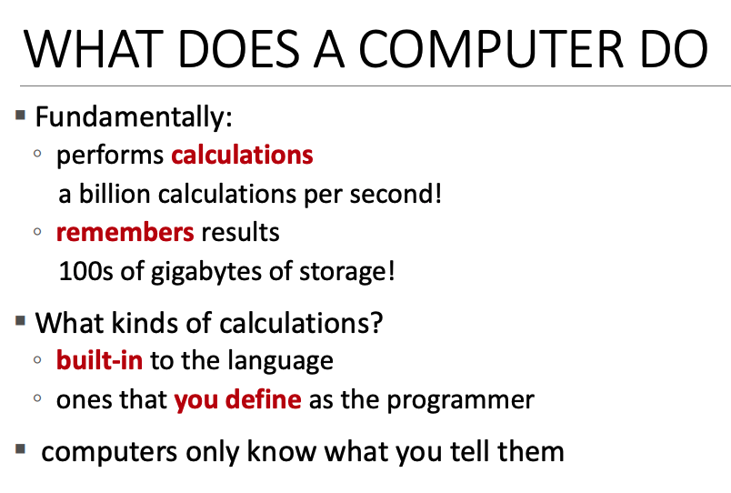
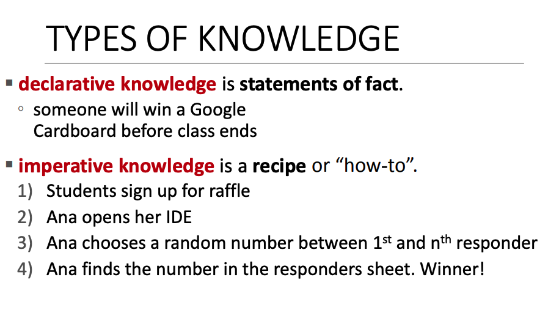
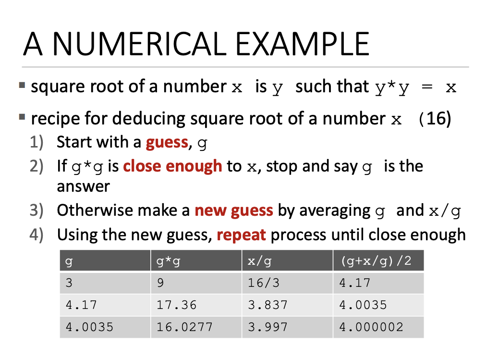
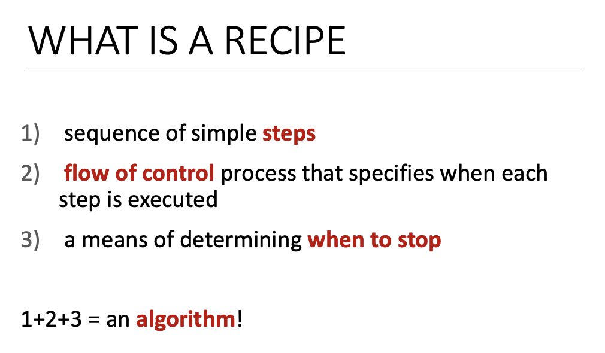
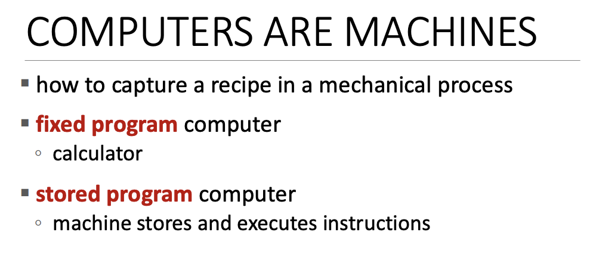
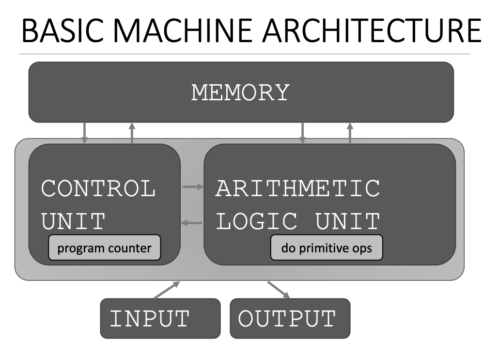
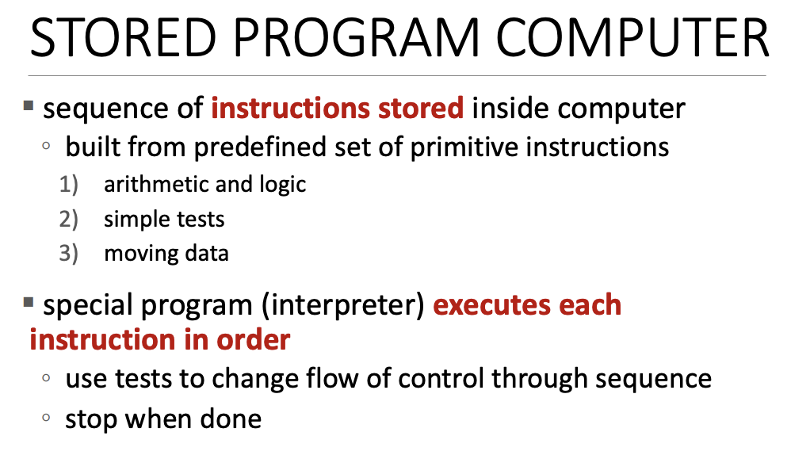
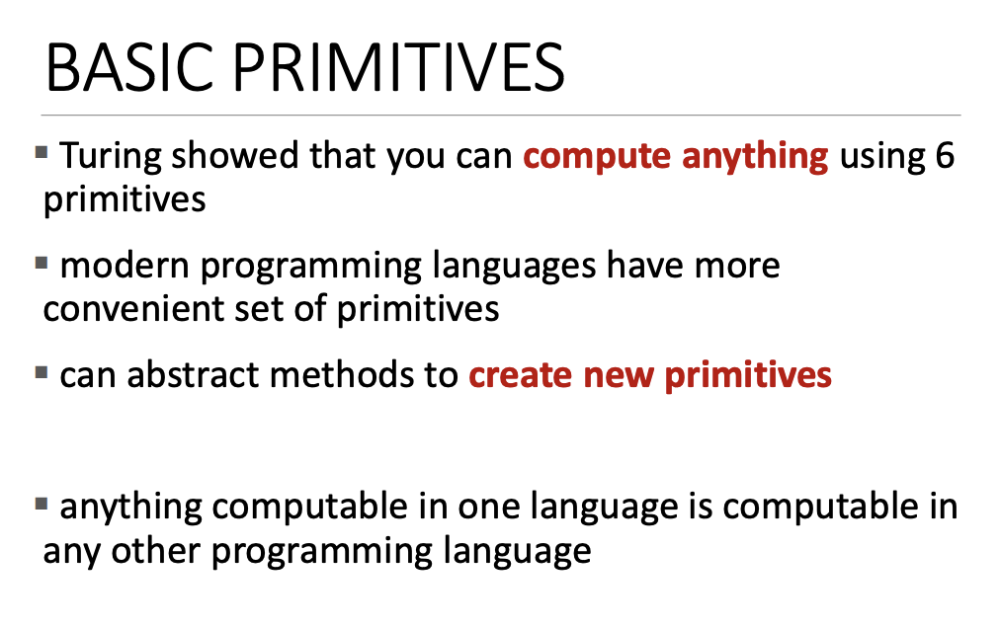
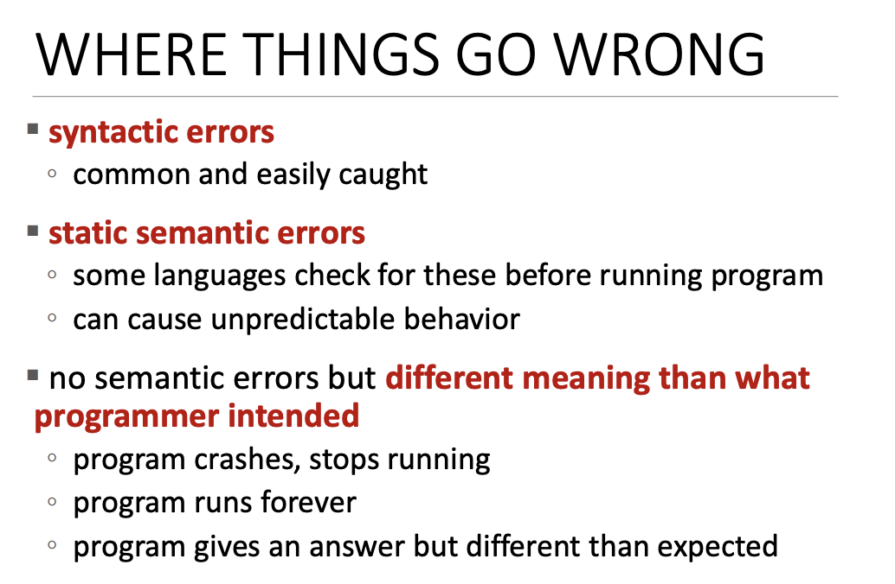

# Computation은 무엇인가?

## 컴퓨터가 하는 일



1. 계산을 수행
    - 계산을 수행하고 어딘가에 저장한다.
   1. 언어(language)에 내장된 계산
      - low level 유형
      - Ex) +, -, /, * ...
   2. 프로그래머로써 정의한 나만의 계산
   

2. 저장
    - 컴퓨터 메모리에 저장
    - 또한 컴퓨터는 결과를 기억해야 한다.

<br>

> Note : 컴퓨터는 말하는 것만 안다. 즉, 컴퓨터는 사용자가 시지한 대로만 수행한다.


## 지식의 종류



type of knowledge에는 두가지 종류가 있다.

- 선언적 지시(declarative knowledge)
    - 사실에 대한 진술로 이해 중. (statements of fact)
- 일련적 지시(imperative knowledge)
  - 레시피와 비슷.
  - `how to?`와 비슷.

<br>



**선언적 지식 예시**
```
x는 y*y 숫자 값이다.
```

하지만 컴퓨터는 이를 가지고 무엇을 해야할지 모른다. 컴퓨터는 레시피를 따라하는 방법을 안다. 예시로 잘 알려진 알고리즘을 본다. (16 제곱근을 구하는 문제)

1. g를 추측
2. (3 * 3) 9가 16에 가까운지 체크한다. 원하는 결과가 아니기 때문에 멈추지 않을 것이라고 우리는 컴퓨터에게 말하고 싶다.
3. `x / g` 같이 평균을 하여 새로운 추측을 진행한다.
4. `(g + x / g) / 2` 방식의 새로운 추측을 진행한다.
5. 처음으로 돌아가서 전체 과정을 반복한다.




그러면 여기서 레시피는 무엇인가???
1. 간단한 일련의 단계가 있다.
2. 제어 흐름을 한다.
3. 결정을 내려하나는 부분이 있다.
4. 다시 반복

레시피의 마지막 부분은 언제 멈추는지 이다. 계속해서 진행하는 프로그램을 원하지 않는다. 

이런 레시피는 알고리즘을 위해 존재한다. 컴퓨터 과학에서 알고리즘이 될 것이다. 


## 컴퓨터 유형



역사적으로 컴퓨터에는 두 가지 유형이 있다.
1. 고정 프로그램(fixed program) computer
   - 더하기, 뺴기, 나누기 등등만 가능한 계산기
2. 저장 프로그램(stored program) computer
   - 데이터를 저장할 수 있는 기계
   - 일련의 명렁을 실행할 수 있다.
   - 명령 순서를 바꿀수 있다.
   - 쉽게 요즘 컴퓨터를 의미
   - CPU는 이런 모든 결정이 일어나는 곳이다.

    
## 기본 머신 아키텍처(Basic Machine Architecture)



네 가지 중요한 부분이 포함된다.

- 메모리 (memory)
  - 데이터가 포함된다.
  - 지시의 순서(sequence of instructions)도 포함하고 있다.
- 입출력 (input, output)
- ALU (Arithmetic logic unit)
  - 모든 작업이 수행되는 곳
  - 정말 원시적인 연산이 진행 (+, -, *, /)
- 제어 장치 (Control Unit)
    - ALU에서 상호 작용하는 곳
    - 프로그램 카운터 (Program Counter)를 포함하고 있다.

<br>

**흐름**

1. 프로그램 카운터는 instructions의 첫 sequence에서 시작
2. 명령어가 무엇인지 알아내고 이를 ALU로 보냄
3. ALU는 무엇을 수행하는 작업인지 묻는다
   - 메모리에서 데이터를 얻을 수도 있다.
   - 일부 작업을 수행할 수도 있다.
   - 그리고 데이터를 다시 메모리에 저장할 수도 있다.
   - 끝이 나면 ALU는 다시 돌아간다.
4. 프로그램 카운터가 증가
5. instructions의 다음 순서로 이동
   - 명령어로 선형적(linearly)으로 진행
6. 특별한 명령어가 있을 수 있다.
   - ex) 이 값이 특정 값보다 크냐? 같은 것은 `test`라고 한다.
   - `test`는 true / false로 반환
   - 결과에 따라 다음 명령어로 넘어간다. OR 프로그램 카운터를 설정 OR 다시 맨 처음으로 돌아간다.
7. 일이 끝나면 마지막 명령을 실행한 다음 뭔가를 출력할 수도 있다.

> 이것이 컴퓨터가 동작하는 기본(basic) 방식이다.


## Stored program computer 요약



- 일련의 명령어(sequence of instructions)는 컴퓨터 내부에 저장된다.
- 사전정의된 primitive 명령이 내장되어 있다.
  - 산술(arithmetic), 논리(logic) 연산
  - 간단한 `tests`
  - 데이터 이동
- 인터프리터(interpreter)는 모든 명령(instruction)을 따른다. 
  - 다음으로 넘어갈지, 반복할지, 건너뛸지 결정한다.

## Basic Primitives



앨런 튜링(Alan Turing)은 6개의 primitives를 가지고 무엇이든 계산 (computing anything) 할수 있다고 증명했다.

- 왼쪽 이동 (move loft)
- 오른쪽 이동 (move right)
- 읽기 (read)
- 쓰기 (write)
- 스캔 (scan) 
- do nothing

이 6가지 기본 지시사항(primitives)와 테이프 조각(piece of tape)만 있으면 무엇이든 계산할 수 있음을 보여줬다. 

프로그래밍 언어(programming language)가 여기서 나온것이다. 

## 언어의 측면 (Aspects of Languages)

**Syntax (구문)**
- 구문이 유효한지 체크

```console
[English]
- "cat dog boy" -> invalid
- "cat hugs boy" -> valid

[Programming]
- "hi"5 -> invalid
- 3.2 * 5 -> valid
```

**staic semantics**
- 정적 의미를 생각해야 함

```console
[English]
- "I are hungry"  -> syntax valid, but static semantic error(문법 오류. I am ~)

[Programming]
- 3.2 * 5 -> valid
- 3 + "hi" -> static semantic error(숫자에 단어를 추가하는 것은 의미가 없음)
```

**semantics**
- 구문이 옳고 (syntactically correct) 정적 의미에 오류(no static semantics)가 없어야 한다.
- 프로그래밍 언어에서는 일련의 명령은 하나의 의미를 가진다.
  - 컴퓨터는 지시한 대로만 수행하는 것을 기억!!


## 에러



- **syntax error**
  - 가장 흔하고 쉽게 발견
- **static semantic error**
  - 몇몇 언어는 실행전에 체크 가능
- **different meaning that what programmer intended**
  - 의도와 다르게 실행하는 경우


