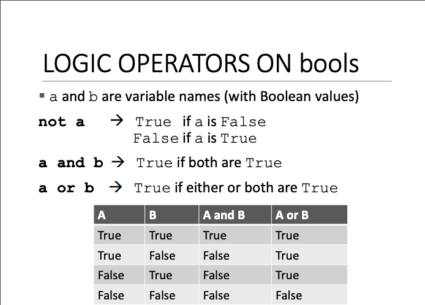

# 분기 및 반복

## String object type


- string -> 문자열
- 문자열은 문자의 시퀀스임
- 문자, 숫자, 특수문자, 공백 모두 string이 될 수 있음
- 따옴표('')나 쌍따옴표("")를 사용하여 String 객체 생성
- 변수에 등호를 사용하여 값을 할당해줄 수 있음. 변수 참조 시 해당 값을 얻어낼 수 있음.
- `+` 연산을 이용하여 string을 합칠 수 있고, `*` 를 이용하여 string 반복이 가능함.


### OUTPUT


- `+` 연산을 사용하면 공백 없이, `,` 연산을 사용하면 공백을 추가하여 print 함

```python
hi = "hello there"
name = "ana"

print(hi + name)
print(hi, name)

=========== result ============
hello thereana
hello there ana
```

### INPUT


- input을 사용하여 사용자의 입력을 받을 수 있음
- 입력을 받는 모든 것은 **문자열 형태**가 됨
- 이를 다른 타입으로 변환하고 싶다면 **casting** 해야 함
  - `num = int(input("Type a number... ))` 와 같이 캐스팅해주면, string -> int로 타입이 변환됨

### Comparison




- 같은 타입끼리 비교가 가능하며, 문자열과 숫자를 비교하려고 하면 에러 발생
- 문자열끼리 비교할 때, 사전식으로 비교됨 `ex) "a" > "b"  =>   false`


## Branching and Conditionals


- branch 관련 예시 -> 목적지까지 가는 경로 구하기
  - right가 비었다면, 오른쪽으로 가기
  - right가 막혀있다면, 앞으로 가기
  - right와 front가 막혀있다면 왼쪽으로 가기
  - right, front, left가 막혔다면 뒤로 가기
- 조건문 (`if`)를 사용하여 해당 문제를 풀어낼 수 있음! 


- \<condition> 은 True False의 값을 갖게 되며, True인 경우 내부의 식을 실행하고 False인 경우 내부의 식을 실행하지 않고 계속 프로그램을 진행
- `if`, `elif`, `else` 라는 키워드를 통해 분기문을 만들어낼 수 있음
- 조건문의 내부 식은 코드 블록 내부에 있음
  - 들여쓰기를 통해 if 코드 블록의 일부임을 표시함. 일반적으로 공백 4개를 사용
- 중첩 if문도 가능. indentation를 사용하여 코드 블록을 나눌 수 있음
- 조건문에는 `x == y`와 같은 조건식이 들어가는데, 이때 `x = y`는 불가능!
  - `=`는 할당, `==`는 비교 연산자

### 문제 예시


- 분기문을 사용하게 되면 입력값만큼 분기문을 계속 반복해주어야 함. 그렇게 되면 중첩 if문의 깊이가 엄청나게 깊어질 수 있음.
- 그러나 loop 를 사용하면 간단하게 해결 가능!


## iteration and loops

### while loop


- `while`이라는 키워드를 사용해 루프 진행
- \<condition>에는 조건식이 들어감
- 해당 조건식이 True일 경우 내부 코드 블럭을 실행하고 다시 조건식을 판단하는 과정을 반복하며, 해당 조건식이 False일 경우 루프를 중지함

### while 문제 예시


- input값이 right일 경우, while문의 조건식이 참이 되어 내부 코드 블럭을 실행함
- `n == "right`가 True 인지 판단하며 계속 loop를 수행하고, 해당 조건식이 False가 되는 순간 loop를 종료

### while, for


- 숫자로 제어하는 방법
- while 문은 카운터를 따로 만들어줘야 함
- `while True:`를 사용하게 되면 무한 루프를 돌게 할 수 있음
- for 문은 loop 변수가 존재하여 내부적으로 작동하기 때문에 카운터가 없이도 숫자로 제어가 가능함


### for loop


- \<variable>은 loop 변수로 동작
  - loop 변수의 이름은 n이 아니어도 됨. 마음대로 naming 가능
  - 정수여야 함
  - 기본값은 0으로 시작함
- \<some_num>은 범위 내의 숫자를 지정할 수 있음
- \<expression>은 표현식으로써, for loop의 내부 코드 블럭으로 작동함
  - indentation을 해주어야 내부 코드 블럭으로 인식됨

### for loop (range)


- range를 통해 for loop의 범위를 다르게 설정해줄 수 있음
- start의 기본값은 0, step의 기본 값은 1
- `range(5)`로 설정하면, stop 값이 5로 설정됨
  - start와 step은 기본값인 0과 1로 설정됨
- `range(5, 10)`로 설정하면, start 값이 5, stop 값이 10으로 설정됨
  - step은 기본값인 1로 설정됨
- `range(5, 10, 2)`로 설정하면, start 값이 5, stop 값이 10, step 값이 2로 설정됨
- for loop는 loop 변수가 stop 값보다 `작을 때까지 반복`됨
```python
mysum = 0
for i in range(5, 11, 2):
    mysum += i
print(mysum);
```
에서 loop 변수 `i`는 5, 7, 9 로 변화하며 for문이 실행됨

### break 문


- loop를 바로 종료하고 싶을 때 사용
- break 문 이후의 코드 블럭은 skip 됨
- break를 실행한 가장 안쪽에 있는 루프만 종료됨
  - 위의 코드에서 expression_b는 skip되고, while <condition_2>의 loop만 종료되어 expression_c는 실행됨


- `mysum == 5`이면 break문을 만나 for문이 종료됨

### for VS while


- for 문과 while 문 모두 `break`를 통해 종료시킬 수 있음
- for 문은 반복횟수를 알 때 유용하고, while 문은 무한 루프 시 유용함
- for 문은 카운터를 사용하고, while 문은 카운터를 사용해야하지만 직접 초기화해줘야하고 값을 증가시켜줘야 함
- for 문은 while 문으로 다시 작성 가능하지만, while 문은 for 문으로 작성하지 못할 수 있음

