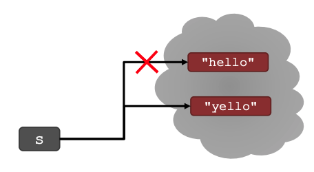

# String Manipulation, Guess and Check, Approximations, Bisection

## Strings

- 문자열의 연속(sequences of characters)이다.
- 대소문자를 구분
- 객체(Object)이다.
- 다음 작업(operations)를 수행 가능
  - 같은지 (equal)
  - 보다 작은지 (less than) 
  - 보다 큰지 (greater than)
  - ...


### Function

- 무언가를 수행할 일종의 절차(procedure)

- Ex. 문자열 길이를 알 수 있는 함수
```python
s = "abc"
len(s) # 3 
```

### Indexing 

String에서 특정 인덱스 / 위치에 값을 얻기 위해 대괄호(`[]`)를 사용한다.

컴퓨터 과학(Computer Science)에서는 컨벤션에 따라 0부터 시작한다. Python도 0부터 시작한다. -1을 가지고 인덱싱을 하는 의미는 **문자열의 마지막 문자를 원하는 의미** 이다.

<br>

```python
s[0]
```

- `s`는 indexing을 원하는 문자열
- `[0]`은 원하는 인덱스 번호


### Slice

특정 범위를 얻고 싶을 때 사용한다.

```
[start:stop:step]

[start:stop] # step 값은 default 1
```

- [String index & slice 코드](./code/string_slice.ipynb)

<br>

> `Strings`은 "immutable(불변)"이다. 일단 생성이 되면 수정할 수 없다.



- [String immutable 코드](./code/string_immutable.ipynb)


## for loops

지금까지 숫자에 대해서만 for loops를 썻지만 실제로 for loops는 모든 값(숫자 뿐만 아니라 문자열도 마찬가지) 시퀀스를 반복(iterate)할수 있다. 

[loops](./code/loops.ipynb)
[치어리더 코드](./code/cheerreader.ipynb)


## 알고리즘

### Guess And Check(추측과 확인)

- exhaustive enumeration(철저한 열거)라고 불리기도 한다.
- solution이 올바른지 체크할 때 효과적이다.
  - 정확하지 않으면 다른 값을 추측한다.
  - solution(해결책)을 찾을 때까지 체계적으로 계속 수행한다.

[Guess & Check 코드](./code/guess_check.ipynb)


### Approximate Solutions(대략적인 solution)

- 정확한 답을 원하지 않을 수 있다.
- 그저 가까운 결과를 원할 때 효과적이다.
- good enough solution
- **추측으로 시작한 다음 작은 값을 증가 시켜 진행한다.**


**주의**
- 좀 더 정확한 solution을 원하는 경우
  - step size를 정말 정말 작게 주면 된다.
  - 정말 좋은 대략적인 solution을 얻는다.
  - 그러나, 프로그램은 느려진다.
- 반대로, step size를 크게 주면 정확성 부분에선 희생한다.
  - solution에 빠르게 도달할 수 있다.

[approximate solutions 코드](./code/approximate.ipynb)

### Bisection search

- 이분법 검색을 사용
- 중간에 추측을 선택하고 추측의 절반을 제거
- 추측
  - 첫 추측 : N / 2
  - 두번째 추측 : N / 4
  - K번째 추측 : N / 2^k
- log2k만큼 추측한다.
 

[bisect search](./code/bisect.ipynb)


