# 분해, 추상화, 함수

> 오늘의 수업 주제
> - 프로그램 설계 및 코드 숨김
> - 함수
> - specification
> - `return` vs `print`
> - scope

## 코드를 작성하는 방법
### 지금까지는...
- 포괄적인 언어 메커니즘 공부
- 각 파일에 관한 연산 작성
- 파일마다의 적은 코드들
- 시퀀스 기술을 위한 코드들

### 프로그램 구성 시
- 작은 프로그램은 코드 작성이 쉬움
- 그러나 프로그램이 커지면 코드가 지저분해지기 쉬움
- 디테일한 부분을 추적하기도 어려움
- 코드를 올바른 위치에 맞게 작성하는 것이 중요!

## 좋은 프로그래밍
- 많은 코드가 좋은 것이 아님
- 프로그램에 더 많은 기능을 추가하는 것이 중요함
- 메서드를 설명할 수 있어야 함
- **분해** 및 **추상화**가 제대로 되어야 함

### 프로그래밍 예시 : 프로젝터
- 프로젝터는 블랙박스임
  - 구현 세부 사항은 사용자에게 숨겨져 있고, 입력과 출력만 알 수 있음
  - 하위 이미지에서 black box가 프로그램이라고 보면 됨
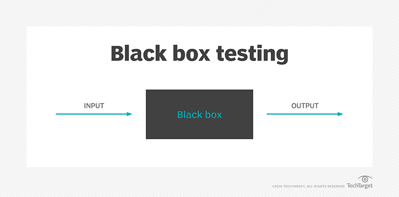

- 어떻게 동작하는지 알 수 없음
- 입력과 출력에 대한 인터페이스는 알고 있음
  - 입력을 위해서는 통신을 위한 전자 기기를 연결해야 하며, 무언가 입력을 하면 내부에서 이미지로 변환하여 돌려줌
- **추상화** : 프로젝터를 사용하기 위해 프로젝터가 작업을 처리하는 방식을 알 필요는 없음. 추상화의 개념과 일치!
- 굉장히 큰 이미지를 출력하기 위해서 큰 프로젝터를 다시 만들 필요는 없음
- 여러 개의 프로젝터에 각각 다른 이미지를 출력시키면 됨
- **분해** :  각각 다른 프로젝터는 다른 이미지를 내뱉고, 이를 합쳐 하나의 커다란 이미지를 완성 시킬 수 있음. 분해의 개념과 일치!

## 분해 설계
- 프로그램은 **모듈**을 통해 코드를 분리
- 모듈을 사용하면
  - 스스로를 포함함
  - 코드를 분리할 수 있음
  - 코드 재사용이 가능함
  - 코드를 체계적으로 유지하도록 만듦
  - 코드의 일관성 유지에 좋음
- 메서드와 클래스 또한 코드 분리(분해)를 위해 사용됨
<details>
<summary>모듈(module)이란?</summary>
- 일종의 작은 프로그램<br>
- 프로그램처럼 입력을 주면 내부에서 처리를 해서 출력하는 방식으로 동작
</details>

## 추상화 설계
- 프로그래밍에서, 추상화는 코드들을 블랙박스처럼 동작하도록 만듦
  - 세부사항을 볼수 없고,
  - 볼 필요도 없으며,
  - 보고 싶지 않고,
  - 지루한 코딩 세부 사항을 숨길 수 있음
- 메서드 규격 설명과 Doc을 통해 추상화를 할 수 있음

## 함수 (Functions)
- 코드 재사용을 위한 코드 조각들을 **functions** 이라고 부름
- 함수는 호출되기 전까지는 프로그램 내에서 동작하지 않음
- 함수의 특징
  - 이름이 있음
  - 파라미터가 있음 (0개거나 그 이상)
  - docstring이 있음 (필수는 아니나 작성하는 것이 좋음)
  - body(구현체)가 있음
  - returns(반환값)가 있음

### 함수 작성 및 호출

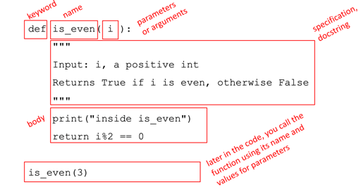

- `def` 키워드를 통해 함수를 정의
- 함수의 이름 지정, 괄호 내부에 매개변수를 지정
- 함수의 사양을 설명해주는 docstring 작성
  - 삼중따옴표(""")로 시작하며 끝남
- body 작성
- 작성한 함수를 호출할 때는, 함수의 이름과 파라미터값을 써주면 됨

### 함수 body
- 함수는 작은 프로시저나 작은 프로그램과 같고, body 안에 수행할 작업을 작성하면 됨
- 함수의 마지막에는 보통 `return` 키워드가 등장함
  - 함수 호출 시, 어떤 값을 반환할지 작성해주는 것
- 반환되거나 평가가 가능한 표현식이면 return 할 수 있음

## Scope
- 함수를 호출 할 때, 실제 파라미터 값이 형식 파라미터 위치에 바인딩 됨
```python
# 함수 정의에 쓰이는 인수를 형식 파라미터라고 부름
# 아직 값을 가지고 있지 않음
def f(x):
    x = x + 1
    print('in f(x): x = ', x)
    return x
    
x = 3
# 함수 호출 시의 인수를 실제 파라미터라고 부름
# 실제 값이 전달됨
z = f(x)
```
- `scope` = `frame` = `environment` 세 개의 단어는 같은의미이며, 함수가 호출될 때 새로 만들어짐
  - 각 scope는 완전히 다른 새로운 환경임. 변수도 다 새로 만들어줘야 함
  - 환경 종료 후, return 값은 기존 환경으로 반환됨
- scope는 객체의 이름과 매핑됨

### scope 예시
```python
def f(x):
    x = x + 1
    print('in f(x): x = ', x)
    return x
    
x = 3
z = f(x)
```

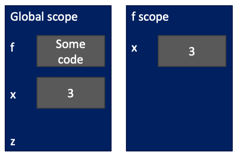
- 메인 프로그램이 시작되는 곳은 Global scope
- 메인 프로그램에서 `z = f(x)`의 코드를 통해 f라는 함수를 호출함
- Global scope에서는 f가 어떠한 코드일 뿐, 내부에 무엇이 있는지 신경쓰지 않음
- f 함수를 호출하여 f scope가 생겨나고, 호출 시 x값, 즉 3을 넘겨받아 x에 3이 바인딩됨

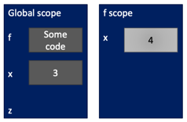
- f 함수가 실행되어 `x = x + 1` 가 실행되고, x는 3에서 4가 됨
- f scope 내에서 동작한 것이므로 f scope 내부의 x만 4로 변하고, global scope의 x는 그대로 3임

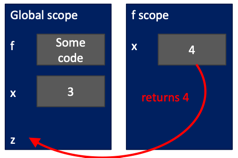
- 4를 해당 함수를 호출한 곳으로 반환함
- global scope에서 f(x)를 호출했고, 이는 z에 할당되므로 z = 4가 됨

## return 문 사용 시 주의점
- python에서는 return 값을 주지 않으면 `None`이 반환됨
- `None`은 NoneType이라는 특수 타입임. 값이 없음을 표현

## return vs print
|       | return                            | print                  |
|-------|-----------------------------------|------------------------|
| 의미    | 함수 안에서만 의미가 있음                    | 함수 바깥에서도 사용 가능         |
| 실행 횟수 | 함수 내에서 한 번만 실행 가능                 | 함수 내부에서 여러번 실행 가능      |
| 함수 지속 | return문이 실행되면 함수 내부는 더 이상 실행되지 않음 | print문 이후에도 함수는 계속 실행됨 |
| 값     | 함수를 호출한 곳과 값이 연관되어 있음             | 콘솔의 출력과 값이 연관되어 있음     |

## 매개변수에서의 함수
- 매개변수는 어떠한 타입이든 넣을 수 있는데, 심지어 메서드도 가능함
```python
def func_a():
    print('inside func_a')
def func_b(y):
    print('inside func_b')
    return y
def func_c(z):
    print('inside func_c')
    return z()
print(func_a())
print(5 + func_b(2))
print(func_c(func_a))
```
1. `print func_a()`를 실행한 모습

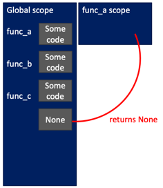

- func_a()를 호출했기 때문에 func_a의 scope가 생겨나고, func_a()의 print문이 출력됨
- 이후, func_a의 return 문이 없어 None이 return 됨
- return된 None은 func_a()를 호출한 Global scope로 반환되고, print(None)이 되어 None이 출력됨
- `print(func_a())` 실행 결과
```html
inside func_a
None
```
<hr>

2. `print(5 + func_b(2))`를 실행한 모습

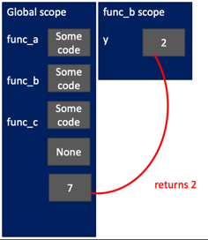

- func_b(2)를 호출했기 때문에 func_b의 scope가 생겨나고, func_b()의 print문이 출력됨
- 이후, func_b()의 매개변수로 2가 전달되어 이를 return하여 2가 return 됨
- return된 None은 func_b(2)를 호출한 Global scope로 반환되고, print(5 + 2)이 되어 7이 출력됨
- `print(5 + func_b(2))` 실행 결과
```html
inside func_b
7
```
<hr>

3. `print(func_c(func_a))`를 실행한 모습

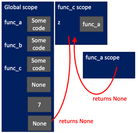

- func_c(func_a)를 호출했기 때문에 func_c의 scope가 생겨나고, func_c()의 print문이 출력됨
- func_c의 매개변수가 func_a로 전달되는데, 여기서 매개변수를 메서드로 호출했기 때문에 func_a의 scope가 생겨남
- fund_a()의 print문이 출력되고 func_a의 return 문이 없어 None이 return 됨
- return된 None은 func_a()를 호출한 func_c고 반환되고, 이를 다시 return 함
- return된 None은 func_c()를 호출한 Global scope로 반환되고 None을 출력
- `print(func_c(func_a))` 실행 결과
```html
inside func_c
inside func_a
None
```

### scope 예시 2
- 메서드 내부에서, 외부에 정의된 변수에 접근 가능
- 그러나 메서드 내부에서 외부에 정의된 변수를 수정할 수는 없음
  - `global` 변수를 사용하면 가능하지만, 권장되지 않음

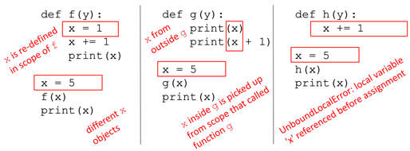

- 왼쪽 사진에서는 함수 내부 x와 외부 x가 다른 변수로 인식되고, global scope에서 print(x)를 할 경우 5가 출력됨
- 가운데 사진에서는 함수 내부에서 print(x)를 하는 경우 함수 내부의 x가 정의되어 있지 않으므로 Global scope의 x를 가져다 쓰기 때문에 5가 출력됨
- 오른쪽 사진에서는 함수 내부에서 x += 1을 하는 경우 함수 내부의 x가 정의되어 있지 않으므로 5 += 1을 실행함. 그러나 외부의 변수는 수정이 불가능하기 때문에 `UnboundLocalError` 발생!

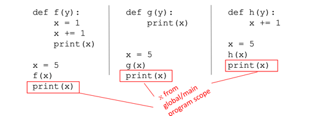

- global scope에서의 print(x)의 경우 global scope에 있는 x 값 5 출력됨

## scope 예시 3 (중첩 메서드)

```python
def g(x):
    def h():
        x = 'abc'
    x = x + 1
    print('g: x =', x)
    h()
    return x

x = 3
z = g(x)
```

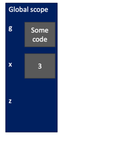

- global scope에 g 메서드가 정의되어있고, x, z 변수가 존재함

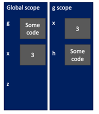

- `z = g(x)`에서 g()가 호출되어 g scope가 생겨남
- g scope 에는 h 메서드가 정의되어있고, x 변수가 존재함

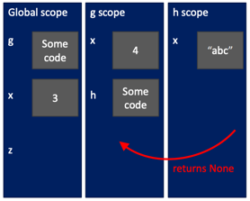

- 인자로 받은 3이 `x = x + 1`를 통해 4가 되어 x에 저장됨
- h()가 호출되어 h scope가 생겨남
- h scope 에는 abc라는 값을 가진 x 변수가 존재함
- h()는 return 값이 없어 None이 리턴되고, h scope는 사라짐

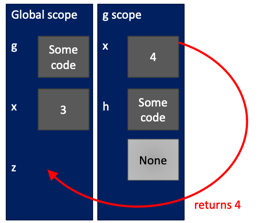

- g(x)는 4를 리턴하고, g scope는 사라짐
- z 변수에 4가 저장됨

## 분해 & 추상화
- 메서드를 한 번만 디버깅하면 해당 메서드가 잘 작동하는지 확인해볼 수 있음
- 메서드를 여러번 재사용 가능하도록 만듦
- 프로그래밍 시 분해와 추상화를 활용하면 굉장히 효율적임!