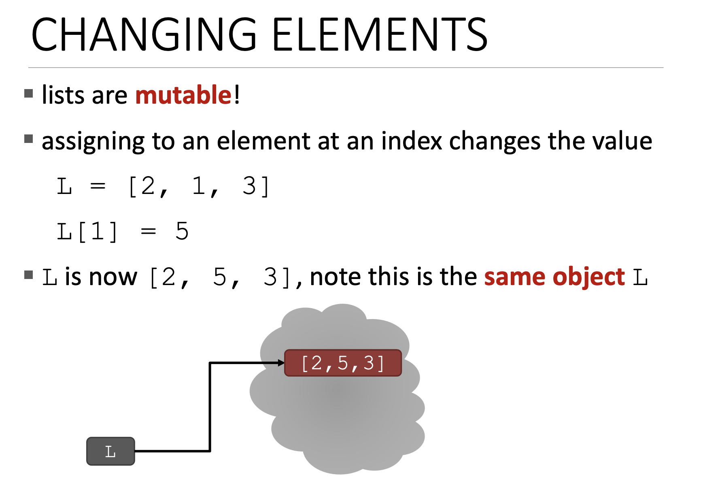
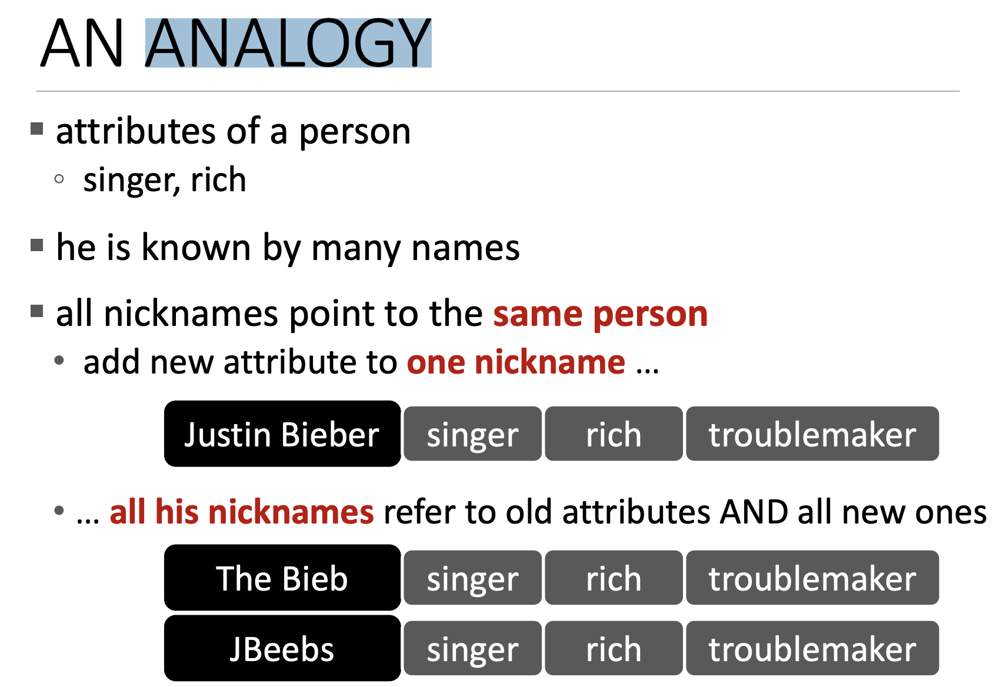
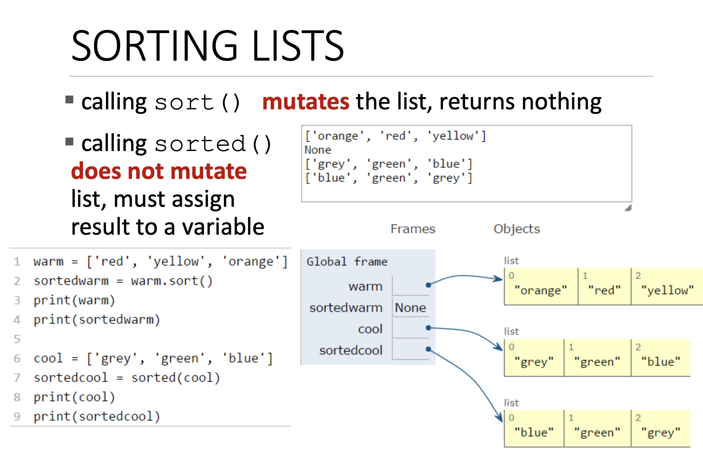
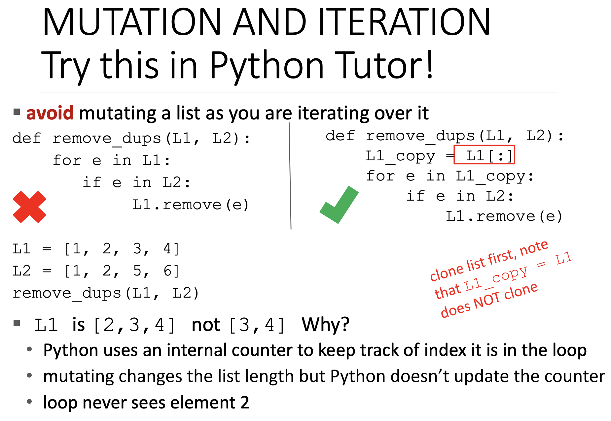

# 튜플, 리스트, 앨리어싱, 가변성, 복제

## 튜플(Tuples)

String은 일련의 문자(sequence of characters)다. 튜플은 Strings과 유사하다. 무언가의 연속(sequences of something)일 것이다. 문자의 연속이 아니면 가능하다. 

```
튜플 == collection of data(any type)
```

튜플은 불변(immutable)이다. 즉, 튜플을 생성하면 **수정할 수 없다.** 

[튜플 예시 코드](./code/tuple.ipynb)

함수에서 둘 이상의 값을 return 하고 싶을 때 튜플을 사용하면 된다. 

[튜플 활용 함수 코드](./code/get_data.ipynb)

## 리스트(Lists)

리스트는 **수정이 가능한 객체**이다. 마찬가지로 모든 유형의 요소 또는 모든 유형의 객체를 포함한다.




```python
L = [2, 1, 3]
L[1] = 5

# L = [2, 5, 3]
```

튜플과 문자열을 다룰 때에 값을 변경하려고 하면 오류가 발생했다. 하지만 리스트에서는 허용된다. 리스트의 가변성(mutability) 때문이다. 

따라서 `L`은 정확히 같은 리스트를 가리킨다. 메모리에 새로운 객체를 만들지 않았다. 단지 메모리에 있는 **동일한 객체를 수정**하고 있을 뿐이다. 


```python
total = 0
for i in range(len(L)):
    total += L[i]
print(total)
```

```python
total = 0
for i in L:
    total += i
print(total)
```

동일한 코드. 

### add

리스트에 요소를 추가하는 `add()` 메서드
- `L.append(element)`

```python
L = [2, 1, 3]
L.append(5) 

# L = [2, 1, 3, 5]
```

**`.`은 무엇인가?**
- operation으로써 사용한다.
- 함수를 적용하는 것과 같다.
- 특정 유형의 객체에 대해 지원하는 것에만 동작할 수 있다.
- 즉, 적용하려는 기능
- `.` 앞에 함수를 적용하려는 객체가 온다.

<br>

**`+` 연산**

- 더하기 연산자는 리스트를 변경하지 않는다.
- 새로운 리스트를 반환한다.

```python
L1 = [2, 1, 3]
L2 = [4, 5, 6]

L3 = L1 + L2
# L3 = [2, 1, 3, 4, 5, 6] 
# L1, L2는 변경이 되지 않음

L1.extend([0, 6]) # L1에 [0, 6]을 추가
# L1이 mutate(변이) 됨
```

### delete

- 리스트에서 일부 항목을 삭제도 할 수 있다.
- `del()`
    - 인덱스를 지정해 요소를 삭제
- `pop()`
    - 리스트의 끝 요소를 삭제
- `remove()`
    - 특정 요소를 지정해 삭제
    - 같은 값이 두 개 이상이 있으면 첫 항목만 제거

```python
L = [2, 1, 3, 6, 3, 7, 0]
L.remove(2)     # L = [1, 3, 6, 3, 7, 0]
L.remove(3)     # L = [1, 6, 3, 7, 0]
del(L[1])       # L = [1, 3, 7, 0]
L.pop()         # L = [1, 3, 7]
```

위 예시에서 `L.pop()`의 반환 값은 0이다. 

**참고**

함수는 모든 리스트를 변경(mutate)한다. 반환 값에 주의를 해야 한다. 리스트에서 값을 가져오는 것 외의 모든 함수들은 리스트를 수정한다. **함수로써** 분명히(obviously) 무언가를 반환한다. 그리고 종종 `None` 값을 반환하기도 한다. 예를들어, `L.remove(2)`를 수행하고 print 하면 아무것도 print 되지 않을 수 있다. 그런 경우엔 변수에 값을 할당할 수 없다. 


## Convert

데이터를 작업하는 데 유용하다. Ex) 문자열을 리스트로, 리스트를 문자열로

[리스트 변환](./code/convert_list.ipynb)

## 정렬

리스트는 정렬하는 데에도 유용하다.

[reverse list](./code/reverse_list.ipynb)


## 리스트 정리

- 리스트는 변경 가능
- 변수 이름이 있으면 메모리의 리스트를 가리킨다.
- 변경 가능하기에 하나 이상의 변수를 가질 수 있다.
    - 메모리에 있는 동일한 객체를 가리킨다.
- 변수가 두 개인 경우  
    - 변수 중 하나를 통해 엑세스 하면 모두 변경된 객체 값을 제공한다.
- **주의점**
    - 리스트를 다룰 때 어떤 **부작용(side effect)** 이 일어나는지 확인해야 한다.
    - 리스트를 변경하는 작업을 수행시 이런 변경으로 영향을 받을지 주의애햐 한다.


## Analogy(유추)



사람이 있다고 가정. 

- 사람은 객체이다
    - 나와 다른 사람은 서로 다른 객체이다.
    - 둘 다 사람이라는 유형(type)이다.
- 사람이 다른 속성을 가지고 있다고 가정
    - 저 사람은 가수이고 부자다.
    - 저 사람을 다양한 이름으로 **지칭**할 수 있다.
        - 이름, 예명 등등
    - 모두 같은 사람을 가리키는 별칭(aliases), 별명(nickname)이다.

리스트는 사람 객체와 같다. 별칭이 변경되면 모든 별칭이 변경된 객체를 가리킨다. 

[aliases & clone 코드](./code/alias_list.ipynb)

<br>



[sort 코드](./code/reverse_list.ipynb)

- `sort()`는 원본 리스트를 변경
- `sorted()`는 원본 리스트를 변경하지 않고 새 리스트를 반환

## 중첩 List

[nested lists](./code/nested_list.ipynb)


## 주의점 (for문 사용)



for 루프를 사용할 때 주의해야 한다.

[for 루프 주의](./code/list_for.ipynb)