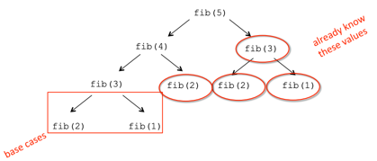

# 재귀, Dictionariry

# 6. Recursion and Dictionaries

> 오늘의 강의 주제
>1. Recursion (재귀)
>2. Dictionary
>

# 👉🏻 Recursion (재귀)

---

- 유사한 방식으로 어떠한 항복을 반복하는 과정
- 하나의 문제를 더 작은 크기의 문제로 축소하고, 그 작은 문제의 솔루션을 통해 문제를 해결하고자 함
- 계산 문제를 해결하기 위한 훌륭한 도구로써 사용됨
<details>
<summary>재귀의 다른 이름??</summary>

  `mise en abyme (미장아빔)`

  ‘심연에 밀어넣기’ 라는 뜻을 가짐

  예술이나 문학 쪽에서 많이 사용하는 용어임

  

  예술 쪽에서의 미장아빔 예시
</details>

## 재귀란 무엇인가?

---

### 알고리즘적 재귀

- 분할 정복(divide and conquer)이나 감소 정복(decrease and conquer)을 통해 문제를 해결하기 위한 방법
- 해결하려는 문제를 동일한 문제의 더 간단한 버전으로 만들고, 해결책을 찾을 때까지 이를 반복함. 이를 이용해 전체 문제를 해결하고자 함

### 의미론적 재귀

- 함수가 자신을 호출하여 참조하는 프로그래밍 기법
- 문제를 풀 수 있는 base case를 만날 경우, 문제 풀기를 중단할 수 있음. 즉, 재귀를 멈출 수 있음
- `base case`가 있는지 확인하여 무한 재귀를 피해야 함
- 큰 문제를 단순화 하는 게 목표이며, 여러 입력에 대해서도 동일하게 작동해야 함
<details>
<summary> Base case & Recursive case</summary>

  `Base case`

  같은 형태의 더 작은 부분문제가 없고, 바로 답을 알 수 있는 경우
  ex) 0!

  `Recursive case`

  재귀적으로 부분 문제를 풀 수 있는 경우
  ex) 10! 를 풀기 위해서 9!, 8!, 7! 등의 부분 문제를 만들어 풀어야 함
</details>

## Loop Algorithm → Recursion Algorithm

---

### Loop Algorithm

- while 이나 for 문을 통해 반복으로 문제를 푸는 방법
- 루프에서는 각 반복마다 갱신되는 state variables (상태 변수)를 통해 연산을 기록할 수 있음

곱하기 문제를 반복 알고리즘으로 풀어보자

1. `a * b`는 a를 b번 더한 것과 같다
2. 이를 연산하기 위해 반복 횟수(`i`)와, 현재 연산 결과(`result`)를 저장하는 state variables를 가지고 loop를 수행해야 한다

```python
def mult_iter(a, b):
    result = 0
    while b > 0:
        result += a
        b -= 1
    return result
```

`a * b`는 a 자신을 b번 더하는 것인데, 그렇다면 재귀로도 풀 수 있지 않을까?

### Recursion Algorithm

- 같은 문제를 더 간단한 버전으로 만들어 푸는 방법
- base case 를 찾아 재귀를 종료시킬 수 있어야 함

곱하기 문제를 재귀 알고리즘으로 풀어보자

1. `a * b`는 a 자신에게 a를 b-1 만큼 더한 것과 같다. 즉 `a + a * (b-1)`
2. `a + a * (b-1)`에서 `a * (b-1)`은 a 자신에게 a를 b-2 만큼 더한 것과 같다. 즉 `a + a * (b-2)`
3. 이를 반복하다 보면 base case에 도달할 수 있다. `(b-x)`가 1이 되면, `a * (b-x)`는 `a * 1`이므로 `a`이다

```python
def mult(a, b):
    if b == 1:
        return a
    else:
        return a + mult(a, b-1)
```

위와 같이 재귀를 통해 같은 문제를 하위 문제로 계속 쪼갠 후, 결과를 도출해낼 수 있음

## Factorial

---

`n! = n * (n-1) * (n-2) * … * 1`

- n = 1인 경우
    - 직접 바로 문제를 풀 수 있는 경우이므로 이는 base case임

```python
if n == 1:
    return 1
```

- n > 1인 경우
    - n! = n * (n-1)! 와 같이 생각할 수 있고, 이는 하위 문제를 도출하므로 recursive step임

```python
else:
    return n * factorial(n-1)
```

<details>
<summary>연산 과정</summary>

```python
def fact(n):
    if n == 1:
        return 1
    else:
    	return n * fact(n-1)
    
print(fact(4))
```

  

  fact(4)를 위한 scope가 생성되고, n에는 4가 바인딩됨

  4는 1이 아니므로 else문으로 가고, fact(3)을 위한 scope가 생성되고, n에는 3이 바인딩됨

  이를 반복하다 보면 n에 1이 바인딩되고, 1을 return → base case

  호출한 곳으로 return값이 반환되어 최종적으로 24라는 값을 print

- 함수의 재귀적인 호출은 각각 고유한 scope를 생성함
- 같은 메서드, 같은 변수 명이지만 다른 scope에서 각자 동작함
- return 값이 나오면, 해당 함수를 호출한 scope(이전 scope)로 전달됨
</details>

### Factorial의 비교(Iteration, Recursion)

**Iteration**

```python
def factorial_iter(n):
    prod = 1
    for i in range(1, n+1):
        prod *= i
    return prod
```

**Recursion**

```python
def fadtorial(n):
    if n == 1:
        return 1
    else:
        return n * factorial(n-1)
```

- 회귀는 더 간단하고, 직관적일 수 있음
- 회귀는 내부 변수에 대해 생각할 필요가 없기 때문에 코드 작성 시에도 효율적일 수 있음
- 그러나 회귀는 컴퓨터 연산에 있어서는, 효율적이지 않을 수 있음 → frame이 계속 생겨나기 때문
<details>
<summary>재귀 성능 올리기</summary>

- Tail Recursion (꼬리 재귀)
  - 재귀를 선형으로 처리하도록 바꿔 스택 오버플로우가 일어나지 않음
  - 컴파일러가 이를 지원해야 사용 가능함 
  - 컴파일러가 재귀를 반복문으로 해석함
  - C/C++, C# 등의 언어는 가능하나 [Java는 불가능](https://velog.io/@dldhk97/%EC%9E%AC%EA%B7%80%ED%95%A8%EC%88%98%EC%99%80-%EA%BC%AC%EB%A6%AC-%EC%9E%AC%EA%B7%80)

```c
// 재귀
int factorial(int n) {
    if (n == 1) return 1;
    return n * factorial(n - 1);
}
        
// 꼬리 재귀
int factorial(int n, int total) {
    if (n == 1) return total;
    return factorial(n - 1, total * n);
}
```
</details>

## 귀납적 추론 & 수학적 귀납법

---

### 귀납적 추론 (Inductive Reasoning)

- 개별적인 사실들로부터 일반적인 결론/원리를 이끌어내는 추론 방식
- 귀납적 추론을 통해 재귀 코드가 작동할지 안할지 알 수 있음

```python
# 반복
def mult_iter(a, b):
    result = 0
    while b > 0:
        result += a
        b -= 1
    return result

# 재귀
def mult(a, b):
    if b == 1:
        return a
    else:
        return a + mult(a, b-1)
```

1. 반복을 통한 곱하기 연산
    - b가 양수이고, 매 루프마다 b는 1씩 감소하기 때문에 결국 1보다 작아지므로 해당 loop 문은 종료됨
2. 재귀를 통한 곱하기 연산
    - b = 1인 경우, 재귀적 호출 없이 종료됨
    - b > 1인 경우, b는 1씩 감소되어 점점 작아지고 결국 1이 되어 종료됨

### 수학적 귀납법 (Mathematical Induction)

- 프로그램에 대해 생각할 수 있는 좋은 방법
- 수학적 귀납법이 성립되면, 해당 코드가 작동됨을 유추할 수 있음
- 정수로 색인(index)된 표현식이 참임을 증명해야 함

```python
n의 가장 작은 값이 일반적으로 0 또는 1과 같음을 증명
또한, 임의의 n 값, n+1 값에 대해서도 참이라는 것을 증명해야 함
=> 두가지 증명이 참이라면 무한한 n 값에 대해서도 해당 식이 성립됨을 추론 가능!

0 + 1 + 2 + 3 + ... + n = (n(n+1))/2 을 증명해보자
1. n = 0이면, 좌변은 0이고 우변은 0*(0+1)/2 = 0이므로 참이다
2. 임의의 k에 대해 참이라고 가정할 때, k+1도 참임을 증명해야 한다.
	0 + 1 + 2 + 3 + ... + k + (k+1) = ((k+1)(k+2))/2
	좌변은 k(k+1)/2 + (k+1) = (k^2+3k+2)/2 이다.
	(k^2+3k+2)/2는 ((k+1)(k+2))/2와 같기 때문에 해당 식도 성립된다.

결국 모든 n의 값에 참일 것이라는 결론을 도출해낼 수 있다!
```

### 위의 논리가 중요한 이유는?

```python
def mult(a, b):
    if b == 1:
        return a
    else:
        return a + mult(a, b-1)
```

위와 같은 코드에서 base case에 대해 참임을 증명하고, b > 1인 경우(회귀 적용)에도 b가 점점 줄어들어 결국 옳은 답을 낸다는 것을 추론할 수 있음

결국, 재귀는 문제의 더 작은 버전이 답을 제공한다고 가정하고 푸는 것이며 위와 같은 귀납적 사고를 통해 해당 코드가 올바른 결과를 내는지 확인해봐야 함!

<details>
<summary>귀납적 추론 vs 연역적 추론</summary>

  - 연역적 추론은 일반적인 사실을 전제로, 개별적인 여러 사실들에 적용시키는 추론 방식
    - ex) '모든 인간은 죽는다' > '소크라테스는 인간이다' > '그러므로 소크라테스는 죽는다’

  - 귀납법은 구체적 사실에서 일반적인 법칙을 이끌어내고, 연역법은 일반적인 원리에서 구체적인 사실을 이끌어냄 
    - ex) 프랑스 군대의 탱크가 폴란드 국경에 배치되었다, 독일 군대의 탱크가 폴란드 국경에 배치되었다, 러시아 군대의 탱크가 폴란드 국경에 배치되었다 > 폴란드가 여러 나라로부터 침략당할 것이다
</details>

## 하노이의 탑

---

- 세 개의 작대기에 디스크들이 넓은 순으로 꽂혀져 있고, 이를 같은 모양으로 다른 작대기에 옮겨야 하는 문제
- 재귀적으로 생각해본다면?
    - 크기 n의 탑을 이동한다면, n-1 크기의 탑을 여분의 작대기에 옮기고 맨 아래의 디스크를 결과 작대기에 옮긴 후, n-1 크기의 탑을 결과 작대기에 옮기면 됨
    - 더 작은 크기의 n-1을 가진 탑 또한 같은 방식으로 동작
    - n-2, n-3 … 모두 더 작은 문제이지만 같은 방식으로 동작

```python
def printMove(fr, to):
    print('move from ' + str(fr) + ' to ' + str(to))

def Towers(n, fr, to spare):
    if n == 1:
        printMove(fr, to)
    else:
        Towers(n-1, fr, spare, to)
        Towers(1, fr, to, spare)
        Towers(n-1, spare, to, fr)
```

1. 옮겨야 할 디스크가 1개이면 종료
2. 옮겨야 할 디스크가 2개 이상이면, n-1 크기의 탑을 여분의 작대기에 옮기고 맨 아래의 디스크를 결과 작대기에 옮긴 후, n-1 크기의 탑을 여분의 작대기에서 결과 작대기로 옮기면 됨

   ⇒ 위의 재귀적으로 생각했던 알고리즘이 코드로 그대로 구현된 것을 확인할 수 있음


## Fibonacci

---

- 피보나치가 피보나치 수열과 함께 예시로 토끼 문제 제시
    1. 토끼 한 쌍이 태어남
    2. 태어난 토끼 한쌍은 두달 뒤부터 매달 한 쌍의 토끼를 낳음
    3. 새로 태어난 토끼쌍들도 2번의 규칙을 따르며, 토끼는 죽지 않음
    4. n달이 지나면, 몇 마리의 토끼쌍이 생겨나겠는가?

1달 후


2달 후


3달 후


몇 달 후


- 위와 같은 문제를 어떻게 풀어낼 수 있을까?
    1. 1달 후에는 1쌍
    2. 2달 후에는 1쌍 (임신한 상태)
    3. 3달 후에는 2쌍 (1쌍만 임신한 상태)
    4. 이를 공식화하면, females(n) = females(n-1) + females(n-2)
    5. 모든 암컷은 n-2째 달에, n째 달의 토끼쌍을 낳고, n-1째 달의 토끼쌍 수를 더해 총 토끼쌍 수를 구하는 연산임

```python
def fib(x):
    if x == 0 or x == 1:
        return 1
    else:
        return fib(x-1) + fib(x-2)
```

1. fib(0) = 1, fib(1) = 1 ⇒ base case
2. fib(n) = fib(n-1) + fib(n-2) ⇒ recursion step

## Palindrome (회문)

---

- 회문이란, 앞에서부터 읽으나 뒤에서부터 읽으나 같은 단어/어구임
    - ex ) `Able was I, ere I saw Elba`, `Are we not drawn onward, we few, drawn onward to new era?`
- 재귀적으로 생각해본다면?
    - 문자열의 길이가 0이거나 1이면 회문임 ⇒ base case
    - 그렇지 않으면, 첫번째 글자와 마지막 글자가 동일하고 가운데 문자열이 회문이면 해당 문자열은 회문임 ⇒ recursive step
    - 가운데 문자열이 회문인지 확인할 때도 위의 과정을 반복

```python
def isPalindrome(s):

# 문자열 정리 (소문자 변환, 공백 및 특수문자 제거)
def toChars(s):
   s = s.lower()
   ans = ''
   for c in s:
        if c in 'abcdefghijklmnopqrstuvwxyz':
            ans = ans + c
   return ans

# 회문 판별
def isPal(s):
    if len(s) <= 1:
        return True
    else:
        return s[0] == s[-1] and isPal(s[1:-1])

    return isPal(toChars(s))
```

- 재귀로 해결!

## 분할 정복 (divide & conquer)

---

- 분할 정복 알고리즘
- 어려운 문제를 더 작은 문제들로 나누어서 생각함
- 더 작은 문제들은 큰 문제보다 풀기가 쉽고, 작은 문제의 풀이를 통해 큰 문제도 풀이함

# 👉🏻 Dictionary

---

- key와 value를 한 쌍으로 갖는 자료형

## Compound Data Type (복합 데이터 타입)

---

- 여러 값이나 여러 데이터 타입으로 이루어진 데이터 타입
- Dictionary 은 Compound Data Type 중 하나임
- List, Set, Tuple, Struct(C/C++) 또한 복합 데이터 타입임

## List 와의 차이

---

```python
name = ['Ana', 'John', 'Denise']
grade = ['B', 'A+', 'A']
course = [2.00, 6.0001, 20.002]
```

- 각각의 요소를 다른 리스트에 넣고, 같은 index에 있는 요소들을 하나의 묶음으로 봄
- 이는 종류가 많아질수록 코드가 지저분해지고, 리스트도 많아지며, 항상 같은 묶음의 정보들은 같은 인덱스에 존재해야한다는 단점이 존재
- 더 좋은 방법은 **Dictionary**를 사용하는 것!


- List는 int로 색인이 되고, 이에 요소가 할당됨
- Dictionary는 Key로 색인이 되고, 이에 value가 할당됨

## Dictionary 사용

---

- Dictionary 선언

```python
# 빈 Dictionary
my_dict = {}

# key + : + value로 key와 value 쌍을 만들어 냄
grades = {'Ana':'B', 'John':'A+', 'Denise':'A'}
```

- value 얻기 `{dictionary name}[{key}]`

```python
grades['John']

==== result ====
'A+'
```

```python
# dictionary에 없는 키를 찾을 때
grades['abcd']

==== result ====
# KeyError 발생!!
KeyError  Traceback (most recent call last)
Cell In[4], line 1
----> 1 grades['abcd']

KeyError: 'abcd'
```

- 항목 추가 `add`

```python
grades['Sylvan'] = 'A'
```

- key 존재 여부 확인 `{key} in {dictionary name}`

```python
# 존재할 경우
'John' in grades

==== result ====
True
```

```python
# 존재하지 않을 경우
'Daniel' in grades

==== result ====
False
```

- 항목 삭제 `del`

```python
del(grades['Ana'])
```

- key 목록 조회 `keys()`
    - 튜플처럼 key의 일련/연속을 출력함
    - 요소들의 순서가 정해져있지 않음

```python
grades.keys()

==== result ====
dict_keys(['Ana', 'John', 'Denise'])
```

- value 목록 조회 `values()`
    - 튜플처럼 value의 일련/연속을 출력함
    - 요소들의 순서가 정해져있지 않음

```python
grades.values()

==== result ====
dict_values(['B', 'A+', 'A'])
```

## Dictionary의 Key, Values

---

|  | Key | Value                                                                    |
| --- | --- |--------------------------------------------------------------------------|
| 형태 | 불변 타입만 가능<br/> int, float, string, tuple, bool 등 <br/>(float은 부동소수점이므로 동일성 확인에 까다로우므로 권장하지 않음) | 어떤 타입이든 가능함<br/>list, dictionary 와 같은 데이터 타입도 상관없음 |
| 중복성 | 중복 불가능<br/>유니크 해야 함 | 중복 가능 |
| 순서 | 키 값 쌍에는 정해진 순서가 없음 | 키 값 쌍에는 정해진 순서가 없음                                                       |

## List 와의 차이 2

---

### List

- 요소들의 순서가 있음
- 정수 색인(index)을 통해 요소들을 검색함
- 색인은 순서가 있으며, 정수로 이루어져 있음

### Dictionary

- key와 value가 한 쌍으로 연결되어 있음
- 하나의 요소를 이용하여 그 쌍의 요소를 찾아냄
- 순서가 없음
- key는 불변 타입으로 이루어져야 함

## Dictionary 사용 예시

---

### 노래 가사에 가장 많이 등장하는 단어 찾기

- Dictionary 생성
    - lyrics를 받아 해당 단어가 dictionary에 들어있으면 value 증가
    - 들어있지 않으면 value를 1로 설정
    - dictionary 반환

```python
def lyrics_to_frequencies(lytics):
	myDict = {}
	for word in lyrics:
		if word in myDict:
			myDict[word] += 1
		else:
			myDict[word] = 1
	return myDict
```

- Dictionary 사용
    - dictionary의 value 중, 가장 큰 값을 찾고 해당 값을 갖고 있는 key를 찾아냄
    - 가장 많이 등장한 단어 리스트와 빈도 수 반환됨

```python
def most_common_words(freqs):
	values = freqs.values()
	best = max(values)
	words = []
	for k in freqs:
		if freqs[k] == best:
			words.append(k)
	return (words, best)
```

- 일정 빈도 수 이상인 단어들 출력
    - 단어 등장 횟수가 minTimes 이상이면 result에 추가
    - 해당 단어들 dictionary에서 삭제하고 반복
    - 더 이상 minTimes번 이상 등장한 단어가 없으면 result 반환

```python
def words_often(freqs, minTimes):
    result = []
    done = False
    while not done:
        temp = most_common_words(freqs)
        if temp[1] >= minTimes:
            result.append(temp)
            for w in temp[0]:
                del(freqs[w])  #remove word from dict
        else:
            done = True
    return result
```

### Fibonacci에의 적용

- 피보나치를 계산하는 것은 굉장히 비효율적임
    - 이미 계산하여 값을 알고있는데도 다른 곳에서는 또 연산을 수행해야 함
    - 수가 커질 수록 비효율적



- Dictionary를 활용한다면??

```python
def fib_efficient(n, d):
    if n in d:
        return d[n]
    else:
        ans = fib_efficient(n-1, d)+fib_efficient(n-2, d)
        d[n] = ans
        return ans
        
d = {1:1, 2:2}
```

- 이미 값을 연산했는지 검색하고, 연산한 값들은 dictionary에 기록 **⇒ memoization**
- 34의 피보나치를 얻기 위해서는 기존 코드였다면 1100만번이 넘는 연산이 필요하지만, dictionary를 이용한 코드에서는 65번의 연산으로 가능
- dictionary는 데이터의 저장뿐만 아니라 중간 값이 변경되지 않을 때 활용하면 좋음

<aside>
💡 큰 문제를 동일한 문제의 작은 버전으로 나누는 재귀
재귀에서 dictionary를 도구로써 제대로 활용한다면, 더욱 효율적인 프로그램을 만들어낼 수 있음!
</aside>


<br>
<details>
<summary>용어들</summary>

- `state variables`
  - 시스템 상에서 계산 상태를 알려주는 하나 이상의 변수
- `flow of control`
  - 프로그램에서 실행되는 명령어나 함수가 호출되는 순서
  - 순차 실행, 분기, 반복 등의 종류가 있음
</details>