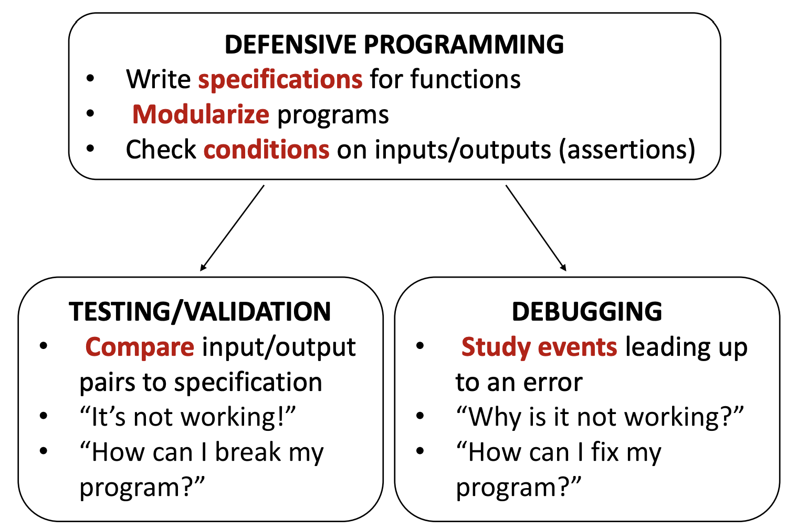
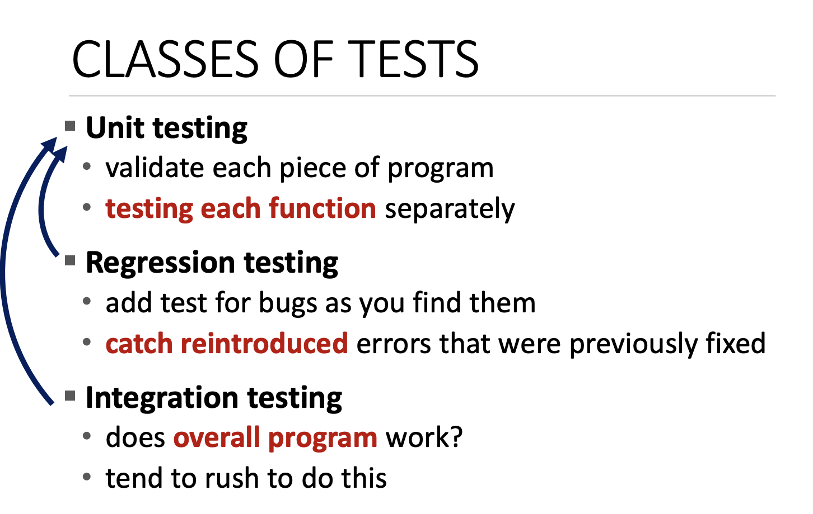
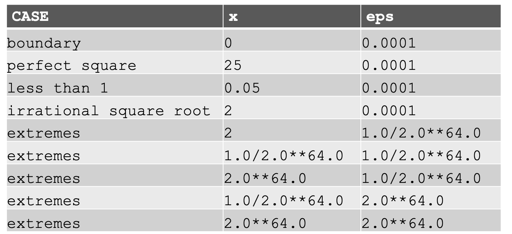
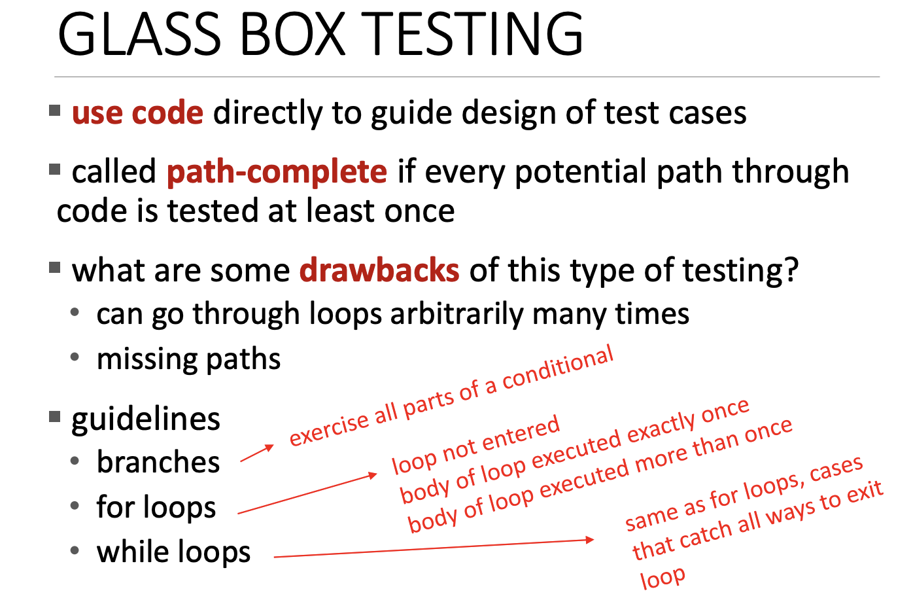
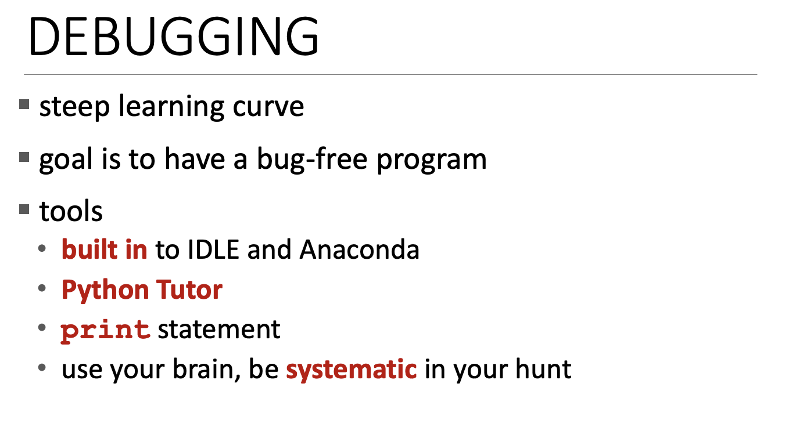
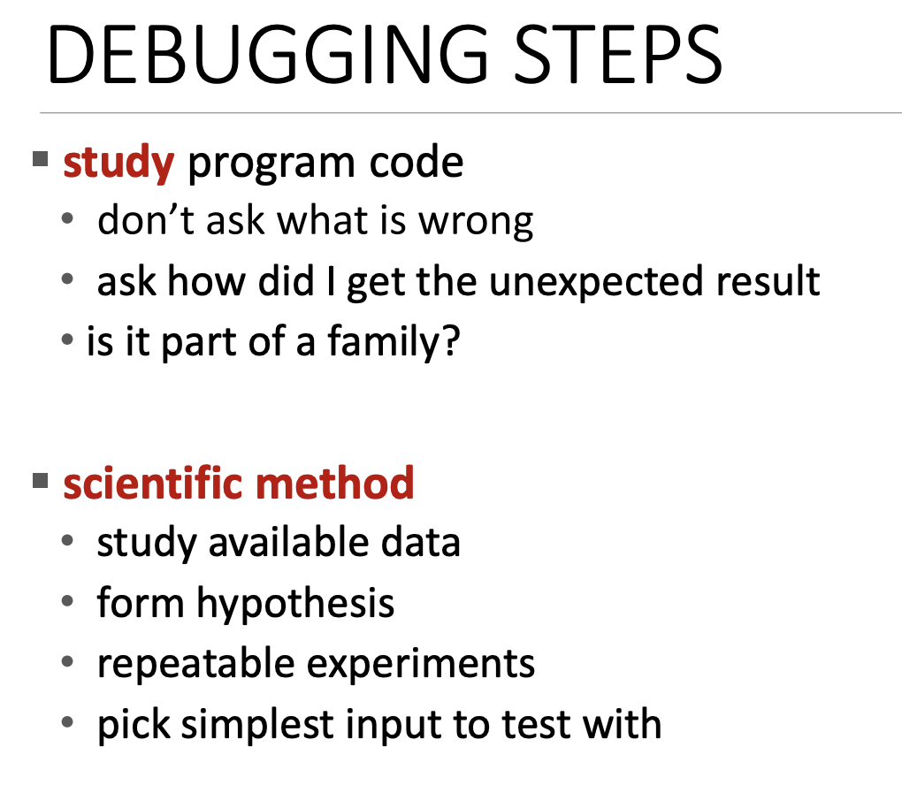
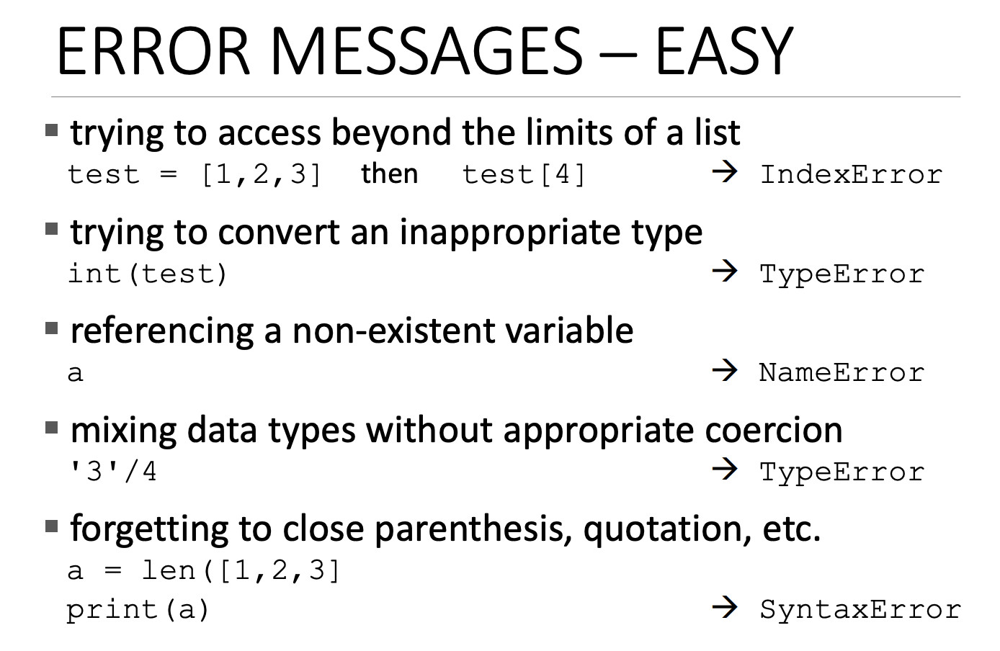
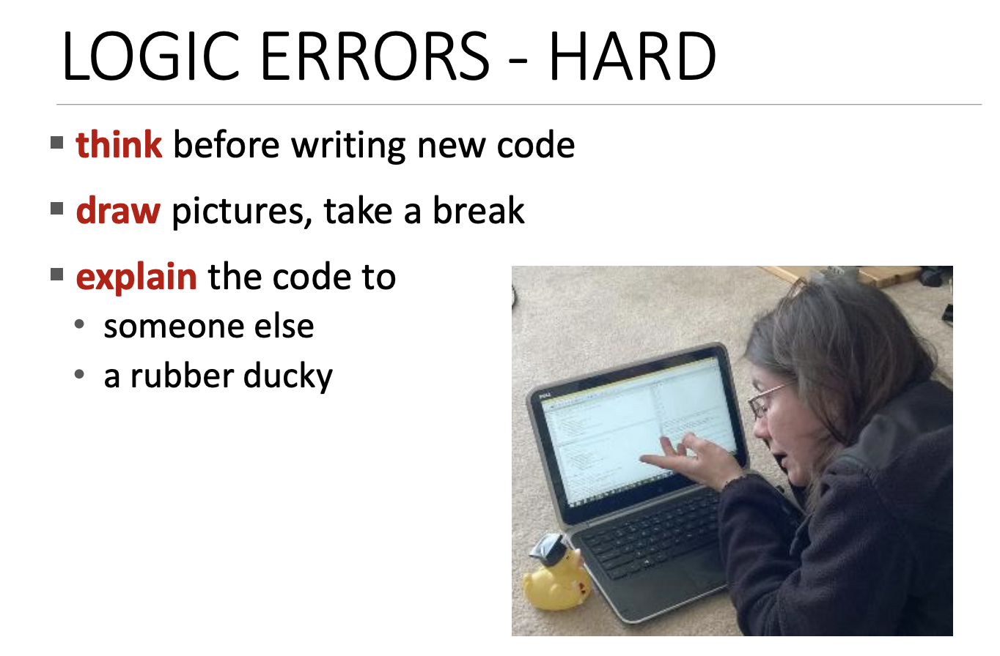
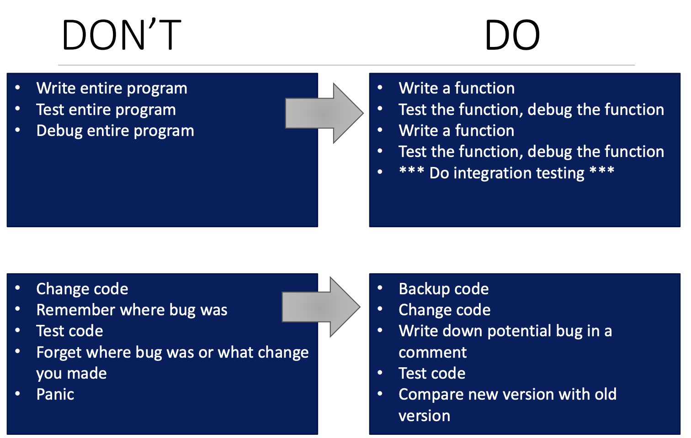
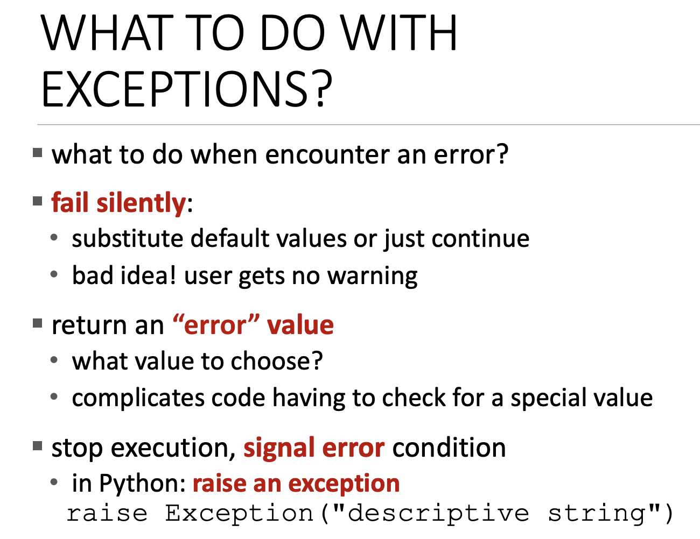

# 테스트, 디버깅 예외 및 어설션

## 예시

수프를 만드는 과정 중에 벌레들이 온 상황을 컴퓨터 프로그래밍과 비교

- 수프를 확인하는 것 == `테스팅`
- 뚜껑을 닫은 채로 유지 하기 == `방어 프로그래밍`
- 주방 청소 == 실제 프로그래밍에선 매우 어려운 방법

> 모든 것은 방어(defensive) 프로그래밍 태도에서 시작한다. 그리고 이는 분해와 추상화 개념으로 돌아온다. 

## 테스트, 디버깅



모듈식 프로그램을 작성한 후 테스트를 해야 한다.

**테스트**

1. 입력이 무엇인지?
2. 기대하는 결과가 무엇인지?
3. 그런 다음 프로그램을 실행
4. 원하는 결과가 나오지 않으면 디버깅 단계로 이동


**디버깅**

실제로 프로그램이 충돌한 이유 혹은 원하는 답이 나오지 않은 이유를 알아내는 단계

**쉽게 디버깅을 할 수 있는 설정**
- 코드를 모듈식으로 작성
- 최대한 많은 함수 작성
- 문서 작성
- 제약조건을 문서화

<br>

```
1. 프로그램이 실행되는지 확인해야 한다. 
2. 구문 오류와 정적 오류를 제거한다.
    - 프로그래밍 언어에서 쉽게 잡아낸다.
3. (입력, 출력)의 쌍을 가지고 테스트
```

## 테스트 종류



- 단위(Unit) 테스트
    - 함수(기능)들을 테스트
- 회귀(Regression) 테스트
    - 단위 테스트시 결과가 나오지 않을시 하는 테스트
    - 버그를 발견한 테스트 케이스를 기억하고 코드의 다른 부분 전체를 실행
- 통합(Integration) 테스트
    - 프로그램 전체를 테스트
    - 전반적으로 작동하는지 테스트

> 단위 테스트 -> 회귀 테스트 -> 통합 테스트 중 버그가 발견하면 다시 돌아가서 진행

## 블랙 박스 테스트

- 기능에 대한 사양(독, 문서)를 기반으로 테스트

```python
def sqrt(x, eps):
    """ Assumes x, eps floats, x >= 0, eps > 0
    Returns res such that x-eps <= res*res <= x+eps """
```

위와 같은 문서를 보고 테스트 사례들을 알아내는 것이다. 블랙 박스 테스트의 장점으로 이 기능을 구현한 사람은 누구든지 구현할 수 있다. 


**테스트 케이스 예시**



> 중요한 것은, 구체적인 사양에 대해서만 테스트 사례를 만드는 것!


## 유리 박스 테스트



- 가능한 모든 것을 통과하는 케이스의 입력 조합

**가이드라인**

- 모든 분기문을 테스트
    - 조건 테스트
- for 루프문 테스트
    - 루프 적용 및 미적용 테스트
- while 루프 테스트
    - while을 벗어날 수 있는 방법을 모두 테스트

## 디버깅



- 학습 곡선이 있음
- 목표는 버그 없는 프로그램을 갖는 것
- IDE 사용
- `print` 사용
    - 함수 내부에
    - 파라미터 출력 등등

### 디버깅 스텝



- 일반적인 디버깅 단계는 프로그램 코드를 연구하는 것
- 일종의 과학이기 때문에 가설을 세워보기

### 에러 메시지



- 디버깅 하는 동안 에러 메시지가 표시된다.
- 이런 메시지는 실제로 알아보기 쉽다.



- 반대로 논리 오류는 어려운 부분이다.
- 많은 시간을 갖는다.
    - 코드를 더 생각
    - 그림을 그리기
    - 코드 설명

## 요약

- 디버깅과 테스트시 할 일과 하지 말아야할 일 요약



**Don't**

- 전체 프로그램 작성
- 코드를 막 변경하기


**Do**

- 단위 테스트 수행
- 회귀 테스트, 통합 테스트로 단위를 늘리기
- 코드 백업
    - 수정하지말고 복사본 저장
    - 문서화


## 예외 처리

[예외 처리 코드](./code/error-handle.ipynb)


**`else`**

- `try` 블럭의 코드가 실행이 완료되고 예외없이 마쳤을 시 실행되는 블럭


**`finally`**

- 항상 실행되는 블럭

<br>


**예외 후 상황 처리**



1. 조용히 실패하기
2. 오류 값 리턴
3. 오류 신호 알리기

```python
# raise 구문
# raise <exceptionName>(<arguments>)
raise ValueError("Invalid")
```

## Assertions

- 방어 프로그램의 좋은 예시
- 일반적으로, 함수 시작 부분과 끝에 "기대하는 것과 일치"를 확인하는 데 사용됨

```python
def avg(grades):
    assert not len(grades) == 0, 'no grades data'
    return sum(grades) / len(grades)
```

- `assert`가 거짓이면 함수는 계속되지 않는다.
- 함수의 전제 조건, 사후 조건을 확인하는 데 좋다.
